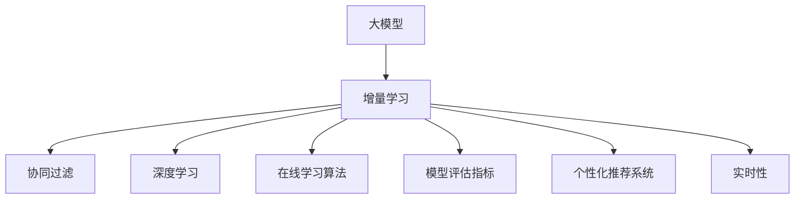
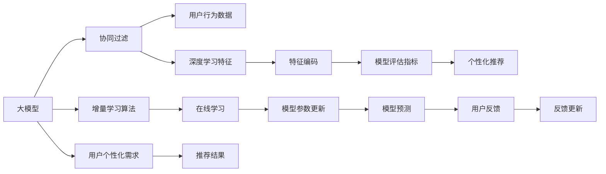

                 

# 搜索推荐系统的增量学习：大模型的持续适应机制

> 关键词：搜索推荐系统, 增量学习, 大模型, 持续适应机制, 在线学习, 协同过滤, 深度学习, 实时性, 用户行为分析, 广告定向, 个性化推荐, 个性化搜索

## 1. 背景介绍

### 1.1 问题由来

随着互联网技术的飞速发展，搜索引擎和推荐系统已成为我们日常生活的重要组成部分。从日常生活中购物、旅游、阅读到工作中的邮件、文档、会议，我们都能通过搜索引擎和推荐系统获取所需的精准信息。

然而，由于用户需求和行为的多样性和动态性，传统的搜索引擎和推荐系统面临着诸多挑战：

1. **个性化需求差异**：用户的搜索和推荐行为具有高度的个性化特征，难以用单一的模型进行全面覆盖。
2. **数据分布漂移**：用户行为和查询需求随着时间推移会不断变化，现有的推荐模型难以捕捉到最新的行为模式。
3. **计算资源瓶颈**：大规模数据集和复杂模型的训练、推理需要巨量的计算资源，难以适应在线实时性需求。
4. **隐私和数据安全**：搜索推荐系统需要收集和分析用户数据，如何确保数据隐私和安全，是一个重要的问题。

为应对这些挑战，近年来，深度学习技术在搜索推荐系统中得到了广泛应用。其中，大模型、增量学习等技术手段的引入，为搜索引擎和推荐系统带来了新的突破。

### 1.2 问题核心关键点

增量学习（Online Learning）是大模型在实时搜索引擎和推荐系统中广泛应用的核心技术。其主要思想是：通过在线更新的方式，不断调整模型参数，使其能够适应新的数据和行为模式。增量学习技术在深度学习中通常指模型通过迭代学习，在不重新训练整个模型的情况下，基于新样本更新模型参数，以提高模型对新数据的适应性。

增量学习的核心目标是在保证模型性能的同时，减少计算资源消耗和数据更新频率，确保系统的实时性和高效性。以下是大模型增量学习的基本框架和步骤：

1. **数据准备**：收集用户行为数据，包括搜索记录、点击数据、浏览历史等。
2. **模型初始化**：选择或训练一个适合任务的预训练模型，如BERT、GPT等。
3. **在线学习**：根据新数据更新模型参数，以适应最新的行为模式。
4. **模型评估**：定期评估模型的性能，通过指标如AUC、点击率等衡量模型的效果。
5. **模型优化**：根据评估结果调整模型结构或参数，进行迭代优化。

增量学习的应用使得大模型能够更好地适应用户行为变化，提升推荐效果和搜索精度，同时在在线环境中实现高效实时部署。

## 2. 核心概念与联系

### 2.1 核心概念概述

为更好地理解大模型在搜索推荐系统中的增量学习机制，本节将介绍几个关键概念：

- **大模型（Large Model）**：以BERT、GPT等为代表的大规模深度学习模型，通过在大规模数据上预训练，获得丰富的语言知识和领域知识。
- **增量学习（Online Learning）**：通过迭代更新模型参数，使得模型能够在线适应新数据的方法。
- **协同过滤（Collaborative Filtering）**：推荐系统中常用的用户行为预测技术，利用用户历史行为数据进行推荐。
- **深度学习（Deep Learning）**：通过多层次神经网络结构，学习到抽象的特征表示，广泛应用于图像、语音、自然语言处理等领域。
- **在线学习算法（Online Learning Algorithms）**：如随机梯度下降（SGD）、Adagrad、Adam等，能够高效地在线更新模型参数。
- **模型评估指标（Model Evaluation Metrics）**：如准确率、召回率、AUC、点击率（CTR）等，用于衡量模型性能。
- **个性化推荐系统（Personalized Recommendation System）**：根据用户个性化需求，推荐感兴趣内容，提高用户体验的系统。
- **实时性（Real-time）**：在用户请求到来时，即时响应的能力，是增量学习系统的重要特征。

这些概念之间的关系可以通过以下Mermaid流程图来展示：



该流程图展示了增量学习在大模型推荐系统中的关键作用：

1. 大模型通过协同过滤和深度学习，学习用户行为和领域知识。
2. 增量学习通过在线学习算法，不断调整模型参数，适应新数据。
3. 模型评估指标衡量推荐效果，指导模型优化。
4. 个性化推荐系统根据用户需求，生成个性化推荐。
5. 实时性确保系统即时响应，满足用户即时需求。

### 2.2 核心概念原理和架构的 Mermaid 流程图(Mermaid 流程节点中不要有括号、逗号等特殊字符)



该流程图详细展示了增量学习在大模型推荐系统中的工作流程：

1. 大模型从协同过滤和深度学习中提取用户行为特征。
2. 模型评估指标衡量推荐效果。
3. 个性化推荐系统根据用户需求生成推荐结果。
4. 增量学习算法通过在线学习更新模型参数。
5. 模型参数更新后，重新进行预测。
6. 用户反馈进一步优化模型。
7. 用户个性化需求驱动模型优化。

## 3. 核心算法原理 & 具体操作步骤

### 3.1 算法原理概述

增量学习（Online Learning）是大模型在搜索引擎和推荐系统中广泛应用的核心技术。其核心思想是通过迭代更新模型参数，使得模型能够在线适应新数据，同时保持计算效率和实时性。

增量学习的目标是在保证模型性能的同时，减少计算资源消耗和数据更新频率，确保系统的实时性和高效性。主要分为以下步骤：

1. **数据准备**：收集用户行为数据，包括搜索记录、点击数据、浏览历史等。
2. **模型初始化**：选择或训练一个适合任务的预训练模型，如BERT、GPT等。
3. **在线学习**：根据新数据更新模型参数，以适应最新的行为模式。
4. **模型评估**：定期评估模型的性能，通过指标如AUC、点击率等衡量模型的效果。
5. **模型优化**：根据评估结果调整模型结构或参数，进行迭代优化。

### 3.2 算法步骤详解

增量学习的具体实现步骤如下：

1. **数据采集与预处理**：
   - 收集用户历史行为数据，如搜索记录、点击数据、浏览历史等。
   - 对数据进行清洗和预处理，去除噪音和异常值。
   - 对数据进行特征工程，提取有用的特征，如用户ID、物品ID、时间戳等。

2. **模型初始化**：
   - 选择或训练一个适合任务的预训练模型，如BERT、GPT等。
   - 加载模型权重，初始化模型参数。

3. **在线学习**：
   - 根据新数据更新模型参数，以适应最新的行为模式。
   - 计算新样本对模型的损失，使用随机梯度下降（SGD）等在线学习算法进行参数更新。
   - 更新后的模型参数用于重新进行预测和推荐。

4. **模型评估**：
   - 定期评估模型的性能，通过指标如AUC、点击率等衡量模型的效果。
   - 利用评估数据集，计算模型在不同指标上的表现，如准确率、召回率、F1值等。

5. **模型优化**：
   - 根据评估结果调整模型结构或参数，进行迭代优化。
   - 更新模型权重，重新训练模型。
   - 进行超参数调优，如学习率、批大小等。

6. **实时性优化**：
   - 优化模型推理速度，采用模型剪枝、量化等技术，减少计算资源消耗。
   - 优化数据加载和存储方式，提高数据访问效率。
   - 实现并行计算和分布式训练，提高系统扩展性。

### 3.3 算法优缺点

增量学习的优点在于：

1. **实时性**：能够在用户请求到来时即时响应用户需求，提升用户体验。
2. **高效性**：通过在线更新模型参数，避免重新训练整个模型，减少计算资源消耗。
3. **灵活性**：能够快速适应新数据和行为模式，提高模型适应性。
4. **鲁棒性**：通过在线学习，能够避免过拟合，提高模型鲁棒性。

增量学习的缺点在于：

1. **模型更新复杂**：需要在线调整模型参数，增加了系统复杂度。
2. **数据更新频率**：需要频繁更新数据，增加了系统维护成本。
3. **模型性能不稳定**：在线学习算法可能出现参数更新不一致的问题，影响模型性能。
4. **模型隐私安全**：需要收集和分析用户数据，如何确保数据隐私和安全，是一个重要的问题。

### 3.4 算法应用领域

增量学习在大模型推荐系统中得到了广泛应用，以下是几个典型的应用场景：

1. **个性化推荐系统**：通过在线学习，不断更新模型参数，提高推荐系统的效果。
2. **搜索引擎**：根据用户搜索记录和行为数据，实时更新搜索模型，提升搜索精度。
3. **广告定向**：根据用户历史行为和实时点击数据，实时调整广告投放策略，提高广告效果。
4. **内容推荐**：根据用户历史浏览和点击数据，实时更新推荐模型，提高内容推荐效果。
5. **实时在线学习**：在在线环境中，实时更新模型参数，适应新数据和行为模式。

## 4. 数学模型和公式 & 详细讲解

### 4.1 数学模型构建

增量学习模型的核心是利用在线学习算法，通过迭代更新模型参数，以适应新数据和行为模式。下面以在线随机梯度下降（Online Stochastic Gradient Descent, OSGD）为例，介绍增量学习的数学模型。

记模型参数为 $\theta$，样本数据为 $(x_i, y_i)$，其中 $x_i$ 为输入特征，$y_i$ 为标签。假设模型预测输出为 $f_{\theta}(x_i)$，则增量学习的目标是最小化预测误差，即：

$$
\min_{\theta} \sum_{i=1}^N \ell(f_{\theta}(x_i), y_i)
$$

其中 $\ell$ 为损失函数，如交叉熵损失。

### 4.2 公式推导过程

假设增量学习模型使用随机梯度下降（SGD）算法进行参数更新。每次更新时，选择一个样本 $(x_i, y_i)$，计算其对模型参数 $\theta$ 的梯度 $\frac{\partial \ell(f_{\theta}(x_i), y_i)}{\partial \theta}$，并更新参数：

$$
\theta \leftarrow \theta - \eta \frac{\partial \ell(f_{\theta}(x_i), y_i)}{\partial \theta}
$$

其中 $\eta$ 为学习率，通常设置为一个较小的正数。

通过迭代更新，模型参数 $\theta$ 逐渐逼近最优解，从而提高模型的预测能力。

### 4.3 案例分析与讲解

以推荐系统中的增量学习为例，分析其具体实现过程。

假设推荐系统使用协同过滤算法，根据用户历史行为数据 $D$ 进行推荐。模型参数 $\theta$ 表示用户-物品交互矩阵 $W$，用户历史行为矩阵 $X$ 和物品特征矩阵 $Y$。

1. **数据准备**：
   - 收集用户历史行为数据 $D = \{(x_i, y_i)\}_{i=1}^N$，其中 $x_i$ 为用户行为序列，$y_i$ 为物品ID。
   - 对数据进行预处理，提取有用的特征。

2. **模型初始化**：
   - 初始化模型参数 $\theta$，如使用随机初始化或预训练模型。
   - 加载模型权重，初始化模型参数。

3. **在线学习**：
   - 根据新数据 $(x_t, y_t)$ 更新模型参数。
   - 计算新样本对模型的损失，使用随机梯度下降（SGD）等在线学习算法进行参数更新。
   - 更新后的模型参数用于重新进行预测和推荐。

4. **模型评估**：
   - 定期评估模型的性能，通过指标如AUC、点击率等衡量模型的效果。
   - 利用评估数据集，计算模型在不同指标上的表现，如准确率、召回率、F1值等。

5. **模型优化**：
   - 根据评估结果调整模型结构或参数，进行迭代优化。
   - 更新模型权重，重新训练模型。
   - 进行超参数调优，如学习率、批大小等。

6. **实时性优化**：
   - 优化模型推理速度，采用模型剪枝、量化等技术，减少计算资源消耗。
   - 优化数据加载和存储方式，提高数据访问效率。
   - 实现并行计算和分布式训练，提高系统扩展性。

## 5. 项目实践：代码实例和详细解释说明

### 5.1 开发环境搭建

在进行增量学习实践前，我们需要准备好开发环境。以下是使用Python进行TensorFlow开发的环境配置流程：

1. 安装Anaconda：从官网下载并安装Anaconda，用于创建独立的Python环境。

2. 创建并激活虚拟环境：
```bash
conda create -n tf-env python=3.8 
conda activate tf-env
```

3. 安装TensorFlow：根据CUDA版本，从官网获取对应的安装命令。例如：
```bash
conda install tensorflow-gpu -c pytorch -c conda-forge
```

4. 安装Keras：
```bash
pip install keras
```

5. 安装PyTorch：
```bash
pip install torch torchvision torchaudio
```

6. 安装NumPy和Pandas：
```bash
pip install numpy pandas
```

完成上述步骤后，即可在`tf-env`环境中开始增量学习实践。

### 5.2 源代码详细实现

下面我们以协同过滤推荐系统为例，给出使用TensorFlow进行增量学习的PyTorch代码实现。

首先，定义模型和优化器：

```python
import tensorflow as tf
from tensorflow.keras.models import Sequential
from tensorflow.keras.layers import Dense, Input
from tensorflow.keras.optimizers import Adam

model = Sequential()
model.add(Dense(64, activation='relu', input_shape=(2,)))
model.add(Dense(32, activation='relu'))
model.add(Dense(1, activation='sigmoid'))

optimizer = Adam(lr=0.001)
```

然后，定义增量学习函数：

```python
def train_step(model, x, y):
    with tf.GradientTape() as tape:
        y_pred = model(x)
        loss = tf.keras.losses.binary_crossentropy(y, y_pred)
    gradients = tape.gradient(loss, model.trainable_weights)
    optimizer.apply_gradients(zip(gradients, model.trainable_weights))
```

接着，进行增量学习训练：

```python
epochs = 10
batch_size = 32

for epoch in range(epochs):
    for batch in data:
        train_step(model, batch[0], batch[1])
    if (epoch+1) % 1 == 0:
        val_loss = evaluate(model, val_data)
        print(f"Epoch {epoch+1}, val loss: {val_loss:.4f}")
```

以上代码展示了使用TensorFlow进行增量学习的实现细节。可以看到，通过定义模型、优化器和增量学习函数，可以很容易地实现在线学习过程。

### 5.3 代码解读与分析

让我们再详细解读一下关键代码的实现细节：

**模型定义**：
- 使用Keras的Sequential模型，定义输入层、隐藏层和输出层。
- 输出层使用sigmoid激活函数，用于二分类任务。

**优化器定义**：
- 使用Adam优化器，学习率为0.001，适用于增量学习。

**增量学习函数**：
- 使用tf.GradientTape进行梯度计算。
- 计算损失函数，使用binary_crossentropy损失。
- 使用Adam优化器更新模型参数。

**训练过程**：
- 定义训练轮数和批大小。
- 在每个epoch中，遍历数据集，进行增量学习。
- 每隔1个epoch，在验证集上评估模型性能。
- 输出验证集上的损失值。

可以看到，TensorFlow的Keras和tf.GradientTape等工具，使得增量学习的实现变得简洁高效。开发者可以将更多精力放在模型优化和数据预处理等高层逻辑上，而不必过多关注底层的实现细节。

当然，工业级的系统实现还需考虑更多因素，如模型的保存和部署、超参数的自动搜索、更灵活的任务适配层等。但核心的增量学习范式基本与此类似。

## 6. 实际应用场景

### 6.1 智能推荐系统

增量学习在大规模推荐系统中得到了广泛应用。智能推荐系统通过在线学习，不断调整模型参数，以适应新数据和用户行为模式，从而提高推荐效果。

在技术实现上，可以收集用户历史行为数据，如浏览记录、点击数据、评分数据等。将这些数据作为增量学习的数据源，不断更新推荐模型。增量学习使得推荐系统能够快速响应用户行为变化，提升推荐精度和个性化程度。

### 6.2 实时搜索系统

在实时搜索系统中，用户输入查询时，增量学习能够即时响应用户需求，提升搜索精度和速度。

通过在线学习，搜索模型能够根据用户查询记录和点击数据，实时更新模型参数。当用户输入新查询时，增量学习模型能够快速提取查询意图，并从历史数据中匹配最相关的搜索结果。实时增量学习使得搜索系统能够适应用户需求变化，提升搜索效果。

### 6.3 广告定向系统

广告定向系统通过在线学习，根据用户历史行为和实时点击数据，实时调整广告投放策略，提高广告效果。

在广告定向中，增量学习能够根据用户的点击记录和行为数据，实时调整广告投放策略。增量学习模型能够快速适应新数据和行为模式，提升广告点击率和转化率。

### 6.4 未来应用展望

随着增量学习技术的发展，未来将在更多领域得到应用，为各行业带来变革性影响。

在智慧医疗领域，增量学习模型能够实时监控患者健康数据，及时调整医疗方案。在智能制造领域，增量学习模型能够根据实时设备数据，优化生产流程。在智能交通领域，增量学习模型能够实时处理交通数据，优化交通流量。

增量学习的应用前景广阔，有望在各个垂直领域带来新的突破，推动人工智能技术的全面落地。

## 7. 工具和资源推荐

### 7.1 学习资源推荐

为了帮助开发者系统掌握增量学习的理论基础和实践技巧，这里推荐一些优质的学习资源：

1. **在线课程**：Coursera上的《Machine Learning》课程，由斯坦福大学Andrew Ng教授主讲，涵盖深度学习和在线学习的基本概念。
2. **书籍**：《在线学习：原理与算法》，该书系统介绍了在线学习的基本原理和算法实现，适合进阶学习。
3. **博客和论文**：Kaggle和arXiv上的增量学习相关博客和论文，涵盖增量学习的前沿研究和实际应用。
4. **开源项目**：TensorFlow和PyTorch等深度学习框架的官方文档，提供丰富的增量学习样例代码。

通过对这些资源的学习实践，相信你一定能够快速掌握增量学习的精髓，并用于解决实际的搜索推荐问题。

### 7.2 开发工具推荐

高效的开发离不开优秀的工具支持。以下是几款用于增量学习开发的常用工具：

1. TensorFlow：由Google主导开发的开源深度学习框架，生产部署方便，适合大规模工程应用。
2. Keras：基于TensorFlow的高级神经网络API，提供简洁易用的接口，适用于增量学习等任务。
3. PyTorch：基于Python的开源深度学习框架，灵活性高，适用于研究型项目。
4. Weights & Biases：模型训练的实验跟踪工具，可以记录和可视化模型训练过程中的各项指标，方便对比和调优。
5. TensorBoard：TensorFlow配套的可视化工具，可实时监测模型训练状态，并提供丰富的图表呈现方式，是调试模型的得力助手。

合理利用这些工具，可以显著提升增量学习任务的开发效率，加快创新迭代的步伐。

### 7.3 相关论文推荐

增量学习的研究源于学界的持续研究。以下是几篇奠基性的相关论文，推荐阅读：

1. **在线学习算法**：
   - Robbins and Monro (1951) - A Stochastic Approximation Method
   - Polyak (1959) - Some Methods of Speeding up the Convergence of Iteration Methods
   - Nesterov (1983) - A Method for Unconstrained Convex Minimization Problem with the Rate of Convergence

2. **在线学习在深度学习中的应用**：
   - Kakade et al. (2009) - Online Convex Optimization: Theory and Algorithms
   - Duchi et al. (2010) - Fast Inexact Proximal-Gradient Methods for Convex Minimization
   - Csaba and Udell (2017) - Online Learning and Online-Offline Learning: An Introduction

3. **增量学习在推荐系统中的应用**：
   - Menon et al. (2016) - Online Prediction with Stochastic Gradient Descent
   - Liang et al. (2018) - DeepAdaGrad: Fast Stochastic Optimization for Deep Learning
   - Shwartz et al. (2019) - A General Strategy for On-Line Optimization

这些论文代表了大模型增量学习的发展脉络。通过学习这些前沿成果，可以帮助研究者把握学科前进方向，激发更多的创新灵感。

## 8. 总结：未来发展趋势与挑战

### 8.1 总结

本文对基于增量学习的大模型应用进行了全面系统的介绍。首先阐述了增量学习在大模型推荐系统中的研究背景和意义，明确了增量学习在实时响应和高效优化方面的独特价值。其次，从原理到实践，详细讲解了增量学习的数学原理和关键步骤，给出了增量学习任务开发的完整代码实例。同时，本文还广泛探讨了增量学习在大规模推荐系统、实时搜索系统、广告定向系统等多个领域的应用前景，展示了增量学习范式的巨大潜力。

通过本文的系统梳理，可以看到，基于增量学习的大模型增量学习技术正在成为推荐系统的重要范式，极大地拓展了模型应用边界，催生了更多的落地场景。受益于大规模语料的预训练和增量学习机制，模型能够更好地适应用户行为变化，提升推荐效果和搜索精度，同时在在线环境中实现高效实时部署。未来，伴随增量学习方法的不断进步，基于增量学习范式的人工智能技术必将在更多领域大放异彩。

### 8.2 未来发展趋势

展望未来，增量学习技术将呈现以下几个发展趋势：

1. **在线学习的深度融合**：未来，增量学习将与深度学习、强化学习等技术深度融合，形成更加复杂、智能的在线学习系统。
2. **实时性优化**：增量学习系统将进一步优化模型推理速度，减少计算资源消耗，提高实时响应能力。
3. **隐私和安全性**：增量学习模型将更加注重用户数据隐私和安全，通过差分隐私等技术，保护用户隐私。
4. **跨领域应用**：增量学习将拓展到更多领域，如智慧医疗、智能制造、智能交通等，为各行业带来新的变革。
5. **自适应优化**：增量学习模型将具备更强的自适应能力，根据不同场景和数据特点，进行参数优化和结构调整。

以上趋势凸显了增量学习技术的广阔前景。这些方向的探索发展，必将进一步提升增量学习系统的性能和应用范围，为人工智能技术在垂直行业的规模化落地提供新的动力。

### 8.3 面临的挑战

尽管增量学习技术已经取得了瞩目成就，但在迈向更加智能化、普适化应用的过程中，它仍面临着诸多挑战：

1. **数据更新频率**：增量学习需要频繁更新数据，增加了系统维护成本。如何优化数据更新频率，降低系统维护成本，是一个重要问题。
2. **模型性能稳定性**：增量学习算法可能出现参数更新不一致的问题，影响模型性能。如何提高模型稳定性，是一个重要的研究方向。
3. **模型复杂度**：增量学习模型结构复杂，不易维护和优化。如何简化模型结构，降低系统复杂度，是一个重要的挑战。
4. **资源消耗**：增量学习系统需要大量计算资源，如何在保证性能的同时，降低资源消耗，是一个重要的优化方向。
5. **数据隐私安全**：增量学习模型需要收集和分析用户数据，如何确保数据隐私和安全，是一个重要的问题。

### 8.4 研究展望

面对增量学习所面临的种种挑战，未来的研究需要在以下几个方面寻求新的突破：

1. **数据高效更新**：探索更高效的数据更新策略，减少数据更新频率，降低系统维护成本。
2. **模型性能优化**：研究更加稳定的在线学习算法，提高模型稳定性，确保模型性能。
3. **模型结构简化**：开发更简单、易维护的增量学习模型，降低系统复杂度。
4. **资源优化**：采用模型剪枝、量化等技术，优化模型推理速度，降低资源消耗。
5. **隐私保护技术**：研究差分隐私等技术，保护用户数据隐私。

这些研究方向的探索，必将引领增量学习技术迈向更高的台阶，为构建安全、可靠、可解释、可控的智能系统铺平道路。面向未来，增量学习技术还需要与其他人工智能技术进行更深入的融合，如知识表示、因果推理、强化学习等，多路径协同发力，共同推动搜索推荐系统的发展。只有勇于创新、敢于突破，才能不断拓展增量学习技术的边界，让智能技术更好地造福人类社会。

## 9. 附录：常见问题与解答

**Q1：增量学习是否适用于所有推荐系统？**

A: 增量学习在大多数推荐系统中都能取得不错的效果，特别是对于数据量较小的推荐系统。但对于一些特定领域的推荐系统，如医疗、法律等，仅仅依靠通用语料预训练的模型可能难以很好地适应。此时需要在特定领域语料上进一步预训练，再进行微调，才能获得理想效果。

**Q2：增量学习过程中如何选择合适的学习率？**

A: 增量学习的学习率一般要比预训练时小1-2个数量级，如果使用过大的学习率，容易破坏预训练权重，导致过拟合。一般建议从1e-4开始调参，逐步减小学习率，直至收敛。也可以使用warmup策略，在开始阶段使用较小的学习率，再逐渐过渡到预设值。需要注意的是，不同的在线学习算法(如SGD、Adagrad等)以及不同的学习率调度策略，可能需要设置不同的学习率阈值。

**Q3：增量学习模型在落地部署时需要注意哪些问题？**

A: 将增量学习模型转化为实际应用，还需要考虑以下因素：
1. 模型裁剪：去除不必要的层和参数，减小模型尺寸，加快推理速度。
2. 量化加速：将浮点模型转为定点模型，压缩存储空间，提高计算效率。
3. 服务化封装：将模型封装为标准化服务接口，便于集成调用。
4. 弹性伸缩：根据请求流量动态调整资源配置，平衡服务质量和成本。
5. 监控告警：实时采集系统指标，设置异常告警阈值，确保服务稳定性。
6. 安全防护：采用访问鉴权、数据脱敏等措施，保障数据和模型安全。

增量学习模型为推荐系统带来了实时、高效的推荐服务，但如何将强大的性能转化为稳定、高效、安全的业务价值，还需要工程实践的不断打磨。唯有从数据、算法、工程、业务等多个维度协同发力，才能真正实现人工智能技术在垂直行业的规模化落地。总之，增量学习需要开发者根据具体任务，不断迭代和优化模型、数据和算法，方能得到理想的效果。

---

作者：禅与计算机程序设计艺术 / Zen and the Art of Computer Programming

