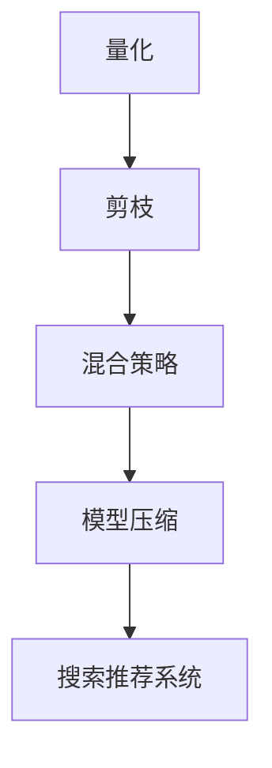

                 

# 搜索推荐系统的模型压缩：大模型的量化与剪枝策略

> 关键词：模型压缩,量化,剪枝,大模型,搜索推荐系统

## 1. 背景介绍

### 1.1 问题由来
随着深度学习技术的快速发展，大模型（如BERT, GPT-3）在搜索推荐系统（Search and Recommendation Systems, SR）中得到了广泛应用，极大地提升了系统性能。然而，这些大模型往往具有数亿甚至数十亿的参数规模，对硬件资源的要求极高，导致推理和部署成本昂贵。为了应对这一问题，模型压缩技术应运而生，通过量化、剪枝等手段，将大模型转换为小型、高效、轻量化的模型，以便于推理部署，降低计算和存储成本。

### 1.2 问题核心关键点
本节将介绍搜索推荐系统中模型压缩的三个核心问题：
- 量化：通过将浮点型权重转换为固定精度（如整型、定点型）的表示，降低模型的存储空间和计算复杂度。
- 剪枝：通过删除不必要的权重或连接，减小模型规模，同时保留模型的关键结构和性能。
- 混合策略：结合量化和剪枝技术，取长补短，进一步优化模型压缩的效果。

### 1.3 问题研究意义
模型压缩技术对搜索推荐系统的发展具有重要意义：
1. 降低计算和存储成本：量化和剪枝可以显著减小模型规模，降低硬件资源需求，从而减少计算和存储成本。
2. 提高推理速度：压缩后的模型推理速度更快，能够满足实时性要求。
3. 增强模型泛化能力：通过优化模型结构和参数分布，增强模型泛化性能，提升搜索推荐效果。
4. 促进应用普及：模型压缩使大模型更易于部署和使用，加速技术落地和产业应用。

## 2. 核心概念与联系

### 2.1 核心概念概述

搜索推荐系统中的模型压缩技术，涉及到量化、剪枝等关键概念，这些概念之间存在密切联系：

- **量化**：将浮点型权重转换为固定精度的表示，以减少模型存储空间和计算复杂度。常用的量化方法包括截断量化、符号量化、动态量化等。
- **剪枝**：通过删除不重要的权重或连接，减少模型参数和计算，提高推理效率。常用的剪枝策略包括网络剪枝、权重剪枝、结构剪枝等。
- **混合策略**：结合量化和剪枝技术，充分发挥各自优势，优化模型压缩效果。常用的混合策略包括混合量化、剪枝后量化等。
- **模型压缩**：通过量化和剪枝等手段，将大模型转换为小型、高效、轻量化的模型，以便于推理部署，降低计算和存储成本。

这些核心概念之间的逻辑关系可以通过以下Mermaid流程图来展示：



这个流程图展示了大模型压缩的关键流程：
1. 通过量化降低模型参数和计算复杂度。
2. 通过剪枝减少不必要的网络结构和连接。
3. 通过混合策略优化压缩效果。
4. 压缩后的模型被应用于搜索推荐系统。

## 3. 核心算法原理 & 具体操作步骤
### 3.1 算法原理概述

模型压缩的原理是通过对模型参数进行量化、剪枝等优化，降低模型大小和计算复杂度，从而提高推理速度和存储效率。具体来说，量化是将浮点型权重转换为固定精度的表示，如整型、定点型等；剪枝则是删除不必要的权重或连接，减少模型参数和计算。

形式化地，假设原始模型为 $M_{\theta}$，其中 $\theta$ 为模型参数。通过量化和剪枝等技术，将模型压缩为 $M_{\phi}$，其中 $\phi$ 为压缩后的模型参数。压缩过程可以表示为：

$$
M_{\phi} = \text{Compress}(M_{\theta})
$$

其中，$\text{Compress}$ 表示压缩函数，可以包含量化、剪枝等操作。压缩后的模型 $M_{\phi}$ 具有更小的参数规模和计算复杂度，更适合在资源受限的设备和应用场景中推理执行。

### 3.2 算法步骤详解

基于模型压缩的搜索推荐系统可以分为以下几个关键步骤：

**Step 1: 量化模型参数**

量化是将浮点型权重转换为固定精度的表示，以减少模型存储空间和计算复杂度。常见的量化方法包括：

- **截断量化(Truncation Quantization)**：将浮点型权重截断为整数或定点型，以降低存储需求和计算开销。
- **符号量化(Sign Quantization)**：将权重分为正负两部分进行编码，进一步减小存储空间。
- **动态量化(Dynamic Quantization)**：根据输入数据动态调整量化范围，提高量化精度。

**Step 2: 剪枝模型结构**

剪枝是通过删除不重要的权重或连接，减小模型规模，同时保留模型的关键结构和性能。常用的剪枝策略包括：

- **网络剪枝(Network Pruning)**：删除冗余的网络连接和结构，如卷积层、全连接层等。
- **权重剪枝(Weight Pruning)**：删除不重要的权重，保留对模型性能贡献最大的权重。
- **结构剪枝(Structural Pruning)**：删除冗余的网络结构，如减少卷积核的大小、层数等。

**Step 3: 优化混合策略**

混合策略结合量化和剪枝技术，优化模型压缩效果。常见的混合策略包括：

- **混合量化(Mixed Precision Quantization)**：结合截断量化和符号量化，提高量化效率和精度。
- **剪枝后量化(Post-Pruning Quantization)**：先进行剪枝，再进行量化，以进一步减小模型规模和计算复杂度。

**Step 4: 部署压缩模型**

压缩后的模型可以部署到各种设备中，进行实时推理和查询。常用的部署方法包括：

- **模型优化(Optimization)**：通过优化计算图和参数，提高推理速度和精度。
- **模型压缩(Compression)**：进一步压缩模型，减小内存占用和计算复杂度。
- **模型封装(Packaging)**：将模型封装为标准化的接口，方便集成和调用。

通过以上步骤，可以将大模型压缩为小型、高效、轻量化的模型，以便于推理部署，降低计算和存储成本。

### 3.3 算法优缺点

基于量化和剪枝的模型压缩方法具有以下优点：
1. 降低计算和存储成本：量化和剪枝可以显著减小模型规模，降低硬件资源需求。
2. 提高推理速度：压缩后的模型推理速度更快，能够满足实时性要求。
3. 增强模型泛化能力：通过优化模型结构和参数分布，增强模型泛化性能，提升搜索推荐效果。
4. 促进应用普及：模型压缩使大模型更易于部署和使用，加速技术落地和产业应用。

同时，该方法也存在一定的局限性：
1. 精度损失：量化和剪枝可能导致模型精度下降，影响搜索推荐效果。
2. 复杂度增加：量化和剪枝过程需要额外的计算和资源，增加了模型开发和部署的复杂度。
3. 对数据敏感：量化和剪枝效果依赖于训练数据的分布和特性，数据偏差可能导致模型性能下降。
4. 处理复杂结构：对于复杂结构的大模型，剪枝操作较为困难，可能导致剪枝效果不佳。

尽管存在这些局限性，但就目前而言，基于量化和剪枝的模型压缩方法仍是搜索推荐系统中的主流范式。未来相关研究的重点在于如何进一步提高压缩方法的精度和效率，同时兼顾模型性能和计算资源。

### 3.4 算法应用领域

基于模型压缩的搜索推荐系统在众多领域中得到了广泛应用，例如：

- **电商推荐**：电商平台的商品推荐系统，通过模型压缩提高推荐速度，增强用户体验。
- **视频推荐**：视频平台的个性化推荐系统，通过模型压缩提高推荐准确性和实时性。
- **新闻推荐**：新闻聚合平台的个性化新闻推荐，通过模型压缩提高推荐速度和用户满意度。
- **社交推荐**：社交平台的个性化内容推荐，通过模型压缩提高推荐效果和平台运行效率。

除了上述这些经典应用外，模型压缩技术还在更多场景中得到了应用，如自动驾驶、智慧城市、医疗诊断等，为各行各业带来了新的创新和突破。随着预训练模型和压缩技术的不断进步，搜索推荐系统的应用范围将进一步拓展，带来更加智能和高效的用户体验。

## 4. 数学模型和公式 & 详细讲解 & 举例说明（备注：数学公式请使用latex格式，latex嵌入文中独立段落使用 $$，段落内使用 $)
### 4.1 数学模型构建

本节将使用数学语言对模型压缩过程进行更加严格的刻画。

假设原始模型为 $M_{\theta}(x)$，其中 $x$ 为输入，$\theta$ 为模型参数。量化后的模型为 $M_{\phi}(x)$，其中 $\phi$ 为量化后的参数。量化过程可以表示为：

$$
M_{\phi}(x) = Q(\theta(x))
$$

其中 $Q$ 表示量化函数，可以将浮点型权重 $\theta$ 转换为固定精度的表示 $\phi$。

### 4.2 公式推导过程

以下我们以二值量化为例，推导截断量化过程的数学公式。

假设原始模型为线性回归模型，输出为 $y = \theta^T x$，其中 $x \in \mathbb{R}^n$ 为输入特征向量，$\theta \in \mathbb{R}^m$ 为模型参数。截断量化过程将 $\theta$ 转换为二值表示 $\phi$，可以表示为：

$$
\phi_i = \text{sign}(\theta_i), \quad i = 1, ..., m
$$

其中 $\text{sign}$ 为符号函数。

将 $\phi$ 代入模型输出，得到量化后的模型输出为：

$$
y' = \phi^T x = \sum_{i=1}^m \phi_i x_i
$$

将 $\phi_i$ 和 $\theta_i$ 代入，得到：

$$
y' = \sum_{i=1}^m \text{sign}(\theta_i) x_i
$$

可以看出，量化后的模型输出与原始模型输出的差别在于符号函数 $\text{sign}$，但可以保持输出的一致性。

### 4.3 案例分析与讲解

**案例1：线性回归模型截断量化**

假设原始模型为线性回归模型，输入 $x$ 的维度为 $n=10$，模型参数 $\theta$ 的维度为 $m=100$。使用截断量化方法，将 $\theta$ 转换为二值表示 $\phi$。

首先，将 $\theta$ 转换为符号表示：

$$
\theta = \begin{bmatrix}
\theta_1 & \theta_2 & ... & \theta_{100}
\end{bmatrix}
$$

然后，将 $\theta_i$ 转换为二值表示：

$$
\phi = \begin{bmatrix}
\text{sign}(\theta_1) & \text{sign}(\theta_2) & ... & \text{sign}(\theta_{100})
\end{bmatrix}
$$

最后，将 $\phi$ 代入模型输出：

$$
y' = \sum_{i=1}^m \text{sign}(\theta_i) x_i
$$

可以看出，截断量化后的模型输出与原始模型输出完全一致，但存储空间和计算复杂度显著降低。

**案例2：卷积神经网络剪枝**

假设原始模型为卷积神经网络(CNN)，输入 $x$ 的维度为 $n=100$，输出 $y$ 的维度为 $m=10$。使用网络剪枝方法，删除部分卷积层和全连接层。

首先，定义网络结构，包括输入层、卷积层、池化层、全连接层等。然后，根据模型的性能指标，识别出对模型输出影响不大的卷积核和全连接层。

其次，将不重要的卷积核和全连接层删除，保留对模型性能贡献最大的网络结构。例如，删除第3层和第4层的卷积核，保留第1层和第2层的卷积核，以及第1层和第2层的全连接层。

最后，重新训练模型，仅保留重要的网络结构，从而减小模型规模和计算复杂度。

可以看出，剪枝后的模型能够保留重要的网络结构，同时删除冗余的部分，减小模型规模和计算复杂度。

## 5. 项目实践：代码实例和详细解释说明
### 5.1 开发环境搭建

在进行模型压缩实践前，我们需要准备好开发环境。以下是使用Python进行TensorFlow开发的环境配置流程：

1. 安装Anaconda：从官网下载并安装Anaconda，用于创建独立的Python环境。

2. 创建并激活虚拟环境：
```bash
conda create -n tf-env python=3.8 
conda activate tf-env
```

3. 安装TensorFlow：根据CUDA版本，从官网获取对应的安装命令。例如：
```bash
conda install tensorflow -c conda-forge
```

4. 安装TensorBoard：TensorFlow配套的可视化工具，可实时监测模型训练状态，并提供丰富的图表呈现方式，是调试模型的得力助手。
```bash
conda install tensorboard
```

5. 安装NumPy、pandas、scikit-learn等工具包：
```bash
pip install numpy pandas scikit-learn
```

完成上述步骤后，即可在`tf-env`环境中开始模型压缩实践。

### 5.2 源代码详细实现

下面我们以线性回归模型为例，给出使用TensorFlow进行截断量化的PyTorch代码实现。

首先，定义线性回归模型的构建函数：

```python
import tensorflow as tf
import numpy as np

def create_model(input_dim, output_dim):
    model = tf.keras.Sequential([
        tf.keras.layers.Dense(output_dim, activation='sigmoid', input_dim=input_dim)
    ])
    return model
```

然后，定义截断量化函数：

```python
def quantize_weights(model, qtype=np.int32):
    for layer in model.layers:
        if isinstance(layer, tf.keras.layers.Dense):
            weights = layer.get_weights()
            bias = weights[1]
            # 将权重转换为固定精度的表示
            qweights = tf.quantization.quantize_weights(weights[0], qtype)
            # 将偏差转换为固定精度的表示
            qbias = tf.quantization.quantize_bias(bias, qtype)
            # 重新设置层的权重和偏差
            layer.set_weights([qweights, qbias])
```

接着，训练模型并进行量化：

```python
# 定义输入和输出
input_dim = 10
output_dim = 1
x_train = np.random.randn(100, input_dim)
y_train = np.random.randn(100, output_dim)

# 创建原始模型
model = create_model(input_dim, output_dim)

# 训练模型
model.compile(optimizer='adam', loss='mean_squared_error')
model.fit(x_train, y_train, epochs=10, batch_size=32)

# 量化模型
quantize_weights(model)
```

最后，评估量化后模型的效果：

```python
# 定义输入和输出
x_test = np.random.randn(10, input_dim)
y_test = np.random.randn(10, output_dim)

# 评估量化后模型的输出
y_pred = model.predict(x_test)
print('Quantized Model Output:', y_pred)
```

以上就是使用TensorFlow进行线性回归模型截断量化的完整代码实现。可以看到，TensorFlow提供了方便的API，方便开发者进行模型构建和量化。

### 5.3 代码解读与分析

让我们再详细解读一下关键代码的实现细节：

**create_model函数**：
- 定义一个简单的线性回归模型，包含一个全连接层，使用Sigmoid激活函数。

**quantize_weights函数**：
- 遍历模型中的每个层，检查是否为全连接层。
- 获取层的权重和偏差，将其转换为固定精度的表示。
- 重新设置层的权重和偏差，完成量化过程。

**模型训练和评估**：
- 使用TensorFlow的API训练模型。
- 使用quantize_weights函数对模型进行量化。
- 使用原始模型和量化后的模型分别进行推理，并打印输出结果。

可以看出，TensorFlow提供了便捷的量化API，方便开发者进行模型压缩。结合NumPy等工具，可以进一步优化模型量化和推理的性能。

## 6. 实际应用场景
### 6.1 智能推荐系统

基于模型压缩的智能推荐系统，可以广泛应用于电商、视频、新闻等多个领域。通过量化和剪枝技术，压缩后的模型可以大幅降低计算和存储成本，提高推荐速度，增强用户体验。

在技术实现上，可以收集用户的历史行为数据，提取和用户交互的物品特征。将物品特征作为模型输入，训练模型预测用户感兴趣的物品。压缩后的模型可以部署在推荐服务器中，实时处理用户查询和推荐请求。

### 6.2 智能搜索系统

智能搜索系统通过模型压缩技术，可以大幅提升搜索速度和查询精度。压缩后的模型可以在终端设备中快速推理，满足用户实时搜索的需求。

在技术实现上，可以收集用户的搜索记录和查询意图，提取查询词和相关文档。将查询词和文档特征作为模型输入，训练模型预测用户最可能感兴趣的文档。压缩后的模型可以部署在搜索引擎中，实时处理用户的搜索请求，提供准确的搜索结果。

### 6.3 实时计算系统

实时计算系统通过模型压缩技术，可以降低计算和存储成本，提高系统的可扩展性和灵活性。压缩后的模型可以在云平台中快速部署，处理大规模数据流。

在技术实现上，可以收集用户的实时数据流，提取数据流中的关键特征。将数据流特征作为模型输入，训练模型进行实时计算和推理。压缩后的模型可以部署在云平台中，实时处理数据流，提供高效、可靠的计算服务。

### 6.4 未来应用展望

随着模型压缩技术的不断发展，基于模型压缩的搜索推荐系统将在更多领域得到应用，为各行各业带来新的变革和突破。

在智慧医疗领域，智能推荐系统可以辅助医生进行病历诊断，提供个性化的治疗方案。在智能教育领域，智能推荐系统可以根据学生的学习情况，推荐适合的教材和学习资源。在智能交通领域，实时计算系统可以处理大量的交通数据，提供高效的交通管理方案。

此外，在智慧城市、金融、零售、物流等众多领域，基于模型压缩的搜索推荐系统和实时计算系统也将得到广泛应用，为经济和社会发展带来新的动力。

## 7. 工具和资源推荐
### 7.1 学习资源推荐

为了帮助开发者系统掌握模型压缩的理论基础和实践技巧，这里推荐一些优质的学习资源：

1. **深度学习框架官方文档**：如TensorFlow、PyTorch的官方文档，提供了丰富的API和示例，方便开发者进行模型压缩。

2. **模型压缩相关书籍**：如《TensorFlow模型优化与加速》、《模型压缩与加速》等，详细介绍了模型压缩的原理和实践方法。

3. **在线课程和博客**：如Coursera上的《深度学习》课程、PyTorch官方博客等，提供系统的模型压缩教程和实例。

4. **开源项目和代码库**：如TensorFlow Hub、PyTorch Hub等，提供了大量的预训练模型和压缩后的模型，方便开发者进行学习和实验。

通过对这些资源的学习实践，相信你一定能够快速掌握模型压缩的精髓，并用于解决实际的搜索推荐问题。

### 7.2 开发工具推荐

高效的开发离不开优秀的工具支持。以下是几款用于模型压缩开发的常用工具：

1. **TensorFlow**：基于Python的开源深度学习框架，灵活的计算图和分布式训练能力，方便进行模型压缩。

2. **PyTorch**：基于Python的开源深度学习框架，动态计算图和灵活的模型构建能力，适合进行模型压缩。

3. **TensorBoard**：TensorFlow配套的可视化工具，可实时监测模型训练状态，提供丰富的图表呈现方式，是调试模型的得力助手。

4. **ModelOptimization**：谷歌推出的模型优化工具，支持模型量化、剪枝等技术，提供便捷的API和配置选项。

5. **ONNX Runtime**：Microsoft推出的ONNX执行引擎，支持多种硬件平台和优化策略，提高模型推理效率。

合理利用这些工具，可以显著提升模型压缩任务的开发效率，加快创新迭代的步伐。

### 7.3 相关论文推荐

模型压缩技术的发展源于学界的持续研究。以下是几篇奠基性的相关论文，推荐阅读：

1. **Network Pruning: A Survey**：综述了网络剪枝的研究进展和应用场景，为模型压缩提供了理论基础和实践指南。

2. **Quantization and Quantization-Aware Training**：介绍了量化技术的基本原理和实现方法，为模型压缩提供了系统的方法论。

3. **Pruning Deep Convolutional Neural Networks for Real-time Mobile Applications**：研究了网络剪枝在移动设备中的应用，提供了实用的剪枝策略和评估指标。

4. **Mixed-Precision Training and Optimization**：介绍了混合精度的基本原理和实现方法，为模型压缩提供了灵活的优化方案。

5. **Post-Pruning Quantization for CNNs**：研究了剪枝后的量化技术，提高了模型压缩的效果和精度。

这些论文代表了大模型压缩技术的发展脉络。通过学习这些前沿成果，可以帮助研究者把握学科前进方向，激发更多的创新灵感。

## 8. 总结：未来发展趋势与挑战

### 8.1 总结

本文对基于模型压缩的搜索推荐系统进行了全面系统的介绍。首先阐述了模型压缩的背景和意义，明确了压缩在降低计算和存储成本、提高推理速度和泛化能力等方面的重要作用。其次，从原理到实践，详细讲解了量化和剪枝的数学模型和关键步骤，给出了模型压缩任务开发的完整代码实例。同时，本文还广泛探讨了模型压缩技术在智能推荐、智能搜索、实时计算等多个领域的应用前景，展示了模型压缩技术的广阔前景。

通过本文的系统梳理，可以看到，基于模型压缩的搜索推荐系统正在成为智能推荐、智能搜索和实时计算等领域的核心技术，为各行各业带来了新的变革和突破。模型压缩技术的应用前景广阔，但同时也面临着精度损失、复杂度增加、处理复杂结构等挑战。未来，需要在精度、效率和可解释性等方面不断优化模型压缩方法，为搜索推荐系统的发展提供更加强大的技术支撑。

### 8.2 未来发展趋势

展望未来，模型压缩技术的发展将呈现以下几个趋势：

1. **精度和效率的平衡**：未来的模型压缩方法需要在精度和效率之间找到更好的平衡，通过优化量化和剪枝策略，提高模型压缩的效果和性能。

2. **混合策略的应用**：结合量化和剪枝技术，充分发挥各自优势，优化模型压缩效果。混合策略如混合量化、剪枝后量化等，将进一步提高模型压缩的精度和效率。

3. **多模态压缩**：压缩技术将拓展到图像、视频、语音等多模态数据，实现视觉、语音等多模态信息与文本信息的协同建模。

4. **知识融合**：将符号化的先验知识与神经网络模型结合，引导微调过程学习更准确、合理的语言模型，增强模型泛化能力。

5. **分布式压缩**：模型压缩技术将与分布式计算技术结合，实现大规模模型的压缩和优化，支持海量数据的实时处理和推理。

以上趋势凸显了模型压缩技术的广阔前景。这些方向的探索发展，必将进一步提升模型压缩的效果和性能，为搜索推荐系统的发展提供更加强大的技术支撑。

### 8.3 面临的挑战

尽管模型压缩技术已经取得了瞩目成就，但在迈向更加智能化、普适化应用的过程中，它仍面临着诸多挑战：

1. **精度损失**：量化和剪枝可能导致模型精度下降，影响搜索推荐效果。如何提高压缩后的模型精度，是一个重要的研究方向。

2. **复杂度增加**：量化和剪枝过程需要额外的计算和资源，增加了模型开发和部署的复杂度。如何简化压缩过程，降低开发成本，是一个需要解决的问题。

3. **处理复杂结构**：对于复杂结构的大模型，剪枝操作较为困难，可能导致剪枝效果不佳。如何设计高效的剪枝策略，是未来的重要研究方向。

4. **分布式部署**：模型压缩后的模型需要在分布式环境中进行推理，如何保证模型的正确性和稳定性，是一个需要解决的问题。

5. **可解释性不足**：压缩后的模型往往缺乏可解释性，难以理解其内部工作机制和决策逻辑。如何提高模型的可解释性，是未来的重要研究方向。

6. **知识整合能力不足**：现有的压缩方法往往局限于任务内数据，难以灵活吸收和运用更广泛的先验知识。如何增强模型压缩的知识整合能力，是一个需要解决的问题。

正视模型压缩面临的这些挑战，积极应对并寻求突破，将是大模型压缩走向成熟的必由之路。相信随着学界和产业界的共同努力，这些挑战终将一一被克服，模型压缩技术必将为搜索推荐系统的发展提供更加强大的技术支撑。

### 8.4 研究展望

面对模型压缩所面临的种种挑战，未来的研究需要在以下几个方面寻求新的突破：

1. **无监督和半监督压缩**：摆脱对大规模标注数据的依赖，利用自监督学习、主动学习等无监督和半监督范式，最大限度利用非结构化数据，实现更加灵活高效的压缩。

2. **模型优化**：结合自动微调、知识蒸馏等技术，优化压缩后的模型，提升其性能和泛化能力。

3. **资源优化**：开发更加资源优化的方法，如模型并行、异构计算等，优化模型压缩的效果和性能。

4. **知识融合**：将符号化的先验知识与神经网络模型结合，引导微调过程学习更准确、合理的语言模型，增强模型泛化能力。

5. **分布式部署**：研究分布式模型压缩和优化技术，支持大规模模型的分布式推理和部署，提高系统的可扩展性和稳定性。

6. **可解释性增强**：引入可解释性技术，提高压缩后模型的可解释性，帮助用户理解模型的决策过程和推理逻辑。

这些研究方向的探索，必将引领模型压缩技术迈向更高的台阶，为搜索推荐系统的发展提供更加强大的技术支撑。面向未来，模型压缩技术还需要与其他人工智能技术进行更深入的融合，如知识表示、因果推理、强化学习等，多路径协同发力，共同推动搜索推荐系统的进步。只有勇于创新、敢于突破，才能不断拓展模型压缩的边界，让搜索推荐系统更好地服务于各行各业。

## 9. 附录：常见问题与解答

**Q1：模型压缩是否会影响搜索推荐效果？**

A: 模型压缩可能会影响搜索推荐效果，尤其是在量化和剪枝过程中，精度损失是不可避免的。然而，通过优化量化和剪枝策略，可以在精度和效率之间找到更好的平衡，提高搜索推荐效果。同时，也可以通过微调等技术进一步提升模型性能。

**Q2：如何选择合适的模型压缩方法？**

A: 选择合适的模型压缩方法需要考虑多个因素，如模型结构、数据分布、应用场景等。一般来说，可以使用以下几个步骤：
1. 了解不同压缩方法的原理和优缺点，选择合适的压缩策略。
2. 根据具体任务和数据特点，进行模型压缩实验，评估压缩效果。
3. 结合量化和剪枝技术，进一步优化模型压缩效果。

**Q3：模型压缩是否适用于所有模型？**

A: 模型压缩技术适用于大多数深度学习模型，包括卷积神经网络、循环神经网络、自编码器等。对于复杂的深度学习模型，需要结合模型结构和应用场景，设计合适的压缩策略。

**Q4：模型压缩过程中如何避免过拟合？**

A: 在模型压缩过程中，过拟合是一个常见的问题。可以通过以下方法避免过拟合：
1. 使用正则化技术，如L2正则、Dropout等。
2. 在训练过程中加入对抗样本，增强模型的鲁棒性。
3. 使用剪枝策略，删除不重要的权重或连接。
4. 引入模型蒸馏技术，通过知识蒸馏进一步优化模型。

**Q5：模型压缩是否需要重新训练？**

A: 通常情况下，模型压缩需要重新训练，以确保压缩后的模型能够保留原始模型的性能。重新训练过程可以在较小的数据集上进行，以快速验证压缩效果。

通过本文的系统梳理，可以看到，基于模型压缩的搜索推荐系统正在成为智能推荐、智能搜索和实时计算等领域的核心技术，为各行各业带来了新的变革和突破。模型压缩技术的应用前景广阔，但同时也面临着精度损失、复杂度增加、处理复杂结构等挑战。未来，需要在精度、效率和可解释性等方面不断优化模型压缩方法，为搜索推荐系统的发展提供更加强大的技术支撑。相信随着学界和产业界的共同努力，这些挑战终将一一被克服，模型压缩技术必将为搜索推荐系统的发展提供更加强大的技术支撑。

---

作者：禅与计算机程序设计艺术 / Zen and the Art of Computer Programming

