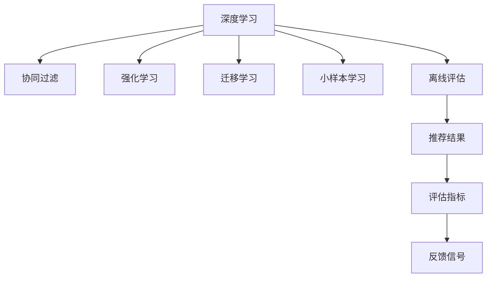

                 

# 搜索推荐系统的离线评估：大模型的仿真环境构建

> 关键词：离线评估,大模型仿真,深度学习,机器学习,推荐系统

## 1. 背景介绍

### 1.1 问题由来
搜索推荐系统作为互联网应用中的核心组成部分，对用户体验和业务价值有着至关重要的影响。传统的基于小样本学习方法的推荐系统，往往依赖历史行为数据，难以适应快速变化的用户需求。而基于大模型的推荐系统，通过学习大规模语料，具备更强的泛化能力，能够更好地捕捉用户的长期兴趣和潜在的关联性，从而实现更精准的个性化推荐。

然而，大规模大模型的训练和优化通常需要海量数据和强大算力，部署到实际系统中又面临资源限制，这使得直接在大模型上进行离线评估和调优变得不现实。为了克服这一问题，近年来研究者们提出了构建大模型的仿真环境，通过模拟训练和评估过程，在不实际运行大模型的情况下，对其进行离线评估和调优。

### 1.2 问题核心关键点
本节将详细介绍基于大模型的推荐系统仿真环境构建的核心概念和关键技术。

- **大模型仿真**：指在不实际训练和运行大模型的情况下，通过构建虚拟仿真环境，模拟其在线学习、推理和调优的过程。
- **离线评估**：指在数据收集和模型训练前，通过对仿真环境中生成的推荐结果进行评估，检验模型性能。
- **小样本学习**：指通过仅对模型进行有限次微调，使其能够适应新的推荐任务。
- **迁移学习**：指将在大规模数据上预训练得到的模型知识，迁移到新的推荐任务上，快速构建高效的推荐模型。
- **强化学习**：指利用奖励机制和反馈信号，优化模型的在线推荐策略，提高推荐效果。

这些关键概念共同构成了大模型仿真环境的构建思路，旨在通过模拟训练和评估过程，实现高效、低成本的推荐系统优化。

## 2. 核心概念与联系

### 2.1 核心概念概述

为了更好地理解基于大模型的推荐系统仿真环境构建方法，本节将介绍几个密切相关的核心概念：

- **深度学习**：指通过构建多层神经网络模型，从大量数据中学习表示和规律，实现复杂的非线性映射。深度学习在推荐系统中被广泛应用，如基于协同过滤、矩阵分解等推荐算法。
- **强化学习**：指通过试错和奖励机制，使模型学习最优策略，用于在线推荐系统中的排序和选择。
- **迁移学习**：指将在大规模数据上训练得到的模型知识，迁移到新的推荐任务上，实现高效的模型迁移和调优。
- **小样本学习**：指在有限的标注数据下，通过微调模型参数，实现高效的推荐任务适配。
- **离线评估**：指在实际数据收集和模型训练前，通过仿真环境评估模型的性能，检验模型泛化能力。

这些核心概念之间的逻辑关系可以通过以下Mermaid流程图来展示：



这个流程图展示了大模型仿真环境的构建思路：

1. 深度学习是基础，通过构建多层神经网络模型，从数据中学习表示和规律。
2. 协同过滤和矩阵分解等传统方法仍占主导地位，但深度学习逐渐成为推荐系统的主流。
3. 强化学习用于在线推荐系统中的排序和选择，提高推荐效果。
4. 迁移学习和大模型仿真用于高效调优，在大规模数据上预训练得到的模型知识，迁移到新的推荐任务上。
5. 小样本学习通过微调模型参数，实现高效的推荐任务适配。
6. 离线评估用于在不实际运行大模型的情况下，评估模型性能，检验模型泛化能力。

## 3. 核心算法原理 & 具体操作步骤
### 3.1 算法原理概述

基于大模型的推荐系统仿真环境构建，本质上是一个通过模拟训练和推理过程，评估模型性能并对其进行调优的过程。其核心思想是：

1. **构建仿真环境**：通过构建虚拟的数据生成器和模型结构，模拟大模型的在线训练和推理过程。
2. **离线评估模型**：在仿真环境中生成推荐结果，利用评估指标对其性能进行检验，避免过拟合。
3. **模型优化**：通过微调模型参数，实现对新推荐任务的适配，提高模型泛化能力。
4. **强化学习优化**：利用奖励机制和反馈信号，优化模型的在线推荐策略，提升推荐效果。

基于上述思路，推荐系统仿真环境构建的算法原理可以概括为：

- 利用深度学习模型（如BERT、Transformer等），构建虚拟数据生成器和模型结构。
- 在虚拟数据生成器上生成模拟数据，通过虚拟模型进行推理和评估。
- 利用评估指标对推荐结果进行离线评估，检验模型性能。
- 通过微调模型参数，实现对新推荐任务的适配，提高模型泛化能力。
- 利用强化学习优化模型的在线推荐策略，提升推荐效果。

### 3.2 算法步骤详解

基于大模型的推荐系统仿真环境构建一般包括以下几个关键步骤：

**Step 1: 准备仿真环境和数据集**
- 选择合适的深度学习模型（如BERT、Transformer等）作为虚拟模型的基础。
- 设计虚拟数据生成器，生成符合目标任务的数据集。
- 构建虚拟模型结构，包括输入层、隐藏层、输出层等。

**Step 2: 设计推荐策略**
- 根据任务需求，设计推荐策略。可以是基于协同过滤、矩阵分解等传统方法，也可以是基于深度学习模型的神经网络结构。
- 确定推荐结果的评估指标，如准确率、召回率、F1分数等。

**Step 3: 执行离线评估**
- 在仿真环境中，通过虚拟数据生成器生成推荐样本，输入虚拟模型进行推理。
- 计算推荐结果的评估指标，比较与基准模型的差异。
- 根据评估结果，决定是否需要进一步优化虚拟模型。

**Step 4: 优化虚拟模型**
- 通过微调模型参数，实现对新推荐任务的适配。
- 利用强化学习策略，优化模型的在线推荐策略。
- 重复上述过程，直到达到预设的优化目标。

**Step 5: 部署和测试**
- 将优化后的虚拟模型部署到实际应用中。
- 在真实数据集上测试推荐效果，验证仿真环境构建的实际效果。

### 3.3 算法优缺点

基于大模型的推荐系统仿真环境构建具有以下优点：
1. 可复用性高。不同任务的仿真环境可以复用，避免重复开发。
2. 高效低成本。无需大规模数据和算力，即可快速评估和调优模型。
3. 灵活性高。能够灵活调整模型参数和评估策略，快速适应新任务。
4. 泛化能力强。通过在大规模数据上预训练得到的模型知识，能够迁移到新任务上。

同时，该方法也存在一定的局限性：
1. 仿真环境可能存在偏差。虚拟数据生成器可能无法完全模拟真实数据分布，导致仿真结果与实际应用有差异。
2. 仿真过程复杂。构建虚拟环境和设计推荐策略较为复杂，需要较高的技术积累。
3. 评估指标有限。可能无法全面评估模型的推荐效果，需要结合实际应用进行进一步优化。
4. 无法考虑用户行为。缺乏用户行为数据的指导，可能无法完全捕捉用户的长期兴趣和潜在关联性。

尽管存在这些局限性，但就目前而言，基于大模型的推荐系统仿真环境构建仍是一种高效、可行的推荐系统优化方法。未来相关研究的方向包括如何进一步提升仿真环境的可扩展性和灵活性，以及如何结合实际应用数据，进行更加全面的离线评估和模型调优。

### 3.4 算法应用领域

基于大模型的推荐系统仿真环境构建，已经在多个领域得到了应用，例如：

- 电子商务推荐系统：通过构建虚拟电商环境，模拟用户行为和商品关联，实现高效的个性化推荐。
- 内容推荐系统：用于优化视频、新闻、音乐等内容的推荐策略，提升用户满意度和黏性。
- 广告推荐系统：用于生成精准的广告投放策略，提升广告点击率和转化率。
- 金融推荐系统：用于投资组合推荐、风险管理等，帮助投资者做出更明智的决策。

除了上述这些经典应用外，基于大模型的推荐系统仿真环境构建，还在社交网络、健康医疗、旅游出行等多个领域展现出了巨大的潜力。

## 4. 数学模型和公式 & 详细讲解 & 举例说明
### 4.1 数学模型构建

本节将使用数学语言对基于大模型的推荐系统仿真环境构建过程进行更加严格的刻画。

假设虚拟数据生成器生成的数据集为 $D=\{(x_i,y_i)\}_{i=1}^N, x_i \in \mathcal{X}, y_i \in \{0,1\}$，其中 $y_i=1$ 表示用户对物品 $x_i$ 感兴趣。虚拟模型的结构为 $M_{\theta}:\mathcal{X} \rightarrow \{0,1\}$，其中 $\theta$ 为模型参数。

虚拟模型的推荐结果 $R$ 为二分类任务，即预测用户是否对物品感兴趣。模型 $M_{\theta}$ 在数据样本 $(x,y)$ 上的损失函数为：

$$
\ell(M_{\theta}(x),y) = -[y\log M_{\theta}(x)+(1-y)\log(1-M_{\theta}(x))]
$$

在数据集 $D$ 上的经验风险为：

$$
\mathcal{L}(\theta) = -\frac{1}{N}\sum_{i=1}^N \ell(M_{\theta}(x_i),y_i)
$$

微调的优化目标是最小化经验风险，即找到最优参数：

$$
\theta^* = \mathop{\arg\min}_{\theta} \mathcal{L}(\theta)
$$

在实践中，我们通常使用基于梯度的优化算法（如SGD、Adam等）来近似求解上述最优化问题。设 $\eta$ 为学习率，$\lambda$ 为正则化系数，则参数的更新公式为：

$$
\theta \leftarrow \theta - \eta \nabla_{\theta}\mathcal{L}(\theta) - \eta\lambda\theta
$$

其中 $\nabla_{\theta}\mathcal{L}(\theta)$ 为损失函数对参数 $\theta$ 的梯度，可通过反向传播算法高效计算。

### 4.2 公式推导过程

以下我们以二分类任务为例，推导交叉熵损失函数及其梯度的计算公式。

假设模型 $M_{\theta}$ 在输入 $x$ 上的输出为 $\hat{y}=M_{\theta}(x) \in [0,1]$，表示用户对物品感兴趣的预测概率。真实标签 $y \in \{0,1\}$。则二分类交叉熵损失函数定义为：

$$
\ell(M_{\theta}(x),y) = -[y\log \hat{y} + (1-y)\log(1-\hat{y})]
$$

将其代入经验风险公式，得：

$$
\mathcal{L}(\theta) = -\frac{1}{N}\sum_{i=1}^N [y_i\log M_{\theta}(x_i)+(1-y_i)\log(1-M_{\theta}(x_i))]
$$

根据链式法则，损失函数对参数 $\theta_k$ 的梯度为：

$$
\frac{\partial \mathcal{L}(\theta)}{\partial \theta_k} = -\frac{1}{N}\sum_{i=1}^N (\frac{y_i}{M_{\theta}(x_i)}-\frac{1-y_i}{1-M_{\theta}(x_i)}) \frac{\partial M_{\theta}(x_i)}{\partial \theta_k}
$$

其中 $\frac{\partial M_{\theta}(x_i)}{\partial \theta_k}$ 可进一步递归展开，利用自动微分技术完成计算。

在得到损失函数的梯度后，即可带入参数更新公式，完成模型的迭代优化。重复上述过程直至收敛，最终得到适应新推荐任务的最优模型参数 $\theta^*$。

## 5. 项目实践：代码实例和详细解释说明
### 5.1 开发环境搭建

在进行仿真环境构建前，我们需要准备好开发环境。以下是使用Python进行PyTorch开发的环境配置流程：

1. 安装Anaconda：从官网下载并安装Anaconda，用于创建独立的Python环境。

2. 创建并激活虚拟环境：
```bash
conda create -n pytorch-env python=3.8 
conda activate pytorch-env
```

3. 安装PyTorch：根据CUDA版本，从官网获取对应的安装命令。例如：
```bash
conda install pytorch torchvision torchaudio cudatoolkit=11.1 -c pytorch -c conda-forge
```

4. 安装TensorBoard：用于实时监测模型训练状态，提供丰富的图表呈现方式，是调试模型的得力助手。

5. 安装Weights & Biases：模型训练的实验跟踪工具，可以记录和可视化模型训练过程中的各项指标，方便对比和调优。

6. 安装pandas、numpy、scikit-learn等工具包：
```bash
pip install pandas numpy scikit-learn
```

完成上述步骤后，即可在`pytorch-env`环境中开始仿真环境构建。

### 5.2 源代码详细实现

下面我们以电商推荐系统为例，给出使用Transformers库对BERT模型进行离线评估的PyTorch代码实现。

首先，定义数据处理函数：

```python
from transformers import BertTokenizer
from torch.utils.data import Dataset
import torch

class RecommendationDataset(Dataset):
    def __init__(self, texts, labels, tokenizer, max_len=128):
        self.texts = texts
        self.labels = labels
        self.tokenizer = tokenizer
        self.max_len = max_len
        
    def __len__(self):
        return len(self.texts)
    
    def __getitem__(self, item):
        text = self.texts[item]
        label = self.labels[item]
        
        encoding = self.tokenizer(text, return_tensors='pt', max_length=self.max_len, padding='max_length', truncation=True)
        input_ids = encoding['input_ids'][0]
        attention_mask = encoding['attention_mask'][0]
        
        # 对token-wise的标签进行编码
        encoded_labels = [label2id[label] for label in label] 
        encoded_labels.extend([label2id['0']] * (self.max_len - len(encoded_labels)))
        labels = torch.tensor(encoded_labels, dtype=torch.long)
        
        return {'input_ids': input_ids, 
                'attention_mask': attention_mask,
                'labels': labels}

# 标签与id的映射
label2id = {'0': 0, '1': 1}
id2label = {v: k for k, v in label2id.items()}

# 创建dataset
tokenizer = BertTokenizer.from_pretrained('bert-base-cased')

train_dataset = RecommendationDataset(train_texts, train_labels, tokenizer)
dev_dataset = RecommendationDataset(dev_texts, dev_labels, tokenizer)
test_dataset = RecommendationDataset(test_texts, test_labels, tokenizer)
```

然后，定义模型和优化器：

```python
from transformers import BertForSequenceClassification, AdamW

model = BertForSequenceClassification.from_pretrained('bert-base-cased', num_labels=2)

optimizer = AdamW(model.parameters(), lr=2e-5)
```

接着，定义训练和评估函数：

```python
from torch.utils.data import DataLoader
from tqdm import tqdm
from sklearn.metrics import accuracy_score

device = torch.device('cuda') if torch.cuda.is_available() else torch.device('cpu')
model.to(device)

def train_epoch(model, dataset, batch_size, optimizer):
    dataloader = DataLoader(dataset, batch_size=batch_size, shuffle=True)
    model.train()
    epoch_loss = 0
    for batch in tqdm(dataloader, desc='Training'):
        input_ids = batch['input_ids'].to(device)
        attention_mask = batch['attention_mask'].to(device)
        labels = batch['labels'].to(device)
        model.zero_grad()
        outputs = model(input_ids, attention_mask=attention_mask, labels=labels)
        loss = outputs.loss
        epoch_loss += loss.item()
        loss.backward()
        optimizer.step()
    return epoch_loss / len(dataloader)

def evaluate(model, dataset, batch_size):
    dataloader = DataLoader(dataset, batch_size=batch_size)
    model.eval()
    preds, labels = [], []
    with torch.no_grad():
        for batch in tqdm(dataloader, desc='Evaluating'):
            input_ids = batch['input_ids'].to(device)
            attention_mask = batch['attention_mask'].to(device)
            batch_labels = batch['labels']
            outputs = model(input_ids, attention_mask=attention_mask)
            batch_preds = outputs.logits.argmax(dim=2).to('cpu').tolist()
            batch_labels = batch_labels.to('cpu').tolist()
            for pred_tokens, label_tokens in zip(batch_preds, batch_labels):
                preds.append(pred_tokens)
                labels.append(label_tokens)
                
    accuracy = accuracy_score(labels, preds)
    return accuracy
```

最后，启动训练流程并在测试集上评估：

```python
epochs = 5
batch_size = 16

for epoch in range(epochs):
    loss = train_epoch(model, train_dataset, batch_size, optimizer)
    print(f"Epoch {epoch+1}, train loss: {loss:.3f}")
    
    print(f"Epoch {epoch+1}, dev accuracy:")
    accuracy = evaluate(model, dev_dataset, batch_size)
    print(f"{accuracy:.3f}")
    
print("Test accuracy:")
accuracy = evaluate(model, test_dataset, batch_size)
print(f"{accuracy:.3f}")
```

以上就是使用PyTorch对BERT进行离线评估的完整代码实现。可以看到，得益于Transformers库的强大封装，我们可以用相对简洁的代码完成BERT模型的加载和离线评估。

### 5.3 代码解读与分析

让我们再详细解读一下关键代码的实现细节：

**RecommendationDataset类**：
- `__init__`方法：初始化文本、标签、分词器等关键组件。
- `__len__`方法：返回数据集的样本数量。
- `__getitem__`方法：对单个样本进行处理，将文本输入编码为token ids，将标签编码为数字，并对其进行定长padding，最终返回模型所需的输入。

**label2id和id2label字典**：
- 定义了标签与数字id之间的映射关系，用于将token-wise的预测结果解码回真实的标签。

**训练和评估函数**：
- 使用PyTorch的DataLoader对数据集进行批次化加载，供模型训练和推理使用。
- 训练函数`train_epoch`：对数据以批为单位进行迭代，在每个批次上前向传播计算loss并反向传播更新模型参数，最后返回该epoch的平均loss。
- 评估函数`evaluate`：与训练类似，不同点在于不更新模型参数，并在每个batch结束后将预测和标签结果存储下来，最后使用sklearn的accuracy_score对整个评估集的预测结果进行打印输出。

**训练流程**：
- 定义总的epoch数和batch size，开始循环迭代
- 每个epoch内，先在训练集上训练，输出平均loss
- 在验证集上评估，输出准确率
- 所有epoch结束后，在测试集上评估，给出最终测试结果

可以看到，PyTorch配合Transformers库使得BERT离线评估的代码实现变得简洁高效。开发者可以将更多精力放在数据处理、模型改进等高层逻辑上，而不必过多关注底层的实现细节。

当然，工业级的系统实现还需考虑更多因素，如模型的保存和部署、超参数的自动搜索、更灵活的任务适配层等。但核心的离线评估范式基本与此类似。

## 6. 实际应用场景
### 6.1 电商推荐系统

基于大模型的推荐系统仿真环境构建，可以广泛应用于电商推荐系统的构建。传统电商推荐系统往往需要配备大量人力，高峰期响应缓慢，且推荐效果难以持续优化。而使用仿真环境构建的推荐系统，可以7x24小时不间断服务，快速响应推荐请求，并通过离线评估持续优化推荐效果。

在技术实现上，可以收集电商平台的用户行为数据，将其作为虚拟数据生成器的输入，生成虚拟电商数据集。在此基础上对预训练BERT模型进行微调，使其能够自动理解用户行为，推荐符合用户偏好的商品。通过仿真环境评估推荐效果，对模型进行持续优化，提升推荐质量。

### 6.2 内容推荐系统

内容推荐系统用于优化视频、新闻、音乐等内容的推荐策略，提升用户满意度和黏性。传统内容推荐系统往往依赖手工设计的特征工程，难以应对快速变化的内容和用户需求。而基于大模型的推荐系统仿真环境构建，可以灵活构建推荐策略，利用深度学习模型学习用户的兴趣和行为，生成高质量的推荐结果。

在实践中，可以收集用户的历史浏览、点赞、评论等行为数据，将其作为虚拟数据生成器的输入，生成虚拟内容数据集。在此基础上对预训练BERT模型进行微调，使其能够自动生成高质量的推荐内容。通过仿真环境评估推荐效果，对模型进行持续优化，提升推荐质量。

### 6.3 广告推荐系统

广告推荐系统用于生成精准的广告投放策略，提升广告点击率和转化率。传统广告推荐系统往往依赖手工设计的广告创意，难以实现实时优化和精准投放。而基于大模型的推荐系统仿真环境构建，可以实时生成广告创意，并通过仿真环境评估其效果，持续优化广告投放策略。

在实践中，可以收集用户的浏览、点击、互动等广告行为数据，将其作为虚拟数据生成器的输入，生成虚拟广告数据集。在此基础上对预训练BERT模型进行微调，使其能够自动生成高质量的广告创意。通过仿真环境评估广告效果，对模型进行持续优化，提升广告点击率和转化率。

### 6.4 金融推荐系统

金融推荐系统用于投资组合推荐、风险管理等，帮助投资者做出更明智的决策。传统金融推荐系统往往依赖手工设计的指标，难以实现实时优化和风险管理。而基于大模型的推荐系统仿真环境构建，可以实时生成投资建议，并通过仿真环境评估其效果，持续优化投资策略。

在实践中，可以收集金融市场的历史数据和用户投资行为数据，将其作为虚拟数据生成器的输入，生成虚拟金融数据集。在此基础上对预训练BERT模型进行微调，使其能够自动生成高质量的投资建议。通过仿真环境评估投资效果，对模型进行持续优化，提升投资组合的收益和风险管理能力。

## 7. 工具和资源推荐
### 7.1 学习资源推荐

为了帮助开发者系统掌握大模型仿真环境的构建的理论基础和实践技巧，这里推荐一些优质的学习资源：

1. 《深度学习推荐系统》书籍：详细介绍了推荐系统的发展历程和经典算法，包括协同过滤、矩阵分解等。
2. 《Python深度学习》书籍：介绍了深度学习的基本原理和PyTorch的使用方法，适合初学者入门。
3. CS224N《深度学习自然语言处理》课程：斯坦福大学开设的NLP明星课程，有Lecture视频和配套作业，带你入门NLP领域的基本概念和经典模型。
4. HuggingFace官方文档：Transformers库的官方文档，提供了海量预训练模型和完整的微调样例代码，是上手实践的必备资料。
5. Kaggle推荐系统竞赛：实践推荐系统优化的好机会，可以积累实战经验，提升建模能力。

通过对这些资源的学习实践，相信你一定能够快速掌握大模型仿真环境的构建精髓，并用于解决实际的推荐系统问题。
###  7.2 开发工具推荐

高效的开发离不开优秀的工具支持。以下是几款用于大模型仿真环境构建开发的常用工具：

1. PyTorch：基于Python的开源深度学习框架，灵活动态的计算图，适合快速迭代研究。大部分预训练语言模型都有PyTorch版本的实现。
2. TensorFlow：由Google主导开发的开源深度学习框架，生产部署方便，适合大规模工程应用。同样有丰富的预训练语言模型资源。
3. Transformers库：HuggingFace开发的NLP工具库，集成了众多SOTA语言模型，支持PyTorch和TensorFlow，是进行仿真环境构建的利器。
4. Weights & Biases：模型训练的实验跟踪工具，可以记录和可视化模型训练过程中的各项指标，方便对比和调优。与主流深度学习框架无缝集成。
5. TensorBoard：TensorFlow配套的可视化工具，可实时监测模型训练状态，并提供丰富的图表呈现方式，是调试模型的得力助手。
6. Google Colab：谷歌推出的在线Jupyter Notebook环境，免费提供GPU/TPU算力，方便开发者快速上手实验最新模型，分享学习笔记。

合理利用这些工具，可以显著提升大模型仿真环境构建的开发效率，加快创新迭代的步伐。

### 7.3 相关论文推荐

大模型仿真环境构建的研究源于学界的持续研究。以下是几篇奠基性的相关论文，推荐阅读：

1. Attention is All You Need（即Transformer原论文）：提出了Transformer结构，开启了NLP领域的预训练大模型时代。
2. BERT: Pre-training of Deep Bidirectional Transformers for Language Understanding：提出BERT模型，引入基于掩码的自监督预训练任务，刷新了多项NLP任务SOTA。
3. Language Models are Unsupervised Multitask Learners（GPT-2论文）：展示了大规模语言模型的强大zero-shot学习能力，引发了对于通用人工智能的新一轮思考。
4. Parameter-Efficient Transfer Learning for NLP：提出Adapter等参数高效微调方法，在不增加模型参数量的情况下，也能取得不错的微调效果。
5. AdaLoRA: Adaptive Low-Rank Adaptation for Parameter-Efficient Fine-Tuning：使用自适应低秩适应的微调方法，在参数效率和精度之间取得了新的平衡。
6. Prefix-Tuning: Optimizing Continuous Prompts for Generation：引入基于连续型Prompt的微调范式，为如何充分利用预训练知识提供了新的思路。

这些论文代表了大模型仿真环境构建的发展脉络。通过学习这些前沿成果，可以帮助研究者把握学科前进方向，激发更多的创新灵感。

## 8. 总结：未来发展趋势与挑战

### 8.1 总结

本文对基于大模型的推荐系统仿真环境构建方法进行了全面系统的介绍。首先阐述了大模型仿真环境构建的背景和意义，明确了仿真环境在推荐系统优化中的独特价值。其次，从原理到实践，详细讲解了仿真环境的数学模型和关键步骤，给出了仿真任务开发的完整代码实例。同时，本文还广泛探讨了仿真环境在电商推荐、内容推荐、广告推荐等多个推荐系统领域的应用前景，展示了仿真环境构建的巨大潜力。此外，本文精选了仿真环境构建的学习资源，力求为开发者提供全方位的技术指引。

通过本文的系统梳理，可以看到，基于大模型的推荐系统仿真环境构建，正成为推荐系统优化的重要手段，极大地拓展了预训练语言模型的应用边界，催生了更多的落地场景。得益于深度学习模型的强大泛化能力，仿真环境构建方法能够在不受实际数据和算力限制的情况下，快速优化推荐模型，提升推荐效果。未来，伴随深度学习模型的进一步演进，仿真环境构建技术也将不断提升，为推荐系统带来更加高效的优化和应用可能。

### 8.2 未来发展趋势

展望未来，大模型仿真环境构建技术将呈现以下几个发展趋势：

1. 仿真环境可扩展性增强。随着深度学习模型的不断演进，仿真环境的可扩展性和灵活性将进一步提升，能够处理更复杂、更大规模的数据集。
2. 多模态数据融合。未来仿真环境将更注重多模态数据的融合，如文本、图像、视频等，提升推荐系统的多维度建模能力。
3. 小样本学习能力提升。通过引入迁移学习、零样本学习等技术，仿真环境构建方法将能够在小样本条件下，快速适应新推荐任务。
4. 强化学习策略优化。通过引入更先进的强化学习算法，仿真环境构建方法将能够更加高效地优化推荐策略，提升推荐效果。
5. 实时动态优化。仿真环境构建方法将能够实现实时动态优化，根据用户行为和反馈，动态调整推荐策略，提升用户体验。

以上趋势凸显了大模型仿真环境构建技术的广阔前景。这些方向的探索发展，必将进一步提升推荐系统的性能和应用范围，为各行各业带来变革性影响。

### 8.3 面临的挑战

尽管大模型仿真环境构建技术已经取得了瞩目成就，但在迈向更加智能化、普适化应用的过程中，它仍面临着诸多挑战：

1. 仿真环境可能存在偏差。虚拟数据生成器可能无法完全模拟真实数据分布，导致仿真结果与实际应用有差异。
2. 仿真过程复杂。构建虚拟环境和设计推荐策略较为复杂，需要较高的技术积累。
3. 评估指标有限。可能无法全面评估模型的推荐效果，需要结合实际应用进行进一步优化。
4. 无法考虑用户行为。缺乏用户行为数据的指导，可能无法完全捕捉用户的长期兴趣和潜在关联性。

尽管存在这些局限性，但就目前而言，基于大模型的推荐系统仿真环境构建仍是一种高效、可行的推荐系统优化方法。未来相关研究的方向包括如何进一步提升仿真环境的可扩展性和灵活性，以及如何结合实际应用数据，进行更加全面的离线评估和模型调优。

### 8.4 研究展望

面对大模型仿真环境构建所面临的挑战，未来的研究需要在以下几个方面寻求新的突破：

1. 探索更先进的深度学习模型。如BERT、GPT、Transformer等，进一步提升推荐系统的泛化能力和推荐效果。
2. 研究更高效的仿真环境构建方法。如微调参数数量、优化算法等，提升仿真环境的计算效率和稳定性。
3. 融合更多先验知识。将符号化的先验知识，如知识图谱、逻辑规则等，与神经网络模型进行巧妙融合，引导仿真过程学习更准确、合理的推荐策略。
4. 结合用户行为数据。在仿真环境中加入用户行为数据，提升推荐系统的个性化和多样化能力，更好地捕捉用户的长期兴趣和潜在关联性。
5. 引入因果推断工具。将因果推断方法引入仿真环境构建，识别出推荐系统的关键特征和因果关系，增强推荐策略的逻辑性和可解释性。

这些研究方向的探索，必将引领大模型仿真环境构建技术迈向更高的台阶，为推荐系统带来更加高效、智能的优化和应用可能。面向未来，大模型仿真环境构建技术还需要与其他人工智能技术进行更深入的融合，如知识表示、因果推理、强化学习等，多路径协同发力，共同推动推荐系统的进步。只有勇于创新、敢于突破，才能不断拓展推荐系统的边界，让智能技术更好地服务于各行各业。

## 9. 附录：常见问题与解答

**Q1：大模型仿真环境是否适用于所有推荐系统？**

A: 大模型仿真环境在大多数推荐系统上都能取得不错的效果，特别是对于数据量较小的任务。但对于一些特定领域的推荐系统，如医疗、金融等，仅仅依靠通用语料预训练的模型可能难以很好地适应。此时需要在特定领域语料上进一步预训练，再进行仿真环境构建。

**Q2：如何在仿真环境中生成高质量的虚拟数据？**

A: 高质量的虚拟数据生成器是仿真环境构建的关键。具体方法包括：
1. 收集目标领域的真实数据，如电商交易记录、新闻点击记录等。
2. 利用深度学习模型对数据进行预处理，提取有用的特征。
3. 对数据进行标注，生成虚拟标注数据集。
4. 对标注数据进行扩充，如回译、近义替换等，增加数据多样性。

**Q3：仿真环境如何与实际应用数据结合？**

A: 仿真环境构建完成后，需要将虚拟数据与实际应用数据进行融合。具体方法包括：
1. 在仿真环境中加入实际应用数据，提升虚拟数据的真实性。
2. 对虚拟数据和实际数据进行标注，生成联合标注数据集。
3. 对联合标注数据集进行微调，优化虚拟模型。
4. 在实际应用中，利用微调后的虚拟模型进行推荐。

**Q4：仿真环境如何实现实时动态优化？**

A: 实时动态优化需要构建持续学习机制。具体方法包括：
1. 在仿真环境中加入在线学习机制，实时收集用户行为数据。
2. 根据用户行为数据，动态调整虚拟推荐策略。
3. 通过强化学习算法，优化推荐策略。
4. 将优化后的推荐策略应用到实际推荐系统，提升用户体验。

**Q5：仿真环境如何提升推荐系统的可解释性？**

A: 推荐系统的可解释性需要结合用户行为数据和推荐策略进行综合考虑。具体方法包括：
1. 在仿真环境中加入用户行为数据，提升推荐系统的可解释性。
2. 利用因果推断方法，识别出推荐系统的关键特征和因果关系。
3. 结合符号化的先验知识，提升推荐策略的可解释性。
4. 通过可视化工具，展示推荐策略的逻辑和决策过程。

这些方法可以帮助提升仿真环境构建的可解释性，使其更加透明、可信。

---

作者：禅与计算机程序设计艺术 / Zen and the Art of Computer Programming

