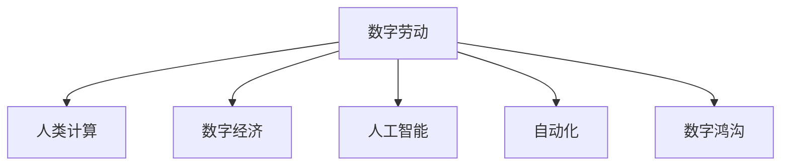
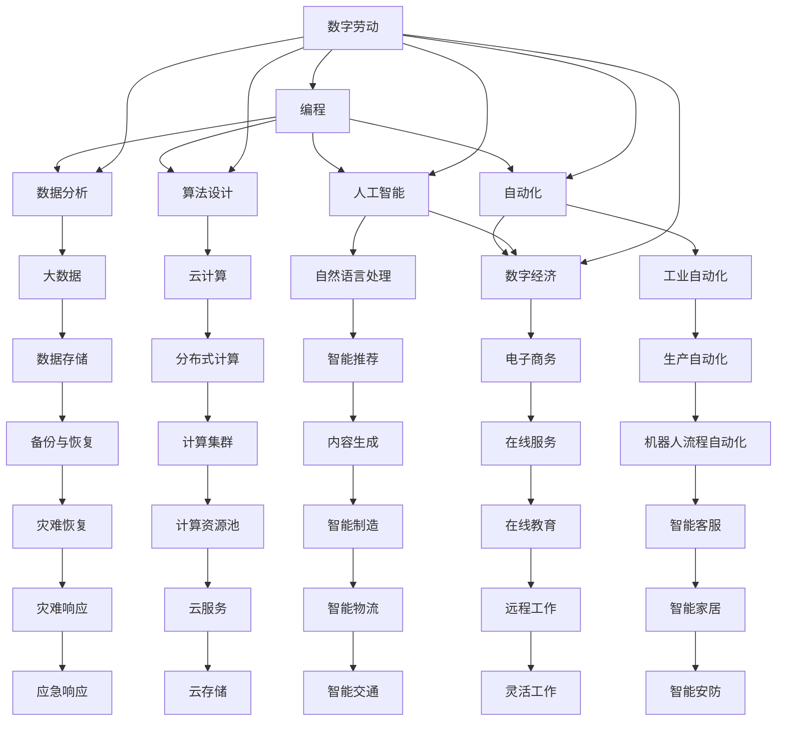

                 

# 数字劳动：人类计算的社会和经济影响

## 1. 背景介绍

在当今数字化时代，计算机技术的迅猛发展正在改变我们的工作方式和社会结构。从自动化生产线的诞生到人工智能技术的普及，人类在计算领域的工作形式已经从传统的“机械劳动”转变为“数字劳动”。数字劳动不仅改变了传统的劳动组织和劳动关系，也深刻影响了社会经济的发展和人类生活的方方面面。本文将深入探讨数字劳动的概念、社会经济影响以及应对策略，揭示其背后的深层次逻辑，并展望未来的发展趋势。

## 2. 核心概念与联系

### 2.1 核心概念概述

为了更好地理解数字劳动的社会和经济影响，我们首先定义几个关键概念：

- **数字劳动**：指的是在数字经济中，利用计算机和网络技术进行的劳动，包括编程、数据分析、算法设计等。
- **人类计算**：指通过人工方式进行计算活动，包括传统的手工计算和现代的计算机辅助计算。
- **数字经济**：利用数字技术和信息资源推动经济活动的新型经济形态，涉及电子商务、云计算、大数据等多个领域。
- **数字鸿沟**：指不同地区、不同社会群体之间在获取和使用数字技术方面的差距。
- **人工智能**：通过算法和数据训练形成的智能系统，具有自主决策和学习能力。
- **自动化**：通过程序和算法实现的任务自动化，减少人工干预。

这些概念相互关联，共同构成了数字劳动的基本框架。以下是一个Mermaid流程图，展示了这些概念之间的联系：



### 2.2 核心概念原理和架构的 Mermaid 流程图



## 3. 核心算法原理 & 具体操作步骤

### 3.1 算法原理概述

数字劳动的核心在于通过计算机算法和数据处理技术实现各种任务。其算法原理主要包括：

- **数据处理算法**：用于处理和分析大数据，提取有用信息。
- **机器学习算法**：通过训练模型，实现预测和决策。
- **优化算法**：用于在大量数据中寻找最优解。

数字劳动的实施步骤通常包括：

1. **数据获取**：从各种渠道获取所需数据。
2. **数据预处理**：清洗、转换和归一化数据。
3. **算法模型训练**：使用训练数据对算法进行训练。
4. **模型评估和优化**：评估模型性能，调整参数以优化模型。
5. **部署和应用**：将模型部署到实际应用中，进行任务执行。

### 3.2 算法步骤详解

#### 3.2.1 数据获取

数据获取是数字劳动的第一步。主要数据来源包括：

- **公共数据集**：如政府公开数据、科研数据等。
- **私有数据**：企业内部数据、用户生成数据等。
- **社交媒体**：如微博、微信等社交平台数据。
- **传感器数据**：如物联网设备生成的数据。

#### 3.2.2 数据预处理

数据预处理包括清洗、转换和归一化等步骤：

- **数据清洗**：去除噪声、填补缺失值、去除重复数据等。
- **数据转换**：如将时间序列数据转换为可分析的格式。
- **数据归一化**：将不同来源的数据统一到标准格式。

#### 3.2.3 算法模型训练

算法模型训练通常包括以下步骤：

- **选择算法**：根据任务需求选择合适的算法。
- **数据划分**：将数据划分为训练集、验证集和测试集。
- **模型训练**：使用训练数据训练模型。
- **模型评估**：在验证集上评估模型性能。
- **参数调整**：根据评估结果调整模型参数。
- **模型优化**：使用优化算法进一步提升模型性能。

#### 3.2.4 模型评估和优化

模型评估和优化是确保数字劳动效果的关键步骤：

- **评估指标**：选择合适的评估指标，如准确率、召回率、F1值等。
- **交叉验证**：使用交叉验证方法评估模型性能。
- **模型调参**：根据评估结果调整模型参数。
- **模型优化**：使用正则化、集成学习等技术优化模型。

#### 3.2.5 部署和应用

模型部署和应用是将数字劳动成果转化为实际价值的关键步骤：

- **模型导出**：将训练好的模型导出为可执行文件或服务接口。
- **部署平台**：选择适合的部署平台，如云服务、本地服务器等。
- **监控与维护**：实时监控模型性能，进行必要的维护。

### 3.3 算法优缺点

数字劳动具有以下优点：

- **效率高**：通过算法自动化处理数据，显著提高效率。
- **精度高**：算法可以通过大量数据训练得到高精度的模型。
- **可扩展性**：数字劳动可以在大规模数据上应用，具有很强的扩展性。

然而，数字劳动也存在一些缺点：

- **数据依赖性强**：依赖于高质量的数据，数据获取和处理成本高。
- **模型复杂度高**：算法模型通常较为复杂，需要较高的技术门槛。
- **隐私风险**：数据隐私和安全问题，如数据泄露、滥用等。
- **算法偏见**：算法可能学习到数据中的偏见，导致不公平的决策。

### 3.4 算法应用领域

数字劳动在多个领域得到了广泛应用，以下是一些典型应用：

- **金融科技**：用于风险评估、信用评分、反欺诈等。
- **医疗健康**：用于疾病诊断、个性化治疗、健康管理等。
- **电子商务**：用于推荐系统、价格预测、库存管理等。
- **智能制造**：用于生产流程优化、质量检测、设备维护等。
- **智能交通**：用于交通流量预测、智能导航、自动驾驶等。
- **智能安防**：用于人脸识别、视频监控、行为分析等。
- **智慧城市**：用于城市管理、公共服务、应急响应等。

## 4. 数学模型和公式 & 详细讲解 & 举例说明

### 4.1 数学模型构建

数字劳动的核心是算法模型。以线性回归模型为例，其数学模型可以表示为：

$$
y = \beta_0 + \beta_1 x_1 + \beta_2 x_2 + \ldots + \beta_n x_n + \epsilon
$$

其中，$y$ 为预测值，$\beta_0$ 为截距，$\beta_i$ 为自变量的系数，$x_i$ 为自变量，$\epsilon$ 为误差项。

### 4.2 公式推导过程

线性回归模型的推导过程如下：

1. **最小二乘法**：最小化误差项的平方和，即：

$$
\min \sum_{i=1}^n (y_i - \beta_0 - \beta_1 x_{1,i} - \beta_2 x_{2,i} - \ldots - \beta_n x_{n,i})^2
$$

2. **求解系数**：对误差项的平方和求导，解方程得到系数 $\beta_i$：

$$
\beta_i = \frac{\sum_{j=1}^n (x_{i,j} - \bar{x}_i)(y_j - \bar{y})}{\sum_{j=1}^n (x_{i,j} - \bar{x}_i)^2}
$$

3. **模型评估**：使用测试集评估模型性能，如：

$$
R^2 = 1 - \frac{\sum_{i=1}^n (y_i - \hat{y}_i)^2}{\sum_{i=1}^n (y_i - \bar{y})^2}
$$

其中，$R^2$ 为决定系数，表示模型解释的变异比例。

### 4.3 案例分析与讲解

以房价预测为例，分析数字劳动的应用：

- **数据获取**：从房地产交易平台获取历史交易数据。
- **数据预处理**：清洗数据，处理缺失值，标准化数据。
- **算法模型训练**：使用线性回归模型训练房价预测模型。
- **模型评估和优化**：在验证集上评估模型性能，调整系数，优化模型。
- **模型部署和应用**：将模型部署到生产环境，实时预测房价。

## 5. 项目实践：代码实例和详细解释说明

### 5.1 开发环境搭建

开发数字劳动项目需要一个高效的开发环境。以下是搭建开发环境的步骤：

1. **安装Python**：使用Anaconda或Miniconda安装Python。
2. **安装数据处理库**：如Pandas、NumPy等。
3. **安装机器学习库**：如Scikit-learn、TensorFlow等。
4. **安装可视化库**：如Matplotlib、Seaborn等。
5. **安装版本控制工具**：如Git、GitHub等。
6. **安装项目管理工具**：如Jupyter Notebook、PyCharm等。

### 5.2 源代码详细实现

以下是使用Python和Scikit-learn进行房价预测的代码实现：

```python
import pandas as pd
from sklearn.linear_model import LinearRegression
from sklearn.model_selection import train_test_split
from sklearn.metrics import mean_squared_error

# 加载数据
data = pd.read_csv('housing.csv')

# 数据预处理
X = data.drop(['Price'], axis=1)
y = data['Price']
X_train, X_test, y_train, y_test = train_test_split(X, y, test_size=0.2)

# 模型训练
model = LinearRegression()
model.fit(X_train, y_train)

# 模型评估
y_pred = model.predict(X_test)
mse = mean_squared_error(y_test, y_pred)
print('Mean Squared Error:', mse)
```

### 5.3 代码解读与分析

上述代码实现了线性回归模型的房价预测。具体步骤如下：

1. **数据加载**：使用Pandas加载CSV格式的数据。
2. **数据预处理**：将房价作为目标变量，其他特征作为自变量。
3. **模型训练**：使用LinearRegression训练线性回归模型。
4. **模型评估**：使用Mean Squared Error评估模型性能。

## 6. 实际应用场景

### 6.1 智能客服

智能客服是数字劳动在客户服务领域的重要应用。其具体实现步骤如下：

1. **数据收集**：收集客户的历史聊天记录、电话录音等数据。
2. **数据预处理**：清洗和标注数据，提取文本特征。
3. **算法模型训练**：使用机器学习算法训练聊天机器人模型。
4. **模型评估和优化**：在验证集上评估模型性能，调整参数，优化模型。
5. **部署和应用**：将模型部署到客服系统中，实现自动回复。

### 6.2 智慧医疗

智慧医疗是数字劳动在医疗领域的重要应用。其具体实现步骤如下：

1. **数据收集**：收集医院的历史病例、实验室数据等。
2. **数据预处理**：清洗和标注数据，提取特征。
3. **算法模型训练**：使用深度学习算法训练疾病预测模型。
4. **模型评估和优化**：在验证集上评估模型性能，调整参数，优化模型。
5. **部署和应用**：将模型部署到医疗系统中，实现疾病预测和个性化治疗。

### 6.3 智能制造

智能制造是数字劳动在制造业的重要应用。其具体实现步骤如下：

1. **数据收集**：收集工厂的生产数据、设备运行数据等。
2. **数据预处理**：清洗和标注数据，提取特征。
3. **算法模型训练**：使用机器学习算法训练生产优化模型。
4. **模型评估和优化**：在验证集上评估模型性能，调整参数，优化模型。
5. **部署和应用**：将模型部署到生产系统中，实现生产流程优化。

### 6.4 未来应用展望

数字劳动的未来应用前景广阔，主要方向包括：

1. **自动化决策**：使用机器学习算法进行自动化决策，提高工作效率。
2. **个性化服务**：通过大数据分析提供个性化服务，提升用户体验。
3. **智能运营**：实现智能运营管理，降低运营成本，提高资源利用率。
4. **智能创新**：通过数据驱动创新，推动新技术和新产品的开发。
5. **智慧社会**：实现智慧社会管理，提升公共服务水平。

## 7. 工具和资源推荐

### 7.1 学习资源推荐

以下是一些学习数字劳动的相关资源：

1. **Coursera《机器学习》课程**：由斯坦福大学教授Andrew Ng主讲的机器学习课程，涵盖了从基础到高级的机器学习知识。
2. **Kaggle竞赛平台**：提供大量数据集和竞赛，用于练习和测试机器学习模型。
3. **Deep Learning Book**：由Goodfellow等作者编写的深度学习经典书籍，详细介绍了深度学习的基础理论和算法。
4. **GitHub**：全球最大的开源平台，提供了大量开源机器学习项目和代码。
5. **Towards Data Science博客**：由数据科学家撰写，涵盖机器学习、数据科学等领域的前沿技术和应用。

### 7.2 开发工具推荐

以下是一些常用的数字劳动开发工具：

1. **Python**：基于Python的机器学习库，如Scikit-learn、TensorFlow等。
2. **Jupyter Notebook**：一个交互式笔记本环境，方便数据处理和模型训练。
3. **PyCharm**：一个集成的Python开发环境，提供代码编辑、调试和测试等功能。
4. **Git**：一个版本控制工具，方便团队协作和代码管理。
5. **Docker**：一个容器化技术，方便模型的部署和应用。

### 7.3 相关论文推荐

以下是一些关于数字劳动的重要论文：

1. **Deep Learning for Healthcare**：探索深度学习在医疗领域的应用，如疾病预测、影像分析等。
2. **AI for Customer Service**：研究人工智能在客服中的应用，如聊天机器人、语音识别等。
3. **Machine Learning for Manufacturing**：研究机器学习在制造业中的应用，如生产优化、质量检测等。
4. **Data-Driven Decision Making**：探讨数据驱动决策的实现，如风险评估、需求预测等。
5. **Intelligent Operations**：研究智能运营管理，如供应链优化、库存管理等。

## 8. 总结：未来发展趋势与挑战

### 8.1 研究成果总结

本文从数字劳动的概念出发，探讨了其社会和经济影响，并介绍了相关技术实现。通过分析具体应用案例，展示了数字劳动在各行各业的广泛应用。最后，对数字劳动的未来发展趋势和面临的挑战进行了总结。

### 8.2 未来发展趋势

数字劳动的未来发展趋势主要包括以下几个方面：

1. **算法智能化**：算法模型将越来越智能化，能够处理更加复杂的任务。
2. **数据多元化**：数据来源将更加多元化，包括传感器数据、物联网数据等。
3. **决策自动化**：决策过程将更加自动化，减少人工干预。
4. **服务个性化**：服务将更加个性化，满足用户多样化需求。
5. **技术融合**：数字劳动将与更多技术融合，如物联网、区块链等。
6. **伦理和隐私**：数字劳动将更加注重伦理和隐私保护，确保数据安全。

### 8.3 面临的挑战

数字劳动面临的挑战包括：

1. **数据质量**：数据质量和真实性问题，如数据噪声、数据泄露等。
2. **模型复杂性**：算法模型复杂度较高，需要较高的技术门槛。
3. **伦理和隐私**：算法偏见、数据隐私等问题。
4. **计算资源**：大规模计算资源的需求，如高性能计算设备。
5. **技术标准**：缺乏统一的技术标准，难以实现跨平台互操作。

### 8.4 研究展望

针对数字劳动面临的挑战，未来的研究方向包括：

1. **数据治理**：建立数据治理体系，确保数据质量和隐私保护。
2. **算法优化**：优化算法模型，提高模型的可解释性和鲁棒性。
3. **技术标准化**：制定统一的技术标准，实现跨平台互操作。
4. **伦理和隐私保护**：加强伦理和隐私保护，确保数据安全。
5. **跨学科研究**：结合多学科知识，推动数字劳动技术的发展。

## 9. 附录：常见问题与解答

**Q1: 数字劳动和传统劳动有何区别？**

A: 数字劳动和传统劳动的主要区别在于工作方式和工具。数字劳动通过计算机和网络技术进行，工作方式更加智能化和自动化；而传统劳动则主要依赖人工操作和体力劳动。

**Q2: 数字劳动对社会经济的影响有哪些？**

A: 数字劳动对社会经济的影响主要体现在以下几个方面：

1. **效率提升**：数字劳动通过算法自动化处理数据，显著提高了工作效率。
2. **成本降低**：数字劳动减少了人工干预和运营成本。
3. **创新推动**：数字劳动推动了新技术和新产品的开发，推动了创新发展。
4. **就业结构变化**：数字劳动改变了就业结构，对劳动力市场产生了重大影响。
5. **伦理和隐私问题**：数字劳动带来了伦理和隐私问题，需要重视和解决。

**Q3: 数字劳动的发展前景如何？**

A: 数字劳动的发展前景非常广阔，主要体现在以下几个方面：

1. **自动化决策**：数字劳动将推动决策过程自动化，提高决策效率和准确性。
2. **个性化服务**：数字劳动将提供更加个性化和定制化的服务，提升用户体验。
3. **智能运营**：数字劳动将推动智能运营管理，提高资源利用率。
4. **数据驱动创新**：数字劳动将推动数据驱动创新，推动新技术和新产品的开发。
5. **智慧社会**：数字劳动将推动智慧社会建设，提升公共服务水平。

---

作者：禅与计算机程序设计艺术 / Zen and the Art of Computer Programming

