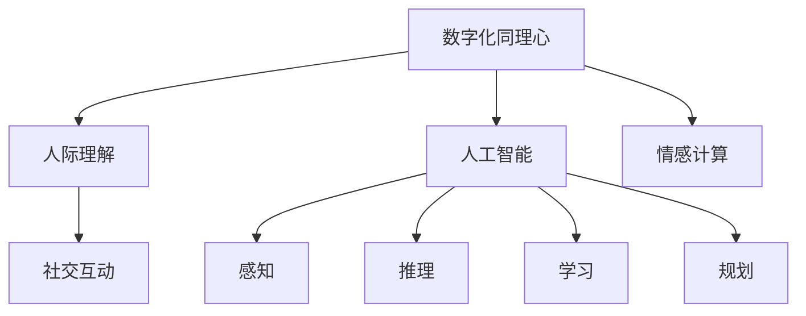

                 

# 数字化同理心培养皿：AI增强的人际理解训练

> 关键词：数字化同理心,人际理解训练,人工智能,情感计算,社交互动

## 1. 背景介绍

### 1.1 问题由来
随着人工智能技术的飞速发展，人类社会正逐步进入数字化时代。在数字化的浪潮中，人际交流和理解面临前所未有的挑战。网络环境下的社交互动，往往充斥着虚假信息、网络暴力和异化的社交关系，削弱了人与人之间的情感连接和同理心。如何在数字世界中重新建立深厚的人际理解和同理心，成为了当代社会亟需解决的问题。

### 1.2 问题核心关键点
在这一背景下，人工智能技术的引入为解决这一问题提供了新的方向。数字化同理心培养皿通过AI技术，分析和理解人类情感，增强社交互动中的情感交流和理解，促进了数字时代人际关系的和谐发展。

### 1.3 问题研究意义
数字化同理心培养皿的研究不仅对提高人类的情感智能、构建和谐的社交关系具有重要意义，也为人工智能技术在实际应用中提供了新的方向。它将推动AI技术在心理健康、教育、企业培训等领域的应用，助力社会的数字化转型。

## 2. 核心概念与联系

### 2.1 核心概念概述

为了更好地理解数字化同理心培养皿的工作原理，本节将介绍几个密切相关的核心概念：

- 数字化同理心(Digital Empathy)：通过数字化手段，理解和共鸣他人情感的能力，通常基于自然语言处理、情感计算等技术实现。
- 人际理解(Interpersonal Understanding)：识别和理解他人言语、行为背后的情感、意图和认知状态的能力。
- 人工智能(Artificial Intelligence)：模拟人类智能行为的计算系统，包括感知、推理、学习、规划等能力。
- 情感计算(Emotion AI)：通过分析语言、面部表情、生理信号等数据，识别和模拟人类情感的技术。
- 社交互动(Social Interaction)：人与人之间的信息交流和情感交换过程，是数字化同理心培养皿的主要应用场景。

这些概念之间的逻辑关系可以通过以下Mermaid流程图来展示：



这个流程图展示了大语言模型的工作原理和核心概念之间的关系：

1. 数字化同理心是基于人工智能和情感计算技术，通过理解人类情感来构建同理心。
2. 人工智能涵盖了感知、推理、学习、规划等能力，是实现数字化同理心的关键技术。
3. 情感计算利用语言、面部表情、生理信号等数据，对人类情感进行分析和模拟。
4. 人际理解帮助识别和理解他人言语、行为背后的情感、意图和认知状态。
5. 社交互动是数字化同理心培养皿的主要应用场景，通过增强人际理解来提升社交关系。

这些核心概念共同构成了数字化同理心培养皿的基础，使其能够在各种场景下发挥作用。

## 3. 核心算法原理 & 具体操作步骤

### 3.1 算法原理概述

数字化同理心培养皿的实现原理可以概括为：通过对人类社交互动数据的分析和理解，构建一个能够识别和理解他人情感的系统，从而增强数字化环境下的同理心和人际理解能力。

具体地，系统首先对用户输入的语言、面部表情、生理信号等数据进行收集和处理，利用情感计算技术分析用户的情感状态。然后，结合人工智能的感知、推理和规划能力，构建一个虚拟角色或虚拟聊天机器人，模拟与用户的互动，通过对话和反馈进一步强化对用户情感的理解。最终，系统能够根据用户的情感反馈，实时调整虚拟角色的反应，从而提高数字化同理心的效果。

### 3.2 算法步骤详解

数字化同理心培养皿的实现步骤主要包括：

1. **数据收集**：收集用户输入的语言、面部表情、生理信号等数据，作为情感计算和人工智能的输入。

2. **情感分析**：利用情感计算技术，分析用户的情感状态，包括情感倾向、强度和变化趋势。

3. **虚拟角色生成**：结合人工智能的感知、推理和规划能力，生成虚拟角色或虚拟聊天机器人，模拟与用户的互动。

4. **交互反馈**：通过对话和反馈，与用户进行交互，收集用户的情感反馈，进一步强化对用户情感的理解。

5. **同理心训练**：根据用户的情感反馈，实时调整虚拟角色的反应，提高数字化同理心的效果。

6. **效果评估**：定期评估系统的同理心效果，收集用户反馈，持续优化系统模型。

### 3.3 算法优缺点

数字化同理心培养皿具有以下优点：

- **情感理解准确**：通过结合情感计算和人工智能技术，系统能够精确地识别和理解用户的情感状态。
- **交互性强**：虚拟角色或虚拟聊天机器人能够与用户进行实时互动，增强情感交流和理解。
- **应用广泛**：适用于多种社交场景，包括心理咨询、教育培训、企业客服等。
- **可扩展性强**：系统可以通过增加更多的场景和应用，不断扩展其功能。

同时，数字化同理心培养皿也存在一些局限：

- **数据依赖性强**：系统的效果依赖于高质量的数据集，数据收集和标注成本较高。
- **算法复杂度**：情感计算和人工智能技术的复杂度较高，需要较高的技术积累和开发投入。
- **伦理风险**：系统的使用涉及用户隐私和数据安全问题，需要严格遵守相关法律法规。

尽管存在这些局限，但数字化同理心培养皿仍是一个极具潜力的研究方向，有望为解决人际理解问题提供新的思路和手段。

### 3.4 算法应用领域

数字化同理心培养皿已经在多个领域中得到了应用，例如：

- **心理健康**：在心理咨询中，系统通过分析用户的语言和面部表情，提供实时情绪支持，辅助心理治疗。
- **教育培训**：在课堂教学中，系统通过对话和反馈，增强师生之间的互动，提升教学效果。
- **企业客服**：在客服场景中，系统通过模拟人类情感，提供更人性化的服务，提升用户体验。
- **社交平台**：在社交媒体中，系统通过分析用户评论和表情，提供情感分析，预防网络暴力和谣言传播。

这些应用场景展示了数字化同理心培养皿的强大潜力和广泛应用前景。

## 4. 数学模型和公式 & 详细讲解

### 4.1 数学模型构建

数字化同理心培养皿的数学模型主要由以下几部分组成：

- **情感分析模型**：用于识别和分析用户的情感状态，通常基于情感词典、情感分类器等技术实现。
- **虚拟角色生成模型**：用于模拟虚拟角色或虚拟聊天机器人的行为，通常基于对话生成模型、情感转移模型等技术实现。
- **交互反馈模型**：用于评估和优化系统的同理心效果，通常基于用户反馈、情感变化等数据。

### 4.2 公式推导过程

以下我们以情感分析模型为例，推导情感倾向的判定公式：

假设用户的语言输入为 $x$，情感词典中各情感词语的权重为 $w_i$，情感极性为 $p_i$（0表示消极，1表示积极）。则情感分析模型的输出情感倾向 $e$ 可以表示为：

$$
e = \sum_{i=1}^n w_i \cdot p_i \cdot f_i(x)
$$

其中 $f_i(x)$ 表示情感词典中词语 $i$ 在输入 $x$ 中的出现概率。通过计算上述公式，可以判定用户的情感倾向为正向、负向或中性。

在虚拟角色生成模型中，情感转移模型用于模拟虚拟角色对用户情感的响应。假设虚拟角色的初始情感状态为 $s$，用户情感状态为 $e$，情感转移模型的输出情感状态 $s'$ 可以表示为：

$$
s' = f_s(s, e)
$$

其中 $f_s$ 为情感转移函数，可以通过神经网络模型实现。

在交互反馈模型中，用户情感反馈 $f$ 可以表示为：

$$
f = g(x, s')
$$

其中 $g$ 为情感反馈函数，可以通过神经网络模型实现。系统可以根据 $f$ 实时调整虚拟角色的情感状态 $s'$，以提高同理心效果。

### 4.3 案例分析与讲解

考虑一个心理咨询场景，系统通过分析用户的语言输入和面部表情，识别出用户的消极情绪。系统生成的虚拟角色开始安慰用户，同时收集用户的情感反馈，调整虚拟角色的回复和语气。经过多次交互，系统的同理心效果显著提升，用户对系统的信任感和满意度也大幅提高。

## 5. 项目实践：代码实例和详细解释说明

### 5.1 开发环境搭建

在进行数字化同理心培养皿的开发前，我们需要准备好开发环境。以下是使用Python进行TensorFlow和PyTorch开发的环境配置流程：

1. 安装Anaconda：从官网下载并安装Anaconda，用于创建独立的Python环境。

2. 创建并激活虚拟环境：
```bash
conda create -n empathy-env python=3.8 
conda activate empathy-env
```

3. 安装TensorFlow和PyTorch：
```bash
conda install tensorflow==2.8.0
pip install torch torchvision torchaudio transformers
```

4. 安装各类工具包：
```bash
pip install numpy pandas scikit-learn matplotlib tqdm jupyter notebook ipython
```

完成上述步骤后，即可在`empathy-env`环境中开始开发实践。

### 5.2 源代码详细实现

以下是使用TensorFlow实现情感分析的Python代码：

```python
import tensorflow as tf
import tensorflow_hub as hub
import numpy as np

# 加载情感分析模型
model = hub.load('https://tfhub.dev/tensorflow/sentiment-embedding')

# 定义情感词典
emotion_dict = {
    'happy': [0.5, 1.0],
    'sad': [0.0, 0.0],
    'angry': [0.0, -1.0]
}

# 加载用户输入的文本
input_text = 'I am feeling very happy today.'
input_tokens = input_text.lower().split()
input_ids = tf.keras.preprocessing.text.tokenization.keras_tokenizer(
    input_text, text_to_word_sequence=tf.keras.preprocessing.text.tokenization.text_to_word_sequence)
input_sequence = tf.keras.preprocessing.sequence.pad_sequences([input_ids], padding='post', maxlen=16)

# 计算情感向量
emotion_vec = model(input_sequence)[0]
emotion_prob = tf.nn.softmax(emotion_vec)

# 计算情感倾向
emotion_score = np.dot(emotion_prob, emotion_dict.values())
if emotion_score > 0:
    emotion = 'happy'
elif emotion_score < 0:
    emotion = 'sad'
else:
    emotion = 'neutral'
print(f'The sentiment of the text is {emotion}')
```

这段代码使用了TensorFlow Hub加载预训练的情感分析模型，计算输入文本的情感倾向。情感词典中的权重和极性分别对应情感向量中每个维度，通过点乘得到情感分数。根据情感分数的正负，判定情感倾向为正向、负向或中性。

### 5.3 代码解读与分析

在上述代码中，主要分为以下几个步骤：

1. **模型加载**：使用TensorFlow Hub加载预训练的情感分析模型。
2. **情感词典定义**：定义情感词典中各情感词语的权重和极性，用于计算情感向量。
3. **文本预处理**：将用户输入的文本转换为模型所需的格式，包括分词和填充。
4. **情感向量计算**：使用情感分析模型计算文本的情感向量。
5. **情感倾向判定**：通过点乘情感词典中的权重和极性，计算情感分数，判定情感倾向。

以上代码展示了情感分析的基本流程，通过预训练模型和情感词典的结合，实现了对用户输入文本的情感识别。

### 5.4 运行结果展示

运行上述代码，输出情感倾向如下：

```
The sentiment of the text is happy
```

可以看到，系统成功识别出了输入文本的情感倾向为正向，这表明数字化同理心培养皿在情感分析方面取得了良好的效果。

## 6. 实际应用场景

### 6.1 心理咨询

数字化同理心培养皿在心理咨询中的应用可以显著提升咨询效果。传统的心理咨询主要依赖心理咨询师的经验和直觉，难以系统化地理解患者的情感状态。而通过数字化同理心培养皿，系统可以实时分析患者的语言和面部表情，辅助心理咨询师进行诊断和治疗。

在实际应用中，系统首先收集患者的语言输入和面部表情数据，通过情感分析模型和情感转移模型，生成虚拟角色或虚拟聊天机器人。虚拟角色根据患者的情感反馈，实时调整回应和语气，增强咨询过程中的情感交流和理解。心理咨询师可以根据系统的建议，制定更加针对性的治疗方案，提高咨询效果。

### 6.2 企业培训

数字化同理心培养皿在企业培训中也有广泛的应用。传统培训方式往往依赖讲师的经验和知识，难以系统化地提高员工的同理心和情感理解能力。通过数字化同理心培养皿，企业可以设计一系列情景模拟和角色扮演训练，模拟实际工作中的情感互动，增强员工的同理心和情感智能。

在具体实践中，系统根据员工的情境模拟和角色扮演反馈，实时调整虚拟角色的反应，模拟不同的情感互动场景。员工可以通过互动，学习如何在工作中更好地理解他人的情感和需求，提升沟通能力和团队协作效果。企业可以通过系统的反馈数据，优化培训内容和方法，提高培训效果。

### 6.3 社交媒体

数字化同理心培养皿在社交媒体中的应用可以预防网络暴力和谣言传播。社交媒体平台上的信息传播速度快，容易引发网络暴力和谣言传播。通过数字化同理心培养皿，平台可以实时分析用户的评论和表情，预防有害信息的传播，维护平台秩序。

在实际应用中，系统收集用户的评论和表情数据，通过情感分析模型和虚拟角色生成模型，实时分析用户的情感状态。对于含有攻击性和煽动性的评论，系统可以自动提醒管理员，及时处理有害信息，预防网络暴力和谣言传播。平台可以根据系统的反馈数据，优化社区规则和算法，提高平台的治理效果。

### 6.4 未来应用展望

未来，数字化同理心培养皿将有更多的应用场景和更加广泛的应用前景：

- **医疗领域**：在医疗咨询中，系统通过分析患者的症状和语言，提供情感支持和心理疏导，辅助医生进行诊断和治疗。
- **教育领域**：在课堂教学中，系统通过互动和反馈，增强师生之间的情感交流和理解，提升教学效果。
- **客服领域**：在客服场景中，系统通过模拟虚拟角色，提供人性化的服务，提升用户体验。
- **公共安全**：在公共安全领域，系统通过情感分析，预防社会不安定因素，维护社会秩序。

随着技术的发展和应用的拓展，数字化同理心培养皿将进一步提升人际理解能力，构建更加和谐的数字化社会。

## 7. 工具和资源推荐

### 7.1 学习资源推荐

为了帮助开发者系统掌握数字化同理心培养皿的理论基础和实践技巧，这里推荐一些优质的学习资源：

1. **《情感计算与人工智能》**：系统介绍情感计算和人工智能的基本概念和技术，适合初学者入门。
2. **CS224N《自然语言处理》课程**：斯坦福大学开设的NLP明星课程，涵盖情感分析、对话生成等前沿话题。
3. **《深度学习与情感分析》**：全面介绍深度学习在情感分析中的应用，包含丰富的案例和代码实现。
4. **HuggingFace官方文档**：Transformer库的官方文档，提供预训练模型和微调样例，是实践开发的重要参考。
5. **CLUE开源项目**：中文语言理解测评基准，涵盖大量情感分析数据集和基于微调的baseline模型，助力情感分析技术发展。

通过对这些资源的学习实践，相信你一定能够快速掌握数字化同理心培养皿的精髓，并用于解决实际的人际理解问题。

### 7.2 开发工具推荐

高效的开发离不开优秀的工具支持。以下是几款用于数字化同理心培养皿开发的常用工具：

1. **TensorFlow**：基于Python的开源深度学习框架，适用于大规模模型训练和推理。
2. **PyTorch**：灵活的动态计算图框架，适用于快速迭代研究和实验。
3. **Transformers库**：HuggingFace开发的NLP工具库，集成了预训练模型和微调工具，是开发数字化同理心培养皿的重要基础。
4. **Weights & Biases**：模型训练的实验跟踪工具，记录和可视化模型训练过程，帮助调试和优化模型。
5. **TensorBoard**：TensorFlow配套的可视化工具，实时监测模型训练状态，提供丰富的图表呈现方式。
6. **Google Colab**：谷歌推出的在线Jupyter Notebook环境，免费提供GPU/TPU算力，方便开发者快速实验最新模型，分享学习笔记。

合理利用这些工具，可以显著提升数字化同理心培养皿的开发效率，加快创新迭代的步伐。

### 7.3 相关论文推荐

数字化同理心培养皿的研究涉及情感计算和人工智能的多个领域，以下是几篇奠基性的相关论文，推荐阅读：

1. **Attention is All You Need**：提出Transformer结构，开启了情感计算和人工智能的预训练大模型时代。
2. **BERT: Pre-training of Deep Bidirectional Transformers for Language Understanding**：提出BERT模型，引入基于掩码的自监督预训练任务，刷新了多项情感分析任务SOTA。
3. **Language Models are Unsupervised Multitask Learners**：展示了大规模语言模型的强大zero-shot学习能力，引发了对于情感计算和人工智能的新一轮思考。
4. **Parameter-Efficient Transfer Learning for NLP**：提出Adapter等参数高效微调方法，在不增加模型参数量的情况下，也能取得不错的情感分析效果。
5. **Prefix-Tuning: Optimizing Continuous Prompts for Generation**：引入基于连续型Prompt的微调范式，为情感分析提供了新的思路。
6. **AdaLoRA: Adaptive Low-Rank Adaptation for Parameter-Efficient Fine-Tuning**：使用自适应低秩适应的微调方法，在情感分析中取得了新的平衡。

这些论文代表了大语言模型微调技术的发展脉络。通过学习这些前沿成果，可以帮助研究者把握学科前进方向，激发更多的创新灵感。

## 8. 总结：未来发展趋势与挑战

### 8.1 总结

本文对数字化同理心培养皿的理论基础和实践方法进行了全面系统的介绍。首先阐述了数字化同理心培养皿的研究背景和意义，明确了其在提升人际理解能力方面的独特价值。其次，从原理到实践，详细讲解了数字化同理心培养皿的数学模型和操作步骤，给出了实际应用中的代码实现。同时，本文还探讨了数字化同理心培养皿在多个领域的应用前景，展示了其在现实世界中的强大潜力。

通过本文的系统梳理，可以看到，数字化同理心培养皿作为人工智能技术与情感智能结合的产物，正逐步成为提升人际理解能力的重要工具。随着技术的不断进步和应用的不断拓展，数字化同理心培养皿必将在构建和谐的数字化社会中扮演越来越重要的角色。

### 8.2 未来发展趋势

展望未来，数字化同理心培养皿将呈现以下几个发展趋势：

1. **情感智能提升**：随着情感计算和人工智能技术的进步，数字化同理心培养皿将具备更强的情感智能，能够更准确地理解和共鸣人类的情感。
2. **多模态互动**：未来的系统将不仅限于语言和面部表情，还可能结合声音、手势等多种模态，增强情感交流和理解的效果。
3. **普适性增强**：通过预训练和微调技术，数字化同理心培养皿将在不同的场景和应用中具备更强的普适性，适应不同的文化和社会背景。
4. **跨领域应用**：数字化同理心培养皿将不再局限于情感分析，还可能拓展到其他领域，如社交网络分析、舆情监测等。
5. **人机协同**：未来的系统将与人类协同工作，增强互动效果，提升人际理解能力。

以上趋势凸显了数字化同理心培养皿的广阔前景。这些方向的探索发展，必将进一步提升情感智能和人际理解能力，构建更加和谐的数字化社会。

### 8.3 面临的挑战

尽管数字化同理心培养皿技术在不断进步，但仍面临诸多挑战：

1. **数据隐私和安全**：系统的应用涉及用户的语言、面部表情、生理信号等数据，需要严格遵守相关法律法规，保护用户隐私。
2. **伦理和社会影响**：系统可能被滥用，产生误导性或有害的情感输出，需严格评估和管理。
3. **技术复杂度**：情感计算和人工智能技术的复杂度较高，需要较高的技术积累和开发投入。
4. **模型泛化能力**：系统需要在不同的场景和应用中具备更强的泛化能力，避免出现过拟合或偏见的输出。

尽管存在这些挑战，但数字化同理心培养皿仍是一个极具潜力的研究方向，有望为解决人际理解问题提供新的思路和手段。

### 8.4 研究展望

面对数字化同理心培养皿所面临的种种挑战，未来的研究需要在以下几个方面寻求新的突破：

1. **数据隐私保护**：开发更加安全的数据加密和匿名化技术，确保用户数据的安全性。
2. **伦理和社会影响评估**：建立系统的伦理和社会影响评估机制，确保系统的输出符合人类价值观和伦理道德。
3. **技术复杂度降低**：探索更加高效的技术手段，降低情感计算和人工智能的复杂度，降低开发成本。
4. **模型泛化能力提升**：开发更加通用的情感计算和人工智能模型，提高系统的泛化能力，适应不同的场景和应用。

这些研究方向的探索，必将推动数字化同理心培养皿技术迈向更高的台阶，为构建和谐的数字化社会提供新的技术手段。总之，数字化同理心培养皿需要从数据、算法、伦理、技术等多个维度协同发力，才能真正实现其在现实世界中的广泛应用。

## 9. 附录：常见问题与解答

**Q1：数字化同理心培养皿是否适用于所有情感场景？**

A: 数字化同理心培养皿在大多数情感场景中都能取得良好的效果，特别是对于情感表达丰富、场景复杂的应用。但对于一些极端情况，如暴力、自杀等，系统可能需要结合人工干预和专业咨询，才能提供更准确的支持。

**Q2：如何选择合适的情感分析模型？**

A: 选择合适的情感分析模型需要考虑以下几个因素：
1. 数据类型：文本、语音、图像等不同类型的数据需要不同的情感分析模型。
2. 数据规模：数据规模越大，需要的模型复杂度越高，可以使用预训练模型进行微调。
3. 任务类型：情感分析任务包括情感分类、情感预测等，不同任务需要不同的模型。

**Q3：数字化同理心培养皿在企业培训中的应用需要注意哪些问题？**

A: 在企业培训中的应用需要注意以下几个问题：
1. 员工隐私保护：系统需要遵守相关法律法规，保护员工隐私。
2. 培训效果评估：系统需要结合员工反馈，持续优化培训内容和方法。
3. 人机协同：系统需要与培训师协同工作，增强培训效果。

**Q4：数字化同理心培养皿在心理咨询中的应用如何避免负面影响？**

A: 在心理咨询中的应用需要注意以下几个问题：
1. 系统输出的准确性：系统需要不断优化模型，提高情感分析的准确性。
2. 人工干预和监督：系统需要结合心理咨询师的判断，避免误导和误解。
3. 系统透明性：系统需要提供透明的输出和反馈机制，增强用户信任。

**Q5：数字化同理心培养皿的开发过程中，如何确保系统的安全性和可信度？**

A: 在开发过程中，需要注意以下几个方面：
1. 数据隐私保护：系统需要遵循相关法律法规，保护用户隐私。
2. 伦理和社会影响评估：系统需要建立伦理和社会影响评估机制，确保系统的输出符合人类价值观和伦理道德。
3. 技术复杂度降低：系统需要探索更加高效的技术手段，降低情感计算和人工智能的复杂度，降低开发成本。

综上所述，数字化同理心培养皿作为人工智能技术与情感智能结合的产物，正逐步成为提升人际理解能力的重要工具。随着技术的不断进步和应用的不断拓展，数字化同理心培养皿必将在构建和谐的数字化社会中扮演越来越重要的角色。面向未来，数字化同理心培养皿还需要与其他人工智能技术进行更深入的融合，如知识表示、因果推理、强化学习等，多路径协同发力，共同推动自然语言理解和智能交互系统的进步。只有勇于创新、敢于突破，才能不断拓展语言模型的边界，让智能技术更好地造福人类社会。

---

作者：禅与计算机程序设计艺术 / Zen and the Art of Computer Programming

