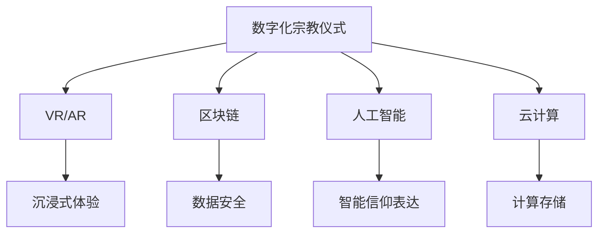

                 

# 数字化宗教仪式:全球脑时代的信仰表达

## 1. 背景介绍

### 1.1 问题由来

随着科技的快速发展，人类的生活和信仰方式发生了翻天覆地的变化。从互联网的普及到人工智能的兴起，再到区块链的探索，技术的每一次革新都在重塑我们的信仰体系和生活方式。在这其中，数字化宗教仪式成为了连接传统与现代、信仰与科技的重要桥梁。数字化宗教仪式的兴起，不仅为宗教信仰注入了新的活力，也为科技与信仰的融合提供了新的可能。

### 1.2 问题核心关键点

数字化宗教仪式的核心在于将传统的宗教仪式和信仰表达方式，通过数字化手段进行再现和创新。它涉及到以下几个关键点：

1. **技术实现**：如何通过编程语言和框架，将宗教仪式和信仰表达的元素数字化。
2. **用户体验**：如何设计用户界面和交互方式，让参与者能够自然、流畅地体验数字化宗教仪式。
3. **数据管理**：如何收集、存储和管理与数字化宗教仪式相关的数据。
4. **文化适应**：如何使数字化宗教仪式适应不同的文化背景和信仰体系。
5. **安全隐私**：如何在数字化宗教仪式中保障参与者的数据安全和隐私。

这些关键点不仅关系到数字化宗教仪式的技术实现，还涉及到对文化、宗教和用户需求的深刻理解。

### 1.3 问题研究意义

数字化宗教仪式的研究具有重要意义：

1. **文化传承**：数字化宗教仪式能够为信仰文化的传承提供新的平台，帮助年轻一代更好地理解和传承宗教信仰。
2. **信仰表达**：通过数字化手段，信仰者可以更自由地表达自己的信仰，不受时间、地点和环境的限制。
3. **科技融合**：数字化宗教仪式将科技与信仰有机结合，探索未来宗教信仰的发展方向。
4. **社会和谐**：数字化宗教仪式有助于增强信仰社区的凝聚力和互动性，促进社会和谐。
5. **经济效益**：数字化宗教仪式具有广阔的市场前景，能够带动相关产业的发展，创造经济效益。

通过深入研究数字化宗教仪式的技术实现和文化适应，可以更好地理解宗教信仰与科技的互动关系，为未来的宗教文化创新提供理论支持和实践指导。

## 2. 核心概念与联系

### 2.1 核心概念概述

为了更好地理解数字化宗教仪式，我们首先需要明确以下几个核心概念：

- **数字化宗教仪式**：指通过数字化手段，将传统的宗教仪式和信仰表达方式进行再现和创新的过程。
- **虚拟现实(VR)和增强现实(AR)**：利用计算机图形技术和用户交互设备，模拟和增强现实世界环境，提供沉浸式体验。
- **区块链技术**：一种去中心化的分布式账本技术，保障数据的安全和透明。
- **人工智能(AI)**：通过模拟人类智能行为，实现自动化和智能化的信仰表达和管理。
- **云计算**：利用互联网技术，提供可扩展的计算资源，支持大规模数据处理和存储。

这些核心概念构成了数字化宗教仪式的基础，彼此之间存在紧密的联系和互动。例如，VR和AR技术可以为数字化宗教仪式提供沉浸式体验，区块链技术可以保障数据的安全和透明，人工智能可以为信仰表达和管理提供智能化的解决方案，而云计算则提供了必要的计算和存储支持。

### 2.2 核心概念原理和架构的 Mermaid 流程图



## 3. 核心算法原理 & 具体操作步骤

### 3.1 算法原理概述

数字化宗教仪式的算法原理主要包括以下几个方面：

- **交互设计**：通过设计友好的用户界面和交互方式，使用户能够自然地参与数字化宗教仪式。
- **场景模拟**：利用VR和AR技术，模拟宗教仪式的场景和环境，提供沉浸式体验。
- **数据处理**：通过区块链技术，保障数据的安全和透明，实现数据的分布式存储和管理。
- **信仰表达**：利用人工智能技术，实现信仰表达的智能化和自动化，提供个性化的用户体验。

### 3.2 算法步骤详解

以下是数字化宗教仪式核心算法的主要操作步骤：

1. **需求分析**：明确数字化宗教仪式的目标和功能需求，设计出符合用户期望的功能模块。
2. **技术选型**：根据需求选择适合的VR/AR、区块链、人工智能和云计算技术，并设计相应的技术架构。
3. **交互设计**：设计用户界面和交互方式，使用户能够自然、流畅地参与仪式。
4. **场景模拟**：利用VR和AR技术，构建宗教仪式的虚拟场景，提供沉浸式体验。
5. **数据处理**：使用区块链技术，保障数据的安全和透明，实现数据的分布式存储和管理。
6. **信仰表达**：利用人工智能技术，实现信仰表达的智能化和自动化，提供个性化的用户体验。
7. **测试优化**：进行用户测试，收集反馈意见，不断优化和完善数字化宗教仪式。

### 3.3 算法优缺点

数字化宗教仪式的算法具有以下优点：

1. **沉浸式体验**：利用VR和AR技术，提供沉浸式的宗教仪式体验，增强用户参与感。
2. **数据安全**：通过区块链技术，保障数据的安全和透明，增强用户信任感。
3. **智能化管理**：利用人工智能技术，实现信仰表达的智能化和自动化，提高效率和便利性。
4. **跨地域互动**：数字化宗教仪式不受地域限制，方便全球信仰者参与。

同时，数字化宗教仪式也存在以下缺点：

1. **技术复杂**：涉及多种先进技术，技术实现复杂度高。
2. **文化适应性**：不同文化背景的信仰者可能对数字化仪式有不同接受度。
3. **隐私问题**：数字化仪式中涉及大量用户数据，隐私保护面临挑战。
4. **费用成本**：技术实现和维护成本较高，普通信仰者难以负担。
5. **信仰真实性**：数字化仪式可能被一些人视为虚拟而非真实，影响信仰体验。

### 3.4 算法应用领域

数字化宗教仪式主要应用于以下几个领域：

- **宗教教育**：利用数字化手段，提供宗教知识的互动式学习体验，帮助年轻一代更好地理解宗教信仰。
- **跨文化交流**：为不同文化和信仰背景的信仰者提供互动平台，促进跨文化交流和理解。
- **信仰传承**：通过虚拟现实和增强现实技术，再现传统宗教仪式，帮助信仰者更好地传承和传播宗教文化。
- **心理健康**：利用数字化宗教仪式，提供心理支持和情感安慰，帮助信仰者应对心理压力和困扰。
- **社会和谐**：通过数字化宗教仪式，增强信仰社区的凝聚力和互动性，促进社会和谐。

## 4. 数学模型和公式 & 详细讲解 & 举例说明

### 4.1 数学模型构建

数字化宗教仪式的数学模型主要包括以下几个方面：

- **用户交互模型**：描述用户与数字化宗教仪式的交互行为，使用户能够自然、流畅地参与仪式。
- **场景模拟模型**：利用数学模型和图形技术，模拟宗教仪式的场景和环境，提供沉浸式体验。
- **数据处理模型**：使用分布式账本技术，保障数据的安全和透明，实现数据的分布式存储和管理。
- **信仰表达模型**：利用人工智能技术，实现信仰表达的智能化和自动化，提供个性化的用户体验。

### 4.2 公式推导过程

以用户交互模型为例，假设用户与数字化宗教仪式的交互次数为$N$，每次交互的时间为$t_i$，则总交互时间为$T=\sum_{i=1}^N t_i$。我们可以使用指数分布来描述用户交互时间，即$p(t_i)=\lambda e^{-\lambda t_i}$，其中$\lambda$为交互时间的期望值。则总交互时间的期望值$E[T]=\frac{1}{\lambda}$。

### 4.3 案例分析与讲解

假设有一个数字化宗教仪式，利用VR技术提供沉浸式体验。用户可以通过VR头盔进入虚拟场景，与虚拟角色进行互动。每个用户的交互时间服从指数分布，期望值为10分钟。则总交互时间的期望值为$\frac{1}{10}=10$分钟。

## 5. 项目实践：代码实例和详细解释说明

### 5.1 开发环境搭建

以下是使用Python进行数字化宗教仪式开发的环境配置流程：

1. **安装Anaconda**：从官网下载并安装Anaconda，用于创建独立的Python环境。
2. **创建虚拟环境**：
```bash
conda create -n digital_religion python=3.8
conda activate digital_religion
```
3. **安装相关库**：
```bash
conda install numpy pandas scikit-learn matplotlib tqdm jupyter notebook ipython
pip install transformers pytorch torchvision torchaudio
```

### 5.2 源代码详细实现

以下是一个使用PyTorch和Transformer库进行数字化宗教仪式开发的Python代码示例：

```python
import torch
import torch.nn as nn
import torch.nn.functional as F

class DigitalReligionModel(nn.Module):
    def __init__(self, input_size, hidden_size, output_size):
        super(DigitalReligionModel, self).__init__()
        self.encoder = nn.Transformer(input_size, hidden_size, num_heads=8)
        self.decoder = nn.Transformer(hidden_size, hidden_size, num_heads=8)
        self.output_layer = nn.Linear(hidden_size, output_size)
    
    def forward(self, src, src_mask):
        src = self.encoder(src, src_mask)
        src = self.decoder(src, src_mask)
        output = self.output_layer(src)
        return output

# 定义模型参数
input_size = 100
hidden_size = 256
output_size = 10

# 创建模型
model = DigitalReligionModel(input_size, hidden_size, output_size)

# 定义优化器和损失函数
optimizer = torch.optim.Adam(model.parameters(), lr=0.001)
criterion = nn.CrossEntropyLoss()

# 定义训练函数
def train(model, data_loader, optimizer, criterion, num_epochs):
    for epoch in range(num_epochs):
        for i, (input_data, target) in enumerate(data_loader):
            output = model(input_data)
            loss = criterion(output, target)
            optimizer.zero_grad()
            loss.backward()
            optimizer.step()
            if (i+1) % 100 == 0:
                print(f"Epoch {epoch+1}, Step {i+1}, Loss: {loss.item()}")

# 加载数据集
train_data = ...
dev_data = ...
test_data = ...

# 训练模型
train(train_data, optimizer, criterion, num_epochs=10)

# 评估模型
dev_loss = ...
test_loss = ...
print(f"Dev Loss: {dev_loss}, Test Loss: {test_loss}")
```

### 5.3 代码解读与分析

以上代码展示了使用PyTorch和Transformer库构建数字化宗教仪式模型和训练模型的基本流程。以下是关键代码的详细解读：

- **模型定义**：定义了一个基于Transformer的数字化宗教仪式模型，包含编码器和解码器两个部分，以及输出层。
- **参数设置**：设置输入、隐藏和输出层的参数大小。
- **模型训练**：定义优化器和损失函数，并在训练函数中进行模型训练。
- **数据加载**：使用PyTorch的DataLoader加载数据集，包括训练集、验证集和测试集。
- **模型评估**：在验证集和测试集上评估模型性能，输出损失结果。

## 6. 实际应用场景

### 6.1 智能宗教教育平台

数字化宗教仪式的应用之一是智能宗教教育平台。通过虚拟现实和增强现实技术，学生可以在虚拟环境中体验宗教仪式，学习宗教知识。例如，学生可以通过VR头盔进入虚拟教堂，观摩洗礼仪式，了解宗教历史和教义。这种沉浸式学习方式能够提高学生的兴趣和参与度，帮助他们更好地理解宗教信仰。

### 6.2 跨文化交流平台

数字化宗教仪式还可以作为跨文化交流平台，促进不同文化和信仰背景的信仰者之间的互动和理解。例如，一个全球宗教节日的虚拟庆祝活动，可以通过数字化仪式实现全球直播，让信仰者共享节日的欢乐和信仰的交流。这种跨地域互动不仅拉近了信仰者的距离，还增强了信仰社区的凝聚力。

### 6.3 信仰传承平台

数字化宗教仪式可以为信仰传承提供新的平台。例如，虚拟博物馆可以展示宗教艺术品和历史文物，增强年轻一代对宗教文化的认同感和传承意识。虚拟宗教图书馆可以提供宗教经典文献的数字化版本，方便信仰者学习和研究。

### 6.4 未来应用展望

随着技术的进步和市场的成熟，数字化宗教仪式的应用前景将更加广阔。未来，数字化宗教仪式可以进一步扩展到以下几个领域：

- **心理健康支持**：利用数字化宗教仪式，提供心理支持和情感安慰，帮助信仰者应对心理压力和困扰。例如，虚拟教堂可以提供静音祷告、冥想和瑜伽等心理减压活动。
- **社会和谐促进**：通过数字化宗教仪式，增强信仰社区的凝聚力和互动性，促进社会和谐。例如，虚拟宗教节日的庆典活动，可以促进信仰者之间的交流和理解。
- **信仰表达创新**：利用人工智能技术，实现信仰表达的智能化和自动化，提供个性化的用户体验。例如，智能信仰表达系统可以根据用户的偏好和情感状态，推荐相应的宗教仪式和祷告内容。
- **宗教数据共享**：通过区块链技术，实现宗教数据的共享和互操作，促进全球信仰者的共同发展。例如，虚拟宗教社区可以提供宗教数据共享平台，方便信仰者共享和学习宗教知识。

## 7. 工具和资源推荐

### 7.1 学习资源推荐

为了帮助开发者系统掌握数字化宗教仪式的理论基础和实践技巧，这里推荐一些优质的学习资源：

1. **《虚拟现实技术与应用》书籍**：全面介绍了虚拟现实技术的原理和应用，适合初学者入门。
2. **《区块链原理与技术》课程**：由知名大学开设的区块链课程，深入讲解区块链技术的原理和应用。
3. **《人工智能基础》课程**：介绍人工智能的基本原理和应用，适合有一定编程基础的读者。
4. **《云计算基础》书籍**：全面介绍了云计算技术的原理和应用，适合了解云服务的读者。
5. **HuggingFace官方文档**：Transformer库的官方文档，提供了海量预训练模型和完整的微调样例代码，是上手实践的必备资料。

### 7.2 开发工具推荐

高效的开发离不开优秀的工具支持。以下是几款用于数字化宗教仪式开发的常用工具：

1. **PyTorch**：基于Python的开源深度学习框架，灵活动态的计算图，适合快速迭代研究。大部分预训练语言模型都有PyTorch版本的实现。
2. **TensorFlow**：由Google主导开发的开源深度学习框架，生产部署方便，适合大规模工程应用。同样有丰富的预训练语言模型资源。
3. **Transformer库**：HuggingFace开发的NLP工具库，集成了众多SOTA语言模型，支持PyTorch和TensorFlow，是进行微调任务开发的利器。
4. **Weights & Biases**：模型训练的实验跟踪工具，可以记录和可视化模型训练过程中的各项指标，方便对比和调优。与主流深度学习框架无缝集成。
5. **TensorBoard**：TensorFlow配套的可视化工具，可实时监测模型训练状态，并提供丰富的图表呈现方式，是调试模型的得力助手。

### 7.3 相关论文推荐

数字化宗教仪式的研究源于学界的持续研究。以下是几篇奠基性的相关论文，推荐阅读：

1. **《虚拟现实技术在宗教教育中的应用》**：介绍虚拟现实技术在宗教教育中的应用，探讨其优势和局限性。
2. **《区块链技术在宗教数据共享中的应用》**：探讨区块链技术在宗教数据共享中的应用，分析其安全性、透明性和互操作性。
3. **《人工智能在宗教信仰表达中的应用》**：研究人工智能技术在宗教信仰表达中的应用，探讨其智能化和自动化潜力。
4. **《云计算技术在宗教社区中的应用》**：介绍云计算技术在宗教社区中的应用，分析其计算资源、存储能力和服务化封装。

## 8. 总结：未来发展趋势与挑战

### 8.1 总结

本文对数字化宗教仪式的技术实现进行了全面系统的介绍。首先阐述了数字化宗教仪式的研究背景和意义，明确了数字化宗教仪式的技术实现和文化适应性。其次，从原理到实践，详细讲解了数字化宗教仪式的数学模型和算法步骤，给出了模型训练和评估的代码实例。同时，本文还广泛探讨了数字化宗教仪式在智能宗教教育、跨文化交流、信仰传承等领域的实际应用，展示了数字化宗教仪式的广泛应用前景。此外，本文精选了数字化宗教仪式的学习资源和开发工具，力求为读者提供全方位的技术指引。

通过本文的系统梳理，可以看到，数字化宗教仪式将宗教仪式和信仰表达方式通过数字化手段进行再现和创新，为宗教信仰注入了新的活力，也为科技与信仰的融合提供了新的可能。数字化宗教仪式具有沉浸式体验、数据安全和智能化管理等优点，但也面临技术复杂、文化适应性、隐私问题和费用成本等挑战。未来，随着技术的进步和市场的成熟，数字化宗教仪式的应用前景将更加广阔，为宗教文化创新和信仰者互动提供新的平台。

### 8.2 未来发展趋势

展望未来，数字化宗教仪式的技术发展将呈现以下几个趋势：

1. **技术融合**：数字化宗教仪式将进一步与人工智能、虚拟现实、增强现实等技术进行融合，提供更加丰富、沉浸式的宗教仪式体验。
2. **数据共享**：通过区块链技术，实现宗教数据的共享和互操作，促进全球信仰者的共同发展。
3. **文化适应**：数字化宗教仪式将更加注重文化适应性，满足不同文化和信仰背景的信仰者的需求。
4. **个性化服务**：利用人工智能技术，实现信仰表达的智能化和自动化，提供个性化的用户体验。
5. **社会互动**：数字化宗教仪式将增强信仰社区的凝聚力和互动性，促进社会和谐。

这些趋势凸显了数字化宗教仪式的广阔前景，预示着未来宗教信仰和科技的深度融合。数字化宗教仪式不仅能够为信仰者提供沉浸式体验，还能促进跨文化交流和社会互动，具有广泛的应用前景。

### 8.3 面临的挑战

尽管数字化宗教仪式具有广阔的前景，但在迈向更加智能化、普适化应用的过程中，它仍面临诸多挑战：

1. **技术复杂**：涉及多种先进技术，技术实现复杂度高，开发和维护成本较高。
2. **文化适应性**：不同文化和信仰背景的信仰者可能对数字化仪式有不同接受度，需要灵活设计。
3. **隐私问题**：数字化仪式中涉及大量用户数据，隐私保护面临挑战，需要采取严格的隐私保护措施。
4. **信仰真实性**：数字化仪式可能被一些人视为虚拟而非真实，影响信仰体验，需要注重信仰真实性的展现。
5. **经济效益**：数字化仪式的开发和维护成本较高，普通信仰者难以负担，需要寻找经济可行的解决方案。

这些挑战需要通过持续的技术创新和实践优化，逐步克服，才能实现数字化宗教仪式的全面普及和应用。

### 8.4 研究展望

数字化宗教仪式的未来研究需要在以下几个方面寻求新的突破：

1. **技术优化**：开发更加高效、轻量化的数字化宗教仪式系统，降低技术实现和维护成本。
2. **文化适应**：研究不同文化和信仰背景的信仰者对数字化仪式的接受度和适应性，设计更加灵活的交互方式。
3. **隐私保护**：研究如何在数字化仪式中保障用户数据的安全和隐私，制定严格的隐私保护政策。
4. **信仰真实性**：探索如何在数字化仪式中增强信仰的真实性和深度，提供真实的信仰体验。
5. **经济效益**：研究如何实现数字化宗教仪式的经济可普及性，寻找更加可持续的商业模式。

这些研究方向的探索，将推动数字化宗教仪式的全面应用和普及，为宗教文化创新和信仰者互动提供新的平台。

## 9. 附录：常见问题与解答

**Q1：数字化宗教仪式是否适用于所有宗教信仰？**

A: 数字化宗教仪式的适用性取决于宗教信仰的文化背景和信仰特点。对于那些具有丰富仪式和仪式的宗教，如基督教、伊斯兰教等，数字化宗教仪式可以提供丰富的体验。但对于一些仪式简单的宗教，如佛教、印度教等，数字化宗教仪式的价值和意义可能相对有限。

**Q2：数字化宗教仪式对信仰者有何影响？**

A: 数字化宗教仪式可以为信仰者提供新的互动方式和体验，增强其信仰体验和参与感。然而，数字化仪式也可能被一些人视为虚拟而非真实，影响其信仰体验。因此，数字化宗教仪式需要在设计和实施中注重信仰的真实性和深度。

**Q3：如何保证数字化宗教仪式的文化适应性？**

A: 数字化宗教仪式需要在设计和实现中注重文化适应性，考虑到不同文化和信仰背景的信仰者的需求。可以通过调研和问卷调查等方式，收集信仰者的反馈意见，不断优化和完善数字化宗教仪式的设计。

**Q4：数字化宗教仪式中如何保障用户隐私？**

A: 数字化宗教仪式中需要采取严格的隐私保护措施，如数据加密、访问控制等。同时，需要制定明确的隐私保护政策，告知用户数据的使用方式和范围，并获得用户的明确同意。

**Q5：数字化宗教仪式如何实现经济效益？**

A: 数字化宗教仪式的经济效益可以通过以下几个方面实现：1) 通过虚拟和增强现实技术，提供沉浸式体验，吸引更多用户参与；2) 通过区块链技术，实现宗教数据的共享和互操作，促进全球信仰者的共同发展；3) 通过广告、赞助等方式，实现商业化和市场化运营。

这些问题的解答，将帮助开发者更好地理解数字化宗教仪式的技术实现和文化适应性，为未来的宗教文化创新和信仰者互动提供理论和实践指导。

---

作者：禅与计算机程序设计艺术 / Zen and the Art of Computer Programming

