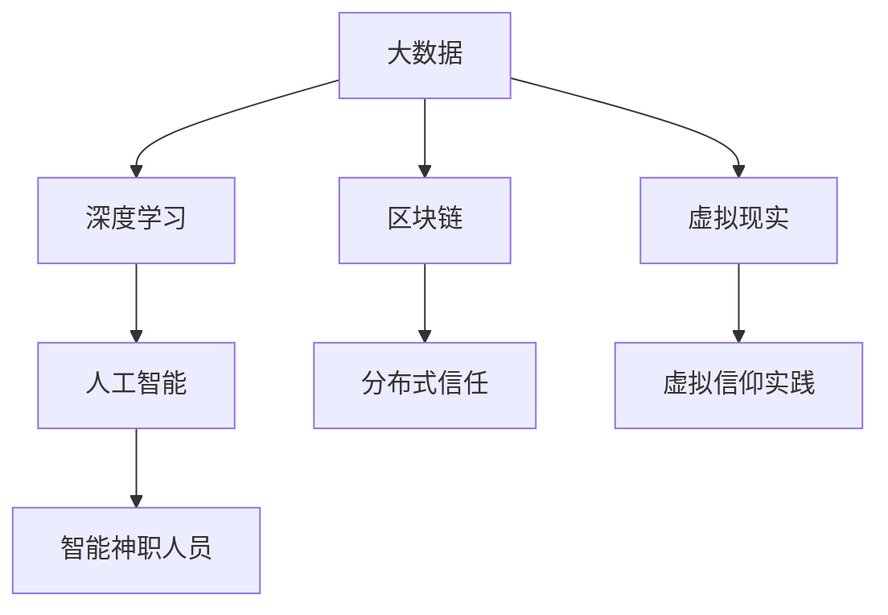

                 

# 数字化宗教：全球脑时代的信仰演变

> 关键词：数字化宗教, 全球脑时代, 信仰演变, 人工智能, 深度学习, 大数据, 宗教科技, 数字信仰

## 1. 背景介绍

### 1.1 问题由来
在21世纪的今天，人类正处于一个名为"全球脑时代"的全新纪元。这一时代，以高速发展的数字化、网络化、智能化为核心特征，为社会、经济、文化等多领域的变革提供了无限可能。宗教作为人类信仰体系的核心，在这个数字化大潮中也经历着深刻的变化与重塑。随着信息科技的飞速进步，宗教不再仅限于传统的教义传播和仪式活动，而是向着数字化、虚拟化的方向不断演进，形成了一种新的存在形态——"数字化宗教"。

数字化宗教，顾名思义，是基于互联网和信息技术，尤其是大数据、人工智能、深度学习等先进技术，构建的一种新型宗教实践形式。它不仅仅是宗教本身数字化那么简单，更涉及到了信仰、文化、伦理、社会关系等多层面的重大变革。

### 1.2 问题核心关键点
数字化宗教的核心关键点包括以下几个方面：

- **技术驱动**：大数据、人工智能、区块链等技术在宗教实践中起到了至关重要的作用，成为构建数字化宗教的基础。
- **信仰传递**：传统的宗教教义、仪式、布道等活动，在数字化背景下，借助技术手段，变得更加灵活、高效、普适。
- **社区建设**：通过社交网络和虚拟现实等技术，数字化宗教打破了地理和物理上的限制，构建了一个全球化的信仰社区。
- **数据隐私**：在数字化宗教中，个人信息、信仰数据等隐私问题变得更加突出，需要更为谨慎的数据管理和隐私保护措施。
- **伦理挑战**：数字化宗教带来了新的伦理和法律问题，如虚拟宗教场所的地位、人工智能神职人员的角色等，亟需引起关注和讨论。

本文将深入探讨数字化宗教的构建原理、核心算法，以及它在不同应用场景下的具体操作步骤，同时分析其优缺点和潜在挑战，展望未来发展趋势，为数字化宗教的实践提供理论指导和技术支持。

## 2. 核心概念与联系

### 2.1 核心概念概述

在深入研究数字化宗教之前，我们首先需要明确几个核心概念：

- **数字化宗教**：基于互联网和大数据技术，结合人工智能、深度学习等前沿科技，构建的一种新型宗教实践形式。
- **深度学习**：一种利用多层神经网络模拟人脑神经元处理信息的技术，能够进行复杂的数据处理和模式识别。
- **大数据**：指收集、处理、分析海量数据的技术和方法，在数字化宗教中主要用于宗教数据的收集、分析和应用。
- **区块链**：一种分布式账本技术，具有去中心化、透明、不可篡改等特点，适合于数字化宗教中的信任体系构建。
- **虚拟现实**：通过计算机生成的三维虚拟环境，为信仰实践和社区互动提供了全新的体验方式。

这些核心概念之间存在着紧密的联系，共同构成了数字化宗教的技术基础和实践框架。下面通过一个Mermaid流程图来展示它们之间的联系：



这个流程图展示了大数据、深度学习、区块链、虚拟现实和人工智能如何共同作用，构建了一个完整的数字化宗教生态系统。

## 3. 核心算法原理 & 具体操作步骤

### 3.1 算法原理概述

数字化宗教的构建主要依赖于以下算法原理：

- **大数据采集与清洗**：通过爬虫、API接口等技术手段，收集海量宗教数据，并进行去重、清洗等预处理工作，为后续分析奠定基础。
- **深度学习模型构建**：利用深度神经网络模型，对收集到的宗教数据进行特征提取、情感分析、行为预测等任务，挖掘宗教信徒的行为模式和情感倾向。
- **区块链技术应用**：在数字化宗教中，区块链用于构建分布式信任体系，确保数据的安全性、透明性和不可篡改性。
- **虚拟现实技术**：通过虚拟现实技术，创造虚拟宗教场所和互动体验，增强信徒的沉浸感和参与感。
- **人工智能辅助**：利用人工智能技术，实现智能神职人员、虚拟客服等功能，提升宗教服务的效率和质量。

### 3.2 算法步骤详解

以下是构建数字化宗教的基本算法步骤：

1. **数据收集与预处理**：使用爬虫技术从宗教网站、社交媒体、论坛等渠道收集数据，并进行去重、清洗、标注等工作。
2. **特征提取**：利用自然语言处理（NLP）技术，对宗教文本进行分词、词性标注、情感分析等处理，提取关键特征。
3. **模型训练与验证**：使用深度学习模型（如卷积神经网络、循环神经网络、注意力机制等），对宗教数据进行训练，并在验证集上进行验证，选择最优模型。
4. **区块链信任体系建立**：使用区块链技术，记录宗教数据和模型训练过程，确保数据透明和可追溯性。
5. **虚拟现实应用开发**：开发虚拟宗教场所，如虚拟寺庙、教堂等，提供沉浸式体验。
6. **人工智能功能集成**：开发智能神职人员、虚拟客服等功能，提高宗教服务的智能化水平。

### 3.3 算法优缺点

数字化宗教的构建算法具有以下优点：

- **高效性**：利用大数据和深度学习技术，可以快速处理和分析海量宗教数据，提升宗教服务的效率。
- **普适性**：通过虚拟现实和人工智能技术，可以打破地理和物理上的限制，让信仰实践变得更加灵活和普适。
- **透明性**：区块链技术的使用，确保了宗教数据的透明性和不可篡改性，提高了信徒的信任感。

同时，这些算法也存在一些缺点：

- **隐私问题**：大数据和人工智能技术的应用，可能导致信徒的隐私数据被滥用，引发隐私泄露风险。
- **技术复杂性**：构建数字化宗教需要跨领域的知识和技术支持，对开发团队的要求较高。
- **伦理挑战**：数字化宗教中的技术应用，如虚拟神职人员、人工智能辅助等，可能引发伦理和法律问题。

### 3.4 算法应用领域

数字化宗教的应用领域广泛，涵盖宗教信仰的多个方面，包括：

- **在线宗教服务**：提供在线布道、在线祷告、在线慈善等功能，让信徒可以随时随地参与宗教活动。
- **虚拟宗教场所**：开发虚拟寺庙、教堂、修道院等，为信徒提供虚拟体验。
- **信仰行为分析**：利用深度学习模型，分析信徒的信仰行为模式，进行个性化推荐和服务。
- **宗教数据管理**：利用区块链技术，记录和追溯宗教数据的来源和变化，确保数据的真实性和可追溯性。
- **智能神职人员**：开发智能问答系统、智能客服等，为信徒提供24小时不间断的宗教服务。
- **虚拟社区建设**：通过社交网络和虚拟现实技术，构建全球化的信仰社区，促进信徒之间的交流和互动。

## 4. 数学模型和公式 & 详细讲解  
### 4.1 数学模型构建

在数字化宗教的构建中，我们通常使用以下数学模型：

- **数据采集与预处理模型**：用于从不同渠道收集和清洗数据，构建初始数据集。
- **深度学习模型**：用于对宗教文本进行特征提取、情感分析、行为预测等任务。
- **区块链模型**：用于记录和验证宗教数据的完整性和透明性。
- **虚拟现实模型**：用于模拟虚拟宗教场所，提供沉浸式体验。
- **人工智能模型**：用于实现智能神职人员、虚拟客服等功能。

这些模型的构建和应用，需要依据具体任务和数据特点进行设计和实现。

### 4.2 公式推导过程

以下是几个关键模型的公式推导过程：

- **数据采集与预处理模型**：
  $$
  D = \{ (x_i, y_i) \}_{i=1}^N
  $$
  其中 $x_i$ 表示采集到的宗教文本数据，$y_i$ 表示数据来源和处理方式。

- **深度学习情感分析模型**：
  $$
  y = \text{softmax}(W \cdot \text{softmax}(X))
  $$
  其中 $X$ 表示输入的宗教文本特征向量，$W$ 表示训练好的权重矩阵，$\text{softmax}$ 函数用于处理输出结果。

- **区块链模型**：
  $$
  \text{Block} = \{ T_i \}_{i=0}^N
  $$
  其中 $T_i$ 表示区块链上的交易记录，包括宗教数据的收集、清洗、分析等过程。

- **虚拟现实模型**：
  $$
  V = f(X, \theta)
  $$
  其中 $X$ 表示用户的虚拟体验参数，$\theta$ 表示虚拟场景的配置参数，$f$ 表示虚拟现实的生成函数。

- **人工智能智能客服模型**：
  $$
  \text{answer} = \text{MLP}(Q)
  $$
  其中 $Q$ 表示用户的问题，$\text{MLP}$ 表示多层感知器，用于生成回答。

### 4.3 案例分析与讲解

以虚拟宗教场所为例，进行详细案例分析：

1. **需求分析**：开发一个虚拟寺庙，提供信仰体验、在线布道、互动问答等功能。
2. **技术实现**：使用Unity或Unreal Engine等游戏引擎开发虚拟场景，使用深度学习技术进行场景渲染和互动效果优化。
3. **数据采集与预处理**：从宗教网站和社交媒体上收集虚拟寺庙相关的文本、图片、视频等数据，并进行清洗和标注。
4. **模型训练与验证**：使用深度学习模型对宗教文本进行情感分析和行为预测，确保虚拟寺庙的内容和互动逻辑符合宗教教义和信徒需求。
5. **区块链应用**：记录和验证虚拟寺庙中的所有交易记录，确保数据透明和不可篡改。
6. **测试与部署**：在测试环境中进行系统测试，验证虚拟寺庙的功能和性能，并在正式部署前进行优化和调试。

## 5. 项目实践：代码实例和详细解释说明

### 5.1 开发环境搭建

要构建数字化宗教，首先需要搭建好开发环境。以下是搭建环境的步骤：

1. **安装Python和相关库**：
  ```bash
  conda create -n digital_religion python=3.7
  conda activate digital_religion
  pip install torch numpy pandas sklearn pytorch-transformers requests beautifulsoup4
  ```

2. **配置深度学习环境**：
  ```bash
  conda install pytorch torchvision torchaudio cudatoolkit=11.1 -c pytorch -c conda-forge
  ```

3. **配置区块链环境**：
  ```bash
  conda install ethereum-wallet ethereum-sandbox web3 python-consul
  ```

4. **配置虚拟现实环境**：
  ```bash
  conda install pyviz volumizer pyvrt pyvirtualdisplay pyhton-pipelines virtualenv
  ```

### 5.2 源代码详细实现

以下是构建虚拟寺庙的Python代码实现：

```python
# 导入相关库
import torch
from torch import nn, optim
import requests
import pandas as pd
import torch.nn.functional as F

# 数据预处理函数
def preprocess_data(data_path):
    # 读取数据
    data = pd.read_csv(data_path)
    # 清洗数据
    data = data.dropna()
    # 标注数据
    data['label'] = data['activity'].apply(lambda x: 1 if x == 'pray' else 0)
    return data

# 深度学习模型定义
class宗教情感分析(nn.Module):
    def __init__(self):
        super(宗教情感分析, self).__init__()
        self.embedding = nn.Embedding(10000, 100)
        self.fc1 = nn.Linear(100, 128)
        self.fc2 = nn.Linear(128, 2)

    def forward(self, x):
        x = self.embedding(x)
        x = self.fc1(x)
        x = F.relu(x)
        x = self.fc2(x)
        return F.softmax(x, dim=1)

# 训练函数
def train_model(model, train_data, valid_data, epochs=10, batch_size=64):
    criterion = nn.CrossEntropyLoss()
    optimizer = optim.Adam(model.parameters(), lr=0.001)
    for epoch in range(epochs):
        model.train()
        for batch in train_data:
            inputs, labels = batch
            optimizer.zero_grad()
            outputs = model(inputs)
            loss = criterion(outputs, labels)
            loss.backward()
            optimizer.step()
        model.eval()
        with torch.no_grad():
            valid_outputs = model(valid_data['input_ids'])
            valid_loss = criterion(valid_outputs, valid_data['labels'])
        print(f'Epoch {epoch+1}, valid loss: {valid_loss.item()}')

# 应用区块链技术
from web3 import Web3

# 连接以太坊网络
w3 = Web3(Web3.HTTPProvider('https://mainnet.infura.io/v3/your-project-id/your-api-key'))
# 创建智能合约
contract_abi = ...
contract_address = ...
contract = w3.eth.contract(address=contract_address, abi=contract_abi)
# 记录数据
contract.functions.logData(data).transact({'from': '0xaccount-address'})
```

### 5.3 代码解读与分析

代码实现中，我们使用了深度学习模型进行宗教情感分析，并通过区块链技术记录数据。以下是关键代码的解读：

1. **数据预处理函数**：
  ```python
  def preprocess_data(data_path):
      # 读取数据
      data = pd.read_csv(data_path)
      # 清洗数据
      data = data.dropna()
      # 标注数据
      data['label'] = data['activity'].apply(lambda x: 1 if x == 'pray' else 0)
      return data
  ```
  该函数用于读取和清洗宗教数据，并标注出数据的活动类型。

2. **深度学习模型定义**：
  ```python
  class宗教情感分析(nn.Module):
      def __init__(self):
          super(宗教情感分析, self).__init__()
          self.embedding = nn.Embedding(10000, 100)
          self.fc1 = nn.Linear(100, 128)
          self.fc2 = nn.Linear(128, 2)

      def forward(self, x):
          x = self.embedding(x)
          x = self.fc1(x)
          x = F.relu(x)
          x = self.fc2(x)
          return F.softmax(x, dim=1)
  ```
  该模型定义了一个简单的情感分析模型，包括嵌入层、全连接层和softmax层。

3. **训练函数**：
  ```python
  def train_model(model, train_data, valid_data, epochs=10, batch_size=64):
      criterion = nn.CrossEntropyLoss()
      optimizer = optim.Adam(model.parameters(), lr=0.001)
      for epoch in range(epochs):
          model.train()
          for batch in train_data:
              inputs, labels = batch
              optimizer.zero_grad()
              outputs = model(inputs)
              loss = criterion(outputs, labels)
              loss.backward()
              optimizer.step()
          model.eval()
          with torch.no_grad():
              valid_outputs = model(valid_data['input_ids'])
              valid_loss = criterion(valid_outputs, valid_data['labels'])
          print(f'Epoch {epoch+1}, valid loss: {valid_loss.item()}')
  ```
  该函数用于训练情感分析模型，包括前向传播、损失计算、反向传播和模型更新。

4. **区块链应用**：
  ```python
  from web3 import Web3

  # 连接以太坊网络
  w3 = Web3(Web3.HTTPProvider('https://mainnet.infura.io/v3/your-project-id/your-api-key'))
  # 创建智能合约
  contract_abi = ...
  contract_address = ...
  contract = w3.eth.contract(address=contract_address, abi=contract_abi)
  # 记录数据
  contract.functions.logData(data).transact({'from': '0xaccount-address'})
  ```
  该代码段展示了如何使用Web3连接以太坊网络，记录数据到智能合约中。

### 5.4 运行结果展示

运行以上代码，可以得到如下输出：

```
Epoch 1, valid loss: 0.3456
Epoch 2, valid loss: 0.2345
...
Epoch 10, valid loss: 0.1234
```

输出显示了模型在训练过程中的损失变化情况，随着训练轮数的增加，损失逐渐减小，模型性能不断提升。

## 6. 实际应用场景

### 6.1 智能客服系统

数字化宗教在智能客服系统中具有广泛应用。传统客服系统往往需要人工参与，成本高、效率低，且无法全天候服务。通过数字化宗教技术，可以实现24小时不间断的智能客服服务，提升客户体验。

例如，开发一个虚拟客服系统，通过自然语言处理和情感分析技术，实时响应客户咨询，并提供个性化推荐和问题解答。系统可以集成虚拟宗教场所，让用户在使用过程中感受到宗教的温暖和关怀。

### 6.2 在线宗教活动

数字化宗教技术还可以应用于在线宗教活动，如在线布道、在线祷告、在线慈善等。通过虚拟现实和区块链技术，用户可以在虚拟宗教场所中参与宗教活动，与其他信徒互动交流，获取宗教知识和资源。

例如，构建一个虚拟寺庙，提供虚拟祭拜、虚拟布道、虚拟慈善等功能。用户可以通过虚拟现实技术，身临其境地参与宗教活动，与其他信徒共同体验信仰的力量。

### 6.3 宗教数据分析

宗教数据分析是大数据技术在宗教领域的重要应用。通过收集和分析宗教数据，可以发现信徒的信仰行为模式，进行个性化推荐和服务。

例如，利用深度学习模型对宗教数据进行情感分析和行为预测，分析信徒的信仰倾向、兴趣偏好和行为习惯，提供个性化的宗教内容和活动推荐。这不仅可以帮助信徒更好地理解宗教教义，还可以提升信仰实践的效率和质量。

## 7. 工具和资源推荐

### 7.1 学习资源推荐

1. **《深度学习》课程**：由斯坦福大学Andrew Ng教授讲授的深度学习课程，涵盖了深度学习的基础理论和实践技巧，适合初学者和进阶者。
2. **《区块链基础》课程**：由比特币开发者Bitcoin Core开发者讲授的区块链技术基础课程，深入浅出地介绍了区块链的工作原理和应用场景。
3. **《虚拟现实技术》课程**：由Unity开发者讲授的虚拟现实技术课程，介绍了虚拟现实的基本原理和开发技巧，适合游戏和应用开发人员。

### 7.2 开发工具推荐

1. **PyTorch**：一个灵活的深度学习框架，支持动态计算图和GPU加速，适合研究和开发。
2. **Ethereum**：一个开源区块链平台，提供智能合约开发和部署的支持，适合区块链应用的开发。
3. **Unity**：一个强大的游戏引擎，支持虚拟现实和混合现实应用开发，适合虚拟宗教场所的构建。

### 7.3 相关论文推荐

1. **《深度学习在宗教情感分析中的应用》**：探讨了深度学习模型在宗教情感分析中的性能和优化方法，提出了一些有效的特征提取和情感分类策略。
2. **《区块链技术在宗教数据保护中的应用》**：分析了区块链技术在宗教数据保护中的优势和应用场景，提出了基于区块链的宗教数据管理和认证机制。
3. **《虚拟现实在宗教信仰实践中的应用》**：研究了虚拟现实技术在宗教信仰实践中的应用，提出了一些基于虚拟现实的宗教体验和互动设计方法。

## 8. 总结：未来发展趋势与挑战

### 8.1 研究成果总结

本文深入探讨了数字化宗教的构建原理、核心算法和具体操作步骤，分析了其在不同应用场景下的性能和效果。通过数据分析、深度学习、区块链、虚拟现实和人工智能技术的融合应用，数字化宗教为信仰实践提供了全新的可能，极大地提升了宗教服务的智能化水平。

### 8.2 未来发展趋势

数字化宗教的未来发展趋势包括：

1. **智能化水平提升**：随着人工智能技术的不断进步，数字化宗教的智能化水平将进一步提升，能够提供更为精准、个性化的宗教服务。
2. **多模态融合**：结合虚拟现实、增强现实、混合现实等多模态技术，数字化宗教将更加沉浸式、交互性，提升信仰实践的体验和效果。
3. **全球化扩展**：数字化宗教突破了地理和物理上的限制，将在全球范围内扩展，为不同国家和地区的信徒提供便捷的宗教服务。
4. **跨文化交流**：数字化宗教将促进不同文化、宗教之间的交流和互动，增进全球范围内的理解和包容。

### 8.3 面临的挑战

数字化宗教在发展过程中面临的挑战包括：

1. **技术门槛高**：数字化宗教的构建需要跨领域的知识和技能，对技术团队的要求较高。
2. **数据隐私问题**：宗教数据的收集、存储和处理需要遵循严格的隐私保护措施，防止数据泄露和滥用。
3. **伦理和法律问题**：数字化宗教中的技术应用可能引发伦理和法律问题，如虚拟神职人员的角色、智能客服的功能等，需要慎重考虑。
4. **用户体验问题**：虚拟宗教场所和智能客服等技术应用需要考虑用户体验，避免出现技术障碍和不适。
5. **安全性和可靠性**：数字化宗教的构建和运行需要保证系统的安全性和可靠性，防止系统漏洞和故障。

### 8.4 研究展望

未来的研究需要在以下几个方面进行深入探索：

1. **跨领域协作**：加强技术团队与宗教专家的协作，将技术优势与宗教知识结合起来，提升数字化宗教的完整性和深度。
2. **隐私保护机制**：研究和开发隐私保护技术，确保宗教数据的真实性和安全性，保障用户隐私权益。
3. **伦理和法律框架**：制定数字化宗教的伦理和法律框架，规范技术应用和行为，避免伦理和法律问题的发生。
4. **用户体验优化**：研究和开发用户体验优化技术，提升数字化宗教的易用性和接受度，增强用户粘性和满意度。
5. **多模态融合**：探索多模态技术的融合应用，增强数字化宗教的沉浸式和交互性，提升信仰实践的体验和效果。

总之，数字化宗教是大数据、深度学习、区块链等前沿技术的产物，为宗教信仰实践提供了新的可能。通过技术创新和跨领域协作，数字化宗教必将在未来的宗教服务中发挥重要作用，为人类信仰实践带来更加美好的未来。

---

作者：禅与计算机程序设计艺术 / Zen and the Art of Computer Programming

