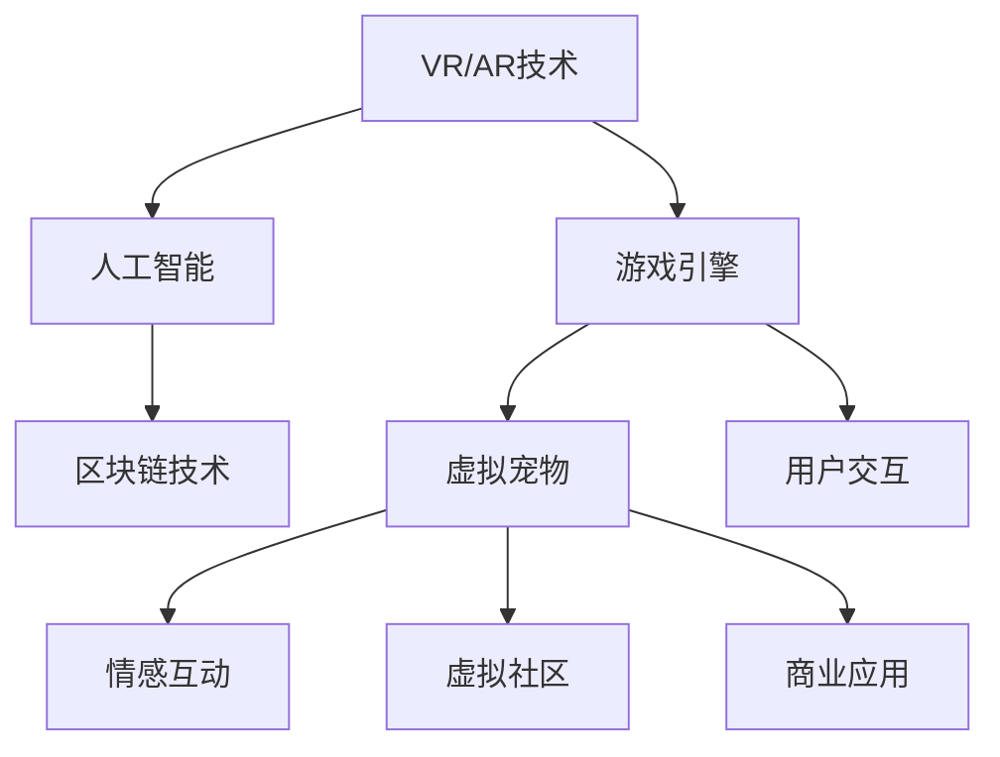

                 

# 数字化宠物:元宇宙中的情感寄托

## 1. 背景介绍

在数字化时代，技术的进步使人们与数字世界的联系愈发紧密。尤其是随着虚拟现实(VR)、增强现实(AR)等技术的快速发展，虚拟世界已不再仅仅局限于游戏和娱乐，而是逐步拓展到日常生活、工作、学习、社交等多个领域。在元宇宙(Ever-connected Universe)的大背景下，虚拟世界的应用场景正在不断扩大，各行各业都在寻找新的数字化转型路径。其中，数字化宠物作为一种新兴的虚拟宠物形式，逐渐受到越来越多人的青睐。数字化宠物不仅能提供情感陪伴，还能激发用户在虚拟世界中的互动和探索，甚至成为一种跨平台互动的新方式。

### 1.1 数字化宠物的概念和优势

数字化宠物，通常指通过数字技术在虚拟空间中创建的宠物角色。这些虚拟宠物可以被赋予生命特征，如成长、繁殖、学习等，与现实宠物的互动类似。与传统宠物相比，数字化宠物具有以下优势：

1. **可获得性高**：不受地理、时间等物理限制，用户可以在任何地方、任何时间与宠物互动。
2. **低维护成本**：不需要食物、饮水、运动等日常维护，降低了用户的时间和精力成本。
3. **可定制性高**：用户可以自定义宠物的外形、性格、技能等，满足个性化需求。
4. **互动性强**：通过虚拟现实和增强现实技术，用户可以与宠物进行更丰富的互动和沉浸式体验。
5. **跨平台兼容性**：能够在不同的平台（如手机、电脑、VR设备等）上进行无缝切换，保持一致的体验。

### 1.2 数字化宠物的应用场景

数字化宠物的应用场景涵盖了虚拟世界的各个方面，具体包括：

- **虚拟社区和社交平台**：数字化宠物作为社区成员，参与虚拟社区活动，促进用户间的互动和交流。
- **在线教育**：作为教学辅助工具，通过游戏化的方式引导孩子学习，激发学习兴趣。
- **心理健康支持**：为孤独、抑郁等人群提供情感支持和陪伴，缓解心理压力。
- **娱乐和休闲**：提供虚拟游戏和互动体验，丰富用户的娱乐生活。
- **商业广告**：作为品牌和商品的虚拟代表，进行商业推广和互动。

## 2. 核心概念与联系

### 2.1 核心概念概述

为更好地理解数字化宠物的实现原理和应用逻辑，本节将介绍几个关键概念：

- **虚拟现实(VR)**：通过计算机生成的三维虚拟环境，使用户能够身临其境地体验虚拟世界。VR技术常用于游戏、教育、医疗等领域。
- **增强现实(AR)**：将数字信息叠加到现实世界中，提供更丰富的视觉和交互体验。AR技术常用于导航、购物、维护等领域。
- **人工智能(AI)**：通过机器学习和深度学习等技术，实现对数据和环境的理解和智能决策。AI技术是数字化宠物的核心，赋予其自主行为和交互能力。
- **游戏引擎**：提供图形渲染、物理模拟、用户交互等功能，支持复杂场景的创建和模拟。游戏引擎是实现数字化宠物的重要工具。
- **区块链技术**：提供分布式账本和智能合约功能，支持数字化宠物的数字身份验证、版权保护和社区治理等。

这些核心概念之间通过数据流和信息交换，构成了数字化宠物的技术生态。

### 2.2 核心概念原理和架构的 Mermaid 流程图



这个流程图展示了VR/AR技术、游戏引擎、人工智能和区块链技术如何共同构建数字化宠物的生态系统。

1. **VR/AR技术**：为用户提供沉浸式的虚拟环境，增强交互体验。
2. **游戏引擎**：提供渲染、物理模拟和交互功能，支持复杂的虚拟场景和交互逻辑。
3. **人工智能**：赋予虚拟宠物智能行为和情感逻辑，增强互动性和真实感。
4. **区块链技术**：提供分布式账本和智能合约功能，支持虚拟宠物的数字身份和社区治理。

通过这些技术的有机结合，数字化宠物能够提供丰富的情感体验和互动功能，成为元宇宙中不可或缺的元素。

## 3. 核心算法原理 & 具体操作步骤

### 3.1 算法原理概述

数字化宠物的核心算法原理主要涉及虚拟现实技术、游戏引擎、人工智能和区块链技术的有机结合。其中，人工智能是实现数字化宠物智能行为和情感互动的关键。

### 3.2 算法步骤详解

数字化宠物的实现通常包括以下几个关键步骤：

1. **需求分析**：明确数字化宠物的功能需求，如外形、性格、技能等，以及用户交互方式和应用场景。
2. **场景设计**：设计虚拟宠物在虚拟世界中的活动场景，包括居住环境、任务设定、互动对象等。
3. **模型构建**：使用游戏引擎创建虚拟宠物的3D模型，并根据需求设定其行为逻辑和交互规则。
4. **智能行为训练**：使用AI技术对虚拟宠物进行训练，使其能够理解和响应用户的指令和情感变化。
5. **区块链集成**：通过区块链技术，为虚拟宠物赋予数字身份和智能合约功能，支持社区管理和版权保护。
6. **用户交互设计**：设计用户界面和交互方式，使虚拟宠物与用户之间的互动更加自然和友好。
7. **测试和部署**：在虚拟环境中进行测试，修复漏洞和优化体验，最终部署到实际应用平台。

### 3.3 算法优缺点

数字化宠物技术具有以下优点：

1. **高度互动性**：通过VR/AR和游戏引擎，提供丰富的视觉和交互体验，让用户与虚拟宠物进行沉浸式互动。
2. **跨平台兼容性**：能够在不同的设备和平台上无缝切换，保持一致的用户体验。
3. **可定制性强**：用户可以根据自己的喜好自定义虚拟宠物的外形、性格等，满足个性化需求。
4. **高效维护**：不需要物理维护，降低了时间和精力的投入。
5. **灵活扩展性**：根据实际需求和用户反馈，灵活调整和扩展虚拟宠物的功能和应用场景。

同时，数字化宠物技术也存在一些缺点：

1. **技术门槛高**：需要具备较强的编程和3D建模能力，开发周期较长。
2. **硬件要求高**：需要高性能计算设备，以支持复杂场景和交互功能的实现。
3. **虚拟世界依赖**：依赖于虚拟环境和游戏引擎的开发，可能受限于现有的技术和资源。
4. **数据安全问题**：虚拟宠物的数字身份和用户数据需要加密和安全保护，防止数据泄露和攻击。
5. **情感陪伴效果有限**：虚拟宠物的智能行为和情感互动可能无法完全替代真实宠物的情感陪伴。

### 3.4 算法应用领域

数字化宠物技术主要应用于以下几个领域：

- **虚拟社区和社交平台**：作为虚拟社区的成员，参与各种社交活动和互动，增进用户间的联系和交流。
- **在线教育**：作为教学辅助工具，通过游戏化的方式引导孩子学习，激发学习兴趣。
- **心理健康支持**：为孤独、抑郁等人群提供情感支持和陪伴，缓解心理压力。
- **娱乐和休闲**：提供虚拟游戏和互动体验，丰富用户的娱乐生活。
- **商业广告**：作为品牌和商品的虚拟代表，进行商业推广和互动。

## 4. 数学模型和公式 & 详细讲解 & 举例说明

### 4.1 数学模型构建

数字化宠物的实现涉及多个子系统的协调工作，包括虚拟现实、游戏引擎、人工智能和区块链等。其中，人工智能是实现数字化宠物智能行为和情感互动的核心。

### 4.2 公式推导过程

为简化问题，以最简单的虚拟宠物互动为例。设用户与虚拟宠物的互动为$\textit{User-Animal Interaction}$，用户情感变化为$\textit{User Emotion}$，虚拟宠物行为为$\textit{Pet Behavior}$。根据心理学理论，情感互动可以表示为以下数学模型：

$$
\textit{User-Animal Interaction} = f(\textit{User Emotion}, \textit{Pet Behavior})
$$

其中$f$为情感互动函数，表示用户情感和虚拟宠物行为之间的关系。

### 4.3 案例分析与讲解

以一个简单的虚拟宠物互动场景为例，当用户对虚拟宠物说“你好”时，虚拟宠物会回复“汪汪”。设用户情感变化为$E_u$，虚拟宠物行为为$B_p$，则互动过程可以表示为：

$$
B_p = g(E_u)
$$

其中$g$为虚拟宠物行为函数，表示虚拟宠物根据用户情感变化的行为决策。当用户情感变化较大时，虚拟宠物会更加友好和积极；当用户情感变化较小时，虚拟宠物可能表现出更多的自我保护行为。

## 5. 项目实践：代码实例和详细解释说明

### 5.1 开发环境搭建

要搭建数字化宠物的开发环境，需要以下步骤：

1. **安装开发工具**：安装Unity3D、Blender、Python、PyTorch等工具。
2. **设置虚拟环境**：使用Anaconda创建虚拟环境，安装所需的Python包和库。
3. **搭建游戏引擎**：使用Unity3D或Unreal Engine搭建虚拟宠物的3D模型和场景。
4. **集成AI功能**：使用PyTorch或TensorFlow训练虚拟宠物的行为逻辑和情感识别模型。
5. **部署区块链**：使用Hyperledger Fabric或Ethereum部署虚拟宠物的数字身份和智能合约。

### 5.2 源代码详细实现

以下是一个简单的Python代码示例，用于训练虚拟宠物的行为逻辑和情感识别模型：

```python
import torch
import torch.nn as nn
import torch.optim as optim

class PetBehavior(nn.Module):
    def __init__(self):
        super(PetBehavior, self).__init__()
        self.fc1 = nn.Linear(10, 64)
        self.fc2 = nn.Linear(64, 2)
        self.softmax = nn.Softmax(dim=1)
    
    def forward(self, x):
        x = self.fc1(x)
        x = torch.relu(x)
        x = self.fc2(x)
        return self.softmax(x)

# 定义训练函数
def train(model, train_data, optimizer, criterion, n_epochs=10):
    model.train()
    for epoch in range(n_epochs):
        for i, (inputs, labels) in enumerate(train_data):
            optimizer.zero_grad()
            outputs = model(inputs)
            loss = criterion(outputs, labels)
            loss.backward()
            optimizer.step()
            print(f'Epoch: {epoch+1}, Loss: {loss.item()}')

# 定义情感识别模型
class UserEmotion(nn.Module):
    def __init__(self):
        super(UserEmotion, self).__init__()
        self.fc1 = nn.Linear(5, 64)
        self.fc2 = nn.Linear(64, 2)
        self.softmax = nn.Softmax(dim=1)
    
    def forward(self, x):
        x = self.fc1(x)
        x = torch.relu(x)
        x = self.fc2(x)
        return self.softmax(x)

# 训练情感识别模型
train(UserEmotion(), train_emotion_data, optim, criterion, n_epochs=10)

# 训练行为逻辑模型
train(PetBehavior(), train_behavior_data, optim, criterion, n_epochs=10)
```

### 5.3 代码解读与分析

这段代码展示了如何使用PyTorch训练虚拟宠物的行为逻辑和情感识别模型。主要包括以下几个步骤：

1. **定义模型结构**：使用nn.Module类定义行为逻辑模型和情感识别模型。
2. **定义训练函数**：使用for循环遍历训练集，前向传播计算损失函数，反向传播更新模型参数。
3. **训练模型**：调用训练函数，训练模型并输出损失函数。

## 6. 实际应用场景

### 6.1 虚拟社区和社交平台

在虚拟社区和社交平台中，数字化宠物可以作为用户间的互动媒介，增进用户之间的联系和交流。例如，用户可以在虚拟宠物的家里放置自己的虚拟物品，通过虚拟宠物的陪伴和互动，形成稳定的社交关系。此外，虚拟宠物还可以作为社区活动的参与者，激发用户的参与热情和归属感。

### 6.2 在线教育

在在线教育中，数字化宠物可以作为教学辅助工具，通过游戏化的方式引导孩子学习。例如，数字化宠物可以作为课堂中的“助手”，引导孩子完成学习任务，并在任务完成后给予奖励和反馈。数字化宠物还能陪伴孩子进行课后复习，帮助他们巩固知识。

### 6.3 心理健康支持

在心理健康支持领域，数字化宠物可以为孤独、抑郁等人群提供情感支持和陪伴，缓解心理压力。例如，数字化宠物可以陪伴用户进行日常对话，聆听用户的烦恼和困惑，并提供心理建议和情感支持。数字化宠物还可以参与心理治疗，帮助用户逐步调整心理状态，恢复正常生活。

### 6.4 娱乐和休闲

在娱乐和休闲领域，数字化宠物提供虚拟游戏和互动体验，丰富用户的娱乐生活。例如，用户可以在虚拟宠物的家里布置游戏场景，进行各种互动游戏。数字化宠物还能与用户进行情感互动，增强用户的沉浸感和娱乐体验。

### 6.5 商业广告

在商业广告领域，数字化宠物可以作为品牌和商品的虚拟代表，进行商业推广和互动。例如，数字化宠物可以参与品牌的虚拟活动，吸引用户的关注和参与。数字化宠物还能与用户进行互动，了解他们的需求和偏好，进行个性化推荐和推广。

## 7. 工具和资源推荐

### 7.1 学习资源推荐

为了帮助开发者系统掌握数字化宠物的技术实现，这里推荐一些优质的学习资源：

1. **Unity3D官方文档**：Unity3D是构建虚拟场景和游戏的主要工具之一，官方文档详细介绍了Unity3D的API和功能。
2. **PyTorch官方文档**：PyTorch是深度学习领域的主流框架之一，官方文档提供了丰富的学习资源和案例。
3. **TensorFlow官方文档**：TensorFlow是另一款流行的深度学习框架，官方文档详细介绍了其核心功能和应用场景。
4. **Coursera《人工智能导论》课程**：由斯坦福大学开设的课程，介绍了人工智能的基本概念和应用，适合初学者入门。
5. **Udacity《虚拟现实技术》课程**：介绍了VR技术的原理和应用，适合对虚拟现实感兴趣的开发者。

### 7.2 开发工具推荐

要开发数字化宠物，需要以下工具：

1. **Unity3D**：用于创建虚拟场景和游戏，支持复杂的3D建模和物理模拟。
2. **Blender**：用于创建3D模型和动画，支持多种文件格式和插件。
3. **PyTorch**：用于训练虚拟宠物的行为逻辑和情感识别模型。
4. **TensorFlow**：用于训练虚拟宠物的行为逻辑和情感识别模型。
5. **Hyperledger Fabric**：用于部署虚拟宠物的数字身份和智能合约。

### 7.3 相关论文推荐

数字化宠物技术的发展源于学界的持续研究。以下是几篇奠基性的相关论文，推荐阅读：

1. **《虚拟现实技术的发展与应用》**：介绍了VR技术的原理和应用，分析了VR技术在数字化宠物中的应用潜力。
2. **《人工智能与虚拟宠物的交互设计》**：讨论了人工智能在虚拟宠物情感互动中的作用，提出了多种情感互动算法。
3. **《虚拟宠物的行为逻辑建模》**：研究了虚拟宠物行为逻辑的建模方法，提出了基于强化学习的行为训练策略。
4. **《虚拟宠物的数字身份和社区治理》**：探讨了虚拟宠物数字身份的构建和智能合约的应用，提出了基于区块链的数字身份管理方案。

## 8. 总结：未来发展趋势与挑战

### 8.1 研究成果总结

数字化宠物作为一种新兴的虚拟宠物形式，通过虚拟现实、增强现实、人工智能和区块链技术的有机结合，实现了丰富的情感互动和智能行为，成为元宇宙中的重要元素。目前，数字化宠物技术已经在虚拟社区、在线教育、心理健康支持、娱乐休闲和商业广告等领域得到了广泛应用，展现了巨大的市场潜力和应用价值。

### 8.2 未来发展趋势

展望未来，数字化宠物技术将呈现以下几个发展趋势：

1. **交互体验升级**：随着VR/AR技术的不断进步，数字化宠物的交互体验将更加丰富和沉浸，能够提供更加真实的情感陪伴和互动体验。
2. **情感智能增强**：未来数字化宠物将具备更加复杂的情感逻辑和智能行为，能够更好地理解和响应用户的情感变化。
3. **跨平台兼容性提升**：通过标准化接口和跨平台技术，实现数字化宠物在不同设备平台上的无缝切换，提高用户体验。
4. **社区治理优化**：通过区块链技术，实现数字化宠物社区的智能合约管理，增强社区的公平性和透明度。
5. **商业应用拓展**：数字化宠物将更多地应用于商业广告和品牌推广，成为企业营销的新工具。

### 8.3 面临的挑战

尽管数字化宠物技术已经取得了显著进展，但在迈向更加智能化、普适化应用的过程中，仍面临以下挑战：

1. **技术门槛高**：需要较强的编程和3D建模能力，开发周期较长。
2. **硬件要求高**：需要高性能计算设备，以支持复杂的场景和交互功能。
3. **情感陪伴效果有限**：虚拟宠物的智能行为和情感互动可能无法完全替代真实宠物的情感陪伴。
4. **数据安全问题**：需要加强数据加密和安全保护，防止数据泄露和攻击。
5. **伦理和道德问题**：需要考虑虚拟宠物的数字身份和社区治理，确保伦理和道德规范。

### 8.4 研究展望

为应对这些挑战，未来的研究需要在以下几个方面寻求新的突破：

1. **简化开发流程**：开发更多的可视化工具和框架，降低技术门槛，提高开发效率。
2. **优化硬件配置**：研究高效算法和模型压缩技术，降低硬件需求，提高性能和用户体验。
3. **增强情感互动**：通过增强学习算法和自然语言处理技术，提高虚拟宠物的情感智能和互动效果。
4. **加强数据保护**：引入区块链技术，实现虚拟宠物数字身份的安全管理和数据保护。
5. **推动伦理和道德规范**：制定虚拟宠物的数字身份和社区治理规范，确保伦理和道德标准的落实。

## 9. 附录：常见问题与解答

**Q1：数字化宠物技术是否只适用于VR和AR领域？**

A: 数字化宠物技术不仅限于VR和AR领域，可以在多种设备平台上进行开发和应用。例如，通过Web端和移动端的应用程序，用户可以在手机和平板上与数字化宠物进行互动。

**Q2：如何设计虚拟宠物的行为逻辑？**

A: 设计虚拟宠物的行为逻辑通常包括以下几个步骤：
1. 确定虚拟宠物的性格和特点。
2. 设计虚拟宠物的行为模式，包括日常行为和触发事件。
3. 使用强化学习算法训练虚拟宠物的行为模型。
4. 测试和优化虚拟宠物的行为逻辑，确保其真实感和自然性。

**Q3：如何保护虚拟宠物的数字身份和用户数据？**

A: 保护虚拟宠物的数字身份和用户数据，可以通过以下措施：
1. 使用区块链技术，为虚拟宠物分配数字身份，并记录其行为轨迹。
2. 对虚拟宠物的行为数据进行加密和安全保护，防止数据泄露和攻击。
3. 建立严格的访问控制和权限管理机制，确保数据的安全性和隐私性。

**Q4：数字化宠物的互动效果如何？**

A: 数字化宠物的互动效果取决于多方面因素，包括虚拟现实和增强现实技术的应用，游戏引擎的渲染效果，人工智能算法的复杂性等。随着技术的不断进步，数字化宠物的互动效果将越来越逼真和自然。

**Q5：数字化宠物是否会取代真实宠物？**

A: 虽然数字化宠物可以提供丰富的情感陪伴和互动体验，但无法完全替代真实宠物的情感需求。真实宠物具有真实感和生命感，能够带来更深刻的情感体验和社交互动。数字化宠物更多的是作为补充和辅助，满足人们对于情感陪伴的不同需求。

作者：禅与计算机程序设计艺术 / Zen and the Art of Computer Programming

