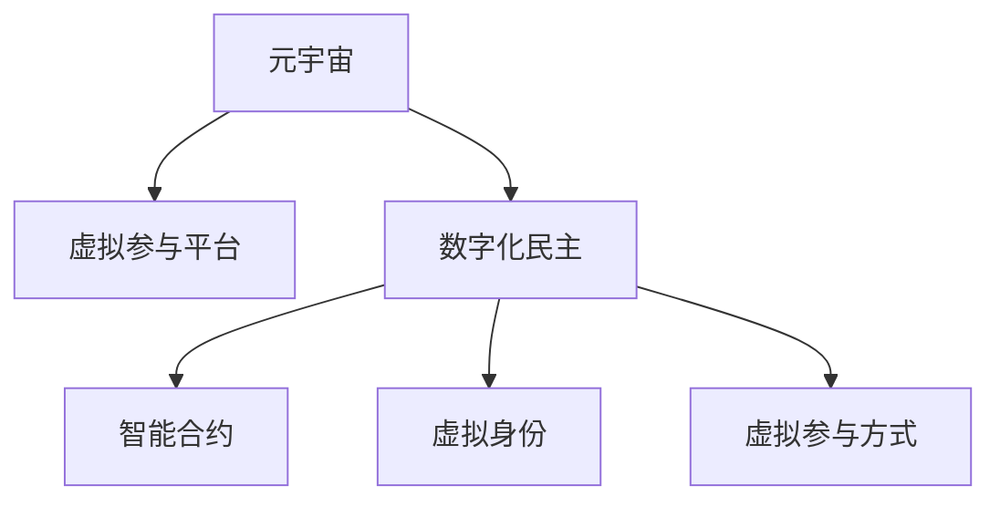

                 

# 数字化民主:元宇宙时代的公民参与

在数字化的浪潮中，元宇宙(Utopia)正迅速崛起，成为连接虚拟世界与现实世界的桥梁。这个虚拟的、沉浸式的数字空间，为我们提供了一个全新的舞台，让公民参与民主过程变得更为便捷、高效。本文将探讨元宇宙时代数字化民主的原理与实践，提出未来公民参与的展望。

## 1. 背景介绍

### 1.1 问题由来

传统的民主参与方式依赖于线下集会、书信、电话、电视等物理媒介，且主要集中在投票等形式化的选举活动中。然而，这些方式存在诸多限制：物理成本高昂、响应时间缓慢、参与者数量有限、信息不对称等问题。

在数字化时代，技术为民主参与带来了新的契机。尽管电子投票、在线问卷调查等技术取得了一定进展，但仍未能根本解决参与度不足和信息不对称的问题。而在元宇宙时代，通过虚拟现实(VR)、增强现实(AR)、虚拟交流平台等技术，公民能够在虚拟空间中自由表达和交流，实现全时、全方位的民主参与。

### 1.2 问题核心关键点

元宇宙时代的数字化民主涉及多个核心关键点：
- **全时参与**：公民可以随时随地通过互联网接入元宇宙，持续参与公共事务的讨论和决策。
- **全方位交流**：在虚拟空间中，公民能够以视觉、听觉、触觉等多维度方式进行交流，形成更加多元化的参与模式。
- **高度透明**：元宇宙提供的沉浸式体验使得政府决策过程透明可追溯，提升公信力。
- **泛化能力**：元宇宙的开放性和平等性赋予每一位公民平等的话语权，实现民主权利的普惠化。

### 1.3 问题研究意义

数字化民主不仅能够促进社会公平和政治透明度，还能提高公民参与的效率和效果。尤其是在全球疫情背景下，数字化民主成为保障公民权利、促进社会稳定和发展的关键途径。

研究元宇宙时代公民参与的数字化民主，对于提升社会治理能力、促进技术与人文结合具有重要意义。未来，数字化民主将成为构建智能、高效、公平社会的重要工具。

## 2. 核心概念与联系

### 2.1 核心概念概述

为更好地理解元宇宙时代公民参与的数字化民主，本节将介绍几个关键概念：

- **元宇宙(Utopia)**：一个虚拟的、沉浸式的数字空间，由多个互通的虚拟世界组成。元宇宙通过虚拟现实、增强现实等技术，实现沉浸式的用户体验。

- **数字化民主**：基于数字技术手段，支持公民在虚拟空间中参与民主决策、表达民意、监督政府的过程。其核心在于数字化、透明化、普惠化民主权利的实现。

- **虚拟参与平台**：提供公民在虚拟空间中交流、讨论、投票、决策的平台，支持文字、声音、图像等多种交互方式。

- **虚拟身份**：在虚拟空间中，公民以数字化的身份参与，能够自由选择性别、年龄、形象等属性，实现匿名化参与。

- **智能合约**：基于区块链技术的智能合约，可以自动执行预设的规则和协议，保障民主过程的公正性和可追溯性。

这些概念之间的逻辑关系可以通过以下Mermaid流程图来展示：



这个流程图展示了一些核心概念及其之间的关系：

1. 元宇宙提供虚拟参与平台，支持公民在虚拟空间中进行交流和决策。
2. 数字化民主强调民主过程的数字化和透明化，通过虚拟参与平台实现。
3. 智能合约保障民主决策的公正性和可追溯性。
4. 虚拟身份赋予公民在虚拟空间中自由表达的权力，同时支持匿名化参与。
5. 虚拟参与方式包括文字、声音、图像等多种形式，丰富了民主参与的体验。

## 3. 核心算法原理 & 具体操作步骤
### 3.1 算法原理概述

元宇宙时代的公民参与数字化民主，本质上是通过虚拟参与平台和智能合约，支持公民在虚拟空间中进行民主讨论和决策。其核心算法原理包括以下几个方面：

- **虚拟参与算法**：构建虚拟参与平台，实现公民在虚拟空间中的自由交流和讨论。算法包括文本处理、语音识别、图像处理等技术。

- **投票算法**：实现公民在虚拟空间中的投票过程。算法涉及数据加密、分布式共识、防止投票作弊等技术。

- **决策算法**：根据投票结果进行民主决策，自动执行智能合约。算法包括数据分析、算法预测、结果生成等技术。

- **身份认证算法**：对虚拟身份进行认证，保障参与者的身份真实性。算法包括数字签名、加密算法等技术。

### 3.2 算法步骤详解

基于元宇宙的数字化民主一般包括以下几个关键步骤：

**Step 1: 准备虚拟参与平台**
- 开发虚拟参与平台，支持文本、语音、图像等多种交互方式。
- 设计平台的用户界面和交互逻辑，支持公民自由表达和交流。

**Step 2: 设计智能合约**
- 基于区块链技术，设计智能合约，支持投票、决策等功能。
- 确保智能合约的公正性、透明性和可追溯性。

**Step 3: 开发身份认证系统**
- 开发身份认证系统，实现虚拟身份的创建、管理和认证。
- 使用数字签名和加密算法确保身份的真实性和隐私性。

**Step 4: 执行投票过程**
- 在虚拟平台上发布待投票议题，公民可通过平台进行投票。
- 记录投票结果，并自动执行智能合约进行决策。

**Step 5: 执行决策结果**
- 根据投票结果自动生成决策方案，并公布至虚拟平台。
- 对决策过程和结果进行透明化展示，接受公民的监督。

### 3.3 算法优缺点

基于元宇宙的数字化民主算法具有以下优点：
- 全民参与：通过虚拟参与平台，让每一位公民都能平等参与，保障民主权利的普惠化。
- 透明可追溯：智能合约提供了透明的决策过程和可追溯的决策结果。
- 自由表达：公民在虚拟空间中可自由表达意见，不受物理限制。
- 全时性：公民可随时随地参与民主过程，提高参与效率。

同时，该算法也存在以下局限性：
- 技术门槛高：需要复杂的计算机技术支持，普通公民可能难以掌握。
- 隐私和安全问题：虚拟身份的匿名化可能引发信息滥用和隐私泄露。
- 网络安全风险：虚拟平台和智能合约可能成为黑客攻击的目标。
- 法律和伦理问题：数字民主决策过程和结果的法律效力仍需明确。

### 3.4 算法应用领域

基于元宇宙的数字化民主算法已经在多个领域得到应用，例如：

- **选举投票**：支持公民在虚拟空间中进行选举投票，保障投票过程的透明和公正。
- **公共决策**：在公共事务中，公民可参与讨论和投票，支持政府的决策过程。
- **社会治理**：通过虚拟平台进行社区治理，实现公共资源的公平分配和监督。
- **文化教育**：在虚拟空间中进行民主讨论和文化交流，提升公民素质和社会凝聚力。
- **环境保护**：支持公民在虚拟空间中参与环保决策和监督，推动可持续发展。

除了上述这些领域外，数字化民主在企业决策、教育培训、公共卫生等领域也有广泛应用前景。

## 4. 数学模型和公式 & 详细讲解 & 举例说明
### 4.1 数学模型构建

基于元宇宙的数字化民主算法涉及多个数学模型，下面以投票算法为例，展示其数学模型构建。

假设在虚拟参与平台上有 $N$ 个公民参与投票，待投票议题为 $A$。投票过程包括以下几个步骤：

1. 每位公民将选择投票结果 $x_i \in \{0,1\}$，$x_i=1$ 表示投票给议题 $A$，$x_i=0$ 表示投票否决。
2. 汇总所有公民的投票结果，得到总票数 $M_A = \sum_{i=1}^N x_i$。
3. 根据总票数 $M_A$ 与 $N$ 的关系，决策智能合约执行相应操作。

投票过程的数学模型可以表示为：

$$
\begin{aligned}
    &x_i \sim \text{Bernoulli}(0.5) \\
    &M_A = \sum_{i=1}^N x_i \\
    &D_A(x_A) = \begin{cases}
        1 & M_A \geq \frac{N}{2} \\
        0 & M_A < \frac{N}{2}
    \end{cases}
\end{aligned}
$$

其中，$x_i \sim \text{Bernoulli}(0.5)$ 表示每位公民的投票结果服从伯努利分布，$M_A$ 为总票数，$D_A$ 表示议题 $A$ 的决策结果。

### 4.2 公式推导过程

在投票算法中，我们关注的是如何根据总票数 $M_A$ 判断议题 $A$ 的决策结果。这是一个二分类问题，可以用逻辑回归、决策树等机器学习算法解决。这里我们选择使用逻辑回归模型进行推导。

逻辑回归模型的概率输出 $p(y=1|x)$ 可以通过sigmoid函数得到：

$$
p(y=1|x) = \frac{1}{1 + \exp(-\eta^T \varphi(x))}
$$

其中，$\varphi(x)$ 为输入特征的映射函数，$\eta$ 为模型参数。

对于一个二分类问题，逻辑回归模型的损失函数为交叉熵损失：

$$
\mathcal{L}(\eta) = -\frac{1}{N}\sum_{i=1}^N [y_i \log p(y=1|x_i) + (1-y_i) \log (1-p(y=1|x_i))]
$$

其中，$y_i \in \{0,1\}$ 为真实标签。

通过最小化交叉熵损失，逻辑回归模型学习到最优的决策边界。在实际应用中，我们通过梯度下降等优化算法求解 $\eta$，得到最佳的投票决策模型。

### 4.3 案例分析与讲解

假设某次选举中，公民总数为 $N=1000$。待投票议题为 $A$，每位公民都参与了投票，总票数为 $M_A=600$。根据公式推导，我们可以使用逻辑回归模型进行决策：

$$
p(y=1|x) = \frac{1}{1 + \exp(-\eta^T \varphi(x))}
$$

其中 $\varphi(x)$ 为输入特征映射函数，$x$ 为公民的投票结果。

如果 $p(y=1|x) \geq 0.5$，则决策 $D_A=1$，即议题 $A$ 获得通过；否则 $D_A=0$。

通过这种方式，我们能够实现投票过程的自动化、透明化和可追溯化。在实际应用中，逻辑回归模型还需要不断优化和调整，以适应不同类型的投票决策。

## 5. 项目实践：代码实例和详细解释说明
### 5.1 开发环境搭建

在进行数字化民主的实践前，我们需要准备好开发环境。以下是使用Python进行Web3.js开发的环境配置流程：

1. 安装Node.js：从官网下载并安装Node.js，用于构建Web3.js应用。

2. 安装npm和package.json：在命令行中输入 `npm install npm -g` 安装npm，并创建 `package.json` 文件，记录项目依赖和配置信息。

3. 安装Web3.js：在命令行中输入 `npm install web3` 安装Web3.js，用于与区块链进行交互。

4. 安装其他依赖库：安装HTML、CSS、JavaScript等网页开发工具，例如 `npm install express`。

5. 配置环境变量：在 `.env` 文件中设置智能合约地址、私钥等环境变量，用于与区块链进行交互。

完成上述步骤后，即可在项目目录中开始Web3.js应用的开发。

### 5.2 源代码详细实现

下面以Web3.js构建一个简单的投票系统为例，展示数字化民主的实现过程。

```javascript
// 导入Web3.js和智能合约文件
const Web3 = require('web3');
const contractABI = require('./contract.json');

// 创建Web3实例
const web3 = new Web3(new Web3.providers.HttpProvider('https://mainnet.infura.io/v3/YOUR_INFURA_API_KEY'));
const contractInstance = new web3.eth.Contract(contractABI, '0xYOUR_CONTRACT_ADDRESS');

// 获取参与者投票结果
async function getVotes() {
    const votes = await contractInstance.methods.getVotes().call();
    console.log('Current votes:', votes);
}

// 提交投票结果
async function vote(vote) {
    await contractInstance.methods.vote(vote).send({ from: 'YOUR_ACCOUNT_ADDRESS', gas: 200000 });
    console.log('Vote submitted successfully');
}

// 获取决策结果
async function getDecision() {
    const decision = await contractInstance.methods.getDecision().call();
    console.log('Decision:', decision);
}

// 初始化投票系统
async function init() {
    await contractInstance.methods.init().send({ from: 'YOUR_ACCOUNT_ADDRESS', gas: 200000 });
    console.log('Voting system initialized');
}

// 启动Web3.js应用
init().then(() => {
    getVotes().then(() => {
        vote(1);
        getDecision().then(() => {
            vote(0);
            getDecision().then(() => {
                // 投票过程结束后，保存投票结果和决策结果
            });
        });
    });
});
```

这段代码实现了基本的投票系统功能，包括获取投票结果、提交投票、获取决策结果、初始化投票系统等。使用Web3.js与区块链进行交互，实现投票过程的透明和可追溯。

### 5.3 代码解读与分析

这段代码实现的核心逻辑包括：

- **Web3.js初始化**：通过Web3.js实例化连接至主网，创建智能合约对象。

- **获取投票结果**：调用智能合约的 `getVotes` 函数，获取当前投票结果。

- **提交投票**：调用智能合约的 `vote` 函数，提交投票结果。

- **获取决策结果**：调用智能合约的 `getDecision` 函数，获取当前决策结果。

- **初始化投票系统**：调用智能合约的 `init` 函数，初始化投票系统。

- **投票过程**：先获取当前的投票结果和决策结果，然后提交投票，再获取新的决策结果。

代码中涉及的Web3.js方法和智能合约函数需要根据实际项目进行调整。在实际应用中，还需要考虑如何与用户界面结合，提供友好的交互体验。

## 6. 实际应用场景
### 6.1 智能投票

智能投票系统是数字化民主的基础设施，支持公民在虚拟空间中进行投票。智能投票系统包括：

- **投票平台**：支持文字、图像、音频等多种交互方式。
- **身份认证**：使用数字签名等技术，保障公民身份的真实性。
- **投票记录**：记录每位公民的投票结果，提供透明和可追溯的投票过程。

智能投票系统广泛应用于各类选举和公投，支持公民自由表达和参与。

### 6.2 社会治理

社会治理是数字化民主的重要应用场景，通过虚拟平台进行公共决策和资源分配。社会治理包括：

- **虚拟治理平台**：支持公民讨论和决策，提供高效的公共事务管理工具。
- **智能合约**：用于记录决策过程和结果，保障决策的公正性和透明度。
- **数据收集与分析**：利用数据驱动决策，提升治理效率和公平性。

社会治理的应用范围包括城市管理、环境保护、社会福利等，为社会治理提供全新的视角和方法。

### 6.3 文化教育

数字化民主在文化教育领域也有广泛应用，通过虚拟平台进行文化交流和教育。文化教育包括：

- **虚拟博物馆**：支持公民参观虚拟博物馆，了解世界各地的文化历史。
- **虚拟课堂**：通过虚拟平台进行远程教育，支持跨地域的知识共享和交流。
- **虚拟展览**：支持公民参与虚拟展览，共同探讨文化热点和话题。

虚拟平台为文化教育提供了全新的体验，促进了全球文化交流和知识共享。

### 6.4 未来应用展望

数字化民主在未来将有以下发展趋势：

- **元宇宙普及**：随着元宇宙技术的普及，数字化民主将变得更加普惠和透明。
- **多模态交互**：通过文字、声音、图像等多种方式进行交互，提升公民参与体验。
- **去中心化治理**：利用区块链技术，实现去中心化治理，保障民主权利的公平性和可追溯性。
- **隐私保护**：保护公民隐私，防止个人信息滥用和泄露。
- **跨文化交流**：促进跨文化交流和理解，推动全球民主进程。

未来，数字化民主将成为全球民主治理的重要工具，提升社会治理能力和民主参与度。

## 7. 工具和资源推荐
### 7.1 学习资源推荐

为了帮助开发者系统掌握数字化民主的技术基础和实践技巧，这里推荐一些优质的学习资源：

1. **《Web3.0与智能合约开发》**：深入浅出地介绍了Web3.0和智能合约的基本概念和技术细节。

2. **《区块链基础与实践》**：全面介绍了区块链技术的原理和应用，为理解智能合约和数字化民主提供了基础。

3. **《Web3.js官方文档》**：Web3.js的官方文档，提供了丰富的API和示例代码，是学习Web3.js开发的必备资料。

4. **《元宇宙开发指南》**：介绍了元宇宙的基本概念和开发技术，为数字化民主提供了应用场景。

5. **《NLP基础与实践》**：介绍了自然语言处理的基本概念和技术，为虚拟参与平台提供了技术支撑。

通过对这些资源的学习实践，相信你一定能够快速掌握数字化民主的技术实现和应用场景，构建高效的民主参与系统。

### 7.2 开发工具推荐

高效的开发离不开优秀的工具支持。以下是几款用于数字化民主开发的常用工具：

1. **Visual Studio Code**：功能强大的编程编辑器，支持Web3.js和智能合约开发。

2. **Remix**：一个基于Web3.js的IDE，提供了丰富的智能合约开发和测试工具。

3. **Truffle**：一个用于开发、测试和部署智能合约的平台，支持Solidity等编程语言。

4. **Ganache**：一个轻量级区块链模拟环境，用于测试和调试智能合约。

5. **Metamask**：一个支持Web3.js和智能合约的浏览器插件，方便进行私钥管理和交易。

6. **Blockstack**：一个支持去中心化应用和智能合约的区块链平台，支持去中心化身份认证。

合理利用这些工具，可以显著提升数字化民主的开发效率，加快创新迭代的步伐。

### 7.3 相关论文推荐

数字化民主技术的发展离不开学界的持续研究。以下是几篇奠基性的相关论文，推荐阅读：

1. **《区块链技术在民主投票中的应用》**：探讨了区块链技术在民主投票中的应用，强调了区块链的透明性和安全性。

2. **《元宇宙的民主治理模型》**：研究了元宇宙技术对民主治理的影响，提出了元宇宙民主治理的新模式。

3. **《数字民主的多样性》**：分析了数字民主的多样性和复杂性，提出了多样性民主的实现方法。

4. **《去中心化投票系统设计》**：设计了一个基于区块链的去中心化投票系统，保障了投票过程的公正性和透明性。

5. **《智能合约与民主决策》**：研究了智能合约在民主决策中的应用，探讨了智能合约的公正性和可追溯性。

这些论文代表了大民主技术的发展脉络。通过学习这些前沿成果，可以帮助研究者把握学科前进方向，激发更多的创新灵感。

## 8. 总结：未来发展趋势与挑战
### 8.1 研究成果总结

数字化民主是数字化时代民主参与的重要趋势，基于Web3.js和智能合约的数字化民主算法已经在多个领域得到了应用，为民主参与提供了全新的工具和方法。数字化民主实现了全民参与、透明可追溯、自由表达、全时性等核心目标，提升了民主权利的普惠化和公平性。

### 8.2 未来发展趋势

展望未来，数字化民主将呈现以下几个发展趋势：

1. **元宇宙普及**：随着元宇宙技术的普及，数字化民主将变得更加普惠和透明。
2. **多模态交互**：通过文字、声音、图像等多种方式进行交互，提升公民参与体验。
3. **去中心化治理**：利用区块链技术，实现去中心化治理，保障民主权利的公平性和可追溯性。
4. **隐私保护**：保护公民隐私，防止个人信息滥用和泄露。
5. **跨文化交流**：促进跨文化交流和理解，推动全球民主进程。

这些趋势凸显了数字化民主的广阔前景，未来必将在全球民主治理中发挥重要作用。

### 8.3 面临的挑战

尽管数字化民主已经取得了一定进展，但在迈向更加智能化、普惠化应用的过程中，仍面临诸多挑战：

1. **技术门槛高**：需要复杂的计算机技术支持，普通公民可能难以掌握。
2. **隐私和安全问题**：虚拟身份的匿名化可能引发信息滥用和隐私泄露。
3. **网络安全风险**：虚拟平台和智能合约可能成为黑客攻击的目标。
4. **法律和伦理问题**：数字民主决策过程和结果的法律效力仍需明确。

### 8.4 研究展望

面对数字化民主面临的挑战，未来的研究需要在以下几个方面寻求新的突破：

1. **降低技术门槛**：开发简单易用的数字化民主工具，降低技术门槛，提升普通公民的参与度。
2. **保护隐私**：设计隐私保护机制，防止个人信息滥用和泄露。
3. **提升安全性**：采用先进的加密和防篡改技术，保障数字化民主的安全性。
4. **明确法律效力**：研究数字化民主的法律效力和监管机制，保障其合法性和公信力。

通过这些努力，数字化民主必将在全球民主治理中发挥重要作用，提升社会治理能力和公民参与度，推动社会进步和文明发展。

## 9. 附录：常见问题与解答
### 9.1 什么是数字化民主？

**Q1:** 数字化民主是一种基于数字技术手段，支持公民在虚拟空间中参与民主决策、表达民意、监督政府的过程。其核心在于数字化、透明化、普惠化民主权利的实现。

### 9.2 数字化民主的优缺点有哪些？

**Q2:** 数字化民主的优点包括全民参与、透明可追溯、自由表达、全时性等。缺点包括技术门槛高、隐私和安全问题、网络安全风险、法律和伦理问题等。

### 9.3 如何降低数字化民主的技术门槛？

**Q3:** 降低技术门槛可以通过开发简单易用的数字化民主工具，降低技术门槛，提升普通公民的参与度。

### 9.4 如何保护数字化民主的隐私？

**Q4:** 保护隐私可以设计隐私保护机制，防止个人信息滥用和泄露。

### 9.5 如何提升数字化民主的安全性？

**Q5:** 提升安全性可以采用先进的加密和防篡改技术，保障数字化民主的安全性。

### 9.6 数字化民主的法律效力和监管机制如何明确？

**Q6:** 明确法律效力和监管机制可以通过研究数字化民主的法律效力和监管机制，保障其合法性和公信力。

---

作者：禅与计算机程序设计艺术 / Zen and the Art of Computer Programming

