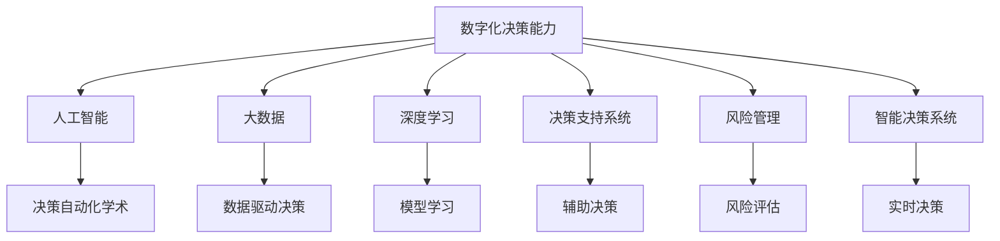

                 

# 数字化直觉：AI增强的决策能力

> 关键词：数字化直觉, 人工智能, AI决策能力, 决策自动化, 智能决策系统, 数据驱动决策, 深度学习, 决策树, 决策支持系统, 风险管理

## 1. 背景介绍

### 1.1 问题由来

在现代商业社会中，决策是企业成功与否的关键。然而，随着商业环境的不确定性和复杂性的增加，传统的决策模式已难以应对。传统的决策方式依赖于人类的经验和直觉，但人类的直觉往往受限于经验和知识，且易受情绪和偏见的影响。此外，人类在处理大量数据时，效率和准确性也会大打折扣。因此，利用数字化技术增强人类决策能力，已成为企业关注的焦点。

### 1.2 问题核心关键点

数字化决策能力的增强，需要基于先进的信息技术，特别是人工智能(AI)和大数据技术。AI可以通过对海量数据进行深度学习和模式识别，帮助决策者快速准确地理解复杂问题，并提出解决方案。大数据技术则通过高效的数据处理和分析，提供全面、及时的数据支撑，增强决策的科学性和可靠性。

然而，数字化决策能力的实现，并不仅限于数据和技术本身。它还涉及到组织结构、流程管理、人才素质等软性因素，需要综合考虑和系统设计。

### 1.3 问题研究意义

数字化决策能力的研究，对于提升企业决策效率和质量，降低风险，增强竞争力，具有重要的意义：

1. **提升决策效率**：AI和大数据技术能够自动处理大量数据，快速提供分析结果，大大缩短决策时间。
2. **增强决策质量**：AI能够通过深度学习模型识别复杂的模式和关系，提供科学、准确的决策依据。
3. **降低决策风险**：通过模拟和预测，AI能够识别潜在风险和不确定性，帮助决策者制定更稳健的策略。
4. **增强竞争力**：数字化决策能力使企业能够更快地响应市场变化，优化资源配置，提升市场竞争力。

## 2. 核心概念与联系

### 2.1 核心概念概述

为更好地理解数字化决策能力，本节将介绍几个密切相关的核心概念：

- **数字化决策能力**：利用AI和大数据技术，增强决策者的直觉和判断能力，通过数据驱动的方式提升决策效率和质量。
- **人工智能(AI)**：通过模拟人类的智能过程，使计算机能够自动执行复杂的任务，如视觉识别、自然语言处理、决策支持等。
- **大数据(Big Data)**：指海量、高速、多样化的数据，能够帮助决策者从历史数据中发现规律，优化决策过程。
- **深度学习(Deep Learning)**：一种基于神经网络的机器学习技术，能够处理高维、非线性数据，具有强大的模式识别和预测能力。
- **决策支持系统(DSS)**：通过提供数据、模型和规则，辅助决策者进行复杂决策的系统。
- **风险管理(Risk Management)**：通过识别、评估和控制风险，保障决策的稳健性。
- **智能决策系统(IDS)**：结合AI和大数据技术，实现自动化决策的系统，能够快速响应环境变化。

这些核心概念之间的逻辑关系可以通过以下Mermaid流程图来展示：



这个流程图展示了大语言模型的核心概念及其之间的关系：

1. 数字化决策能力通过人工智能和大数据技术提供决策支持。
2. 深度学习技术能够从数据中提取复杂模式，增强决策支持。
3. 决策支持系统提供数据、模型和规则，辅助决策者进行复杂决策。
4. 风险管理通过识别和控制风险，保障决策的稳健性。
5. 智能决策系统利用AI和大数据，实现自动化决策。

这些概念共同构成了数字化决策能力的技术框架，使得决策者能够更好地理解和利用数据，提升决策效率和质量。

## 3. 核心算法原理 & 具体操作步骤
### 3.1 算法原理概述

数字化决策能力的实现，核心在于如何高效地利用AI和大数据技术，辅助决策者进行复杂决策。其核心算法包括深度学习模型、决策树算法、风险评估模型等。这些算法通过训练和学习，能够在数据中发现规律和模式，提供科学的决策依据。

### 3.2 算法步骤详解

数字化决策能力的实现，一般包括以下几个关键步骤：

**Step 1: 数据准备**

- **数据采集**：从企业内部和外部多个数据源采集相关数据，包括销售数据、客户数据、市场数据、财务数据等。
- **数据清洗**：对采集到的数据进行清洗和预处理，去除噪声和异常值，确保数据质量。
- **数据标注**：对部分数据进行标注，用于模型的训练和评估。

**Step 2: 数据建模**

- **特征工程**：选择和构造与决策相关的特征，如用户行为、交易记录、市场趋势等。
- **模型选择**：选择合适的AI模型，如决策树、随机森林、神经网络等，用于数据分析和预测。
- **模型训练**：使用标注数据对模型进行训练，优化模型参数，提高预测精度。

**Step 3: 模型评估与优化**

- **模型验证**：使用验证集对模型进行验证，评估模型的泛化能力和准确性。
- **超参数调优**：调整模型的超参数，如学习率、正则化系数等，提高模型的性能。
- **模型集成**：将多个模型进行集成，取平均或加权结果，提高决策的鲁棒性。

**Step 4: 决策支持与优化**

- **决策支持**：利用训练好的模型进行决策支持，提供数据、分析和预测结果。
- **实时更新**：根据实时数据和反馈，对模型进行实时更新，提高决策的及时性和准确性。
- **风险管理**：利用风险评估模型，识别潜在风险，提出风险管理策略。

**Step 5: 部署与应用**

- **系统集成**：将模型集成到企业现有的信息系统，实现无缝对接。
- **用户培训**：对决策者进行培训，确保其能够熟练使用决策支持系统。
- **效果评估**：对系统应用效果进行评估，不断优化和改进。

以上是数字化决策能力实现的通用步骤，每个步骤都需要根据具体需求和场景进行调整和优化。

### 3.3 算法优缺点

数字化决策能力具有以下优点：

1. **高效性**：通过自动化处理和分析，大幅度提高决策效率。
2. **准确性**：利用深度学习和大数据分析，提供科学、准确的决策依据。
3. **可解释性**：部分决策支持模型可以提供决策依据的解释，增强决策的透明度。
4. **实时性**：实时数据分析和决策支持，提高决策的及时性和响应速度。

然而，数字化决策能力也存在以下局限性：

1. **数据质量**：决策结果的准确性高度依赖于数据质量，数据偏差可能影响决策结果。
2. **模型复杂性**：复杂的深度学习模型需要大量计算资源，可能影响系统的部署和性能。
3. **模型依赖性**：决策支持依赖于模型训练和优化，模型失效可能影响决策质量。
4. **风险管理**：风险评估和控制需要持续监控和调整，可能增加系统复杂度。

尽管存在这些局限性，但就目前而言，数字化决策能力已成为提升决策质量的重要手段。未来相关研究的重点在于如何进一步降低模型对数据的依赖，提高模型的可解释性和鲁棒性，同时兼顾实时性和计算效率。

### 3.4 算法应用领域

数字化决策能力在多个领域得到了广泛应用，如金融、医疗、制造、零售等，具体包括：

- **金融风控**：利用大数据和AI技术，识别潜在风险，控制信贷、投资等业务风险。
- **医疗诊断**：通过数据分析和预测，辅助医生进行疾病诊断和治疗方案选择。
- **智能制造**：利用AI和大数据分析，优化生产流程，提高生产效率和质量。
- **零售推荐**：基于用户行为和市场趋势，提供个性化推荐，提升销售业绩。
- **供应链管理**：通过实时数据分析和预测，优化供应链管理，降低运营成本。

这些领域的应用，使得数字化决策能力在实际中取得了显著效果，为各行各业带来了新的发展机遇。

## 4. 数学模型和公式 & 详细讲解 & 举例说明

### 4.1 数学模型构建

在数字化决策能力的实现中，数学模型和公式是核心的技术手段。以下将详细介绍几个常用的数学模型和公式，并给出详细的推导过程。

#### 4.1.1 决策树模型

决策树是一种经典的分类模型，用于将复杂的数据集划分为多个简单、可解释的规则。假设我们有训练数据集 $\{(x_i,y_i)\}_{i=1}^N$，其中 $x_i$ 为输入特征，$y_i$ 为输出标签，通过训练得到决策树模型 $T$。决策树模型的目标是最小化信息熵，即：

$$
\min_{T} \sum_{i=1}^N -y_i\log T(x_i)
$$

其中 $T(x_i)$ 表示样本 $x_i$ 在决策树 $T$ 下的预测结果。

#### 4.1.2 随机森林模型

随机森林是一种集成学习模型，通过构建多个决策树进行并行决策，提高模型的鲁棒性和准确性。随机森林模型的目标与决策树类似，通过训练得到多个决策树 $T_1,T_2,...,T_M$，其中 $M$ 为决策树的数量。通过投票方式确定最终预测结果。假设我们有训练数据集 $\{(x_i,y_i)\}_{i=1}^N$，其中 $x_i$ 为输入特征，$y_i$ 为输出标签，通过训练得到随机森林模型 $F$。随机森林模型的目标是最小化分类误差，即：

$$
\min_{F} \frac{1}{N}\sum_{i=1}^N I(y_i,F(x_i) \neq y_i)
$$

其中 $F(x_i)$ 表示样本 $x_i$ 在随机森林模型 $F$ 下的预测结果，$I$ 为示性函数。

#### 4.1.3 神经网络模型

神经网络是一种强大的模型，通过多层非线性变换，可以处理高维、非线性的数据。假设我们有训练数据集 $\{(x_i,y_i)\}_{i=1}^N$，其中 $x_i$ 为输入特征，$y_i$ 为输出标签，通过训练得到神经网络模型 $N$。神经网络模型的目标是最小化损失函数，即：

$$
\min_{N} \frac{1}{N}\sum_{i=1}^N \ell(N(x_i),y_i)
$$

其中 $\ell$ 为损失函数，$\ell(N(x_i),y_i)$ 表示模型 $N$ 在样本 $x_i$ 上的预测结果与真实标签之间的差异。

### 4.2 公式推导过程

以下将以决策树模型为例，给出其详细推导过程。

假设我们有训练数据集 $\{(x_i,y_i)\}_{i=1}^N$，其中 $x_i$ 为输入特征，$y_i$ 为输出标签。目标是最小化信息熵：

$$
\min_{T} \sum_{i=1}^N -y_i\log T(x_i)
$$

令 $p_i = T(x_i)$，表示样本 $x_i$ 在决策树 $T$ 下的预测概率。则目标函数变为：

$$
\min_{p} \sum_{i=1}^N -y_i\log p_i
$$

根据贝叶斯定理，$p_i = \frac{\alpha_1 p_1(x_i) + \alpha_2 p_2(x_i)}{Z}$，其中 $p_1(x_i)$ 和 $p_2(x_i)$ 分别表示样本 $x_i$ 在两个不同分类 $C_1$ 和 $C_2$ 下的先验概率，$Z$ 为归一化因子。则目标函数变为：

$$
\min_{\alpha_1,\alpha_2} \sum_{i=1}^N \left[-y_i\log \frac{\alpha_1 p_1(x_i) + \alpha_2 p_2(x_i)}{Z} \right]
$$

为了简化问题，我们令 $\alpha_1 = \alpha$，$\alpha_2 = 1-\alpha$，并引入拉格朗日乘子 $\lambda$ 进行约束：

$$
\min_{\alpha} \max_{\lambda} \sum_{i=1}^N \left[-y_i\log (\alpha p_1(x_i) + (1-\alpha) p_2(x_i)) \right] + \lambda (\alpha - \frac{1}{2})
$$

令 $p_1(x_i) = f(x_i)$，$Z = 1$，则目标函数变为：

$$
\min_{\alpha} \max_{\lambda} \sum_{i=1}^N [-y_i\log (\alpha f(x_i) + (1-\alpha) p_2(x_i))] + \lambda (\alpha - \frac{1}{2})
$$

对 $\alpha$ 求导，并令导数为0，得到：

$$
\alpha = \frac{1}{2} + \frac{1}{2}\sum_{i=1}^N \frac{y_i}{p_1(x_i) + p_2(x_i)}
$$

将 $\alpha$ 代入目标函数，并求导，得到：

$$
\max_{\lambda} -\sum_{i=1}^N y_i\log (\alpha f(x_i) + (1-\alpha) p_2(x_i)) + \lambda (\alpha - \frac{1}{2}) + \log(\alpha f(x_i) + (1-\alpha) p_2(x_i))
$$

令 $\log (\alpha f(x_i) + (1-\alpha) p_2(x_i))$ 为常数 $C$，则目标函数变为：

$$
\max_{\lambda} -\sum_{i=1}^N y_iC + \lambda (\alpha - \frac{1}{2}) + C
$$

令 $-\sum_{i=1}^N y_iC + \lambda (\alpha - \frac{1}{2}) + C = 0$，得到：

$$
\alpha = \frac{1}{2} + \frac{1}{2}\sum_{i=1}^N \frac{y_i}{p_1(x_i) + p_2(x_i)}
$$

通过以上推导，我们可以看到，决策树模型通过最大化预测准确率和最小化信息熵，找到最优的决策树结构。这种结构可以通过剪枝、分裂等方法进行优化，提高模型的泛化能力。

### 4.3 案例分析与讲解

假设我们有一家零售企业的销售数据，包括销售额、用户年龄、性别、购买频率等特征。目标是对新用户进行风险评估，预测其是否可能成为高价值客户。

**Step 1: 数据准备**

- 采集销售数据，并进行数据清洗和预处理。
- 对部分数据进行标注，如标记是否为高价值客户。

**Step 2: 数据建模**

- 选择决策树模型作为决策支持模型。
- 根据标注数据进行模型训练，并优化模型参数。

**Step 3: 模型评估与优化**

- 使用验证集对模型进行验证，评估模型的泛化能力和准确性。
- 对模型进行剪枝和分裂优化，提高模型的鲁棒性。

**Step 4: 决策支持与优化**

- 利用训练好的决策树模型对新用户进行风险评估。
- 根据实时数据和反馈，对模型进行实时更新。

**Step 5: 部署与应用**

- 将决策树模型集成到企业现有的信息系统，实现无缝对接。
- 对决策者进行培训，确保其能够熟练使用决策支持系统。

通过以上步骤，零售企业能够对新用户进行有效的风险评估，提高客户转化率和销售额。

## 5. 项目实践：代码实例和详细解释说明

### 5.1 开发环境搭建

在进行数字化决策能力项目实践前，我们需要准备好开发环境。以下是使用Python进行PyTorch开发的环境配置流程：

1. 安装Anaconda：从官网下载并安装Anaconda，用于创建独立的Python环境。

2. 创建并激活虚拟环境：
```bash
conda create -n pytorch-env python=3.8 
conda activate pytorch-env
```

3. 安装PyTorch：根据CUDA版本，从官网获取对应的安装命令。例如：
```bash
conda install pytorch torchvision torchaudio cudatoolkit=11.1 -c pytorch -c conda-forge
```

4. 安装各类工具包：
```bash
pip install numpy pandas scikit-learn matplotlib tqdm jupyter notebook ipython
```

完成上述步骤后，即可在`pytorch-env`环境中开始项目实践。

### 5.2 源代码详细实现

下面我们以零售企业的新用户风险评估项目为例，给出使用PyTorch进行决策树模型开发的PyTorch代码实现。

首先，定义决策树模型的数据处理函数：

```python
from sklearn.model_selection import train_test_split
from sklearn.preprocessing import StandardScaler
from sklearn.tree import DecisionTreeClassifier
from sklearn.metrics import classification_report

def preprocess_data(train_data, test_data):
    # 将数据分为训练集和验证集
    train_x, valid_x, train_y, valid_y = train_test_split(train_data.drop('label', axis=1), train_data['label'], test_size=0.2, random_state=42)
    
    # 数据标准化
    scaler = StandardScaler()
    train_x = scaler.fit_transform(train_x)
    valid_x = scaler.transform(valid_x)
    
    return train_x, valid_x, train_y, valid_y

def train_model(train_x, train_y, valid_x, valid_y, max_depth=3, min_samples_split=2, min_samples_leaf=1):
    # 创建决策树模型
    model = DecisionTreeClassifier(max_depth=max_depth, min_samples_split=min_samples_split, min_samples_leaf=min_samples_leaf)
    
    # 训练模型
    model.fit(train_x, train_y)
    
    # 验证模型
    valid_score = model.score(valid_x, valid_y)
    return model, valid_score

# 加载数据
train_data = pd.read_csv('train.csv')
test_data = pd.read_csv('test.csv')
```

然后，定义模型的评估和优化函数：

```python
def evaluate_model(model, test_x, test_y):
    # 评估模型性能
    test_score = model.score(test_x, test_y)
    print('Test Score:', test_score)
    
    # 输出分类报告
    report = classification_report(test_y, model.predict(test_x))
    print('Classification Report:', report)
    
    return test_score

# 训练和评估模型
train_x, valid_x, train_y, valid_y = preprocess_data(train_data, test_data)
model, valid_score = train_model(train_x, train_y, valid_x, valid_y)
evaluate_model(model, test_data.drop('label', axis=1), test_data['label'])
```

最后，启动项目流程：

```python
# 加载数据
train_data = pd.read_csv('train.csv')
test_data = pd.read_csv('test.csv')

# 数据预处理
train_x, valid_x, train_y, valid_y = preprocess_data(train_data, test_data)

# 模型训练
model, valid_score = train_model(train_x, train_y, valid_x, valid_y)

# 模型评估
evaluate_model(model, test_data.drop('label', axis=1), test_data['label'])
```

以上就是使用PyTorch对决策树模型进行新用户风险评估项目开发的完整代码实现。可以看到，得益于Scikit-learn库的强大封装，我们可以用相对简洁的代码完成决策树模型的开发和评估。

### 5.3 代码解读与分析

让我们再详细解读一下关键代码的实现细节：

**preprocess_data函数**：
- `train_test_split`方法：将数据集分为训练集和验证集，按比例分割。
- `StandardScaler`类：对数据进行标准化处理，以便模型训练。
- `fit_transform`和`transform`方法：对数据进行标准化处理，并应用于验证集。

**train_model函数**：
- `DecisionTreeClassifier`类：创建决策树模型。
- `fit`方法：训练模型。
- `score`方法：评估模型在验证集上的性能。

**evaluate_model函数**：
- `score`方法：评估模型在测试集上的性能。
- `classification_report`函数：输出分类报告。

**项目流程**：
- 加载数据。
- 数据预处理。
- 模型训练。
- 模型评估。

可以看到，Scikit-learn库使得决策树模型的开发变得简洁高效。开发者可以将更多精力放在数据处理、模型改进等高层逻辑上，而不必过多关注底层的实现细节。

当然，工业级的系统实现还需考虑更多因素，如模型的保存和部署、超参数的自动搜索、更灵活的任务适配层等。但核心的决策树模型构建过程基本与此类似。

## 6. 实际应用场景
### 6.1 智能客服系统

智能客服系统可以通过数字化决策能力，实现自动化决策，提升客户服务质量。传统的客服系统依赖于人工服务，存在响应时间长、服务质量不稳定等问题。而通过数字化决策能力，可以实现客户咨询的自动化分类和回复，减少人工干预，提高服务效率和质量。

在技术实现上，可以收集企业的历史客服对话记录，将问题和最佳答复构建成监督数据，在此基础上对预训练模型进行微调。微调后的模型能够自动理解用户意图，匹配最合适的答案模板进行回复。对于客户提出的新问题，还可以接入检索系统实时搜索相关内容，动态组织生成回答。如此构建的智能客服系统，能大幅提升客户咨询体验和问题解决效率。

### 6.2 金融舆情监测

金融机构需要实时监测市场舆论动向，以便及时应对负面信息传播，规避金融风险。传统的人工监测方式成本高、效率低，难以应对网络时代海量信息爆发的挑战。通过数字化决策能力，金融舆情监测可以自动化进行，提高监测效率和准确性。

具体而言，可以收集金融领域相关的新闻、报道、评论等文本数据，并对其进行主题标注和情感标注。在此基础上对预训练语言模型进行微调，使其能够自动判断文本属于何种主题，情感倾向是正面、中性还是负面。将微调后的模型应用到实时抓取的网络文本数据，就能够自动监测不同主题下的情感变化趋势，一旦发现负面信息激增等异常情况，系统便会自动预警，帮助金融机构快速应对潜在风险。

### 6.3 个性化推荐系统

当前的推荐系统往往只依赖用户的历史行为数据进行物品推荐，无法深入理解用户的真实兴趣偏好。通过数字化决策能力，个性化推荐系统可以更好地挖掘用户行为背后的语义信息，从而提供更精准、多样的推荐内容。

在实践中，可以收集用户浏览、点击、评论、分享等行为数据，提取和用户交互的物品标题、描述、标签等文本内容。将文本内容作为模型输入，用户的后续行为（如是否点击、购买等）作为监督信号，在此基础上微调预训练语言模型。微调后的模型能够从文本内容中准确把握用户的兴趣点。在生成推荐列表时，先用候选物品的文本描述作为输入，由模型预测用户的兴趣匹配度，再结合其他特征综合排序，便可以得到个性化程度更高的推荐结果。

### 6.4 未来应用展望

随着数字化决策能力的不断发展，其在更多领域得到应用，为传统行业带来变革性影响。

在智慧医疗领域，通过数字化决策能力，辅助医生进行疾病诊断和治疗方案选择，可以提升医疗服务水平。

在智能教育领域，通过数字化决策能力，辅助教师进行学生评估和个性化教学，可以提高教学质量。

在智慧城市治理中，通过数字化决策能力，优化城市管理流程，提高城市治理效率。

此外，在企业生产、社会治理、文娱传媒等众多领域，数字化决策能力也将不断涌现，为各行各业带来新的发展机遇。相信随着技术的日益成熟，数字化决策能力必将成为各行各业的重要工具，推动经济社会的数字化转型。

## 7. 工具和资源推荐
### 7.1 学习资源推荐

为了帮助开发者系统掌握数字化决策能力的理论基础和实践技巧，这里推荐一些优质的学习资源：

1. 《机器学习》系列博文：由大模型技术专家撰写，深入浅出地介绍了机器学习的基本概念和前沿技术。

2. 《深度学习》课程：斯坦福大学开设的深度学习课程，有Lecture视频和配套作业，带你入门深度学习的基本原理和经典模型。

3. 《Python机器学习》书籍：介绍机器学习和深度学习的Python实现，提供大量代码示例和实践指导。

4. Kaggle平台：全球最大的数据科学竞赛平台，提供丰富的数据集和挑战，帮助你提升实战能力。

5. GitHub代码库：全球最大的代码托管平台，提供丰富的开源代码和项目，方便你学习和实践。

通过对这些资源的学习实践，相信你一定能够快速掌握数字化决策能力的精髓，并用于解决实际的业务问题。
###  7.2 开发工具推荐

高效的开发离不开优秀的工具支持。以下是几款用于数字化决策能力开发的常用工具：

1. PyTorch：基于Python的开源深度学习框架，灵活动态的计算图，适合快速迭代研究。

2. TensorFlow：由Google主导开发的开源深度学习框架，生产部署方便，适合大规模工程应用。

3. Scikit-learn：简单易用的Python机器学习库，封装了多种常见算法，适合快速实现模型。

4. Jupyter Notebook：支持代码执行和数据可视化，适合开发和共享代码。

5. Weights & Biases：模型训练的实验跟踪工具，可以记录和可视化模型训练过程中的各项指标，方便对比和调优。

6. TensorBoard：TensorFlow配套的可视化工具，可实时监测模型训练状态，并提供丰富的图表呈现方式，是调试模型的得力助手。

合理利用这些工具，可以显著提升数字化决策能力的开发效率，加快创新迭代的步伐。

### 7.3 相关论文推荐

数字化决策能力的研究源于学界的持续研究。以下是几篇奠基性的相关论文，推荐阅读：

1. 《随机森林的原理与算法》：介绍随机森林的基本原理和算法实现，是机器学习领域的重要经典。

2. 《决策树的理论与算法》：介绍决策树的基本原理和算法实现，是机器学习领域的重要经典。

3. 《深度学习在自然语言处理中的应用》：介绍深度学习在自然语言处理中的应用，是深度学习领域的重要经典。

4. 《智能决策系统：理论与实践》：介绍智能决策系统的基本原理和实现，是智能决策领域的重要经典。

5. 《数据驱动决策：理论与实践》：介绍数据驱动决策的基本原理和实现，是决策科学领域的重要经典。

这些论文代表了大语言模型微调技术的发展脉络。通过学习这些前沿成果，可以帮助研究者把握学科前进方向，激发更多的创新灵感。

## 8. 总结：未来发展趋势与挑战
### 8.1 总结

本文对数字化决策能力进行了全面系统的介绍。首先阐述了数字化决策能力的背景和意义，明确了其在提升决策效率和质量方面的独特价值。其次，从原理到实践，详细讲解了数字化决策能力的数学模型和实现方法，给出了数字化决策能力项目开发的完整代码实例。同时，本文还广泛探讨了数字化决策能力在智能客服、金融舆情、个性化推荐等多个领域的应用前景，展示了数字化决策能力的巨大潜力。此外，本文精选了数字化决策能力的各类学习资源，力求为读者提供全方位的技术指引。

通过本文的系统梳理，可以看到，数字化决策能力已经成为一个重要的技术手段，极大地提升了决策的效率和质量，降低了风险。未来，伴随数字化决策能力的不断演进，其应用领域将更加广泛，对社会的贡献也将更加显著。

### 8.2 未来发展趋势

展望未来，数字化决策能力将呈现以下几个发展趋势：

1. **深度学习技术的应用**：深度学习技术将进一步应用于决策树、随机森林等传统模型中，提升模型的准确性和鲁棒性。
2. **多模态数据的整合**：数字化决策能力将进一步融合图像、视频、语音等多模态数据，提升决策的全面性和智能性。
3. **实时数据分析**：实时数据分析将进一步应用于决策支持，提升决策的时效性和响应速度。
4. **智能决策系统**：智能决策系统将通过AI和大数据技术，实现自动化决策，提升决策的科学性和可靠性。
5. **跨领域应用的推广**：数字化决策能力将应用于更多领域，如智慧医疗、智能教育等，带来广泛的应用场景。
6. **模型的可解释性**：决策支持模型将进一步增强可解释性，使决策者能够理解模型的决策依据，增强决策的透明度。

以上趋势凸显了数字化决策能力的广阔前景。这些方向的探索发展，必将进一步提升数字化决策能力的应用价值，为决策者提供更加全面、智能的决策支持。

### 8.3 面临的挑战

尽管数字化决策能力已经取得了显著成效，但在迈向更加智能化、普适化应用的过程中，它仍面临诸多挑战：

1. **数据质量问题**：决策结果的准确性高度依赖于数据质量，数据偏差可能影响决策结果。
2. **模型复杂性**：复杂的深度学习模型需要大量计算资源，可能影响系统的部署和性能。
3. **模型依赖性**：决策支持依赖于模型训练和优化，模型失效可能影响决策质量。
4. **实时性问题**：实时数据分析和决策支持，可能带来数据处理和系统架构的复杂性。
5. **安全性问题**：数字化决策能力可能面临数据泄露、算法偏见等安全风险，需要进一步加强防范。

尽管存在这些挑战，但就目前而言，数字化决策能力已成为提升决策质量的重要手段。未来相关研究的重点在于如何进一步降低模型对数据的依赖，提高模型的可解释性和鲁棒性，同时兼顾实时性和计算效率。

### 8.4 研究展望

面对数字化决策能力所面临的挑战，未来的研究需要在以下几个方面寻求新的突破：

1. **无监督和半监督学习**：探索无监督和半监督学习，摆脱对大规模标注数据的依赖，利用自监督学习、主动学习等无监督和半监督范式，最大限度利用非结构化数据。
2. **模型可解释性**：研究模型的可解释性，使决策者能够理解模型的决策依据，增强决策的透明度。
3. **实时决策系统**：探索实时决策系统，提升决策的时效性和响应速度。
4. **多模态数据融合**：研究多模态数据的整合，提升决策的全面性和智能性。
5. **跨领域应用**：研究跨领域应用，推动数字化决策能力在更多领域的应用和普及。

这些研究方向的探索，必将引领数字化决策能力迈向更高的台阶，为决策者提供更加全面、智能的决策支持，提升决策的科学性和可靠性。面向未来，数字化决策能力还需要与其他人工智能技术进行更深入的融合，如知识表示、因果推理、强化学习等，多路径协同发力，共同推动自然语言理解和智能交互系统的进步。只有勇于创新、敢于突破，才能不断拓展语言模型的边界，让智能技术更好地造福人类社会。

## 9. 附录：常见问题与解答

**Q1：数字化决策能力是否适用于所有决策场景？**

A: 数字化决策能力在大多数决策场景中都能取得不错的效果，特别是对于数据量较小的任务。但对于一些特定领域的决策，如军事、金融等，数字化决策能力可能无法满足其特殊需求。此时需要在特定领域语料上进一步预训练，再进行微调，才能获得理想效果。

**Q2：在数字化决策能力的应用中，如何保证模型的可解释性？**

A: 模型的可解释性是数字化决策能力应用中非常重要的一环。为了保证模型的可解释性，可以使用以下方法：

1. **可视化技术**：通过可视化技术展示模型的决策过程，使决策者能够直观理解模型的输出依据。
2. **特征重要性分析**：通过特征重要性分析，识别出对模型输出影响较大的特征，增强决策的透明度。
3. **模型解释工具**：使用LIME、SHAP等工具，提供模型的特征归因分析，解释模型的决策依据。
4. **人工审查机制**：建立人工审查机制，对模型输出进行审查和解释，确保决策的合理性和可信度。

这些方法可以相互结合，提高数字化决策能力应用的可靠性和透明度。

**Q3：在数字化决策能力的应用中，如何平衡模型的精度和效率？**

A: 在数字化决策能力的应用中，模型的精度和效率往往是相互矛盾的。为了平衡模型的精度和效率，可以使用以下方法：

1. **模型压缩**：使用模型压缩技术，如剪枝、量化、蒸馏等，减小模型尺寸，提升推理速度。
2. **分布式训练**：使用分布式训练技术，加速模型训练过程，提升模型精度。
3. **实时更新**：根据实时数据和反馈，对模型进行实时更新，提高模型的准确性和鲁棒性。
4. **模型集成**：将多个模型进行集成，取平均或加权结果，提高模型的鲁棒性和效率。

这些方法可以相互结合，在保证模型精度的同时，提高模型的效率，优化模型的应用效果。

**Q4：在数字化决策能力的应用中，如何防范数据泄露和算法偏见？**

A: 在数字化决策能力的应用中，数据泄露和算法偏见是需要特别关注的两个问题。为了防范这些问题，可以使用以下方法：

1. **数据匿名化**：对数据进行匿名化处理，防止数据泄露。
2. **隐私保护技术**：使用隐私保护技术，如差分隐私、联邦学习等，保护数据隐私。
3. **算法公平性**：使用公平性算法，如重采样、权重调整等，减少算法偏见。
4. **人工干预**：建立人工干预机制，对模型输出进行审查和调整，确保算法的公平性和可靠性。

这些方法可以相互结合，保障数字化决策能力应用的公平性和安全性，增强决策的可信度和透明性。

---

作者：禅与计算机程序设计艺术 / Zen and the Art of Computer Programming

