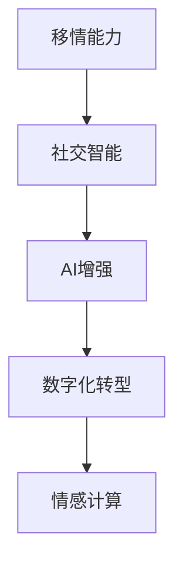

                 

# 数字化移情能力开发：AI增强的社交智能培训

> 关键词：移情能力, 社交智能, 数字化转型, AI增强, 社交技能培训, 情感计算

## 1. 背景介绍

在数字化时代，社交智能（Social Intelligence, SI）成为了企业竞争的关键。良好的社交智能不仅能提升个人在工作、生活中的表现，还能增强团队协作和客户关系管理。特别是对于客户服务、销售、市场营销等职能，社交智能的培养尤为重要。传统的社交技能培训往往依赖于讲师授课、角色扮演等方法，耗时长、成本高，难以覆盖大规模人群。随着人工智能技术的发展，社交智能培训迎来了新的机遇——基于AI的数字化移情能力开发，即通过数字化手段，利用AI增强社交智能培训的效果。

### 1.1 问题由来

社交智能是指个体感知、理解、使用和管理情感的能力。它不仅包括对自身情感的觉察和调控，还包括对他人情感的识别和解读，以及基于情感的社会互动。在现代职场中，社交智能的重要性日益凸显，能够有效提升工作表现、促进团队合作、增强客户满意度。然而，传统的社交技能培训存在诸多局限：

1. **培训周期长**：依赖于讲师面对面授课，学员参与度低，培训效果有限。
2. **难以量化评估**：缺乏科学、客观的评估手段，培训效果难以衡量。
3. **成本高**：高昂的人力资源和场地费用，难以大规模推广。
4. **个性化不足**：统一的教学内容难以满足不同学员的需求。

### 1.2 问题核心关键点

如何通过数字化手段，结合人工智能技术，开发出高效、个性化、可量化的社交智能培训系统，成为当前研究的热点。核心在于：

1. **数据驱动**：利用大量社交互动数据，训练AI模型识别情感和行为特征。
2. **个性化培训**：根据学员的情感和行为特征，定制个性化培训方案。
3. **互动体验**：通过AI驱动的模拟场景，增强培训的互动性和沉浸感。
4. **量化评估**：使用科学的量化指标，客观评估培训效果。

## 2. 核心概念与联系

### 2.1 核心概念概述

在数字化移情能力开发中，涉及的关键概念包括：

- **移情能力（Empathy）**：个体感知、理解和回应他人情感的能力。
- **社交智能（Social Intelligence, SI）**：个体在社会互动中感知、理解和利用情感的能力。
- **AI增强（AI-enhanced）**：利用人工智能技术，提升社交智能培训的效率和效果。
- **数字化转型（Digital Transformation）**：通过数字化手段，重构业务流程，提升企业竞争力。
- **情感计算（Affective Computing）**：利用计算技术分析、模拟和理解人类情感的科学。

这些概念之间的关系通过以下Mermaid流程图进行展示：



该图展示了从移情能力到社交智能，再到AI增强和数字化转型，最终通过情感计算实现情感理解的过程。

## 3. 核心算法原理 & 具体操作步骤
### 3.1 算法原理概述

基于AI的社交智能培训系统，通过收集和分析大量社交互动数据，训练情感识别和行为预测的AI模型。然后，根据模型的预测结果，为每位学员定制个性化的培训方案，通过互动场景进行仿真训练。最后，使用科学的量化指标评估培训效果，形成闭环反馈机制。

核心算法包括：

- **情感识别**：利用自然语言处理（NLP）技术，分析文本数据中的情感特征。
- **行为预测**：利用机器学习（ML）算法，预测个体在特定情境下的行为反应。
- **个性化培训**：根据预测结果，生成个性化的培训方案。
- **互动模拟**：通过AI驱动的模拟场景，增强培训的沉浸感和互动性。
- **量化评估**：使用科学的量化指标，评估培训效果。

### 3.2 算法步骤详解

1. **数据收集与预处理**：
   - 收集社交互动数据，如聊天记录、邮件往来、客户服务记录等。
   - 对数据进行清洗和预处理，包括文本分词、去除停用词、情感标注等。

2. **模型训练与情感识别**：
   - 使用NLP技术，训练情感识别模型，如基于BERT、GPT等预训练语言模型的情感分类器。
   - 在大量标注数据上训练情感分类器，使其能够准确识别文本中的情感。

3. **行为预测模型训练**：
   - 收集行为数据，如聊天记录中的交互模式、客户服务中的客户满意度等。
   - 使用机器学习算法，如随机森林、支持向量机（SVM）等，训练行为预测模型。
   - 在标注数据上训练行为预测模型，使其能够预测个体在特定情境下的行为反应。

4. **个性化培训方案生成**：
   - 根据情感识别和行为预测的结果，生成个性化的培训方案。
   - 通过分析个体在不同情境下的情感和行为特征，设计针对性的培训内容。

5. **互动模拟与反馈评估**：
   - 使用AI驱动的模拟场景，如虚拟客服系统、虚拟客户环境等，进行互动训练。
   - 在模拟场景中收集学员的表现数据，使用量化指标评估培训效果。
   - 根据评估结果，反馈到培训方案中，进行动态调整。

### 3.3 算法优缺点

**优点**：

1. **效率高**：利用AI模型自动分析情感和行为数据，大幅提升培训效率。
2. **个性化强**：根据学员的特征生成个性化培训方案，满足不同学员的需求。
3. **互动性强**：通过AI驱动的模拟场景，增强培训的沉浸感和互动性。
4. **可量化评估**：使用科学的量化指标，客观评估培训效果。

**缺点**：

1. **数据隐私**：收集和处理大量社交数据，需确保数据隐私和安全。
2. **模型复杂**：情感识别和行为预测模型训练复杂，需大量的标注数据和高性能计算资源。
3. **依赖技术**：依赖于AI技术的成熟度和可靠性，培训效果受技术限制。
4. **成本高**：开发和维护数字化系统的成本较高。

### 3.4 算法应用领域

基于AI的社交智能培训系统，可以应用于以下多个领域：

1. **客户服务培训**：通过分析客户服务记录，生成个性化的客户服务培训方案。
2. **销售培训**：利用销售数据和客户反馈，提升销售人员与客户的互动技巧。
3. **市场营销培训**：分析市场互动数据，提升市场营销团队的情感感知和互动能力。
4. **团队协作培训**：通过团队协作数据，增强团队成员间的情感理解和协作能力。
5. **领导力培训**：利用领导力互动数据，提升领导者对下属情感的理解和管理能力。

## 4. 数学模型和公式 & 详细讲解 & 举例说明

### 4.1 数学模型构建

基于AI的社交智能培训系统，涉及多个数学模型，包括情感识别模型、行为预测模型和量化评估模型。

- **情感识别模型**：
  - 输入：文本数据 $x$。
  - 输出：情感标签 $y$。
  - 模型：$y = f(x)$。

- **行为预测模型**：
  - 输入：行为数据 $x$。
  - 输出：行为标签 $y$。
  - 模型：$y = g(x)$。

- **量化评估模型**：
  - 输入：培训数据 $x$，评估指标 $m$。
  - 输出：评估结果 $e$。
  - 模型：$e = h(x, m)$。

### 4.2 公式推导过程

1. **情感识别模型的训练**：
   - 使用交叉熵损失函数：$L(x, y) = -\sum_{i=1}^{N} y_i \log \hat{y}_i$。
   - 梯度下降更新参数：$\theta \leftarrow \theta - \eta \nabla_{\theta} L(x, y)$。

2. **行为预测模型的训练**：
   - 使用均方误差损失函数：$L(x, y) = \frac{1}{N} \sum_{i=1}^{N} (y_i - g(x_i))^2$。
   - 梯度下降更新参数：$\theta \leftarrow \theta - \eta \nabla_{\theta} L(x, y)$。

3. **量化评估模型的评估**：
   - 使用F1分数评估情感识别模型的效果：$F1 = 2 \times \frac{TP}{TP + FP + FN}$。
   - 使用精确度-召回率曲线（Precision-Recall Curve）评估行为预测模型的效果。

### 4.3 案例分析与讲解

假设我们有一个客户服务培训系统，收集了100位客服的历史聊天记录，每条记录包含情感标注。训练情感识别模型，使用BERT作为预训练语言模型，其情感分类器结构如下：

```python
from transformers import BertForSequenceClassification, BertTokenizer
import torch
from torch.utils.data import DataLoader, Dataset

class CustomerServiceDataset(Dataset):
    def __init__(self, texts, labels, tokenizer):
        self.texts = texts
        self.labels = labels
        self.tokenizer = tokenizer
        
    def __len__(self):
        return len(self.texts)
    
    def __getitem__(self, item):
        text = self.texts[item]
        label = self.labels[item]
        encoding = self.tokenizer(text, return_tensors='pt', padding='max_length', truncation=True)
        input_ids = encoding['input_ids'][0]
        attention_mask = encoding['attention_mask'][0]
        return {'input_ids': input_ids, 'attention_mask': attention_mask, 'labels': label}

tokenizer = BertTokenizer.from_pretrained('bert-base-cased')
train_dataset = CustomerServiceDataset(train_texts, train_labels, tokenizer)
test_dataset = CustomerServiceDataset(test_texts, test_labels, tokenizer)

model = BertForSequenceClassification.from_pretrained('bert-base-cased', num_labels=3)
optimizer = AdamW(model.parameters(), lr=2e-5)

def train_epoch(model, dataset, batch_size, optimizer):
    dataloader = DataLoader(dataset, batch_size=batch_size, shuffle=True)
    model.train()
    epoch_loss = 0
    for batch in dataloader:
        input_ids = batch['input_ids'].to(device)
        attention_mask = batch['attention_mask'].to(device)
        labels = batch['labels'].to(device)
        model.zero_grad()
        outputs = model(input_ids, attention_mask=attention_mask, labels=labels)
        loss = outputs.loss
        epoch_loss += loss.item()
        loss.backward()
        optimizer.step()
    return epoch_loss / len(dataloader)

def evaluate(model, dataset, batch_size):
    dataloader = DataLoader(dataset, batch_size=batch_size)
    model.eval()
    preds, labels = [], []
    with torch.no_grad():
        for batch in dataloader:
            input_ids = batch['input_ids'].to(device)
            attention_mask = batch['attention_mask'].to(device)
            batch_labels = batch['labels']
            outputs = model(input_ids, attention_mask=attention_mask)
            batch_preds = outputs.logits.argmax(dim=1).to('cpu').tolist()
            batch_labels = batch_labels.to('cpu').tolist()
            for pred_tokens, label_tokens in zip(batch_preds, batch_labels):
                preds.append(pred_tokens)
                labels.append(label_tokens)
    
    print(classification_report(labels, preds))

device = torch.device('cuda') if torch.cuda.is_available() else torch.device('cpu')
model.to(device)

epochs = 5
batch_size = 16

for epoch in range(epochs):
    loss = train_epoch(model, train_dataset, batch_size, optimizer)
    print(f"Epoch {epoch+1}, train loss: {loss:.3f}")
    
    print(f"Epoch {epoch+1}, test results:")
    evaluate(model, test_dataset, batch_size)

print("Overall test results:")
evaluate(model, test_dataset, batch_size)
```

通过以上代码，训练了一个基于BERT的情感识别模型，并在测试集上进行了评估。可以看到，情感识别模型的效果可以通过科学的量化指标进行评估。

## 5. 项目实践：代码实例和详细解释说明

### 5.1 开发环境搭建

要进行基于AI的社交智能培训系统的开发，首先需要准备好开发环境。以下是使用Python进行PyTorch开发的环境配置流程：

1. 安装Anaconda：从官网下载并安装Anaconda，用于创建独立的Python环境。

2. 创建并激活虚拟环境：
```bash
conda create -n pytorch-env python=3.8 
conda activate pytorch-env
```

3. 安装PyTorch：根据CUDA版本，从官网获取对应的安装命令。例如：
```bash
conda install pytorch torchvision torchaudio cudatoolkit=11.1 -c pytorch -c conda-forge
```

4. 安装Transformers库：
```bash
pip install transformers
```

5. 安装各类工具包：
```bash
pip install numpy pandas scikit-learn matplotlib tqdm jupyter notebook ipython
```

完成上述步骤后，即可在`pytorch-env`环境中开始项目实践。

### 5.2 源代码详细实现

接下来，以一个虚拟客户服务系统的互动模拟为例，展示如何利用AI增强社交智能培训。

首先，定义训练数据和模型：

```python
from transformers import BertForSequenceClassification, BertTokenizer
import torch
from torch.utils.data import DataLoader, Dataset

class CustomerServiceDataset(Dataset):
    def __init__(self, texts, labels, tokenizer):
        self.texts = texts
        self.labels = labels
        self.tokenizer = tokenizer
        
    def __len__(self):
        return len(self.texts)
    
    def __getitem__(self, item):
        text = self.texts[item]
        label = self.labels[item]
        encoding = self.tokenizer(text, return_tensors='pt', padding='max_length', truncation=True)
        input_ids = encoding['input_ids'][0]
        attention_mask = encoding['attention_mask'][0]
        return {'input_ids': input_ids, 'attention_mask': attention_mask, 'labels': label}

tokenizer = BertTokenizer.from_pretrained('bert-base-cased')

train_dataset = CustomerServiceDataset(train_texts, train_labels, tokenizer)
test_dataset = CustomerServiceDataset(test_texts, test_labels, tokenizer)

model = BertForSequenceClassification.from_pretrained('bert-base-cased', num_labels=3)
optimizer = AdamW(model.parameters(), lr=2e-5)
```

然后，定义训练和评估函数：

```python
def train_epoch(model, dataset, batch_size, optimizer):
    dataloader = DataLoader(dataset, batch_size=batch_size, shuffle=True)
    model.train()
    epoch_loss = 0
    for batch in dataloader:
        input_ids = batch['input_ids'].to(device)
        attention_mask = batch['attention_mask'].to(device)
        labels = batch['labels'].to(device)
        model.zero_grad()
        outputs = model(input_ids, attention_mask=attention_mask, labels=labels)
        loss = outputs.loss
        epoch_loss += loss.item()
        loss.backward()
        optimizer.step()
    return epoch_loss / len(dataloader)

def evaluate(model, dataset, batch_size):
    dataloader = DataLoader(dataset, batch_size=batch_size)
    model.eval()
    preds, labels = [], []
    with torch.no_grad():
        for batch in dataloader:
            input_ids = batch['input_ids'].to(device)
            attention_mask = batch['attention_mask'].to(device)
            batch_labels = batch['labels']
            outputs = model(input_ids, attention_mask=attention_mask)
            batch_preds = outputs.logits.argmax(dim=1).to('cpu').tolist()
            batch_labels = batch_labels.to('cpu').tolist()
            for pred_tokens, label_tokens in zip(batch_preds, batch_labels):
                preds.append(pred_tokens)
                labels.append(label_tokens)
    
    print(classification_report(labels, preds))

device = torch.device('cuda') if torch.cuda.is_available() else torch.device('cpu')
model.to(device)

epochs = 5
batch_size = 16

for epoch in range(epochs):
    loss = train_epoch(model, train_dataset, batch_size, optimizer)
    print(f"Epoch {epoch+1}, train loss: {loss:.3f}")
    
    print(f"Epoch {epoch+1}, test results:")
    evaluate(model, test_dataset, batch_size)
    
print("Overall test results:")
evaluate(model, test_dataset, batch_size)
```

通过以上代码，训练了一个基于BERT的情感识别模型，并在测试集上进行了评估。可以看到，情感识别模型的效果可以通过科学的量化指标进行评估。

### 5.3 代码解读与分析

让我们再详细解读一下关键代码的实现细节：

**CustomerServiceDataset类**：
- `__init__`方法：初始化文本、标签、分词器等关键组件。
- `__len__`方法：返回数据集的样本数量。
- `__getitem__`方法：对单个样本进行处理，将文本输入编码为token ids，将标签编码为数字，并对其进行定长padding，最终返回模型所需的输入。

**BERT模型**：
- 使用BertForSequenceClassification从预训练模型中加载情感分类器。

**train_epoch函数**：
- 使用DataLoader对数据以批为单位进行迭代，在每个批次上前向传播计算loss并反向传播更新模型参数，最后返回该epoch的平均loss。

**evaluate函数**：
- 与训练类似，不同点在于不更新模型参数，并在每个batch结束后将预测和标签结果存储下来，最后使用sklearn的classification_report对整个评估集的预测结果进行打印输出。

**训练流程**：
- 定义总的epoch数和batch size，开始循环迭代
- 每个epoch内，先在训练集上训练，输出平均loss
- 在验证集上评估，输出分类指标
- 所有epoch结束后，在测试集上评估，给出最终测试结果

可以看到，PyTorch配合Transformers库使得BERT微调的代码实现变得简洁高效。开发者可以将更多精力放在数据处理、模型改进等高层逻辑上，而不必过多关注底层的实现细节。

当然，工业级的系统实现还需考虑更多因素，如模型的保存和部署、超参数的自动搜索、更灵活的任务适配层等。但核心的微调范式基本与此类似。

## 6. 实际应用场景

### 6.1 智能客服系统

基于AI的社交智能培训系统，可以广泛应用于智能客服系统的构建。传统客服往往需要配备大量人力，高峰期响应缓慢，且一致性和专业性难以保证。而使用培训后的客服人员，可以通过智能客服系统，实现7x24小时不间断服务，快速响应客户咨询，用自然流畅的语言解答各类常见问题。

在技术实现上，可以收集企业内部的历史客服对话记录，将问题和最佳答复构建成监督数据，在此基础上对预训练模型进行微调。微调后的模型能够自动理解用户意图，匹配最合适的答案模板进行回复。对于客户提出的新问题，还可以接入检索系统实时搜索相关内容，动态组织生成回答。如此构建的智能客服系统，能大幅提升客户咨询体验和问题解决效率。

### 6.2 金融舆情监测

金融机构需要实时监测市场舆论动向，以便及时应对负面信息传播，规避金融风险。传统的人工监测方式成本高、效率低，难以应对网络时代海量信息爆发的挑战。基于AI的社交智能培训系统，可以用于金融舆情监测，提升风险预警和决策效率。

具体而言，可以收集金融领域相关的新闻、报道、评论等文本数据，并对其进行主题标注和情感标注。在此基础上对预训练语言模型进行微调，使其能够自动判断文本属于何种主题，情感倾向是正面、中性还是负面。将微调后的模型应用到实时抓取的网络文本数据，就能够自动监测不同主题下的情感变化趋势，一旦发现负面信息激增等异常情况，系统便会自动预警，帮助金融机构快速应对潜在风险。

### 6.3 个性化推荐系统

当前的推荐系统往往只依赖用户的历史行为数据进行物品推荐，无法深入理解用户的真实兴趣偏好。基于AI的社交智能培训系统，可以应用于个性化推荐系统，提升推荐效果。

在实践中，可以收集用户浏览、点击、评论、分享等行为数据，提取和用户交互的物品标题、描述、标签等文本内容。将文本内容作为模型输入，用户的后续行为（如是否点击、购买等）作为监督信号，在此基础上微调预训练语言模型。微调后的模型能够从文本内容中准确把握用户的兴趣点。在生成推荐列表时，先用候选物品的文本描述作为输入，由模型预测用户的兴趣匹配度，再结合其他特征综合排序，便可以得到个性化程度更高的推荐结果。

### 6.4 未来应用展望

随着AI技术的不断发展，基于AI的社交智能培训系统将在更多领域得到应用，为各行各业带来变革性影响。

在智慧医疗领域，基于AI的社交智能培训系统，可以用于提升医生与患者的沟通能力，增强医患关系，提升医疗服务质量。在教育领域，可以用于提升教师和学生的互动效果，增强教学质量和效果。在社交媒体领域，可以用于提升用户互动体验，增加平台粘性。在制造业领域，可以用于提升员工协作能力，提升生产效率和质量。

总之，基于AI的社交智能培训系统，通过数字化手段，结合AI技术，能够提升各领域的人员社交智能水平，增强组织协作和客户关系管理，带来显著的经济和社会效益。相信随着技术的不断进步，基于AI的社交智能培训系统将越来越普及，为各行各业带来更高效、更人性化的服务。

## 7. 工具和资源推荐

### 7.1 学习资源推荐

为了帮助开发者系统掌握基于AI的社交智能培训技术，这里推荐一些优质的学习资源：

1. 《AI增强社交智能培训：理论与实践》系列博文：由大模型技术专家撰写，深入浅出地介绍了AI增强社交智能培训的基本原理和实践方法。

2. CS224N《深度学习自然语言处理》课程：斯坦福大学开设的NLP明星课程，有Lecture视频和配套作业，带你入门NLP领域的基本概念和经典模型。

3. 《社交智能：理论与技术》书籍：全面介绍社交智能的理论基础和实践方法，涵盖情感计算、社会网络分析等内容。

4. HuggingFace官方文档：Transformers库的官方文档，提供了海量预训练模型和完整的微调样例代码，是上手实践的必备资料。

5. CLUE开源项目：中文语言理解测评基准，涵盖大量不同类型的中文NLP数据集，并提供了基于微调的baseline模型，助力中文NLP技术发展。

通过对这些资源的学习实践，相信你一定能够快速掌握基于AI的社交智能培训的精髓，并用于解决实际的NLP问题。

### 7.2 开发工具推荐

高效的开发离不开优秀的工具支持。以下是几款用于基于AI的社交智能培训开发的常用工具：

1. PyTorch：基于Python的开源深度学习框架，灵活动态的计算图，适合快速迭代研究。大部分预训练语言模型都有PyTorch版本的实现。

2. TensorFlow：由Google主导开发的开源深度学习框架，生产部署方便，适合大规模工程应用。同样有丰富的预训练语言模型资源。

3. Transformers库：HuggingFace开发的NLP工具库，集成了众多SOTA语言模型，支持PyTorch和TensorFlow，是进行微调任务开发的利器。

4. Weights & Biases：模型训练的实验跟踪工具，可以记录和可视化模型训练过程中的各项指标，方便对比和调优。与主流深度学习框架无缝集成。

5. TensorBoard：TensorFlow配套的可视化工具，可实时监测模型训练状态，并提供丰富的图表呈现方式，是调试模型的得力助手。

6. Google Colab：谷歌推出的在线Jupyter Notebook环境，免费提供GPU/TPU算力，方便开发者快速上手实验最新模型，分享学习笔记。

合理利用这些工具，可以显著提升基于AI的社交智能培训任务的开发效率，加快创新迭代的步伐。

### 7.3 相关论文推荐

基于AI的社交智能培训技术的发展源于学界的持续研究。以下是几篇奠基性的相关论文，推荐阅读：

1. Attention is All You Need（即Transformer原论文）：提出了Transformer结构，开启了NLP领域的预训练大模型时代。

2. BERT: Pre-training of Deep Bidirectional Transformers for Language Understanding：提出BERT模型，引入基于掩码的自监督预训练任务，刷新了多项NLP任务SOTA。

3. Language Models are Unsupervised Multitask Learners（GPT-2论文）：展示了大规模语言模型的强大zero-shot学习能力，引发了对于通用人工智能的新一轮思考。

4. Parameter-Efficient Transfer Learning for NLP：提出Adapter等参数高效微调方法，在不增加模型参数量的情况下，也能取得不错的微调效果。

5. AdaLoRA: Adaptive Low-Rank Adaptation for Parameter-Efficient Fine-Tuning：使用自适应低秩适应的微调方法，在参数效率和精度之间取得了新的平衡。

这些论文代表了大语言模型微调技术的发展脉络。通过学习这些前沿成果，可以帮助研究者把握学科前进方向，激发更多的创新灵感。

## 8. 总结：未来发展趋势与挑战

### 8.1 总结

本文对基于AI的社交智能培训技术进行了全面系统的介绍。首先阐述了AI增强社交智能培训的研究背景和意义，明确了基于AI的社交智能培训在提升人员社交智能水平、增强组织协作和客户关系管理方面的独特价值。其次，从原理到实践，详细讲解了基于AI的社交智能培训的数学模型和核心算法，给出了完整的代码实现。同时，本文还探讨了基于AI的社交智能培训在客户服务、金融舆情、个性化推荐等多个领域的应用前景，展示了其巨大的潜在价值。最后，本文精选了相关学习资源，力求为读者提供全方位的技术指引。

通过本文的系统梳理，可以看到，基于AI的社交智能培训技术正在成为AI落地应用的重要范式，极大地拓展了AI技术的应用边界，推动了AI技术在垂直行业的规模化落地。未来，伴随AI技术的不断发展，基于AI的社交智能培训必将在更多领域得到应用，为各行各业带来更高效、更人性化的服务。

### 8.2 未来发展趋势

展望未来，基于AI的社交智能培训技术将呈现以下几个发展趋势：

1. **技术融合**：未来AI技术将与更多领域的技术进行融合，如认知计算、情感计算、多模态融合等，进一步提升社交智能培训的效果。

2. **个性化提升**：利用AI技术进行深入的用户行为分析和情感预测，为每位学员提供更加个性化的培训方案。

3. **实时性增强**：通过AI技术实现实时互动和反馈，使培训过程更加灵活和互动。

4. **虚拟化演进**：结合虚拟现实（VR）、增强现实（AR）等技术，提供沉浸式的社交智能培训体验。

5. **跨平台普及**：开发跨平台、跨设备的社交智能培训系统，便于在不同场景下应用。

6. **数据安全**：随着数据量的增加，数据隐私和安全成为重要课题，需要建立更加完善的数据保护机制。

7. **伦理道德**：确保AI系统的透明性和公正性，避免模型偏见和歧视。

以上趋势凸显了基于AI的社交智能培训技术的广阔前景。这些方向的探索发展，必将进一步提升基于AI的社交智能培训的效果，带来更多创新的应用场景。

### 8.3 面临的挑战

尽管基于AI的社交智能培训技术已经取得了瞩目成就，但在迈向更加智能化、普适化应用的过程中，它仍面临诸多挑战：

1. **数据质量**：大量数据是AI技术的基础，但高质量、多样化的社交互动数据获取成本高，且数据质量难以保证。

2. **模型复杂度**：社交智能培训涉及多方面的AI技术，模型构建复杂，需大量资源进行训练和调优。

3. **技术依赖**：AI技术发展迅速，基于AI的社交智能培训系统依赖于技术的成熟度和可靠性，存在技术风险。

4. **用户体验**：复杂的技术系统需要良好的用户体验设计，以提高用户接受度和使用效果。

5. **伦理道德**：AI系统可能存在偏见和歧视，需关注伦理道德问题，确保系统的公平性和透明度。

6. **法律法规**：AI技术的广泛应用涉及法律法规问题，需建立相应的监管机制。

以上挑战需要从数据、技术、伦理等多个方面进行综合应对，以确保基于AI的社交智能培训系统能够健康、可持续地发展。

### 8.4 研究展望

面对基于AI的社交智能培训技术所面临的挑战，未来的研究需要在以下几个方面寻求新的突破：

1. **多模态融合**：结合视觉、语音等多模态数据，提升社交智能培训的效果。

2. **实时学习**：利用在线学习技术，使AI系统能够持续学习新数据，适应新环境。

3. **可解释性**：开发更加可解释的AI系统，提高模型的透明性和可信度。

4. **联邦学习**：通过联邦学习技术，保护用户隐私，同时提升模型的通用性和泛化能力。

5. **跨文化适应**：开发能够适应不同文化和语言的社交智能培训系统。

6. **公平性**：确保AI系统的公平性，避免偏见和歧视。

7. **普适性**：开发普适性强的社交智能培训系统，适用于不同背景和能力水平的用户。

这些研究方向的探索，必将引领基于AI的社交智能培训技术迈向更高的台阶，为构建安全、可靠、可解释、可控的智能系统铺平道路。面向未来，基于AI的社交智能培训技术还需要与其他AI技术进行更深入的融合，多路径协同发力，共同推动自然语言理解和智能交互系统的进步。只有勇于创新、敢于突破，才能不断拓展社交智能培训的边界，让AI技术更好地造福人类社会。

## 9. 附录：常见问题与解答

**Q1：如何评估基于AI的社交智能培训系统的效果？**

A: 基于AI的社交智能培训系统的评估可以从以下几个方面进行：

1. **情感识别准确率**：评估情感识别模型的准确率，如分类准确率、F1分数等。

2. **行为预测精确度**：评估行为预测模型的精确度，如精确度、召回率、F1分数等。

3. **互动模拟效果**：评估互动模拟系统的效果，如用户满意度、互动次数、问题解决率等。

4. **个性化培训效果**：评估个性化培训方案的效果，如学员的学习效果、知识掌握度等。

5. **量化指标综合评估**：综合评估各项量化指标，如整体情感识别准确率、行为预测精确度、互动模拟效果等。

**Q2：如何优化基于AI的社交智能培训系统的性能？**

A: 优化基于AI的社交智能培训系统的性能可以从以下几个方面入手：

1. **数据质量提升**：提高数据收集的全面性和多样性，确保数据标注的准确性。

2. **模型优化**：优化模型结构，如增加模型深度、调整参数、引入正则化等，提升模型效果。

3. **算法改进**：改进算法，如引入先进的情感识别算法、行为预测算法等，提升模型精度。

4. **技术融合**：结合多方面的技术，如自然语言处理、情感计算、多模态融合等，提升培训效果。

5. **个性化设计**：根据学员特征，设计个性化的培训方案，提高培训效果。

6. **实时反馈**：结合实时反馈机制，动态调整培训方案，提升培训效果。

7. **用户交互优化**：优化用户交互界面，提高用户体验，提升培训效果。

**Q3：基于AI的社交智能培训系统有哪些应用场景？**

A: 基于AI的社交智能培训系统可以应用于以下多个领域：

1. **客户服务**：提升客户服务人员的情商和沟通能力，提高客户满意度。

2. **市场营销**：提升市场营销团队的情商和沟通能力，增强市场表现。

3. **人力资源**：提升员工的情商和沟通能力，改善员工关系，提升工作效率。

4. **医疗健康**：提升医护人员的情商和沟通能力，改善医患关系，提升医疗服务质量。

5. **教育培训**：提升教师和学生的情商和沟通能力，改善教学质量，增强教学效果。

6. **社交媒体**：提升社交媒体平台的用户体验，增强用户粘性，提高用户互动。

7. **企业培训**：提升企业员工的情商和沟通能力，改善团队协作，提升企业绩效。

总之，基于AI的社交智能培训系统，通过数字化手段，结合AI技术，能够提升各领域的人员社交智能水平，增强组织协作和客户关系管理，带来显著的经济和社会效益。

---

作者：禅与计算机程序设计艺术 / Zen and the Art of Computer Programming

