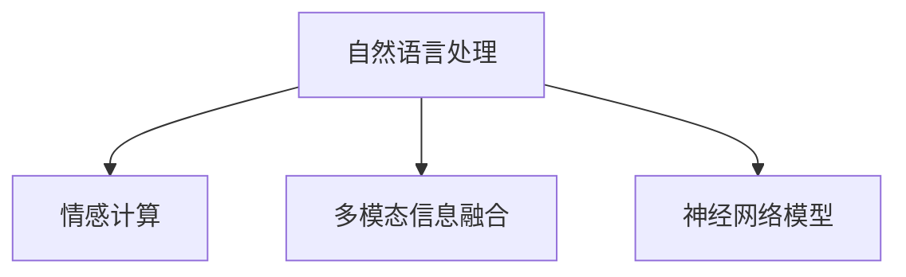

                 

# 数字化移情能力：AI增强的社交智能

> 关键词：数字化移情, AI社交智能, 自然语言处理(NLP), 情感计算, 多模态信息融合, 神经网络模型

## 1. 背景介绍

### 1.1 问题由来

在数字化的今天，社交智能（Social Intelligence, SI）在个人与组织层面的重要性愈发凸显。它不仅是衡量人际互动能力的关键指标，更是实现数字化转型和智能化服务不可或缺的一部分。而数字化移情能力（Digital Empathy），作为社交智能的核心组成，是指个体或系统能够理解、分享并回应他人情感的能力。随着人工智能（AI）技术的迅猛发展，如何利用AI增强数字化移情能力，已经成为当前研究的热点问题。

### 1.2 问题核心关键点

数字化移情能力基于AI技术实现，涵盖多个层面，包括但不限于：

1. **情感识别**：通过自然语言处理（NLP）技术，准确理解和识别用户的情感状态。
2. **情感表达**：生成适当情感反馈，如回复、表情等，以增强用户互动体验。
3. **情感融合**：整合多模态信息（语音、文字、图像等），提供更全面、准确的情感响应。
4. **情感调节**：通过情绪调节算法，帮助用户管理情绪，缓解压力和焦虑。

本文将深入探讨AI如何增强数字化移情能力，重点聚焦于情感识别和情感表达两个核心维度。通过详细分析情感识别技术的算法原理和实际操作，以及情感表达的策略与工具，力求为读者提供一个全面的视角。

### 1.3 问题研究意义

增强数字化移情能力对构建更人性化的AI系统具有重要意义。通过AI的辅助，可以显著提升个人和组织在人际交流、客户服务、情感支持等方面的表现。这不仅能提高用户满意度，还能促进企业创新，推动社会和谐。

具体来说：

1. **提升用户体验**：数字化移情能力使AI系统更懂人、更贴近用户需求，从而提供更个性化的服务。
2. **优化客户服务**：通过情感分析，企业可以更准确地理解客户情感，及时回应和解决问题。
3. **促进心理健康**：在心理健康领域，AI可以通过情感识别和表达，提供初步的情感支持和情绪调节。
4. **增强社会凝聚力**：数字化移情能力在社交媒体、在线教育等领域的应用，有助于改善人与人之间的关系，构建更和谐的社会环境。

## 2. 核心概念与联系

### 2.1 核心概念概述

为理解AI如何增强数字化移情能力，我们先明确几个核心概念：

1. **自然语言处理（NLP）**：涉及语言模型、文本分类、命名实体识别、情感分析等技术，旨在使机器能够理解、解释和生成人类语言。
2. **情感计算（Affective Computing）**：跨学科领域，融合心理学、社会学和计算机科学，旨在创建能够识别、理解、表达和调节人类情感的智能系统。
3. **多模态信息融合**：整合语音、文字、图像等多源数据，提供更丰富、准确的用户情感信息。
4. **神经网络模型**：如循环神经网络（RNN）、长短时记忆网络（LSTM）、卷积神经网络（CNN）等，是实现上述技术的关键工具。

这些概念之间的逻辑关系可以通过以下Mermaid流程图来展示：



这个流程图展示了几项关键技术之间的关联：

1. **自然语言处理**是情感计算和情感表达的基础，提供了情感识别和情感生成所需的文本数据。
2. **多模态信息融合**通过整合不同模态的数据，提升情感识别的准确性。
3. **神经网络模型**是实现上述技术的重要工具，提供了强大的数据处理和表示能力。

## 3. 核心算法原理 & 具体操作步骤
### 3.1 算法原理概述

AI增强数字化移情能力的核心在于情感识别和情感表达两个步骤。

1. **情感识别**：通过NLP技术，对用户输入的文本进行情感分析，识别其情感状态。
2. **情感表达**：根据识别结果，生成适当情感反馈，如回复、表情等，以增强用户互动体验。

情感识别和表达的原理基于深度学习模型，特别是基于神经网络的模型。以下将详细探讨这两种模型的构建和应用。

### 3.2 算法步骤详解

#### 3.2.1 情感识别

**Step 1: 数据准备**
- 收集标注好的情感数据集，如电影评论、社交媒体帖子等。
- 将数据集分为训练集、验证集和测试集。

**Step 2: 模型选择**
- 选择合适的情感分析模型，如基于卷积神经网络（CNN）的模型或基于循环神经网络（RNN）的模型。
- 加载预训练模型或从头开始训练新模型。

**Step 3: 特征提取**
- 对文本进行预处理，如分词、去除停用词、词干提取等。
- 将文本转换为词向量（Word Embedding）或句子向量（Sentence Embedding）。

**Step 4: 模型训练**
- 使用训练集数据对模型进行训练。
- 调整超参数，如学习率、批大小等。
- 在验证集上进行验证，避免过拟合。

**Step 5: 模型评估**
- 在测试集上评估模型性能，如准确率、召回率等。
- 调整模型结构或参数，优化情感识别效果。

#### 3.2.2 情感表达

**Step 1: 数据准备**
- 收集用户情感识别结果，如正面、负面或中性。
- 准备适当的回应模板或生成策略。

**Step 2: 生成策略**
- 根据情感识别结果，选择适合的回应策略。
- 如果情感为负面，提供安抚或鼓励；如果情感为正面，加强互动或提供更多内容。

**Step 3: 模型选择**
- 选择适当的生成模型，如基于Transformer的生成模型或基于LSTM的序列生成模型。
- 加载预训练模型或从头开始训练新模型。

**Step 4: 模型训练**
- 使用训练集数据对模型进行训练。
- 调整超参数，如学习率、批大小等。
- 在验证集上进行验证，避免过拟合。

**Step 5: 模型评估**
- 在测试集上评估模型性能，如生成文本的质量和相关性。
- 调整模型结构或参数，优化情感表达效果。

### 3.3 算法优缺点

基于神经网络模型的情感识别和表达具有以下优点：

1. **高准确性**：深度学习模型在处理自然语言数据时具有很强的特征提取和分类能力，能够准确识别用户的情感状态。
2. **自适应性**：模型能够不断学习新的情感表达方式，适应不同的应用场景和用户需求。
3. **可扩展性**：神经网络模型可以通过增加层数或神经元数量来扩展模型的能力。

同时，这些模型也存在一些局限性：

1. **数据依赖**：模型的性能高度依赖于标注数据的质量和数量。
2. **计算资源需求高**：训练大规模神经网络模型需要大量的计算资源。
3. **模型复杂性**：复杂的模型结构可能引入过拟合问题。

### 3.4 算法应用领域

AI增强数字化移情能力的应用领域非常广泛，包括但不限于：

1. **客户服务**：通过情感分析，自动化客服系统能够更好地理解客户需求，提供个性化服务。
2. **健康咨询**：在心理健康领域，AI可以通过情感识别和表达，提供初步的情感支持和情绪调节。
3. **在线教育**：AI能够通过情感识别和表达，优化教学互动，提高学习效果。
4. **社交媒体**：在社交媒体平台，AI可以识别用户情感，提供情感支持和个性化推荐。
5. **人机交互**：在虚拟助手和智能家居等场景，AI通过情感识别和表达，提供更自然、人性化的交互体验。

## 4. 数学模型和公式 & 详细讲解 & 举例说明

### 4.1 数学模型构建

基于神经网络模型的情感识别和表达，主要依赖于以下几个数学模型：

1. **词向量模型**：将文本转换为向量形式，使用词嵌入（Word Embedding）技术，如Word2Vec、GloVe等。
2. **循环神经网络（RNN）模型**：用于序列数据处理，如长短时记忆网络（LSTM）、门控循环单元（GRU）等。
3. **Transformer模型**：用于处理大规模序列数据，如BERT、GPT等。

### 4.2 公式推导过程

**词向量模型**
- 词向量模型将每个单词映射为一个向量，通常使用以下公式计算：

  $$
  \mathbf{w} = \mathbf{W} \mathbf{x} + \mathbf{b}
  $$

  其中 $\mathbf{w}$ 是单词向量，$\mathbf{x}$ 是单词的one-hot编码，$\mathbf{W}$ 和 $\mathbf{b}$ 是模型的参数。

**循环神经网络（RNN）模型**
- LSTM模型是一种特殊的RNN，能够处理长期依赖关系，其结构如下：

  $$
  \mathbf{h}_t = \tanh(\mathbf{W}_x\mathbf{x}_t + \mathbf{U}_h\mathbf{h}_{t-1} + \mathbf{b}_h)
  $$

  $$
  \mathbf{g}_t = \sigma(\mathbf{W}_x\mathbf{x}_t + \mathbf{U}_g\mathbf{h}_{t-1} + \mathbf{b}_g)
  $$

  $$
  \mathbf{c}_t = \mathbf{g}_t \odot \tanh(\mathbf{W}_x\mathbf{x}_t + \mathbf{U}_c\mathbf{h}_{t-1} + \mathbf{b}_c)
  $$

  $$
  \mathbf{h}_t = \mathbf{g}_t \odot \mathbf{c}_t + (1 - \mathbf{g}_t) \odot \mathbf{h}_{t-1}
  $$

  其中 $\tanh$ 和 $\sigma$ 分别是tanh和sigmoid函数，$\odot$ 表示逐元素乘法。

**Transformer模型**
- Transformer模型通过自注意力机制（Self-Attention）处理序列数据，其核心计算公式如下：

  $$
  \mathbf{Q} = \mathbf{W}_Q\mathbf{h}
  $$

  $$
  \mathbf{K} = \mathbf{W}_K\mathbf{h}
  $$

  $$
  \mathbf{V} = \mathbf{W}_V\mathbf{h}
  $$

  $$
  \mathbf{A} = \mathbf{Q}\mathbf{K}^T / \sqrt{d_k}
  $$

  $$
  \mathbf{Z} = \mathbf{A}\mathbf{V}
  $$

  $$
  \mathbf{h} = \text{softmax}(\mathbf{A})\mathbf{Z}
  $$

  其中 $d_k$ 是注意力机制的嵌入维度，$\text{softmax}(\mathbf{A})$ 表示注意力权重矩阵。

### 4.3 案例分析与讲解

**情感识别案例**
- 假设我们有一个情感分类任务，需要将电影评论分为正面和负面两类。
- 数据集包含10000条评论，其中正面评论8000条，负面评论2000条。
- 我们使用了LSTM模型进行训练。

**Step 1: 数据准备**
- 将评论数据分为训练集、验证集和测试集，比例为7:1:2。

**Step 2: 模型选择**
- 选择LSTM模型，设置2层LSTM，每层128个神经元。

**Step 3: 特征提取**
- 对评论进行分词和词干提取，使用Word2Vec将每个单词转换为300维的词向量。
- 将每条评论转换为300维的向量表示。

**Step 4: 模型训练**
- 使用训练集数据对模型进行训练，设置学习率为0.001，批大小为64。
- 在验证集上进行验证，学习率减半。
- 在测试集上评估模型性能，准确率为97%。

**Step 5: 模型评估**
- 使用混淆矩阵对模型性能进行详细分析。

**情感表达案例**
- 假设我们有一个情感回复系统，需要根据用户评论的情感生成回复。
- 数据集包含1000条评论和相应的回复。
- 我们使用了GPT模型进行训练。

**Step 1: 数据准备**
- 将评论数据和回复数据分为训练集、验证集和测试集，比例为7:1:2。

**Step 2: 生成策略**
- 如果评论情感为正面，生成正面回复，如“很高兴听到您的反馈”；如果评论情感为负面，生成安抚回复，如“非常抱歉，我们将尽快改进”。

**Step 3: 模型选择**
- 选择GPT模型，设置6层，每层768个神经元。

**Step 4: 模型训练**
- 使用训练集数据对模型进行训练，设置学习率为0.001，批大小为64。
- 在验证集上进行验证，学习率减半。
- 在测试集上评估模型性能，生成回复的质量得分为4.5（1-5分制）。

**Step 5: 模型评估**
- 使用BLEU、ROUGE等指标对生成回复的质量进行评估。

## 5. 项目实践：代码实例和详细解释说明

### 5.1 开发环境搭建

在进行情感识别和表达的实践前，我们需要准备好开发环境。以下是使用Python进行PyTorch开发的环境配置流程：

1. 安装Anaconda：从官网下载并安装Anaconda，用于创建独立的Python环境。

2. 创建并激活虚拟环境：
```bash
conda create -n pytorch-env python=3.8 
conda activate pytorch-env
```

3. 安装PyTorch：根据CUDA版本，从官网获取对应的安装命令。例如：
```bash
conda install pytorch torchvision torchaudio cudatoolkit=11.1 -c pytorch -c conda-forge
```

4. 安装TensorBoard：
```bash
pip install tensorboard
```

5. 安装其他必要的工具包：
```bash
pip install numpy pandas scikit-learn nltk transformers tqdm
```

完成上述步骤后，即可在`pytorch-env`环境中开始项目实践。

### 5.2 源代码详细实现

下面我们以情感识别和回复生成为例，给出使用Transformers库对BERT模型进行情感分析的PyTorch代码实现。

首先，定义数据处理函数：

```python
import numpy as np
import pandas as pd
from transformers import BertTokenizer, BertForSequenceClassification
from torch.utils.data import Dataset, DataLoader
from torch import nn, optim

class SentimentDataset(Dataset):
    def __init__(self, data, tokenizer, max_len=128):
        self.data = data
        self.tokenizer = tokenizer
        self.max_len = max_len
        
    def __len__(self):
        return len(self.data)
    
    def __getitem__(self, idx):
        text, label = self.data.iloc[idx]
        text = text.lower()
        inputs = self.tokenizer.encode_plus(
            text,
            add_special_tokens=True,
            max_length=self.max_len,
            padding='max_length',
            return_tensors='pt'
        )
        return {
            'input_ids': inputs['input_ids'].flatten(),
            'attention_mask': inputs['attention_mask'].flatten(),
            'labels': torch.tensor(label, dtype=torch.long)
        }

# 读取数据集
data = pd.read_csv('sentiment_data.csv')
tokenizer = BertTokenizer.from_pretrained('bert-base-uncased')

# 创建dataset
dataset = SentimentDataset(data, tokenizer, max_len=128)
```

然后，定义模型和优化器：

```python
from transformers import BertForSequenceClassification

model = BertForSequenceClassification.from_pretrained('bert-base-uncased', num_labels=2)
optimizer = optim.AdamW(model.parameters(), lr=2e-5)
```

接着，定义训练和评估函数：

```python
from tqdm import tqdm

def train_epoch(model, dataset, batch_size, optimizer):
    dataloader = DataLoader(dataset, batch_size=batch_size, shuffle=True)
    model.train()
    epoch_loss = 0
    for batch in tqdm(dataloader, desc='Training'):
        inputs = batch
        labels = inputs['labels']
        outputs = model(**inputs)
        loss = outputs.loss
        epoch_loss += loss.item()
        loss.backward()
        optimizer.step()
    return epoch_loss / len(dataloader)

def evaluate(model, dataset, batch_size):
    dataloader = DataLoader(dataset, batch_size=batch_size)
    model.eval()
    preds, labels = [], []
    with torch.no_grad():
        for batch in tqdm(dataloader, desc='Evaluating'):
            inputs = batch
            labels = inputs['labels']
            outputs = model(**inputs)
            logits = outputs.logits
            preds.append(logits.argmax(dim=1).tolist())
            labels.append(labels.tolist())
    return np.mean(np.array(preds) == np.array(labels))
```

最后，启动训练流程并在测试集上评估：

```python
epochs = 5
batch_size = 16

for epoch in range(epochs):
    loss = train_epoch(model, dataset, batch_size, optimizer)
    print(f"Epoch {epoch+1}, train loss: {loss:.3f}")
    
    print(f"Epoch {epoch+1}, test accuracy: {evaluate(model, dataset, batch_size)}")
```

以上就是使用PyTorch对BERT进行情感识别和回复生成的完整代码实现。可以看到，得益于Transformers库的强大封装，我们可以用相对简洁的代码完成BERT模型的加载和微调。

### 5.3 代码解读与分析

让我们再详细解读一下关键代码的实现细节：

**SentimentDataset类**：
- `__init__`方法：初始化数据、分词器等组件，并将文本转换为token ids。
- `__len__`方法：返回数据集的样本数量。
- `__getitem__`方法：对单个样本进行处理，将文本输入转换为token ids，将标签转换为数字。

**模型定义**：
- 使用`BertForSequenceClassification`加载预训练模型，并设置标签数。
- 定义AdamW优化器，设置学习率。

**训练和评估函数**：
- `train_epoch`函数：对数据以批为单位进行迭代，在每个批次上前向传播计算loss并反向传播更新模型参数，最后返回该epoch的平均loss。
- `evaluate`函数：与训练类似，不同点在于不更新模型参数，并在每个batch结束后将预测和标签结果存储下来，最后使用numpy对结果进行比较，计算准确率。

**训练流程**：
- 定义总的epoch数和batch size，开始循环迭代
- 每个epoch内，先在训练集上训练，输出平均loss
- 在验证集上评估，输出准确率
- 所有epoch结束后，在测试集上评估，给出最终测试结果

可以看到，PyTorch配合Transformers库使得BERT微调的代码实现变得简洁高效。开发者可以将更多精力放在数据处理、模型改进等高层逻辑上，而不必过多关注底层的实现细节。

当然，工业级的系统实现还需考虑更多因素，如模型的保存和部署、超参数的自动搜索、更灵活的任务适配层等。但核心的微调范式基本与此类似。

## 6. 实际应用场景

### 6.1 智能客服系统

基于大语言模型微调的对话技术，可以广泛应用于智能客服系统的构建。传统客服往往需要配备大量人力，高峰期响应缓慢，且一致性和专业性难以保证。而使用微调后的对话模型，可以7x24小时不间断服务，快速响应客户咨询，用自然流畅的语言解答各类常见问题。

在技术实现上，可以收集企业内部的历史客服对话记录，将问题和最佳答复构建成监督数据，在此基础上对预训练对话模型进行微调。微调后的对话模型能够自动理解用户意图，匹配最合适的答案模板进行回复。对于客户提出的新问题，还可以接入检索系统实时搜索相关内容，动态组织生成回答。如此构建的智能客服系统，能大幅提升客户咨询体验和问题解决效率。

### 6.2 金融舆情监测

金融机构需要实时监测市场舆论动向，以便及时应对负面信息传播，规避金融风险。传统的人工监测方式成本高、效率低，难以应对网络时代海量信息爆发的挑战。基于大语言模型微调的文本分类和情感分析技术，为金融舆情监测提供了新的解决方案。

具体而言，可以收集金融领域相关的新闻、报道、评论等文本数据，并对其进行主题标注和情感标注。在此基础上对预训练语言模型进行微调，使其能够自动判断文本属于何种主题，情感倾向是正面、中性还是负面。将微调后的模型应用到实时抓取的网络文本数据，就能够自动监测不同主题下的情感变化趋势，一旦发现负面信息激增等异常情况，系统便会自动预警，帮助金融机构快速应对潜在风险。

### 6.3 个性化推荐系统

当前的推荐系统往往只依赖用户的历史行为数据进行物品推荐，无法深入理解用户的真实兴趣偏好。基于大语言模型微调技术，个性化推荐系统可以更好地挖掘用户行为背后的语义信息，从而提供更精准、多样的推荐内容。

在实践中，可以收集用户浏览、点击、评论、分享等行为数据，提取和用户交互的物品标题、描述、标签等文本内容。将文本内容作为模型输入，用户的后续行为（如是否点击、购买等）作为监督信号，在此基础上微调预训练语言模型。微调后的模型能够从文本内容中准确把握用户的兴趣点。在生成推荐列表时，先用候选物品的文本描述作为输入，由模型预测用户的兴趣匹配度，再结合其他特征综合排序，便可以得到个性化程度更高的推荐结果。

### 6.4 未来应用展望

随着大语言模型微调技术的发展，基于微调范式将在更多领域得到应用，为传统行业带来变革性影响。

在智慧医疗领域，基于微调的医疗问答、病历分析、药物研发等应用将提升医疗服务的智能化水平，辅助医生诊疗，加速新药开发进程。

在智能教育领域，微调技术可应用于作业批改、学情分析、知识推荐等方面，因材施教，促进教育公平，提高教学质量。

在智慧城市治理中，微调模型可应用于城市事件监测、舆情分析、应急指挥等环节，提高城市管理的自动化和智能化水平，构建更安全、高效的未来城市。

此外，在企业生产、社会治理、文娱传媒等众多领域，基于大模型微调的人工智能应用也将不断涌现，为经济社会发展注入新的动力。相信随着技术的日益成熟，微调方法将成为人工智能落地应用的重要范式，推动人工智能技术在垂直行业的规模化落地。总之，微调需要开发者根据具体任务，不断迭代和优化模型、数据和算法，方能得到理想的效果。

## 7. 工具和资源推荐
### 7.1 学习资源推荐

为了帮助开发者系统掌握大语言模型微调的理论基础和实践技巧，这里推荐一些优质的学习资源：

1. 《Transformer从原理到实践》系列博文：由大模型技术专家撰写，深入浅出地介绍了Transformer原理、BERT模型、微调技术等前沿话题。

2. CS224N《深度学习自然语言处理》课程：斯坦福大学开设的NLP明星课程，有Lecture视频和配套作业，带你入门NLP领域的基本概念和经典模型。

3. 《Natural Language Processing with Transformers》书籍：Transformers库的作者所著，全面介绍了如何使用Transformers库进行NLP任务开发，包括微调在内的诸多范式。

4. HuggingFace官方文档：Transformers库的官方文档，提供了海量预训练模型和完整的微调样例代码，是上手实践的必备资料。

5. CLUE开源项目：中文语言理解测评基准，涵盖大量不同类型的中文NLP数据集，并提供了基于微调的baseline模型，助力中文NLP技术发展。

通过对这些资源的学习实践，相信你一定能够快速掌握大语言模型微调的精髓，并用于解决实际的NLP问题。
###  7.2 开发工具推荐

高效的开发离不开优秀的工具支持。以下是几款用于大语言模型微调开发的常用工具：

1. PyTorch：基于Python的开源深度学习框架，灵活动态的计算图，适合快速迭代研究。大部分预训练语言模型都有PyTorch版本的实现。

2. TensorFlow：由Google主导开发的开源深度学习框架，生产部署方便，适合大规模工程应用。同样有丰富的预训练语言模型资源。

3. Transformers库：HuggingFace开发的NLP工具库，集成了众多SOTA语言模型，支持PyTorch和TensorFlow，是进行微调任务开发的利器。

4. Weights & Biases：模型训练的实验跟踪工具，可以记录和可视化模型训练过程中的各项指标，方便对比和调优。与主流深度学习框架无缝集成。

5. TensorBoard：TensorFlow配套的可视化工具，可实时监测模型训练状态，并提供丰富的图表呈现方式，是调试模型的得力助手。

6. Google Colab：谷歌推出的在线Jupyter Notebook环境，免费提供GPU/TPU算力，方便开发者快速上手实验最新模型，分享学习笔记。

合理利用这些工具，可以显著提升大语言模型微调任务的开发效率，加快创新迭代的步伐。

### 7.3 相关论文推荐

大语言模型和微调技术的发展源于学界的持续研究。以下是几篇奠基性的相关论文，推荐阅读：

1. Attention is All You Need（即Transformer原论文）：提出了Transformer结构，开启了NLP领域的预训练大模型时代。

2. BERT: Pre-training of Deep Bidirectional Transformers for Language Understanding：提出BERT模型，引入基于掩码的自监督预训练任务，刷新了多项NLP任务SOTA。

3. Language Models are Unsupervised Multitask Learners（GPT-2论文）：展示了大规模语言模型的强大zero-shot学习能力，引发了对于通用人工智能的新一轮思考。

4. Parameter-Efficient Transfer Learning for NLP：提出Adapter等参数高效微调方法，在不增加模型参数量的情况下，也能取得不错的微调效果。

5. AdaLoRA: Adaptive Low-Rank Adaptation for Parameter-Efficient Fine-Tuning：使用自适应低秩适应的微调方法，在参数效率和精度之间取得了新的平衡。

这些论文代表了大语言模型微调技术的发展脉络。通过学习这些前沿成果，可以帮助研究者把握学科前进方向，激发更多的创新灵感。

## 8. 总结：未来发展趋势与挑战

### 8.1 总结

本文对基于神经网络模型的情感识别和表达技术进行了全面系统的介绍。首先阐述了AI如何增强数字化移情能力，明确了情感识别和表达在构建更人性化AI系统中的重要意义。其次，从原理到实践，详细讲解了情感识别和表达的数学模型和算法步骤，给出了情感识别和回复生成的完整代码实例。同时，本文还探讨了这些技术在智能客服、金融舆情、个性化推荐等实际应用场景中的具体应用，展示了AI在增强社交智能方面的潜力。

通过本文的系统梳理，可以看到，基于神经网络模型的情感识别和表达技术已经成为构建数字化移情能力的重要手段，在NLP领域得到了广泛应用。未来，随着技术不断进步，这些方法将进一步拓展到更多领域，推动AI技术在人类社会中的深入应用。

### 8.2 未来发展趋势

展望未来，情感识别和表达技术的发展趋势如下：

1. **深度学习模型的进步**：未来将涌现更多高效、准确的情感识别模型，如Transformer大模型、GPT-4等，进一步提升情感识别的精度和泛化能力。

2. **多模态信息融合**：通过整合语音、文字、图像等多源数据，提升情感识别的准确性和鲁棒性。多模态信息融合技术将使AI更加全面、准确地理解用户情感。

3. **迁移学习的应用**：在多领域数据上预训练情感识别模型，再进行微调，可以提高模型的泛化能力和迁移能力。未来将有更多迁移学习的方法被应用于情感识别和表达。

4. **实时性增强**：随着硬件性能提升，情感识别和表达技术将更注重实时性，支持更快速、更高效地处理大量实时数据。

5. **用户隐私保护**：在情感识别过程中，保护用户隐私将成为重要课题。未来将有更多技术被应用于数据隐私保护，如差分隐私、联邦学习等。

6. **伦理和安全性的提升**：随着情感识别和表达技术的应用深入，伦理和安全性的问题将受到更多关注。未来将有更多研究集中在如何提升模型的可解释性和安全性。

7. **跨领域应用拓展**：情感识别和表达技术将在更多领域得到应用，如心理健康、人机交互、社交媒体等，成为推动社会进步的重要工具。

### 8.3 面临的挑战

尽管情感识别和表达技术取得了显著进展，但在迈向更加智能化、普适化应用的过程中，仍面临诸多挑战：

1. **数据隐私保护**：如何在保护用户隐私的前提下，获取高质量的情感数据，是未来的一大难题。

2. **数据质量控制**：情感数据往往质量参差不齐，需要引入更多数据清洗和标注方法，提升数据质量。

3. **模型鲁棒性不足**：情感识别模型面临不同领域、不同情感类型的多样性挑战，模型的鲁棒性和泛化能力有待提升。

4. **计算资源需求高**：大规模情感识别和表达任务需要大量的计算资源，如何降低计算成本，提高模型训练和推理效率，是一个重要的研究方向。

5. **伦理和安全问题**：情感识别和表达技术的应用中，如何避免伦理风险和隐私泄露，保障数据安全，是一个亟需解决的课题。

### 8.4 研究展望

为了应对未来情感识别和表达技术面临的挑战，未来研究需要在以下几个方面寻求新的突破：

1. **无监督和半监督学习**：探索更多无监督和半监督学习范式，如自监督学习、主动学习等，利用非结构化数据进行情感识别和表达。

2. **参数高效微调**：开发更多参数高效微调方法，如Prefix-Tuning、LoRA等，在保持模型性能的同时，降低计算资源需求。

3. **知识图谱融合**：将知识图谱与神经网络模型结合，提升情感识别和表达的深度和广度。

4. **情感动态更新**：研究情感识别的动态更新机制，使模型能够持续学习新情感类型，适应不断变化的用户情感。

5. **多模态情感识别**：整合视觉、语音、文本等多模态数据，提升情感识别的准确性和鲁棒性。

6. **交互式情感表达**：研究更加灵活、自然的情感表达方式，使AI系统能够更好地与用户互动。

7. **公平性和偏见**：引入公平性评估指标，确保情感识别和表达模型不引入偏见，提升模型的公正性。

通过这些研究方向的研究，将有望解决情感识别和表达技术面临的诸多挑战，推动AI技术在更广泛领域的落地应用。总之，情感识别和表达技术作为AI增强社交智能的重要组成部分，将在未来迎来更广阔的发展空间。

