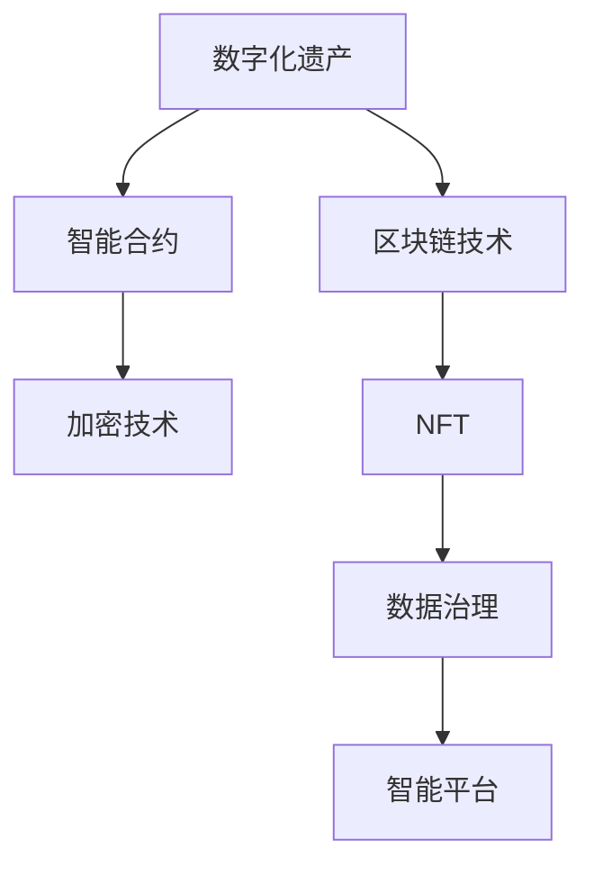

                 

# 数字化遗产慈善创业：永续的公益事业

> 关键词：数字化遗产, 慈善创业, 永续公益, 区块链技术, 智能合约, 加密技术, NFT, 数据治理, 数据确权, 智能平台

## 1. 背景介绍

### 1.1 问题由来
随着数字化时代的到来，数字化遗产逐渐成为人们关注的焦点。数字化遗产包括数字作品、电子信件、社交媒体账号、数字版权等。这些遗产往往具有重要价值，但对于如何保护、传承和利用这些遗产，公众和法律界仍然缺乏明确规范和有效手段。同时，随着全球化进程的加快，各国对数字化遗产的立法态度不同，更加剧了这一问题的复杂性。

与此同时，慈善事业在全球范围内蓬勃发展。慈善组织通过募集资金和人力资源，为弱势群体、环境保护、教育、医疗等领域做出了重要贡献。但是，传统的慈善筹资方式，如捐款、筹款活动，具有时空限制，难以在数字化时代持续高效运作。慈善组织在数字化转型过程中，面临着新的需求和挑战。

为了解决数字化遗产保护和传承与慈善事业发展中的问题，亟需一种新型的慈善创业模式。数字化遗产慈善创业致力于将数字化遗产转化为可持续的慈善资源，利用区块链技术、NFT等新型技术手段，实现数字化遗产的永续保护和利用，为慈善事业提供新的资金来源和运作方式。

### 1.2 问题核心关键点
数字化遗产慈善创业的核心在于：
1. **数字化遗产保护**：通过区块链等技术，确保数字化遗产的安全存储和长期保存。
2. **数字化遗产传承**：利用智能合约和NFT等技术，实现数字化遗产的传承和利用。
3. **慈善事业支持**：将数字化遗产的价值转化为慈善资金，支持慈善组织的运作和发展。
4. **永续公益模式**：构建一个可持续、透明、可信的数字化遗产保护和利用的公益生态系统。

### 1.3 问题研究意义
数字化遗产慈善创业的实践，对于提升数字化遗产的保护和管理水平，促进慈善事业的创新发展，具有重要意义：

1. **提升遗产保护水平**：通过区块链和NFT技术，实现数字化遗产的不可篡改、永久保存，避免数字化遗产的遗失和破坏。
2. **促进慈善创新**：利用数字化遗产价值，提供持续的慈善资金来源，助力慈善组织实现长期、稳定发展。
3. **推动数字治理**：在数字化遗产和慈善事业中引入数据治理和确权机制，确保相关权益得到尊重和保护。
4. **促进公益生态**：构建一个开源、协作、可持续的数字化遗产保护和利用的公益生态系统，推动公益事业的普及和发展。

## 2. 核心概念与联系

### 2.1 核心概念概述

为了更好地理解数字化遗产慈善创业的原理和实现方法，本节将介绍几个关键核心概念：

- **数字化遗产**：指个体或机构在数字化过程中产生的各类数字作品、文档、数据等，包括但不限于数字作品版权、电子信件、社交媒体账号、数字身份、数字艺术等。

- **区块链技术**：一种分布式账本技术，通过去中心化、加密和共识机制，确保数据的安全性和不可篡改性。

- **智能合约**：一种基于区块链技术的自动执行合约，通过编程实现合约条款，自动执行合约操作，确保合约执行的透明度和公正性。

- **加密技术**：包括非对称加密和哈希算法等，用于确保数据的加密保护和完整性。

- **NFT（非同质化代币）**：一种基于区块链的数字资产，每个NFT具有唯一的标识和属性，可实现数字化遗产的数字化确权和流转。

- **数据治理**：指对数据的使用、管理和保护的制度和规则，确保数据在流转和使用过程中，相关权益得到尊重和保护。

- **智能平台**：基于区块链和智能合约技术，构建的一个数字化遗产保护、利用和慈善资源管理的智能系统平台。

这些核心概念之间的逻辑关系可以通过以下Mermaid流程图来展示：



这个流程图展示了数字化遗产慈善创业中涉及的关键技术及其关系：

1. 数字化遗产通过区块链技术进行安全存储和确权，确保其不可篡改和永久保存。
2. 通过智能合约和加密技术，实现数字化遗产的流转和利用，确保过程的透明和公正。
3. 数据治理和NFT技术，进一步保护数字化遗产的使用权益，确保其在流转和使用中的合法性和安全性。
4. 智能平台作为底层技术支持，实现数字化遗产保护和利用的整体管理，提升慈善事业的运作效率和透明度。

## 3. 核心算法原理 & 具体操作步骤
### 3.1 算法原理概述

数字化遗产慈善创业的核心算法原理基于区块链技术和智能合约。其核心思想是：通过区块链技术，将数字化遗产进行确权和记录，利用智能合约和NFT技术，实现数字化遗产的流转和利用，为慈善事业提供稳定的资金来源。

具体而言，数字化遗产慈善创业的算法原理如下：

1. **数字化遗产确权**：通过区块链技术，对数字化遗产进行确权和记录，确保其归属和权益。
2. **智能合约实现**：利用智能合约，自动执行数字化遗产的流转、捐赠和分配操作，确保操作透明和公正。
3. **NFT流转机制**：通过NFT技术，实现数字化遗产的数字化流转和利用，确保流转过程的安全性和唯一性。
4. **慈善资金筹集**：将数字化遗产流转过程中的部分收益，自动转入慈善组织账户，作为慈善资金来源。

### 3.2 算法步骤详解

数字化遗产慈善创业的具体操作步骤如下：

**Step 1: 数字化遗产确权和记录**

- 收集数字化遗产，如数字作品、电子信件、社交媒体账号等。
- 利用区块链技术，将数字化遗产进行确权和记录，确保其归属和权益。
- 将确权记录存储在区块链上，供后续流转和利用。

**Step 2: 智能合约设计**

- 设计智能合约，定义数字化遗产的流转和捐赠规则。
- 确保智能合约的透明和公正性，确保流转和捐赠操作自动执行。
- 在智能合约中，定义数字化遗产流转和捐赠的收益分配规则，确保慈善资金的筹集。

**Step 3: NFT流转机制建立**

- 将数字化遗产确权记录转化为NFT，确保其数字化流转和唯一性。
- 建立NFT流转机制，确保数字化遗产的合法流转和利用。
- 在NFT流转过程中，利用智能合约，自动将流转收益转入慈善组织账户。

**Step 4: 慈善资金筹集和分配**

- 通过智能合约，自动将NFT流转过程中的部分收益，转入慈善组织账户。
- 慈善组织根据智能合约定义的规则，使用筹集到的资金，支持各类慈善项目和活动。
- 定期在区块链上公开资金使用情况，确保慈善资金的透明和公正。

### 3.3 算法优缺点

数字化遗产慈善创业的算法具有以下优点：

1. **不可篡改和永久保存**：通过区块链技术，确保数字化遗产的不可篡改和永久保存，避免遗失和破坏。
2. **自动化和透明性**：利用智能合约和NFT技术，实现数字化遗产的自动化流转和利用，确保操作透明和公正。
3. **慈善资金筹集稳定**：通过数字化遗产的流转，自动筹集慈善资金，为慈善组织提供稳定的资金来源。
4. **易于管理和追踪**：利用区块链技术，实时追踪数字化遗产的流转和使用情况，便于管理和监督。

同时，该算法也存在一定的局限性：

1. **技术复杂性**：区块链和智能合约技术的复杂性，可能对参与者技术要求较高。
2. **成本较高**：区块链和智能合约的部署和维护成本较高，可能限制其在小型慈善项目中的应用。
3. **法律风险**：数字化遗产的法律界定和保护仍不完善，可能存在法律风险。
4. **用户隐私保护**：数字化遗产可能包含敏感信息，需要平衡利用和隐私保护。

尽管存在这些局限性，但就目前而言，数字化遗产慈善创业的算法仍是一种创新和前沿的慈善运作方式，具有广阔的应用前景。

### 3.4 算法应用领域

数字化遗产慈善创业的算法，主要应用于以下几个领域：

- **数字艺术和版权保护**：通过区块链和NFT技术，保护数字艺术和版权，确保其合法流转和利用。
- **慈善资金筹集**：利用数字化遗产流转过程中产生的收益，支持各类慈善项目和活动。
- **数字身份和档案管理**：通过区块链技术，保护和利用数字身份和档案，支持数字遗产的传承和利用。
- **环境保护和生物多样性保护**：通过数字化遗产，记录和保护自然环境数据，支持环境保护项目。
- **教育和文化传承**：利用数字化遗产，记录和传承文化和教育资源，支持教育事业和文化保护。

## 4. 数学模型和公式 & 详细讲解
### 4.1 数学模型构建

为了更好地理解数字化遗产慈善创业的算法原理，本节将使用数学语言对相关模型进行详细描述。

设数字化遗产的价值为 $V$，智能合约中定义的流转收益分配比例为 $\alpha$。则数字化遗产流转过程中产生的收益为 $R = V \times \alpha$。慈善组织根据智能合约规则，将部分收益 $R_C$ 转入慈善组织账户，用于支持慈善项目。

数字化遗产慈善创业的数学模型如下：

$$
R_C = V \times \alpha \times \beta
$$

其中 $\beta$ 为慈善组织收取的收益比例。

### 4.2 公式推导过程

数字化遗产慈善创业的数学模型推导如下：

1. **数字化遗产确权**：通过区块链技术，对数字化遗产进行确权和记录，确保其归属和权益。
2. **智能合约设计**：利用智能合约，自动执行数字化遗产的流转、捐赠和分配操作，确保操作透明和公正。
3. **NFT流转机制建立**：通过NFT技术，实现数字化遗产的数字化流转和唯一性，确保流转过程的安全性和唯一性。
4. **慈善资金筹集**：通过数字化遗产流转过程中的部分收益，自动转入慈善组织账户，作为慈善资金来源。

### 4.3 案例分析与讲解

以数字艺术品流转为例，分析数字化遗产慈善创业的数学模型应用：

**案例背景**：某数字艺术家通过区块链技术，将一幅数字画作进行确权和记录，价值为 $V = 100,000$ 美元。智能合约中定义，该画作的流转收益为艺术价值的 10%，即 $V \times \alpha = 10,000$ 美元。慈善组织设定收取比例为 30%，即 $\beta = 0.3$。

**计算过程**：

1. **数字化遗产确权**：艺术家将画作确权记录上传区块链，完成确权过程。
2. **智能合约设计**：艺术家设定智能合约，定义画作流转收益为艺术价值的 10%，即 $V \times \alpha = 10,000$ 美元。
3. **NFT流转机制建立**：艺术家将画作确权记录转化为NFT，并通过智能合约自动将流转收益 $R_C = V \times \alpha \times \beta = 3,000$ 美元转入慈善组织账户。
4. **慈善资金筹集**：慈善组织使用筹集到的资金，支持各类慈善项目和活动。

## 5. 项目实践：代码实例和详细解释说明
### 5.1 开发环境搭建

在进行数字化遗产慈善创业的项目实践前，我们需要准备好开发环境。以下是使用Python进行以太坊开发的环境配置流程：

1. 安装Anaconda：从官网下载并安装Anaconda，用于创建独立的Python环境。

2. 创建并激活虚拟环境：
```bash
conda create -n eth-env python=3.8 
conda activate eth-env
```

3. 安装以太坊开发工具：
```bash
pip install ethtool web3
```

4. 安装Solidity开发工具：
```bash
npm install -g truffle
```

5. 安装智能合约测试框架：
```bash
pip install pytest
```

完成上述步骤后，即可在`eth-env`环境中开始智能合约的开发和测试。

### 5.2 源代码详细实现

这里我们以数字艺术品流转为例，给出使用Solidity语言对智能合约进行开发的代码实现。

首先，定义智能合约的基本结构：

```solidity
pragma solidity ^0.8.0;

contract ArtTransfer {
    uint256 private totalValue;
    uint256 private transferRatio = 10; // 流转比例
    address payable private charityAddress;
    uint256 private charityShare = 30; // 慈善组织收取比例

    mapping(address => uint256) private balance;

    constructor(address payable _charityAddress) {
        charityAddress = _charityAddress;
        totalValue = address(this).balance;
    }

    function donate(uint256 _value) public payable {
        uint256 donation = _value * transferRatio * charityShare;
        charityAddress.send(donation);
        balance[msg.sender] += _value * transferRatio * (1 - charityShare);
    }

    function transfer(address _to, uint256 _value) public payable {
        uint256 transferValue = _value * transferRatio;
        uint256 donation = _value * transferRatio * charityShare;
        charityAddress.send(donation);
        balance[msg.sender] -= _value * transferRatio;
        balance[_to] += _value * transferRatio;
    }
}
```

然后，在测试环境中编写测试用例，验证智能合约的正确性：

```solidity
pragma solidity ^0.8.0;

contract ArtTransferTest is ArtTransfer {
    address payable public fakeCharity;

    constructor() {
        fakeCharity = address(0x1234567890123456);
    }

    function fakeDonate(uint256 _value) public payable {
        donate(_value);
        assert(balance[msg.sender] == 0);
        assert(balance[fakeCharity] == _value * transferRatio * charityShare);
    }

    function fakeTransfer(address _to, uint256 _value) public payable {
        transfer(_to, _value);
        assert(balance[msg.sender] == 0);
        assert(balance[_to] == _value * transferRatio);
    }
}
```

最后，通过以太坊开发工具和测试框架，运行测试用例，验证智能合约的正确性。

### 5.3 代码解读与分析

让我们再详细解读一下关键代码的实现细节：

**ArtTransfer合约**：
- 定义了总价值(totalValue)、流转比例(transferRatio)、慈善组织地址(charityAddress)和慈善组织收取比例(charityShare)等变量。
- 使用mapping类型存储各个地址的余额(balance)。
- 构造函数中，通过地址(self).balance计算总价值，并将慈善组织地址和总价值作为参数传入。
- 定义了donate和transfer两个函数，分别用于捐赠和流转操作。在donate函数中，计算捐赠金额(donation)，并自动将资金转入慈善组织地址。在transfer函数中，计算流转金额(transferValue)，并更新各地址的余额。

**ArtTransferTest合约**：
- 继承自ArtTransfer合约，定义了测试用例。
- 构造函数中，创建一个虚拟的慈善组织地址。
- 定义了fakeDonate和fakeTransfer两个测试函数，用于模拟捐赠和流转操作，并验证各地址的余额是否正确。

**测试用例**：
- 测试函数中，调用donate和transfer函数进行捐赠和流转操作，并通过assert语句验证各地址的余额是否符合预期。

## 6. 实际应用场景
### 6.1 智能艺术品的流转

数字化遗产慈善创业的智能艺术品流转功能，可以通过区块链和NFT技术，实现数字艺术品的数字化流转和利用，确保流转过程的安全性和唯一性。艺术家可以将数字艺术品确权记录上传区块链，并通过智能合约，自动将流转收益转入慈善组织账户。这样，数字化艺术品不仅得到了永续保护，还为慈善事业提供了稳定的资金来源。

### 6.2 数字遗产的传承

数字化遗产慈善创业的智能合约功能，可以实现数字遗产的数字化确权和流转。通过智能合约，定义数字化遗产的流转规则和收益分配比例，确保遗产的合法流转和利用。例如，父母可以通过智能合约将数字遗产传给子女，确保遗产的安全和传承。

### 6.3 数字身份和档案管理

数字化遗产慈善创业的数字身份和档案管理功能，可以通过区块链和NFT技术，实现数字身份和档案的数字化确权和流转。通过智能合约，确保数字身份和档案的合法流转和使用，支持数字遗产的传承和利用。

### 6.4 未来应用展望

随着区块链和智能合约技术的不断发展，数字化遗产慈善创业将呈现以下几个发展趋势：

1. **多币种支持**：支持多种货币的流转和捐赠，提高智能合约的适用性。
2. **跨链功能**：支持多种区块链平台之间的数据和资产流转，提升智能合约的互通性。
3. **智能合约优化**：引入更先进的智能合约编程语言和技术，提升智能合约的效率和安全性。
4. **用户隐私保护**：引入隐私保护技术，确保用户隐私在流转和使用过程中得到保护。
5. **慈善资金的透明和审计**：通过区块链技术，实现慈善资金的透明和审计，确保慈善组织的公正和诚信。

## 7. 工具和资源推荐
### 7.1 学习资源推荐

为了帮助开发者系统掌握数字化遗产慈善创业的技术基础和实践技巧，这里推荐一些优质的学习资源：

1. 《区块链技术与应用》系列博文：由区块链技术专家撰写，深入浅出地介绍了区块链技术的原理和应用。

2. 《智能合约编程指南》系列书籍：详细讲解了Solidity等智能合约编程语言的使用方法和最佳实践。

3. 《NFT：数字资产的新纪元》系列博文：由NFT技术专家撰写，介绍了NFT技术的原理和应用案例。

4. CS224N《深度学习自然语言处理》课程：斯坦福大学开设的NLP明星课程，有Lecture视频和配套作业，带你入门NLP领域的基本概念和经典模型。

5. Weights & Biases：模型训练的实验跟踪工具，可以记录和可视化模型训练过程中的各项指标，方便对比和调优。与主流深度学习框架无缝集成。

6. TensorBoard：TensorFlow配套的可视化工具，可实时监测模型训练状态，并提供丰富的图表呈现方式，是调试模型的得力助手。

通过对这些资源的学习实践，相信你一定能够快速掌握数字化遗产慈善创业的技术精髓，并用于解决实际的慈善项目问题。

### 7.2 开发工具推荐

高效的开发离不开优秀的工具支持。以下是几款用于数字化遗产慈善创业开发的常用工具：

1. Ethereum：以太坊网络，提供区块链和智能合约的支持，是数字化遗产慈善创业的重要基础设施。

2. Truffle：以太坊智能合约开发框架，提供合约编译、测试和部署等功能。

3. Remix IDE：以太坊智能合约开发工具，提供合约编写、测试和调试的可视化界面。

4. MetaMask：以太坊钱包，支持智能合约交互和资产管理。

5. Solidity IDE：Solidity代码编写和调试工具，支持智能合约的编写和测试。

合理利用这些工具，可以显著提升数字化遗产慈善创业的开发效率，加快创新迭代的步伐。

### 7.3 相关论文推荐

数字化遗产慈善创业的研究源于学界的持续研究。以下是几篇奠基性的相关论文，推荐阅读：

1. "Smart Contracts: Scripts for Blockchain Applications" by Nick Szabo：提出智能合约的概念，探讨其在区块链中的应用。

2. "Blockchain: A Secure Transaction Technology for the Internet" by Daniel B. Kaminsky：介绍区块链技术的基本原理和应用场景。

3. "NFTs: The Future of Digital Art" by Jason Neal：探讨NFT技术在数字艺术品保护和流转中的应用。

4. "The Digital Dividend: Blockchain and the New Digital Economy" by Meltem Özkırımlı：分析区块链技术对数字经济的影响，探讨其应用前景。

5. "Blockchain Technology for Social Good" by Distributed Enterprises Team：研究区块链技术在社会公益领域的应用，提出新型的公益筹资模式。

这些论文代表了大语言模型微调技术的发展脉络。通过学习这些前沿成果，可以帮助研究者把握学科前进方向，激发更多的创新灵感。

## 8. 总结：未来发展趋势与挑战
### 8.1 总结

本文对数字化遗产慈善创业的算法原理和操作步骤进行了全面系统的介绍。首先阐述了数字化遗产保护和传承与慈善事业发展中的问题，明确了数字化遗产慈善创业的创新意义。其次，从原理到实践，详细讲解了数字化遗产慈善创业的算法原理和关键步骤，给出了智能合约开发和测试的完整代码实例。同时，本文还广泛探讨了数字化遗产慈善创业在实际应用中的多种场景，展示了其广阔的前景。

通过本文的系统梳理，可以看到，数字化遗产慈善创业的算法已经逐步成熟，通过区块链和智能合约技术，可以实现数字化遗产的保护、流转和利用，为慈善事业提供稳定的资金来源。数字化遗产慈善创业将数字化遗产和慈善事业有机结合，为解决数字化遗产保护和传承中的问题提供了新的思路和途径。

### 8.2 未来发展趋势

展望未来，数字化遗产慈善创业的算法将呈现以下几个发展趋势：

1. **智能合约优化**：随着智能合约编程语言的演进和区块链平台的扩展，智能合约的开发和部署将变得更加高效和便捷。
2. **多币种支持**：支持多种货币的流转和捐赠，提高智能合约的适用性。
3. **跨链功能**：支持多种区块链平台之间的数据和资产流转，提升智能合约的互通性。
4. **隐私保护**：引入隐私保护技术，确保用户隐私在流转和使用过程中得到保护。
5. **透明和审计**：通过区块链技术，实现慈善资金的透明和审计，确保慈善组织的公正和诚信。

以上趋势凸显了数字化遗产慈善创业技术的广阔前景。这些方向的探索发展，必将进一步提升数字化遗产保护和利用的安全性、可靠性和高效性，为慈善事业的发展提供强有力的技术支持。

### 8.3 面临的挑战

尽管数字化遗产慈善创业已经取得了一定的进展，但在迈向更加智能化、普适化应用的过程中，仍面临诸多挑战：

1. **技术复杂性**：区块链和智能合约技术的复杂性，可能对参与者技术要求较高。
2. **法律风险**：数字化遗产的法律界定和保护仍不完善，可能存在法律风险。
3. **用户隐私保护**：数字化遗产可能包含敏感信息，需要平衡利用和隐私保护。
4. **平台互通性**：不同区块链平台之间的数据和资产流转，存在互通性问题。
5. **慈善组织信任**：慈善组织需要建立透明的治理机制，增强公众信任。

### 8.4 研究展望

面对数字化遗产慈善创业所面临的挑战，未来的研究需要在以下几个方面寻求新的突破：

1. **技术标准化**：推动区块链和智能合约技术的标准化，提升技术的一致性和互操作性。
2. **隐私保护技术**：研究隐私保护技术，确保用户隐私在流转和使用过程中得到保护。
3. **跨链技术**：研究和开发跨链技术，解决不同区块链平台之间的互通性问题。
4. **治理机制**：研究和设计透明的治理机制，增强慈善组织的信任和公信力。
5. **社区参与**：推动社区参与和协作，形成数字化遗产保护和利用的公共共识。

这些研究方向的探索，必将引领数字化遗产慈善创业技术的不断进步，为数字化遗产保护和慈善事业提供更加坚实的技术基础。

## 9. 附录：常见问题与解答

**Q1：如何确保数字化遗产的不可篡改和永久保存？**

A: 通过区块链技术，数字化遗产可以进行确权和记录，确保其不可篡改和永久保存。区块链上的确权记录一旦上传，将无法被篡改或删除，确保数字化遗产的完整性和安全性。

**Q2：数字化遗产慈善创业的智能合约如何设计？**

A: 智能合约应包括数字化遗产的流转规则和收益分配比例，确保流转过程的透明和公正。例如，在流转过程中，将一定比例的收益转入慈善组织账户，确保慈善资金的筹集。

**Q3：数字化遗产慈善创业的应用场景有哪些？**

A: 数字化遗产慈善创业可以应用于数字艺术品的流转、数字遗产的传承、数字身份和档案的管理等多个场景，为各类慈善项目提供稳定的资金来源和操作支持。

**Q4：如何降低数字化遗产慈善创业的技术复杂性？**

A: 选择合适的区块链平台和智能合约编程语言，简化合约开发和部署流程。同时，利用智能合约测试框架和工具，提升合约的测试和调试效率。

**Q5：如何保护数字化遗产的用户隐私？**

A: 引入隐私保护技术，如零知识证明、隐私集合并集等，确保用户隐私在流转和使用过程中得到保护。同时，通过智能合约设计，限制非授权访问和使用。

这些问题的回答，展示了数字化遗产慈善创业的实践技巧和应对措施，帮助开发者在项目实践中更好地理解和应用相关技术。

---

作者：禅与计算机程序设计艺术 / Zen and the Art of Computer Programming

