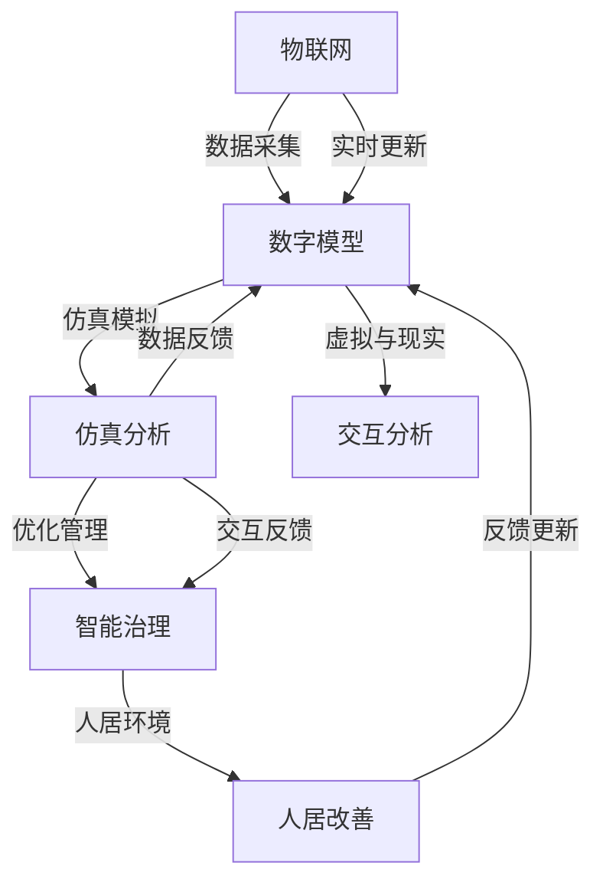

                 

# 数字孪生技术在智慧城市中的应用

> 关键词：数字孪生,智慧城市,物联网(IoT),实时监控,仿真模拟,智能治理,人居环境,虚拟仿真

## 1. 背景介绍

### 1.1 问题由来
在现代城市化进程中，智慧城市（Smart City）成为了全球各大城市争相追求的发展目标。智慧城市依赖于各种智能技术，以提升城市治理效率、改善居民生活质量、保障城市安全等。

然而，智慧城市的构建面临着巨大的挑战，包括数据来源繁多、数据融合复杂、预测和控制难度大、资源消耗高等问题。为了应对这些挑战，数字孪生技术应运而生。数字孪生技术通过构建城市的虚拟模型，实现虚拟与现实的同步更新，实时监控和仿真模拟城市运行，辅助决策和优化管理。

### 1.2 问题核心关键点
数字孪生技术通过模拟城市的每一个细节，包括交通流量、能源消耗、环境污染、居民行为等，来辅助城市管理者进行精准决策。其核心关键点包括：

- **数据驱动**：基于大量的物联网（IoT）传感器数据，实时获取城市的运行状态。
- **虚拟仿真**：构建城市的虚拟模型，用于仿真分析和预测，提供决策支持。
- **跨域融合**：融合来自不同领域（如交通、能源、环境）的数据，形成统一的城市运营视图。
- **智能治理**：利用人工智能和大数据技术，实现城市运行状态的智能分析和管理。
- **实时更新**：通过持续的数据采集和模型更新，保证城市运营信息的实时性。

### 1.3 问题研究意义
研究数字孪生技术在智慧城市中的应用，对于推动城市管理的智能化、精细化和可持续发展具有重要意义：

- **提升治理效率**：通过虚拟仿真和实时监控，实现城市治理的精准化，减少管理成本。
- **改善居民生活**：智能化的公共服务和设施，提升居民生活质量，增强居民的幸福感和安全感。
- **保障城市安全**：通过预测和预警，有效应对各种突发事件，保障城市安全稳定。
- **推动可持续发展**：通过模拟和优化，提升资源利用效率，促进绿色、低碳、环保的城市发展。
- **增强决策支持**：辅助城市决策者进行科学决策，提升决策质量和效果。

## 2. 核心概念与联系

### 2.1 核心概念概述

数字孪生（Digital Twin）技术是指通过虚拟与现实的同步更新，构建城市的虚拟模型，用于实时监控、仿真模拟、智能分析和优化管理。数字孪生技术在智慧城市中的应用，主要包括以下几个核心概念：

- **物联网（IoT）**：通过传感器、监控摄像头等设备，实时采集城市运行数据。
- **数字模型**：构建城市的虚拟模型，包含道路、建筑、交通、环境等各类元素。
- **仿真分析**：基于虚拟模型进行仿真模拟，预测城市运行情况，辅助决策。
- **智能治理**：利用人工智能和大数据分析，实现城市运行状态的智能分析和优化管理。
- **人居环境**：通过数字孪生技术，改善城市人居环境，提升居民生活质量。

### 2.2 核心概念原理和架构的 Mermaid 流程图



## 3. 核心算法原理 & 具体操作步骤

### 3.1 算法原理概述
数字孪生技术在智慧城市中的应用，核心在于构建城市的虚拟模型，并通过物联网技术实时获取城市运行数据，利用仿真分析、智能治理等手段，辅助城市管理决策。

### 3.2 算法步骤详解

1. **数据采集**：
   - 部署各种物联网设备（如传感器、监控摄像头、定位系统等），采集城市运行数据，包括交通流量、能源消耗、环境污染、居民行为等。
   - 数据采集需满足实时性、高精度、广覆盖的要求。

2. **数字模型构建**：
   - 利用三维建模软件，构建城市的虚拟模型，包含道路、建筑、交通、环境等各类元素。
   - 数字模型需精细化，包括路网、交叉口、交通灯、停车场、绿化带等。

3. **仿真分析**：
   - 基于数字模型进行仿真模拟，预测城市运行情况，包括交通流量、能源消耗、环境污染等。
   - 仿真分析需考虑多领域、多层次的复杂因素，如交通拥堵、环境污染、居民出行偏好等。

4. **智能治理**：
   - 利用人工智能和大数据分析，实现城市运行状态的智能分析和优化管理。
   - 通过机器学习、深度学习等技术，预测和控制城市运行状态，提升城市治理效率。

5. **反馈更新**：
   - 将仿真分析结果与实际运行数据进行对比，持续更新数字模型和优化模型参数。
   - 反馈更新需考虑实时性、准确性和及时性，以保证模型的有效性和可靠性。

### 3.3 算法优缺点

**优点**：
- **数据驱动**：基于物联网设备的数据驱动，确保城市运行状态的实时性和准确性。
- **虚拟仿真**：通过虚拟模型进行仿真分析，预测城市运行情况，辅助决策。
- **跨域融合**：融合不同领域的数据，形成统一的城市运营视图，提升决策支持能力。
- **智能治理**：利用人工智能和大数据分析，实现城市运行状态的智能分析和优化管理。
- **实时更新**：通过持续的数据采集和模型更新，保证城市运营信息的实时性。

**缺点**：
- **数据成本高**：部署和维护物联网设备需高昂的成本。
- **数据安全问题**：大量数据的采集和处理，存在数据泄露和隐私保护的问题。
- **模型复杂度高**：数字模型的构建和仿真分析需考虑复杂的多层次因素，模型维护难度大。
- **技术门槛高**：数字孪生技术的实施需要多领域的技术支持和专业人才。

### 3.4 算法应用领域

数字孪生技术在智慧城市中的应用，主要包括以下几个领域：

- **交通管理**：通过数字孪生技术，实现交通流量的实时监控和仿真模拟，优化交通信号灯控制，提升交通效率。
- **能源管理**：利用数字孪生技术，实时监控和预测能源消耗情况，优化能源分配和利用，降低能源浪费。
- **环境监测**：通过数字孪生技术，实时监测城市环境污染情况，预测和预警环境风险，提升环境治理效果。
- **公共安全**：利用数字孪生技术，实时监控城市公共安全事件，预测和防范突发事件，保障城市安全。
- **智能服务**：通过数字孪生技术，提供智能化的公共服务和设施，提升居民生活质量，增强居民的幸福感和安全感。

## 4. 数学模型和公式 & 详细讲解 & 举例说明

### 4.1 数学模型构建

数字孪生技术在智慧城市中的应用，主要依赖于以下数学模型：

- **城市数据采集模型**：用于描述物联网设备的数据采集过程，包括传感器的位置、数据采集频率、数据精度等。
- **城市数字模型**：用于描述城市的虚拟模型，包括道路、建筑、交通、环境等各类元素，利用三维几何建模软件描述。
- **城市仿真模型**：用于描述城市运行的仿真模拟过程，包括交通流量、能源消耗、环境污染等，利用物理引擎进行模拟。
- **城市智能治理模型**：用于描述城市运行状态的智能分析和优化管理，利用机器学习、深度学习等技术进行分析和预测。

### 4.2 公式推导过程

以交通流量预测为例，其数学模型包括：

- **交通流量采集模型**：
  $$
  F_i(t) = \sum_{k=1}^{K} C_{ik}(t)
  $$
  其中 $F_i(t)$ 表示第 $i$ 条道路在时刻 $t$ 的交通流量，$C_{ik}(t)$ 表示第 $k$ 个传感器在时刻 $t$ 的流量数据。

- **交通流量预测模型**：
  $$
  \hat{F}_i(t+T) = f(\hat{F}_i(t),\vec{X}(t))
  $$
  其中 $\hat{F}_i(t+T)$ 表示未来时刻 $t+T$ 的交通流量预测值，$f$ 表示预测函数，$\vec{X}(t)$ 表示未来时刻 $t+T$ 的输入变量，包括交通流量、天气、交通灯状态等。

### 4.3 案例分析与讲解

以某城市交通流量预测为例，其数据采集和仿真模拟过程如下：

1. **数据采集**：部署多个传感器，采集城市主要道路的交通流量数据，如车道数、车流量、速度等。
2. **数字模型构建**：利用三维建模软件，构建城市交通网络模型，包括道路、交叉口、交通灯、停车场等。
3. **仿真分析**：基于数字模型进行交通流量仿真模拟，考虑交通信号灯、车速、车流量等因素，预测未来交通流量变化。
4. **智能治理**：利用机器学习模型，根据仿真结果和实际数据，优化交通信号灯控制策略，提升交通效率。

## 5. 项目实践：代码实例和详细解释说明

### 5.1 开发环境搭建

1. **环境配置**：安装Python 3.x、Jupyter Notebook、Google Earth Engine、QGIS等工具。
2. **数据准备**：收集城市道路、交通流量、天气、交通灯状态等数据，进行预处理和清洗。
3. **模型搭建**：使用TensorFlow、PyTorch、OpenAI Gym等框架，搭建交通流量预测模型。

### 5.2 源代码详细实现

以TensorFlow为例，代码实现如下：

```python
import tensorflow as tf
from tensorflow.keras import layers

# 定义交通流量预测模型
def build_traffic_model(input_shape):
    model = tf.keras.Sequential([
        layers.Dense(64, activation='relu', input_shape=input_shape),
        layers.Dense(32, activation='relu'),
        layers.Dense(1, activation='linear')
    ])
    return model

# 加载数据
train_data = load_train_data()
test_data = load_test_data()

# 构建模型
input_shape = (3,)
model = build_traffic_model(input_shape)

# 编译模型
model.compile(optimizer=tf.keras.optimizers.Adam(learning_rate=0.001),
              loss='mse',
              metrics=['mae'])

# 训练模型
model.fit(train_data, epochs=10, validation_data=test_data)

# 预测交通流量
predictions = model.predict(test_data)
```

### 5.3 代码解读与分析

代码实现包括模型定义、数据加载、模型构建、编译、训练和预测等步骤。具体分析如下：

1. **模型定义**：
   - 定义了三层神经网络模型，包含两个隐藏层和一个输出层，隐藏层使用ReLU激活函数。
   - 输出层使用线性激活函数，预测未来时刻的交通流量。

2. **数据加载**：
   - 使用自定义函数加载训练集和测试集数据，包括交通流量、天气、交通灯状态等输入变量。
   - 对数据进行归一化处理，以保证模型输入的稳定性和准确性。

3. **模型构建**：
   - 使用TensorFlow的Sequential模型，依次添加隐藏层和输出层。
   - 隐藏层神经元数为64和32，分别使用ReLU激活函数。
   - 输出层神经元数为1，使用线性激活函数。

4. **编译模型**：
   - 使用Adam优化器，学习率为0.001，均方误差损失函数，MAE（均值绝对误差）评估指标。
   - 编译模型后，可以进行训练和预测。

5. **训练模型**：
   - 使用训练集数据进行模型训练，迭代10轮。
   - 使用测试集数据进行模型验证，评估模型性能。

6. **预测交通流量**：
   - 使用训练好的模型，对测试集数据进行交通流量预测。
   - 输出预测结果，并进行可视化展示。

## 6. 实际应用场景

### 6.1 交通管理

数字孪生技术在交通管理中的应用，可以实现交通流量的实时监控和仿真模拟，优化交通信号灯控制，提升交通效率。具体应用场景包括：

- **交通流量监控**：通过物联网设备采集交通流量数据，实时监控城市交通运行情况。
- **交通信号灯控制**：基于实时交通流量数据，动态调整交通信号灯控制策略，优化交通流。
- **交通事件预警**：利用数字孪生技术，预测交通拥堵、交通事故等事件，提前进行预警和应急处理。

### 6.2 能源管理

数字孪生技术在能源管理中的应用，可以实现能源消耗的实时监控和仿真模拟，优化能源分配和利用，降低能源浪费。具体应用场景包括：

- **能源消耗监控**：通过物联网设备采集能源消耗数据，实时监控城市能源使用情况。
- **能源优化分配**：基于能源消耗数据，优化能源分配策略，提升能源利用效率。
- **能源浪费预警**：利用数字孪生技术，预测能源浪费风险，提前进行预警和优化。

### 6.3 环境监测

数字孪生技术在环境监测中的应用，可以实现环境污染的实时监控和仿真模拟，预测和预警环境风险，提升环境治理效果。具体应用场景包括：

- **环境污染监控**：通过物联网设备采集环境污染数据，实时监控城市环境污染情况。
- **环境风险预警**：基于环境污染数据，预测环境风险，提前进行预警和应急处理。
- **环境治理优化**：利用数字孪生技术，优化环境治理策略，提升环境治理效果。

### 6.4 未来应用展望

未来，数字孪生技术在智慧城市中的应用将呈现以下几个发展趋势：

- **多模态数据融合**：结合物联网、卫星遥感、无人机等多种数据源，提升数据覆盖度和质量。
- **智能决策支持**：引入人工智能和大数据分析技术，实现城市运行状态的智能分析和优化管理。
- **虚拟与现实融合**：通过虚拟与现实的同步更新，提升数字孪生模型的实时性和准确性。
- **跨领域应用拓展**：将数字孪生技术应用于更多领域，如公共安全、公共服务、旅游管理等。
- **国际合作与标准化**：推动国际合作与标准化，提升数字孪生技术的普适性和可移植性。

## 7. 工具和资源推荐

### 7.1 学习资源推荐

1. **《数字孪生技术原理与应用》**：详细讲解数字孪生技术的基本原理和应用场景，适合初学者入门。
2. **《智慧城市建设指南》**：系统介绍智慧城市建设的全流程，涵盖数字孪生技术在内的多种智能技术。
3. **Google Earth Engine官方文档**：介绍Google Earth Engine的使用方法和API接口，适合进行地理数据处理和分析。
4. **QGIS官方文档**：介绍QGIS的使用方法和API接口，适合进行地理信息系统开发和分析。
5. **TensorFlow官方文档**：详细讲解TensorFlow的使用方法和API接口，适合进行深度学习和机器学习开发。

### 7.2 开发工具推荐

1. **Google Earth Engine**：用于地理数据分析和可视化，支持大规模地理数据处理。
2. **QGIS**：用于地理信息系统开发和分析，支持数据处理和可视化。
3. **TensorFlow**：用于深度学习和机器学习开发，支持大规模模型训练和推理。
4. **PyTorch**：用于深度学习和机器学习开发，支持动态计算图和高效模型训练。
5. **OpenAI Gym**：用于智能体训练和模拟，支持多种环境模拟和数据采集。

### 7.3 相关论文推荐

1. **《数字孪生技术在智慧城市中的应用》**：详细介绍数字孪生技术在智慧城市中的应用场景和方法。
2. **《物联网在智慧城市中的应用》**：讨论物联网在智慧城市中的应用，涵盖数据采集、传输、存储等技术。
3. **《人工智能在智慧城市中的应用》**：讨论人工智能在智慧城市中的应用，涵盖智能交通、智能能源、智能环境等场景。
4. **《地理信息系统在智慧城市中的应用》**：讨论地理信息系统在智慧城市中的应用，涵盖数据采集、处理和可视化等技术。
5. **《数字孪生技术的最新进展与挑战》**：综述数字孪生技术的最新进展和挑战，讨论未来的发展方向和应用前景。

## 8. 总结：未来发展趋势与挑战

### 8.1 研究成果总结

数字孪生技术在智慧城市中的应用，取得了显著的成果，包括交通流量预测、能源管理、环境监测等多个领域的创新应用。未来，数字孪生技术将进一步提升智慧城市的治理效率、改善居民生活质量、保障城市安全等。

### 8.2 未来发展趋势

未来，数字孪生技术在智慧城市中的应用将呈现以下几个发展趋势：

- **多模态数据融合**：结合多种数据源，提升数据覆盖度和质量。
- **智能决策支持**：引入人工智能和大数据分析技术，实现城市运行状态的智能分析和优化管理。
- **虚拟与现实融合**：通过虚拟与现实的同步更新，提升数字孪生模型的实时性和准确性。
- **跨领域应用拓展**：将数字孪生技术应用于更多领域，如公共安全、公共服务、旅游管理等。
- **国际合作与标准化**：推动国际合作与标准化，提升数字孪生技术的普适性和可移植性。

### 8.3 面临的挑战

尽管数字孪生技术在智慧城市中取得了显著成果，但仍面临诸多挑战：

- **数据质量问题**：数据采集和处理过程中，存在数据缺失、噪声等问题，影响数字孪生模型的准确性。
- **技术复杂性**：数字孪生技术的实施需多领域的技术支持和专业人才，技术门槛高。
- **数据隐私问题**：大量数据的采集和处理，存在数据泄露和隐私保护的问题。
- **系统安全问题**：数字孪生系统的安全性和可靠性，需进行深入研究与保障。

### 8.4 研究展望

未来，数字孪生技术在智慧城市中的应用需从以下几个方面进行深入研究：

- **数据采集与处理**：提升数据采集和处理的自动化和智能化水平，提高数据质量。
- **技术融合与优化**：引入人工智能和大数据分析技术，优化数字孪生模型的性能和稳定性。
- **隐私保护与安全**：加强数据隐私保护和系统安全研究，确保数据和系统安全。
- **标准化与国际化**：推动数字孪生技术的标准化和国际化，提升技术的普适性和可移植性。
- **跨领域应用推广**：将数字孪生技术推广应用于更多领域，提升智慧城市治理效率和居民生活质量。

## 9. 附录：常见问题与解答

**Q1：数字孪生技术在智慧城市中的应用场景有哪些？**

A: 数字孪生技术在智慧城市中的应用场景包括交通管理、能源管理、环境监测、公共安全、智能服务等多个领域。

**Q2：数字孪生技术的实施需满足哪些条件？**

A: 数字孪生技术的实施需满足数据采集和处理、数字模型构建、仿真分析和智能治理等多个条件。

**Q3：数字孪生技术面临哪些挑战？**

A: 数字孪生技术面临数据质量、技术复杂性、数据隐私和系统安全等多个挑战。

**Q4：数字孪生技术的未来发展方向是什么？**

A: 数字孪生技术的未来发展方向包括多模态数据融合、智能决策支持、虚拟与现实融合、跨领域应用拓展和标准化与国际化。

---

作者：禅与计算机程序设计艺术 / Zen and the Art of Computer Programming

