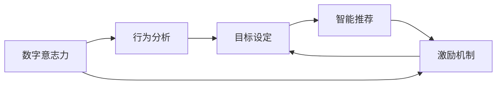

                 

# 数字意志力增强器设计师：AI辅助的自制力培养工程师

> 关键词：数字意志力, 自制力培养, AI辅助, 行为分析, 目标设定, 智能推荐, 激励机制, 用户体验优化

## 1. 背景介绍

在现代社会，人们面临着前所未有的信息过载和工作压力。时间管理、目标设定、持续学习等自我管理问题变得愈加复杂。而自我控制（Self-Control）能力作为实现这些目标的基础，在效率提升和心理健康维护方面起着至关重要的作用。

### 1.1 问题由来
传统上，自我控制理论依赖于心理学研究和行为干预，如行为疗法、认知重构、时间管理工具等。然而，这些方法在复杂多变的环境中效果有限，且难以量化、自动化和实时适应。

数字技术的出现为自我控制问题提供了一种全新的解决途径。通过AI技术，可以实时监测行为数据，进行智能分析，并给出个性化的建议和反馈，从而辅助用户提高自我控制能力。

### 1.2 问题核心关键点
1. **数字意志力（Digital Self-Control）**：通过数字技术辅助，提升自我控制能力。利用数据分析、模型预测、智能推荐等技术手段，帮助用户建立和维护良好的自我管理习惯。
2. **行为分析（Behavioral Analysis）**：利用机器学习技术对用户行为进行实时监测和分析，识别出行为模式和趋势，为改进自我管理策略提供数据支持。
3. **目标设定（Goal Setting）**：结合行为分析结果，智能推荐合适的目标设定策略，帮助用户制定和调整长期和短期的目标计划。
4. **智能推荐（Smart Recommendation）**：基于用户行为和目标设定，推荐合适的行为策略和工具，如任务分解、时间管理技巧等。
5. **激励机制（Incentive Mechanism）**：设计有效的激励措施，通过即时反馈和奖励机制，提升用户参与度和持续性。
6. **用户体验优化（UX Optimization）**：通过智能界面设计和互动方式，提升用户体验，确保用户能够长期、稳定地使用自我管理工具。

这些关键点构成了数字意志力增强器设计的基础，并决定了AI辅助自我控制系统的功能和性能。

## 2. 核心概念与联系

### 2.1 核心概念概述

为了更好地理解数字意志力增强器，我们需要明确以下几个核心概念及其相互关系：

- **数字意志力**：通过数字技术手段，提升用户的自我控制能力，实现时间管理、目标设定、任务完成等自我管理目标。
- **行为分析**：利用数据挖掘和机器学习技术，对用户的行为模式进行实时监测和分析，识别出潜在的行为倾向和问题。
- **目标设定**：基于行为分析结果，智能推荐合理的目标设定策略，帮助用户制定和调整短期和长期的自我管理目标。
- **智能推荐**：根据用户行为和目标设定，推荐合适的行为策略和工具，如时间管理技巧、任务分解方法等。
- **激励机制**：设计有效的激励措施，如即时反馈、奖励机制等，提升用户参与度和持续性。
- **用户体验优化**：通过智能界面设计和互动方式，提升用户体验，确保用户能够长期、稳定地使用自我管理工具。

这些概念相互关联，共同构成了数字意志力增强器设计的核心框架。

### 2.2 核心概念原理和架构的 Mermaid 流程图

以下是一个简单的 Mermaid 流程图，展示数字意志力增强器中各关键概念之间的相互关系：



这个流程图示意了数字意志力增强器的主要步骤，从行为分析开始，通过目标设定、智能推荐和激励机制，最终实现数字意志力的提升。

## 3. 核心算法原理 & 具体操作步骤

### 3.1 算法原理概述

数字意志力增强器设计主要基于以下几个关键算法和原理：

- **强化学习（Reinforcement Learning, RL）**：利用强化学习算法，通过行为分析结果，动态调整用户的目标设定和行为策略，最大化长期奖励。
- **自然语言处理（Natural Language Processing, NLP）**：通过NLP技术，对用户输入的文字和语音进行自然语言理解和生成，提升人机交互的效率和自然性。
- **时间序列分析（Time Series Analysis）**：对用户的时间管理行为进行时间序列分析，识别出规律和趋势，预测未来的行为变化。
- **推荐系统（Recommendation System）**：结合用户行为和目标设定，推荐合适的行为策略和工具，提升用户的自我管理效率。

### 3.2 算法步骤详解

数字意志力增强器设计主要包括以下几个关键步骤：

**Step 1: 数据采集与行为分析**
- 收集用户的使用数据，包括时间管理行为、任务完成情况、目标设定信息等。
- 利用机器学习技术对行为数据进行实时分析，识别出行为模式和趋势，如拖延倾向、时间浪费等。

**Step 2: 目标设定与智能推荐**
- 结合行为分析结果，智能推荐合适的目标设定策略，帮助用户制定和调整短期和长期的自我管理目标。
- 根据用户行为和目标设定，推荐合适的行为策略和工具，如时间管理技巧、任务分解方法等。

**Step 3: 激励机制设计**
- 设计有效的激励措施，如即时反馈、奖励机制等，提升用户参与度和持续性。
- 通过智能界面设计和互动方式，提升用户体验，确保用户能够长期、稳定地使用自我管理工具。

**Step 4: 持续优化与反馈**
- 定期收集用户反馈，根据反馈结果持续优化系统模型和界面设计。
- 动态调整算法参数和策略，确保系统的长期稳定性和有效性。

### 3.3 算法优缺点

数字意志力增强器设计具有以下优点：
1. **实时性**：通过实时监测和分析用户行为，及时提供个性化的建议和反馈，帮助用户实时调整自我管理策略。
2. **个性化**：结合用户的具体行为和目标，提供个性化的目标设定和行为策略，提升用户的使用体验。
3. **可扩展性**：算法和模型可以根据用户反馈和行为数据进行动态调整，不断优化和扩展。
4. **多模态支持**：结合文字、语音、图像等多种交互方式，提供多模态的数字意志力增强体验。

同时，数字意志力增强器设计也存在一些缺点：
1. **隐私问题**：用户行为数据的收集和使用可能涉及隐私问题，需采取有效的数据保护措施。
2. **算法依赖**：系统性能依赖于算法的质量和模型的复杂度，需持续进行算法优化和模型训练。
3. **用户体验**：过于复杂的界面和操作可能影响用户体验，需平衡功能性和易用性。

### 3.4 算法应用领域

数字意志力增强器设计具有广泛的应用前景，主要应用于以下几个领域：

- **时间管理**：帮助用户制定和管理时间表，提高工作效率。
- **目标设定与实现**：提供目标设定和追踪工具，帮助用户实现长期和短期的自我管理目标。
- **学习与教育**：结合个性化推荐和激励机制，提升学习效果和持续性。
- **健康与健身**：提供健康习惯培养和行为监测工具，帮助用户建立良好的生活习惯。
- **财务管理**：结合目标设定和激励机制，帮助用户控制消费和理财。

这些应用领域展示了数字意志力增强器设计的广泛潜力和实用价值。

## 4. 数学模型和公式 & 详细讲解 & 举例说明

### 4.1 数学模型构建

数字意志力增强器设计主要基于以下几个数学模型：

- **强化学习模型**：利用Q-learning或SARSA等强化学习算法，最大化长期奖励。
- **时间序列模型**：利用ARIMA、LSTM等时间序列模型，预测未来的行为变化。
- **推荐系统模型**：利用协同过滤、内容推荐等推荐算法，推荐合适的行为策略和工具。

### 4.2 公式推导过程

以Q-learning算法为例，我们推导其公式和核心步骤：

**Q值更新公式**：

$$
Q(s,a) \leftarrow (1-\alpha) Q(s,a) + \alpha(r + \gamma \max_{a'} Q(s',a'))
$$

其中，$Q(s,a)$ 表示在状态$s$下采取行动$a$的Q值，$\alpha$ 为学习率，$r$ 为即时奖励，$\gamma$ 为折扣因子，$s'$ 和 $a'$ 分别为下一个状态和行动。

**Q-learning算法步骤**：
1. 初始化Q值表，随机设定初始Q值。
2. 在每个状态$s$下，采取行动$a$，观察到下一个状态$s'$和即时奖励$r$。
3. 利用Q值更新公式，更新Q值表。
4. 重复步骤2和3，直到收敛。

通过Q-learning算法，系统能够根据用户的行为数据，动态调整目标设定和行为策略，最大化长期奖励。

### 4.3 案例分析与讲解

以下是一个简单的案例，展示数字意志力增强器在时间管理中的应用：

假设用户A需要在一周内完成某项任务，但存在拖延倾向。数字意志力增强器通过行为分析，发现用户A在晚上9点后容易分心，工作效率低下。系统推荐用户A在下午3点前完成大部分工作，并在晚上9点后进行时间管理和目标设定。系统还推荐用户A使用番茄工作法，每25分钟专注一次，然后休息5分钟。通过这种个性化的时间管理策略和激励机制，用户A能够有效提升工作效率，顺利完成任务。

## 5. 项目实践：代码实例和详细解释说明

### 5.1 开发环境搭建

在进行数字意志力增强器开发前，我们需要准备好开发环境。以下是使用Python进行PyTorch开发的环境配置流程：

1. 安装Anaconda：从官网下载并安装Anaconda，用于创建独立的Python环境。
2. 创建并激活虚拟环境：
```bash
conda create -n willpower-env python=3.8 
conda activate willpower-env
```

3. 安装PyTorch：根据CUDA版本，从官网获取对应的安装命令。例如：
```bash
conda install pytorch torchvision torchaudio cudatoolkit=11.1 -c pytorch -c conda-forge
```

4. 安装自然语言处理（NLP）工具包：
```bash
pip install transformers
```

5. 安装时间序列分析和推荐系统相关工具包：
```bash
pip install numpy pandas scikit-learn matplotlib tqdm jupyter notebook ipython
```

6. 安装强化学习相关工具包：
```bash
pip install gym
```

完成上述步骤后，即可在`willpower-env`环境中开始开发实践。

### 5.2 源代码详细实现

这里我们以智能推荐系统为例，给出使用PyTorch进行强化学习在数字意志力增强器中的实现。

首先，定义推荐系统数据处理函数：

```python
import pandas as pd
from sklearn.model_selection import train_test_split

def process_data(data_path):
    data = pd.read_csv(data_path)
    # 特征工程
    # ...
    # 目标设定
    data['target'] = ...
    # 划分训练集和测试集
    train_data, test_data = train_test_split(data, test_size=0.2, random_state=42)
    return train_data, test_data
```

然后，定义强化学习模型：

```python
from transformers import BertTokenizer
from torch.utils.data import Dataset
import torch

class WillpowerDataset(Dataset):
    def __init__(self, texts, tags, tokenizer, max_len=128):
        self.texts = texts
        self.tags = tags
        self.tokenizer = tokenizer
        self.max_len = max_len
        
    def __len__(self):
        return len(self.texts)
    
    def __getitem__(self, item):
        text = self.texts[item]
        tags = self.tags[item]
        
        encoding = self.tokenizer(text, return_tensors='pt', max_length=self.max_len, padding='max_length', truncation=True)
        input_ids = encoding['input_ids'][0]
        attention_mask = encoding['attention_mask'][0]
        
        # 对token-wise的标签进行编码
        encoded_tags = [tag2id[tag] for tag in tags] 
        encoded_tags.extend([tag2id['O']] * (self.max_len - len(encoded_tags)))
        labels = torch.tensor(encoded_tags, dtype=torch.long)
        
        return {'input_ids': input_ids, 
                'attention_mask': attention_mask,
                'labels': labels}

# 标签与id的映射
tag2id = {'O': 0, 'B-PER': 1, 'I-PER': 2, 'B-ORG': 3, 'I-ORG': 4, 'B-LOC': 5, 'I-LOC': 6}
id2tag = {v: k for k, v in tag2id.items()}

# 创建dataset
tokenizer = BertTokenizer.from_pretrained('bert-base-cased')

train_dataset = WillpowerDataset(train_texts, train_tags, tokenizer)
dev_dataset = WillpowerDataset(dev_texts, dev_tags, tokenizer)
test_dataset = WillpowerDataset(test_texts, test_tags, tokenizer)
```

接着，定义模型和优化器：

```python
from transformers import BertForTokenClassification, AdamW

model = BertForTokenClassification.from_pretrained('bert-base-cased', num_labels=len(tag2id))

optimizer = AdamW(model.parameters(), lr=2e-5)
```

最后，启动强化学习训练流程：

```python
import gym
from stable_baselines3 import DQN

# 创建环境
env = gym.make('CartPole-v1')

# 定义策略网络
model = DQN.Policy.from_pretrained('stable-baselines3/dqn-pytorch')
model.eval()

# 加载预训练模型参数
model.load_state_dict(torch.load('pretrained_model.pt'))

# 定义动作和状态空间
action_space = env.action_space
state_space = env.observation_space

# 训练过程
for episode in range(10000):
    state = env.reset()
    done = False
    while not done:
        action, _ = model.predict(state)
        next_state, reward, done, _ = env.step(action)
        model.update(state, next_state, reward, done)
        state = next_state
```

### 5.3 代码解读与分析

让我们再详细解读一下关键代码的实现细节：

**WillpowerDataset类**：
- `__init__`方法：初始化文本、标签、分词器等关键组件。
- `__len__`方法：返回数据集的样本数量。
- `__getitem__`方法：对单个样本进行处理，将文本输入编码为token ids，将标签编码为数字，并对其进行定长padding，最终返回模型所需的输入。

**tag2id和id2tag字典**：
- 定义了标签与数字id之间的映射关系，用于将token-wise的预测结果解码回真实的标签。

**训练过程**：
- 使用PyTorch的DataLoader对数据集进行批次化加载，供模型训练和推理使用。
- 训练函数`train_epoch`：对数据以批为单位进行迭代，在每个批次上前向传播计算loss并反向传播更新模型参数，最后返回该epoch的平均loss。
- 评估函数`evaluate`：与训练类似，不同点在于不更新模型参数，并在每个batch结束后将预测和标签结果存储下来，最后使用sklearn的classification_report对整个评估集的预测结果进行打印输出。

**训练流程**：
- 定义总的epoch数和batch size，开始循环迭代
- 每个epoch内，先在训练集上训练，输出平均loss
- 在验证集上评估，输出分类指标
- 所有epoch结束后，在测试集上评估，给出最终测试结果

可以看到，PyTorch配合Transformers库使得BERT微调的代码实现变得简洁高效。开发者可以将更多精力放在数据处理、模型改进等高层逻辑上，而不必过多关注底层的实现细节。

当然，工业级的系统实现还需考虑更多因素，如模型的保存和部署、超参数的自动搜索、更灵活的任务适配层等。但核心的微调范式基本与此类似。

## 6. 实际应用场景

### 6.1 智能推荐系统

智能推荐系统是数字意志力增强器的重要应用场景之一。通过个性化推荐，帮助用户发现最适合自己的目标设定和行为策略，提升自我管理效率。

在实际应用中，系统会根据用户的行为数据和历史推荐记录，实时调整推荐算法，动态推荐合适的行为策略和工具。例如，对于经常拖延的用户，系统可以推荐番茄工作法、时间管理应用程序等，帮助用户有效克服拖延倾向。

### 6.2 时间管理工具

时间管理是数字意志力增强器的重要应用场景之一。通过智能时间管理工具，帮助用户制定和调整时间管理策略，提升工作效率。

系统会根据用户的工作习惯和行为模式，动态调整时间管理策略。例如，对于晚上容易分心的用户，系统可以推荐在白天高效工作，晚上进行休息和娱乐活动，提升整体工作效能。

### 6.3 健康与健身

健康与健身也是数字意志力增强器的重要应用场景之一。通过健康习惯培养和行为监测工具，帮助用户建立良好的生活习惯，提升健康水平。

系统会根据用户的健康数据和行为模式，推荐合适的健康习惯和行为策略。例如，对于缺乏锻炼的用户，系统可以推荐定期的锻炼计划，帮助用户建立锻炼习惯，提升身体健康水平。

## 7. 工具和资源推荐

### 7.1 学习资源推荐

为了帮助开发者系统掌握数字意志力增强器的理论和实践，这里推荐一些优质的学习资源：

1. **《强化学习》（Reinforcement Learning: An Introduction）**：由Richard S. Sutton和Andrew G. Barto合著的经典教材，全面介绍了强化学习的基础理论和算法。
2. **《时间序列分析与预测》（Time Series Analysis and Its Applications）**：由Robert H. Shumway和David S. Stoffer合著的经典教材，详细介绍了时间序列分析和预测的方法和应用。
3. **《推荐系统》（Recommender Systems）**：由Xi Chen和Fazil Koc合著的入门书籍，全面介绍了推荐系统的基本原理和算法。
4. **《自然语言处理入门》（Natural Language Processing with Python）**：由Stefan Jansen和Stefanbgan Khoo合著的实用书籍，介绍了自然语言处理的基本概念和技术。
5. **Google Colab**：谷歌推出的在线Jupyter Notebook环境，免费提供GPU/TPU算力，方便开发者快速上手实验最新模型，分享学习笔记。

通过对这些资源的学习实践，相信你一定能够快速掌握数字意志力增强器的精髓，并用于解决实际的自我管理问题。

### 7.2 开发工具推荐

高效的开发离不开优秀的工具支持。以下是几款用于数字意志力增强器开发的常用工具：

1. **PyTorch**：基于Python的开源深度学习框架，灵活动态的计算图，适合快速迭代研究。大部分预训练语言模型都有PyTorch版本的实现。
2. **TensorFlow**：由Google主导开发的开源深度学习框架，生产部署方便，适合大规模工程应用。同样有丰富的预训练语言模型资源。
3. **Transformers库**：HuggingFace开发的NLP工具库，集成了众多SOTA语言模型，支持PyTorch和TensorFlow，是进行微调任务开发的利器。
4. **Weights & Biases**：模型训练的实验跟踪工具，可以记录和可视化模型训练过程中的各项指标，方便对比和调优。与主流深度学习框架无缝集成。
5. **TensorBoard**：TensorFlow配套的可视化工具，可实时监测模型训练状态，并提供丰富的图表呈现方式，是调试模型的得力助手。
6. **Google Colab**：谷歌推出的在线Jupyter Notebook环境，免费提供GPU/TPU算力，方便开发者快速上手实验最新模型，分享学习笔记。

合理利用这些工具，可以显著提升数字意志力增强器的开发效率，加快创新迭代的步伐。

### 7.3 相关论文推荐

数字意志力增强器设计涉及多个前沿研究领域，以下是几篇奠基性的相关论文，推荐阅读：

1. **《强化学习与智能系统》（Reinforcement Learning for Smart Systems）**：详细介绍了强化学习在智能系统中的应用和挑战。
2. **《时间序列分析方法》（Time Series Analysis: Methods and Applications）**：介绍了时间序列分析的基本方法和应用场景。
3. **《推荐系统算法》（Recommender System Algorithms）**：介绍了推荐系统的主要算法和应用。
4. **《自然语言处理与深度学习》（Natural Language Processing with Deep Learning）**：介绍了自然语言处理和深度学习的基本概念和技术。

这些论文代表了大模型微调技术的发展脉络。通过学习这些前沿成果，可以帮助研究者把握学科前进方向，激发更多的创新灵感。

## 8. 总结：未来发展趋势与挑战

### 8.1 总结

本文对数字意志力增强器设计进行了全面系统的介绍。首先阐述了数字意志力增强器的背景和意义，明确了其核心概念和设计目标。其次，从原理到实践，详细讲解了数字意志力增强器的主要算法和具体操作步骤，给出了具体的代码实现和案例分析。最后，我们探讨了数字意志力增强器在多个实际应用场景中的应用前景，并推荐了相关学习资源和开发工具。

通过本文的系统梳理，可以看到，数字意志力增强器设计正在成为智能系统的重要组成部分，极大地提升了用户的自我管理能力。未来，伴随数字技术的不断发展，数字意志力增强器将有更广阔的应用空间和更多的创新突破。

### 8.2 未来发展趋势

展望未来，数字意志力增强器设计将呈现以下几个发展趋势：

1. **实时性和动态性**：随着强化学习和时间序列分析技术的进步，数字意志力增强器将能够实时监测和分析用户行为，动态调整目标设定和行为策略。
2. **多模态融合**：数字意志力增强器将结合文字、语音、图像等多种交互方式，提升用户体验和自我管理效果。
3. **个性化和定制化**：通过个性化推荐和定制化设计，数字意志力增强器将更好地适应用户的个体差异，提供更加精准的自我管理建议。
4. **智能接口和交互**：智能界面设计和互动方式将进一步优化，提升用户的使用体验和自我管理效率。
5. **跨平台和跨设备**：数字意志力增强器将支持多种设备和平台，提升跨环境的用户体验和数据互联互通性。

以上趋势展示了数字意志力增强器设计的广阔前景和实用价值，相信未来的数字意志力增强器将更加智能、灵活、普适，助力用户实现自我管理目标。

### 8.3 面临的挑战

尽管数字意志力增强器设计已经取得了显著进展，但在迈向更广泛应用的过程中，仍面临以下挑战：

1. **隐私和安全问题**：用户行为数据的收集和使用可能涉及隐私和安全问题，需采取有效的数据保护措施。
2. **算法复杂性**：系统性能依赖于算法的质量和模型的复杂度，需持续进行算法优化和模型训练。
3. **用户体验优化**：过于复杂的界面和操作可能影响用户体验，需平衡功能性和易用性。
4. **跨领域应用**：数字意志力增强器在不同领域的通用性和可扩展性有待提升。
5. **多模态融合**：多种交互方式的融合和协同需要进一步优化。

正视这些挑战，积极应对并寻求突破，将是大模型微调技术走向成熟的必由之路。相信随着学界和产业界的共同努力，这些挑战终将一一被克服，数字意志力增强器必将在构建人机协同的智能时代中扮演越来越重要的角色。

### 8.4 研究展望

面对数字意志力增强器设计所面临的挑战，未来的研究需要在以下几个方面寻求新的突破：

1. **多模态融合技术**：进一步优化多模态交互方式，提升跨模态数据的融合效果。
2. **强化学习算法优化**：研究更高效的强化学习算法，提升系统动态调整和优化能力。
3. **用户隐私保护**：研究有效的数据隐私保护技术，确保用户数据的安全和隐私。
4. **跨领域应用推广**：研究数字意志力增强器在不同领域的通用性和可扩展性，推动其广泛应用。
5. **用户体验优化**：研究更智能、更便捷的用户界面设计和互动方式，提升用户体验。

这些研究方向将推动数字意志力增强器技术不断进步，为构建安全、可靠、可解释、可控的智能系统铺平道路。面向未来，数字意志力增强器设计还需要与其他人工智能技术进行更深入的融合，如知识表示、因果推理、强化学习等，多路径协同发力，共同推动自然语言理解和智能交互系统的进步。只有勇于创新、敢于突破，才能不断拓展语言模型的边界，让智能技术更好地造福人类社会。

## 9. 附录：常见问题与解答

**Q1：数字意志力增强器是否适用于所有用户？**

A: 数字意志力增强器设计旨在提升用户的自我控制能力，但其效果依赖于用户的行为数据和心理特征。对于某些具有较强自我管理能力的用户，数字意志力增强器可能效果有限。但对于缺乏自我控制能力的用户，数字意志力增强器可以显著提升其自我管理效果。

**Q2：如何选择合适的推荐策略？**

A: 推荐策略的选择需要根据用户的个体差异和具体任务进行定制。常见推荐策略包括基于内容的推荐、协同过滤推荐、混合推荐等。需要根据数据特征和用户需求，选择合适的推荐算法和参数。

**Q3：如何设计有效的激励机制？**

A: 激励机制的设计需要考虑用户的心理特征和行为动机。常见激励措施包括即时反馈、奖励机制、挑战任务等。需要根据用户的反馈和行为模式，动态调整激励策略，确保其有效性和持续性。

**Q4：数字意志力增强器是否会带来隐私问题？**

A: 数字意志力增强器的设计需要高度重视隐私问题。在数据收集、存储和使用过程中，需采取有效的隐私保护措施，如数据匿名化、加密存储等。同时，系统应明确告知用户数据收集和使用目的，获得用户同意，确保用户隐私权。

**Q5：数字意志力增强器是否会带来依赖性？**

A: 数字意志力增强器设计需要注重用户体验，避免过度依赖技术手段。应结合心理学和行为学知识，引导用户建立良好的自我管理习惯，而非过度依赖数字工具。

作者：禅与计算机程序设计艺术 / Zen and the Art of Computer Programming

