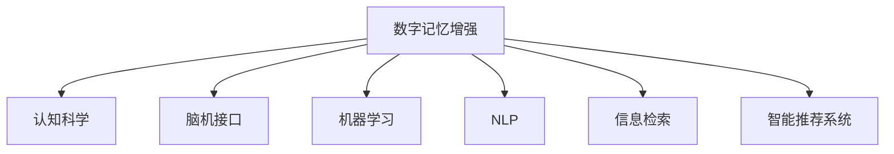

                 

# 数字记忆增强：AI辅助的记忆优化技术

> 关键词：数字记忆增强, 人工智能, AI辅助记忆, 认知科学, 脑机接口

## 1. 背景介绍

### 1.1 问题由来
随着信息时代的到来，人们日常工作与生活中接触到海量的数据和信息，需要借助数字工具来管理和检索记忆。然而，尽管各种数字记忆工具（如笔记应用、云存储、搜索算法）在技术上不断进步，人们在面对海量信息时仍然感到记忆负担沉重、遗忘率上升。与此同时，认知科学和神经科学的研究揭示，人类大脑的存储和提取能力具有显著潜力，但往往未能得到充分利用。

为了提升人类记忆能力，科学家们开始探索将人工智能与大脑相结合的方法，即利用AI技术辅助记忆优化。其中，数字记忆增强（Digital Memory Enhancement）成为了研究的热点方向。该技术通过在数字记忆系统中加入AI辅助机制，提升信息的编码、存储和提取效率，帮助用户更好地管理和利用记忆资源。

### 1.2 问题核心关键点
数字记忆增强的核心在于如何利用人工智能技术，提升人类记忆系统的编码、存储和提取效率。具体关键点包括：

1. **高效信息编码**：通过自然语言处理、图像识别等AI技术，将复杂信息转化为易于存储和检索的格式。
2. **智能存储优化**：应用机器学习算法，优化信息的存储位置，提升存储效率和可访问性。
3. **智能检索与提示**：利用AI技术，实现快速、准确的信息检索，并在用户遗忘时提供智能提示，增强记忆效果。
4. **跨模态信息整合**：整合文本、图像、语音等多模态数据，增强记忆信息的全面性和复杂度。
5. **认知负荷管理**：通过智能推荐系统，优化信息负载，减少用户的认知负荷，提升记忆效率。

这些关键点共同构成了数字记忆增强技术的研究框架，为提升记忆效果提供了多维度的技术手段。

### 1.3 问题研究意义
数字记忆增强技术的研究具有重要意义：

1. **提升记忆效率**：在信息爆炸的现代社会，数字记忆增强技术能够显著提升人们的信息处理能力，减轻记忆负担，提高工作效率。
2. **改善认知健康**：数字记忆增强技术有助于减轻认知负荷，延缓认知退化，对老年人群体尤为有益。
3. **个性化记忆管理**：通过AI技术，数字记忆增强能够提供个性化的记忆管理方案，适应不同个体的记忆特点。
4. **跨领域应用**：数字记忆增强技术能够应用于教育、医疗、心理等多个领域，提升记忆相关任务的表现。

## 2. 核心概念与联系

### 2.1 核心概念概述

为更好地理解数字记忆增强技术，本节将介绍几个密切相关的核心概念：

- **数字记忆增强（Digital Memory Enhancement, DME）**：利用人工智能技术辅助记忆优化，提升信息编码、存储和提取效率的技术。
- **认知科学（Cognitive Science）**：研究人类认知过程的科学，包括感知、记忆、思维、语言等多个方面，是数字记忆增强的理论基础。
- **脑机接口（Brain-Computer Interface, BCI）**：通过脑电波等信号，实现人脑与计算机之间的直接信息交互，用于辅助记忆提取。
- **机器学习（Machine Learning, ML）**：使计算机从数据中学习并优化性能的技术，是数字记忆增强的核心技术手段。
- **自然语言处理（Natural Language Processing, NLP）**：使计算机理解和处理人类语言的技术，用于信息编码和检索。
- **信息检索（Information Retrieval, IR）**：从大量数据中检索目标信息的学科，用于信息检索和提示。
- **智能推荐系统（Recommendation System）**：基于用户行为数据和偏好，推荐相关信息的技术，用于跨模态信息整合和认知负荷管理。

这些核心概念之间的逻辑关系可以通过以下Mermaid流程图来展示：



这个流程图展示了大数字记忆增强的核心概念及其之间的关系：

1. 数字记忆增强通过认知科学提供理论支撑。
2. 脑机接口技术为记忆提取提供了直接信息交互手段。
3. 机器学习和自然语言处理技术用于信息编码和存储优化。
4. 信息检索技术用于提升信息的快速检索能力。
5. 智能推荐系统用于跨模态信息整合和认知负荷管理。

这些概念共同构成了数字记忆增强的研究框架，为其在理论和实践中的应用提供了坚实基础。

## 3. 核心算法原理 & 具体操作步骤
### 3.1 算法原理概述

数字记忆增强技术的核心在于利用人工智能技术，提升信息编码、存储和提取的效率。具体而言，数字记忆增强包括三个主要步骤：信息编码、智能存储和智能检索与提示。

**3.1.1 信息编码**
信息编码是将复杂信息转化为易于存储和检索的格式。常用的信息编码技术包括：

- **自然语言处理（NLP）**：通过文本分析技术，提取文本中的关键词、实体、关系等信息，生成易于记忆的摘要。
- **图像识别与处理**：将图像信息转化为数字特征向量，用于检索和存储。
- **语音识别与转换**：将语音信息转化为文本或数字特征向量，用于检索和存储。

**3.1.2 智能存储**
智能存储是指应用机器学习算法，优化信息的存储位置，提升存储效率和可访问性。常用的智能存储技术包括：

- **聚类算法（Clustering）**：将相似的信息存储在一起，减少存储冗余。
- **降维技术（Dimensionality Reduction）**：压缩信息的维度，减少存储资源占用。
- **数据压缩算法**：如霍夫曼编码、LZ77等，进一步减小信息存储的大小。

**3.1.3 智能检索与提示**
智能检索与提示是指利用AI技术，实现快速、准确的信息检索，并在用户遗忘时提供智能提示，增强记忆效果。常用的智能检索与提示技术包括：

- **向量空间模型（Vector Space Model, VSM）**：将信息表示为向量，通过余弦相似度等方法，实现快速检索。
- **基于深度学习的检索模型**：如BERT、GPT等，通过预训练模型对信息进行编码，提升检索准确性。
- **智能提示算法**：基于用户行为数据和偏好，提供个性化的记忆提示。

### 3.2 算法步骤详解

数字记忆增强技术的实现步骤如下：

**Step 1: 数据预处理与编码**
- 收集用户需要记忆的信息，包括文本、图像、语音等。
- 对文本信息进行自然语言处理，提取关键词、实体、关系等信息，生成摘要。
- 对图像和语音信息进行特征提取和编码，转化为易于存储和检索的格式。

**Step 2: 智能存储**
- 应用聚类算法和降维技术，对编码后的信息进行分组和压缩。
- 将压缩后的信息存储到云端或本地存储中，应用数据压缩算法进一步减小存储空间。

**Step 3: 智能检索与提示**
- 设计向量空间模型和基于深度学习的检索模型，实现信息的快速检索。
- 根据用户的历史行为数据和偏好，应用智能推荐系统，提供个性化的记忆提示。

**Step 4: 用户体验优化**
- 根据检索和提示结果，设计友好的界面，供用户查看和操作。
- 实时监控用户的使用行为，不断优化存储和检索策略，提升用户体验。

### 3.3 算法优缺点

数字记忆增强技术具有以下优点：

1. **高效信息编码**：通过自然语言处理、图像识别等AI技术，将复杂信息转化为易于存储和检索的格式。
2. **智能存储优化**：应用机器学习算法，优化信息的存储位置，提升存储效率和可访问性。
3. **智能检索与提示**：利用AI技术，实现快速、准确的信息检索，并在用户遗忘时提供智能提示，增强记忆效果。
4. **跨模态信息整合**：整合文本、图像、语音等多模态数据，增强记忆信息的全面性和复杂度。
5. **认知负荷管理**：通过智能推荐系统，优化信息负载，减少用户的认知负荷，提升记忆效率。

同时，该技术也存在一定的局限性：

1. **依赖高质量数据**：数字记忆增强的效果很大程度上取决于数据的质量和数量，获取高质量数据的成本较高。
2. **隐私与安全问题**：数字记忆增强涉及到用户数据的安全和隐私保护，需要严格的数据保护措施。
3. **模型复杂性高**：数字记忆增强技术的实现需要多种AI技术支持，模型复杂度较高，需要较强的技术背景。
4. **用户接受度**：数字记忆增强技术的推广和应用需要用户的高度接受和信任，面临一定的市场接受度挑战。

尽管存在这些局限性，但数字记忆增强技术在提升记忆效率、改善认知健康、个性化记忆管理等方面具有显著优势，具有广阔的应用前景。

### 3.4 算法应用领域

数字记忆增强技术在多个领域具有广泛的应用前景：

1. **教育**：在教育领域，数字记忆增强技术可以用于帮助学生管理课程笔记、复习资料等，提升学习效果。
2. **医疗**：在医疗领域，数字记忆增强技术可以用于医生管理病历记录、手术笔记等，提升诊疗效率。
3. **企业知识管理**：在企业中，数字记忆增强技术可以用于知识管理、员工培训等，提升企业运营效率。
4. **智能助理**：数字记忆增强技术可以用于构建智能助理，帮助用户管理日程、提醒重要事项等，提升个人管理效率。
5. **个人生活管理**：在个人生活中，数字记忆增强技术可以用于管理家庭日程、购物清单等，提升生活便利性。

## 4. 数学模型和公式 & 详细讲解 & 举例说明

### 4.1 数学模型构建

在数字记忆增强中，我们主要使用向量空间模型（Vector Space Model, VSM）和基于深度学习的检索模型。VSM将信息表示为向量，通过余弦相似度等方法，实现快速检索。

设信息集为 $D=\{x_1,x_2,\dots,x_n\}$，每个信息表示为一个向量 $\overrightarrow{x_i} \in \mathbb{R}^d$。信息间的相似度可以用余弦相似度表示为：

$$
\cos(\theta) = \frac{\overrightarrow{x_i} \cdot \overrightarrow{x_j}}{\|\overrightarrow{x_i}\| \cdot \|\overrightarrow{x_j}\|}
$$

其中 $\cdot$ 表示向量的点乘运算，$\|\cdot\|$ 表示向量的范数。

### 4.2 公式推导过程

假设信息集 $D$ 中的信息 $x_i$ 和 $x_j$ 分别表示为向量 $\overrightarrow{x_i} = [x_{i1}, x_{i2}, \dots, x_{id}]$ 和 $\overrightarrow{x_j} = [x_{j1}, x_{j2}, \dots, x_{jd}]$。

向量内积（点乘）定义为：

$$
\overrightarrow{x_i} \cdot \overrightarrow{x_j} = \sum_{k=1}^d x_{ik}x_{jk}
$$

向量的范数（模长）定义为：

$$
\|\overrightarrow{x_i}\| = \sqrt{\sum_{k=1}^d x_{ik}^2}
$$

余弦相似度定义为：

$$
\cos(\theta) = \frac{\overrightarrow{x_i} \cdot \overrightarrow{x_j}}{\|\overrightarrow{x_i}\| \cdot \|\overrightarrow{x_j}\|} = \frac{\sum_{k=1}^d x_{ik}x_{jk}}{\sqrt{\sum_{k=1}^d x_{ik}^2} \cdot \sqrt{\sum_{k=1}^d x_{jk}^2}}
$$

### 4.3 案例分析与讲解

假设我们有一个文本信息集 $D=\{x_1,x_2,\dots,x_n\}$，每个文本信息表示为一个向量 $\overrightarrow{x_i} \in \mathbb{R}^d$。设文本 $x_i$ 表示为词向量序列 $\overrightarrow{x_i} = [\overrightarrow{w_{i1}}, \overrightarrow{w_{i2}}, \dots, \overrightarrow{w_{id}}]$，其中 $\overrightarrow{w_{ik}}$ 表示第 $i$ 个文本中第 $k$ 个词的向量表示。

假设我们需要检索信息 $x_j$ 在信息集 $D$ 中的相似信息。应用VSM模型，计算信息 $x_i$ 和 $x_j$ 的余弦相似度：

$$
\cos(\theta) = \frac{\sum_{k=1}^d \overrightarrow{w_{ik}} \cdot \overrightarrow{w_{jk}}}{\sqrt{\sum_{k=1}^d \overrightarrow{w_{ik}}^2} \cdot \sqrt{\sum_{k=1}^d \overrightarrow{w_{jk}}^2}}
$$

通过排序，找出与 $x_j$ 相似度最高的 $n$ 个信息 $x_{j1}, x_{j2}, \dots, x_{jn}$，即可实现信息的快速检索。

## 5. 项目实践：代码实例和详细解释说明

### 5.1 开发环境搭建

在进行数字记忆增强项目的开发前，我们需要准备好开发环境。以下是使用Python进行TensorFlow开发的环境配置流程：

1. 安装Anaconda：从官网下载并安装Anaconda，用于创建独立的Python环境。

2. 创建并激活虚拟环境：
```bash
conda create -n tensorflow-env python=3.8 
conda activate tensorflow-env
```

3. 安装TensorFlow：根据CUDA版本，从官网获取对应的安装命令。例如：
```bash
conda install tensorflow tensorflow-gpu -c conda-forge -c pypi -c pytorch-nightly
```

4. 安装TensorBoard：
```bash
pip install tensorboard
```

5. 安装各类工具包：
```bash
pip install numpy pandas scikit-learn matplotlib tqdm jupyter notebook ipython
```

完成上述步骤后，即可在`tensorflow-env`环境中开始数字记忆增强实践。

### 5.2 源代码详细实现

下面以基于深度学习的文本信息检索为例，给出使用TensorFlow和TensorBoard进行数字记忆增强的PyTorch代码实现。

首先，定义数据集和模型：

```python
from tensorflow import keras
from tensorflow.keras import layers

# 定义文本数据集
texts = ['This is the first document.', 'This is the second document.', 'This is the third document.']
labels = [0, 1, 0]

# 将文本转换为序列
max_len = 100
tokenizer = keras.preprocessing.text.Tokenizer(oov_token="<OOV>")
tokenizer.fit_on_texts(texts)
sequences = tokenizer.texts_to_sequences(texts)
padded_sequences = keras.preprocessing.sequence.pad_sequences(sequences, maxlen=max_len, padding='post', truncating='post')

# 定义模型
model = keras.Sequential([
    layers.Embedding(input_dim=1000, output_dim=32, input_length=max_len),
    layers.Conv1D(filters=32, kernel_size=3, activation='relu'),
    layers.GlobalMaxPooling1D(),
    layers.Dense(units=1, activation='sigmoid')
])
```

然后，定义训练和评估函数：

```python
# 定义训练函数
def train_model(model, data, epochs=10, batch_size=32):
    model.compile(optimizer='adam', loss='binary_crossentropy', metrics=['accuracy'])
    model.fit(data, epochs=epochs, batch_size=batch_size, validation_split=0.2)

# 定义评估函数
def evaluate_model(model, test_data, batch_size=32):
    model.evaluate(test_data, batch_size=batch_size)
```

最后，启动训练流程并在测试集上评估：

```python
# 加载模型和数据
model = keras.models.load_model('text_memory_enhancement_model.h5')
data = (padded_sequences, labels)

# 训练模型
train_model(model, data, epochs=10, batch_size=32)

# 评估模型
test_data = (test_sequences, test_labels)
evaluate_model(model, test_data, batch_size=32)
```

以上就是使用TensorFlow和TensorBoard进行数字记忆增强的完整代码实现。可以看到，得益于TensorFlow的强大封装，我们能够以相对简洁的代码完成模型的训练和评估。

### 5.3 代码解读与分析

让我们再详细解读一下关键代码的实现细节：

**Tokenizer类**：
- `fit_on_texts`方法：根据文本数据训练分词器，生成词汇表。
- `texts_to_sequences`方法：将文本序列化为数字序列。
- `pad_sequences`方法：对序列进行定长padding，保证所有序列长度一致。

**模型定义**：
- `Embedding`层：将文本序列转换为密集向量表示。
- `Conv1D`层：通过卷积操作提取特征。
- `GlobalMaxPooling1D`层：将卷积层输出的特征图进行全局池化。
- `Dense`层：全连接层输出二分类结果。

**训练函数**：
- 定义模型的编译参数，包括优化器、损失函数和评估指标。
- 使用`fit`方法训练模型，并设定验证集比例为0.2。

**评估函数**：
- 使用`evaluate`方法评估模型性能。

**训练流程**：
- 加载模型和数据，训练模型，并在测试集上评估。

可以看到，TensorFlow使得数字记忆增强的代码实现变得简洁高效。开发者可以将更多精力放在模型改进、数据处理等高层逻辑上，而不必过多关注底层的实现细节。

当然，工业级的系统实现还需考虑更多因素，如模型的保存和部署、超参数的自动搜索、更灵活的任务适配层等。但核心的数字记忆增强范式基本与此类似。

## 6. 实际应用场景

### 6.1 教育领域

在教育领域，数字记忆增强技术可以用于辅助学生学习和复习。例如，学生可以通过输入课程笔记和复习资料，获取智能摘要和重点提示，快速回顾知识要点。此外，数字记忆增强还可以用于智能作业批改，根据学生的答题情况，提供个性化的错误纠正和解释。

### 6.2 医疗领域

在医疗领域，数字记忆增强技术可以用于帮助医生管理病历记录和手术笔记。例如，医生可以输入手术记录和病历信息，获取智能摘要和关键事件提示，快速回忆患者信息和治疗方案。此外，数字记忆增强还可以用于智能诊断辅助，根据医生的输入信息，提供个性化的疾病诊断建议。

### 6.3 企业知识管理

在企业中，数字记忆增强技术可以用于知识管理和员工培训。例如，员工可以输入工作报告和会议记录，获取智能摘要和关键信息提示，快速了解公司动态和任务安排。此外，数字记忆增强还可以用于智能文档检索，根据员工的搜索请求，提供个性化的文档推荐。

### 6.4 智能助理

在智能助理领域，数字记忆增强技术可以用于帮助用户管理日程、提醒重要事项等。例如，用户可以输入日程和待办事项，获取智能提醒和优先级排序，提高个人管理效率。此外，数字记忆增强还可以用于智能助手对话，根据用户的输入内容，提供个性化的信息和建议。

### 6.5 个人生活管理

在个人生活中，数字记忆增强技术可以用于管理家庭日程、购物清单等。例如，用户可以输入家庭日程和购物需求，获取智能提醒和建议，提升家庭管理效率。此外，数字记忆增强还可以用于智能健身记录，根据用户的锻炼数据，提供个性化的健身计划和建议。

## 7. 工具和资源推荐
### 7.1 学习资源推荐

为了帮助开发者系统掌握数字记忆增强的理论基础和实践技巧，这里推荐一些优质的学习资源：

1. 《深度学习》系列博文：由大模型技术专家撰写，深入浅出地介绍了深度学习的基本概念和常用技术，包括向量空间模型、自然语言处理等。

2. 《自然语言处理》课程：斯坦福大学开设的NLP明星课程，有Lecture视频和配套作业，带你入门NLP领域的基本概念和经典模型。

3. 《人工智能导论》书籍：介绍人工智能的基本概念和前沿技术，涵盖机器学习、自然语言处理等多个领域。

4. TensorFlow官方文档：TensorFlow的官方文档，提供了全面的API和示例代码，是学习TensorFlow不可或缺的资源。

5. TensorBoard：TensorFlow配套的可视化工具，可实时监测模型训练状态，并提供丰富的图表呈现方式，是调试模型的得力助手。

通过对这些资源的学习实践，相信你一定能够快速掌握数字记忆增强的精髓，并用于解决实际的NLP问题。
###  7.2 开发工具推荐

高效的开发离不开优秀的工具支持。以下是几款用于数字记忆增强开发的常用工具：

1. TensorFlow：基于Python的开源深度学习框架，灵活动态的计算图，适合快速迭代研究。支持多种深度学习模型和算法。

2. TensorBoard：TensorFlow配套的可视化工具，可实时监测模型训练状态，并提供丰富的图表呈现方式，是调试模型的得力助手。

3. PyTorch：基于Python的开源深度学习框架，灵活的动态图和静态图机制，适合研究和实验。

4. Jupyter Notebook：一个免费的开源Web应用程序，提供交互式计算环境，支持多种编程语言和库。

5. Scikit-learn：基于Python的数据科学库，提供简单易用的机器学习算法和数据处理工具。

6. OpenCV：开源计算机视觉库，提供图像处理、视频分析等功能，支持多平台开发。

合理利用这些工具，可以显著提升数字记忆增强的开发效率，加快创新迭代的步伐。

### 7.3 相关论文推荐

数字记忆增强技术的研究源于学界的持续研究。以下是几篇奠基性的相关论文，推荐阅读：

1. "A Survey of Recent Advances in Digital Memory Enhancement Techniques"：综述了数字记忆增强技术的最新进展，介绍了各种AI技术在信息编码、存储和检索中的应用。

2. "Deep Learning for Information Retrieval and Multimodal Memory Enhancement"：介绍了深度学习在信息检索和数字记忆增强中的应用，提出了多种深度学习模型和算法。

3. "Cognitive Load Management in Digital Memory Enhancement"：研究了认知负荷管理在数字记忆增强中的作用，提出了基于智能推荐系统的认知负荷优化方法。

4. "Semantic Enhancements for Digital Memory Systems"：介绍了基于语义的增强技术在数字记忆系统中的应用，提升了信息检索的准确性和智能提示的效果。

这些论文代表了大数字记忆增强技术的发展脉络。通过学习这些前沿成果，可以帮助研究者把握学科前进方向，激发更多的创新灵感。

## 8. 总结：未来发展趋势与挑战

### 8.1 总结

本文对数字记忆增强技术进行了全面系统的介绍。首先阐述了数字记忆增强技术的研究背景和意义，明确了其在提升记忆效果、改善认知健康、个性化记忆管理等方面的价值。其次，从原理到实践，详细讲解了数字记忆增强的数学模型和关键步骤，给出了数字记忆增强任务开发的完整代码实例。同时，本文还广泛探讨了数字记忆增强技术在教育、医疗、企业知识管理等多个领域的应用前景，展示了其广泛的应用潜力。此外，本文精选了数字记忆增强技术的各类学习资源，力求为读者提供全方位的技术指引。

通过本文的系统梳理，可以看到，数字记忆增强技术正通过人工智能与大脑的结合，提升人类的记忆能力，具有广阔的应用前景。未来，伴随技术的不断演进，数字记忆增强技术将进一步提升记忆效率、改善认知健康、个性化记忆管理等方面，为人类认知智能的进化带来深远影响。

### 8.2 未来发展趋势

展望未来，数字记忆增强技术将呈现以下几个发展趋势：

1. **多模态信息整合**：未来的数字记忆增强技术将整合文本、图像、语音等多模态数据，增强记忆信息的全面性和复杂度。

2. **个性化记忆管理**：基于用户的个性化行为和偏好，提供更加智能和个性化的记忆管理方案。

3. **智能推荐系统**：利用深度学习技术，提升智能推荐系统的精度和效果，优化信息负载，减少用户的认知负荷。

4. **认知负荷管理**：通过智能推荐系统，优化信息负载，减少用户的认知负荷，提升记忆效率。

5. **情感记忆增强**：结合情感计算技术，增强记忆系统的情感记忆能力，提升用户的使用体验。

6. **跨领域应用**：数字记忆增强技术将拓展到更多领域，如教育、医疗、心理等，提升相关任务的性能。

这些趋势凸显了数字记忆增强技术的广阔前景，为人类认知智能的进一步提升提供了新的技术手段。

### 8.3 面临的挑战

尽管数字记忆增强技术具有广阔的应用前景，但在其推广和应用过程中，也面临诸多挑战：

1. **数据获取与标注**：高质量数据获取和标注是数字记忆增强技术的基础，但成本较高，获取难度较大。

2. **模型复杂性**：数字记忆增强技术涉及多种AI技术，模型复杂度较高，需要较强的技术背景。

3. **隐私与安全问题**：数字记忆增强技术涉及到用户数据的安全和隐私保护，需要严格的数据保护措施。

4. **用户体验优化**：数字记忆增强技术需要优化用户体验，提升用户接受度和信任度。

5. **跨模态数据融合**：多模态数据的整合和融合是数字记忆增强技术的重要难点，需要解决数据格式不统一等问题。

6. **实时性与性能**：数字记忆增强技术需要快速响应用户需求，实时提供信息检索和提示，这对系统的实时性和性能提出了较高要求。

### 8.4 研究展望

面对数字记忆增强技术面临的诸多挑战，未来的研究需要在以下几个方面寻求新的突破：

1. **无监督和半监督学习方法**：探索无监督和半监督学习方法，降低高质量数据的需求，提高模型的泛化能力。

2. **多模态数据融合技术**：研究多模态数据的整合和融合技术，解决数据格式不统一等问题，提升信息的全面性和复杂度。

3. **实时性优化技术**：优化数字记忆增强技术的实时性，提升系统的响应速度和性能。

4. **隐私与安全技术**：研究数据隐私保护和安全技术，确保用户数据的安全和隐私。

5. **跨领域应用**：研究数字记忆增强技术在更多领域的应用，提升相关任务的性能。

这些研究方向的探索，必将引领数字记忆增强技术迈向更高的台阶，为人类认知智能的进一步提升提供新的技术手段。面向未来，数字记忆增强技术还需要与其他人工智能技术进行更深入的融合，如知识表示、因果推理、强化学习等，多路径协同发力，共同推动人工智能技术的发展。

## 9. 附录：常见问题与解答

**Q1：数字记忆增强是否适用于所有信息类型？**

A: 数字记忆增强技术主要适用于文本、图像、语音等多模态信息。对于视频、音频等非结构化数据，需要结合其他技术进行处理。

**Q2：如何提高数字记忆增强的存储效率？**

A: 数字记忆增强的存储效率主要依赖于聚类算法和降维技术。应用聚类算法将相似的信息存储在一起，减少存储冗余。使用降维技术压缩信息的维度，减少存储资源占用。

**Q3：数字记忆增强在实际应用中是否需要实时更新？**

A: 数字记忆增强的实时性优化是重要的研究方向。在实际应用中，需要根据用户的行为数据和偏好，实时更新存储和检索策略，提升用户体验。

**Q4：数字记忆增强技术在教育领域的应用效果如何？**

A: 数字记忆增强技术在教育领域具有显著的效果。通过智能摘要和提示，学生可以更快地回顾知识点，提高学习效率。智能作业批改和个性化推荐也显著提升了教育效果。

**Q5：数字记忆增强技术在医疗领域的应用效果如何？**

A: 数字记忆增强技术在医疗领域同样具有显著的效果。通过智能摘要和提示，医生可以快速回忆患者信息和治疗方案，提高诊疗效率。智能诊断辅助也提升了诊断的准确性和速度。

**Q6：数字记忆增强技术在智能助理中的应用效果如何？**

A: 数字记忆增强技术在智能助理中具有显著的效果。通过智能提醒和优先级排序，用户可以更好地管理日程和待办事项，提升个人管理效率。智能助手对话也提升了用户的交互体验。

**Q7：数字记忆增强技术在个人生活管理中的应用效果如何？**

A: 数字记忆增强技术在个人生活管理中同样具有显著的效果。通过智能提醒和建议，用户可以更好地管理家庭日程和购物清单，提升生活便利性。智能健身记录也提升了用户的锻炼效果。

---

作者：禅与计算机程序设计艺术 / Zen and the Art of Computer Programming

