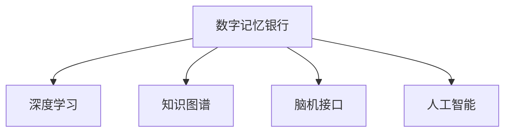

                 

# 数字记忆银行:全球脑时代的知识存储

> 关键词：数字记忆银行, 全球脑时代, 知识存储, 深度学习, 人工智能, 脑机接口

## 1. 背景介绍

### 1.1 问题由来

随着信息时代的到来，人类社会的知识存储方式发生了翻天覆地的变化。传统以纸质书籍、影像资料为主的知识存储方式逐渐被数字化、网络化所取代，知识获取和传播的效率显著提升。然而，这些海量的数字资源同样带来了新的挑战，如数据冗余、搜索困难、易受攻击等问题。

为了解决这些问题，构建一个安全、高效、可扩展的知识存储系统迫在眉睫。特别是在全球脑时代的背景下，知识的创造和传播速度飞速发展，一个能够适应这种变化的知识存储系统，对于推动人类认知的进步和社会的持续发展具有重要的战略意义。

### 1.2 问题核心关键点

面对这些挑战，本文聚焦于数字记忆银行的构建，该系统旨在利用深度学习和人工智能技术，对大规模数字知识进行存储、管理和高效利用。数字记忆银行不仅能够存储海量信息，还具备知识推理、模式识别、数据挖掘等多种智能功能，旨在实现知识的全生命周期管理和智能增值。

核心关键点包括：

1. **数据存储**：高效、安全、可扩展的数据存储技术，支持大规模知识库的构建和维护。
2. **知识检索**：快速、准确的知识检索和分类，满足用户对信息的高效获取需求。
3. **智能推理**：利用深度学习等技术，进行知识关联推理，实现智能问答和内容生成。
4. **隐私保护**：在知识共享和协作的过程中，确保数据隐私和安全，避免知识泄露和滥用。

本文将从这些核心关键点出发，深入探讨数字记忆银行的构建原理和实践方法。

## 2. 核心概念与联系

### 2.1 核心概念概述

为更好地理解数字记忆银行的概念和实现原理，本节将介绍几个密切相关的核心概念：

- **数字记忆银行**：一个集中化、智能化、可扩展的知识存储系统，能够高效存储、管理和利用大规模数字知识。
- **深度学习**：一种模拟人脑神经网络的学习方式，通过多层神经网络对复杂数据进行建模和预测，广泛应用于图像识别、语音识别、自然语言处理等领域。
- **知识图谱**：一种语义化的知识表示方式，通过实体和关系进行知识建模，支持复杂的推理和查询。
- **脑机接口(Brain-Computer Interface, BCI)**：一种新兴技术，通过脑电信号解码和神经反馈训练，实现人脑与机器之间的直接通信，在认知增强、康复医学等领域有广泛应用。
- **人工智能**：一种模拟人脑智能的技术体系，涵盖感知、学习、推理、决策等多个方面，旨在构建能够理解和执行人类指令的智能系统。

这些核心概念之间的逻辑关系可以通过以下Mermaid流程图来展示：



这个流程图展示了大数字记忆银行的构建过程中，各个核心技术之间的联系和协作关系：

1. 数字记忆银行利用深度学习进行数据建模和预测，提供高效的知识检索和推理功能。
2. 通过知识图谱构建语义化的知识表示，支持复杂的推理和查询。
3. 脑机接口技术用于用户交互，增强系统的智能性和可操作性。
4. 人工智能技术在大数字记忆银行中实现多方面的智能化功能，包括自然语言处理、模式识别、知识推理等。

这些技术共同构成了数字记忆银行的核心功能，使其能够在知识存储和管理中发挥重要作用。

## 3. 核心算法原理 & 具体操作步骤
### 3.1 算法原理概述

数字记忆银行的构建，离不开深度学习和人工智能技术的支撑。其核心算法原理主要包括：

1. **深度学习模型构建**：选择适当的深度学习模型，如卷积神经网络(CNN)、循环神经网络(RNN)、变分自编码器(VAE)等，对输入数据进行编码和解码。
2. **知识图谱构建**：利用语义网络技术，构建知识图谱，表示实体、属性和关系之间的语义关系。
3. **脑机接口数据处理**：通过脑电信号采集和分析，构建用户交互界面，实现人脑与机器的直接通信。
4. **自然语言处理(NLP)**：使用自然语言处理技术，进行文本处理、语义分析、智能问答等。

这些核心算法的联合使用，使数字记忆银行能够高效存储、管理和利用大规模数字知识，并提供智能化的知识服务。

### 3.2 算法步骤详解

数字记忆银行的构建过程，可以分为以下几个关键步骤：

**Step 1: 数据收集与预处理**
- 收集大规模数字知识资源，包括文本、图像、音频等多种格式的数据。
- 对数据进行清洗和预处理，如去重、标准化、标注等，确保数据质量。

**Step 2: 深度学习模型训练**
- 选择合适的深度学习模型，利用标注数据对其进行训练。
- 调整模型的超参数，如学习率、批量大小、迭代次数等，优化模型性能。
- 采用正则化技术，如Dropout、L2正则化等，防止模型过拟合。

**Step 3: 知识图谱构建**
- 定义知识图谱的实体、属性和关系，建立实体之间的语义关系。
- 利用深度学习模型，自动从文本数据中提取实体和关系信息，构建知识图谱。
- 进行知识图谱的验证和优化，确保其准确性和完备性。

**Step 4: 脑机接口数据采集**
- 通过脑电信号采集设备，获取用户的大脑活动数据。
- 利用深度学习模型，对脑电信号进行解码，提取用户意图。
- 利用神经反馈训练技术，增强用户与系统之间的交互。

**Step 5: 自然语言处理**
- 对用户输入的文本进行分词、词性标注、实体识别等预处理。
- 利用自然语言处理技术，进行语义分析、关系抽取、情感分析等。
- 利用知识图谱和深度学习模型，进行智能问答和内容生成。

**Step 6: 系统集成与部署**
- 将上述各个模块进行集成，构建完整的数字记忆银行系统。
- 进行系统测试和调试，确保系统稳定性和可靠性。
- 部署系统，提供对外服务接口，支持用户使用。

以上是数字记忆银行构建的一般流程。在实际应用中，还需要根据具体需求，对各个环节进行优化设计，如选择合适的深度学习框架、优化知识图谱构建算法、增强脑机接口的用户体验等。

### 3.3 算法优缺点

数字记忆银行的构建，利用深度学习和人工智能技术，具有以下优点：

1. **高效存储**：深度学习模型能够高效处理大规模数据，支持海量知识库的构建和存储。
2. **智能推理**：通过知识图谱和自然语言处理技术，实现知识关联推理和智能问答，提升知识利用的智能化程度。
3. **交互便捷**：脑机接口技术提供自然、高效的交互方式，增强系统的用户友好性和可操作性。
4. **灵活扩展**：基于模块化设计，系统可以灵活扩展和升级，适应不断变化的知识需求。

同时，数字记忆银行的构建也存在一定的局限性：

1. **数据质量依赖**：深度学习模型的效果高度依赖于输入数据的质量，低质量的数据可能导致模型性能下降。
2. **计算资源需求高**：深度学习模型的训练和推理需要大量计算资源，对硬件设备的要求较高。
3. **隐私保护问题**：在大规模知识共享和协作过程中，数据隐私和安全问题难以完全避免。
4. **模型复杂度高**：深度学习模型的复杂度较高，模型的解释性和可解释性不足，难以直观理解。

尽管存在这些局限性，数字记忆银行仍在大规模知识存储和管理中具有重要应用价值，通过不断的技术改进和优化，可以逐步克服其缺点，充分发挥其优势。

### 3.4 算法应用领域

数字记忆银行的应用领域非常广泛，涵盖了知识库构建、智能问答、推荐系统、协作学习等多个方向：

- **知识库构建**：利用深度学习模型和知识图谱技术，构建大型的领域知识库，支持知识检索和关联推理。
- **智能问答系统**：结合自然语言处理和知识图谱技术，提供智能问答服务，回答用户提出的各类问题。
- **推荐系统**：根据用户的历史行为和偏好，利用深度学习模型进行个性化推荐，提升用户体验。
- **协作学习平台**：利用脑机接口技术，实现知识共享和协作学习，支持用户之间的互动和讨论。
- **医疗健康**：构建医疗知识库，提供智能诊断和建议，辅助医生进行诊疗决策。
- **教育培训**：构建教育知识库，提供智能辅导和评测，提升教学效果和学习体验。

以上领域的应用，展示了数字记忆银行在知识存储和利用的广泛潜力和巨大价值。

## 4. 数学模型和公式 & 详细讲解  
### 4.1 数学模型构建

数字记忆银行的构建涉及多个数学模型，本文将重点介绍深度学习模型和知识图谱模型的构建方法。

### 4.2 公式推导过程

#### 4.2.1 深度学习模型构建

以卷积神经网络(CNN)为例，其基本结构如图1所示：


图1: 卷积神经网络基本结构

设输入数据为 $X \in \mathbb{R}^{m \times n \times c}$，其中 $m$ 和 $n$ 为图像的宽和高，$c$ 为图像的通道数。定义卷积核 $W \in \mathbb{R}^{k \times k \times c \times r}$，其中 $k$ 和 $k$ 为卷积核的大小，$r$ 为卷积核的个数。定义激活函数 $f(x) = \max(0,x)$。

卷积操作的输出为 $Y \in \mathbb{R}^{l \times h \times r}$，其中 $l$ 和 $h$ 为卷积后的宽和高，$r$ 为输出的通道数。定义池化操作为 $Z = \max(Y)$。

全连接层的输入为 $Z \in \mathbb{R}^{l \times h \times r}$，输出为 $A \in \mathbb{R}^d$，其中 $d$ 为全连接层的输出维度。定义激活函数 $g(x) = \frac{1}{1+\exp(-x)}$。

最终，通过softmax函数将 $A$ 转化为概率分布 $P \in \mathbb{R}^{C}$，其中 $C$ 为分类的类别数，对应不同的标签。

#### 4.2.2 知识图谱模型构建

知识图谱的构建通常采用语义网络技术，如图2所示：


图2: 知识图谱模型基本结构

定义知识图谱中的实体为 $E \in \mathbb{R}^{n \times d}$，其中 $n$ 为实体的数量，$d$ 为实体的特征维度。定义知识图谱中的关系为 $R \in \mathbb{R}^{n \times k}$，其中 $k$ 为关系的数量。

知识图谱的构建过程，可以分解为以下几个步骤：

1. 实体抽取：从文本数据中提取实体，进行命名实体识别和关系抽取。
2. 实体嵌入：利用深度学习模型，将实体映射到低维向量空间中，生成实体嵌入向量 $E'$。
3. 关系嵌入：利用深度学习模型，将关系映射到低维向量空间中，生成关系嵌入向量 $R'$。
4. 知识融合：将实体嵌入向量和关系嵌入向量进行融合，生成知识图谱的节点和边。

### 4.3 案例分析与讲解

#### 4.3.1 深度学习模型案例

以ImageNet数据集为例，利用卷积神经网络进行图像分类任务。ImageNet数据集包含大量标记好的图片和标签，其规模和复杂度使得图像分类任务具有较高的研究价值。

设 $X \in \mathbb{R}^{N \times 224 \times 224 \times 3}$ 为训练数据，$Y \in \mathbb{R}^{N \times 1000}$ 为标签矩阵。定义损失函数为交叉熵损失函数：

$$
L = -\frac{1}{N} \sum_{i=1}^N \sum_{j=1}^{1000} Y_i(j) \log P_j(x_i)
$$

其中 $Y_i(j)$ 表示样本 $i$ 的标签是否属于类别 $j$，$P_j(x_i)$ 表示模型对样本 $i$ 属于类别 $j$ 的概率。

利用反向传播算法，更新模型的权重和偏置，最小化损失函数。训练过程中，利用数据增强技术，如随机裁剪、翻转、旋转等，提高模型的泛化能力。

#### 4.3.2 知识图谱案例

以Wikipedia数据集为例，利用知识图谱技术进行实体关系抽取。Wikipedia包含大量结构化的文本数据，定义了大量的实体和关系，是构建知识图谱的理想数据源。

设 $E \in \mathbb{R}^{N \times 100}$ 为实体，$R \in \mathbb{R}^{N \times 20}$ 为关系。利用深度学习模型，对文本数据进行实体和关系抽取，生成实体嵌入向量 $E'$ 和关系嵌入向量 $R'$。

定义损失函数为均方误差损失函数：

$$
L = \frac{1}{N} \sum_{i=1}^N \sum_{j=1}^{20} (R_i(j) - R'_{ij})^2
$$

其中 $R_i(j)$ 表示样本 $i$ 中实体 $j$ 对应的关系，$R'_{ij}$ 表示模型对样本 $i$ 中实体 $j$ 对应的关系的预测。

利用反向传播算法，更新模型的权重和偏置，最小化损失函数。构建知识图谱后，可以进行知识推理和查询，支持复杂的语义搜索和关联分析。

## 5. 项目实践：代码实例和详细解释说明
### 5.1 开发环境搭建

在进行数字记忆银行开发前，我们需要准备好开发环境。以下是使用Python进行TensorFlow开发的环境配置流程：

1. 安装Anaconda：从官网下载并安装Anaconda，用于创建独立的Python环境。

2. 创建并激活虚拟环境：
```bash
conda create -n tf-env python=3.8 
conda activate tf-env
```

3. 安装TensorFlow：根据CUDA版本，从官网获取对应的安装命令。例如：
```bash
conda install tensorflow -c tensorflow -c conda-forge
```

4. 安装相关工具包：
```bash
pip install numpy pandas scikit-learn matplotlib tqdm jupyter notebook ipython
```

完成上述步骤后，即可在`tf-env`环境中开始数字记忆银行开发。

### 5.2 源代码详细实现

下面以知识图谱构建为例，给出使用TensorFlow进行知识图谱构建的Python代码实现。

首先，定义实体和关系的超参数：

```python
embedding_dim = 128
num_entities = 10000
num_relations = 20
```

然后，定义实体和关系嵌入向量：

```python
from tensorflow.keras.layers import Embedding, Dot

num_realities = 100
num_relations = 20
embedding_dim = 128

# 实体嵌入
entity_embedding = Embedding(num_entities, embedding_dim, input_length=num_realities)
# 关系嵌入
relation_embedding = Embedding(num_relations, embedding_dim)

# 知识图谱构建
def build_knowledge_graph(reality_matrix, relation_matrix):
    # 对实体嵌入进行转置
    entity_matrix = entity_embedding(reality_matrix)
    entity_matrix = tf.transpose(entity_matrix)
    
    # 对关系嵌入进行转置
    relation_matrix = relation_matrix
    relation_matrix = tf.transpose(relation_matrix)
    
    # 计算节点之间的距离
    node_distances = tf.reduce_sum(entity_matrix * relation_matrix, axis=1)
    
    # 计算节点之间的距离平均值
    node_distances = tf.reduce_mean(node_distances, axis=0)
    
    # 构建知识图谱
    knowledge_graph = Dot(axes=(1, 1))(entity_matrix, relation_matrix)
    knowledge_graph = tf.reduce_sum(knowledge_graph, axis=1)
    knowledge_graph = tf.expand_dims(knowledge_graph, axis=1)
    knowledge_graph = tf.multiply(knowledge_graph, node_distances)
    
    return knowledge_graph

# 定义实体和关系矩阵
reality_matrix = tf.placeholder(tf.int32, shape=[None, num_realities])
relation_matrix = tf.placeholder(tf.int32, shape=[None, num_relations])

# 构建知识图谱
knowledge_graph = build_knowledge_graph(reality_matrix, relation_matrix)
```

接着，定义损失函数和优化器：

```python
from tensorflow.keras.losses import mean_squared_error
from tensorflow.keras.optimizers import Adam

# 损失函数
loss = mean_squared_error(target, knowledge_graph)

# 优化器
optimizer = Adam(lr=0.001)
```

最后，启动训练流程并在测试集上评估：

```python
from tensorflow.keras.models import Model
from tensorflow.keras.layers import Input

# 定义模型输入和输出
input_reality = Input(shape=(num_realities,))
input_relation = Input(shape=(num_relations,))

# 构建知识图谱
knowledge_graph = build_knowledge_graph(input_reality, input_relation)

# 定义模型
model = Model(inputs=[input_reality, input_relation], outputs=knowledge_graph)

# 编译模型
model.compile(optimizer=optimizer, loss=loss)

# 训练模型
model.fit([reality_matrix, relation_matrix], target, epochs=10, batch_size=32)

# 评估模型
loss = model.evaluate([reality_matrix, relation_matrix], target)
print(f"Loss: {loss:.4f}")
```

以上就是使用TensorFlow进行知识图谱构建的完整代码实现。可以看到，TensorFlow提供了便捷的API，使得构建知识图谱的代码实现变得简洁高效。

### 5.3 代码解读与分析

让我们再详细解读一下关键代码的实现细节：

**定义实体和关系嵌入向量**：
- `Embedding`层：用于将实体和关系的整数表示转换为低维向量表示，通过`tf.transpose`对结果进行转置，以便进行矩阵运算。
- `Dot`层：用于计算节点之间的距离，通过点积运算得到节点之间的相似度。

**构建知识图谱**：
- `reality_matrix`和`relation_matrix`：表示实体的关系矩阵和关系的节点矩阵。
- `entity_matrix`和`relation_matrix`：通过`Embedding`层对实体的关系矩阵和关系的节点矩阵进行转换，得到实体嵌入向量和关系嵌入向量。
- `node_distances`：计算节点之间的距离，通过矩阵乘法得到节点之间的相似度。
- `knowledge_graph`：通过点积运算得到节点之间的距离，生成知识图谱。

**训练和评估模型**：
- `target`：表示节点之间的距离的标签矩阵。
- `mean_squared_error`：定义损失函数，计算预测值与标签值的均方误差。
- `Adam`：定义优化器，使用自适应学习率的优化算法。
- `Model`：定义模型，将输入和输出进行绑定。
- `compile`：编译模型，设置损失函数和优化器。
- `fit`：训练模型，使用历史数据进行模型优化。
- `evaluate`：评估模型，计算模型在测试集上的损失值。

可以看到，TensorFlow提供了丰富的API，使得知识图谱的构建和训练变得简单高效。开发者可以通过调用预定义的层和函数，快速构建知识图谱模型，并对其进行训练和评估。

当然，在实际应用中，还需要考虑更多因素，如模型的可解释性、训练数据的分布、计算资源的限制等。但核心的知识图谱构建方法基本与此类似。

## 6. 实际应用场景
### 6.1 智能推荐系统

数字记忆银行在大规模知识存储和管理中的应用，最为广泛的是智能推荐系统。推荐系统能够根据用户的历史行为和兴趣偏好，推荐合适的商品、内容或服务，提升用户体验和运营效率。

在实践中，可以利用数字记忆银行的知识图谱和深度学习模型，构建智能推荐系统。具体而言，可以构建用户画像、商品属性、用户行为等多个知识图谱，利用深度学习模型进行协同过滤、内容推荐等，实现个性化推荐。

### 6.2 智能客服系统

智能客服系统是数字记忆银行的另一个重要应用场景。智能客服系统能够提供24/7不间断服务，快速响应用户咨询，提高用户满意度。

在实践中，可以利用数字记忆银行的知识图谱和自然语言处理技术，构建智能客服系统。具体而言，可以构建客户问题库、服务条款、常见问答等多个知识图谱，利用深度学习模型进行自然语言处理，实现智能问答和自动回复。

### 6.3 医疗健康应用

数字记忆银行在医疗健康领域也具有广泛的应用前景。医疗健康应用包括智能诊断、电子病历管理、健康咨询等多个方向，能够提升医疗服务的智能化水平，辅助医生诊疗决策。

在实践中，可以利用数字记忆银行的知识图谱和深度学习模型，构建医疗知识库、电子病历管理系统、智能诊断系统等。具体而言，可以构建医学知识图谱、患者病历、药物信息等多个知识图谱，利用深度学习模型进行医学图像分析、病历数据分析、智能诊断等，实现医疗服务的智能化和精准化。

### 6.4 未来应用展望

随着数字记忆银行技术的不断发展和应用，未来将呈现以下几个发展趋势：

1. **多模态融合**：数字记忆银行将支持多模态数据的存储和处理，如图像、视频、语音等，实现更加全面和丰富的知识表示。
2. **认知增强**：数字记忆银行将结合脑机接口技术，增强人类的认知能力和知识获取能力，推动人类智慧的提升。
3. **实时更新**：数字记忆银行将实现实时数据的存储和更新，支持知识的动态管理和智能增值。
4. **跨领域应用**：数字记忆银行将应用于多个领域，如医疗、教育、金融等，实现知识的全生命周期管理和智能化应用。
5. **分布式计算**：数字记忆银行将采用分布式计算技术，实现大规模数据的高效存储和处理，支持复杂的知识推理和查询。

未来，数字记忆银行将成为人类智慧的重要载体和知识创新的重要平台，推动社会的持续发展和进步。

## 7. 工具和资源推荐
### 7.1 学习资源推荐

为了帮助开发者系统掌握数字记忆银行的理论基础和实践技巧，这里推荐一些优质的学习资源：

1. 《深度学习基础》系列博文：由深度学习领域专家撰写，深入浅出地介绍了深度学习的基本概念和算法原理。
2. 《知识图谱原理与实践》书籍：详细介绍了知识图谱的基本概念和构建方法，是学习知识图谱的重要参考资料。
3. 《Python 深度学习》书籍：全面介绍了深度学习在Python中的应用，包括TensorFlow、PyTorch等深度学习框架的使用。
4. 《脑机接口技术与应用》书籍：介绍了脑机接口的基本原理和应用场景，是学习脑机接口技术的必备资料。
5. 《TensorFlow 官方文档》：提供了TensorFlow的详细API和使用指南，是学习TensorFlow的重要工具。

通过对这些资源的学习实践，相信你一定能够快速掌握数字记忆银行的精髓，并用于解决实际的NLP问题。
###  7.2 开发工具推荐

高效的开发离不开优秀的工具支持。以下是几款用于数字记忆银行开发的常用工具：

1. TensorFlow：基于Python的开源深度学习框架，灵活动态的计算图，适合快速迭代研究。
2. PyTorch：基于Python的开源深度学习框架，动态图支持，适合学术研究和工业应用。
3. PyTorch Geometric：专门用于图神经网络(Graph Neural Networks, GNN)开发的Python库，支持知识图谱的构建和推理。
4. Graph Embedding Libraries：专门用于知识图谱嵌入的Python库，支持多种嵌入算法和工具。
5. Jupyter Notebook：免费的交互式编程环境，支持Python、R、Java等多种编程语言，适合数据科学和机器学习开发。
6. Weights & Biases：模型训练的实验跟踪工具，可以记录和可视化模型训练过程中的各项指标，方便对比和调优。

合理利用这些工具，可以显著提升数字记忆银行开发的效率，加快创新迭代的步伐。

### 7.3 相关论文推荐

数字记忆银行的研究源于学界的持续研究。以下是几篇奠基性的相关论文，推荐阅读：

1. "Knowledge Graphs and Semantic Networks" by Dan Goldberg: 介绍了知识图谱的基本概念和构建方法，奠定了知识图谱技术的基础。
2. "Graph Neural Networks: A Review of Methods and Applications" by Zhou et al.: 综述了图神经网络的研究现状和应用场景，是学习图神经网络的重要参考资料。
3. "Towards Brain-Computer Interfaces: Revisiting the Menstrual Cycle for Mind-Brain Interaction" by Gu et al.: 综述了脑机接口技术的研究进展和应用前景，是学习脑机接口技术的重要参考资料。
4. "AI and the Brain: The Convergence of Artificial Intelligence and Neuroscience" by Mark Sanford: 探讨了人工智能和神经科学的融合，提出了智能增强的概念，是学习AI和脑科学的必读书籍。
5. "Deep Learning and Data-Driven Modeling: An Introduction" by Ian Goodfellow: 介绍了深度学习的基本概念和算法原理，是学习深度学习的重要参考资料。

这些论文代表了大数字记忆银行技术的发展脉络。通过学习这些前沿成果，可以帮助研究者把握学科前进方向，激发更多的创新灵感。

## 8. 总结：未来发展趋势与挑战
### 8.1 研究成果总结

本文对数字记忆银行的构建方法进行了全面系统的介绍。首先阐述了数字记忆银行的构建背景和意义，明确了其在大规模知识存储和管理中的重要作用。其次，从深度学习、知识图谱、脑机接口等多个角度，详细讲解了数字记忆银行的核心算法原理和具体操作步骤。最后，结合实际应用场景，探讨了数字记忆银行的未来发展趋势和挑战。

通过本文的系统梳理，可以看到，数字记忆银行在知识存储和管理中具有重要应用价值，通过深度学习、知识图谱、脑机接口等技术，能够高效存储、管理和利用大规模数字知识，支持智能问答、推荐系统、智能客服等多种应用场景。未来，数字记忆银行将在知识存储和管理领域发挥更大的作用，推动社会的持续发展和进步。

### 8.2 未来发展趋势

展望未来，数字记忆银行技术将呈现以下几个发展趋势：

1. **多模态融合**：支持图像、视频、语音等多种模态数据的存储和处理，实现更加全面和丰富的知识表示。
2. **认知增强**：结合脑机接口技术，增强人类的认知能力和知识获取能力，推动人类智慧的提升。
3. **实时更新**：实现实时数据的存储和更新，支持知识的动态管理和智能增值。
4. **跨领域应用**：应用于医疗、教育、金融等多个领域，实现知识的全生命周期管理和智能化应用。
5. **分布式计算**：采用分布式计算技术，实现大规模数据的高效存储和处理，支持复杂的知识推理和查询。

这些趋势展示了数字记忆银行技术的广阔前景。未来，数字记忆银行将成为人类智慧的重要载体和知识创新的重要平台，推动社会的持续发展和进步。

### 8.3 面临的挑战

尽管数字记忆银行技术已经取得了一定的进展，但在迈向更加智能化、普适化应用的过程中，它仍面临着诸多挑战：

1. **数据质量依赖**：深度学习模型的效果高度依赖于输入数据的质量，低质量的数据可能导致模型性能下降。
2. **计算资源需求高**：深度学习模型的训练和推理需要大量计算资源，对硬件设备的要求较高。
3. **隐私保护问题**：在大规模知识共享和协作过程中，数据隐私和安全问题难以完全避免。
4. **模型复杂度高**：深度学习模型的复杂度较高，模型的解释性和可解释性不足，难以直观理解。

尽管存在这些局限性，数字记忆银行仍在大规模知识存储和管理中具有重要应用价值，通过不断的技术改进和优化，可以逐步克服其缺点，充分发挥其优势。

### 8.4 研究展望

面对数字记忆银行所面临的挑战，未来的研究需要在以下几个方面寻求新的突破：

1. **多模态知识融合**：开发更加高效的多模态知识融合方法，实现图像、视频、语音等多模态信息的协同建模和推理。
2. **分布式计算技术**：研究分布式计算技术，实现大规模知识图谱的并行存储和查询，提高系统的可扩展性和容错性。
3. **隐私保护技术**：研究数据隐私保护技术，确保数据安全和用户隐私，避免数据泄露和滥用。
4. **智能推理技术**：研究更加高效的智能推理技术，提升知识推理的准确性和鲁棒性，支持复杂的语义搜索和关联分析。
5. **可解释性技术**：研究模型的可解释性技术，提供更加直观和可理解的知识表示，增强用户对系统的信任和依赖。

这些研究方向将推动数字记忆银行技术的进一步发展，为知识存储和管理提供更加智能化、普适化和安全的解决方案。未来，数字记忆银行将成为人类智慧的重要载体和知识创新的重要平台，推动社会的持续发展和进步。

## 9. 附录：常见问题与解答

**Q1：数字记忆银行是否适用于所有知识存储和管理场景？**

A: 数字记忆银行适用于大多数知识存储和管理场景，特别是那些需要进行知识推理、模式识别和数据挖掘的场景。但对于一些特定领域的应用，如基因组学、粒子物理等，由于其特殊性，可能需要采用其他更适合的技术手段。

**Q2：数字记忆银行的计算资源需求如何？**

A: 数字记忆银行在构建和应用过程中，对计算资源的需求较高。特别是在深度学习模型的训练和推理阶段，需要大量的计算资源和存储空间。为了降低计算成本，可以采用分布式计算技术，如Hadoop、Spark等，实现大规模知识的存储和处理。

**Q3：数字记忆银行在实际应用中需要注意哪些问题？**

A: 数字记忆银行在实际应用中需要注意以下几个问题：
1. 数据预处理：对输入数据进行清洗和预处理，确保数据质量。
2. 模型选择：选择合适的深度学习模型和算法，确保模型效果。
3. 训练优化：调整模型的超参数，如学习率、批量大小、迭代次数等，优化模型性能。
4. 隐私保护：在知识共享和协作过程中，确保数据隐私和安全，避免知识泄露和滥用。
5. 系统扩展：采用分布式计算技术，实现大规模知识的存储和处理，支持系统的可扩展性。

通过解决这些问题，数字记忆银行可以在知识存储和管理中发挥更大的作用。

**Q4：数字记忆银行对数据的分布要求是什么？**

A: 数字记忆银行对数据的分布要求较高。输入数据的分布需要与实际应用场景一致，否则模型性能可能受到影响。同时，为了提高模型的泛化能力，需要采用数据增强技术，如随机裁剪、翻转、旋转等，增加数据的多样性。

**Q5：数字记忆银行在实际应用中如何处理知识更新？**

A: 数字记忆银行在实际应用中需要支持知识的实时更新和增量学习。对于新知识的加入，可以采用在线学习、增量学习等方法，将新知识与原有知识进行融合，确保系统的知识库始终保持最新状态。同时，可以通过数据标注和模型微调，提高新知识的获取效率和准确性。

通过合理处理知识更新，数字记忆银行可以适应不断变化的知识需求，支持知识的全生命周期管理和智能化应用。

---

作者：禅与计算机程序设计艺术 / Zen and the Art of Computer Programming

