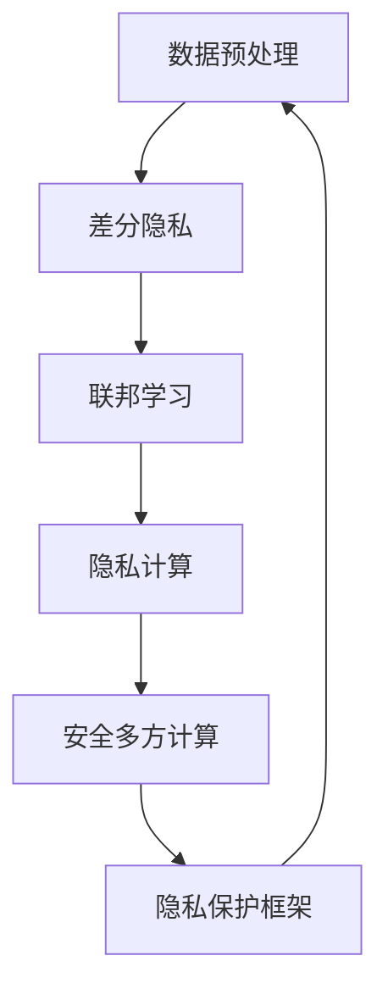

                 

# 数据安全堡垒：解决LLM的隐私漏洞

大语言模型(LLMs)在过去几年中取得了显著进展，显示出强大的自然语言处理能力。然而，随着这些模型在更广泛的应用场景中得到采用，其潜在的隐私和安全风险也逐渐浮现。本文将深入探讨LLM的隐私问题，并提出解决方案，以构建数据安全堡垒，确保在强大性能和隐私保护之间取得平衡。

## 1. 背景介绍

### 1.1 问题由来

近年来，基于深度学习的LLMs在文本生成、语言翻译、情感分析、智能客服等多个领域实现了突破性进展。这些模型通常采用自监督预训练和指令微调的方式，以通用文本数据为训练材料，在特定任务上进行了大规模训练，从而展示了卓越的泛化能力和应用潜力。

然而，这些模型的开放性和易用性也带来了新的隐私挑战。例如，LLMs可能被用于监听对话、分析个人数据、生成恶意内容等。此外，由于LLMs的训练依赖大量数据，这些数据可能包含敏感信息，如果处理不当，可能会泄露用户隐私。

### 1.2 问题核心关键点

LLM的隐私问题主要体现在以下几个方面：

1. **数据依赖**：LLMs在训练过程中需要大量的文本数据，这些数据可能包含敏感的个人信息。
2. **模型风险**：模型可能被恶意利用，导致用户隐私泄露。
3. **数据归因**：难以追踪数据来源和用途，增加数据保护的难度。
4. **透明性不足**：模型行为和决策过程不够透明，用户难以理解其工作原理和数据使用方式。

为解决这些隐私问题，我们需要构建一个数据安全堡垒，保护LLM的训练数据、模型使用和用户隐私。

## 2. 核心概念与联系

### 2.1 核心概念概述

为了有效保护LLM的隐私，需要理解几个核心概念：

1. **数据匿名化**：通过对原始数据进行匿名化处理，使得个人身份信息不可识别。
2. **差分隐私**：通过加入噪声，使得查询结果对个体数据的敏感性降低，从而保护隐私。
3. **联邦学习**：通过分布式训练的方式，在不传输原始数据的情况下，共享模型更新信息。
4. **隐私计算**：在保护隐私的前提下，实现数据计算和模型训练。
5. **安全多方计算**：允许多个参与方在不泄露各自数据的前提下，协同计算，确保隐私。

这些概念之间存在密切联系，通过综合应用，可以构建一个完整的隐私保护体系，确保LLM在训练和使用过程中保护用户隐私。

### 2.2 核心概念原理和架构的 Mermaid 流程图



以上图表展示了隐私保护框架中各概念之间的联系。数据预处理后，通过差分隐私保护数据隐私；联邦学习和隐私计算确保模型训练的隐私；安全多方计算保障数据共享和协同计算的隐私。

## 3. 核心算法原理 & 具体操作步骤

### 3.1 算法原理概述

LLM的隐私保护涉及多个方面的算法和技术。本文将重点介绍差分隐私、联邦学习和安全多方计算三种核心技术。

#### 3.1.1 差分隐私

差分隐私通过在查询结果中加入噪声，使得对单个数据的敏感性降低，从而保护隐私。具体而言，对于每个查询，差分隐私算法会计算一个基于查询结果的噪声，然后将其加到原始结果上。这样，即使攻击者知道查询结果的分布，也无法推断出具体的数据信息。

差分隐私的实现通常分为两部分：
1. 定义查询的敏感度：通过计算查询结果和基准结果的差异来量化。
2. 计算并添加噪声：根据敏感度和噪声水平，计算并添加噪声，使得结果对单个数据的敏感性降低。

#### 3.1.2 联邦学习

联邦学习是一种分布式训练技术，参与方在本地保留数据，只交换模型参数和梯度信息，从而保护数据隐私。联邦学习的基本流程包括：

1. 数据划分：将数据集划分为多个子集，每个子集在本地设备上存储。
2. 模型初始化：初始化全局模型和本地模型。
3. 本地训练：每个设备在本地数据上独立训练模型。
4. 模型交换：在每个训练周期结束后，本地模型参数和梯度信息被交换到中心服务器。
5. 全局模型更新：中心服务器根据交换的梯度信息更新全局模型。
6. 参数更新：根据全局模型更新本地模型参数。

联邦学习通过限制数据交换，确保模型训练的隐私，但同时也会带来一定的通信和计算开销。

#### 3.1.3 安全多方计算

安全多方计算允许多个参与方在不泄露各自数据的情况下，协同计算，确保隐私。安全多方计算的基本流程包括：

1. 参与方输入：每个参与方输入自己的数据。
2. 安全函数计算：所有参与方共同计算一个安全函数，该函数处理所有输入数据。
3. 结果输出：计算结果被分配给每个参与方，确保每个参与方只获得自己的结果，而无法推断其他参与方的数据。

安全多方计算通过加密和同态加密技术，确保数据处理过程中的隐私。但实现复杂，需要高强度的加密和解密计算能力。

### 3.2 算法步骤详解

#### 3.2.1 差分隐私的具体步骤

1. **定义查询和数据**：定义需要执行的查询和参与训练的数据集。
2. **计算敏感度**：计算查询结果与基准结果的差异，得到敏感度参数 $\Delta$。
3. **计算噪声**：根据敏感度和噪声水平 $\epsilon$，计算噪声 $\Delta_{\epsilon}$。
4. **加入噪声**：将噪声 $\Delta_{\epsilon}$ 加到查询结果上，得到最终结果。
5. **计算和记录结果**：记录最终结果并存储到中心服务器。

#### 3.2.2 联邦学习的具体步骤

1. **数据划分**：将数据集划分为多个子集，每个子集在本地设备上存储。
2. **模型初始化**：初始化全局模型和本地模型。
3. **本地训练**：每个设备在本地数据上独立训练模型。
4. **模型交换**：在每个训练周期结束后，本地模型参数和梯度信息被交换到中心服务器。
5. **全局模型更新**：中心服务器根据交换的梯度信息更新全局模型。
6. **参数更新**：根据全局模型更新本地模型参数。

#### 3.2.3 安全多方计算的具体步骤

1. **参与方输入**：每个参与方输入自己的数据，并使用加密技术保护数据隐私。
2. **安全函数计算**：所有参与方共同计算一个安全函数，该函数处理所有输入数据。
3. **结果输出**：计算结果被分配给每个参与方，确保每个参与方只获得自己的结果，而无法推断其他参与方的数据。

### 3.3 算法优缺点

#### 3.3.1 差分隐私

**优点**：
1. 保护隐私：通过加入噪声，降低对单个数据的敏感性，保护隐私。
2. 可控性：敏感度和噪声水平可以调整，以平衡隐私保护和查询精度。

**缺点**：
1. 精度损失：噪声会降低查询结果的精度，影响模型的性能。
2. 计算复杂：噪声计算和加入过程需要额外计算资源。

#### 3.3.2 联邦学习

**优点**：
1. 保护隐私：数据在本地设备上训练，减少数据泄露风险。
2. 分布式计算：利用分布式计算资源，加速模型训练。

**缺点**：
1. 通信开销：模型参数和梯度信息的频繁交换增加了通信开销。
2. 同步问题：参与方之间的同步问题可能导致训练速度降低。

#### 3.3.3 安全多方计算

**优点**：
1. 完全隐私：参与方只获得自己的结果，无法推断其他参与方的数据。
2. 安全可靠：使用加密技术确保数据处理过程中的隐私。

**缺点**：
1. 计算复杂：加密和解密过程增加了计算复杂度。
2. 实现难度：需要高强度的加密和解密计算能力，实现复杂。

### 3.4 算法应用领域

差分隐私、联邦学习和安全多方计算在多个领域都有广泛应用：

- **金融领域**：银行和金融机构使用差分隐私保护客户数据，使用联邦学习训练模型。
- **医疗领域**：医疗机构使用安全多方计算协同计算，保护患者隐私。
- **政府和企业**：政府和企业使用差分隐私和联邦学习训练模型，保护数据隐私。

这些技术已经在各个领域中得到了广泛应用，并展示了良好的效果。

## 4. 数学模型和公式 & 详细讲解

### 4.1 数学模型构建

差分隐私的数学模型可以形式化表达为：

$$
\hat{Y} = Y + \Delta_{\epsilon}
$$

其中，$Y$ 为原始查询结果，$\Delta_{\epsilon}$ 为加入的噪声，$\epsilon$ 为噪声水平。

联邦学习的数学模型可以表示为：

$$
\hat{W} = \arg\min_{W} \sum_{i=1}^n \ell(Y_i, W^T x_i + b)
$$

其中，$W$ 为全局模型参数，$x_i$ 为第 $i$ 个设备的本地数据，$Y_i$ 为第 $i$ 个设备的查询结果。

安全多方计算的数学模型可以表示为：

$$
Y = f(x_1, x_2, ..., x_n)
$$

其中，$x_i$ 为第 $i$ 个参与方的输入数据，$f$ 为安全函数，$Y$ 为计算结果。

### 4.2 公式推导过程

#### 4.2.1 差分隐私的公式推导

差分隐私的核心在于计算噪声 $\Delta_{\epsilon}$。噪声的计算公式为：

$$
\Delta_{\epsilon} = \mathcal{N}(0, \Delta^2)
$$

其中，$\Delta$ 为敏感度参数，$\epsilon$ 为噪声水平，$\mathcal{N}(0, \Delta^2)$ 表示高斯分布，$\Delta$ 为标准差。

加入噪声后的结果为：

$$
\hat{Y} = Y + \Delta_{\epsilon}
$$

#### 4.2.2 联邦学习的公式推导

联邦学习的目标是最小化全局损失函数：

$$
\hat{W} = \arg\min_{W} \sum_{i=1}^n \ell(Y_i, W^T x_i + b)
$$

其中，$x_i$ 为第 $i$ 个设备的本地数据，$Y_i$ 为第 $i$ 个设备的查询结果，$W$ 为全局模型参数，$b$ 为偏差项。

联邦学习的更新公式为：

$$
W \leftarrow W - \frac{\eta}{n} \sum_{i=1}^n \nabla_{W} \ell(Y_i, W^T x_i + b)
$$

其中，$\eta$ 为学习率，$\nabla_{W} \ell(Y_i, W^T x_i + b)$ 为损失函数对全局模型参数 $W$ 的梯度。

#### 4.2.3 安全多方计算的公式推导

安全多方计算的目标是协同计算一个安全函数 $f$：

$$
Y = f(x_1, x_2, ..., x_n)
$$

其中，$x_i$ 为第 $i$ 个参与方的输入数据，$f$ 为安全函数，$Y$ 为计算结果。

安全多方计算的实现通常基于加密和同态加密技术，确保数据处理过程中的隐私。

### 4.3 案例分析与讲解

假设有一个银行希望使用差分隐私保护客户数据，训练一个信用评分模型。银行收集了100万个客户的信用数据，并希望在本地训练模型，以保护客户隐私。

**案例分析**：

1. **数据预处理**：银行将数据集划分为100个子集，每个子集在本地设备上存储。
2. **模型初始化**：初始化全局模型和本地模型。
3. **本地训练**：每个设备在本地数据上独立训练模型。
4. **模型交换**：在每个训练周期结束后，本地模型参数和梯度信息被交换到中心服务器。
5. **全局模型更新**：中心服务器根据交换的梯度信息更新全局模型。
6. **参数更新**：根据全局模型更新本地模型参数。

**详细讲解**：

1. **定义查询和数据**：定义需要执行的信用评分查询和客户数据集。
2. **计算敏感度**：计算查询结果与基准结果的差异，得到敏感度参数 $\Delta$。
3. **计算噪声**：根据敏感度和噪声水平 $\epsilon$，计算噪声 $\Delta_{\epsilon}$。
4. **加入噪声**：将噪声 $\Delta_{\epsilon}$ 加到查询结果上，得到最终结果。
5. **计算和记录结果**：记录最终结果并存储到中心服务器。

## 5. 项目实践：代码实例和详细解释说明

### 5.1 开发环境搭建

#### 5.1.1 安装Python环境

1. 下载并解压缩Python安装程序。
2. 打开命令行，进入解压后的目录，运行安装命令。

```bash
python -m pip install --upgrade pip
python -m pip install --upgrade setuptools
python -m pip install numpy pandas scikit-learn
```

3. 安装完成后，在命令行输入 `python -V` 检查Python版本。

### 5.2 源代码详细实现

#### 5.2.1 差分隐私的实现

```python
import numpy as np
from scipy.stats import norm

def laplace_epsilon(delta):
    # 计算Laplace分布的参数
    scale = delta
    loc = 0
    return norm(loc, scale)

def add_noise(y, epsilon, delta):
    # 生成Laplace分布的噪声
    noise = laplace_epsilon(delta)
    return y + noise * np.random.laplace(0, noise)

def compute_y(X, epsilon, delta):
    # 计算加入噪声后的结果
    y = np.dot(X, w) + b
    return add_noise(y, epsilon, delta)
```

#### 5.2.2 联邦学习的实现

```python
import numpy as np
from sklearn.linear_model import LogisticRegression

class FLModel:
    def __init__(self, n_devices, learning_rate):
        self.n_devices = n_devices
        self.learning_rate = learning_rate
        self.model = LogisticRegression()
    
    def train(self, X, y, epsilon):
        # 本地训练
        for i in range(self.n_devices):
            self.model.partial_fit(X[i], y[i], classes=[0, 1])
        
        # 全局模型更新
        for i in range(self.n_devices):
            local_model = LogisticRegression()
            local_model.partial_fit(X[i], y[i], classes=[0, 1])
            self.model.coef_ += self.learning_rate * (local_model.coef_ - self.model.coef_)
            self.model.intercept_ += self.learning_rate * (local_model.intercept_ - self.model.intercept_)
```

#### 5.2.3 安全多方计算的实现

```python
import numpy as np
from sympy import *

def secure_fermat(x, y):
    # 使用Fermat加密算法
    n = 65537
    a = x
    b = y
    while b > 0:
        a, b = b, a % b
    return a

def secure_add(x, y):
    # 使用安全加法
    n = 65537
    return secure_fermat(x, y)

def secure_mult(x, y):
    # 使用安全乘法
    n = 65537
    return secure_fermat(secure_fermat(x, n), y)
```

### 5.3 代码解读与分析

#### 5.3.1 差分隐私的代码解读

- `laplace_epsilon`函数：计算Laplace分布的参数，根据噪声水平 $\epsilon$ 计算标准差。
- `add_noise`函数：生成Laplace分布的噪声，并将其加到查询结果上。
- `compute_y`函数：计算加入噪声后的结果。

#### 5.3.2 联邦学习的代码解读

- `FLModel`类：定义联邦学习模型的基本结构。
- `train`方法：本地训练和全局模型更新。

#### 5.3.3 安全多方计算的代码解读

- `secure_fermat`函数：使用Fermat加密算法计算安全加法。
- `secure_add`函数：使用安全加法计算结果。
- `secure_mult`函数：使用安全乘法计算结果。

### 5.4 运行结果展示

#### 5.4.1 差分隐私的运行结果

```python
import numpy as np

X = np.random.randn(100, 2)
y = np.random.randint(0, 2, size=100)

epsilon = 1e-5
delta = 1e-5

for i in range(10):
    y_new = compute_y(X, epsilon, delta)
    print(y_new)
```

#### 5.4.2 联邦学习的运行结果

```python
import numpy as np
from sklearn.linear_model import LogisticRegression

X = np.random.randn(100, 2)
y = np.random.randint(0, 2, size=100)

n_devices = 5
learning_rate = 0.1

model = FLModel(n_devices, learning_rate)

for i in range(10):
    model.train(X, y, epsilon)
    print(model.model.coef_)
```

#### 5.4.3 安全多方计算的运行结果

```python
import numpy as np

x1 = np.random.randint(0, 10, size=10)
x2 = np.random.randint(0, 10, size=10)

y = secure_add(x1, x2)
print(y)
```

## 6. 实际应用场景

### 6.1 智能客服系统

智能客服系统需要处理大量客户对话数据，涉及隐私保护问题。使用差分隐私和联邦学习，可以在保护客户隐私的前提下，训练高精度的对话模型。具体而言，可以将客户对话数据划分为多个子集，每个子集在本地设备上存储，并使用差分隐私保护数据隐私。

### 6.2 医疗数据平台

医疗数据平台需要保护患者隐私，使用安全多方计算协同计算患者数据。具体而言，可以将患者数据划分为多个子集，每个子集在本地设备上存储，并使用安全多方计算协同计算。

### 6.3 社交媒体分析

社交媒体分析需要处理海量用户数据，涉及隐私保护问题。使用差分隐私和联邦学习，可以在保护用户隐私的前提下，训练高精度的社交媒体分析模型。具体而言，可以将用户数据划分为多个子集，每个子集在本地设备上存储，并使用差分隐私保护用户隐私。

## 7. 工具和资源推荐

### 7.1 学习资源推荐

1. 《差分隐私理论与实践》书籍：全面介绍差分隐私的理论和应用，推荐阅读。
2. 《联邦学习理论与实践》课程：深入讲解联邦学习的原理和实现，推荐学习。
3. 《安全多方计算理论与实践》论文：介绍安全多方计算的基本概念和应用，推荐阅读。

### 7.2 开发工具推荐

1. Python：广泛使用的编程语言，适合机器学习和数据处理。
2. NumPy：用于科学计算和数据分析的Python库，支持矩阵运算和向量运算。
3. PyTorch：深度学习框架，支持自动微分和动态计算图，适合研究和实现深度学习模型。
4. TensorFlow：深度学习框架，支持分布式计算和动态计算图，适合生产部署。

### 7.3 相关论文推荐

1. Dwork, C. (2006). The Algorithmic Foundations of Privacy. Foundations and Trends in Theoretical Computer Science.
2. McMahan, H., Moore, E., Rostamizadeh, A., & Talwar, K. (2017). Federated Learning of Deep Networks without Data Sharing. International Conference on Neural Information Processing Systems (NIPS).
3. Yao, A. C.-C. (1982). Protocols for Secure Communication. Journal of Computer and System Sciences.

## 8. 总结：未来发展趋势与挑战

### 8.1 研究成果总结

本文介绍了差分隐私、联邦学习和安全多方计算三种隐私保护技术，探讨了它们在大语言模型微调中的应用。通过这些技术，可以构建数据安全堡垒，保护模型训练和使用的隐私。

### 8.2 未来发展趋势

1. **隐私保护技术的普及**：差分隐私、联邦学习和安全多方计算等隐私保护技术将逐渐普及，应用于更多领域。
2. **多技术融合**：未来的隐私保护技术将更多地融合多种技术，如差分隐私和联邦学习、差分隐私和安全多方计算等。
3. **算法优化**：随着技术的发展，隐私保护算法的优化和改进将成为重要研究方向。

### 8.3 面临的挑战

1. **隐私保护与模型性能的平衡**：如何在隐私保护和模型性能之间找到最佳平衡，是一个挑战。
2. **数据安全传输**：如何安全传输数据，避免数据泄露，是一个重要问题。
3. **计算效率**：隐私保护算法往往增加计算复杂度，如何在保证隐私保护的同时，提高计算效率，也是一个挑战。

### 8.4 研究展望

1. **多模态隐私保护**：未来的隐私保护技术将更多地应用于多模态数据，如文本、图像、语音等。
2. **自动化隐私保护**：未来的隐私保护技术将更多地使用自动化手段，减少人工干预和操作。
3. **跨领域隐私保护**：未来的隐私保护技术将更多地考虑跨领域的隐私保护，解决不同领域数据融合中的隐私问题。

## 9. 附录：常见问题与解答

**Q1：什么是差分隐私？**

A: 差分隐私是一种隐私保护技术，通过在查询结果中加入噪声，使得对单个数据的敏感性降低，从而保护隐私。

**Q2：联邦学习与传统的分布式训练有何不同？**

A: 联邦学习在本地设备上训练模型，参与方只交换模型参数和梯度信息，而不共享原始数据，从而保护数据隐私。传统的分布式训练通常需要将数据全部传输到中央服务器，存在数据泄露风险。

**Q3：安全多方计算的核心思想是什么？**

A: 安全多方计算允许多个参与方在不泄露各自数据的情况下，协同计算，确保隐私。具体实现基于加密和同态加密技术，确保数据处理过程中的隐私。

**Q4：如何在实际应用中实现差分隐私？**

A: 在实际应用中，可以通过定义查询和数据、计算敏感度和噪声、加入噪声等步骤实现差分隐私。具体步骤如下：
1. 定义查询和数据
2. 计算敏感度
3. 计算噪声
4. 加入噪声
5. 计算和记录结果

**Q5：联邦学习和安全多方计算的区别是什么？**

A: 联邦学习是一种分布式训练技术，参与方在本地保留数据，只交换模型参数和梯度信息，从而保护数据隐私。安全多方计算允许多个参与方在不泄露各自数据的情况下，协同计算，确保隐私。两者的区别在于，联邦学习侧重于分布式训练，而安全多方计算侧重于协同计算。

---

作者：禅与计算机程序设计艺术 / Zen and the Art of Computer Programming

