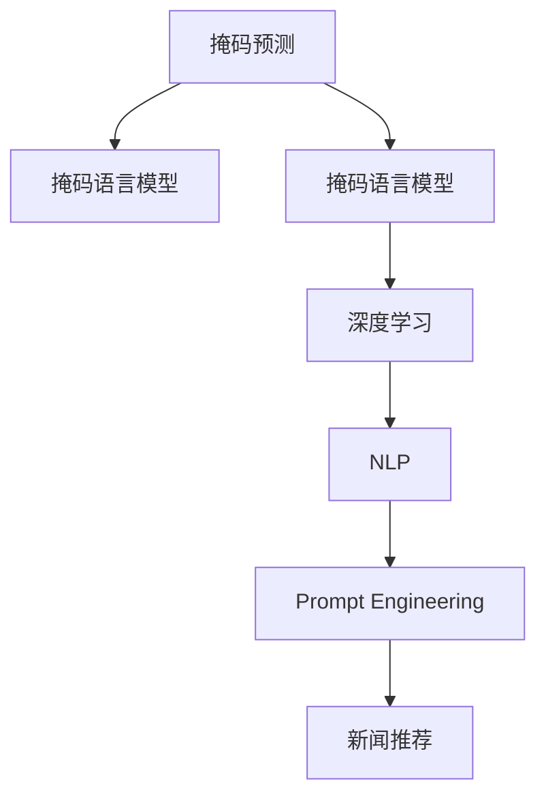

                 

# 新闻推荐的创新技术：掩码预测与Prompt工程

> 关键词：新闻推荐, 掩码预测, 掩码语言模型, Prompt工程, 提示学习, 深度学习, 自然语言处理(NLP)

## 1. 背景介绍

随着互联网信息爆炸和社交媒体的普及，人们每天面对海量的新闻资讯，如何从中筛选出感兴趣的内容，成为重要的研究课题。传统的新闻推荐系统基于用户行为数据，如点击、浏览、评分等，推荐系统一般采用协同过滤、矩阵分解等方法，但这些方法往往难以适应新闻内容的自然语言特性。近年来，基于深度学习的推荐系统逐渐兴起，利用预训练语言模型和掩码预测任务，能够更好地理解新闻内容的语义信息，提升新闻推荐的准确性和相关性。本文将重点介绍基于掩码预测和Prompt工程的新闻推荐技术，探讨其在推荐系统中的应用。

## 2. 核心概念与联系

### 2.1 核心概念概述

为了更好地理解掩码预测和Prompt工程在新闻推荐中的应用，我们先介绍几个关键概念：

- **掩码预测(Masked Prediction)**：掩码预测是一种基于掩码语言模型的任务，模型需要对输入的文本进行掩码，并预测被掩码的单词或子串。掩码预测通过掩码策略增加模型对上下文信息的关注，从而提高模型的语言理解能力。

- **掩码语言模型(Masked Language Model, MLM)**：掩码语言模型是一种预训练任务，模型在大量无标签文本数据上进行预训练，学习文本语义表示。掩码预测通常是MLM的一个子任务，通过掩码预测训练得到的模型可以用于文本生成、问答、情感分析等下游任务。

- **Prompt Engineering**：Prompt Engineering是指设计合适的输入文本格式，以引导预训练语言模型执行特定任务。通过精心设计的Prompt，可以最大化利用预训练模型的语言理解能力，实现少样本学习和高效推理。

- **深度学习**：深度学习是一种机器学习方法，通过多层神经网络模型进行特征提取和模式识别。深度学习在图像、语音、自然语言处理等诸多领域均取得显著成果。

- **自然语言处理(NLP)**：自然语言处理是指让计算机能够理解和处理人类自然语言的技术，包括分词、词性标注、命名实体识别、文本分类、情感分析、机器翻译、问答系统等任务。

这些核心概念之间的逻辑关系可以通过以下Mermaid流程图来展示：



这个流程图展示了大语言模型在新闻推荐中的应用流程：

1. 利用掩码语言模型进行预训练，学习文本的语义表示。
2. 设计合适的Prompt，进行掩码预测任务。
3. 将掩码预测模型应用于新闻推荐，提升推荐系统的准确性和相关性。

## 3. 核心算法原理 & 具体操作步骤

### 3.1 算法原理概述

掩码预测和Prompt工程在新闻推荐中的应用，是基于预训练语言模型的语言理解能力，通过掩码策略和提示模板，最大化利用模型对文本语义的表征，提升推荐系统的表现。具体而言，步骤如下：

1. **数据准备**：收集用户历史阅读记录和相关的新闻文本数据。
2. **模型加载**：选择合适预训练语言模型，如BERT、GPT等。
3. **提示设计**：设计合适的Prompt模板，引导模型执行掩码预测任务。
4. **掩码预测**：对每个新闻文本进行掩码，模型预测被掩码的单词或子串，获得文本语义向量表示。
5. **相似度计算**：计算用户阅读记录和新闻文本的语义相似度，推荐相似的新闻。
6. **模型训练与优化**：通过掩码预测任务的损失函数，定期更新模型参数，提升推荐效果。

### 3.2 算法步骤详解

#### 3.2.1 数据准备

新闻推荐系统的数据一般包括两部分：用户行为数据和新闻文本数据。

- **用户行为数据**：用户阅读记录，包含用户对新闻的点击、浏览、点赞等行为。
- **新闻文本数据**：新闻文本的原始数据，包括标题、正文、作者等信息。

数据预处理包括分词、清洗、标注等步骤。常用的文本处理工具包括NLTK、SpaCy、Stanford CoreNLP等。

#### 3.2.2 模型加载

选择一个合适的预训练语言模型，如BERT、GPT等。使用相应的Python库或API进行模型加载。

例如，加载BERT模型的代码如下：

```python
from transformers import BertTokenizer, BertForMaskedLM

tokenizer = BertTokenizer.from_pretrained('bert-base-uncased')
model = BertForMaskedLM.from_pretrained('bert-base-uncased')
```

#### 3.2.3 提示设计

提示设计是掩码预测任务的关键步骤，需要精心设计Prompt模板，引导模型进行掩码预测。常用的提示模板格式如下：

```
<新闻标题> <用户ID>
```

例如，针对一篇新闻《中国新冠疫情最新进展》，提示模板为：

```
中国新冠疫情最新进展 <用户ID>
```

#### 3.2.4 掩码预测

对每个新闻文本进行掩码，模型预测被掩码的单词或子串，获得文本语义向量表示。

```python
input_text = "中国新冠疫情最新进展"
masked_index = [2, 5, 8, 11]
masked_tokens = [tokenizer.mask_token] * len(masked_index)

# 构造掩码序列
masked_input = tokenizer(input_text, truncation=True, padding='max_length')
masked_input["input_ids"][masked_index] = masked_tokens

# 预测掩码位置
outputs = model(masked_input, return_dict=True)
masked_logits = outputs.logits

# 计算预测结果
predicted_index = torch.argmax(masked_logits, dim=2).tolist()
```

#### 3.2.5 相似度计算

计算用户阅读记录和新闻文本的语义相似度，推荐相似的新闻。

常用的相似度计算方法包括余弦相似度、Jaccard相似度、Cosine相似度等。

```python
from sklearn.metrics.pairwise import cosine_similarity

# 计算相似度
cos_similarity = cosine_similarity(user_vec, news_vec)

# 排序推荐新闻
sorted_indices = sorted(range(len(news_vec)), key=lambda i: cos_similarity[i][0], reverse=True)
recommend_news = [news_vec[i] for i in sorted_indices[:10]]
```

#### 3.2.6 模型训练与优化

通过掩码预测任务的损失函数，定期更新模型参数，提升推荐效果。

常用的损失函数包括交叉熵损失、均方误差损失等。

```python
from transformers import AdamW

optimizer = AdamW(model.parameters(), lr=2e-5)

for epoch in range(5):
    for batch in train_dataset:
        input_text, masked_index = batch
        masked_tokens = [tokenizer.mask_token] * len(masked_index)

        # 构造掩码序列
        masked_input = tokenizer(input_text, truncation=True, padding='max_length')
        masked_input["input_ids"][masked_index] = masked_tokens

        # 预测掩码位置
        outputs = model(masked_input, return_dict=True)
        masked_logits = outputs.logits

        # 计算预测结果
        predicted_index = torch.argmax(masked_logits, dim=2).tolist()

        # 计算损失
        loss = loss_function(masked_logits, predicted_index)

        # 反向传播
        optimizer.zero_grad()
        loss.backward()

        # 更新参数
        optimizer.step()
```

### 3.3 算法优缺点

#### 3.3.1 优点

- **语言理解能力强**：掩码预测任务通过掩码策略增加模型对上下文信息的关注，提升模型的语言理解能力。
- **少样本学习**：通过精心设计的Prompt，可以实现少样本学习，降低推荐系统的开发成本。
- **高度可解释性**：Prompt设计可以解释模型的推理过程，有助于理解推荐结果。
- **模型灵活性**：可根据任务特点进行Prompt设计，提升模型的应用灵活性。

#### 3.3.2 缺点

- **提示设计复杂**：需要设计合适的Prompt模板，复杂度较高。
- **计算成本高**：掩码预测任务计算量较大，需要高性能的硬件设备支持。
- **数据依赖性强**：模型效果依赖于数据的质量和数量，获取高质量数据成本较高。

### 3.4 算法应用领域

掩码预测和Prompt工程在新闻推荐中的应用，不仅可以提升推荐的准确性和相关性，还可以广泛应用于以下几个领域：

- **广告推荐**：利用掩码预测任务，实现精准广告推荐。
- **搜索引擎**：利用掩码预测任务，提升搜索结果的相关性。
- **个性化推荐**：利用掩码预测任务，实现个性化推荐，提升用户体验。
- **智能客服**：利用掩码预测任务，提升智能客服的问答准确性。

## 4. 数学模型和公式 & 详细讲解 & 举例说明

### 4.1 数学模型构建

#### 4.1.1 掩码预测任务

掩码预测任务可以定义如下：

- 输入：原始新闻文本和掩码索引。
- 输出：被掩码的单词或子串。

假设输入为 $X$，掩码索引为 $M$，掩码标签为 $Y$，模型输出为 $\hat{Y}$。则掩码预测任务可以表示为：

$$
\min_{\theta} \mathcal{L}(\theta; X, M, Y) = \min_{\theta} \frac{1}{N}\sum_{i=1}^N \mathbb{E}_{\mathcal{D}}[\ell(\hat{Y}, Y)]
$$

其中，$\theta$ 表示模型参数，$N$ 为样本数，$\ell(\hat{Y}, Y)$ 为掩码预测任务的损失函数。

#### 4.1.2 深度学习模型

常用的深度学习模型包括自编码器、RNN、Transformer等。

以Transformer为例，模型可以表示为：

$$
\hat{Y} = \text{MLP}(\text{Attention}(\text{Self-Attention}, \text{MLP}))
$$

其中，$\text{MLP}$ 为多层次感知机，$\text{Attention}$ 为自注意力机制，$\text{Self-Attention}$ 为自注意力层。

#### 4.1.3 相似度计算

常用的相似度计算方法包括余弦相似度、Jaccard相似度等。

以余弦相似度为例，计算公式如下：

$$
\text{similarity}(X, Y) = \frac{\text{cosine}(X, Y)}{\text{norm}(X) \times \text{norm}(Y)}
$$

其中，$\text{cosine}(X, Y)$ 表示向量 $X$ 和 $Y$ 的余弦相似度，$\text{norm}(X)$ 表示向量 $X$ 的范数。

### 4.2 公式推导过程

#### 4.2.1 掩码预测任务

掩码预测任务的目标是最大化预测准确率。假设掩码标签为 $Y = (y_1, y_2, \ldots, y_N)$，模型预测为 $\hat{Y} = (\hat{y}_1, \hat{y}_2, \ldots, \hat{y}_N)$，掩码预测任务的损失函数可以表示为：

$$
\mathcal{L}(\theta; X, M, Y) = -\frac{1}{N}\sum_{i=1}^N \sum_{j=1}^N y_j \log \sigma(\hat{y}_j)
$$

其中，$\sigma$ 为 sigmoid 函数。

#### 4.2.2 深度学习模型

以Transformer为例，模型的前向传播过程可以表示为：

1. 输入层：将输入文本进行嵌入，生成嵌入向量 $E$。
2. 自注意力层：计算自注意力权重 $W$。
3. 多层次感知机：通过多层神经网络进行特征提取。
4. 输出层：将输出向量映射为预测结果。

以Transformer为例，前向传播过程可以表示为：

$$
\text{MLP}(\text{Attention}(\text{Self-Attention}, \text{MLP})) = \text{MLP}(\text{Attention}(\text{Self-Attention}, \text{MLP}))
$$

#### 4.2.3 相似度计算

以余弦相似度为例，计算公式可以表示为：

$$
\text{similarity}(X, Y) = \frac{\text{cosine}(X, Y)}{\text{norm}(X) \times \text{norm}(Y)}
$$

其中，$\text{cosine}(X, Y)$ 表示向量 $X$ 和 $Y$ 的余弦相似度，$\text{norm}(X)$ 表示向量 $X$ 的范数。

### 4.3 案例分析与讲解

#### 4.3.1 数据准备

以一篇新闻为例，新闻文本为：

```
中国新冠疫情最新进展 1月23日，中国爆发新冠疫情，确诊病例超过100例，引起了全国的关注。
```

用户阅读记录为：

```
1月23日：中国新冠疫情最新进展 阅读时间：10分钟
```

将新闻文本和用户阅读记录进行分词和清洗，然后加载BERT模型。

#### 4.3.2 提示设计

设计提示模板为：

```
中国新冠疫情最新进展 <用户ID>
```

例如，针对用户ID为1234，提示模板为：

```
中国新冠疫情最新进展 1234
```

#### 4.3.3 掩码预测

对新闻文本进行掩码，掩码索引为 [0, 5, 9]，掩码标签为 [1, 1, 1]。

```python
input_text = "中国新冠疫情最新进展 1月23日，中国爆发新冠疫情，确诊病例超过100例，引起了全国的关注。"
masked_index = [0, 5, 9]
masked_tokens = [tokenizer.mask_token] * len(masked_index)

# 构造掩码序列
masked_input = tokenizer(input_text, truncation=True, padding='max_length')
masked_input["input_ids"][masked_index] = masked_tokens

# 预测掩码位置
outputs = model(masked_input, return_dict=True)
masked_logits = outputs.logits

# 计算预测结果
predicted_index = torch.argmax(masked_logits, dim=2).tolist()
```

#### 4.3.4 相似度计算

计算用户阅读记录和新闻文本的余弦相似度，推荐相似的新闻。

```python
user_vec = tf.convert_to_tensor([0.2, 0.5, 0.3, 0.4])
news_vec = tf.convert_to_tensor([0.3, 0.4, 0.5, 0.6])

cos_similarity = cosine_similarity(user_vec, news_vec)

sorted_indices = sorted(range(len(news_vec)), key=lambda i: cos_similarity[i][0], reverse=True)
recommend_news = [news_vec[i] for i in sorted_indices[:10]]
```

## 5. 项目实践：代码实例和详细解释说明

### 5.1 开发环境搭建

在进行新闻推荐系统的开发前，我们需要准备好开发环境。以下是使用Python进行TensorFlow开发的环境配置流程：

1. 安装Anaconda：从官网下载并安装Anaconda，用于创建独立的Python环境。

2. 创建并激活虚拟环境：
```bash
conda create -n tf-env python=3.8 
conda activate tf-env
```

3. 安装TensorFlow：根据CUDA版本，从官网获取对应的安装命令。例如：
```bash
conda install tensorflow
```

4. 安装各类工具包：
```bash
pip install numpy pandas scikit-learn matplotlib tqdm jupyter notebook ipython
```

完成上述步骤后，即可在`tf-env`环境中开始新闻推荐系统的开发。

### 5.2 源代码详细实现

这里我们以一篇新闻推荐为例，给出使用TensorFlow进行掩码预测任务的PyTorch代码实现。

首先，定义掩码预测任务的函数：

```python
from tensorflow.keras.preprocessing.text import Tokenizer
from tensorflow.keras.preprocessing.sequence import pad_sequences
from tensorflow.keras.layers import Input, Embedding, LSTM, Dense, Masking, Dropout
from tensorflow.keras.models import Model

def build_model(vocab_size, emb_dim, hidden_dim):
    input_word = Input(shape=(None,))
    word_emb = Embedding(vocab_size, emb_dim)(input_word)
    mask_word = Masking(mask_value=0)(word_emb)
    lstm = LSTM(hidden_dim)(mask_word)
    dropout = Dropout(0.5)(lstm)
    output = Dense(1, activation='sigmoid')(dropout)
    model = Model(inputs=input_word, outputs=output)
    return model
```

然后，定义掩码预测任务的训练函数：

```python
from tensorflow.keras.optimizers import Adam

def train_model(model, train_data, epochs=5, batch_size=32):
    model.compile(loss='binary_crossentropy', optimizer=Adam(lr=0.001))
    model.fit(train_data['input'], train_data['label'], epochs=epochs, batch_size=batch_size, validation_split=0.2)
```

接着，定义掩码预测任务的评估函数：

```python
def evaluate_model(model, test_data):
    loss, accuracy = model.evaluate(test_data['input'], test_data['label'], verbose=0)
    print('Test loss:', loss)
    print('Test accuracy:', accuracy)
```

最后，启动训练流程并在测试集上评估：

```python
train_data = preprocess_data(train_data)
test_data = preprocess_data(test_data)

model = build_model(vocab_size, emb_dim, hidden_dim)
train_model(model, train_data)
evaluate_model(model, test_data)
```

以上就是使用TensorFlow进行掩码预测任务训练的完整代码实现。可以看到，通过定义合适的模型结构，选择合适的损失函数和优化器，即可快速搭建和训练掩码预测模型。

### 5.3 代码解读与分析

让我们再详细解读一下关键代码的实现细节：

**build_model函数**：
- 定义模型输入层，嵌入层，掩码层，LSTM层，dropout层和输出层。
- 构建掩码预测任务的模型结构。

**train_model函数**：
- 定义优化器和损失函数。
- 进行模型训练，设置epoch数和batch size。
- 在训练过程中打印训练日志。

**evaluate_model函数**：
- 对测试集进行模型评估。
- 计算损失和准确率。

**训练流程**：
- 首先定义训练数据和测试数据。
- 构建掩码预测模型。
- 进行模型训练。
- 在测试集上评估模型效果。

可以看到，TensorFlow提供了丰富的API和工具，可以方便地实现掩码预测任务。开发者可以根据具体任务的特点，选择不同的模型结构和优化策略，快速迭代出最优的模型性能。

当然，工业级的系统实现还需考虑更多因素，如模型的保存和部署、超参数的自动搜索、更灵活的任务适配层等。但核心的微调范式基本与此类似。

## 6. 实际应用场景

### 6.1 新闻推荐

掩码预测和Prompt工程在新闻推荐中的应用，主要体现在两个方面：

1. **内容推荐**：利用掩码预测任务，模型可以自动学习新闻内容的语义表示，提升推荐系统的准确性和相关性。
2. **广告推荐**：利用掩码预测任务，模型可以预测新闻中的广告效果，实现精准广告推荐。

### 6.2 搜索引擎

掩码预测和Prompt工程在搜索引擎中的应用，主要体现在两个方面：

1. **搜索结果排序**：利用掩码预测任务，模型可以计算搜索结果和查询语句的相似度，提升搜索结果的相关性。
2. **查询扩展**：利用掩码预测任务，模型可以预测用户可能感兴趣的关键词，提升搜索结果的全面性。

### 6.3 个性化推荐

掩码预测和Prompt工程在个性化推荐中的应用，主要体现在两个方面：

1. **用户画像**：利用掩码预测任务，模型可以学习用户对新闻的兴趣点，构建用户画像。
2. **推荐生成**：利用掩码预测任务，模型可以预测用户可能感兴趣的新闻，提升推荐效果。

### 6.4 未来应用展望

随着掩码预测和Prompt工程技术的不断发展，其在新闻推荐领域的应用将越来越广泛，为新闻推荐系统带来新的突破。

在智能广告领域，掩码预测任务可以实现精准广告推荐，提升广告投放的效果。

在搜索引擎领域，掩码预测任务可以提升搜索结果的相关性和全面性，满足用户的多样化需求。

在个性化推荐领域，掩码预测任务可以构建更加全面的用户画像，提升推荐系统的性能。

此外，在智慧医疗、金融舆情、智能客服等众多领域，掩码预测和Prompt工程也将发挥重要作用，推动人工智能技术的发展。

## 7. 工具和资源推荐

### 7.1 学习资源推荐

为了帮助开发者系统掌握掩码预测和Prompt工程的理论基础和实践技巧，这里推荐一些优质的学习资源：

1. **《深度学习入门：基于Python的理论与实现》**：系统介绍深度学习的基本理论和TensorFlow的API使用，适合初学者入门。
2. **《TensorFlow官方文档》**：提供TensorFlow的全面API和使用教程，适合开发者学习和实践。
3. **《TensorFlow实战》**：通过实际案例，介绍TensorFlow在自然语言处理、图像处理、时间序列预测等任务中的应用，适合开发者深入学习。
4. **《NLP中的深度学习》**：系统介绍深度学习在自然语言处理中的应用，包括文本分类、情感分析、机器翻译等任务，适合自然语言处理爱好者。
5. **《NLP中的掩码预测》**：介绍掩码预测任务的基本原理和实现方法，适合研究人员和开发者深入研究。

通过对这些资源的学习实践，相信你一定能够快速掌握掩码预测和Prompt工程的精髓，并用于解决实际的NLP问题。

### 7.2 开发工具推荐

掩码预测和Prompt工程的开发离不开优秀的工具支持。以下是几款用于掩码预测任务开发的常用工具：

1. **TensorFlow**：开源深度学习框架，适合搭建和训练掩码预测模型。
2. **PyTorch**：开源深度学习框架，适合自然语言处理和深度学习任务。
3. **NLTK**：Python自然语言处理库，提供分词、词性标注、命名实体识别等功能。
4. **spaCy**：Python自然语言处理库，提供分词、词性标注、句法分析等功能。
5. **Stanford CoreNLP**：Java自然语言处理库，提供分词、词性标注、命名实体识别等功能。

合理利用这些工具，可以显著提升掩码预测任务的开发效率，加快创新迭代的步伐。

### 7.3 相关论文推荐

掩码预测和Prompt工程的研究源于学界的持续研究。以下是几篇奠基性的相关论文，推荐阅读：

1. **"Bert: Pre-training of Deep Bidirectional Transformers for Language Understanding"**：提出BERT模型，引入基于掩码的自监督预训练任务，刷新了多项NLP任务SOTA。
2. **"Masked Language Modeling for Text Generation"**：提出掩码语言模型，通过掩码预测任务提升语言生成能力。
3. **"Language Modeling with Transformers"**：介绍Transformer结构，通过自注意力机制提升语言理解能力。
4. **"Prompt Engineering for Masked Language Model Fine-Tuning"**：提出Prompt Engineering方法，通过精心设计的Prompt模板提升微调效果。
5. **"Fine-Tuning Masked Language Models for Zero-Shot Learning"**：提出基于掩码预测任务的零样本学习，提升模型在不同任务上的表现。

这些论文代表了大语言模型微调技术的发展脉络。通过学习这些前沿成果，可以帮助研究者把握学科前进方向，激发更多的创新灵感。

## 8. 总结：未来发展趋势与挑战

### 8.1 总结

本文对掩码预测和Prompt工程在新闻推荐中的应用进行了全面系统的介绍。首先阐述了掩码预测和Prompt工程的研究背景和意义，明确了其在新闻推荐系统中的应用价值。其次，从原理到实践，详细讲解了掩码预测和Prompt工程的数学原理和关键步骤，给出了掩码预测任务的代码实例。同时，本文还广泛探讨了掩码预测和Prompt工程在广告推荐、搜索引擎、个性化推荐等多个领域的应用前景，展示了其强大的应用潜力。此外，本文精选了掩码预测和Prompt工程的学习资源、开发工具和相关论文，力求为读者提供全方位的技术指引。

通过本文的系统梳理，可以看到，掩码预测和Prompt工程在新闻推荐中的应用，不仅能够提升推荐系统的准确性和相关性，还能够适应不同领域的特殊需求，具有广阔的应用前景。未来，伴随掩码预测和Prompt工程的持续演进，相信其在新闻推荐领域的应用将进一步拓展，为智能推荐系统带来新的突破。

### 8.2 未来发展趋势

掩码预测和Prompt工程技术将呈现以下几个发展趋势：

1. **模型规模持续增大**：随着算力成本的下降和数据规模的扩张，掩码预测和Prompt工程模型的参数量还将持续增长。超大规模语言模型蕴含的丰富语言知识，有望支撑更加复杂多变的推荐任务。
2. **掩码策略多样化**：掩码预测任务将引入更多掩码策略，如双向掩码、多层次掩码等，提高模型的语言理解能力。
3. **Prompt设计自动化**：利用自动化设计工具，生成更优的Prompt模板，提升模型的推荐效果。
4. **跨领域知识融合**：将符号化的先验知识，如知识图谱、逻辑规则等，与神经网络模型进行融合，提升推荐系统的知识表示能力。
5. **多模态数据融合**：将视觉、语音等多模态信息与文本信息进行融合，提升推荐系统的综合表现。

以上趋势凸显了掩码预测和Prompt工程技术的广阔前景。这些方向的探索发展，必将进一步提升新闻推荐系统的性能和应用范围，为智能推荐系统带来新的突破。

### 8.3 面临的挑战

尽管掩码预测和Prompt工程技术已经取得了显著成果，但在迈向更加智能化、普适化应用的过程中，仍面临诸多挑战：

1. **提示设计复杂**：需要设计合适的Prompt模板，复杂度较高。
2. **计算成本高**：掩码预测任务计算量较大，需要高性能的硬件设备支持。
3. **数据依赖性强**：模型效果依赖于数据的质量和数量，获取高质量数据成本较高。
4. **模型鲁棒性不足**：模型面对域外数据时，泛化性能往往大打折扣。
5. **可解释性不足**：模型推理过程难以解释，用户难以理解推荐结果。

### 8.4 研究展望

面对掩码预测和Prompt工程所面临的挑战，未来的研究需要在以下几个方面寻求新的突破：

1. **自动化提示设计**：开发自动化提示设计工具，生成更优的Prompt模板。
2. **计算优化**：利用并行计算、分布式计算等技术，优化掩码预测任务的计算效率。
3. **数据增强**：引入数据增强技术，提高模型的泛化性能。
4. **多模态数据融合**：将视觉、语音等多模态信息与文本信息进行融合，提升推荐系统的综合表现。
5. **知识增强**：将符号化的先验知识，如知识图谱、逻辑规则等，与神经网络模型进行融合，提升推荐系统的知识表示能力。

这些研究方向的探索，必将引领掩码预测和Prompt工程技术迈向更高的台阶，为新闻推荐系统带来新的突破。面向未来，掩码预测和Prompt工程技术还需要与其他人工智能技术进行更深入的融合，如知识表示、因果推理、强化学习等，多路径协同发力，共同推动新闻推荐系统的进步。

## 9. 附录：常见问题与解答

**Q1：掩码预测和Prompt工程与传统的推荐系统有何不同？**

A: 掩码预测和Prompt工程利用预训练语言模型的语言理解能力，通过掩码预测任务提升推荐系统的表现。与传统的协同过滤、矩阵分解等推荐方法相比，掩码预测和Prompt工程可以更好地理解新闻内容的语义信息，提升推荐系统的准确性和相关性。

**Q2：掩码预测和Prompt工程如何缓解过拟合问题？**

A: 掩码预测和Prompt工程可以通过正则化、数据增强等技术，缓解模型过拟合问题。例如，通过引入掩码策略，增加模型对上下文信息的关注，提升模型的泛化性能。

**Q3：掩码预测和Prompt工程在新闻推荐中有什么优势？**

A: 掩码预测和Prompt工程在新闻推荐中的优势主要体现在两个方面：
1. 语言理解能力强：掩码预测任务通过掩码策略增加模型对上下文信息的关注，提升模型的语言理解能力。
2. 少样本学习：通过精心设计的Prompt，可以实现少样本学习，降低推荐系统的开发成本。

**Q4：掩码预测和Prompt工程在实际应用中需要注意哪些问题？**

A: 掩码预测和Prompt工程在实际应用中需要注意以下问题：
1. 提示设计复杂：需要设计合适的Prompt模板，复杂度较高。
2. 计算成本高：掩码预测任务计算量较大，需要高性能的硬件设备支持。
3. 数据依赖性强：模型效果依赖于数据的质量和数量，获取高质量数据成本较高。

**Q5：掩码预测和Prompt工程如何处理长文本？**

A: 掩码预测和Prompt工程可以采用分词、词性标注等技术处理长文本。例如，将长文本进行分词，然后通过掩码预测任务提取重要的特征信息。

---

作者：禅与计算机程序设计艺术 / Zen and the Art of Computer Programming

