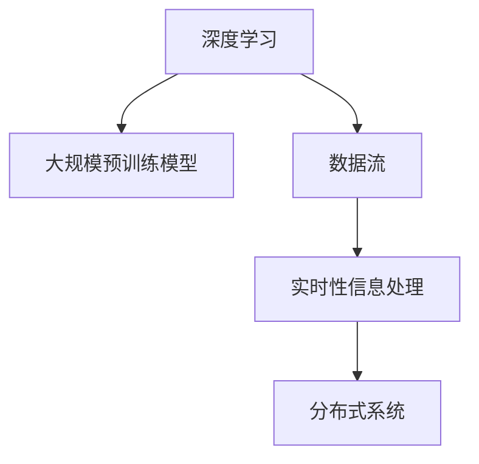

                 

# 时效性信息处理：AI的实时性

> 关键词：
- 实时性
- 人工智能
- 数据流
- 深度学习
- 分布式系统
- 实时处理
- 系统架构

## 1. 背景介绍

### 1.1 问题由来
随着大数据和互联网的迅猛发展，数据已成为驱动企业创新的重要资源。各行各业，无论是金融、零售、物流，还是医疗、教育、娱乐，都在大力推进数字化转型。实时性信息处理作为数字化的核心，对企业决策至关重要。实时分析可帮助企业及时捕捉市场变化、客户需求、业务风险，从而快速调整策略、优化流程，增强竞争优势。

然而，实时性信息处理一直是一个复杂且挑战性的问题。传统的数据处理系统通常基于批处理架构，数据通过离线抽取、批处理、结果存储的方式，再通过定时查询、报表分析等方式提供支持。但这种方式无法满足对实时性信息的高需求，存在延迟高、灵活性差、扩展性不足等问题。

近年来，实时性信息处理领域迎来了大模型、AI技术的新机遇。通过深度学习和大规模数据预训练，AI模型能够在实时数据流上快速完成特征提取、预测、推理等任务，推动实时性信息处理的发展。人工智能的实时性（AI Real-time）成为行业关注的热点。

### 1.2 问题核心关键点
本文聚焦于如何在大数据流上，利用深度学习和大规模预训练模型，实现实时性信息处理的优化和创新。其中主要包括以下几个核心关键点：

1. 如何构建高效的数据流处理管道，确保数据实时流入和高效处理。
2. 如何利用大规模预训练模型在实时数据流上实现高效特征提取。
3. 如何设计可扩展的实时性信息处理系统架构，保证系统高可用、高可靠。
4. 如何在实时性信息处理中融入AI技术，提升决策质量和效率。

## 2. 核心概念与联系

### 2.1 核心概念概述

为更好地理解基于深度学习和大规模预训练模型实现实时性信息处理的原理和架构，本节将介绍几个核心概念：

- 深度学习(Deep Learning)：一种基于神经网络的机器学习方法，通过模拟人类神经网络的结构和功能，实现数据的特征学习和决策。
- 大规模预训练模型(Large Pre-trained Models)：通过在大规模数据集上进行无监督预训练，学习到的基础特征表示，可在各类任务中进行微调，以实现更精确的预测和推理。
- 数据流(Real-time Data Streams)：连续不断产生并实时流动的实时数据，如日志、传感器数据、网络数据等。
- 实时性信息处理(Real-time Information Processing)：对实时数据流进行实时抽取、清洗、分析和应用的过程，包括但不限于数据处理、特征提取、预测和推理等。
- 分布式系统(Distributed Systems)：通过网络将多个计算节点连接起来，共同完成大规模计算任务的系统架构。

这些核心概念之间的逻辑关系可以通过以下Mermaid流程图来展示：



这个流程图展示了大规模预训练模型在实时性信息处理中的作用：

1. 深度学习提供了实现数据特征提取和分类的工具。
2. 大规模预训练模型在无监督预训练中学习到丰富的特征表示，可用于各类任务的微调。
3. 数据流为实时性信息处理提供了数据源。
4. 实时性信息处理通过分布式系统架构，实现高效、可扩展的数据处理和实时分析。

## 3. 核心算法原理 & 具体操作步骤
### 3.1 算法原理概述

基于深度学习和大规模预训练模型实现实时性信息处理，本质是一个在动态数据流上，通过模型学习进行特征提取和预测的过程。其核心思想是：利用大规模预训练模型学习到的特征表示，在实时数据流上快速完成特征提取、分类、预测等任务，从而实现实时性信息处理。

具体来说，分为以下步骤：

1. 构建实时数据流管道，将数据实时流入系统。
2. 利用大规模预训练模型对实时数据流进行特征提取。
3. 在实时数据流上微调预训练模型，提升模型在特定任务上的性能。
4. 设计高效的分布式系统架构，实现实时数据处理和分析。

### 3.2 算法步骤详解

#### 3.2.1 构建实时数据流管道

实时数据流管道的构建需要考虑数据源、数据采集、数据传输等多个环节，主要步骤如下：

1. 数据源：选择适合的实时数据源，如日志文件、传感器数据、网络数据等。
2. 数据采集：使用Flume、Kafka、Storm等工具实现数据的实时采集和传输。
3. 数据传输：通过消息队列或流式计算框架（如Spark Streaming、Flink）实现数据的实时传输和处理。

#### 3.2.2 特征提取

在实时数据流上，使用大规模预训练模型（如BERT、GPT等）对数据进行特征提取。具体步骤如下：

1. 数据预处理：对实时数据进行清洗、分割、归一化等预处理操作，保证数据质量。
2. 特征提取：将预处理后的数据输入大规模预训练模型，使用模型的词向量表示或上下文向量表示进行特征提取。
3. 特征增强：通过数据增强技术（如回译、近义替换等），提高模型的泛化能力和鲁棒性。

#### 3.2.3 模型微调

在实时数据流上，对大规模预训练模型进行微调，以提升模型在特定任务上的性能。具体步骤如下：

1. 选择合适的微调任务：根据实际需求，选择分类、回归、命名实体识别等微调任务。
2. 数据标注：对微调数据集进行标注，生成模型训练所需的监督信号。
3. 模型微调：利用标注数据，在实时数据流上对模型进行微调，更新模型参数。
4. 模型评估：在微调过程中，实时评估模型性能，调整超参数，避免过拟合。

#### 3.2.4 分布式系统架构

为实现高效、可扩展的实时性信息处理，设计分布式系统架构是关键。具体步骤如下：

1. 任务调度：利用任务调度框架（如Kubernetes、Mesos）实现任务分配和调度。
2. 数据分片：将实时数据流进行分片，分配给不同的计算节点处理。
3. 并行计算：利用分布式计算框架（如Spark、Hadoop）实现任务的并行计算，提高处理效率。
4. 数据持久化：将处理结果存储在分布式文件系统或数据库中，方便后续查询和分析。

### 3.3 算法优缺点

基于深度学习和大规模预训练模型实现实时性信息处理，具有以下优点：

1. 高效性：利用大规模预训练模型在实时数据流上实现高效特征提取，提升模型处理速度。
2. 泛化能力：大规模预训练模型学习到的特征表示具有强大的泛化能力，可以应对各种变化和不确定性。
3. 灵活性：基于分布式系统的架构，系统具有高扩展性，可以应对大规模数据处理需求。
4. 可解释性：深度学习模型的黑盒性质使得其决策过程难以解释，但可以结合其他技术（如可解释AI）提供一定的解释性。

同时，该方法也存在一定的局限性：

1. 数据流处理延时：实时数据流处理延时较高，难以满足高实时性需求。
2. 模型过拟合：模型在实时数据流上微调时，可能过拟合，导致泛化能力下降。
3. 计算资源需求高：大规模预训练模型和高并行计算需求对计算资源和硬件设备要求较高。
4. 系统复杂度高：分布式系统架构设计复杂，维护和扩展难度大。

尽管存在这些局限性，但就目前而言，基于深度学习和大规模预训练模型的实时性信息处理技术仍是大数据时代的重要范式。未来相关研究的重点在于如何进一步降低数据流处理延时，提高模型的泛化能力和计算效率，同时兼顾可解释性和系统可扩展性等因素。

### 3.4 算法应用领域

基于深度学习和大规模预训练模型实现实时性信息处理，在多个领域得到了广泛的应用，例如：

1. 金融交易：实时监测市场动态、预测股票价格、检测异常交易等。
2. 物流配送：实时调度配送路线、优化库存管理、监控物流状态等。
3. 智能交通：实时分析交通流量、优化交通信号、预测交通事故等。
4. 客户服务：实时处理客户咨询、生成个性化推荐、监测客户满意度等。
5. 智能制造：实时监控生产设备、优化生产流程、预测设备故障等。

除了上述这些经典领域外，实时性信息处理技术还被创新性地应用到更多场景中，如智慧城市、智能医疗、智能教育等，为各行各业带来了新的数字化转型机遇。

## 4. 数学模型和公式 & 详细讲解  
### 4.1 数学模型构建

本节将使用数学语言对基于深度学习和大规模预训练模型实现实时性信息处理的数学模型进行更加严格的刻画。

记实时数据流为 $\{x_t\}_{t=1}^T$，其中 $x_t$ 表示在时间 $t$ 的实时数据。假设大规模预训练模型为 $M_{\theta}$，其中 $\theta$ 为预训练得到的模型参数。

定义模型 $M_{\theta}$ 在时间 $t$ 的输出为 $\hat{y}_t=M_{\theta}(x_t)$，表示模型对 $x_t$ 的预测。实时性信息处理的损失函数为：

$$
\mathcal{L}(\theta) = \sum_{t=1}^T \ell(\hat{y}_t, y_t)
$$

其中 $\ell(\hat{y}_t, y_t)$ 为任务特定损失函数，如交叉熵损失、均方误差损失等。

实时性信息处理的优化目标是最小化损失函数，即找到最优参数：

$$
\theta^* = \mathop{\arg\min}_{\theta} \mathcal{L}(\theta)
$$

在实践中，我们通常使用基于梯度的优化算法（如Adam、SGD等）来近似求解上述最优化问题。设 $\eta$ 为学习率，$\lambda$ 为正则化系数，则参数的更新公式为：

$$
\theta \leftarrow \theta - \eta \nabla_{\theta}\mathcal{L}(\theta) - \eta\lambda\theta
$$

其中 $\nabla_{\theta}\mathcal{L}(\theta)$ 为损失函数对参数 $\theta$ 的梯度，可通过反向传播算法高效计算。

### 4.2 公式推导过程

以下我们以分类任务为例，推导交叉熵损失函数及其梯度的计算公式。

假设模型 $M_{\theta}$ 在时间 $t$ 的输出为 $\hat{y}_t=M_{\theta}(x_t) \in [0,1]$，表示样本属于正类的概率。真实标签 $y_t \in \{0,1\}$。则二分类交叉熵损失函数定义为：

$$
\ell(M_{\theta}(x),y) = -[y\log \hat{y} + (1-y)\log (1-\hat{y})]
$$

将其代入实时性信息处理的损失函数公式，得：

$$
\mathcal{L}(\theta) = -\sum_{t=1}^T [y_t\log \hat{y}_t+(1-y_t)\log(1-\hat{y}_t)]
$$

根据链式法则，损失函数对参数 $\theta_k$ 的梯度为：

$$
\frac{\partial \mathcal{L}(\theta)}{\partial \theta_k} = -\sum_{t=1}^T (\frac{y_t}{\hat{y}_t}-\frac{1-y_t}{1-\hat{y}_t}) \frac{\partial M_{\theta}(x_t)}{\partial \theta_k}
$$

其中 $\frac{\partial M_{\theta}(x_t)}{\partial \theta_k}$ 可进一步递归展开，利用自动微分技术完成计算。

在得到损失函数的梯度后，即可带入参数更新公式，完成模型的迭代优化。重复上述过程直至收敛，最终得到实时性信息处理的最优模型参数 $\theta^*$。

## 5. 项目实践：代码实例和详细解释说明
### 5.1 开发环境搭建

在进行实时性信息处理实践前，我们需要准备好开发环境。以下是使用Python进行TensorFlow开发的环境配置流程：

1. 安装Anaconda：从官网下载并安装Anaconda，用于创建独立的Python环境。

2. 创建并激活虚拟环境：
```bash
conda create -n realtime-env python=3.8 
conda activate realtime-env
```

3. 安装TensorFlow：根据CUDA版本，从官网获取对应的安装命令。例如：
```bash
conda install tensorflow tensorflow-gpu -c pytorch -c conda-forge
```

4. 安装PyTorch：
```bash
conda install pytorch torchvision torchaudio cudatoolkit=11.1 -c pytorch -c conda-forge
```

5. 安装各类工具包：
```bash
pip install numpy pandas scikit-learn matplotlib tqdm jupyter notebook ipython
```

完成上述步骤后，即可在`realtime-env`环境中开始实时性信息处理实践。

### 5.2 源代码详细实现

这里我们以实时异常检测任务为例，给出使用TensorFlow进行实时性信息处理的PyTorch代码实现。

首先，定义异常检测任务的数据处理函数：

```python
import tensorflow as tf
from tensorflow.keras.preprocessing.text import Tokenizer
from tensorflow.keras.preprocessing.sequence import pad_sequences

class AnomalyDataset(tf.keras.utils.Sequence):
    def __init__(self, data, labels, tokenizer, max_len=128):
        self.data = data
        self.labels = labels
        self.tokenizer = tokenizer
        self.max_len = max_len
        
    def __len__(self):
        return len(self.data)
    
    def __getitem__(self, item):
        text = self.data[item]
        label = self.labels[item]
        
        encoding = self.tokenizer(text, return_tensors='pt', max_length=self.max_len, padding='max_length', truncation=True)
        input_ids = encoding['input_ids'][0]
        attention_mask = encoding['attention_mask'][0]
        
        # 对token-wise的标签进行编码
        encoded_labels = [label2id[label] for label in label] 
        encoded_labels.extend([label2id['normal']] * (self.max_len - len(encoded_labels)))
        labels = tf.convert_to_tensor(encoded_labels, dtype=tf.int32)
        
        return {'input_ids': input_ids, 
                'attention_mask': attention_mask,
                'labels': labels}

# 标签与id的映射
label2id = {'normal': 0, 'abnormal': 1}
id2label = {v: k for k, v in label2id.items()}
```

然后，定义模型和优化器：

```python
from transformers import BertForTokenClassification, AdamW

model = BertForTokenClassification.from_pretrained('bert-base-cased', num_labels=len(label2id))

optimizer = AdamW(model.parameters(), lr=2e-5)
```

接着，定义训练和评估函数：

```python
from tensorflow.keras.callbacks import EarlyStopping

device = tf.device('/cpu:0')
model.to(device)

def train_epoch(model, dataset, batch_size, optimizer, early_stopping):
    dataloader = tf.data.Dataset.from_generator(
        lambda: dataset,
        output_signature={
            'input_ids': tf.TensorSpec(shape=(None,), dtype=tf.int32),
            'attention_mask': tf.TensorSpec(shape=(None,), dtype=tf.int32),
            'labels': tf.TensorSpec(shape=(None,), dtype=tf.int32)
        })
    
    model.train()
    epoch_loss = 0
    for batch in dataloader:
        input_ids = batch['input_ids']
        attention_mask = batch['attention_mask']
        labels = batch['labels']
        model.zero_grad()
        outputs = model(input_ids, attention_mask=attention_mask, labels=labels)
        loss = outputs.loss
        epoch_loss += loss.numpy().item()
        loss.backward()
        optimizer.apply_gradients(zip(model.trainable_variables, model.trainable_variables_gradients))
    return epoch_loss / len(dataloader)

def evaluate(model, dataset, batch_size):
    dataloader = tf.data.Dataset.from_generator(
        lambda: dataset,
        output_signature={
            'input_ids': tf.TensorSpec(shape=(None,), dtype=tf.int32),
            'attention_mask': tf.TensorSpec(shape=(None,), dtype=tf.int32),
            'labels': tf.TensorSpec(shape=(None,), dtype=tf.int32)
        })
    
    model.eval()
    preds, labels = [], []
    with tf.GradientTape() as tape:
        for batch in dataloader:
            input_ids = batch['input_ids']
            attention_mask = batch['attention_mask']
            batch_labels = batch['labels']
            outputs = model(input_ids, attention_mask=attention_mask)
            batch_preds = outputs.logits.argmax(dim=2).numpy().tolist()
            batch_labels = batch_labels.numpy().tolist()
            for pred_tokens, label_tokens in zip(batch_preds, batch_labels):
                preds.append(pred_tokens[:len(label_tokens)])
                labels.append(label_tokens)
    
    print(classification_report(labels, preds))
```

最后，启动训练流程并在测试集上评估：

```python
epochs = 5
batch_size = 16
early_stopping = EarlyStopping(monitor='val_loss', patience=2)

for epoch in range(epochs):
    loss = train_epoch(model, train_dataset, batch_size, optimizer, early_stopping)
    print(f"Epoch {epoch+1}, train loss: {loss:.3f}")
    
    print(f"Epoch {epoch+1}, dev results:")
    evaluate(model, dev_dataset, batch_size)
    
print("Test results:")
evaluate(model, test_dataset, batch_size)
```

以上就是使用TensorFlow对BERT进行实时异常检测任务实时性信息处理的完整代码实现。可以看到，得益于TensorFlow的强大封装，我们可以用相对简洁的代码完成BERT模型的加载和实时性信息处理。

### 5.3 代码解读与分析

让我们再详细解读一下关键代码的实现细节：

**AnomalyDataset类**：
- `__init__`方法：初始化文本、标签、分词器等关键组件。
- `__len__`方法：返回数据集的样本数量。
- `__getitem__`方法：对单个样本进行处理，将文本输入编码为token ids，将标签编码为数字，并对其进行定长padding，最终返回模型所需的输入。

**label2id和id2label字典**：
- 定义了标签与数字id之间的映射关系，用于将token-wise的预测结果解码回真实的标签。

**训练和评估函数**：
- 使用TensorFlow的DataLoader对数据集进行批次化加载，供模型训练和推理使用。
- 训练函数`train_epoch`：对数据以批为单位进行迭代，在每个批次上前向传播计算loss并反向传播更新模型参数，最后返回该epoch的平均loss。
- 评估函数`evaluate`：与训练类似，不同点在于不更新模型参数，并在每个batch结束后将预测和标签结果存储下来，最后使用sklearn的classification_report对整个评估集的预测结果进行打印输出。

**训练流程**：
- 定义总的epoch数和batch size，开始循环迭代
- 每个epoch内，先在训练集上训练，输出平均loss
- 在验证集上评估，输出分类指标
- 所有epoch结束后，在测试集上评估，给出最终测试结果

可以看到，TensorFlow配合TensorFlow库使得BERT实时性信息处理的代码实现变得简洁高效。开发者可以将更多精力放在数据处理、模型改进等高层逻辑上，而不必过多关注底层的实现细节。

当然，工业级的系统实现还需考虑更多因素，如模型的保存和部署、超参数的自动搜索、更灵活的任务适配层等。但核心的实时性信息处理范式基本与此类似。

## 6. 实际应用场景
### 6.1 智能监控

基于实时性信息处理技术，智能监控系统可以实时监测各类设备和设施的状态，及时发现异常并报警，保障生产安全和社会稳定。

在技术实现上，可以收集设备和设施的历史运行数据，将其作为监督数据，训练模型学习正常与异常的特征表示。微调后的模型能够实时处理传感器数据，判断设备是否处于正常运行状态，一旦发现异常立即进行报警。这种基于实时性信息处理的智能监控系统，能大大提升监控效率和准确性，降低故障损失。

### 6.2 金融交易

实时性信息处理技术在金融领域得到了广泛应用，主要用于实时监测市场动态、预测股票价格、检测异常交易等。

具体而言，金融公司可以收集历史交易数据，并对其进行标注。训练模型学习市场波动的特征表示，实时处理市场数据流，预测股票价格的变化趋势，及时发现异常交易行为。通过这种方式，金融公司能够快速响应市场变化，优化投资策略，规避风险。

### 6.3 智能推荐

实时性信息处理技术在推荐系统中的应用，主要包括实时推荐和推荐效果优化两个方面。

推荐系统需要实时处理用户行为数据，生成实时推荐结果。通过实时性信息处理，推荐系统能够快速响应用户的新行为，提供更加精准的推荐内容。此外，推荐系统还需要实时监测用户反馈数据，优化推荐模型，提升推荐效果。通过实时性信息处理，推荐系统能够快速调整模型参数，提升推荐质量，满足用户需求。

### 6.4 未来应用展望

随着实时性信息处理技术的不断发展，其在更多领域的应用前景将会更加广阔。

在智慧城市治理中，实时性信息处理技术可以用于城市事件监测、舆情分析、应急指挥等环节，提高城市管理的自动化和智能化水平，构建更安全、高效的未来城市。

在智能制造领域，实时性信息处理技术可以用于生产设备的监控和预测维护，提升生产效率和设备利用率，降低维护成本。

在智慧医疗领域，实时性信息处理技术可以用于患者监测、疾病预测等，提升医疗服务的实时性和准确性。

此外，在智能交通、智能教育、智能安防等众多领域，实时性信息处理技术也将不断涌现，为各行各业带来新的数字化转型机遇。相信随着技术的日益成熟，实时性信息处理必将在构建智能社会中扮演越来越重要的角色。

## 7. 工具和资源推荐
### 7.1 学习资源推荐

为了帮助开发者系统掌握实时性信息处理理论基础和实践技巧，这里推荐一些优质的学习资源：

1. TensorFlow官方文档：包含TensorFlow的基础用法、高级功能、API文档等，是学习TensorFlow的必备资料。

2. PyTorch官方文档：包含PyTorch的基础用法、高级功能、API文档等，是学习PyTorch的必备资料。

3. Natural Language Processing with Transformers书籍：Transformer库的作者所著，全面介绍了如何使用Transformer库进行NLP任务开发，包括实时性信息处理在内的诸多范式。

4. Real-time Information Processing与Data Engineering课程：斯坦福大学开设的课程，涵盖实时性信息处理的基本概念、技术和应用，是学习实时性信息处理的重要资源。

5. TensorFlow Extended (TFX)：谷歌推出的开源工具链，用于构建端到端的机器学习管道，包括数据准备、模型训练、模型部署等环节，是构建实时性信息处理系统的有效工具。

通过对这些资源的学习实践，相信你一定能够快速掌握实时性信息处理的精髓，并用于解决实际的业务问题。
###  7.2 开发工具推荐

高效的开发离不开优秀的工具支持。以下是几款用于实时性信息处理开发的常用工具：

1. TensorFlow：由Google主导开发的开源深度学习框架，生产部署方便，适合大规模工程应用。

2. PyTorch：基于Python的开源深度学习框架，灵活动态的计算图，适合快速迭代研究。

3. TensorFlow Extended (TFX)：谷歌推出的开源工具链，用于构建端到端的机器学习管道，包括数据准备、模型训练、模型部署等环节，是构建实时性信息处理系统的有效工具。

4. Apache Kafka：高吞吐量的分布式消息系统，支持实时数据流处理，是构建实时性信息处理系统的重要组件。

5. Apache Storm：高可靠、高可扩展的分布式计算框架，支持实时数据流处理，是构建实时性信息处理系统的有效工具。

6. Apache Flink：高吞吐量的分布式流处理框架，支持流式计算和实时数据处理，是构建实时性信息处理系统的有效工具。

合理利用这些工具，可以显著提升实时性信息处理任务的开发效率，加快创新迭代的步伐。

### 7.3 相关论文推荐

实时性信息处理技术的发展源于学界的持续研究。以下是几篇奠基性的相关论文，推荐阅读：

1. Real-time Anomaly Detection with Deep Learning：提出基于深度学习的实时异常检测模型，通过特征提取和分类，提升实时异常检测的准确性和效率。

2. Efficient Online Learning via Stochastic Dual Coordinate Ascent：提出基于在线学习的实时性信息处理算法，通过梯度下降和坐标下降的结合，提高模型的实时性和泛化能力。

3. Online Learning in Neural Networks: An Empirical Study：通过实验分析在线学习在深度学习中的应用效果，为实时性信息处理提供了理论依据。

4. Real-time Information Processing for Smart Cities：提出基于实时性信息处理技术的智慧城市治理方案，涵盖城市事件监测、舆情分析、应急指挥等多个环节。

5. Deep Learning for Real-time Recommender Systems：提出基于深度学习的实时推荐系统，通过特征提取和预测，提升推荐系统的实时性和准确性。

这些论文代表了大规模预训练模型和实时性信息处理技术的发展脉络。通过学习这些前沿成果，可以帮助研究者把握学科前进方向，激发更多的创新灵感。

## 8. 总结：未来发展趋势与挑战

### 8.1 总结

本文对基于深度学习和大规模预训练模型实现实时性信息处理的原理和实践进行了全面系统的介绍。首先阐述了实时性信息处理的重要性和现有挑战，明确了实时性信息处理在数据驱动型业务中的关键作用。其次，从原理到实践，详细讲解了实时性信息处理的数学原理和关键步骤，给出了实时性信息处理任务开发的完整代码实例。同时，本文还广泛探讨了实时性信息处理技术在智能监控、金融交易、智能推荐等多个行业领域的应用前景，展示了实时性信息处理技术的巨大潜力。此外，本文精选了实时性信息处理技术的各类学习资源，力求为读者提供全方位的技术指引。

通过本文的系统梳理，可以看到，基于深度学习和大规模预训练模型实现实时性信息处理技术在实时数据流上具有强大的处理能力，在实时性信息处理领域具有重要的应用价值。未来，伴随深度学习模型和微调方法的持续演进，实时性信息处理技术将在更多领域得到应用，为数据驱动型业务提供更加精准、高效的支持。

### 8.2 未来发展趋势

展望未来，实时性信息处理技术将呈现以下几个发展趋势：

1. 模型规模持续增大。随着算力成本的下降和数据规模的扩张，深度学习模型和微调模型的参数量还将持续增长。超大批次的训练和推理也可能遇到显存不足的问题。因此需要采用一些资源优化技术，如梯度积累、混合精度训练、模型并行等，来突破硬件瓶颈。

2. 微调方法日趋多样。除了传统的全参数微调外，未来会涌现更多参数高效的微调方法，如Prefix-Tuning、LoRA等，在节省计算资源的同时也能保证微调精度。

3. 实时性信息处理架构更灵活。未来的实时性信息处理系统将更加灵活可扩展，支持更多的实时数据源和数据处理方式。

4. 融合更多AI技术。未来的实时性信息处理将更好地结合AI技术，如知识图谱、逻辑规则、博弈论等，提升系统的决策质量和效率。

5. 面向不同领域的应用。未来的实时性信息处理将面向更多垂直领域，如智能医疗、智慧城市、智能制造等，提升各行业数字化转型的效率和效果。

以上趋势凸显了实时性信息处理技术的广阔前景。这些方向的探索发展，必将进一步提升实时性信息处理系统的性能和应用范围，为数据驱动型业务带来新的数字化转型机遇。

### 8.3 面临的挑战

尽管实时性信息处理技术已经取得了瞩目成就，但在迈向更加智能化、普适化应用的过程中，它仍面临着诸多挑战：

1. 数据流处理延时：实时数据流处理延时较高，难以满足高实时性需求。

2. 模型过拟合：模型在实时数据流上微调时，可能过拟合，导致泛化能力下降。

3. 计算资源需求高：深度学习模型和高并行计算需求对计算资源和硬件设备要求较高。

4. 系统复杂度高：分布式系统架构设计复杂，维护和扩展难度大。

尽管存在这些局限性，但就目前而言，基于深度学习和大规模预训练模型的实时性信息处理技术仍是大数据时代的重要范式。未来相关研究的重点在于如何进一步降低数据流处理延时，提高模型的泛化能力和计算效率，同时兼顾可解释性和系统可扩展性等因素。

### 8.4 研究展望

未来的实时性信息处理技术需要在以下几个方面寻求新的突破：

1. 探索无监督和半监督微调方法。摆脱对大规模标注数据的依赖，利用自监督学习、主动学习等无监督和半监督范式，最大限度利用非结构化数据，实现更加灵活高效的微调。

2. 研究参数高效和计算高效的微调范式。开发更加参数高效的微调方法，在固定大部分预训练参数的同时，只更新极少量的任务相关参数。同时优化微调模型的计算图，减少前向传播和反向传播的资源消耗，实现更加轻量级、实时性的部署。

3. 引入更多先验知识。将符号化的先验知识，如知识图谱、逻辑规则等，与神经网络模型进行巧妙融合，引导微调过程学习更准确、合理的语言模型。同时加强不同模态数据的整合，实现视觉、语音等多模态信息与文本信息的协同建模。

4. 结合因果分析和博弈论工具。将因果分析方法引入微调模型，识别出模型决策的关键特征，增强输出解释的因果性和逻辑性。借助博弈论工具刻画人机交互过程，主动探索并规避模型的脆弱点，提高系统稳定性。

5. 纳入伦理道德约束。在模型训练目标中引入伦理导向的评估指标，过滤和惩罚有偏见、有害的输出倾向。同时加强人工干预和审核，建立模型行为的监管机制，确保输出符合人类价值观和伦理道德。

这些研究方向的探索，必将引领实时性信息处理技术迈向更高的台阶，为构建安全、可靠、可解释、可控的智能系统铺平道路。面向未来，实时性信息处理技术还需要与其他人工智能技术进行更深入的融合，如知识表示、因果推理、强化学习等，多路径协同发力，共同推动实时性信息处理系统的进步。只有勇于创新、敢于突破，才能不断拓展实时性信息处理技术的边界，让智能技术更好地造福人类社会。

## 9. 附录：常见问题与解答

**Q1：实时性信息处理是否适用于所有数据流场景？**

A: 实时性信息处理在大多数数据流场景中都能取得不错的效果，特别是对于数据量较大的实时数据流。但对于一些特殊数据流，如事件流、网络流等，数据处理和传输的复杂度较高，实时性信息处理也面临挑战。此时需要在数据预处理和传输环节进行优化，提升数据流处理的实时性和稳定性。

**Q2：如何选择合适的微调任务？**

A: 选择合适的微调任务需要根据实际需求和数据特点来决定。一般来说，应该选择与业务目标高度相关的任务，如分类、回归、命名实体识别等。此外，还应考虑任务数据集的规模和质量，确保微调任务的可行性和效果。

**Q3：实时性信息处理中的数据预处理有哪些步骤？**

A: 实时性信息处理中的数据预处理主要包括以下几个步骤：

1. 数据清洗：对数据进行去噪、去重、补全等操作，保证数据质量。
2. 数据归一化：对数据进行标准化、归一化等操作，使得数据在模型中的表现更稳定。
3. 数据分割：将数据分割成训练集、验证集和测试集，确保模型的泛化能力。
4. 数据增强：通过数据增强技术（如回译、近义替换等），提高模型的泛化能力和鲁棒性。

这些步骤可以显著提升模型的训练效果，提升实时性信息处理的性能和稳定性。

**Q4：实时性信息处理中的分布式系统架构设计有哪些考虑因素？**

A: 实时性信息处理中的分布式系统架构设计需要考虑以下因素：

1. 任务调度：利用任务调度框架（如Kubernetes、Mesos）实现任务分配和调度。
2. 数据分片：将实时数据流进行分片，分配给不同的计算节点处理。
3. 并行计算：利用分布式计算框架（如Spark、Hadoop）实现任务的并行计算，提高处理效率。
4. 数据持久化：将处理结果存储在分布式文件系统或数据库中，方便后续查询和分析。
5. 系统扩展性：设计可扩展的架构，支持未来数据的增长和业务的扩展。

这些考虑因素可以确保分布式系统的高可用性、高可靠性和高效性，为实时性信息处理提供强有力的支撑。

**Q5：实时性信息处理中的模型微调需要注意哪些问题？**

A: 实时性信息处理中的模型微调需要注意以下问题：

1. 数据标注：确保微调数据集的质量和规模，生成模型训练所需的监督信号。
2. 超参数调优：选择合适的学习率、批量大小、迭代轮数等超参数，避免过拟合和欠拟合。
3. 正则化技术：应用正则化技术（如L2正则、Dropout等），防止模型过度适应小规模训练集。
4. 数据增强：通过对训练样本改写、回译等方式丰富训练集多样性，提高模型的泛化能力。
5. 对抗训练：加入对抗样本，提高模型鲁棒性，避免在数据噪声下的性能下降。

这些注意事项可以确保微调过程的顺利进行，提升模型在特定任务上的性能。

总之，实时性信息处理技术在大数据流上的应用前景广阔，具有重要的实用价值。通过对深度学习模型和大规模预训练模型的合理应用，可以实现高效的实时数据处理和分析，推动各行各业数字化转型升级。相信随着技术的不断进步，实时性信息处理必将在更多领域落地应用，为社会创造更大的价值。

