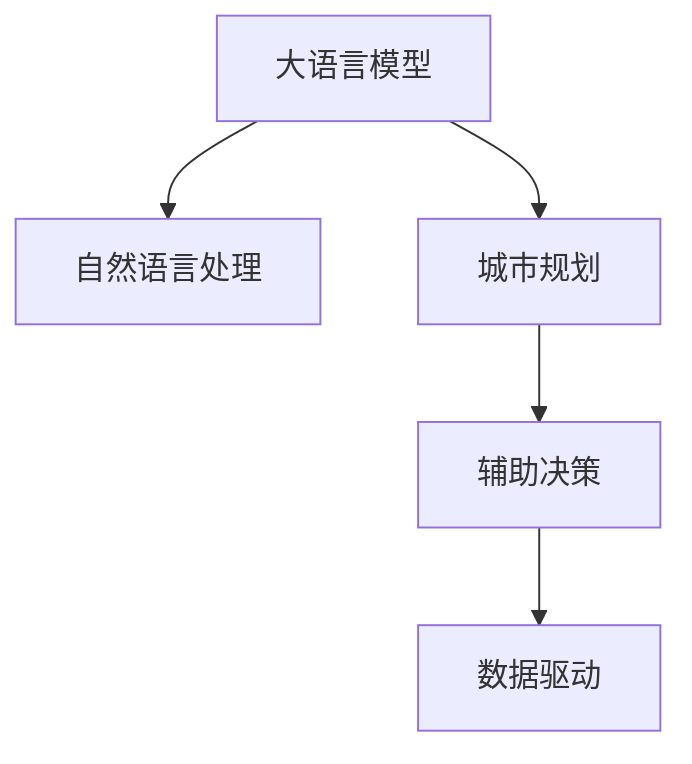

                 

# 智能城市规划：LLM辅助决策的新思路

> 关键词：智能城市, 语言模型, 自然语言处理, 城市规划, 辅助决策, 数据驱动

## 1. 背景介绍

### 1.1 问题由来
城市规划是现代城市发展的核心任务，直接影响着城市的环境质量、公共服务、经济发展和居民生活水平。然而，随着城市规模的扩大和复杂性的增加，传统规划方法面临诸多挑战，无法充分考虑到居民需求、生态环保、空间布局等多方面因素，导致规划方案难以获得广泛认可。

近年来，大数据、人工智能等技术不断融入城市规划，为传统规划方法带来了新思路。尤其是大语言模型（Large Language Model, LLM），通过自然语言处理（Natural Language Processing, NLP）技术，可以快速理解海量城市文本数据，提取有价值的信息和洞见，为城市规划提供决策支持。

### 1.2 问题核心关键点
基于语言模型的智能城市规划，通过将城市文本数据转化为结构化信息，辅助决策者快速理解城市现状、需求和趋势。主要问题包括：
1. 如何高效处理和整合海量城市文本数据？
2. 如何基于语义理解进行精细化的城市规划？
3. 如何避免语言模型输出偏见，确保规划决策的公正性？
4. 如何优化模型性能，确保规划方案的可持续性？

### 1.3 问题研究意义
通过大语言模型辅助城市规划，可以提升规划决策的科学性和公正性，优化资源配置，改善居民生活质量。具体意义包括：
1. 降低规划成本。自动化数据分析和决策支持，减少人力投入。
2. 提升决策效率。快速处理复杂数据，缩短决策时间。
3. 提高规划质量。基于语义理解和逻辑推理，生成更具前瞻性和针对性的规划方案。
4. 强化公众参与。通过自然语言交互，增强公众对规划过程的参与和监督。

## 2. 核心概念与联系

### 2.1 核心概念概述

为了更好地理解基于大语言模型的智能城市规划方法，本节将介绍几个密切相关的核心概念：

- 大语言模型（Large Language Model, LLM）：以自回归（如GPT）或自编码（如BERT）模型为代表的大规模预训练语言模型。通过在大规模无标签文本语料上进行预训练，学习通用的语言表示，具备强大的语言理解和生成能力。

- 自然语言处理（Natural Language Processing, NLP）：涉及计算机处理、理解和生成人类语言的技术，包括文本预处理、语义分析、情感识别、信息抽取等。

- 城市规划（Urban Planning）：通过科学、合理的规划设计，优化城市空间布局、功能分布、基础设施等，实现城市的可持续发展。

- 辅助决策（Decision Support）：通过数据驱动的技术手段，辅助决策者进行科学、公正、高效的决策过程。

- 数据驱动（Data-Driven）：基于数据的统计分析和模型预测，提升决策的科学性和准确性。

这些核心概念之间的逻辑关系可以通过以下Mermaid流程图来展示：



这个流程图展示了大语言模型、自然语言处理、城市规划、辅助决策和数据驱动之间的核心联系和逻辑关系。

## 3. 核心算法原理 & 具体操作步骤
### 3.1 算法原理概述

基于大语言模型的智能城市规划方法，主要通过以下步骤实现：

1. **数据收集**：收集与城市规划相关的各种文本数据，包括政策文件、研究报告、新闻报道、社交媒体评论等。
2. **数据预处理**：对收集的数据进行清洗、标注和转换，形成结构化数据。
3. **预训练模型选择**：选择合适的预训练语言模型，如BERT、GPT等，作为后续微调的基础。
4. **微调模型训练**：在特定任务上对预训练模型进行微调，如情感分析、命名实体识别、关系抽取等。
5. **辅助决策生成**：将微调后的模型应用于城市规划决策过程中，辅助生成科学、合理的规划方案。

### 3.2 算法步骤详解

#### 3.2.1 数据收集

城市规划涉及的数据来源广泛，包括政府文件、研究报告、社交媒体、新闻报道等。具体步骤包括：
1. **政策文件和规划报告**：收集各级政府和规划部门发布的政策文件、规划报告，涵盖土地利用、交通规划、公共设施建设等内容。
2. **学术论文和研究报告**：从学术数据库和期刊中收集与城市规划相关的研究报告、学术论文，获取最新的学术洞见和研究成果。
3. **社交媒体数据**：通过爬虫工具收集微博、微信、豆瓣等社交媒体平台上的用户评论和讨论，了解公众对城市规划的看法和需求。
4. **新闻报道和媒体文章**：从各大新闻网站和媒体平台收集与城市规划相关的新闻报道和评论文章，获取时事热点和公众关注点。

#### 3.2.2 数据预处理

数据预处理是确保数据质量和模型性能的重要环节，主要步骤包括：
1. **文本清洗**：去除文本中的噪音、无用信息和重复内容，保留有效信息。
2. **文本标注**：对文本进行标注，如实体识别、情感分析、关系抽取等，形成结构化数据。
3. **数据转换**：将文本数据转换为模型所需的格式，如分词、编码等。
4. **数据增强**：通过数据增强技术，如回译、近义词替换等，增加数据的多样性和丰富度。

#### 3.2.3 预训练模型选择

选择合适的预训练语言模型是实现智能城市规划的关键步骤，主要考虑模型规模、精度和适应性。常见模型包括：
1. **BERT**：基于双向Transformer的预训练模型，适用于多任务学习和多领域适应。
2. **GPT**：基于自回归Transformer的预训练模型，适用于生成式任务和情感分析。
3. **RoBERTa**：BERT的改进版本，优化了训练效率和泛化能力。
4. **XLNet**：基于自回归和自编码的预训练模型，提升了模型的因果关系建模能力。

#### 3.2.4 微调模型训练

在特定任务上对预训练模型进行微调，主要步骤包括：
1. **任务定义**：根据城市规划需求，定义微调任务，如情感分析、实体识别、关系抽取等。
2. **数据集划分**：将收集的数据集划分为训练集、验证集和测试集，用于模型训练、验证和测试。
3. **微调框架搭建**：使用深度学习框架（如PyTorch、TensorFlow）搭建微调框架，选择合适的损失函数和优化器。
4. **模型训练**：在训练集上训练模型，通过前向传播和反向传播更新模型参数，最小化损失函数。
5. **模型评估**：在验证集上评估模型性能，调整超参数和训练策略。
6. **模型测试**：在测试集上测试模型，评估模型在新数据上的泛化能力。

#### 3.2.5 辅助决策生成

将微调后的模型应用于城市规划决策过程，主要步骤包括：
1. **输入数据准备**：准备城市规划相关的文本数据，包括规划报告、政策文件、新闻报道等。
2. **模型输入处理**：将输入数据转换为模型所需的格式，如分词、编码等。
3. **模型推理**：将处理后的数据输入微调后的模型，得到输出结果。
4. **结果解析**：解析模型输出，提取关键信息，如情感倾向、实体识别、关系抽取等。
5. **辅助决策生成**：根据解析结果，生成科学、合理的城市规划方案，供决策者参考和选择。

### 3.3 算法优缺点

基于大语言模型的智能城市规划方法具有以下优点：
1. **高效处理海量数据**：大语言模型能够高效处理和整合海量城市文本数据，提升决策的科学性和公正性。
2. **快速获取新信息**：基于自然语言处理技术，能够实时获取和分析新的城市信息，保证规划方案的前瞻性和时效性。
3. **增强公众参与**：通过自然语言交互，增强公众对规划过程的参与和监督，提升规划方案的民主性和透明性。

同时，该方法也存在以下局限性：
1. **数据质量依赖性高**：数据收集和预处理质量直接影响模型性能，数据清洗和标注工作量较大。
2. **模型偏见问题**：大语言模型可能学习到数据中的偏见和歧视，影响规划决策的公正性。
3. **计算资源消耗高**：大语言模型需要较大的计算资源进行预训练和微调，对硬件要求较高。
4. **模型可解释性不足**：大语言模型输出结果缺乏可解释性，难以理解其推理逻辑。

尽管存在这些局限性，但就目前而言，基于大语言模型的智能城市规划方法仍是最具潜力的技术范式之一，有望推动城市规划向更加智能化和数据驱动的方向发展。

### 3.4 算法应用领域

基于大语言模型的智能城市规划方法，已经在多个实际应用场景中得到验证，主要领域包括：

1. **城市政策分析**：通过对政策文件和新闻报道的分析，了解政府政策导向和公众关注点，辅助制定科学、公正的城市规划政策。
2. **交通规划优化**：利用社交媒体数据和新闻报道，分析交通拥堵和出行需求，优化交通网络布局和公共交通系统。
3. **公共设施建设**：通过文本分析和实体识别，识别和优先建设居民需求强烈的城市公共设施，提升居民生活质量。
4. **环境治理与保护**：利用情感分析和文本挖掘技术，分析公众对环境问题的关注和意见，制定环保政策和规划措施。
5. **智慧城市建设**：通过自然语言处理和智能决策技术，构建智慧城市信息平台，提升城市管理的智能化水平。

除了这些经典应用外，智能城市规划技术还在城市应急管理、灾害预测、文化遗产保护等领域得到广泛应用，为城市规划和治理提供了新的技术手段和创新思路。

## 4. 数学模型和公式 & 详细讲解 & 举例说明

### 4.1 数学模型构建

假设城市规划问题可以形式化为多任务学习（Multitask Learning, MTL）框架，具体数学模型如下：

设 $D=\{(x_i, y_i)\}_{i=1}^N$ 为城市规划数据集，其中 $x_i$ 为输入文本，$y_i$ 为输出标签（如情感倾向、实体信息、关系抽取等）。

定义预训练语言模型为 $M_{\theta}$，其中 $\theta$ 为模型参数。微调任务为 $T=\{t_1, t_2, ..., t_m\}$，其中 $t_i$ 为第 $i$ 个微调任务。

微调的优化目标为最小化经验风险：

$$
\mathcal{L}(\theta) = \frac{1}{N}\sum_{i=1}^N \mathcal{L}_{t_i}(M_{\theta}(x_i),y_i)
$$

其中 $\mathcal{L}_{t_i}$ 为任务 $t_i$ 的损失函数，如交叉熵损失、均方误差损失等。

### 4.2 公式推导过程

以情感分析为例，假设模型 $M_{\theta}$ 在输入 $x_i$ 上的输出为 $\hat{y}_i=M_{\theta}(x_i) \in [0,1]$，表示样本属于正情感的概率。

二分类交叉熵损失函数定义为：

$$
\ell(M_{\theta}(x_i),y_i) = -[y_i\log \hat{y}_i + (1-y_i)\log (1-\hat{y}_i)]
$$

将其代入经验风险公式，得：

$$
\mathcal{L}(\theta) = -\frac{1}{N}\sum_{i=1}^N [y_i\log M_{\theta}(x_i)+(1-y_i)\log(1-M_{\theta}(x_i))]
$$

根据链式法则，损失函数对参数 $\theta_k$ 的梯度为：

$$
\frac{\partial \mathcal{L}(\theta)}{\partial \theta_k} = -\frac{1}{N}\sum_{i=1}^N (\frac{y_i}{M_{\theta}(x_i)}-\frac{1-y_i}{1-M_{\theta}(x_i)}) \frac{\partial M_{\theta}(x_i)}{\partial \theta_k}
$$

其中 $\frac{\partial M_{\theta}(x_i)}{\partial \theta_k}$ 可进一步递归展开，利用自动微分技术完成计算。

在得到损失函数的梯度后，即可带入参数更新公式，完成模型的迭代优化。重复上述过程直至收敛，最终得到适应城市规划任务的最优模型参数 $\theta^*$。

### 4.3 案例分析与讲解

#### 4.3.1 城市政策分析

假设目标是对城市政策文件进行情感分析，评估公众对政策的接受度和满意度。具体步骤包括：
1. **数据收集**：收集政府发布的政策文件和政策评论，如微博、微信上的公众评论。
2. **数据预处理**：对政策文件进行分词、去除停用词、标注实体等预处理步骤。
3. **模型选择**：选择BERT作为预训练模型，基于其良好的泛化能力和多任务学习性能。
4. **微调框架搭建**：使用PyTorch搭建微调框架，定义情感分析任务，选择交叉熵损失函数。
5. **模型训练**：在政策文件和评论数据集上训练微调模型，调整超参数和训练策略。
6. **结果评估**：在测试集上评估模型性能，分析政策文件的情感倾向。

#### 4.3.2 交通规划优化

假设目标是对城市交通拥堵情况进行分析，优化交通网络布局。具体步骤包括：
1. **数据收集**：收集社交媒体上的交通拥堵评论和新闻报道，获取城市交通的实时数据。
2. **数据预处理**：对文本数据进行清洗、标注实体、关系抽取等预处理步骤。
3. **模型选择**：选择GPT作为预训练模型，基于其生成能力和文本推理能力。
4. **微调框架搭建**：使用TensorFlow搭建微调框架，定义交通规划任务，选择均方误差损失函数。
5. **模型训练**：在交通评论和新闻报道数据集上训练微调模型，调整超参数和训练策略。
6. **结果评估**：在测试集上评估模型性能，分析交通拥堵的热点区域和优化建议。

## 5. 项目实践：代码实例和详细解释说明

### 5.1 开发环境搭建

在进行城市规划微调实践前，我们需要准备好开发环境。以下是使用Python进行PyTorch开发的环境配置流程：

1. 安装Anaconda：从官网下载并安装Anaconda，用于创建独立的Python环境。

2. 创建并激活虚拟环境：
```bash
conda create -n pytorch-env python=3.8 
conda activate pytorch-env
```

3. 安装PyTorch：根据CUDA版本，从官网获取对应的安装命令。例如：
```bash
conda install pytorch torchvision torchaudio cudatoolkit=11.1 -c pytorch -c conda-forge
```

4. 安装Transformers库：
```bash
pip install transformers
```

5. 安装各类工具包：
```bash
pip install numpy pandas scikit-learn matplotlib tqdm jupyter notebook ipython
```

完成上述步骤后，即可在`pytorch-env`环境中开始微调实践。

### 5.2 源代码详细实现

下面我们以城市政策分析为例，给出使用Transformers库对BERT模型进行微调的PyTorch代码实现。

首先，定义情感分析任务的数据处理函数：

```python
from transformers import BertTokenizer
from torch.utils.data import Dataset
import torch

class PolicyDataset(Dataset):
    def __init__(self, texts, tags, tokenizer, max_len=128):
        self.texts = texts
        self.tags = tags
        self.tokenizer = tokenizer
        self.max_len = max_len
        
    def __len__(self):
        return len(self.texts)
    
    def __getitem__(self, item):
        text = self.texts[item]
        tags = self.tags[item]
        
        encoding = self.tokenizer(text, return_tensors='pt', max_length=self.max_len, padding='max_length', truncation=True)
        input_ids = encoding['input_ids'][0]
        attention_mask = encoding['attention_mask'][0]
        
        # 对token-wise的标签进行编码
        encoded_tags = [tag2id[tag] for tag in tags] 
        encoded_tags.extend([tag2id['O']] * (self.max_len - len(encoded_tags)))
        labels = torch.tensor(encoded_tags, dtype=torch.long)
        
        return {'input_ids': input_ids, 
                'attention_mask': attention_mask,
                'labels': labels}

# 标签与id的映射
tag2id = {'O': 0, 'Positive': 1, 'Negative': 2}
id2tag = {v: k for k, v in tag2id.items()}

# 创建dataset
tokenizer = BertTokenizer.from_pretrained('bert-base-cased')

train_dataset = PolicyDataset(train_texts, train_tags, tokenizer)
dev_dataset = PolicyDataset(dev_texts, dev_tags, tokenizer)
test_dataset = PolicyDataset(test_texts, test_tags, tokenizer)
```

然后，定义模型和优化器：

```python
from transformers import BertForTokenClassification, AdamW

model = BertForTokenClassification.from_pretrained('bert-base-cased', num_labels=len(tag2id))

optimizer = AdamW(model.parameters(), lr=2e-5)
```

接着，定义训练和评估函数：

```python
from torch.utils.data import DataLoader
from tqdm import tqdm
from sklearn.metrics import classification_report

device = torch.device('cuda') if torch.cuda.is_available() else torch.device('cpu')
model.to(device)

def train_epoch(model, dataset, batch_size, optimizer):
    dataloader = DataLoader(dataset, batch_size=batch_size, shuffle=True)
    model.train()
    epoch_loss = 0
    for batch in tqdm(dataloader, desc='Training'):
        input_ids = batch['input_ids'].to(device)
        attention_mask = batch['attention_mask'].to(device)
        labels = batch['labels'].to(device)
        model.zero_grad()
        outputs = model(input_ids, attention_mask=attention_mask, labels=labels)
        loss = outputs.loss
        epoch_loss += loss.item()
        loss.backward()
        optimizer.step()
    return epoch_loss / len(dataloader)

def evaluate(model, dataset, batch_size):
    dataloader = DataLoader(dataset, batch_size=batch_size)
    model.eval()
    preds, labels = [], []
    with torch.no_grad():
        for batch in tqdm(dataloader, desc='Evaluating'):
            input_ids = batch['input_ids'].to(device)
            attention_mask = batch['attention_mask'].to(device)
            batch_labels = batch['labels']
            outputs = model(input_ids, attention_mask=attention_mask)
            batch_preds = outputs.logits.argmax(dim=2).to('cpu').tolist()
            batch_labels = batch_labels.to('cpu').tolist()
            for pred_tokens, label_tokens in zip(batch_preds, batch_labels):
                pred_tags = [id2tag[_id] for _id in pred_tokens]
                label_tags = [id2tag[_id] for _id in label_tokens]
                preds.append(pred_tags[:len(label_tags)])
                labels.append(label_tags)
                
    print(classification_report(labels, preds))
```

最后，启动训练流程并在测试集上评估：

```python
epochs = 5
batch_size = 16

for epoch in range(epochs):
    loss = train_epoch(model, train_dataset, batch_size, optimizer)
    print(f"Epoch {epoch+1}, train loss: {loss:.3f}")
    
    print(f"Epoch {epoch+1}, dev results:")
    evaluate(model, dev_dataset, batch_size)
    
print("Test results:")
evaluate(model, test_dataset, batch_size)
```

以上就是使用PyTorch对BERT进行城市政策分析任务微调的完整代码实现。可以看到，得益于Transformers库的强大封装，我们可以用相对简洁的代码完成BERT模型的加载和微调。

### 5.3 代码解读与分析

让我们再详细解读一下关键代码的实现细节：

**PolicyDataset类**：
- `__init__`方法：初始化文本、标签、分词器等关键组件。
- `__len__`方法：返回数据集的样本数量。
- `__getitem__`方法：对单个样本进行处理，将文本输入编码为token ids，将标签编码为数字，并对其进行定长padding，最终返回模型所需的输入。

**tag2id和id2tag字典**：
- 定义了标签与数字id之间的映射关系，用于将token-wise的预测结果解码回真实的标签。

**训练和评估函数**：
- 使用PyTorch的DataLoader对数据集进行批次化加载，供模型训练和推理使用。
- 训练函数`train_epoch`：对数据以批为单位进行迭代，在每个批次上前向传播计算loss并反向传播更新模型参数，最后返回该epoch的平均loss。
- 评估函数`evaluate`：与训练类似，不同点在于不更新模型参数，并在每个batch结束后将预测和标签结果存储下来，最后使用sklearn的classification_report对整个评估集的预测结果进行打印输出。

**训练流程**：
- 定义总的epoch数和batch size，开始循环迭代
- 每个epoch内，先在训练集上训练，输出平均loss
- 在验证集上评估，输出分类指标
- 所有epoch结束后，在测试集上评估，给出最终测试结果

可以看到，PyTorch配合Transformers库使得BERT微调的代码实现变得简洁高效。开发者可以将更多精力放在数据处理、模型改进等高层逻辑上，而不必过多关注底层的实现细节。

当然，工业级的系统实现还需考虑更多因素，如模型的保存和部署、超参数的自动搜索、更灵活的任务适配层等。但核心的微调范式基本与此类似。

## 6. 实际应用场景

### 6.1 智能交通管理

基于大语言模型的智能城市规划方法，已经在智能交通管理领域得到广泛应用，提升了交通系统的智能化和效率。具体应用包括：

- **交通流量预测**：利用社交媒体数据和新闻报道，预测城市交通流量变化，优化交通信号灯控制和路线规划。
- **交通事故分析**：通过情感分析和文本挖掘技术，分析公众对交通事故的意见和建议，提升交通安全管理水平。
- **公共交通优化**：利用文本分析和情感识别，评估公众对公共交通服务的满意度，优化线路和车辆配置。

### 6.2 环境污染监测

环境污染是城市规划中重要的挑战之一，大语言模型在环境监测和治理方面也展现出巨大的潜力。具体应用包括：

- **空气质量预测**：通过情感分析和文本挖掘技术，分析公众对空气质量的关注和反馈，预测空气质量变化趋势。
- **水质监测**：利用文本分析和实体识别，识别和定位水污染事件，提升环境治理效果。
- **垃圾分类管理**：通过文本分类和情感分析，识别居民对垃圾分类的意见和建议，优化垃圾分类措施。

### 6.3 公共设施建设

公共设施是城市规划中的关键要素，大语言模型在公共设施建设方面也有广泛应用。具体应用包括：

- **公共设施需求分析**：通过情感分析和文本挖掘技术，分析公众对公共设施的需求和意见，优化公共设施建设方案。
- **公共设施满意度评估**：利用文本分类和情感识别，评估公众对公共设施的满意度和使用体验，指导公共设施建设和管理。
- **公共设施安全监控**：通过文本分析和实体识别，识别和定位公共设施安全隐患，提升公共设施安全性。

### 6.4 未来应用展望

随着大语言模型和智能城市规划技术的不断发展，基于微调范式将在更多领域得到应用，为城市规划和治理带来新的思路和工具。

- **智慧能源管理**：利用自然语言处理和智能决策技术，构建智慧能源管理系统，优化能源消耗和分配。
- **智慧医疗服务**：通过文本分析和情感识别，评估公众对医疗服务的意见和建议，优化医疗服务质量。
- **智慧农业发展**：利用文本挖掘和情感分析，分析农民对农业政策的意见和建议，指导农业政策制定和农业技术推广。
- **智慧旅游服务**：通过文本分类和情感分析，评估公众对旅游服务的满意度和意见，提升旅游服务质量。

此外，在智慧教育、智慧政务、智慧金融等众多领域，基于大语言模型的智能城市规划技术也将不断涌现，为城市规划和治理提供新的技术手段和创新思路。

## 7. 工具和资源推荐

### 7.1 学习资源推荐

为了帮助开发者系统掌握大语言模型在智能城市规划中的应用，这里推荐一些优质的学习资源：

1. 《Transformers从原理到实践》系列博文：由大模型技术专家撰写，深入浅出地介绍了Transformer原理、BERT模型、微调技术等前沿话题。

2. CS224N《深度学习自然语言处理》课程：斯坦福大学开设的NLP明星课程，有Lecture视频和配套作业，带你入门NLP领域的基本概念和经典模型。

3. 《Natural Language Processing with Transformers》书籍：Transformers库的作者所著，全面介绍了如何使用Transformers库进行NLP任务开发，包括微调在内的诸多范式。

4. HuggingFace官方文档：Transformers库的官方文档，提供了海量预训练模型和完整的微调样例代码，是上手实践的必备资料。

5. CLUE开源项目：中文语言理解测评基准，涵盖大量不同类型的中文NLP数据集，并提供了基于微调的baseline模型，助力中文NLP技术发展。

通过对这些资源的学习实践，相信你一定能够快速掌握大语言模型在智能城市规划中的应用，并用于解决实际的NLP问题。

### 7.2 开发工具推荐

高效的开发离不开优秀的工具支持。以下是几款用于大语言模型在智能城市规划中的微调开发的常用工具：

1. PyTorch：基于Python的开源深度学习框架，灵活动态的计算图，适合快速迭代研究。大部分预训练语言模型都有PyTorch版本的实现。

2. TensorFlow：由Google主导开发的开源深度学习框架，生产部署方便，适合大规模工程应用。同样有丰富的预训练语言模型资源。

3. Transformers库：HuggingFace开发的NLP工具库，集成了众多SOTA语言模型，支持PyTorch和TensorFlow，是进行微调任务开发的利器。

4. Weights & Biases：模型训练的实验跟踪工具，可以记录和可视化模型训练过程中的各项指标，方便对比和调优。与主流深度学习框架无缝集成。

5. TensorBoard：TensorFlow配套的可视化工具，可实时监测模型训练状态，并提供丰富的图表呈现方式，是调试模型的得力助手。

6. Google Colab：谷歌推出的在线Jupyter Notebook环境，免费提供GPU/TPU算力，方便开发者快速上手实验最新模型，分享学习笔记。

合理利用这些工具，可以显著提升大语言模型在智能城市规划中的微调任务的开发效率，加快创新迭代的步伐。

### 7.3 相关论文推荐

大语言模型和智能城市规划方法的发展源于学界的持续研究。以下是几篇奠基性的相关论文，推荐阅读：

1. Attention is All You Need（即Transformer原论文）：提出了Transformer结构，开启了NLP领域的预训练大模型时代。

2. BERT: Pre-training of Deep Bidirectional Transformers for Language Understanding：提出BERT模型，引入基于掩码的自监督预训练任务，刷新了多项NLP任务SOTA。

3. Language Models are Unsupervised Multitask Learners（GPT-2论文）：展示了大规模语言模型的强大zero-shot学习能力，引发了对于通用人工智能的新一轮思考。

4. Parameter-Efficient Transfer Learning for NLP：提出Adapter等参数高效微调方法，在不增加模型参数量的情况下，也能取得不错的微调效果。

5. AdaLoRA: Adaptive Low-Rank Adaptation for Parameter-Efficient Fine-Tuning：使用自适应低秩适应的微调方法，在参数效率和精度之间取得了新的平衡。

6. Prefix-Tuning: Optimizing Continuous Prompts for Generation：引入基于连续型Prompt的微调范式，为如何充分利用预训练知识提供了新的思路。

这些论文代表了大语言模型在智能城市规划中的微调方法的发展脉络。通过学习这些前沿成果，可以帮助研究者把握学科前进方向，激发更多的创新灵感。

## 8. 总结：未来发展趋势与挑战

### 8.1 总结

本文对基于大语言模型的智能城市规划方法进行了全面系统的介绍。首先阐述了大语言模型和微调技术在城市规划中的应用背景和研究意义，明确了微调在提升城市规划科学性和公正性方面的独特价值。其次，从原理到实践，详细讲解了微调的数学原理和关键步骤，给出了微调任务开发的完整代码实例。同时，本文还广泛探讨了微调方法在智能交通管理、环境污染监测、公共设施建设等多个实际应用场景中的具体应用，展示了微调范式的巨大潜力。此外，本文精选了微调技术的各类学习资源，力求为读者提供全方位的技术指引。

通过本文的系统梳理，可以看到，基于大语言模型的智能城市规划方法正在成为城市规划的重要工具，极大地提升了规划决策的科学性和公正性，优化了资源配置，改善了居民生活质量。未来，伴随大语言模型和微调技术的不断发展，智能城市规划技术必将迎来更多创新突破，为城市规划和治理带来更多智能化的解决方案。

### 8.2 未来发展趋势

展望未来，大语言模型和智能城市规划技术将呈现以下几个发展趋势：

1. **模型规模持续增大**：随着算力成本的下降和数据规模的扩张，预训练语言模型的参数量还将持续增长。超大规模语言模型蕴含的丰富语言知识，有望支撑更加复杂多变的城市规划微调。

2. **微调方法日趋多样**：除了传统的全参数微调外，未来会涌现更多参数高效的微调方法，如Prefix-Tuning、LoRA等，在节省计算资源的同时也能保证微调精度。

3. **持续学习成为常态**：随着数据分布的不断变化，微调模型也需要持续学习新知识以保持性能。如何在不遗忘原有知识的同时，高效吸收新样本信息，将成为重要的研究课题。

4. **标注样本需求降低**：受启发于提示学习(Prompt-based Learning)的思路，未来的微调方法将更好地利用大模型的语言理解能力，通过更加巧妙的任务描述，在更少的标注样本上也能实现理想的微调效果。

5. **多模态微调崛起**：当前的微调主要聚焦于纯文本数据，未来会进一步拓展到图像、视频、语音等多模态数据微调。多模态信息的融合，将显著提升语言模型对现实世界的理解和建模能力。

6. **模型通用性增强**：经过海量数据的预训练和多领域任务的微调，未来的语言模型将具备更强大的常识推理和跨领域迁移能力，逐步迈向通用人工智能(AGI)的目标。

以上趋势凸显了大语言模型和智能城市规划方法的广阔前景。这些方向的探索发展，必将进一步提升城市规划的智能化水平，为城市规划和治理提供更科学、高效、公正的解决方案。

### 8.3 面临的挑战

尽管大语言模型和智能城市规划方法已经取得了瞩目成就，但在迈向更加智能化、普适化应用的过程中，它仍面临着诸多挑战：

1. **数据质量依赖性高**：数据收集和预处理质量直接影响模型性能，数据清洗和标注工作量较大。
2. **模型偏见问题**：大语言模型可能学习到数据中的偏见和歧视，影响规划决策的公正性。
3. **计算资源消耗高**：大语言模型需要较大的计算资源进行预训练和微调，对硬件要求较高。
4. **模型可解释性不足**：大语言模型输出结果缺乏可解释性，难以理解其推理逻辑。
5. **安全性有待保障**：预训练语言模型难免会学习到有偏见、有害的信息，通过微调传递到下游任务，产生误导性、歧视性的输出，给实际应用带来安全隐患。

尽管存在这些局限性，但就目前而言，基于大语言模型的智能城市规划方法仍是最具潜力的技术范式之一，有望推动城市规划向更加智能化和数据驱动的方向发展。

### 8.4 研究展望

面对大语言模型和智能城市规划方法所面临的种种挑战，未来的研究需要在以下几个方面寻求新的突破：

1. **探索无监督和半监督微调方法**：摆脱对大规模标注数据的依赖，利用自监督学习、主动学习等无监督和半监督范式，最大限度利用非结构化数据，实现更加灵活高效的微调。

2. **研究参数高效和计算高效的微调范式**：开发更加参数高效的微调方法，在固定大部分预训练参数的同时，只更新极少量的任务相关参数。同时优化微调模型的计算图，减少前向传播和反向传播的资源消耗，实现更加轻量级、实时性的部署。

3. **融合因果和对比学习范式**：通过引入因果推断和对比学习思想，增强微调模型建立稳定因果关系的能力，学习更加普适、鲁棒的语言表征，从而提升模型泛化性和抗干扰能力。

4. **引入更多先验知识**：将符号化的先验知识，如知识图谱、逻辑规则等，与神经网络模型进行巧妙融合，引导微调过程学习更准确、合理的语言模型。同时加强不同模态数据的整合，实现视觉、语音等多模态信息与文本信息的协同建模。

5. **结合因果分析和博弈论工具**：将因果分析方法引入微调模型，识别出模型决策的关键特征，增强输出解释的因果性和逻辑性。借助博弈论工具刻画人机交互过程，主动探索并规避模型的脆弱点，提高系统稳定性。

6. **纳入伦理道德约束**：在模型训练目标中引入伦理导向的评估指标，过滤和惩罚有偏见、有害的输出倾向。同时加强人工干预和审核，建立模型行为的监管机制，确保输出符合人类价值观和伦理道德。

这些研究方向的探索，必将引领大语言模型和智能城市规划方法迈向更高的台阶，为构建安全、可靠、可解释、可控的智能系统铺平道路。面向未来，大语言模型和智能城市规划技术还需要与其他人工智能技术进行更深入的融合，如知识表示、因果推理、强化学习等，多路径协同发力，共同推动自然语言理解和智能交互系统的进步。只有勇于创新、敢于突破，才能不断拓展语言模型的边界，让智能技术更好地造福人类社会。

## 9. 附录：常见问题与解答

**Q1：智能城市规划中微调模型的训练和评估流程是怎样的？**

A: 智能城市规划中微调模型的训练和评估流程主要包括以下步骤：

1. **数据收集**：收集与城市规划相关的各种文本数据，如政策文件、新闻报道、社交媒体评论等。
2. **数据预处理**：对收集的数据进行清洗、标注和转换，形成结构化数据。
3. **模型选择**：选择合适的预训练语言模型，如BERT、GPT等，作为后续微调的基础。
4. **微调框架搭建**：使用深度学习框架（如PyTorch、TensorFlow）搭建微调框架，选择合适的损失函数和优化器。
5. **模型训练**：在训练集上训练微调模型，通过前向传播和反向传播更新模型参数，最小化损失函数。
6. **模型评估**：在验证集上评估模型性能，调整超参数和训练策略。
7. **模型测试**：在测试集上测试模型，评估模型在新数据上的泛化能力。

**Q2：微调过程中如何避免过拟合？**

A: 微调过程中避免过拟合的主要策略包括：

1. **数据增强**：通过回译、近义词替换等方式扩充训练集，增加数据的多样性和丰富度。
2. **正则化技术**：使用L2正则、Dropout、Early Stopping等避免模型过度适应小规模训练集。
3. **对抗训练**：引入对抗样本，提高模型鲁棒性，防止过拟合。
4. **参数高效微调**：只调整少量模型参数，固定大部分预训练权重不变，减少需优化的参数，从而减小过拟合风险。

这些策略往往需要根据具体任务和数据特点进行灵活组合。只有在数据、模型、训练、推理等各环节进行全面优化，才能最大限度地发挥大语言模型的优势。

**Q3：智能城市规划中微调模型的效果如何评估？**

A: 智能城市规划中微调模型的效果评估主要通过以下几个指标：

1. **准确率（Accuracy）**：模型在测试集上的分类准确率，反映模型的泛化能力。
2. **召回率（Recall）**：模型在测试集上对正例的召回率，反映模型对重要信息的捕捉能力。
3. **F1值（F1 Score）**：准确率和召回率的调和平均数，综合评估模型的性能。
4. **精确度（Precision）**：模型在测试集上对正例的预测准确率，反映模型的预测能力。
5. **ROC曲线（Receiver Operating Characteristic Curve）**：绘制模型在不同阈值下的真正率与假正率曲线，评估模型的分类性能。

通过综合考虑这些指标，可以全面评估微调模型的性能，指导后续优化。

**Q4：智能城市规划中微调模型的部署和应用有哪些注意点？**

A: 智能城市规划中微调模型的部署和应用主要注意以下几点：

1. **模型裁剪**：去除不必要的层和参数，减小模型尺寸，加快推理速度。
2. **量化加速**：将浮点模型转为定点模型，压缩存储空间，提高计算效率。
3. **服务化封装**：将模型封装为标准化服务接口，便于集成调用。
4. **弹性伸缩**：根据请求流量动态调整资源配置，平衡服务质量和成本。
5. **监控告警**：实时采集系统指标，设置异常告警阈值，确保服务稳定性。
6. **安全防护**：采用访问鉴权、数据脱敏等措施，保障数据和模型安全。

合理利用这些技术手段，可以确保微调模型在实际应用中稳定、高效、安全地运行。

---

作者：禅与计算机程序设计艺术 / Zen and the Art of Computer Programming

