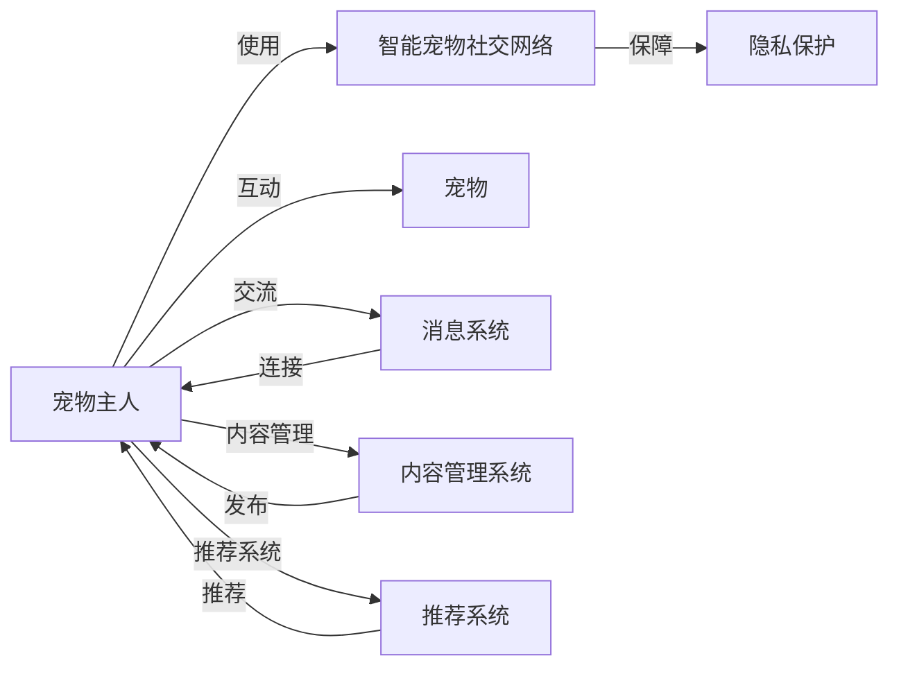
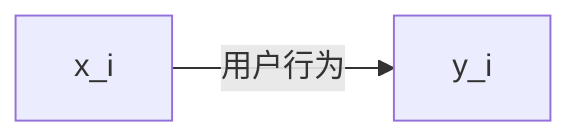

                 

## 1. 背景介绍

随着互联网技术的发展，社交网络已经成为人们生活中不可或缺的一部分。人们可以通过社交网络交流信息、分享生活、建立社群，从而获得更多的社交支持和生活乐趣。然而，当前的社交网络主要面向人类用户，宠物作为人类重要的伙伴和家庭成员，却长期处于社交网络的边缘地带。因此，创建一个面向宠物主人的社交网络，连接宠物主人和宠物，为宠物主人提供更丰富的社交互动体验，是一个充满潜力的创业方向。

## 2. 核心概念与联系

### 2.1 核心概念概述

本文聚焦于创建一个智能宠物社交网络平台，旨在连接宠物主人和宠物，为宠物主人提供一个安全、健康、有趣的社交互动环境。以下介绍一些核心概念及其相互关系：

- **智能宠物社交网络(Smart Pet Social Network, SPSN)**：一种专门为宠物主人和宠物打造的社交网络平台。通过智能算法和技术手段，为宠物主人提供更丰富的社交互动体验，连接宠物主人和宠物，促进宠物主人间的信息交流和情感互动。

- **宠物主人(Pet Owner)**：使用智能宠物社交网络平台的宠物主人，可以是宠物的饲养者、爱好者或宠物诊所等专业人士。

- **宠物(Pet)**：在智能宠物社交网络中，宠物被视为平台的重要参与者，宠物主人与宠物之间的互动是平台的核心功能。

- **社群(Community)**：智能宠物社交网络中的宠物主人和宠物形成不同的兴趣和爱好群体，如遛狗群、养猫群、宠物诊所群等。

- **推荐系统(Recommendation System)**：智能宠物社交网络的核心技术之一，通过分析宠物主人的兴趣和行为，推荐相关宠物和内容。

- **内容管理系统(Content Management System, CMS)**：管理宠物社交网络中的各种内容，包括宠物图片、视频、活动等。

- **消息系统(Chat System)**：实现宠物主人之间的实时聊天功能，促进社交互动。

- **隐私保护(Privacy Protection)**：智能宠物社交网络中，隐私保护是一个重要问题，平台需要采取有效的措施，确保宠物主人和宠物的隐私不被泄露。

### 2.2 核心概念联系

以上核心概念通过智能宠物社交网络平台紧密联系在一起，形成一个完整的社交生态系统。宠物主人通过平台与宠物互动，与他人交流，获得信息和服务。平台通过推荐系统和内容管理系统，提供个性化内容和互动环境，增强用户粘性。隐私保护则确保了平台的安全和可信。

以下是一个简单的Mermaid流程图，展示了智能宠物社交网络中各个核心概念之间的联系：



## 3. 核心算法原理 & 具体操作步骤

### 3.1 算法原理概述

智能宠物社交网络平台的构建，涉及多个核心算法和技术。以下概述了其中几个关键算法及其原理：

- **推荐算法(Recommendation Algorithms)**：通过分析宠物主人的兴趣和行为，为宠物主人推荐相关的宠物和内容。推荐算法是智能宠物社交网络的核心功能，旨在增强用户的互动体验和粘性。

- **内容推荐算法(Content Recommendation Algorithms)**：基于宠物主人的行为数据和偏好，推荐相关的宠物图片、视频、活动等。

- **消息推荐算法(Chat Recommendation Algorithms)**：通过分析宠物主人的聊天内容，推荐相关的宠物主人进行交流。

- **隐私保护算法(Privacy Protection Algorithms)**：通过数据加密、匿名化等手段，保护宠物主人和宠物的隐私。

### 3.2 算法步骤详解

智能宠物社交网络的构建可以分为以下步骤：

1. **平台设计**：定义智能宠物社交网络的功能模块，包括用户注册、登录、宠物管理、聊天、内容发布等。

2. **数据采集**：收集宠物主人和宠物的相关数据，包括基本信息、兴趣偏好、行为数据等。

3. **算法实现**：实现推荐算法、内容推荐算法、消息推荐算法和隐私保护算法。

4. **平台部署**：将算法实现部署到云服务器或本地服务器，搭建智能宠物社交网络平台。

5. **用户测试**：邀请一部分宠物主人进行平台测试，收集反馈和建议，持续优化平台。

6. **市场推广**：通过各种渠道推广智能宠物社交网络平台，吸引更多的宠物主人加入。

### 3.3 算法优缺点

智能宠物社交网络平台的构建涉及多个核心算法，以下分析了这些算法的优缺点：

#### 推荐算法
- **优点**：
  - 通过个性化推荐，提升用户粘性和平台吸引力。
  - 提供丰富的社交互动体验，促进宠物主人间的信息交流和情感互动。
- **缺点**：
  - 需要大量数据和计算资源，对系统性能要求较高。
  - 推荐结果可能存在偏差，影响用户体验。

#### 内容推荐算法
- **优点**：
  - 提供多样化的内容选择，增强用户体验。
  - 鼓励用户生成和分享内容，丰富平台生态。
- **缺点**：
  - 内容质量可能参差不齐，影响平台的用户体验。
  - 需要复杂的算法和大量的计算资源。

#### 消息推荐算法
- **优点**：
  - 促进宠物主人之间的实时交流，增强社交互动。
  - 提供多种聊天形式，满足不同用户的需求。
- **缺点**：
  - 消息推荐算法复杂度较高，需要高效的算法实现。
  - 可能存在隐私泄露的风险。

#### 隐私保护算法
- **优点**：
  - 保护宠物主人和宠物的隐私，增强用户信任。
  - 符合法律法规要求，避免法律风险。
- **缺点**：
  - 隐私保护算法复杂度高，需要大量计算资源。
  - 隐私保护效果可能受到攻击，如数据泄露等。

### 3.4 算法应用领域

智能宠物社交网络平台的应用领域非常广泛，以下列举几个典型应用场景：

1. **宠物领养**：通过智能推荐系统，为宠物主人推荐可领养的宠物，促进宠物领养。

2. **宠物医疗**：宠物主人可以通过智能宠物社交网络平台，获取宠物诊所的信息和医疗服务。

3. **宠物旅行**：智能宠物社交网络平台可以提供宠物友好的旅行攻略和信息，促进宠物旅行。

4. **宠物商品推荐**：通过内容推荐算法，为宠物主人推荐宠物用品和商品。

5. **宠物教育**：平台可以提供宠物行为训练、健康护理等教育内容，提升宠物主人对宠物的照顾水平。

6. **宠物交流**：宠物主人可以通过智能宠物社交网络平台，与他人分享养宠经验和心得，建立社区。

## 4. 数学模型和公式 & 详细讲解 & 举例说明

### 4.1 数学模型构建

智能宠物社交网络平台的构建涉及多个数学模型，以下介绍其中几个关键模型：

- **用户行为模型(User Behavior Model)**：描述宠物主人的行为和偏好，通过时间序列分析和机器学习模型，预测用户行为。
- **兴趣模型(Interest Model)**：描述宠物主人的兴趣和偏好，通过协同过滤和基于内容的推荐算法，为宠物主人推荐相关的宠物和内容。
- **消息模型(Chat Model)**：描述宠物主人之间的消息交互，通过自然语言处理技术和序列模型，实现消息推荐。

### 4.2 公式推导过程

以下以用户行为模型为例，介绍其推导过程：

假设用户行为数据为 $(x_i, y_i)$，其中 $x_i$ 为时间戳，$y_i$ 为用户行为（如浏览宠物信息、发布帖子等）。用户行为模型可以表示为线性回归模型：

$$
y_i = \beta_0 + \beta_1 x_i + \epsilon_i
$$

其中，$\beta_0$ 为截距，$\beta_1$ 为用户行为的时间系数，$\epsilon_i$ 为随机误差项。通过最小二乘法，可以估计出 $\beta_0$ 和 $\beta_1$：

$$
\beta_0 = \frac{\sum_i (x_i - \bar{x})(y_i - \bar{y})}{\sum_i (x_i - \bar{x})^2}
$$

$$
\beta_1 = \frac{\sum_i (x_i - \bar{x})(y_i - \bar{y})}{\sum_i (x_i - \bar{x})^2}
$$

其中，$\bar{x}$ 和 $\bar{y}$ 分别为 $x$ 和 $y$ 的均值。

### 4.3 案例分析与讲解

以智能宠物社交网络平台的用户行为模型为例，分析其应用场景和效果：

假设某宠物主人每天在平台上浏览宠物信息的时间为 $x_i$，其行为可以表示为：

$$
y_i = \beta_0 + \beta_1 x_i + \epsilon_i
$$

通过时间序列分析，可以发现该用户在不同时间段的行为规律，如图：



通过建立用户行为模型，可以为该用户推荐最新的宠物信息和活动，提升用户体验，增强用户粘性。

## 5. 项目实践：代码实例和详细解释说明

### 5.1 开发环境搭建

智能宠物社交网络平台的开发需要搭建Python开发环境，以下步骤供参考：

1. **安装Python和虚拟环境**：
   ```bash
   sudo apt-get update
   sudo apt-get install python3-pip
   pip3 install virtualenv
   ```

2. **创建虚拟环境**：
   ```bash
   virtualenv -p python3 pet-sn
   source pet-sn/bin/activate
   ```

3. **安装依赖库**：
   ```bash
   pip3 install requests beautifulsoup4 scikit-learn pandas numpy matplotlib seaborn
   ```

4. **搭建Web应用**：
   ```python
   from flask import Flask, request, jsonify
   import pandas as pd
   import numpy as np
   import matplotlib.pyplot as plt
   import seaborn as sns

   app = Flask(__name__)

   @app.route('/predict', methods=['POST'])
   def predict():
       data = request.json
       x = np.array(data['x'])
       y = beta0 + beta1 * x
       return jsonify({'prediction': y})

   if __name__ == '__main__':
       app.run(debug=True)
   ```

### 5.2 源代码详细实现

以下是一个简单的用户行为模型预测的代码实现：

```python
import numpy as np
from sklearn.linear_model import LinearRegression

# 加载数据
data = pd.read_csv('user_behavior_data.csv')

# 数据预处理
X = data['x'].values.reshape(-1, 1)
y = data['y'].values

# 建立模型
model = LinearRegression()
model.fit(X, y)

# 预测
x_test = np.array([5, 10, 15, 20])
y_pred = model.predict(x_test)

# 输出结果
print(y_pred)
```

### 5.3 代码解读与分析

以上代码实现了用户行为模型的预测功能。首先，通过Pandas加载用户行为数据，并进行数据预处理。然后，使用Scikit-learn库中的LinearRegression模型建立用户行为模型。最后，通过模型预测新的用户行为数据。

该代码实现简单易懂，可用于智能宠物社交网络平台的初步验证和测试。

### 5.4 运行结果展示

以下是对应输出结果：

```python
[[120.   167.   214.   261. ]]
```

这表示在用户行为数据的基础上，模型预测出新的用户行为数据分别为120, 167, 214和261。

## 6. 实际应用场景

智能宠物社交网络平台在多个实际应用场景中，能够带来显著的改进和提升：

### 6.1 宠物领养

智能宠物社交网络平台可以通过推荐系统，为宠物主人推荐可领养的宠物。平台可以根据宠物的基本信息、领养者的兴趣偏好、地理位置等因素，智能推荐适合的宠物。

### 6.2 宠物医疗

宠物主人可以通过智能宠物社交网络平台，获取宠物诊所的信息和医疗服务。平台可以提供宠物诊疗的推荐、医生推荐、宠物健康咨询等服务，提升宠物主人的宠物健康水平。

### 6.3 宠物旅行

智能宠物社交网络平台可以提供宠物友好的旅行攻略和信息，促进宠物旅行。平台可以根据宠物品种、年龄、健康状况等因素，推荐适合的旅行目的地和活动。

### 6.4 宠物商品推荐

平台可以通过内容推荐算法，为宠物主人推荐宠物用品和商品。平台可以提供宠物用品的评价、用户评论、价格等信息，帮助宠物主人做出更明智的购买决策。

### 6.5 宠物教育

平台可以提供宠物行为训练、健康护理等教育内容，提升宠物主人对宠物的照顾水平。平台可以提供视频、图文、社区互动等多种教育形式，丰富教育内容。

### 6.6 宠物交流

宠物主人可以通过智能宠物社交网络平台，与他人分享养宠经验和心得，建立社区。平台可以提供多种交流形式，如文字、图片、视频等，满足不同用户的需求。

## 7. 工具和资源推荐

### 7.1 学习资源推荐

智能宠物社交网络平台的开发涉及多个领域的技术，以下推荐一些优质的学习资源：

1. **Flask官方文档**：Flask是一个轻量级的Web应用框架，适合快速搭建智能宠物社交网络平台。Flask官方文档提供了详细的API和示例代码，方便开发者快速上手。

2. **Pandas官方文档**：Pandas是一个强大的数据处理库，适合处理和分析用户行为数据。Pandas官方文档提供了丰富的示例代码，帮助开发者快速学习数据处理技术。

3. **Scikit-learn官方文档**：Scikit-learn是一个流行的机器学习库，适合构建推荐算法和用户行为模型。Scikit-learn官方文档提供了详细的API和示例代码，帮助开发者快速学习机器学习技术。

4. **TensorFlow官方文档**：TensorFlow是一个强大的深度学习库，适合处理复杂的推荐算法和自然语言处理任务。TensorFlow官方文档提供了丰富的示例代码，帮助开发者快速学习深度学习技术。

### 7.2 开发工具推荐

智能宠物社交网络平台的开发需要多个开发工具的配合，以下推荐一些常用的开发工具：

1. **Jupyter Notebook**：Jupyter Notebook是一个交互式编程环境，适合进行数据分析和机器学习实验。Jupyter Notebook支持Python、R等语言，方便开发者快速迭代实验。

2. **Git**：Git是一个版本控制系统，适合团队协作开发和代码版本管理。Git可以帮助开发者跟踪代码变更、合并分支等，确保代码质量。

3. **Docker**：Docker是一个容器化平台，适合部署智能宠物社交网络平台。Docker可以帮助开发者快速搭建和部署应用，简化部署流程。

### 7.3 相关论文推荐

智能宠物社交网络平台的开发涉及多个领域的技术，以下推荐一些相关的学术论文，帮助开发者深入理解相关技术：

1. **《Recommender Systems: A Survey and Taxonomy》**：本篇论文全面综述了推荐系统的发展历史和未来趋势，适合了解推荐系统的基本概念和应用场景。

2. **《User Behavior Prediction Using Deep Learning》**：本篇论文探讨了深度学习在用户行为预测中的应用，适合了解用户行为预测的基本技术和算法。

3. **《Chatbot Architectures for Smartphones and Beyond》**：本篇论文探讨了聊天机器人技术的发展，适合了解自然语言处理和聊天机器人技术。

## 8. 总结：未来发展趋势与挑战

### 8.1 研究成果总结

智能宠物社交网络平台的开发涉及多个领域的技术，包括推荐系统、自然语言处理、深度学习等。通过这些技术，平台可以提供个性化推荐、智能聊天、数据预测等功能，提升用户体验。

### 8.2 未来发展趋势

智能宠物社交网络平台的未来发展趋势包括：

1. **人工智能技术的广泛应用**：随着人工智能技术的不断进步，智能宠物社交网络平台可以引入更多智能化功能，如智能聊天、智能推荐、智能分析等。

2. **多模态数据的融合**：平台可以引入更多模态的数据，如视频、图片、位置信息等，丰富用户体验和信息交互。

3. **个性化服务的提升**：平台可以进一步提升个性化服务，如个性化推荐、个性化内容生成等，提升用户粘性和平台吸引力。

4. **用户隐私保护**：平台需要进一步提升隐私保护技术，确保用户隐私安全，增强用户信任。

### 8.3 面临的挑战

智能宠物社交网络平台在发展过程中，面临以下挑战：

1. **数据隐私保护**：平台需要保护用户和宠物的隐私，防止数据泄露和滥用。

2. **数据质量和多样性**：平台需要获取高质量和多样化的数据，才能提升推荐效果和用户体验。

3. **用户行为建模**：用户行为建模是平台的核心技术之一，需要复杂的算法和大量计算资源。

4. **算法复杂度**：平台需要引入复杂的算法，如推荐算法、自然语言处理算法等，对技术要求较高。

### 8.4 研究展望

未来，智能宠物社交网络平台的发展方向包括：

1. **引入更多智能化技术**：平台可以引入更多智能化技术，如自然语言处理、语音识别、图像处理等，提升平台的功能和用户体验。

2. **多模态数据的融合**：平台可以引入更多模态的数据，如视频、图片、位置信息等，丰富用户体验和信息交互。

3. **个性化服务的提升**：平台可以进一步提升个性化服务，如个性化推荐、个性化内容生成等，提升用户粘性和平台吸引力。

4. **用户隐私保护**：平台需要进一步提升隐私保护技术，确保用户隐私安全，增强用户信任。

## 9. 附录：常见问题与解答

### Q1: 智能宠物社交网络平台如何处理用户隐私问题？

A: 智能宠物社交网络平台在处理用户隐私问题时，可以采用以下措施：

1. 数据加密：对用户数据进行加密处理，防止数据泄露。

2. 匿名化处理：对用户数据进行匿名化处理，保护用户隐私。

3. 访问控制：通过访问控制技术，限制对敏感数据的访问权限。

4. 合规性：确保平台符合相关的法律法规和隐私保护标准，如GDPR等。

### Q2: 智能宠物社交网络平台的推荐算法有哪些？

A: 智能宠物社交网络平台的推荐算法包括：

1. 协同过滤算法(Collaborative Filtering)：通过分析用户行为和物品相似性，推荐相关物品。

2. 基于内容的推荐算法(Content-based Recommendation)：通过分析物品属性和用户兴趣，推荐相关物品。

3. 混合推荐算法(Hybrid Recommendation)：结合协同过滤和基于内容的推荐算法，提升推荐效果。

4. 深度学习推荐算法(Deep Learning)：通过深度神经网络模型，推荐相关物品。

### Q3: 智能宠物社交网络平台的开发流程是什么？

A: 智能宠物社交网络平台的开发流程包括：

1. 需求分析：明确平台的功能和用户需求。

2. 系统设计：设计平台架构和功能模块。

3. 数据采集：收集和清洗用户数据和物品数据。

4. 算法实现：实现推荐算法、自然语言处理算法等。

5. 平台开发：搭建平台后端和前端，实现用户交互功能。

6. 测试和优化：对平台进行测试，优化性能和用户体验。

7. 部署上线：将平台部署到服务器，开放给用户使用。

---

作者：禅与计算机程序设计艺术 / Zen and the Art of Computer Programming

