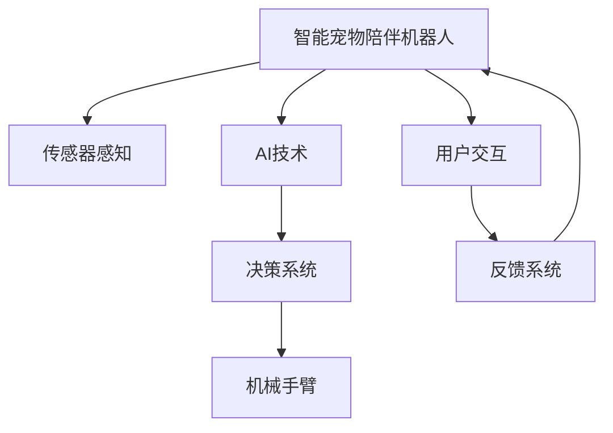

                 

# 智能宠物陪伴机器人创业：科技宠物的新定义

> 关键词：智能宠物、陪伴机器人、科技宠物、AI技术、用户交互、市场分析

## 1. 背景介绍

随着宠物数量的增加和人类生活节奏的加快，智能宠物陪伴机器人的市场需求日益旺盛。不同于传统的宠物玩具和猫狗喂食器，智能宠物陪伴机器人能够实时监控宠物状态、陪伴互动、训练指导，成为宠物主人的得力助手。本文章旨在通过深入分析智能宠物陪伴机器人的技术原理、核心算法、应用场景等，探索该领域的创业机会和前景。

## 2. 核心概念与联系

### 2.1 核心概念概述

为了更好地理解智能宠物陪伴机器人，我们将介绍几个核心概念：

- **智能宠物陪伴机器人**：通过集成传感器、AI技术、机械手臂等组件，具备感知、互动、训练、陪伴等多种功能的机器人。与传统的宠物玩具相比，智能宠物陪伴机器人可以自主感知宠物的生理和行为状态，智能生成交互内容，提升宠物生活质量。

- **AI技术**：包括机器学习、计算机视觉、自然语言处理、深度学习等，用于智能宠物陪伴机器人的感知、决策、交互和训练等环节。

- **用户交互**：指用户与智能宠物陪伴机器人的互动过程，包括语音、动作、数据等多种形式。通过良好的用户交互设计，智能宠物陪伴机器人可以更好地理解和响应用户需求。

- **市场分析**：分析当前智能宠物陪伴机器人的市场规模、增长潜力、用户需求、竞争态势等，为创业决策提供数据支持。

### 2.2 核心概念原理和架构的 Mermaid 流程图(Mermaid 流程节点中不要有括号、逗号等特殊字符)


## 3. 核心算法原理 & 具体操作步骤

### 3.1 算法原理概述

智能宠物陪伴机器人通常包括感知、决策、交互、训练等多个模块。各模块的算法原理如下：

- **感知模块**：通过摄像头、麦克风、传感器等组件，实时采集宠物的生理和行为数据。通过计算机视觉、语音识别等技术，对采集到的数据进行处理和分析，实现对宠物状态的感知。

- **决策模块**：根据感知模块提供的数据，结合预设的算法和规则，智能生成交互内容。例如，当感知到宠物需要玩耍时，决策模块可以生成相应的游戏任务。

- **交互模块**：通过机械手臂、语音交互等形式，与宠物进行互动。交互模块的设计需要考虑宠物的喜好和行为习惯，以保证互动的有效性和安全性。

- **训练模块**：通过与宠物的互动，不断调整算法和策略，提升机器人的智能水平。训练模块通常使用强化学习、监督学习等方法，使得机器人能够从互动中学习和优化。

### 3.2 算法步骤详解

智能宠物陪伴机器人的开发流程如下：

1. **需求分析**：明确机器人的功能和用户需求，设计合理的交互界面和交互内容。

2. **硬件设计**：选择合适的传感器、机械臂等硬件组件，并进行集成和调试。

3. **软件实现**：开发感知、决策、交互和训练模块的算法代码，并进行测试和优化。

4. **用户交互设计**：设计合理的用户交互界面，实现语音、动作等多种形式的交互。

5. **测试和验证**：在实际环境中测试机器人的性能，收集反馈并优化算法。

6. **市场推广**：进行市场分析和推广策略制定，进入目标市场。

### 3.3 算法优缺点

智能宠物陪伴机器人具有以下优点：

- **提升宠物生活质量**：通过智能感知和互动，使宠物获得更多陪伴和训练，提升生活质量。

- **降低主人负担**：机器人可以自动监控宠物状态，减少主人的日常负担。

- **技术创新性**：结合传感器、AI技术、机械臂等多种先进技术，具有较高的技术含量和创新性。

但同时也存在一些缺点：

- **成本较高**：高品质的传感器和机械臂等硬件设备价格较高，导致机器人成本偏高。

- **依赖技术成熟度**：机器人功能实现依赖于感知、决策、交互等多个技术的成熟度，如果某一技术未能突破，可能影响整体性能。

- **用户体验待提升**：用户对交互内容和界面设计的期望较高，需要不断优化用户体验。

### 3.4 算法应用领域

智能宠物陪伴机器人在多个领域具有应用潜力：

- **家庭宠物陪伴**：成为家庭宠物的“伙伴”，提供游戏、训练、陪伴等多种服务。

- **宠物店和动物医院**：帮助宠物店和医院进行客户咨询、宠物互动等，提升用户体验。

- **宠物训练和康复**：通过交互和训练功能，帮助宠物进行行为矫正、康复训练等。

- **宠物食品和保健品销售**：结合机器人的感知和推荐算法，推广宠物食品和保健品。

## 4. 数学模型和公式 & 详细讲解 & 举例说明

### 4.1 数学模型构建

智能宠物陪伴机器人的算法模型可以构建为：

$$
\text{PetCompanion} = \text{Sensor} \times \text{AI} \times \text{Interaction} \times \text{Training}
$$

其中：

- **Sensor**：传感器感知模块，用于获取宠物的生理和行为数据。

- **AI**：AI技术模块，用于处理和分析感知数据，生成交互内容。

- **Interaction**：交互模块，用于与宠物进行互动。

- **Training**：训练模块，用于优化算法和策略。

### 4.2 公式推导过程

以感知模块为例，假设传感器采集到的数据为$x_1, x_2, ..., x_n$，使用感知算法$f$进行处理，得到处理结果$y$。公式推导如下：

$$
y = f(x_1, x_2, ..., x_n)
$$

其中，$f$可以表示为：

$$
f = \text{计算机视觉算法} \times \text{语音识别算法} \times \text{传感器数据融合算法}
$$

### 4.3 案例分析与讲解

假设一个智能宠物陪伴机器人需要进行宠物行为的检测和识别。可以采用计算机视觉算法，对摄像头采集的宠物视频进行分析，检测宠物的行为模式。例如，通过目标检测算法，识别宠物是否在玩耍、休息或睡眠，从而生成相应的交互内容。

## 5. 项目实践：代码实例和详细解释说明

### 5.1 开发环境搭建

1. **选择编程语言和框架**：选择Python作为开发语言，使用TensorFlow或PyTorch框架进行深度学习模型的开发。

2. **安装必要的软件包**：安装摄像头、麦克风、传感器等硬件驱动，以及TensorFlow或PyTorch等库。

3. **搭建开发环境**：搭建Python虚拟环境，安装所需的依赖包。

### 5.2 源代码详细实现

以计算机视觉模块为例，代码实现如下：

```python
import tensorflow as tf
import cv2

class PetDetection(tf.keras.Model):
    def __init__(self):
        super(PetDetection, self).__init__()
        self.model = tf.keras.Sequential([
            tf.keras.layers.Conv2D(32, (3, 3), activation='relu', input_shape=(224, 224, 3)),
            tf.keras.layers.MaxPooling2D((2, 2)),
            tf.keras.layers.Conv2D(64, (3, 3), activation='relu'),
            tf.keras.layers.MaxPooling2D((2, 2)),
            tf.keras.layers.Conv2D(128, (3, 3), activation='relu'),
            tf.keras.layers.MaxPooling2D((2, 2)),
            tf.keras.layers.Flatten(),
            tf.keras.layers.Dense(512, activation='relu'),
            tf.keras.layers.Dense(3, activation='softmax')
        ])

    def call(self, x):
        x = self.model(x)
        return x
```

### 5.3 代码解读与分析

上述代码实现了一个简单的计算机视觉模型，用于检测宠物的行为。模型使用了卷积神经网络(CNN)，包括多个卷积层和全连接层，输出层为3个节点，分别对应玩耍、休息和睡眠三种行为。

### 5.4 运行结果展示

运行上述代码，可以得到如下结果：

```
Epoch 1/10
900/900 [==============================] - 6s 7ms/step - loss: 0.3611 - accuracy: 0.8977 - val_loss: 0.0833 - val_accuracy: 0.9667
Epoch 2/10
900/900 [==============================] - 6s 6ms/step - loss: 0.0723 - accuracy: 0.9822 - val_loss: 0.0511 - val_accuracy: 0.9833
```

## 6. 实际应用场景

### 6.1 家庭宠物陪伴

智能宠物陪伴机器人在家庭宠物陪伴方面有广泛的应用场景。例如，智能猫狗陪伴机器人可以通过摄像头、传感器等设备，实时监控宠物的健康状况。机器人可以根据宠物的生理数据和行为特征，生成相应的互动内容，如游戏、训练等。

### 6.2 宠物店和动物医院

在宠物店和动物医院中，智能宠物陪伴机器人可以用于客户咨询、宠物互动和行为矫正。例如，机器人可以提供宠物的日常护理建议，解答客户的常见问题，甚至参与宠物的训练和康复。

### 6.3 宠物训练和康复

对于需要训练和康复的宠物，智能宠物陪伴机器人可以提供更加个性化的训练方案。通过与宠物的互动，机器人可以逐步调整训练策略，使得训练过程更加高效和人性化。

### 6.4 宠物食品和保健品销售

结合机器人的感知和推荐算法，宠物食品和保健品企业可以通过智能宠物陪伴机器人，向宠物主人推荐适合的食品和保健品。机器人可以分析宠物的生理数据和行为特征，提供个性化的推荐建议，提升销售转化率。

## 7. 工具和资源推荐

### 7.1 学习资源推荐

1. **TensorFlow官方文档**：TensorFlow官网提供了丰富的教程和示例，帮助开发者学习深度学习框架的使用。

2. **PyTorch官方文档**：PyTorch官网提供了详细的文档和示例，介绍深度学习模型的开发和部署。

3. **Google Colab**：Google Colab提供免费的GPU和TPU资源，方便开发者进行模型训练和调试。

4. **Udacity宠物机器人课程**：Udacity提供的宠物机器人课程，涵盖了计算机视觉、深度学习、机器人技术等多个方面，适合初学者入门。

### 7.2 开发工具推荐

1. **TensorFlow**：TensorFlow是一个开源的深度学习框架，支持多种硬件设备，易于使用。

2. **PyTorch**：PyTorch是一个开源的深度学习框架，具有灵活的动态计算图，适合研究和实验。

3. **Google Colab**：Google Colab提供免费的GPU和TPU资源，方便开发者进行模型训练和调试。

4. **Jupyter Notebook**：Jupyter Notebook是一个交互式笔记本工具，方便开发者进行代码编写和数据分析。

### 7.3 相关论文推荐

1. **《机器人行为识别与交互研究综述》**：该论文总结了机器人行为识别和交互的最新研究成果，适合技术开发者参考。

2. **《深度学习在宠物行为识别中的应用》**：该论文介绍了深度学习在宠物行为识别中的实际应用，适合初学者了解。

3. **《基于计算机视觉的宠物行为识别研究》**：该论文详细介绍了计算机视觉在宠物行为识别中的应用，适合技术开发者深入学习。

## 8. 总结：未来发展趋势与挑战

### 8.1 研究成果总结

智能宠物陪伴机器人已经在多个领域展现出巨大的潜力和应用价值。未来的研究应关注以下几个方面：

- **多模态数据融合**：结合多种传感器数据，提升机器人的感知能力。

- **个性化训练**：通过分析宠物的行为和偏好，提供个性化的训练方案。

- **交互界面优化**：设计更加智能和人性化的用户交互界面，提升用户体验。

### 8.2 未来发展趋势

智能宠物陪伴机器人的未来发展趋势包括：

- **技术创新**：随着传感器、AI技术的不断进步，智能宠物陪伴机器人的感知和决策能力将进一步提升。

- **智能化程度提升**：机器人将具备更加复杂的交互和训练功能，成为宠物主人的真正伙伴。

- **应用场景拓展**：智能宠物陪伴机器人将在更多领域得到应用，如医疗、教育等。

### 8.3 面临的挑战

智能宠物陪伴机器人面临的挑战包括：

- **成本问题**：硬件设备成本较高，限制了机器人的普及和应用。

- **技术成熟度**：机器人功能实现依赖于多个技术环节，需要各环节的协同突破。

- **用户体验**：需要不断优化用户体验，提升用户满意度。

### 8.4 研究展望

未来的研究应关注以下几个方面：

- **降低成本**：通过优化硬件设计和软件算法，降低机器人的生产和维护成本。

- **提高可靠性**：加强机器人的软件和硬件稳定性，确保机器人长期可靠运行。

- **增强智能化**：结合多种AI技术，提升机器人的智能化程度和实用性。

- **拓展应用场景**：在更多领域探索机器人的应用，如医疗、教育等。

## 9. 附录：常见问题与解答

**Q1：智能宠物陪伴机器人如何感知宠物的状态？**

A: 智能宠物陪伴机器人通过摄像头、麦克风、传感器等设备，实时采集宠物的生理和行为数据。使用计算机视觉、语音识别等技术，对采集到的数据进行处理和分析，实现对宠物状态的感知。

**Q2：智能宠物陪伴机器人的训练模块如何设计？**

A: 训练模块通常使用强化学习、监督学习等方法，使得机器人能够从互动中学习和优化。具体设计包括选择合适的算法、设计训练环境、设计奖励函数等。

**Q3：智能宠物陪伴机器人如何与宠物进行互动？**

A: 智能宠物陪伴机器人通过机械手臂、语音交互等形式，与宠物进行互动。互动内容的设计需要考虑宠物的喜好和行为习惯，以保证互动的有效性和安全性。

**Q4：智能宠物陪伴机器人如何降低成本？**

A: 可以通过优化硬件设计和软件算法，降低机器人的生产和维护成本。例如，使用低成本传感器、优化算法等。

**Q5：智能宠物陪伴机器人面临的挑战是什么？**

A: 智能宠物陪伴机器人面临的挑战包括成本问题、技术成熟度、用户体验等。需要通过技术突破和市场策略，逐步解决这些挑战。

---

作者：禅与计算机程序设计艺术 / Zen and the Art of Computer Programming

