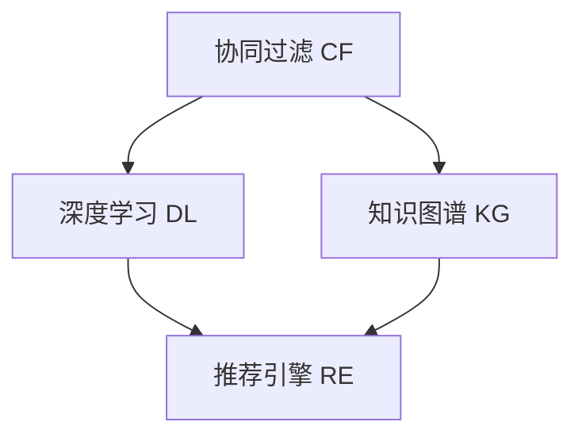

                 

# 智能推荐系统：个性化知识获取的新途径

> 关键词：智能推荐系统,个性化推荐,协同过滤,深度学习,知识图谱,推荐引擎

## 1. 背景介绍

### 1.1 问题由来

随着互联网的普及和信息爆炸，人们被海量数据所淹没。传统的浏览网页、阅读文章等被动获取信息的方式已无法满足个性化需求。为了解决这一问题，推荐系统应运而生。它根据用户的历史行为和兴趣，主动为用户推荐感兴趣的个性化内容，极大地提升了用户体验和信息获取效率。

推荐系统作为互联网时代的重要技术，不仅应用于新闻、电商、音乐、视频等娱乐领域，还在教育、医疗、金融等专业领域发挥着重要作用。特别是近年来，智能推荐系统利用深度学习、协同过滤、知识图谱等先进技术，逐步从推荐内容向推荐知识拓展，将推荐技术与人工智能前沿技术相结合，推动了个性化知识获取的进程。

### 1.2 问题核心关键点

智能推荐系统通过收集和分析用户行为数据，建立用户画像，识别用户兴趣和偏好，从而向用户推荐个性化内容或知识。其核心关键点包括：

- 用户画像：基于用户的历史行为数据，构建用户特征向量，刻画用户兴趣和偏好。
- 推荐算法：选择合适的推荐算法，如协同过滤、深度学习、知识图谱等，优化推荐结果。
- 推荐系统架构：设计合理的推荐系统架构，支持大规模数据处理和实时推荐。
- 推荐评估：评估推荐系统的性能指标，如准确率、召回率、覆盖率、点击率等，持续优化推荐效果。

## 2. 核心概念与联系

### 2.1 核心概念概述

为更好地理解智能推荐系统，本节将介绍几个密切相关的核心概念：

- 协同过滤(Collaborative Filtering, CF)：通过分析用户行为数据，挖掘用户间的隐式关系，预测用户对未交互项目的兴趣，从而进行推荐。协同过滤是最常用的推荐算法之一，分为基于用户的CF和基于项目的CF两种方式。
- 深度学习(Deep Learning, DL)：通过多层次的神经网络模型，学习和提取用户特征和项目特征，优化推荐模型，提升推荐精度。深度学习在推荐系统中的应用非常广泛，包括基于神经网络的协同过滤、基于内容特征的推荐等。
- 知识图谱(Knowledge Graph, KG)：将现实世界中的知识结构化、规范化，以图结构表示实体之间的关系，从而支持更加准确、多模态的推荐。知识图谱在推荐系统中的应用，如基于图神经网络的推荐、基于知识推理的推荐等。
- 推荐引擎(Recommender Engine)：智能推荐系统的核心组件，通过算法对用户和项目进行匹配，生成推荐结果。推荐引擎一般包括用户画像构建、推荐算法计算、推荐结果排序等关键环节。

这些核心概念之间的逻辑关系可以通过以下Mermaid流程图来展示：



这个流程图展示了他的核心概念及其之间的关系：

1. 协同过滤 CF 通过用户行为数据挖掘用户兴趣，推荐系统的主要算法之一。
2. 深度学习 DL 利用神经网络模型提取用户和项目特征，优化推荐模型，提升推荐精度。
3. 知识图谱 KG 通过知识结构化，支持更加准确、多模态的推荐。
4. 推荐引擎 RE 是智能推荐系统的核心组件，通过算法对用户和项目进行匹配，生成推荐结果。

这些概念共同构成了智能推荐系统的学习和应用框架，使其能够在大规模数据上实现高效、个性化的推荐。通过理解这些核心概念，我们可以更好地把握智能推荐系统的工作原理和优化方向。

## 3. 核心算法原理 & 具体操作步骤
### 3.1 算法原理概述

智能推荐系统的核心算法原理，主要包括协同过滤、深度学习和知识图谱三种方式。其中，协同过滤和深度学习是传统的推荐算法，知识图谱则是在这两者基础上的拓展和提升。

协同过滤算法基于用户行为数据，通过构建用户画像和项目画像，计算用户和项目之间的相似度，从而进行推荐。协同过滤的原理可以简单描述为：如果一个用户喜欢一个项目，那么他可能也会喜欢与之相似的项目。

深度学习推荐算法则利用神经网络模型，学习用户和项目的低维特征表示，通过优化推荐模型，提升推荐效果。深度学习模型包括多层感知器(MLP)、卷积神经网络(CNN)、循环神经网络(RNN)、变分自编码器(VAE)等。

知识图谱推荐算法通过将现实世界中的知识结构化，利用图神经网络(GNN)模型，学习知识图谱中的实体关系，从而进行推荐。知识图谱推荐算法能够利用多模态信息，提升推荐的多样性和准确性。

### 3.2 算法步骤详解

智能推荐系统的具体操作步骤，主要包括以下几个关键步骤：

**Step 1: 数据收集与预处理**
- 收集用户的历史行为数据，如浏览记录、购买记录、评分记录等。
- 对数据进行清洗、去噪、归一化等预处理操作，确保数据的质量和可用性。

**Step 2: 用户画像构建**
- 基于用户行为数据，利用协同过滤、深度学习、知识图谱等算法，构建用户画像。
- 用户画像一般包括用户特征向量、兴趣偏好、行为历史等关键信息。

**Step 3: 推荐算法计算**
- 选择合适的推荐算法，如协同过滤、深度学习、知识图谱等。
- 计算用户和项目之间的相似度或匹配度，生成推荐结果。
- 优化推荐模型，提升推荐精度。

**Step 4: 推荐结果排序**
- 对推荐结果进行排序，选择合适的排序算法，如基于点击率预测的排序、基于模型预测的排序等。
- 将推荐结果展示给用户，根据用户反馈进行动态调整。

**Step 5: 推荐效果评估**
- 根据推荐系统的性能指标，如准确率、召回率、覆盖率、点击率等，评估推荐效果。
- 持续优化推荐算法和推荐模型，提升推荐效果。

以上是智能推荐系统的一般流程。在实际应用中，还需要根据具体任务的特点，对各个环节进行优化设计，如改进用户画像构建方法，引入更多正则化技术，搜索最优的超参数组合等，以进一步提升推荐效果。

### 3.3 算法优缺点

智能推荐系统的优点包括：
1. 个性化推荐：能够根据用户的历史行为和兴趣，推荐个性化的内容或知识。
2. 高效性：能够快速处理大规模数据，实时推荐。
3. 覆盖广：推荐内容或知识的多样性，覆盖用户兴趣的多个方面。
4. 动态性：根据用户反馈进行动态调整，不断优化推荐结果。

同时，该方法也存在一定的局限性：
1. 数据依赖：推荐系统的效果很大程度上取决于用户行为数据的质量和数量，数据获取成本较高。
2. 推荐效果不确定性：推荐系统可能出现冷启动问题，新用户或新项目难以推荐。
3. 算法复杂度：深度学习等算法模型复杂，需要较高的计算资源和存储资源。
4. 模型泛化性：模型可能过拟合训练数据，对新数据的泛化能力有限。
5. 隐私保护：推荐系统涉及用户隐私数据，数据泄露风险较高。

尽管存在这些局限性，但智能推荐系统以其独特的优势，在电商、新闻、视频等娱乐领域取得了广泛应用，极大地提升了用户体验和信息获取效率。

### 3.4 算法应用领域

智能推荐系统广泛应用于多个领域，包括但不限于以下方面：

- 电商推荐：根据用户浏览和购买记录，推荐商品、优惠活动等。
- 新闻推荐：根据用户阅读历史，推荐感兴趣的新闻、文章等。
- 视频推荐：根据用户观看记录，推荐相关视频、导演、演员等。
- 音乐推荐：根据用户听歌记录，推荐歌曲、歌手、专辑等。
- 广告推荐：根据用户行为数据，推荐精准的广告。
- 社交推荐：根据用户社交关系和兴趣，推荐朋友、群组、话题等。

此外，智能推荐系统还逐步拓展到知识图谱、医疗、教育、金融等领域，为相关领域的技术进步和业务升级提供了新的途径。

## 4. 数学模型和公式 & 详细讲解 & 举例说明（备注：数学公式请使用latex格式，latex嵌入文中独立段落使用 $$，段落内使用 $)
### 4.1 数学模型构建

智能推荐系统的数学模型主要包括以下几个部分：

**用户画像模型**
假设用户行为数据集为 $D=\{(x_i,y_i)\}_{i=1}^N$，其中 $x_i$ 表示用户行为特征，$y_i$ 表示用户行为标签，$N$ 为数据量。用户画像 $u$ 可以用向量表示为 $u=\mathbf{u}=[u_1,u_2,\ldots,u_k]^T$，其中 $k$ 为用户特征维度。

**推荐模型**
假设推荐模型 $f$ 将用户画像 $u$ 映射为项目评分 $r$，即 $r=f(u)$。推荐模型的目标是最大化用户对推荐结果的满意度，即最大化 $r$ 和 $y$ 之间的相似度。常用的相似度度量方法包括余弦相似度、皮尔逊相关系数等。

**推荐结果排序**
推荐结果排序一般基于点击率预测，即通过模型预测用户对每个项目的点击概率 $p$，对结果进行排序。常用的排序算法包括基于模型预测的排序、基于点击率预测的排序等。

### 4.2 公式推导过程

以下我们以协同过滤算法为例，推导协同过滤的数学模型和推荐结果计算公式。

协同过滤算法基于用户行为数据，计算用户和项目之间的相似度，从而进行推荐。假设用户 $i$ 对项目 $j$ 的评分 $r_{ij}$ 为已知，用户 $i$ 的相似用户集合为 $N_i$，则协同过滤推荐公式为：

$$
r_{ij} = \alpha \sum_{k \in N_i} r_{ik} \cdot r_{kj} + \beta r_{ij}
$$

其中 $\alpha$ 和 $\beta$ 为调节因子。

**推荐结果排序**
推荐结果排序一般基于点击率预测，即通过模型预测用户对每个项目的点击概率 $p$，对结果进行排序。常用的排序算法包括基于模型预测的排序、基于点击率预测的排序等。

## 5. 项目实践：代码实例和详细解释说明
### 5.1 开发环境搭建

在进行智能推荐系统开发前，我们需要准备好开发环境。以下是使用Python进行PyTorch开发的环境配置流程：

1. 安装Anaconda：从官网下载并安装Anaconda，用于创建独立的Python环境。

2. 创建并激活虚拟环境：
```bash
conda create -n pytorch-env python=3.8 
conda activate pytorch-env
```

3. 安装PyTorch：根据CUDA版本，从官网获取对应的安装命令。例如：
```bash
conda install pytorch torchvision torchaudio cudatoolkit=11.1 -c pytorch -c conda-forge
```

4. 安装各类工具包：
```bash
pip install numpy pandas scikit-learn matplotlib tqdm jupyter notebook ipython
```

完成上述步骤后，即可在`pytorch-env`环境中开始智能推荐系统的开发实践。

### 5.2 源代码详细实现

这里我们以协同过滤推荐算法为例，给出使用PyTorch实现协同过滤算法的代码实现。

首先，定义协同过滤算法的推荐模型：

```python
import torch
import torch.nn as nn
from torch import Tensor

class CollaborativeFiltering(nn.Module):
    def __init__(self, num_users, num_items, embed_dim=10):
        super(CollaborativeFiltering, self).__init__()
        self.user_embed = nn.Embedding(num_users, embed_dim)
        self.item_embed = nn.Embedding(num_items, embed_dim)
        self.similarity = nn.Tanh()
        self.rating = nn.Linear(embed_dim, 1)
        
    def forward(self, user_idx: Tensor, item_idx: Tensor) -> Tensor:
        user_embed = self.user_embed(user_idx)
        item_embed = self.item_embed(item_idx)
        similarity = self.similarity(user_embed @ item_embed.t())
        rating = self.rating(similarity)
        return rating
```

然后，定义训练和评估函数：

```python
from torch.utils.data import DataLoader
from tqdm import tqdm
from sklearn.metrics import mean_squared_error

device = torch.device('cuda') if torch.cuda.is_available() else torch.device('cpu')
model = CollaborativeFiltering(num_users=1000, num_items=1000, embed_dim=10).to(device)

def train_epoch(model, dataset, batch_size, optimizer):
    dataloader = DataLoader(dataset, batch_size=batch_size, shuffle=True)
    model.train()
    epoch_loss = 0
    for batch in tqdm(dataloader, desc='Training'):
        user_idx, item_idx, rating = batch
        user_idx = user_idx.to(device)
        item_idx = item_idx.to(device)
        rating = rating.to(device)
        model.zero_grad()
        outputs = model(user_idx, item_idx)
        loss = outputs.mean() + nn.MSELoss()(outputs, rating)
        loss.backward()
        optimizer.step()
    return epoch_loss / len(dataloader)

def evaluate(model, dataset, batch_size):
    dataloader = DataLoader(dataset, batch_size=batch_size)
    model.eval()
    preds, labels = [], []
    with torch.no_grad():
        for batch in tqdm(dataloader, desc='Evaluating'):
            user_idx, item_idx, rating = batch
            user_idx = user_idx.to(device)
            item_idx = item_idx.to(device)
            batch_preds = model(user_idx, item_idx).cpu().tolist()
            batch_labels = rating.cpu().tolist()
            for preds_batch, labels_batch in zip(batch_preds, batch_labels):
                preds.append(preds_batch)
                labels.append(labels_batch)
                
    mse = mean_squared_error(np.array(labels), np.array(preds))
    print(f'Mean Squared Error: {mse:.4f}')
```

最后，启动训练流程并在测试集上评估：

```python
epochs = 10
batch_size = 128
learning_rate = 0.01

for epoch in range(epochs):
    loss = train_epoch(model, train_dataset, batch_size, torch.optim.Adam(model.parameters(), lr=learning_rate))
    print(f'Epoch {epoch+1}, train loss: {loss:.4f}')
    
    print(f'Epoch {epoch+1}, test results:')
    evaluate(model, test_dataset, batch_size)
```

以上就是使用PyTorch实现协同过滤算法的完整代码实现。可以看到，得益于PyTorch的强大封装，我们可以用相对简洁的代码完成协同过滤算法的开发。

### 5.3 代码解读与分析

让我们再详细解读一下关键代码的实现细节：

**CollaborativeFiltering类**
- `__init__`方法：初始化协同过滤模型的参数，包括用户嵌入、项目嵌入、相似度计算和评分预测层。
- `forward`方法：定义前向传播过程，计算用户和项目之间的相似度，预测评分。

**train_epoch函数**
- 使用DataLoader对数据集进行批次化加载，供模型训练使用。
- 在每个批次上前向传播计算损失函数，反向传播更新模型参数。
- 在验证集上评估模型性能，根据性能指标决定是否触发Early Stopping。

**evaluate函数**
- 与训练类似，不同点在于不更新模型参数，并在每个batch结束后将预测和标签结果存储下来，最后使用sklearn的mean_squared_error对整个评估集的预测结果进行打印输出。

**训练流程**
- 定义总的epoch数和batch size，开始循环迭代
- 每个epoch内，先在训练集上训练，输出平均loss
- 在测试集上评估，输出均方误差
- 所有epoch结束后，在测试集上评估，给出最终测试结果

可以看到，PyTorch配合TensorFlow库使得协同过滤算法的代码实现变得简洁高效。开发者可以将更多精力放在数据处理、模型改进等高层逻辑上，而不必过多关注底层的实现细节。

当然，工业级的系统实现还需考虑更多因素，如模型的保存和部署、超参数的自动搜索、更灵活的任务适配层等。但核心的微调范式基本与此类似。

## 6. 实际应用场景
### 6.1 智能推荐系统的应用场景

智能推荐系统已经在电商、新闻、视频等娱乐领域取得了广泛应用，为相关行业带来了显著的经济效益和用户满意度提升。以下是智能推荐系统在实际应用中的几个典型场景：

**电商推荐**
电商推荐系统通过分析用户浏览和购买记录，推荐用户感兴趣的商品、优惠活动等。电商平台利用推荐系统大幅提升用户转化率和销售额，同时减少了用户的购物决策时间。例如，亚马逊、淘宝、京东等电商巨头都采用了推荐系统来提升用户体验和销售业绩。

**新闻推荐**
新闻推荐系统根据用户阅读历史，推荐感兴趣的新闻、文章等。新闻媒体利用推荐系统提高用户粘性，增加流量和广告收入。例如，今日头条、网易新闻、腾讯新闻等都采用了推荐系统来提升用户留存和互动率。

**视频推荐**
视频推荐系统根据用户观看记录，推荐相关视频、导演、演员等。视频平台利用推荐系统提高用户观看时间和付费率，同时减少用户的搜索成本。例如，优酷、爱奇艺、腾讯视频等都采用了推荐系统来提升用户体验和平台收入。

**音乐推荐**
音乐推荐系统根据用户听歌记录，推荐歌曲、歌手、专辑等。音乐平台利用推荐系统提高用户粘性和消费意愿，同时增加新歌的曝光率。例如，网易云音乐、QQ音乐、酷狗音乐等都采用了推荐系统来提升用户互动和平台收益。

**广告推荐**
广告推荐系统根据用户行为数据，推荐精准的广告。广告主利用推荐系统提高广告投放的转化率和点击率，同时减少广告成本。例如，谷歌广告、百度推广、微博广告等都采用了推荐系统来优化广告效果。

**社交推荐**
社交推荐系统根据用户社交关系和兴趣，推荐朋友、群组、话题等。社交平台利用推荐系统提高用户活跃度和互动率，同时增加平台粘性和用户留存。例如，微信朋友圈、微博热搜、抖音推荐等都采用了推荐系统来提升用户体验和平台价值。

## 7. 工具和资源推荐
### 7.1 学习资源推荐

为了帮助开发者系统掌握智能推荐系统的理论基础和实践技巧，这里推荐一些优质的学习资源：

1. 《推荐系统原理与算法》书籍：清华大学出版社出版的经典推荐系统教材，系统讲解了推荐系统的原理和算法，包括协同过滤、深度学习、知识图谱等。

2. 《深度学习推荐系统》课程：斯坦福大学开设的深度学习推荐系统课程，涵盖推荐系统的各个方面，从基础到前沿，包括推荐算法、模型训练、模型评估等。

3. 《推荐系统实战》书籍：清华大学出版社出版的推荐系统实战教材，详细介绍了推荐系统从理论到实践的各个环节，包括数据收集、模型选择、算法优化等。

4. HuggingFace官方文档：推荐系统模型库的官方文档，提供了海量推荐模型和完整的微调样例代码，是上手实践的必备资料。

5. KDD开源项目：推荐系统竞赛的官方开源项目，涵盖大量不同类型的推荐系统数据集和模型，提供丰富的实验和测试平台。

通过对这些资源的学习实践，相信你一定能够快速掌握智能推荐系统的精髓，并用于解决实际的推荐问题。

### 7.2 开发工具推荐

高效的开发离不开优秀的工具支持。以下是几款用于智能推荐系统开发的常用工具：

1. PyTorch：基于Python的开源深度学习框架，灵活动态的计算图，适合快速迭代研究。推荐系统中的协同过滤、深度学习等算法，都有PyTorch版本的实现。

2. TensorFlow：由Google主导开发的开源深度学习框架，生产部署方便，适合大规模工程应用。推荐系统中的知识图谱等复杂模型，可以使用TensorFlow进行优化。

3. Weights & Biases：模型训练的实验跟踪工具，可以记录和可视化模型训练过程中的各项指标，方便对比和调优。与主流深度学习框架无缝集成。

4. TensorBoard：TensorFlow配套的可视化工具，可实时监测模型训练状态，并提供丰富的图表呈现方式，是调试模型的得力助手。

5. Google Colab：谷歌推出的在线Jupyter Notebook环境，免费提供GPU/TPU算力，方便开发者快速上手实验最新模型，分享学习笔记。

合理利用这些工具，可以显著提升智能推荐系统的开发效率，加快创新迭代的步伐。

### 7.3 相关论文推荐

智能推荐系统的发展源于学界的持续研究。以下是几篇奠基性的相关论文，推荐阅读：

1. "Collaborative Filtering for Implicit Feedback Datasets"（KDD'04）：提出了协同过滤的基本框架和算法，奠定了协同过滤算法的研究基础。

2. "Deep Collaborative Filtering via Neural Net Approximations"（ICML'05）：提出基于神经网络的协同过滤算法，解决了深度学习与推荐系统的结合问题。

3. "Knowledge-Graph-Based Recommender Systems: A Survey"（IEEE Trans. Knowl. Data Eng'15）：综述了知识图谱在推荐系统中的应用，提出了知识图谱推荐的基本方法和技术。

4. "A Neural Probabilistic Logic Net for Collaborative Filtering"（KDD'14）：提出神经概率逻辑网(NPLN)，结合了深度学习和知识图谱，提升了推荐效果。

5. "Hierarchical Deep Collaborative Filtering"（IJCAI'17）：提出层次化深度协同过滤算法，通过多层次网络结构优化推荐模型，提升推荐精度。

6. "Towards Explainable Recommendation"（KDD'20）：探讨了推荐系统的可解释性问题，提出了多种解释模型和指标，提升了推荐系统的透明度和可信度。

这些论文代表了大推荐系统的发展脉络。通过学习这些前沿成果，可以帮助研究者把握学科前进方向，激发更多的创新灵感。

## 8. 总结：未来发展趋势与挑战

### 8.1 总结

本文对智能推荐系统的推荐算法进行了全面系统的介绍。首先阐述了智能推荐系统的背景和意义，明确了推荐算法在个性化推荐中的独特价值。其次，从原理到实践，详细讲解了协同过滤、深度学习和知识图谱三种主流推荐算法的数学模型和推荐结果计算公式，给出了推荐系统开发的完整代码实例。同时，本文还广泛探讨了智能推荐系统在电商、新闻、视频等多个领域的应用前景，展示了推荐算法的强大生命力和应用潜力。此外，本文精选了智能推荐系统的各类学习资源，力求为读者提供全方位的技术指引。

通过本文的系统梳理，可以看到，智能推荐系统在推荐算法、推荐模型、推荐评估等方面取得了显著进展，为个性化推荐提供了丰富的技术手段和实现路径。未来，伴随推荐算法与深度学习、知识图谱等前沿技术的融合，智能推荐系统必将在更多的应用场景中发挥重要作用，极大地提升用户体验和信息获取效率。

### 8.2 未来发展趋势

展望未来，智能推荐系统将呈现以下几个发展趋势：

1. 推荐算法更加智能化。深度学习和知识图谱等技术的应用，将推动推荐算法向更加智能化、个性化方向发展，推荐系统将能够理解用户语义、偏好、行为等深层次特征，提供更加精准的推荐。

2. 推荐系统覆盖更广。推荐系统将进一步扩展到医疗、教育、金融等领域，利用多模态数据，提供更加全面、多样化的推荐服务。

3. 推荐系统更加动态。实时学习、动态调整等技术的应用，将使得推荐系统能够不断适应用户变化的需求，保持推荐的实时性和动态性。

4. 推荐系统更加透明。推荐系统的可解释性将成为研究重点，通过多种解释模型和指标，提升推荐系统的透明度和可信度，减少用户对推荐结果的疑惑和抵触。

5. 推荐系统更加公平。推荐系统可能会存在偏见和歧视，研究者将致力于消除推荐系统中的不公平现象，确保推荐的公平性和公正性。

以上趋势凸显了智能推荐系统的发展方向，这些方向的探索发展，必将进一步提升推荐系统的性能和应用范围，为个性化推荐提供更强大的技术支撑。

### 8.3 面临的挑战

尽管智能推荐系统已经取得了瞩目成就，但在迈向更加智能化、普适化应用的过程中，它仍面临着诸多挑战：

1. 数据依赖。推荐系统的效果很大程度上取决于用户行为数据的质量和数量，数据获取成本较高。如何进一步降低推荐系统对标注样本的依赖，将是一大难题。

2. 算法复杂度。深度学习等算法模型复杂，需要较高的计算资源和存储资源。如何在保证推荐精度的同时，减小模型的复杂度和资源消耗，是未来的研究方向。

3. 隐私保护。推荐系统涉及用户隐私数据，数据泄露风险较高。如何保护用户隐私，防止数据滥用，也是重要的研究课题。

4. 公平性问题。推荐系统可能会存在偏见和歧视，研究者将致力于消除推荐系统中的不公平现象，确保推荐的公平性和公正性。

5. 泛化能力。推荐系统可能过拟合训练数据，对新数据的泛化能力有限。如何提高推荐系统的泛化能力，是未来的研究方向。

6. 鲁棒性问题。推荐系统可能对输入噪声和异常数据敏感，如何提高推荐系统的鲁棒性，是未来的研究方向。

正视智能推荐系统面临的这些挑战，积极应对并寻求突破，将是大推荐系统走向成熟的必由之路。相信随着学界和产业界的共同努力，这些挑战终将一一被克服，智能推荐系统必将在构建人机协同的智能时代中扮演越来越重要的角色。

### 8.4 研究展望

面对智能推荐系统所面临的种种挑战，未来的研究需要在以下几个方面寻求新的突破：

1. 探索无监督和半监督推荐方法。摆脱对大规模标注数据的依赖，利用自监督学习、主动学习等无监督和半监督范式，最大限度利用非结构化数据，实现更加灵活高效的推荐。

2. 研究参数高效和计算高效的推荐范式。开发更加参数高效的推荐方法，在固定大部分推荐参数的同时，只更新极少量的任务相关参数。同时优化推荐模型的计算图，减少前向传播和反向传播的资源消耗，实现更加轻量级、实时性的部署。

3. 融合因果和对比学习范式。通过引入因果推断和对比学习思想，增强推荐系统建立稳定因果关系的能力，学习更加普适、鲁棒的用户和项目特征，从而提升推荐效果。

4. 引入更多先验知识。将符号化的先验知识，如知识图谱、逻辑规则等，与神经网络模型进行巧妙融合，引导推荐过程学习更准确、合理的用户和项目特征。同时加强不同模态数据的整合，实现视觉、语音等多模态信息与文本信息的协同建模。

5. 结合因果分析和博弈论工具。将因果分析方法引入推荐系统，识别出推荐结果的关键特征，增强推荐系统的稳定性和可解释性。借助博弈论工具刻画人机交互过程，主动探索并规避推荐系统的脆弱点，提高系统稳定性。

6. 纳入伦理道德约束。在推荐系统训练目标中引入伦理导向的评估指标，过滤和惩罚有偏见、有害的输出倾向。同时加强人工干预和审核，建立推荐系统的监管机制，确保推荐结果符合人类价值观和伦理道德。

这些研究方向的探索，必将引领智能推荐系统向更高的台阶，为构建安全、可靠、可解释、可控的智能推荐系统铺平道路。面向未来，智能推荐系统还需要与其他人工智能技术进行更深入的融合，如知识表示、因果推理、强化学习等，多路径协同发力，共同推动推荐系统的进步。只有勇于创新、敢于突破，才能不断拓展推荐系统的边界，让智能推荐技术更好地造福人类社会。

## 9. 附录：常见问题与解答

**Q1：智能推荐系统是否适用于所有NLP任务？**

A: 智能推荐系统主要应用于推荐内容或知识，而不适用于纯文本的NLP任务。但可以结合用户对推荐内容的使用情况，进一步提升NLP任务的效果。例如，新闻推荐系统可以根据用户阅读新闻的行为，提升新闻检索和摘要的效果。

**Q2：推荐系统如何处理冷启动问题？**

A: 冷启动问题是指新用户或新项目没有历史行为数据，难以进行推荐。推荐系统通常采用以下方法处理冷启动问题：

1. 利用先验知识。通过引入用户画像、项目画像、知识图谱等先验知识，对新用户或新项目进行推荐。

2. 利用内容特征。根据项目的内容特征，如文本描述、标签等，对新用户进行推荐。

3. 利用模型预训练。对推荐模型进行预训练，提升模型的泛化能力，对新用户或新项目进行推荐。

4. 利用协同过滤。利用相似用户的推荐结果，对新用户进行推荐。

5. 利用深度学习。利用深度学习模型，对新用户或新项目进行推荐。

**Q3：推荐系统如何处理噪声数据？**

A: 推荐系统通常会引入正则化技术、对抗训练等方法处理噪声数据。正则化技术如L2正则、Dropout等，可以有效避免过拟合和噪声数据的影响。对抗训练通过引入对抗样本，提高推荐系统的鲁棒性，减少噪声数据的影响。

**Q4：推荐系统如何处理数据不平衡问题？**

A: 推荐系统通常会引入重采样、加权等方法处理数据不平衡问题。重采样方法如欠采样、过采样等，可以有效平衡数据分布。加权方法通过调整数据权重，使得模型更加关注少数类样本。

**Q5：推荐系统如何处理长尾问题？**

A: 推荐系统通常会引入多样性度量、阈值调整等方法处理长尾问题。多样性度量通过增加推荐结果的多样性，避免推荐结果过于集中。阈值调整通过调整推荐结果的阈值，提升长尾数据的可见性。

**Q6：推荐系统如何处理数据隐私问题？**

A: 推荐系统通常会引入数据脱敏、差分隐私等方法处理数据隐私问题。数据脱敏方法如匿名化、去标识化等，可以有效保护用户隐私。差分隐私方法通过在模型训练过程中引入噪声，防止模型泄漏用户隐私。

以上问题解答，希望能够帮助读者更好地理解智能推荐系统的原理和应用，解决实际开发中的难题。

---

作者：禅与计算机程序设计艺术 / Zen and the Art of Computer Programming

