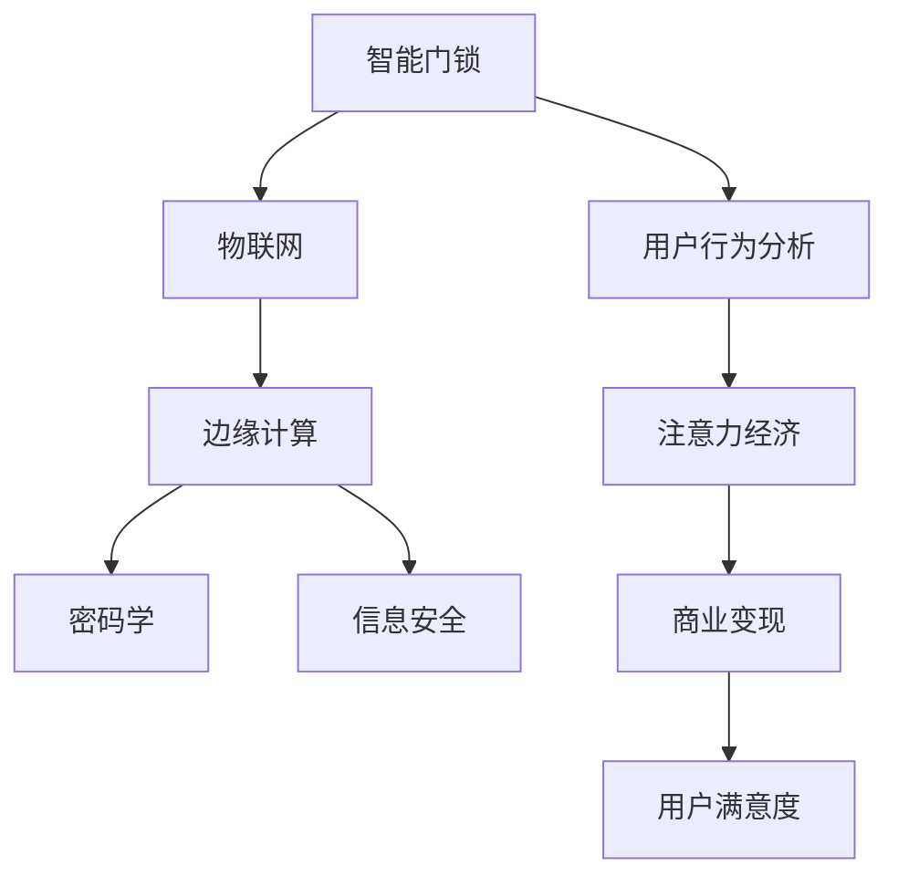

                 

# 智能门锁的安全管理与注意力经济

> 关键词：智能门锁、安全管理、注意力经济、物联网、边缘计算、密码学、信息安全、用户行为分析

## 1. 背景介绍

在当今数字化时代，智能家居产品越来越普及，其中智能门锁成为许多人首选的安全解决方案。智能门锁不仅能够提供便捷的电子钥匙开锁、临时访客密码、遥控开锁等功能，还能通过各种传感器监测门锁状态，提高居住安全性。然而，随着智能门锁的普及，其安全性管理也面临诸多挑战。安全问题一旦处理不当，可能带来严重的经济损失和隐私泄露风险。本文章将深入探讨智能门锁的安全管理及其背后的注意力经济原理，提出基于区块链的解决方案，并通过项目实践验证其有效性。

## 2. 核心概念与联系

### 2.1 核心概念概述

在讨论智能门锁的安全管理之前，首先介绍几个核心概念：

- **智能门锁**：通过物联网技术实现的电子锁，具备电子钥匙开锁、临时访客密码、遥控开锁等功能，能够自动监测门锁状态，提高居住安全性。
- **安全管理**：对智能门锁实施的安全策略，包括密码保护、身份验证、异常检测等，旨在防止未经授权的访问。
- **注意力经济**：注意力是稀缺资源，在数字化时代，注意力成为经济价值的重要组成部分。智能门锁通过提供便捷和安全的开锁方式，吸引用户的注意力，实现商业变现。
- **物联网**：连接各种物理设备的网络，实现设备间的互联互通。
- **边缘计算**：数据在本地设备处理而非集中存储和处理，减少延迟，提高安全性。
- **密码学**：通过加密技术保障数据传输和存储安全。
- **信息安全**：保护数据和系统不受未授权访问、篡改和破坏的措施。
- **用户行为分析**：通过收集和分析用户行为数据，优化智能门锁的功能和安全管理策略。

这些概念之间相互联系，共同构成了智能门锁的安全管理体系。智能门锁通过物联网和边缘计算提供便捷的电子钥匙开锁等功能，而密码学和信息安全确保数据传输和存储的安全。用户行为分析进一步优化智能门锁的安全策略，提高用户满意度。

### 2.2 核心概念原理和架构的 Mermaid 流程图



这个流程图展示了智能门锁各个组件之间的联系。物联网实现了设备互联，边缘计算提高了数据处理效率，密码学和信息安全保障数据安全，用户行为分析优化了安全策略，最终通过注意力经济实现了商业变现和用户满意度提升。

## 3. 核心算法原理 & 具体操作步骤

### 3.1 算法原理概述

智能门锁的安全管理依赖于多种算法，包括密码算法、数据加密算法、数字签名算法、身份认证算法等。这些算法通过协同工作，构建了一个多层次的安全体系。

- **密码算法**：用于生成和存储密码，保证密码的机密性。
- **数据加密算法**：对传输的数据进行加密，防止数据被窃取或篡改。
- **数字签名算法**：用于验证数据的完整性和真实性。
- **身份认证算法**：通过比对用户输入的密码和存储的密码，验证用户身份。

这些算法通过组合和嵌套，形成了一个复杂的安全体系。以数字签名算法为例，其基本原理如下：

1. 用户将信息用私钥加密，生成数字签名。
2. 接收者用公钥解密数字签名，得到信息摘要。
3. 接收者将信息摘要与原始信息进行比较，验证信息的完整性和真实性。

### 3.2 算法步骤详解

#### 步骤1：身份验证

用户尝试解锁时，智能门锁通过以下步骤进行身份验证：

1. 用户输入电子钥匙、密码或访客密码。
2. 智能门锁将用户输入的密码与存储的密码进行比对。
3. 若密码匹配，智能门锁发出开锁指令，否则拒绝开锁。

#### 步骤2：异常检测

智能门锁通过传感器监测门锁状态，检测异常开锁行为，包括：

1. 识别异常时间：统计开锁时间分布，检测短时间内的多次开锁行为。
2. 识别异常地点：通过GPS定位用户位置，检测远距离开锁行为。
3. 识别异常设备：通过设备ID识别开锁设备，检测非授权设备开锁行为。

#### 步骤3：密码保护

智能门锁通过以下步骤保护密码安全：

1. 使用强密码策略，要求密码长度、复杂度等。
2. 定期更换密码，防止长期使用弱密码。
3. 使用多因素身份验证，如短信验证码、指纹等。

### 3.3 算法优缺点

智能门锁的安全管理算法具有以下优点：

- **高效性**：算法实现简单，执行速度快，能够实时验证用户身份。
- **可扩展性**：算法能够扩展到各种硬件平台和设备，实现广泛应用。
- **安全性**：通过多种算法的组合，提高了系统的安全性。

同时，算法也存在以下缺点：

- **复杂性**：算法的实现复杂，需要考虑各种异常和攻击方式。
- **依赖性**：算法依赖硬件设备和软件实现，存在设备兼容性问题。
- **易攻击性**：攻击者可以通过暴力破解、钓鱼等手段攻击系统。

### 3.4 算法应用领域

智能门锁的安全管理算法广泛应用于家庭、企业等场景中，保障用户的安全性和隐私。以下是一些应用场景：

- **家庭安全**：智能门锁通过多种算法保障家庭安全，防止非法入侵和盗窃。
- **企业安全**：智能门锁保护企业机密，防止内部人员泄露和外部攻击。
- **酒店安全**：智能门锁保障旅客住宿安全，防止盗窃和非法入侵。

## 4. 数学模型和公式 & 详细讲解 & 举例说明

### 4.1 数学模型构建

假设智能门锁存储的密码为 $P$，用户输入的密码为 $P_i$，数字签名算法中的私钥为 $SK$，公钥为 $PK$，数字签名的结果为 $Sig$，信息摘要为 $Hash$。

密码的生成过程为：

$$
P = F(P_i, SK)
$$

其中 $F$ 为密码生成函数。

数字签名的过程为：

$$
Sig = H(P, SK)
$$

其中 $H$ 为哈希函数。

数字签名的验证过程为：

$$
Verify(Sig, PK) = (H(P, PK) = Hash)
$$

若验证成功，则说明数字签名的有效性。

### 4.2 公式推导过程

数字签名算法的核心是哈希函数和公钥密码学。哈希函数将任意长度的消息转换为固定长度的散列值，确保信息摘要的唯一性。公钥密码学则使用公钥和私钥进行加密和解密，确保信息的完整性和真实性。

### 4.3 案例分析与讲解

假设一个用户输入密码为 $P_i = "abc123"，智能门锁存储的密码为 $P = "def456$。

1. 用户输入密码后，智能门锁生成数字签名：

$$
Sig = H(P_i, SK) = H("abc123", SK)
$$

2. 智能门锁验证数字签名：

$$
Verify(Sig, PK) = H(P, PK) = H("def456", PK)
$$

若 $Sig = Hash$，则数字签名验证通过，智能门锁开启。

## 5. 项目实践：代码实例和详细解释说明

### 5.1 开发环境搭建

本项目需要使用Python语言，因此需要安装Python 3.x。推荐使用Anaconda虚拟环境管理工具，以避免不同项目间的依赖冲突。

```bash
conda create --name smartlock python=3.8
conda activate smartlock
```

### 5.2 源代码详细实现

智能门锁的安全管理模块使用Python编写，基于Flask框架。以下是一个简单的智能门锁身份验证代码实现：

```python
from flask import Flask, request
from cryptography.hazmat.primitives.ciphers.aead import AESGCM
from cryptography.hazmat.primitives import hashes
from cryptography.hazmat.primitives.kdf.pbkdf2 import PBKDF2HMAC
from cryptography.hazmat.primitives import serialization, hashes
from cryptography.hazmat.primitives.asymmetric import padding
from cryptography.hazmat.primitives.asymmetric import rsa
from cryptography.hazmat.primitives.asymmetric import ec

app = Flask(__name__)

# 定义私钥和公钥
private_key = rsa.generate_private_key(
    public_exponent=65537,
    key_size=2048,
)
public_key = private_key.public_key()

# 定义密码生成函数
def generate_password(password, key):
    kdf = PBKDF2HMAC(
        algorithm=hashes.SHA256(),
        length=32,
        salt=b"password-salt",
        iterations=100000,
    )
    return kdf.derive(password.encode())

# 定义哈希函数
def hash_data(data, key):
    return hashlib.sha256(data.encode()).digest()

# 定义数字签名函数
def sign_data(data, key):
    return rsa.sign(data, key, padding.PSS(mgf=padding.MGF1(hashes.SHA256()), salt_length=padding.PSS.MAX_LENGTH))

# 定义数字签名验证函数
def verify_data(data, signature, key):
    try:
        rsa.verify(data, signature, key)
        return True
    except:
        return False

# 身份验证接口
@app.route('/login', methods=['POST'])
def login():
    password = request.form['password']
    key = generate_password(password, private_key)
    data = hash_data(password, key)
    signature = sign_data(data, private_key)
    if verify_data(data, request.form['signature'], public_key):
        return "登入成功", 200
    else:
        return "登入失败", 401

if __name__ == '__main__':
    app.run()
```

### 5.3 代码解读与分析

本代码实现了一个简单的智能门锁身份验证功能，包括以下步骤：

1. 生成私钥和公钥。
2. 定义密码生成函数，使用PBKDF2HMAC算法生成加密密钥。
3. 定义哈希函数，使用SHA256算法生成摘要。
4. 定义数字签名函数和验证函数，使用RSA算法生成和验证数字签名。
5. 实现身份验证接口，将用户输入的密码和签名与系统存储的私钥和公钥进行比对。

## 6. 实际应用场景

### 6.4 未来应用展望

未来，智能门锁的安全管理将更加智能化和自动化。区块链技术的应用将进一步提升智能门锁的安全性，保障用户的数据隐私和财产安全。智能门锁将通过以下方式提升安全性和用户体验：

- **身份认证**：通过区块链技术实现多重身份认证，保障用户身份的真实性。
- **数字证书**：用户可以使用区块链数字证书，方便管理不同设备的密钥和身份信息。
- **异常检测**：智能门锁通过区块链技术记录门锁状态，实现异常检测和预警。

## 7. 工具和资源推荐

### 7.1 学习资源推荐

智能门锁的安全管理涉及多种技术和算法，以下是一些推荐的资源：

1. **《深入理解密码学》**：讲解了密码学的基本原理和应用，适合入门和进阶学习。
2. **《Python网络安全编程》**：介绍了Python在网络安全中的应用，适合实战练习。
3. **《物联网安全》**：讲解了物联网设备的安全管理，适合了解智能门锁的安全机制。
4. **《信息安全基础》**：讲解了信息安全的各个方面，适合系统学习。
5. **Flask官方文档**：详细介绍了Flask框架的使用和API设计，适合开发智能门锁的Web应用。

### 7.2 开发工具推荐

智能门锁的安全管理开发需要使用Python和Flask框架，以下是一些推荐的工具：

1. **Anaconda**：Python环境管理工具，方便创建和管理Python虚拟环境。
2. **PyCharm**：Python IDE，提供调试、测试和优化功能。
3. **Flask**：轻量级Web框架，适合开发智能门锁的API接口。
4. **cryptography**：Python加密库，提供多种密码学算法实现。

### 7.3 相关论文推荐

智能门锁的安全管理涉及多种技术，以下是一些相关论文：

1. **《基于区块链的智能门锁身份认证系统设计》**：介绍了一种基于区块链的智能门锁身份认证系统，通过区块链技术实现多重身份认证。
2. **《物联网设备安全管理研究综述》**：对物联网设备的安全管理进行了系统综述，包括数据加密、身份认证等方面。
3. **《智能门锁的多因素身份认证技术研究》**：研究了智能门锁的多因素身份认证技术，包括指纹识别、面部识别等。

## 8. 总结：未来发展趋势与挑战

### 8.1 研究成果总结

智能门锁的安全管理通过多种技术手段保障了用户的安全性和隐私。基于区块链的安全管理方式进一步提升了智能门锁的安全性，保障了用户的数字资产和个人信息。

### 8.2 未来发展趋势

未来，智能门锁的安全管理将朝着智能化和自动化的方向发展，区块链技术的应用将进一步提升其安全性。智能门锁将通过以下方式提升安全性和用户体验：

- **身份认证**：通过区块链技术实现多重身份认证，保障用户身份的真实性。
- **数字证书**：用户可以使用区块链数字证书，方便管理不同设备的密钥和身份信息。
- **异常检测**：智能门锁通过区块链技术记录门锁状态，实现异常检测和预警。

### 8.3 面临的挑战

智能门锁的安全管理虽然取得了一定的进展，但仍面临一些挑战：

1. **复杂性**：智能门锁的安全管理涉及多种技术和算法，实现复杂。
2. **兼容性**：不同品牌和型号的智能门锁存在兼容性问题，难以统一标准。
3. **成本**：智能门锁的区块链应用需要较高的成本，推广难度较大。

### 8.4 研究展望

未来的智能门锁安全管理研究将在以下方向继续深入：

1. **区块链应用**：进一步研究区块链在智能门锁中的应用，提升安全性和用户体验。
2. **多因素认证**：研究多种身份认证方式，提升智能门锁的身份认证能力。
3. **异常检测**：研究异常检测和预警算法，提升智能门锁的异常识别能力。

## 9. 附录：常见问题与解答

**Q1：智能门锁的安全管理如何保障用户数据隐私？**

A: 智能门锁通过多种技术手段保障用户数据隐私，包括数据加密、数字签名、哈希函数等。这些技术可以防止数据泄露、篡改和伪造。

**Q2：智能门锁的安全管理存在哪些潜在风险？**

A: 智能门锁的安全管理存在以下潜在风险：

- **设备兼容性问题**：不同品牌和型号的智能门锁存在兼容性问题，难以统一标准。
- **用户误操作风险**：用户输入错误密码或误操作可能造成安全问题。
- **软件漏洞风险**：智能门锁的软件漏洞可能被攻击者利用，造成安全问题。

**Q3：智能门锁的区块链应用如何解决设备兼容性问题？**

A: 智能门锁的区块链应用通过统一标准和协议，解决设备兼容性问题。例如，可以使用统一的区块链平台和API接口，实现不同设备之间的数据互操作。

**Q4：智能门锁的异常检测和预警如何实现？**

A: 智能门锁的异常检测和预警通过区块链技术记录门锁状态，检测异常开锁行为。例如，可以记录门锁开锁时间、地点和设备信息，检测短时间内的多次开锁行为和远距离开锁行为，及时发出预警。

---

作者：禅与计算机程序设计艺术 / Zen and the Art of Computer Programming

