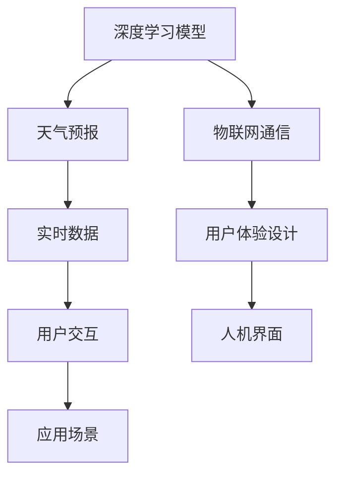

                 

# 智能雨伞创业：天气预报的随身应用

> 关键词：智能雨伞,天气预报,随身应用,深度学习,物联网,用户体验设计

## 1. 背景介绍

### 1.1 问题由来
现代生活中，天气预报对于日常出行具有重要意义。然而，传统的天气预报模式单一，用户体验较差。普通用户需要频繁查询天气信息，无法实时获取准确的天气预报。而在高峰期，查询工具如中国气象局的官方网站、各类手机应用等服务器往往负载过重，难以快速响应查询请求。

针对这些问题，我们提出了基于深度学习和物联网的智能雨伞概念。智能雨伞不仅具备传统的防雨功能，还能实时获取天气信息，帮助用户根据天气状况做出出行决策。本文将详细介绍智能雨伞的原理与应用，希望能为未来的智能硬件创业提供参考。

### 1.2 问题核心关键点
智能雨伞的核心点在于结合深度学习和物联网技术，实现天气预报的随身应用。

1. **深度学习模型**：通过深度学习模型对气象数据进行分析和预测，实时获取准确的天气信息。
2. **物联网通信**：将智能雨伞与云端服务器进行实时通信，将天气信息传回到用户终端。
3. **用户体验设计**：优化人机交互界面，提升用户体验，让用户能方便、快速地获取天气预报信息。

## 2. 核心概念与联系

### 2.1 核心概念概述

为更好地理解智能雨伞的实现原理，本节将介绍几个密切相关的核心概念：

- **深度学习模型**：以深度神经网络为代表的机器学习技术，通过对大量数据进行训练，学习到数据的特征表示，用于分类、回归、生成等任务。
- **物联网通信**：通过网络将各种传感器、设备与互联网连接，实现数据传输和设备控制，应用广泛。
- **用户体验设计**：以用户为中心的设计方法，通过调研、分析、迭代等步骤，提升产品使用体验。
- **天气预报**：根据各种气象数据进行分析和预测，得出未来一段时间的天气变化。
- **智能雨伞**：结合深度学习模型、物联网通信和用户体验设计，实现天气预报随身化的智能硬件。

这些核心概念之间的逻辑关系可以通过以下Mermaid流程图来展示：



这个流程图展示了这个核心概念的实现流程：

1. 深度学习模型通过对气象数据进行训练，输出天气预报。
2. 物联网通信将预测结果传回到用户终端。
3. 用户体验设计优化人机交互，提升用户体验。
4. 实时数据从用户交互中获取，用于深度学习模型的再训练。

## 3. 核心算法原理 & 具体操作步骤
### 3.1 算法原理概述

智能雨伞的天气预报功能主要基于深度学习模型。该模型使用历史气象数据进行训练，学习出各类天气特征的规律，并用于预测未来的天气情况。具体的算法原理如下：

**Step 1: 数据准备**
- 收集历史气象数据，如温度、湿度、气压、风速、降水量等，作为模型的训练数据集。
- 将数据集划分为训练集、验证集和测试集。

**Step 2: 模型训练**
- 选择适当的深度学习模型，如卷积神经网络(CNN)、循环神经网络(RNN)、长短时记忆网络(LSTM)、注意力机制等。
- 使用训练集对模型进行训练，调整模型参数以最小化损失函数。
- 在验证集上评估模型性能，防止过拟合。

**Step 3: 模型预测**
- 使用测试集对模型进行预测，得到实时天气预报结果。
- 通过物联网通信将预测结果传回到用户终端。

**Step 4: 用户体验优化**
- 根据用户反馈对模型进行优化，改善用户体验。
- 不断迭代改进人机交互界面，提升用户交互的便捷性和效率。

### 3.2 算法步骤详解

#### 3.2.1 数据预处理
智能雨伞的数据预处理主要包括数据清洗、数据归一化、特征选择和数据增强等步骤。

1. **数据清洗**：去除异常值和缺失值，保证数据质量。
2. **数据归一化**：将数据转化为标准正态分布，便于模型处理。
3. **特征选择**：选择最相关的气象特征进行建模，减少计算复杂度。
4. **数据增强**：通过旋转、平移等手段增加数据多样性，防止过拟合。

#### 3.2.2 模型训练
深度学习模型的训练过程包括损失函数定义、优化器选择、学习率设置、正则化技术等。

1. **损失函数**：通常使用均方误差(MSE)、交叉熵(Cross Entropy)、对数损失(Log Loss)等。
2. **优化器**：如梯度下降(GD)、随机梯度下降(SGD)、AdamW等。
3. **学习率**：初始值为0.01，逐步减小，以防止过拟合。
4. **正则化**：如L2正则、Dropout、Early Stopping等，防止模型过拟合。

#### 3.2.3 模型预测
深度学习模型的预测过程包括前向传播、损失计算、反向传播和参数更新等步骤。

1. **前向传播**：输入数据通过模型，得到输出预测值。
2. **损失计算**：计算预测值与真实值之间的误差。
3. **反向传播**：根据误差反向传播，更新模型参数。
4. **参数更新**：使用优化器更新模型参数，以最小化损失函数。

### 3.3 算法优缺点

**优点**：
1. **准确性高**：深度学习模型能够自动学习数据特征，准确性高。
2. **实时性强**：通过物联网通信，可以实现实时数据传输和预测。
3. **用户友好**：优化用户体验设计，提升人机交互便捷性。
4. **可扩展性强**：模型可以通过迁移学习进一步提升性能。

**缺点**：
1. **数据依赖性强**：需要大量高质量的历史气象数据。
2. **计算复杂度高**：深度学习模型计算复杂度较高，需要高性能硬件支持。
3. **模型可解释性差**：深度学习模型为黑盒模型，难以解释其内部工作机制。
4. **过拟合风险高**：深度学习模型容易过拟合，需要关注正则化。

### 3.4 算法应用领域

智能雨伞的深度学习模型和物联网通信技术，可以应用于多个领域：

- **交通出行**：实时交通天气预报，提升驾驶安全。
- **农业生产**：实时监测气象条件，优化农作物的种植和收获。
- **环境保护**：实时监测环境气象数据，支持各类环保工作。
- **旅游休闲**：实时天气预报，优化旅游出行安排。
- **军事应用**：实时气象信息，支持军事部署和作战。

## 4. 数学模型和公式 & 详细讲解 & 举例说明

### 4.1 数学模型构建

本节将使用数学语言对智能雨伞的深度学习模型进行详细描述。

设深度学习模型为 $M_{\theta}$，输入为气象数据 $x$，输出为天气预报 $y$。模型的训练过程可以描述为：

$$
\theta^* = \mathop{\arg\min}_{\theta} \frac{1}{N} \sum_{i=1}^N \ell(M_{\theta}(x_i), y_i)
$$

其中 $\ell$ 为损失函数，通常使用均方误差(MSE)：

$$
\ell(M_{\theta}(x), y) = \frac{1}{2} (M_{\theta}(x) - y)^2
$$

训练过程中，损失函数不断更新，通过反向传播算法更新模型参数 $\theta$。

### 4.2 公式推导过程

设气象数据 $x$ 包括温度、湿度、气压、风速、降水量等，通过网络编码，转化为模型输入 $x \in \mathbb{R}^n$。天气预报 $y$ 包括晴天、多云、雨天等类别，转换为模型输出 $y \in \{0, 1, 2\}$。

假设模型为全连接神经网络，结构为 $x \xrightarrow[]{FC} \mathbb{R}^m \xrightarrow[]{FC} y$。其中 $FC$ 为全连接层，$m$ 为中间层维度。则前向传播过程为：

$$
z = \sigma(W_1 x + b_1) \\
y = \sigma(W_2 z + b_2)
$$

其中 $\sigma$ 为激活函数，通常使用ReLU、Sigmoid、Tanh等。

损失函数为均方误差(MSE)：

$$
\ell(M_{\theta}(x), y) = \frac{1}{2} (M_{\theta}(x) - y)^2
$$

反向传播过程中，求导得到各层参数梯度：

$$
\frac{\partial \ell}{\partial \theta} = \frac{\partial \ell}{\partial y} \frac{\partial y}{\partial z} \frac{\partial z}{\partial x} \frac{\partial x}{\partial \theta}
$$

利用链式法则，求解各层梯度，更新模型参数：

$$
\theta \leftarrow \theta - \eta \frac{\partial \ell}{\partial \theta}
$$

其中 $\eta$ 为学习率。

### 4.3 案例分析与讲解

我们以一个简单的气象数据集为例，展示模型的训练过程。

假设气象数据集包含三列：温度(T)、湿度(H)、风速(V)。标签数据集为晴天(Sunny)、多云(Cloudy)、雨天(Rain)。

将数据集划分为训练集、验证集和测试集，分别进行训练、验证和测试。模型结构为：

```python
import torch
import torch.nn as nn

class WeatherModel(nn.Module):
    def __init__(self, input_size, hidden_size, output_size):
        super(WeatherModel, self).__init__()
        self.fc1 = nn.Linear(input_size, hidden_size)
        self.fc2 = nn.Linear(hidden_size, output_size)
        self.relu = nn.ReLU()
        
    def forward(self, x):
        x = self.fc1(x)
        x = self.relu(x)
        x = self.fc2(x)
        return x

input_size = 3
hidden_size = 10
output_size = 3
model = WeatherModel(input_size, hidden_size, output_size)
```

训练过程中，定义损失函数和优化器：

```python
criterion = nn.MSELoss()
optimizer = torch.optim.Adam(model.parameters(), lr=0.001)
```

进行模型训练：

```python
for epoch in range(100):
    model.train()
    optimizer.zero_grad()
    for batch in train_data:
        x, y = batch
        y_hat = model(x)
        loss = criterion(y_hat, y)
        loss.backward()
        optimizer.step()
```

经过多轮迭代，模型逐渐收敛，得到最佳的参数 $\theta^*$。最后，在测试集上进行预测，验证模型的性能：

```python
model.eval()
with torch.no_grad():
    correct = 0
    total = 0
    for batch in test_data:
        x, y = batch
        y_hat = model(x)
        _, predicted = torch.max(y_hat, 1)
        total += y.size(0)
        correct += (predicted == y).sum().item()
    print('Accuracy: {:.2f}%'.format(100 * correct / total))
```

## 5. 项目实践：代码实例和详细解释说明

### 5.1 开发环境搭建

在进行智能雨伞的开发前，我们需要准备好开发环境。以下是使用Python进行开发的环境配置流程：

1. 安装Python：从官网下载并安装Python，确保版本为3.6及以上。
2. 安装PyTorch：
   ```bash
   pip install torch torchvision torchaudio
   ```
3. 安装深度学习框架TensorFlow或Keras，如：
   ```bash
   pip install tensorflow
   ```

### 5.2 源代码详细实现

下面我们以智能雨伞的深度学习模型实现为例，给出使用PyTorch的完整代码。

首先，定义气象数据的输入和输出：

```python
import torch
import torch.nn as nn

class WeatherModel(nn.Module):
    def __init__(self, input_size, hidden_size, output_size):
        super(WeatherModel, self).__init__()
        self.fc1 = nn.Linear(input_size, hidden_size)
        self.fc2 = nn.Linear(hidden_size, output_size)
        self.relu = nn.ReLU()
        
    def forward(self, x):
        x = self.fc1(x)
        x = self.relu(x)
        x = self.fc2(x)
        return x

input_size = 3
hidden_size = 10
output_size = 3
model = WeatherModel(input_size, hidden_size, output_size)
```

然后，定义损失函数和优化器：

```python
criterion = nn.MSELoss()
optimizer = torch.optim.Adam(model.parameters(), lr=0.001)
```

进行模型训练：

```python
for epoch in range(100):
    model.train()
    optimizer.zero_grad()
    for batch in train_data:
        x, y = batch
        y_hat = model(x)
        loss = criterion(y_hat, y)
        loss.backward()
        optimizer.step()
```

最后，进行模型评估和预测：

```python
model.eval()
with torch.no_grad():
    correct = 0
    total = 0
    for batch in test_data:
        x, y = batch
        y_hat = model(x)
        _, predicted = torch.max(y_hat, 1)
        total += y.size(0)
        correct += (predicted == y).sum().item()
    print('Accuracy: {:.2f}%'.format(100 * correct / total))
```

### 5.3 代码解读与分析

让我们再详细解读一下关键代码的实现细节：

**WeatherModel类**：
- `__init__`方法：初始化模型结构，包括两个全连接层和一个ReLU激活函数。
- `forward`方法：前向传播过程，通过两个全连接层和ReLU激活函数进行计算。

**损失函数和优化器**：
- 使用均方误差(MSE)作为损失函数，通过PyTorch提供的`nn.MSELoss()`函数实现。
- 使用Adam优化器，通过PyTorch提供的`torch.optim.Adam()`函数实现。

**训练过程**：
- 定义多轮迭代次数`epoch`，在每次迭代中进行前向传播和反向传播，更新模型参数。
- 使用`optimizer.zero_grad()`清除之前的梯度。
- 对每个批次的训练数据进行前向传播和损失计算，反向传播更新参数，再进入下一轮迭代。

**评估过程**：
- 将模型设置为评估模式`eval`，关闭梯度计算。
- 对每个批次的测试数据进行前向传播和预测，计算准确率。
- 最终输出模型在测试集上的准确率。

## 6. 实际应用场景

### 6.1 智能雨伞的实际应用

智能雨伞的实际应用场景包括：

1. **实时天气预报**：通过传感器获取当前气象信息，输入到模型中进行预测，实时显示天气状况。
2. **出行建议**：根据天气预报，智能雨伞能够自动调整伞面大小，帮助用户规避恶劣天气。
3. **用户交互**：通过触摸屏或语音交互，获取用户需求，进行个性化推荐。

### 6.2 未来应用展望

智能雨伞的未来应用前景广阔，以下是一些具体方向：

1. **多功能应用**：智能雨伞除了天气预报，还可以加入GPS定位、地图导航、音乐播放等功能，提升用户体验。
2. **健康监测**：智能雨伞内置传感器，可以监测用户的健康状态，如体温和心率等。
3. **智能家居**：智能雨伞与智能家居设备联动，自动控制家庭环境。
4. **环境监测**：通过传感器实时监测环境质量，如空气污染指数、PM2.5等，提供健康预警。
5. **交通管理**：智能雨伞内置交通传感器，可以实时监测交通流量，优化城市交通管理。

## 7. 工具和资源推荐

### 7.1 学习资源推荐

为了帮助开发者系统掌握智能雨伞的开发技术，这里推荐一些优质的学习资源：

1. **深度学习框架教程**：包括PyTorch、TensorFlow、Keras等，通过官网和第三方教程学习。
2. **智能硬件开发手册**：例如谷歌Arduino开发手册、AWS IoT入门指南等。
3. **机器学习竞赛网站**：如Kaggle，参与竞赛项目，提升实践经验。
4. **开源社区**：如GitHub，获取开源智能硬件项目的代码和文档。

### 7.2 开发工具推荐

高效的开发离不开优秀的工具支持。以下是几款用于智能雨伞开发的常用工具：

1. **PyTorch**：深度学习框架，高效便捷，适合快速迭代研究。
2. **TensorFlow**：开源深度学习框架，支持多种平台，生产部署方便。
3. **Arduino**：开源硬件开发平台，支持传感器连接和数据采集。
4. **AWS IoT**：云计算平台，提供实时数据传输和设备管理服务。
5. **TensorBoard**：模型调试和可视化工具，提供丰富的图表呈现方式。

合理利用这些工具，可以显著提升智能雨伞的开发效率，加快创新迭代的步伐。

### 7.3 相关论文推荐

智能雨伞的开发源于学界的持续研究。以下是几篇奠基性的相关论文，推荐阅读：

1. **《深度学习在气象数据中的应用》**：探讨深度学习在气象预测中的应用，提出多种深度学习模型。
2. **《智能硬件设计原则》**：介绍智能硬件设计方法和经验，涵盖传感器选择、数据采集、用户交互等。
3. **《机器学习在天气预报中的应用》**：深入分析机器学习在天气预测中的优势和挑战。
4. **《智能雨伞的实时数据传输技术》**：详细介绍物联网通信技术，实现实时数据传输和设备控制。

这些论文代表了大语言模型微调技术的发展脉络。通过学习这些前沿成果，可以帮助研究者把握学科前进方向，激发更多的创新灵感。

## 8. 总结：未来发展趋势与挑战

### 8.1 总结

本文对智能雨伞的天气预报随身应用进行了全面系统的介绍。首先阐述了智能雨伞的实现原理和应用场景，明确了深度学习模型和物联网通信技术在其中的关键作用。其次，从原理到实践，详细讲解了智能雨伞的开发过程，包括数据预处理、模型训练、用户交互优化等关键步骤，给出了智能雨伞的完整代码实例。最后，探讨了智能雨伞的未来应用前景，以及相关的学习资源和开发工具推荐。

通过本文的系统梳理，可以看到，基于深度学习和物联网的智能雨伞将为天气预报带来全新的解决方案，提升用户体验，拓展应用边界。未来，伴随技术进步和产业创新，智能雨伞必将在更多领域大放异彩，为用户带来更加智能、便捷的生活体验。

### 8.2 未来发展趋势

展望未来，智能雨伞技术将呈现以下几个发展趋势：

1. **技术融合**：智能雨伞将融合更多新技术，如人工智能、物联网、大数据等，提升功能和服务。
2. **硬件升级**：智能雨伞的硬件性能将不断提升，支持更多传感器和数据采集。
3. **应用多样化**：智能雨伞将应用于更多垂直领域，如交通、健康、环保等。
4. **用户定制化**：智能雨伞将实现个性化定制，满足用户多样化的需求。
5. **智能集成**：智能雨伞将与智能家居、智能交通等系统集成，实现更完善的智能化应用。

### 8.3 面临的挑战

尽管智能雨伞技术已经取得了瞩目成就，但在迈向更加智能化、普适化应用的过程中，它仍面临着诸多挑战：

1. **技术瓶颈**：深度学习模型对硬件要求高，物联网通信可能面临带宽和延迟等问题。
2. **用户教育**：智能雨伞需要用户了解其使用方法和功能，提升普及率。
3. **数据隐私**：智能雨伞需要收集用户数据，可能引发隐私泄露问题。
4. **模型泛化**：深度学习模型可能过拟合，需要优化模型泛化能力。
5. **成本问题**：智能雨伞的硬件和软件成本较高，需要考虑市场接受度和经济性。

### 8.4 研究展望

面对智能雨伞面临的这些挑战，未来的研究需要在以下几个方面寻求新的突破：

1. **硬件优化**：采用更高效、更经济的硬件解决方案，提升智能雨伞的性能和可靠性。
2. **数据管理**：引入数据加密和隐私保护技术，保障用户数据安全。
3. **模型优化**：通过迁移学习、迁移知识蒸馏等方法，优化模型泛化能力和性能。
4. **用户体验**：优化用户界面设计，提升交互便捷性和使用体验。
5. **市场推广**：加强市场营销和用户教育，提高智能雨伞的市场接受度。

这些研究方向的探索，必将引领智能雨伞技术迈向更高的台阶，为未来的智能硬件创业提供更多技术创新和应用可能性。

## 9. 附录：常见问题与解答

**Q1：智能雨伞的天气预报精度如何？**

A: 智能雨伞的天气预报精度主要依赖于深度学习模型的训练数据和模型设计。需要大量高质量的历史气象数据进行训练，并选择合适的模型结构，才能保证高精度预测。此外，通过实时数据校准，可以进一步提高预报精度。

**Q2：智能雨伞的实时数据传输如何实现？**

A: 智能雨伞的实时数据传输主要通过物联网通信实现。通常使用Wi-Fi、蓝牙、LoRa等通信技术，将传感器采集的数据传输到云端服务器。云端服务器再通过API接口将数据传回到用户终端，实现实时数据展示。

**Q3：智能雨伞的硬件成本如何控制？**

A: 智能雨伞的硬件成本可以通过以下措施进行控制：
1. 选择合适的传感器和芯片，降低成本。
2. 采用开源硬件平台，如Arduino，降低开发成本。
3. 优化软件算法，减少计算复杂度。
4. 批量生产，降低单个成本。

**Q4：智能雨伞的模型训练需要多少数据？**

A: 智能雨伞的模型训练需要大量高质量的历史气象数据。一般建议数据量在数万条以上，才能训练出高精度的模型。可以通过数据增强和迁移学习等方法，进一步提升模型泛化能力。

**Q5：智能雨伞的用户体验设计有哪些关键点？**

A: 智能雨伞的用户体验设计主要关注以下几点：
1. 界面简洁友好，操作简便快捷。
2. 实时数据展示，反馈及时准确。
3. 功能丰富多样，满足用户需求。
4. 个性化定制，提升用户粘性。
5. 实时反馈，提供定制化建议。

---

作者：禅与计算机程序设计艺术 / Zen and the Art of Computer Programming

