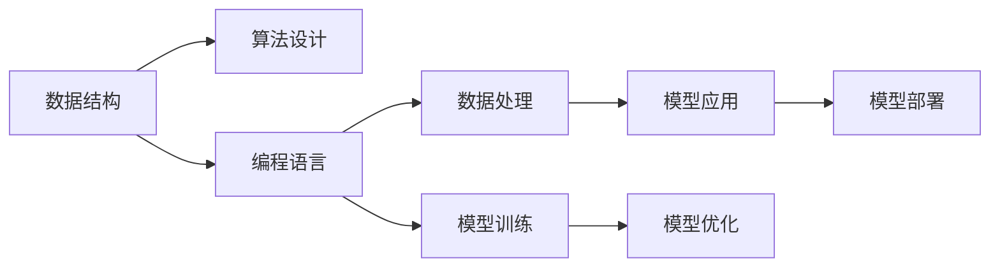

                 

# 最少的计算机科学先决条件学习 AI

> 关键词：AI基础入门,计算机科学基础,数据结构,算法设计,深度学习入门,Python编程

## 1. 背景介绍

### 1.1 问题由来
人工智能（AI）已经成为当今社会最重要的技术之一，应用广泛，包括自动驾驶、智能推荐、自然语言处理、医学影像分析等。然而，对于许多人来说，学习和理解AI技术并非易事。这通常需要扎实的基础知识，比如数据结构、算法设计、深度学习等。但是，许多初学者可能缺乏这些知识，或者在学习过程中难以找到合适的资源。

### 1.2 问题核心关键点
本文将引导读者从零开始学习AI，通过最少的计算机科学先决条件，逐步深入理解AI的核心原理和应用。我们将涵盖数据结构、算法设计、深度学习入门、Python编程等基本概念，并提供实际应用案例和项目实践，帮助读者构建AI学习的坚实基础。

## 2. 核心概念与联系

### 2.1 核心概念概述

要理解AI，首先需要了解一些基本的计算机科学概念，包括数据结构、算法设计和编程语言。这些知识将作为理解AI的核心原理和应用的基础。

- **数据结构**：用于组织和存储数据的基本工具，如数组、链表、栈、队列、树和图等。
- **算法设计**：用于解决问题的一系列步骤或操作，如排序、查找、图遍历等。
- **编程语言**：编写和执行程序的工具，如Python、Java、C++等。

### 2.2 核心概念原理和架构的 Mermaid 流程图(Mermaid 流程节点中不要有括号、逗号等特殊字符)



这个流程图展示了数据结构、算法设计和编程语言之间的关系和作用：

1. **数据结构**：为算法设计提供数据组织方式，是算法实现的基础。
2. **算法设计**：基于数据结构，设计解决问题的方法，是计算的核心。
3. **编程语言**：实现算法设计和数据结构的工具，是软件开发的基石。
4. **数据处理**：利用数据结构和算法处理数据，提取有价值的信息。
5. **模型训练**：使用编程语言和算法，训练机器学习模型。
6. **模型应用**：将训练好的模型应用于实际问题，提供解决方案。
7. **模型优化**：基于数据处理和模型应用的结果，不断优化模型性能。
8. **模型部署**：将优化后的模型部署到实际环境中，提供服务。

## 3. 核心算法原理 & 具体操作步骤

### 3.1 算法原理概述

AI的核心在于通过算法解决问题，其中机器学习和深度学习是最重要的分支。机器学习是通过算法让机器从数据中学习规律，并用于预测和决策；深度学习则是一种特殊的机器学习技术，通过多层神经网络模拟人脑进行学习和决策。

### 3.2 算法步骤详解

#### 3.2.1 数据预处理
- **数据收集**：获取所需的数据集，如图像、文本等。
- **数据清洗**：处理缺失值、异常值，进行数据标准化或归一化。
- **数据分割**：将数据集分为训练集、验证集和测试集。

#### 3.2.2 模型构建
- **模型选择**：根据任务选择合适的模型，如线性回归、决策树、支持向量机、神经网络等。
- **模型训练**：使用训练集对模型进行训练，调整模型参数以最小化损失函数。
- **模型评估**：使用验证集评估模型性能，避免过拟合。

#### 3.2.3 模型优化
- **超参数调优**：调整学习率、正则化参数、批大小等超参数，以获得最佳性能。
- **模型集成**：使用集成方法，如Bagging、Boosting、Stacking，提高模型泛化能力。
- **模型融合**：使用模型融合方法，如模型融合、模型堆叠，提升模型精度。

#### 3.2.4 模型应用
- **模型部署**：将训练好的模型部署到实际环境中，如Web服务、移动应用等。
- **模型监控**：实时监控模型性能，收集反馈，进行持续优化。
- **模型更新**：定期更新模型，以适应数据分布的变化。

### 3.3 算法优缺点

#### 3.3.1 优点
- **广泛适用**：AI技术适用于几乎所有领域，如医疗、金融、交通等。
- **自动化**：通过算法自动处理大量数据，提高效率。
- **灵活性**：可以根据具体任务和数据特点进行调整和优化。
- **可解释性**：许多模型提供了可解释的决策过程，帮助理解和调试。

#### 3.3.2 缺点
- **数据依赖**：AI效果依赖高质量的数据，数据质量直接影响模型性能。
- **计算资源要求高**：深度学习等复杂模型需要大量计算资源，如高性能计算设备。
- **模型解释性不足**：部分模型难以解释其决策过程，难以理解其内部机制。
- **算法复杂度**：复杂算法可能难以理解和调试，需要专业知识。

### 3.4 算法应用领域

AI技术已经广泛应用于多个领域，包括但不限于：

- **自然语言处理（NLP）**：如机器翻译、语音识别、情感分析、问答系统等。
- **计算机视觉（CV）**：如图像识别、物体检测、人脸识别、自动驾驶等。
- **推荐系统**：如电商推荐、视频推荐、音乐推荐等。
- **医疗健康**：如医学影像分析、疾病预测、健康监测等。
- **金融科技**：如风险控制、信用评估、智能投顾等。
- **智能制造**：如智能机器人、质量检测、供应链优化等。

## 4. 数学模型和公式 & 详细讲解 & 举例说明

### 4.1 数学模型构建

AI模型的数学模型通常包括数据表示、模型定义和损失函数。以下是一些常见的模型及其数学表示：

- **线性回归模型**：
  $$
  y = \theta_0 + \theta_1 x_1 + \theta_2 x_2 + ... + \theta_n x_n
  $$
- **决策树模型**：
  $$
  y = \sum_{i=1}^n \theta_i I(x_i) + \theta_0
  $$
- **神经网络模型**：
  $$
  z = \theta_1^T x + \theta_2 x^2 + ... + \theta_n x^n + \theta_0
  $$
  其中 $I(x_i)$ 为特征 $x_i$ 对应的决策函数。

### 4.2 公式推导过程

以线性回归模型为例，进行公式推导：

- **数据表示**：将样本 $x_i$ 表示为特征向量 $x$，标签 $y$ 表示为输出 $y$。
- **模型定义**：定义线性回归模型 $y = \theta_0 + \theta_1 x_1 + \theta_2 x_2 + ... + \theta_n x_n$。
- **损失函数**：定义均方误差损失函数 $L(\theta) = \frac{1}{2m} \sum_{i=1}^m (y_i - \hat{y_i})^2$。
- **梯度下降**：求解损失函数最小值，得到参数更新公式 $\theta_j = \theta_j - \eta \frac{\partial L(\theta)}{\partial \theta_j}$，其中 $\eta$ 为学习率。

### 4.3 案例分析与讲解

以波士顿房价预测为例，进行模型构建和分析：

- **数据准备**：获取波士顿房价数据集，包含13个特征和房价标签。
- **数据预处理**：对数据进行标准化处理，去除异常值。
- **模型选择**：选择线性回归模型。
- **模型训练**：使用训练集对模型进行训练，得到最优参数。
- **模型评估**：使用测试集评估模型性能，计算均方误差。

## 5. 项目实践：代码实例和详细解释说明

### 5.1 开发环境搭建

#### 5.1.1 Python环境
1. **安装Python**：下载并安装Python 3.x版本，如Python 3.7或以上。
2. **安装Anaconda**：下载并安装Anaconda，用于创建和管理虚拟环境。
3. **创建虚拟环境**：
  ```bash
  conda create -n myenv python=3.7
  conda activate myenv
  ```

#### 5.1.2 安装必要的库
1. **安装NumPy**：
  ```bash
  pip install numpy
  ```
2. **安装pandas**：
  ```bash
  pip install pandas
  ```
3. **安装Matplotlib**：
  ```bash
  pip install matplotlib
  ```
4. **安装scikit-learn**：
  ```bash
  pip install scikit-learn
  ```

### 5.2 源代码详细实现

#### 5.2.1 数据准备
```python
import pandas as pd
from sklearn.model_selection import train_test_split

# 读取波士顿房价数据集
data = pd.read_csv('boston.csv')

# 数据预处理
X = data.drop(['MEDV'], axis=1)
y = data['MEDV']

# 数据分割
X_train, X_test, y_train, y_test = train_test_split(X, y, test_size=0.2, random_state=42)
```

#### 5.2.2 模型构建
```python
from sklearn.linear_model import LinearRegression

# 创建线性回归模型
model = LinearRegression()

# 模型训练
model.fit(X_train, y_train)
```

#### 5.2.3 模型评估
```python
from sklearn.metrics import mean_squared_error

# 模型预测
y_pred = model.predict(X_test)

# 计算均方误差
mse = mean_squared_error(y_test, y_pred)
```

### 5.3 代码解读与分析

上述代码展示了线性回归模型的基本实现流程：

1. **数据准备**：读取波士顿房价数据集，并对其进行处理，如去除无关特征、标准化数据等。
2. **模型构建**：创建线性回归模型，并使用训练集对模型进行训练。
3. **模型评估**：使用测试集对模型进行评估，计算均方误差，衡量模型性能。

## 6. 实际应用场景

### 6.1 金融风险控制

在金融领域，AI技术可以用于风险控制，通过分析历史数据和实时数据，预测和识别潜在风险。例如，可以使用机器学习模型预测违约概率、信用评分等，从而帮助金融机构制定更有效的信贷策略。

### 6.2 智能客服

智能客服系统可以基于AI技术，通过自然语言处理和机器学习，自动回答用户问题，提供个性化服务。例如，可以训练模型分析用户意图，生成合适的回复，提高客户满意度。

### 6.3 医疗影像诊断

在医疗领域，AI技术可以用于影像诊断，通过图像识别和深度学习技术，自动识别和标记异常区域，辅助医生进行诊断。例如，可以使用卷积神经网络（CNN）模型，对医学影像进行分类和分割。

### 6.4 未来应用展望

未来，AI技术将更加广泛地应用于各个领域，带来更多的创新和变革。以下是一些未来应用展望：

1. **自动驾驶**：基于计算机视觉和深度学习技术，自动驾驶系统可以实现智能导航、避障等功能，提高行车安全性。
2. **智能家居**：AI技术可以用于智能家居设备，通过语音识别和自然语言处理，实现智能控制、语音交互等功能，提升生活便利性。
3. **个性化推荐**：AI技术可以用于电商、视频、音乐等领域的推荐系统，根据用户行为和偏好，提供个性化推荐，提高用户体验。
4. **自然语言处理**：AI技术可以用于自然语言处理领域，实现自动翻译、情感分析、文本生成等功能，提升人机交互体验。

## 7. 工具和资源推荐

### 7.1 学习资源推荐

#### 7.1.1 在线课程
- **Coursera**：提供许多计算机科学和AI相关的课程，如《机器学习》、《深度学习专项课程》等。
- **edX**：提供免费和付费的计算机科学和AI课程，如《Python for Data Science》、《Introduction to Computer Science》等。
- **Udacity**：提供面向项目的课程，如《深度学习纳米学位》、《机器人学纳米学位》等。

#### 7.1.2 书籍
- **《Python编程：从入门到实践》**：适合初学者，涵盖Python基础和常见应用。
- **《深入理解计算机系统》**：涵盖计算机系统原理，适合计算机科学基础。
- **《机器学习实战》**：涵盖机器学习算法和实现，适合动手实践。
- **《深度学习》**：涵盖深度学习算法和应用，适合进阶学习。

### 7.2 开发工具推荐

#### 7.2.1 编程环境
- **Jupyter Notebook**：适用于数据分析和机器学习项目，支持代码编写和交互式计算。
- **PyCharm**：适用于Python开发，支持代码编辑器、调试器、版本控制等功能。
- **Visual Studio Code**：适用于多语言开发，支持代码编辑、调试、扩展等功能。

#### 7.2.2 数据处理工具
- **NumPy**：用于数值计算和数组操作。
- **pandas**：用于数据处理和分析。
- **Matplotlib**：用于数据可视化。
- **scikit-learn**：用于机器学习算法实现。

#### 7.2.3 深度学习框架
- **TensorFlow**：由Google开发，支持深度学习模型构建和训练。
- **PyTorch**：由Facebook开发，支持动态图和静态图两种计算图模式。
- **Keras**：基于TensorFlow和Theano，提供高级API，易于使用。

### 7.3 相关论文推荐

#### 7.3.1 经典论文
- **《深度学习》**：Goodfellow等著，涵盖深度学习算法和应用。
- **《神经网络与深度学习》**：Michael Nielsen著，介绍神经网络和深度学习原理。
- **《计算机视觉：模型、学习和推理》**：Simard等著，涵盖计算机视觉基础和应用。
- **《自然语言处理综论》**：Christopher D. Manning等著，涵盖自然语言处理基本概念和技术。

## 8. 总结：未来发展趋势与挑战

### 8.1 总结

本文介绍了从零开始学习AI的基本概念和实现方法，涵盖了数据结构、算法设计、深度学习入门和Python编程等基础知识。通过实际案例和项目实践，展示了AI技术的强大应用能力。未来，AI技术将进一步推动各行业的智能化进程，带来更多的创新和变革。

### 8.2 未来发展趋势

未来，AI技术将呈现出以下几个发展趋势：

1. **自动化和智能化**：随着AI技术的不断进步，更多复杂任务将实现自动化和智能化处理。例如，自动驾驶、智能客服、医疗影像分析等。
2. **多模态融合**：AI技术将更多地融合视觉、听觉、触觉等多模态信息，实现更全面、更准确的信息处理和分析。
3. **深度学习演进**：深度学习技术将不断演进，如迁移学习、自监督学习、半监督学习等，提升模型泛化能力和效率。
4. **边缘计算**：随着物联网的发展，AI技术将更多地应用于边缘设备，实现实时处理和决策。
5. **伦理和安全**：AI技术的广泛应用将带来伦理和安全问题，如数据隐私、算法偏见、安全性等，需要更多的研究和规范。

### 8.3 面临的挑战

尽管AI技术取得了巨大成功，但在应用过程中仍面临诸多挑战：

1. **数据质量**：AI模型的性能依赖高质量的数据，数据质量直接影响模型效果。
2. **计算资源**：深度学习等复杂模型需要大量计算资源，如高性能计算设备，增加了成本。
3. **算法复杂性**：复杂算法难以理解和调试，需要更多专业知识。
4. **模型解释性**：部分模型难以解释其决策过程，难以理解其内部机制。
5. **伦理和安全**：AI技术的广泛应用可能带来伦理和安全问题，如数据隐私、算法偏见、安全性等，需要更多的研究和规范。

### 8.4 研究展望

未来的研究需要在以下几个方面寻求新的突破：

1. **数据增强**：通过数据增强技术，提升数据质量和多样性，提高模型泛化能力。
2. **模型优化**：通过模型压缩、剪枝等技术，优化模型结构和性能，提高计算效率。
3. **多模态融合**：融合多模态信息，实现更全面、更准确的信息处理和分析。
4. **伦理和法律**：研究和制定AI技术的伦理和法律规范，确保技术的公平、透明和可控。
5. **人机协同**：研究人机协同方法，增强AI系统的可解释性和用户友好性。

## 9. 附录：常见问题与解答

### 9.1 Q1：如何选择合适的编程语言和工具？

A: 选择编程语言和工具需要考虑项目需求、团队技能和开发效率等因素。Python是数据科学和机器学习领域的主流语言，支持广泛的数据处理和机器学习库。选择适合的IDE（集成开发环境）和版本控制系统，如Jupyter Notebook、PyCharm、Git等，可以提高开发效率和代码质量。

### 9.2 Q2：AI模型如何实现自动优化？

A: AI模型通常通过自动化调参、模型压缩、剪枝等技术实现自动优化。例如，使用自动调参工具（如Hyperopt、Bayesian Opt）优化超参数；使用模型压缩工具（如TensorFlow Lite、ONNX Runtime）减小模型大小；使用剪枝算法（如网络剪枝、结构剪枝）减少计算量。

### 9.3 Q3：AI模型的可解释性如何提升？

A: 提升AI模型的可解释性可以通过多种方法，如使用可解释模型（如决策树、线性回归等）；使用可解释性工具（如LIME、SHAP）分析模型决策；设计更好的模型架构，使决策过程更透明。

### 9.4 Q4：AI技术如何与其他技术结合？

A: AI技术可以与大数据、云计算、区块链等技术结合，实现更广泛的应用。例如，利用大数据技术进行数据收集和分析，使用云计算平台进行模型训练和部署，结合区块链技术实现数据安全和隐私保护。

### 9.5 Q5：AI技术在医疗健康领域的应用前景如何？

A: AI技术在医疗健康领域具有广阔的应用前景。例如，通过自然语言处理技术实现医学文献的自动摘要和分类；通过计算机视觉技术实现医学影像的自动诊断和分析；通过机器学习技术进行疾病预测和风险控制等。AI技术可以提高医疗服务的效率和精度，改善患者的治疗效果。

作者：禅与计算机程序设计艺术 / Zen and the Art of Computer Programming

