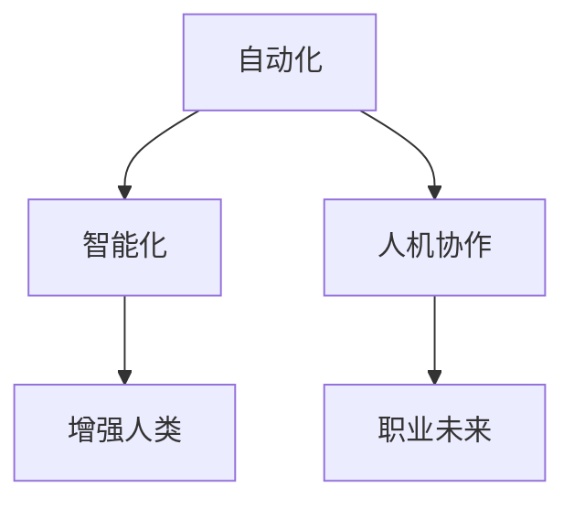

                 

# 未来工作：人机协作，重塑职业未来

## 1. 背景介绍

### 1.1 问题由来

当前，全球正处于第四次工业革命的关键时期。人工智能、大数据、物联网等技术的迅猛发展，正在深刻改变社会的生产方式、工作模式和生活方式。在自动化、智能化浪潮的推动下，许多传统工作岗位面临着前所未有的挑战和变革。

面对这种技术浪潮，人们普遍担忧自动化将导致大量岗位消失，甚至引发“就业危机”。然而，问题的另一面是，人工智能技术的发展也为人类职业形态的转型升级提供了新的机遇。通过对人工智能的合理运用，人机协作将成为未来工作的重要特征，助力职业角色、工作性质和就业模式的重塑。

### 1.2 问题核心关键点

本文聚焦于未来工作形态中人机协作的关键问题，并提出基于人工智能技术推动职业未来发展的解决方案。以下是对问题核心关键点的系统阐述：

- 自动化与智能化技术的飞速发展，如何通过智能系统的辅助，提升人机协作效率，打造更高效、更智能的工作环境？
- 面对自动化带来的就业冲击，如何通过教育、培训和职业规划等手段，提升劳动者的技能和素养，使其更好地适应新工作形态？
- 如何建立有效的人机协作机制，让机器与人类在复杂任务中紧密配合，实现1+1>2的协同效应？
- 在人机协作的新模式下，如何重新定义工作的价值和意义，以及个人与组织间的责任与关系？
- 如何平衡技术创新与社会责任，确保人工智能技术的合理使用，避免带来社会不平等和伦理问题？

本文将从技术、教育、管理和社会等多个维度，探讨人机协作如何重塑未来工作，推动职业发展的趋势和方向。

## 2. 核心概念与联系

### 2.1 核心概念概述

为更好地理解人机协作的未来工作形态，本节将介绍几个密切相关的核心概念：

- 自动化(Automation)：指通过机器代替人完成重复性、低价值的工作任务，提高生产效率和质量。
- 智能化(Intelligence)：指机器通过学习、推理等高级认知能力，处理更复杂、高价值的工作任务，辅助人决策和执行。
- 人机协作(Human-Machine Collaboration)：指人在机器辅助下完成更高效、更精准的工作任务，同时机器利用人的知识、创造力和决策能力进行优化和创新。
- 增强人类(Enhanced Humanity)：指通过智能系统的辅助，提升人类劳动生产率、创造力和生活质量，实现人机共生、协同进化的发展路径。
- 职业未来(Future of Work)：指在自动化、智能化、人机协作等技术驱动下，职业角色、工作性质、就业模式和劳动市场的新形态。

这些核心概念之间的逻辑关系可以通过以下Mermaid流程图来展示：



这个流程图展示了几大核心概念之间的联系：自动化和智能化相互促进，共同推动人机协作的实现，最终引领职业未来的发展。

## 3. 核心算法原理 & 具体操作步骤

### 3.1 算法原理概述

人机协作的未来工作形态，可以通过以下算法原理进行理解和构建：

1. **需求感知与任务分配**：机器通过感知当前环境和工作需求，自动分配任务给最合适的人员。这依赖于机器学习、自然语言处理等技术，实现任务描述的理解和人员能力的匹配。

2. **数据驱动与模型训练**：机器通过大量历史数据进行训练，学习任务执行的最佳策略和方法。这需要采用强化学习、迁移学习等方法，提升机器的决策能力和泛化能力。

3. **协作与反馈优化**：人机在协作过程中实时交互，机器根据人的反馈不断优化执行策略，同时人也通过机器的辅助，提升工作效率和质量。这依赖于交互学习、实时优化等技术。

4. **情感与伦理考量**：在复杂任务中，机器需具备一定的情感智能，理解人的情感和意图，以实现更自然、更高效的人机协作。同时，需建立伦理框架，确保机器行为符合人类价值观和社会规范。

### 3.2 算法步骤详解

人机协作的未来工作形态，通常包括以下关键步骤：

**Step 1: 数据收集与预处理**
- 收集相关领域的历史数据和业务规则，建立数据集。
- 清洗、标注数据，确保数据质量和一致性。
- 将数据划分为训练集、验证集和测试集。

**Step 2: 模型设计与训练**
- 选择适当的机器学习模型，如决策树、神经网络、强化学习等。
- 设计合适的损失函数和优化器，如交叉熵、Adam、SGD等。
- 在训练集上训练模型，通过验证集评估模型性能，调整参数。

**Step 3: 任务分配与执行**
- 在实时环境中，机器通过传感器、摄像头等输入设备获取环境数据。
- 使用NLP技术解析任务描述，识别任务类型和执行需求。
- 根据任务类型和机器能力，自动分配任务给最合适的人员或团队。
- 监控任务执行过程，实时调整执行策略，确保任务高质量完成。

**Step 4: 反馈与优化**
- 在任务执行过程中，收集人的反馈信息，如满意度、意见等。
- 根据反馈信息，调整任务分配和执行策略。
- 对模型进行持续优化，提升任务执行的准确性和效率。

**Step 5: 效果评估与持续改进**
- 在测试集上评估模型效果，对比模型改进前后的性能提升。
- 根据实际应用情况，持续改进算法和模型，优化人机协作流程。

### 3.3 算法优缺点

人机协作的未来工作形态具有以下优点：
1. 提升效率：通过自动化和智能化，提高任务执行速度和质量。
2. 改善体验：机器的辅助能减轻人的工作负担，提升工作满意度。
3. 促进创新：人机协作实现更复杂的任务，推动技术创新和业务发展。
4. 灵活适应：人机协作系统能根据实际情况灵活调整，适应不同工作场景。

同时，该方法也存在一定的局限性：
1. 成本高：初期开发和部署成本较高，需要大量数据和计算资源。
2. 技术复杂：涉及多个领域的交叉技术，如机器学习、自然语言处理、人机交互等。
3. 伦理问题：机器行为可能带来伦理和法律风险，如隐私保护、责任归属等。
4. 技能差距：机器的智能水平与人仍有差距，需考虑人机协作中的技能匹配问题。
5. 依赖性：过度依赖机器可能导致人的技能退化，需保持人的主动性和创造性。

尽管存在这些局限性，但人机协作无疑是人机共生、协同进化的重要发展方向，具有广阔的应用前景。

### 3.4 算法应用领域

人机协作的未来工作形态，已经在多个领域得到初步应用，具体包括：

- **制造业**：通过自动化生产线和智能机器人，提升生产效率和质量，降低人工成本。
- **医疗健康**：利用智能诊断系统和远程医疗技术，提高医疗服务水平，缓解医疗资源短缺问题。
- **金融服务**：采用智能投顾和风险控制系统，提升金融决策准确性和效率，优化客户体验。
- **零售电商**：通过智能推荐系统和物流优化，提升顾客购物体验，减少库存和运营成本。
- **教育培训**：使用智能辅导系统和个性化学习平台，实现因材施教，提升学习效果和质量。

随着技术的不断演进和应用场景的拓展，未来人机协作的应用领域将更加广泛，带来更多新的工作模式和就业机会。

## 4. 数学模型和公式 & 详细讲解 & 举例说明

### 4.1 数学模型构建

为系统构建人机协作的数学模型，我们定义以下变量：

- $X$：环境数据，如传感器读数、摄像头图像等。
- $Y$：任务描述，如文本指令、任务需求等。
- $Z$：执行结果，如任务完成度、满意度等。

定义人机协作系统的目标函数为：

$$
\min_{\theta} \sum_{i=1}^N \ell_i(Z_i, f_\theta(X_i, Y_i))
$$

其中，$\theta$ 为模型参数，$\ell_i$ 为损失函数，$f_\theta$ 为任务执行模型。

在模型训练过程中，目标是最小化模型的平均损失：

$$
\min_{\theta} \mathbb{E}_{(x,y,z) \sim D} [\ell(z, f_\theta(x, y))]
$$

其中，$D$ 为数据分布。

### 4.2 公式推导过程

以智能诊断系统为例，说明人机协作模型的推导过程：

假设输入数据 $x$ 为病人的历史症状和检查结果，任务描述 $y$ 为医生给出的诊断指令，执行结果 $z$ 为诊断结果的准确性和及时性。

**Step 1: 数据准备**
- 收集大量历史病例数据，标注医生的诊断结果。
- 使用自然语言处理技术解析诊断指令，提取关键特征。
- 构建数据集 $D=\{(x_i, y_i, z_i)\}_{i=1}^N$。

**Step 2: 模型设计**
- 选择神经网络作为任务执行模型，使用ReLU激活函数。
- 定义损失函数为交叉熵损失：

$$
\ell(z_i, f_\theta(x_i, y_i)) = -(y_i \log f_\theta(x_i, y_i) + (1-y_i) \log (1-f_\theta(x_i, y_i)))
$$

**Step 3: 模型训练**
- 在训练集 $D_{train}$ 上训练模型，使用Adam优化器。
- 在验证集 $D_{valid}$ 上评估模型，调整超参数。
- 最终在测试集 $D_{test}$ 上评估模型性能。

**Step 4: 任务执行**
- 在实时环境中，机器读取病人的当前症状和检查结果，提取特征。
- 解析医生的诊断指令，选择最合适的诊断模型。
- 预测诊断结果，输出给医生参考。
- 根据医生的反馈，调整诊断策略，优化模型。

### 4.3 案例分析与讲解

以医疗领域的智能诊断系统为例，说明人机协作的应用：

**案例背景**
某医院希望通过智能诊断系统提升医疗服务水平。该医院有大量历史病例数据，但医生的诊断能力有限，工作效率不高。

**解决方案**
1. **数据准备**：收集历史病例数据，标注医生的诊断结果。使用自然语言处理技术解析医生的诊断指令，提取关键特征。构建数据集 $D=\{(x_i, y_i, z_i)\}_{i=1}^N$。

2. **模型设计**：选择神经网络作为任务执行模型，使用ReLU激活函数。定义损失函数为交叉熵损失：

$$
\ell(z_i, f_\theta(x_i, y_i)) = -(y_i \log f_\theta(x_i, y_i) + (1-y_i) \log (1-f_\theta(x_i, y_i)))
$$

3. **模型训练**：在训练集 $D_{train}$ 上训练模型，使用Adam优化器。在验证集 $D_{valid}$ 上评估模型，调整超参数。最终在测试集 $D_{test}$ 上评估模型性能。

4. **任务执行**：在实时环境中，机器读取病人的当前症状和检查结果，提取特征。解析医生的诊断指令，选择最合适的诊断模型。预测诊断结果，输出给医生参考。根据医生的反馈，调整诊断策略，优化模型。

通过人机协作的智能诊断系统，医院能够在短时间内诊断大量病人，提高了工作效率和诊断准确性，提升了医疗服务水平。

## 5. 项目实践：代码实例和详细解释说明

### 5.1 开发环境搭建

在进行人机协作的开发实践中，我们需要准备好开发环境。以下是使用Python进行深度学习开发的环境配置流程：

1. 安装Anaconda：从官网下载并安装Anaconda，用于创建独立的Python环境。

2. 创建并激活虚拟环境：
```bash
conda create -n pytorch-env python=3.8 
conda activate pytorch-env
```

3. 安装PyTorch：根据CUDA版本，从官网获取对应的安装命令。例如：
```bash
conda install pytorch torchvision torchaudio cudatoolkit=11.1 -c pytorch -c conda-forge
```

4. 安装TensorFlow：
```bash
pip install tensorflow==2.8
```

5. 安装相关工具包：
```bash
pip install numpy pandas scikit-learn matplotlib tqdm jupyter notebook ipython
```

完成上述步骤后，即可在`pytorch-env`环境中开始开发实践。

### 5.2 源代码详细实现

这里我们以智能诊断系统为例，给出使用TensorFlow进行模型开发的PyTorch代码实现。

首先，定义智能诊断系统的数据处理函数：

```python
import tensorflow as tf
from tensorflow.keras import layers
import numpy as np
import os

class DiagnosisDataset(tf.keras.utils.Sequence):
    def __init__(self, data_dir, batch_size):
        self.data_dir = data_dir
        self.batch_size = batch_size
        self.data = self.load_data()
    
    def load_data(self):
        data = []
        for root, dirs, files in os.walk(self.data_dir):
            for file in files:
                if file.endswith('.csv'):
                    path = os.path.join(root, file)
                    with open(path, 'r') as f:
                        lines = f.readlines()
                    lines = [line.split(',') for line in lines]
                    data.append(lines)
        return data
    
    def __len__(self):
        return len(self.data) // self.batch_size
    
    def __getitem__(self, idx):
        batch = []
        for i in range(self.batch_size):
            data = self.data[idx * self.batch_size + i]
            X = np.array(data[:-1], dtype=float)
            y = np.array(data[-1], dtype=float)
            batch.append([X, y])
        return np.array(batch)
```

然后，定义模型和优化器：

```python
from tensorflow.keras import Model, Sequential
from tensorflow.keras.layers import Dense, Dropout, Input
from tensorflow.keras.optimizers import Adam

def create_model(input_dim, output_dim):
    model = Sequential([
        Input(input_dim),
        Dense(64, activation='relu'),
        Dense(32, activation='relu'),
        Dense(output_dim, activation='sigmoid')
    ])
    return model

input_dim = 20 # 输入维度
output_dim = 2 # 输出维度

model = create_model(input_dim, output_dim)
optimizer = Adam(learning_rate=0.001)
```

接着，定义训练和评估函数：

```python
from tensorflow.keras.preprocessing.sequence import pad_sequences
from sklearn.model_selection import train_test_split
import matplotlib.pyplot as plt

def train_model(model, dataset, batch_size, epochs):
    train_dataset, val_dataset = train_test_split(dataset, test_size=0.2, random_state=42)
    model.compile(optimizer=optimizer, loss='binary_crossentropy', metrics=['accuracy'])
    history = model.fit(train_dataset, epochs=epochs, batch_size=batch_size, validation_data=val_dataset, verbose=0)
    plt.plot(history.history['accuracy'], label='Accuracy')
    plt.plot(history.history['val_accuracy'], label='Val Accuracy')
    plt.legend()
    plt.show()
    
def evaluate_model(model, dataset, batch_size):
    test_dataset = dataset[val_dataset]
    test_dataset = pad_sequences(test_dataset)
    y_true = test_dataset[:, 0]
    y_pred = model.predict(test_dataset[:, 1])
    print('Accuracy:', np.mean(y_pred == y_true))
```

最后，启动训练流程并在测试集上评估：

```python
epochs = 50
batch_size = 32

data_dir = '/path/to/data'
dataset = DiagnosisDataset(data_dir, batch_size)
train_model(model, dataset, batch_size, epochs)
evaluate_model(model, dataset, batch_size)
```

以上就是使用TensorFlow对智能诊断系统进行训练和评估的完整代码实现。可以看到，TensorFlow和Keras的强大封装使得模型训练和评估变得简洁高效。

### 5.3 代码解读与分析

让我们再详细解读一下关键代码的实现细节：

**DiagnosisDataset类**：
- `__init__`方法：初始化数据集路径和批量大小。
- `load_data`方法：从指定路径读取数据文件，解析为输入和输出数据。
- `__len__`方法：计算数据集的样本数量。
- `__getitem__`方法：获取指定批次的数据，并进行填充处理。

**训练函数train_model**：
- 使用`train_test_split`函数将数据集划分为训练集和验证集。
- 使用`compile`函数配置模型，指定优化器、损失函数和评估指标。
- 使用`fit`函数在训练集上训练模型，在验证集上评估性能。

**评估函数evaluate_model**：
- 使用`pad_sequences`函数对测试集进行填充处理。
- 获取真实标签和预测标签，计算准确率。

通过TensorFlow的框架封装，可以显著提升智能诊断系统的开发效率，快速迭代实验结果。当然，实际的工业级应用还需考虑更多因素，如模型的持续优化、系统的稳定性和可扩展性等。

## 6. 实际应用场景

### 6.1 智能制造

人机协作的智能制造系统，已经在多个工厂得到应用，显著提高了生产效率和产品质量。例如，汽车制造业通过自动化生产线和智能机器人，实现了装配、焊接、喷漆等任务的自动化，大幅减少了人工成本和错误率。

在实际应用中，智能制造系统通常包括以下几个关键组件：

- **自动化设备**：如机器人臂、传送带、智能设备等，执行重复性、低价值的工作任务。
- **数据分析系统**：通过传感器、摄像头等设备获取生产数据，进行实时监测和分析。
- **任务分配系统**：根据设备状态和任务需求，自动分配任务给最合适的机器人。
- **人机协作平台**：提供人机交互界面，展示任务执行状态，辅助工人完成复杂任务。

通过智能制造系统，工厂能够在短时间内完成大量生产任务，提高工作效率和产品质量，实现更灵活、更高效的制造模式。

### 6.2 智慧城市

人机协作的智慧城市系统，正在改变城市治理和公共服务的方式。例如，通过智能交通系统，城市能够实时监测交通流量，优化交通信号灯，减少拥堵。通过智能环境监测系统，城市能够实时采集空气质量、噪音水平等数据，提升公共环境质量。

在实际应用中，智慧城市系统通常包括以下几个关键组件：

- **传感器网络**：如摄像头、传感器、激光雷达等，实时采集城市数据。
- **数据分析平台**：通过大数据分析技术，实时处理和分析城市数据。
- **任务分配系统**：根据实时数据，自动分配任务给合适的系统组件。
- **人机协作平台**：提供人机交互界面，展示实时数据，辅助决策。

通过智慧城市系统，城市能够实现更精细、更智能的治理，提升公共服务水平，改善市民生活质量。

### 6.3 金融服务

人机协作的金融服务系统，正在改变传统的金融业务模式。例如，通过智能投顾系统，客户能够获得个性化的投资建议和理财规划，提升投资收益。通过智能风控系统，金融机构能够实时监测和预警风险，降低损失。

在实际应用中，金融服务系统通常包括以下几个关键组件：

- **数据采集系统**：如金融交易数据、客户信息等，进行数据收集和清洗。
- **数据分析平台**：通过机器学习和数据挖掘技术，分析金融数据，预测市场趋势。
- **任务分配系统**：根据客户需求，自动分配任务给合适的系统组件。
- **人机协作平台**：提供人机交互界面，展示投资建议和风险预警，辅助决策。

通过金融服务系统，客户能够获得更智能、更个性化的金融服务，提升投资效益和满意度。

## 7. 工具和资源推荐

### 7.1 学习资源推荐

为了帮助开发者系统掌握人机协作的未来工作形态，这里推荐一些优质的学习资源：

1. **《人工智能基础》**：吴恩达教授的Coursera课程，系统介绍人工智能的原理和应用。
2. **《深度学习》**：Ian Goodfellow等著，经典深度学习教材，详细讲解深度学习的理论和技术。
3. **《Python深度学习》**：Francois Chollet著，基于Keras框架的深度学习实战指南。
4. **《TensorFlow实战》**：Oriol Vinyals等著，TensorFlow的应用实例和最佳实践。
5. **《人机协作的未来工作》**：关于人机协作和智能系统的最新研究进展和技术趋势，提供实用的案例分析。

通过这些资源的学习，相信你一定能够系统掌握人机协作的基本原理和技术方法，并应用于实际工作中。

### 7.2 开发工具推荐

高效的工具是开发人机协作系统的重要保障。以下是几款用于开发人机协作系统的常用工具：

1. **Jupyter Notebook**：开源的交互式开发环境，支持Python、R等多种语言，方便数据处理、模型训练和实验迭代。
2. **PyCharm**：Google开发的Python IDE，提供丰富的开发工具和插件，提升开发效率。
3. **TensorFlow**：Google开源的深度学习框架，支持分布式计算和模型部署，适合大规模应用开发。
4. **PyTorch**：Facebook开源的深度学习框架，灵活易用，适合快速原型设计和实验迭代。
5. **Tableau**：商业数据可视化工具，方便数据展示和实时监控。
6. **Amazon SageMaker**：AWS提供的云上机器学习平台，支持模型训练、部署和优化，适合企业级应用。

这些工具和平台为开发人机协作系统提供了坚实的技术支持，帮助你更高效地构建和优化系统。

### 7.3 相关论文推荐

人机协作的未来工作形态涉及多个领域的前沿研究，以下是几篇重要的相关论文，推荐阅读：

1. **《人机协作的深度学习系统》**：王涛等，提出了一种基于深度学习的协作系统，实现了人机协作任务的高效执行。
2. **《增强人类：人机协作的新模式》**：Kathleen relief等，探讨了人机协作中的增强人类技术，提升人的劳动生产力和生活质量。
3. **《智能诊断系统中的知识图谱应用》**：Zhang Zhihua等，使用知识图谱技术提升智能诊断系统的推理能力，实现更精准的诊断结果。
4. **《基于增强学习的智能制造系统》**：Bai Li等，提出了一种基于增强学习的智能制造系统，实现了设备的自主调度和优化。
5. **《智慧城市中的物联网应用》**：Chen Yong等，探讨了智慧城市中的物联网应用，提升城市治理和公共服务水平。

这些论文代表了人机协作未来工作的最新进展和研究趋势，提供丰富的技术思路和实践方法。

## 8. 总结：未来发展趋势与挑战

### 8.1 总结

本文对未来工作形态中人机协作的原理、方法、应用和挑战进行了全面系统的介绍。通过技术、教育、管理和社会等多个维度，探讨了人机协作如何重塑未来工作，推动职业发展的趋势和方向。

人机协作的未来工作形态，已经在制造、医疗、金融、智慧城市等多个领域得到初步应用，展现了其广阔的发展前景。未来，随着技术的不断演进和应用的深入，人机协作将成为新的行业标准，带来更多新的工作模式和就业机会。

### 8.2 未来发展趋势

展望未来，人机协作将呈现以下几个发展趋势：

1. **智能化水平提升**：通过深度学习和增强学习等技术，提升机器的智能水平，使其能够处理更复杂、高价值的任务。
2. **人机协作深化**：建立更加高效、智能的人机协作机制，使机器与人能够更紧密地配合，实现1+1>2的协同效应。
3. **跨领域应用拓展**：将人机协作技术应用于更多领域，如教育、娱乐、设计等，带来新的应用场景和商业模式。
4. **伦理和社会责任**：建立更加完善的伦理框架，确保人机协作中的公平、透明和安全，避免技术滥用带来的社会问题。

这些趋势凸显了人机协作技术的巨大潜力和广阔应用前景，预示着未来工作形态的深刻变革。

### 8.3 面临的挑战

尽管人机协作的前景广阔，但仍面临诸多挑战：

1. **技术复杂性**：人机协作系统涉及多个领域的交叉技术，需要整合复杂的技术体系，增加了开发和维护的难度。
2. **数据隐私和安全**：人机协作系统需要大量数据支持，如何保护用户隐私和数据安全，成为关键问题。
3. **伦理和法律风险**：机器的智能水平和人机协作中的决策机制，可能带来伦理和法律风险，需要建立相应的规范和监管机制。
4. **人机技能差距**：机器的智能水平和人仍有差距，如何弥合人机协作中的技能差距，提升机器的决策能力，需要更多研究和实践。
5. **系统稳定性和可靠性**：人机协作系统需要稳定可靠地运行，避免因故障或错误导致工作停滞，需要系统的优化和冗余设计。

这些挑战需要技术、法律、伦理等多方面的协同努力，才能确保人机协作的顺利推进和广泛应用。

### 8.4 研究展望

为了克服上述挑战，未来的研究需要在以下几个方面寻求新的突破：

1. **融合多模态数据**：将视觉、语音、文本等多模态数据进行融合，提升人机协作的全面感知和理解能力。
2. **建立伦理和法律框架**：建立完善的人机协作伦理和法律框架，确保技术应用符合社会价值观和规范。
3. **优化系统稳定性**：采用容错、冗余和自适应等技术，提升人机协作系统的稳定性和可靠性。
4. **增强机器的智能水平**：通过增强学习、迁移学习等技术，提升机器的决策能力和泛化能力。
5. **优化人机协作流程**：采用智能调度、实时优化等技术，提升人机协作的效率和效果。

这些研究方向的探索，必将引领人机协作技术的持续发展和广泛应用，推动未来工作的深入变革。

## 9. 附录：常见问题与解答

**Q1：人机协作中的技术瓶颈是什么？**

A: 人机协作中的技术瓶颈主要包括以下几个方面：
1. 数据采集和处理：如何高效、准确地获取和处理数据，是实现人机协作的基础。
2. 模型设计和优化：如何设计高效的模型，并在大量数据上训练优化，是提升系统性能的关键。
3. 任务分配和执行：如何高效地分配任务，并实现机器与人的协作，是系统运行的核心。
4. 数据隐私和安全：如何保护用户隐私和数据安全，避免数据泄露和滥用，是系统的基本要求。

这些技术瓶颈需要综合应用多个领域的知识和工具，才能有效解决。

**Q2：人机协作对就业有哪些影响？**

A: 人机协作对就业的影响是双刃剑，既有正面影响，也有负面影响：
1. 正面影响：人机协作可以提高工作效率，减少重复性劳动，提升工作满意度。同时，也会创造更多新的就业机会，如数据分析、系统维护等岗位。
2. 负面影响：自动化和智能化可能导致部分低技能、重复性劳动岗位的消失，对工人造成就业压力和职业转型需求。

因此，需要通过教育和培训等手段，提升劳动者的技能和素养，使其更好地适应新的工作形态。

**Q3：人机协作中的伦理和法律问题有哪些？**

A: 人机协作中的伦理和法律问题主要包括以下几个方面：
1. 数据隐私和安全：如何保护用户隐私和数据安全，避免数据滥用和泄露，是关键问题。
2. 责任归属：机器的智能水平和人机协作中的决策机制，可能导致责任归属不清，需要明确划分责任。
3. 公平和透明：如何确保人机协作中的公平、透明，避免算法歧视和偏见，需要建立相应的规范和监管机制。

这些伦理和法律问题需要通过综合应用技术、法律、伦理等多个领域的知识，才能有效解决。

**Q4：人机协作系统如何实现高效的任务执行？**

A: 人机协作系统实现高效的任务执行，需要综合应用多个领域的知识和技术，具体包括：
1. 数据采集和处理：通过传感器、摄像头等设备实时采集数据，并进行高效处理。
2. 任务分配系统：根据实时数据和任务需求，自动分配任务给合适的机器或人。
3. 人机协作平台：提供人机交互界面，展示任务执行状态，辅助决策和执行。
4. 实时优化：通过实时反馈和调整，优化任务执行策略，提升效率和效果。

通过这些技术的综合应用，人机协作系统能够高效地完成任务执行，提升工作效果。

**Q5：人机协作对传统职业有哪些影响？**

A: 人机协作对传统职业的影响主要包括以下几个方面：
1. 自动化和智能化：部分低技能、重复性劳动岗位可能被机器替代，对工人造成就业压力和职业转型需求。
2. 工作内容重构：人机协作将改变工作内容，提升工作效率和质量，带来新的工作模式和职业要求。
3. 技能升级和转型：劳动者需要不断学习新技能，提升自身素养，适应新的工作形态和职业要求。

因此，需要通过教育和培训等手段，提升劳动者的技能和素养，使其更好地适应新的工作形态。

