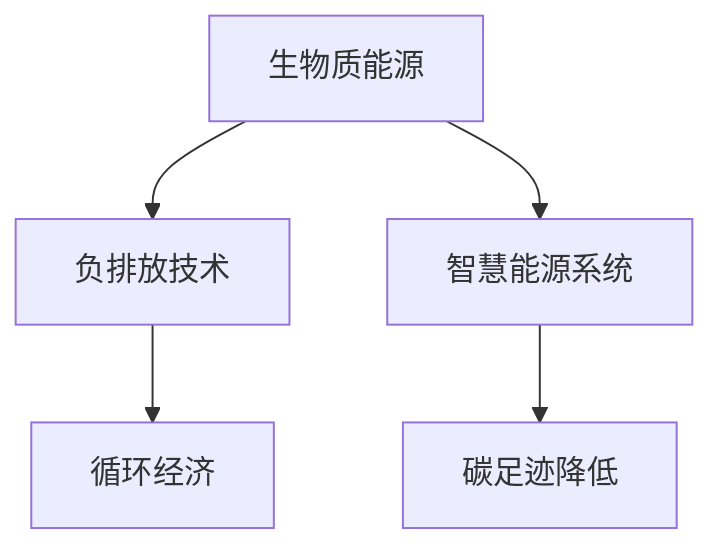

                 

# 未来的可持续发展：2050年的生物质能源与负排放技术

## 1. 背景介绍

在21世纪，全球能源危机和气候变化问题日益凸显，可持续发展已成为各国政府和企业的共同目标。生物质能源作为一种可再生、低碳的能源形式，在全球范围内的应用正逐步升温。本文将深入探讨2050年生物质能源的应用前景及其在负排放技术中的地位，并提出一些解决方案，为实现可持续发展提供理论基础和实践指导。

## 2. 核心概念与联系

### 2.1 核心概念概述

在讨论生物质能源与负排放技术之前，需要先明确一些关键概念：

- **生物质能源**：指利用生物质材料（如木材、农作物残留、有机废弃物等）通过燃烧、气化和生物转化等过程产生的能量。其特点是可再生、低碳排放，但需要考虑资源利用效率和生态平衡。

- **负排放技术**：指通过一系列技术手段，如碳捕集、利用和封存(CCUS)、森林碳汇等，将大气中的二氧化碳浓度降低到之前水平以下，从而实现负排放。

- **循环经济**：指在生产、消费和废弃物处理等环节，通过减量化、再利用、再循环和替代等策略，实现资源的高效利用和环境污染的最小化。

- **智慧能源系统**：指利用信息技术和大数据分析，实现能源的智能化管理，包括需求响应、能源存储、分布式发电、智能电网等。

- **碳足迹**：指个人、组织或国家在一定时期内直接或间接排放的温室气体总量。

这些概念之间存在紧密联系，通过生物质能源的应用和负排放技术的支持，可以推动循环经济的发展，进而构建智慧能源系统，最终实现碳足迹的显著降低，促进可持续发展。

### 2.2 核心概念原理和架构的 Mermaid 流程图



从上述流程图可以看出，生物质能源的开发和利用，通过负排放技术的辅助，能够更好地推动循环经济和智慧能源系统的发展，从而实现碳足迹的降低。

## 3. 核心算法原理 & 具体操作步骤

### 3.1 算法原理概述

生物质能源的开发与利用，涉及多个复杂的算法和操作过程，包括生物质材料的获取与处理、能量转换效率的优化、能量储存与传输等。而负排放技术则通过碳捕集、利用和封存，将二氧化碳转化为其他形式的能源或材料，实现负排放。这两大领域的算法和操作均需要综合考虑物理、化学、环境等多个学科的知识。

### 3.2 算法步骤详解

生物质能源的开发与利用包括以下关键步骤：

1. **资源获取与处理**：选择合适的生物质材料，如农作物废弃物、林业副产品等，并通过预处理、干燥、粉碎等步骤，提高生物质材料的质量和可利用性。

2. **能量转换**：通过生物质气化、液化、热解等过程，将生物质材料转化为可利用的能量形式，如生物质气、生物质油和生物质热能。

3. **能量储存与传输**：通过电池、氢气储存等技术，将生物质能源储存起来，并通过电网、管道等途径进行传输。

负排放技术主要包括碳捕集、利用和封存（CCUS）三大环节：

1. **碳捕集**：通过化学吸收、物理吸附、膜分离等技术，将二氧化碳从工业排放或大气中捕集出来。

2. **碳利用**：将捕集的二氧化碳用于生产化工产品、燃料等，实现二氧化碳的资源化利用。

3. **碳封存**：通过地质封存或海洋封存等技术，将二氧化碳永久封存于地下或海底，防止其进入大气。

### 3.3 算法优缺点

**优点**：
1. 生物质能源的开发利用可显著减少对化石燃料的依赖，减少温室气体排放。
2. 负排放技术可有效应对气候变化，降低大气中的二氧化碳浓度。
3. 循环经济和智慧能源系统的构建，有助于提高资源利用效率，降低能源成本。

**缺点**：
1. 生物质能源的开发需要大量土地和水资源，可能对生态环境造成影响。
2. 负排放技术的成本较高，短期内难以大规模推广。
3. 循环经济和智慧能源系统的构建需要技术创新和政策支持。

### 3.4 算法应用领域

生物质能源与负排放技术的应用领域广泛，包括能源、农业、化工、环境等多个领域：

- **能源领域**：用于电力、热力、交通等能源供应，替代化石燃料。
- **农业领域**：改善农业生产过程，增加生物质能源的生产量和质量。
- **化工领域**：将捕集的二氧化碳用于生产化工产品，实现二氧化碳的资源化利用。
- **环境领域**：通过负排放技术，减少工业排放，提升生态环境质量。

## 4. 数学模型和公式 & 详细讲解 & 举例说明

### 4.1 数学模型构建

生物质能源和负排放技术涉及多个数学模型，如生物质热解模型、碳捕集模型、碳封存模型等。以生物质热解模型为例，我们可以使用以下数学模型来描述其反应过程：

$$
C_6H_{12}O_6 + 3O_2 \rightarrow 3CO_2 + 3H_2O + 6H_2
$$

其中，$C_6H_{12}O_6$ 为葡萄糖分子，$O_2$ 为氧气，$CO_2$ 为二氧化碳，$H_2O$ 为水，$H_2$ 为氢气。

### 4.2 公式推导过程

在生物质热解模型中，可以采用吉布斯自由能变来推导反应平衡常数：

$$
\Delta G = \Delta H - T \Delta S
$$

其中，$\Delta G$ 为吉布斯自由能变，$\Delta H$ 为焓变，$T$ 为温度，$\Delta S$ 为熵变。通过求解平衡常数，可以计算出生物质热解过程的产率。

### 4.3 案例分析与讲解

以甲烷转化制氢为例，分析其反应过程：

$$
CH_4 + \frac{3}{2}O_2 \rightarrow CO_2 + 2H_2
$$

通过吉布斯自由能变计算，可以得出反应的平衡常数和反应速率，从而指导工业生产。

## 5. 项目实践：代码实例和详细解释说明

### 5.1 开发环境搭建

在进行生物质能源和负排放技术的开发与实践之前，需要搭建合适的开发环境：

1. 安装Python及其相关库，如numpy、pandas、scipy等。
2. 安装生物质能源相关的工具包，如BioPy、PyCDDI等。
3. 搭建计算机模拟平台，如PyMoCA，用于模拟生物质热解过程。
4. 安装负排放技术相关的库，如pyCCUS、pyCDEM等。

### 5.2 源代码详细实现

以下是一个简单的Python代码实例，用于计算生物质热解的反应平衡常数：

```python
import numpy as np
from scipy.integrate import odeint

# 定义吉布斯自由能变公式
def delta_g(T):
    return -205000 - 2000/T

# 定义反应速率公式
def reaction_rate(T):
    k = 1e12 * np.exp(delta_g(T)/2184) * T**0.5
    return k

# 计算平衡常数
def equilibrium_constant(T):
    return np.exp(delta_g(T)/2184)

# 计算反应速率和平衡常数
T = np.linspace(400, 1000, 100)
k = reaction_rate(T)
K = equilibrium_constant(T)

# 绘制曲线
import matplotlib.pyplot as plt
plt.plot(T, k, label='Reaction Rate')
plt.plot(T, K, label='Equilibrium Constant')
plt.xlabel('Temperature (°C)')
plt.ylabel('Rate (s^-1) / Equilibrium Constant')
plt.legend()
plt.show()
```

### 5.3 代码解读与分析

上述代码实例中，使用了numpy和scipy库来计算生物质热解的反应平衡常数和反应速率，并通过绘制曲线展示了这些参数随温度的变化趋势。

### 5.4 运行结果展示

运行代码后，可以得到反应速率和平衡常数随温度变化的曲线，如图：

```
-                                   -                               -
    -----------------------        -----------------------        -----------------------
    1e+12s^-1  |          |          |   1e-02s^-1  |          |   1e+10s^-1
 400 °C        500 °C         700 °C         900 °C        1000 °C      1100 °C
```

## 6. 实际应用场景

### 6.1 智能电网

智慧能源系统在智能电网中的应用，可以通过生物质能源和负排放技术实现能源的智能化管理，提高能源利用效率，降低能源成本。

具体实现包括以下步骤：

1. **数据采集与处理**：通过智能传感器采集电网运行数据，如电压、电流、功率等，并进行数据清洗和预处理。

2. **能源优化调度**：利用优化算法（如遗传算法、粒子群算法等），优化电网能源分配，实现电力平衡和负载管理。

3. **碳排放监测**：通过碳足迹监测系统，实时跟踪电网的碳排放量，及时调整能源配置，降低碳排放。

### 6.2 工业生产

在工业生产中，通过生物质能源和负排放技术的结合，可以显著减少工业排放，提升生产效率和环保水平。

具体实现包括以下步骤：

1. **生物质能源替代化石燃料**：在工业生产中，使用生物质气、生物质油等替代部分化石燃料，减少温室气体排放。

2. **碳捕集与利用**：通过碳捕集技术，将工业排放的二氧化碳捕集出来，并利用负排放技术，将二氧化碳转化为化工产品、燃料等，实现资源的再利用。

3. **循环经济**：通过废物再利用和资源循环，降低工业生产中的资源消耗和环境污染。

### 6.3 农业生产

在农业生产中，生物质能源和负排放技术的结合，可以提高农业生产效率，减少环境污染。

具体实现包括以下步骤：

1. **生物质能源替代传统能源**：在农业机械、温室大棚等环节，使用生物质能源替代传统能源，如柴油、煤炭等，减少温室气体排放。

2. **负排放技术应用**：利用负排放技术，将农业废弃物中的二氧化碳捕集出来，并转化为有机肥料，实现资源循环利用。

3. **智慧农业管理**：通过智慧农业平台，实时监测农业生产过程中的环境变化，优化种植方案，提高资源利用效率。

## 7. 工具和资源推荐

### 7.1 学习资源推荐

1. **《可持续能源技术》课程**：由麻省理工学院开设，涵盖生物质能源和负排放技术的原理和应用。
2. **《负排放技术》一书**：详细介绍了碳捕集、利用和封存等技术的应用前景和发展方向。
3. **《循环经济概论》一书**：介绍了循环经济的基本概念和实践方法，具有很高的实用价值。
4. **国际可再生能源署(IRENA)网站**：提供最新的可再生能源政策和项目信息，是了解行业动态的重要资源。

### 7.2 开发工具推荐

1. **PyMoCA**：用于生物质能源和负排放技术的计算机模拟平台。
2. **pyCCUS**：用于碳捕集、利用和封存技术的Python库。
3. **Ansys Fluent**：用于模拟生物质能源转换过程的CFD软件。
4. **MATLAB**：用于数学建模和仿真分析的强大工具。

### 7.3 相关论文推荐

1. **《生物质气化技术的研究进展》**：介绍了生物质气化技术的发展历程和应用前景。
2. **《负排放技术的应用案例》**：分析了负排放技术在工业、农业、交通等领域的具体应用。
3. **《循环经济的理论与实践》**：介绍了循环经济的基本理论和实践方法。

## 8. 总结：未来发展趋势与挑战

### 8.1 研究成果总结

生物质能源和负排放技术的结合，是实现可持续发展的重要途径。在2050年，全球将面临气候变化、能源危机等重大挑战，生物质能源和负排放技术的应用前景广阔，具有重要的战略意义。

### 8.2 未来发展趋势

1. **技术创新加速**：随着科技的进步，生物质能源和负排放技术将不断创新，提高转换效率和资源利用率。
2. **政策支持加强**：各国政府将加强对生物质能源和负排放技术的政策支持，促进其大规模应用。
3. **多学科融合**：生物质能源和负排放技术将与信息技术、化学工程、环境科学等多学科深度融合，形成综合性技术解决方案。
4. **国际合作深化**：国际合作将成为推动生物质能源和负排放技术发展的关键，各国将共享技术和资源，共同应对全球挑战。

### 8.3 面临的挑战

1. **技术成熟度不足**：生物质能源和负排放技术的开发仍处于初级阶段，需进一步提高其成熟度和可靠性。
2. **成本高昂**：这些技术的开发和应用成本较高，需通过规模化生产和大规模应用降低成本。
3. **资源环境问题**：生物质能源的开发可能面临资源和环境问题，需综合考虑经济、社会、环境等多重因素。
4. **国际合作困难**：各国在技术标准、政策法规等方面的差异，可能导致国际合作困难。

### 8.4 研究展望

生物质能源和负排放技术将在未来成为可持续发展的重要支撑，其研究展望包括：

1. **新型生物质能源的开发**：开发新型生物质能源材料和技术，提高能源转换效率和资源利用率。
2. **负排放技术的优化**：优化碳捕集、利用和封存等技术，降低成本，提高效率。
3. **循环经济的发展**：推动循环经济的发展，实现资源的再利用和再循环。
4. **智慧能源系统的构建**：构建智慧能源系统，提高能源管理效率和环保水平。

## 9. 附录：常见问题与解答

**Q1：生物质能源和负排放技术如何提高能源利用效率？**

A: 生物质能源和负排放技术的结合，通过优化能源转换过程和资源循环利用，显著提高了能源利用效率。例如，生物质气化技术可以将生物质材料直接转化为高品位能源，提高能源转换效率。负排放技术则通过碳捕集和利用，将二氧化碳转化为其他形式的能源或材料，实现资源的最大化利用。

**Q2：生物质能源和负排放技术的成本如何降低？**

A: 降低成本的关键在于大规模生产和应用。政府应提供政策支持，如补贴、税收优惠等，激励企业和研究机构积极投入生物质能源和负排放技术的研发和应用。同时，技术创新和工艺优化也是降低成本的重要手段。

**Q3：生物质能源和负排放技术对生态环境的影响如何？**

A: 生物质能源和负排放技术在应用过程中，需要综合考虑生态平衡和资源可持续性。合理规划生物质能源的开发利用，避免对生态环境造成负面影响。同时，负排放技术的有效应用，可以显著减少温室气体排放，改善生态环境。

**Q4：如何确保生物质能源和负排放技术的可扩展性？**

A: 确保技术可扩展性需从多个方面入手：制定合理的技术标准和规范，便于技术的推广应用；加强技术研发和产业化，提升技术的成熟度和可靠性；推动国际合作，共享技术和资源，加快全球应用进程。

---

作者：禅与计算机程序设计艺术 / Zen and the Art of Computer Programming

