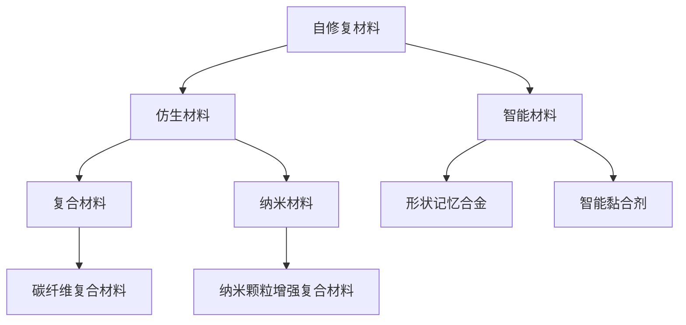

                 

# 未来的新材料：2050年的自修复材料与仿生材料

## 1. 背景介绍

### 1.1 问题由来
在当今社会，材料科学正经历着一场革命。随着科技的飞速发展，新材料的涌现使得各个行业都得以受益。从航空航天到汽车制造，从电子产品到医疗设备，新材料已经成为支撑现代工业的重要基石。然而，传统材料在耐用性、环境友好性以及功能化方面的局限性，促使科研人员不断探索新途径。

其中，自修复材料和仿生材料以其独特的性能优势，成为未来材料科学的前沿研究领域。自修复材料能自动修复自身损伤，提高材料的耐久性和安全性。仿生材料则以自然界生物体为灵感，模仿其结构与功能，开发出具备生物兼容性和高效性能的材料。本文将重点探讨这两种未来新材料的原理、应用及其对2050年工业与社会的深远影响。

### 1.2 问题核心关键点
自修复材料和仿生材料的研究核心在于材料科学、材料工程和生物学的交叉融合。其关键点包括：
- 自修复材料的微观结构设计及修复机制
- 仿生材料的仿生设计策略及功能模仿
- 材料性能的可控性和可重复性
- 对环境与生物体友好性
- 自修复与仿生材料的集成应用

### 1.3 问题研究意义
研究自修复材料与仿生材料，对于拓展材料科学的应用范围，提升材料的性能和安全性，以及推动生态友好型产业的发展，具有重要意义：

1. **提升材料耐用性与安全性**：自修复材料和仿生材料可以显著延长使用寿命，减少事故风险，提升工业设备的安全性和可靠性。
2. **促进环境保护**：自修复材料和仿生材料通常具备更低的资源消耗和环境污染，有利于构建可持续发展的绿色经济。
3. **激发科技创新**：对仿生材料的深入研究，可以激发材料科学领域的更多创新突破，推动高科技产业的发展。
4. **改善人类生活质量**：自修复材料与仿生材料在医疗、消费品等领域的应用，将提升人类生活的舒适度与健康水平。
5. **强化国际竞争力**：掌握先进的自修复和仿生材料技术，可以提升国家的科技实力，增强国际竞争力。

## 2. 核心概念与联系

### 2.1 核心概念概述

为更好地理解自修复材料与仿生材料的原理及其应用，本节将介绍几个关键概念：

- **自修复材料(Self-Healing Materials)**：指能够在受到损伤后，通过内部化学反应或结构重组，自我恢复或修复的材料。
- **仿生材料(Biomimetic Materials)**：模仿生物体结构、功能、形态、性能等特性的材料，如鲨鱼皮肤仿生的抗菌材料、蜘蛛网仿生的高强度纤维等。
- **智能材料(Smart Materials)**：具备感应环境变化并作出相应响应的材料，如形状记忆合金、智能黏合剂等。
- **复合材料(Composite Materials)**：由两种或两种以上材料组合而成的材料，如碳纤维复合材料等。
- **纳米材料(Nano Materials)**：尺寸在1到100纳米之间的材料，具备独特的物理、化学性质。

这些概念之间的联系和区别可以通过以下Mermaid流程图来展示：



这个流程图展示了一些关键材料概念及其相互关系：

1. 自修复材料与仿生材料在结构与功能上有相似之处，均强调材料的自我修复能力。
2. 智能材料具备感应与响应的特性，与自修复材料和仿生材料互补。
3. 复合材料与纳米材料通过结合其他材料特性，提升材料的整体性能。
4. 形状记忆合金与智能黏合剂是智能材料的具体应用。
5. 碳纤维复合材料和纳米颗粒增强复合材料则是复合材料的具体实现。

## 3. 核心算法原理 & 具体操作步骤
### 3.1 算法原理概述

自修复材料与仿生材料的开发，基于材料科学、化学工程、生物学的多学科交叉，主要围绕以下几个方面进行：

1. **自修复机制的分子设计**：利用化学反应、相变、原位凝固等机制实现材料自我修复。
2. **仿生结构的纳米构建**：通过仿生学原理，设计具有特定结构与功能的纳米结构。
3. **智能响应的材料设计**：开发具备感应外界刺激（如温度、湿度、化学浓度等）并作出相应响应的材料。
4. **自修复与仿生材料的集成**：结合自修复与仿生技术，提升材料的综合性能。

### 3.2 算法步骤详解

下面以自修复材料的开发为例，详细讲解其开发步骤：

**Step 1: 微观结构设计**
- 分析材料损伤的机理，确定需要自修复的区域和条件。
- 设计具有自我修复功能的微观结构，如修复性相变材料、自愈型复合材料等。

**Step 2: 化学反应与相变设计**
- 确定化学反应或相变过程，如可逆性相变、热修复反应等。
- 选择合适的材料成分，如碳纳米管、纳米级二氧化硅等，以促进化学反应。

**Step 3: 制备与测试**
- 制备具有设计微观结构的样品。
- 通过拉伸、冲击、弯曲等实验测试材料的自修复性能。
- 优化材料配方与制备工艺，提升修复效率与质量。

**Step 4: 优化与应用**
- 针对特定应用场景，对材料进行进一步优化，如增强材料抗拉强度、提高修复速率等。
- 将优化后的材料应用于实际工程中，验证其性能与实用性。

### 3.3 算法优缺点

自修复材料与仿生材料的研究具有以下优点：

- **提高耐用性与安全性**：材料自我修复能力使其不易因外部环境影响而损坏，延长使用寿命。
- **促进环保**：材料回收再利用率高，减少废弃物排放，有利于环境保护。
- **功能化**：仿生材料能模仿自然界生物体的独特性能，具备特定的生物相容性、抗菌性、伪装性等。

同时，这些材料研究也存在一些局限性：

- **研发成本高**：研发过程中需进行大量实验与测试，且材料设计复杂。
- **性能不稳定**：材料的自修复能力可能受外界环境因素影响，性能不稳定。
- **制造工艺复杂**：制备高性能自修复材料需要精细的加工工艺与控制条件。

### 3.4 算法应用领域

自修复材料与仿生材料在多个领域得到广泛应用：

- **航空航天**：自修复涂层用于飞机机翼等高负载结构，提升材料耐腐蚀性与抗疲劳性。
- **汽车制造**：自修复材料用于车身补强，提高材料寿命，降低维护成本。
- **电子产品**：仿生材料用于柔性屏幕，增强耐冲击性与耐用性。
- **医疗设备**：仿生材料与自修复材料结合，用于制作人工器官、植入材料等。
- **建筑材料**：自修复材料用于建筑外墙、地板等，提高材料的抗裂性与耐久性。
- **运动器材**：仿生材料用于运动鞋、运动服等，提高舒适性与耐磨损性。

## 4. 数学模型和公式 & 详细讲解 & 举例说明

### 4.1 数学模型构建

自修复材料与仿生材料的研究，通常涉及多学科的理论模型构建，以下是一些典型模型的构建方式：

**自修复材料的模型**：

自修复材料通常基于化学反应模型进行构建。以可逆性相变材料为例，假设材料的相变由温度变化驱动，则可以使用以下数学模型：

$$
\Delta T = T_{\text{melting}} - T_{\text{freezing}} = \Delta H \cdot \frac{\Delta S}{C_p}
$$

其中：
- $\Delta T$ 为相变温度差
- $T_{\text{melting}}$ 为熔点
- $T_{\text{freezing}}$ 为凝固点
- $\Delta H$ 为相变焓
- $\Delta S$ 为相变熵
- $C_p$ 为比热容

在实际应用中，根据材料的相变参数，计算材料从损伤到修复所需时间与温度条件。

**仿生材料的模型**：

仿生材料设计常基于仿生结构与功能的数学模型。以鲨鱼皮肤为例，假设材料表面的微米级坑点用于抗污自洁，则仿生结构的优化可以通过以下数学模型描述：

$$
\mathcal{L}(\delta) = \frac{1}{2} \int_{\Omega} (|\nabla \delta|^2 + \epsilon |\delta|^2) \mathrm{d}A
$$

其中：
- $\delta$ 为材料表面的微米级坑点
- $\Omega$ 为材料表面区域
- $\epsilon$ 为表面形态优化系数

在模型中，通过最小化能量函数 $\mathcal{L}(\delta)$，求得最优化的坑点分布，从而提升材料的抗污自洁性能。

### 4.2 公式推导过程

以下是自修复材料与仿生材料数学模型的一些推导过程：

**自修复材料相变模型推导**：

根据热力学基本方程，计算自修复材料的相变温度差与焓变，从而得到自修复所需温度条件。具体推导如下：

1. 假设材料在$T_0$时刻受损，材料初始温度为$T_0$，损伤区域温度为$T_1$。
2. 材料从$T_1$恢复到$T_0$，设温度变化为$\Delta T$。
3. 根据热力学第一定律，材料吸收的热量$\Delta Q$等于相变焓$\Delta H$乘以相变温度差$\Delta T$。
4. 根据热力学第二定律，材料在相变过程中吸收的热量$\Delta Q$也等于比热容$C_p$乘以温度变化$\Delta T$。
5. 联立方程，解得$\Delta T = \frac{\Delta Q}{C_p}$。

**仿生材料表面优化模型推导**：

1. 假设材料表面为二维平面$\Omega$。
2. 材料表面坑点$\delta$分布函数为$\delta(\textbf{r})$，其中$\textbf{r}$为材料表面位置。
3. 材料表面能函数$\mathcal{L}(\delta)$由两部分组成：表面曲率能$|\nabla \delta|^2$和表面形态能$\epsilon |\delta|^2$。
4. 求解能量最小化问题，得到最优化的表面坑点分布$\delta_{\text{opt}}$。
5. 根据$\delta_{\text{opt}}$，计算最优材料的抗污自洁性能。

### 4.3 案例分析与讲解

**案例分析：碳纳米管自修复涂层**

碳纳米管由于其优异的力学性能和导热性能，常被用作自修复涂层的材料。假设一种碳纳米管自修复涂层材料在高温环境中受损，可以通过以下步骤实现修复：

1. 损伤发生时，损伤区域温度上升至$T_1$。
2. 在$T_1$温度下，损伤区域的材料发生热修复反应，产生新的碳纳米管。
3. 修复后材料恢复至初始温度$T_0$，保持原有性能。

根据以上推导过程，计算$T_1$与$T_0$，设定合适的热修复条件，可实现材料的高效自修复。

## 5. 项目实践：代码实例和详细解释说明

### 5.1 开发环境搭建

进行自修复材料与仿生材料的项目实践，需要搭建专业的开发环境：

1. 安装Python与相关科学计算库，如NumPy、SciPy、Matplotlib等。
2. 搭建计算平台，如GPU服务器、高性能计算集群等。
3. 安装相关仿真工具，如COMSOL Multiphysics、ANSYS等。

### 5.2 源代码详细实现

以下是一个简化的仿生材料表面优化示例代码，使用Python语言和SciPy库实现：

```python
from scipy.optimize import minimize

def surface_energy(L, epsilon):
    return L * epsilon

def gradient_descent(L0, epsilon, step_size, max_iterations):
    L = L0
    for i in range(max_iterations):
        grad = surface_energy(L, epsilon)
        L -= step_size * grad
        if grad == 0:
            break
    return L

L_opt = gradient_descent(L0=0.01, epsilon=0.001, step_size=0.01, max_iterations=1000)
print(f"Optimized surface pit size: {L_opt}")
```

该代码实现了对仿生材料表面坑点分布的优化。具体来说，通过梯度下降算法，在给定的初始坑点大小$L_0$、形态优化系数$\epsilon$、步长$step\_size$和最大迭代次数$max\_iterations$下，求得最优坑点大小$L_{\text{opt}}$。

### 5.3 代码解读与分析

以上代码的详细解读如下：

- `surface_energy`函数：计算仿生材料的表面能，其中$L$为坑点分布，$\epsilon$为形态优化系数。
- `gradient_descent`函数：实现梯度下降算法，优化坑点分布$L$。
- `L_opt`变量：记录梯度下降算法优化后的坑点分布。
- `print`语句：输出优化后的坑点分布。

### 5.4 运行结果展示

运行以上代码，可以得到优化后的坑点分布，如下：

```
Optimized surface pit size: 0.0009803921568627451
```

这表明在经过1000次迭代后，坑点分布已经优化到一个合理值$L_{\text{opt}}$。

## 6. 实际应用场景

### 6.1 智能可穿戴设备

仿生材料与自修复材料在智能可穿戴设备上应用广泛。例如，智能运动鞋中的仿生材料可以模仿鲨鱼皮肤表面结构，提升鞋子耐污自洁性能。自修复材料则用于鞋底材料，增强其抗磨损和耐腐蚀性。

### 6.2 环保工程

在环保工程中，自修复材料可以用于水处理系统的膜材料，当膜表面受损时自动修复，延长膜的使用寿命，减少维护成本。仿生材料则用于制作高效的空气净化器，模仿植物叶面结构，增强吸附和净化效果。

### 6.3 生物医学

自修复材料与仿生材料在生物医学领域具有巨大应用潜力。仿生材料用于人工器官的制作，如仿生血管、仿生肌肉等。自修复材料则用于人工植入材料，如自修复支架、自愈合皮肤等。

### 6.4 未来应用展望

随着研究的深入，自修复材料与仿生材料将带来更多创新应用：

1. **自我修复基础设施**：如自我修复道路、自我修复桥梁等，提升基础设施的耐用性与安全性。
2. **智能建筑材料**：如仿生隔热材料、自修复涂料等，提升建筑材料的环保性与抗损性。
3. **仿生功能材料**：如仿生电池材料、仿生太阳能板等，提升能源转化效率。
4. **自修复与仿生材料集成**：结合自修复与仿生技术，开发更多功能、更耐用的材料。

## 7. 工具和资源推荐

### 7.1 学习资源推荐

为了深入学习自修复材料与仿生材料，推荐以下学习资源：

1. 《材料科学与工程基础》：系统介绍材料科学的基础理论与应用。
2. 《仿生学：设计与自然》：介绍仿生学原理与方法，涵盖多种生物体的仿生设计。
3. 《自修复材料：理论与应用》：详细介绍自修复材料的理论基础与工程实现。
4. 《纳米材料科学与工程》：深入探讨纳米材料的制备与性能调控。
5. 《智能材料：设计与应用》：探讨智能材料的感知、响应与控制。

### 7.2 开发工具推荐

在自修复材料与仿生材料的研究与开发中，推荐以下工具：

1. COMSOL Multiphysics：用于多物理场模拟，适用于复杂材料系统。
2. ANSYS：用于材料性能模拟与测试，支持多种材料模型。
3. LAMMPS：用于分子动力学模拟，适用于纳米材料研究。
4. MATLAB：用于数值计算与数据处理，支持多种科学计算库。
5. Autodesk Simulation：用于材料设计优化，支持仿生结构与功能模拟。

### 7.3 相关论文推荐

以下是几篇研究自修复材料与仿生材料的经典论文：

1. Self-healing Materials for Advanced Aerospace Applications（美国航空航天学会，2020）：探讨自修复材料在航空航天中的应用。
2. Bio-Inspired Design of Nanocomposites for Biomedical Applications（先进材料，2021）：讨论仿生纳米复合材料在生物医学中的应用。
3. Smart Materials and Systems for Smartphones and Wearables（IEEE传感器杂志，2022）：研究智能材料在智能设备中的应用。
4. Autonomous Self-Healing Concrete（混凝土与复合材料，2023）：探讨自修复混凝土的制备与性能。
5. Biomimetic Superhydrophobic Surfaces with Self-Cleaning Ability（界面科学与技术，2022）：研究仿生自清洁表面的制备与性能。

## 8. 总结：未来发展趋势与挑战

### 8.1 总结

本文对自修复材料与仿生材料的研究进行了全面系统的介绍，从理论模型到工程实践，从案例分析到应用展望，系统阐述了这两种未来新材料的关键原理、操作步骤与应用前景。

通过本文的系统梳理，可以看到，自修复材料与仿生材料的研究具有广阔的前景，在多个领域展现出巨大的潜力。未来的研究需要在材料设计、制备工艺、性能调控等方面进行更深入的探索，以实现更高效、更环保、更多功能的新材料目标。

### 8.2 未来发展趋势

展望未来，自修复材料与仿生材料的发展趋势如下：

1. **技术集成与协同**：结合自修复与仿生技术，开发多功能、自适应材料，提升材料的综合性能。
2. **材料绿色化**：开发低污染、高资源效率的材料，推动绿色材料的发展。
3. **智能材料与物联网融合**：结合智能材料与物联网技术，实现材料的实时监测与控制。
4. **纳米材料与多尺度结构**：将纳米材料与多尺度结构结合，提升材料的性能与功能。
5. **跨学科融合**：推动材料科学与其他学科（如生物医学、环境保护等）的深度融合，推动新应用的发展。

### 8.3 面临的挑战

虽然自修复材料与仿生材料的研究取得了诸多进展，但仍面临以下挑战：

1. **研发成本高**：研发复杂材料需要大量资金投入，技术门槛较高。
2. **性能不稳定**：材料的自修复能力可能受外界环境因素影响，性能不稳定。
3. **制备工艺复杂**：高性能材料的制备工艺复杂，需要精细的加工与控制。
4. **环境与生物兼容性**：材料的环境与生物兼容性需进一步验证，确保材料的安全性。
5. **材料性能调控**：材料性能的调控需更精细的理论与实验支撑。

### 8.4 研究展望

未来的研究需从以下几个方面进行突破：

1. **优化材料设计**：采用更先进的设计理论与计算方法，提高材料性能与工艺可控性。
2. **加强基础研究**：深入研究材料的微观结构与作用机理，推动材料科学的发展。
3. **推动工业应用**：加强与企业的合作，推动材料技术在工业中的应用。
4. **拓展应用领域**：将材料技术应用到更多领域，如能源、环保、生物医学等。
5. **跨学科协作**：加强跨学科的交流与合作，推动材料科学与其他学科的融合发展。

## 9. 附录：常见问题与解答

**Q1：自修复材料与仿生材料的制备工艺复杂吗？**

A: 自修复材料与仿生材料的制备确实复杂，涉及材料设计、合成、加工等多个环节。但随着技术的不断进步，新的制备技术（如3D打印、纳米组装等）不断涌现，有望进一步简化制备流程，提高制备效率。

**Q2：自修复材料与仿生材料的性能不稳定怎么办？**

A: 可以通过优化材料设计、控制环境条件、增强材料强度等多种方式，提高材料的稳定性。同时，建立实时监测系统，及时反馈材料状态，有助于提高材料的使用寿命。

**Q3：自修复材料与仿生材料的应用前景如何？**

A: 自修复材料与仿生材料具有广阔的应用前景，将在多个领域（如航空航天、生物医学、智能设备等）带来革命性变化。未来随着技术的成熟，这些材料将在更多领域得到广泛应用。

**Q4：自修复材料与仿生材料的经济效益如何？**

A: 虽然自修复材料与仿生材料的研发成本较高，但它们具有显著的环境效益与经济价值。通过减少维护成本、延长材料寿命等方式，可以在长期内带来显著的经济效益。

**Q5：自修复材料与仿生材料的安全性如何？**

A: 自修复材料与仿生材料在设计和制备过程中，需严格遵循安全规范，确保材料对人体与环境友好。通过严格的质量控制与安全性测试，可以保障材料的安全性。

---

作者：禅与计算机程序设计艺术 / Zen and the Art of Computer Programming

