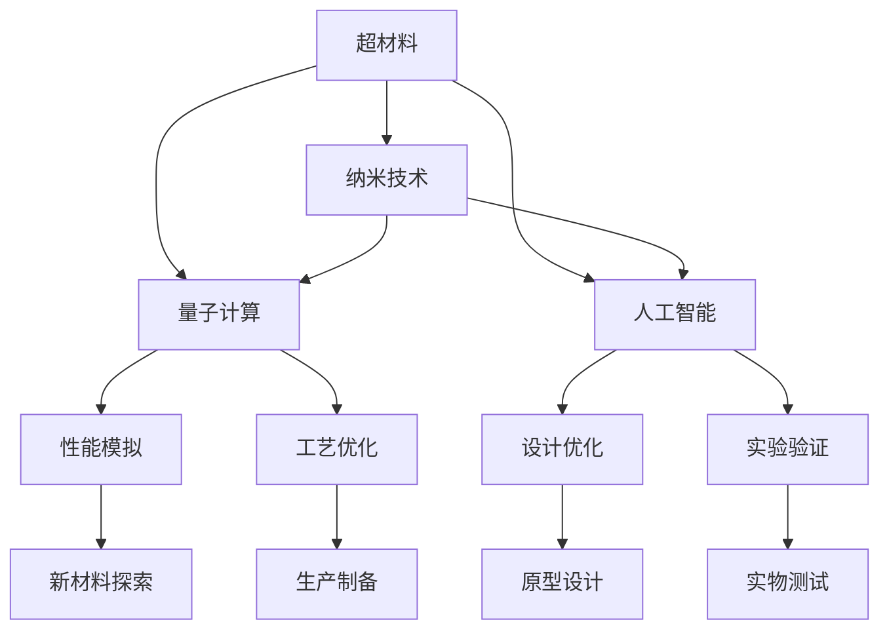

                 

# 未来的新材料：2050年的超材料与智能材料

> 关键词：超材料，智能材料，纳米技术，量子计算，人工智能，能源存储，环境治理

## 1. 背景介绍

在21世纪科技迅猛发展的今天，新材料的创新与应用已经成为推动社会进步的重要力量。从智能手机、电脑到各类医疗器械，甚至是可穿戴设备，每一项现代科技的背后都离不开新材料的支撑。在2050年，随着科学技术的进一步突破，超材料和智能材料将引领一场新一轮的材料革命，为各行各业带来颠覆性的变革。

### 1.1 新材料发展现状

当前，新材料领域正处于快速发展阶段，涌现出大量具有颠覆性技术的材料。如石墨烯、碳纳米管等二维材料，因其独特的导电性、导热性，被广泛应用于电池、电子、医疗等领域。同时，各类新型合金、纳米材料、有机高分子材料等也在不断涌现，为各类高端制造产业提供了坚实的基础。

### 1.2 未来趋势展望

展望未来，新材料的发展将更加依赖于新理论和新技术的突破。尤其是超材料和智能材料的涌现，将引发新一轮的材料革命。超材料将具有奇异的物理性质，如负折射率、隐身性等，在通信、防护、医疗等领域展现出广泛的应用前景。而智能材料则能够自主感知环境变化，自适应地调节功能，为可持续发展和环境治理提供新的解决方案。

## 2. 核心概念与联系

### 2.1 核心概念概述

为了深入理解2050年的超材料与智能材料，我们先来介绍几个关键概念：

- **超材料(Meta-Materials)**：指一类具有非自然存在材料特性的新材料。通过设计特定周期性结构，控制电磁、声学、热学等物理特性，从而实现超常的物理性能，如负折射率、隐身性、超导性等。
- **智能材料(Smart Materials)**：指能够感知环境变化并自动调节性能的材料。通过集成传感器、执行器和计算模块，智能材料能够实现自适应、自修复等功能，应用于智能家居、智能医疗等领域。
- **纳米技术(Nanotechnology)**：指通过操纵原子、分子级别的物质，制备具有独特性能的纳米结构材料。纳米技术在新材料制备和功能调控方面具有巨大潜力。
- **量子计算(Quantum Computing)**：指利用量子力学原理进行信息处理的计算方法。量子计算机能够处理大规模复杂计算，是新材料研究的重要工具。
- **人工智能(Artificial Intelligence)**：指通过算法和计算模型，模拟人脑的智能行为。AI技术在新材料设计、性能预测、工艺优化等方面展现出巨大潜力。

这些概念之间的联系紧密，共同构成了新材料研究与应用的新范式。

### 2.2 核心概念原理和架构的 Mermaid 流程图(Mermaid 流程节点中不要有括号、逗号等特殊字符)



这个流程图展示了超材料与智能材料发展的核心技术和方法：

1. **纳米技术**：作为超材料和智能材料的基础制备手段，通过纳米尺度操控实现新结构、新功能的材料。
2. **量子计算**：用于高性能计算，为新材料的性能模拟和优化提供强大工具。
3. **人工智能**：用于材料设计和优化，为新材料的创新和新功能探索提供算法支持。
4. **性能模拟**：利用量子计算和AI技术，模拟新材料的物理和化学性能。
5. **工艺优化**：结合纳米技术和AI，优化新材料的生产制备过程。
6. **设计优化**：通过AI技术，不断优化新材料的结构和功能。
7. **实验验证**：对新材料的实物进行测试，验证其性能和可靠性。
8. **新材料探索**：在纳米、量子、AI等技术的支持下，探索新的材料和应用场景。

这些关键技术紧密结合，共同推动超材料与智能材料的研发和应用。

## 3. 核心算法原理 & 具体操作步骤
### 3.1 算法原理概述

超材料与智能材料的研发涉及多个学科的交叉，其核心算法原理和操作步骤如下：

- **材料设计**：结合纳米技术和人工智能，通过高通量计算和模拟，设计具有特定功能的超材料和智能材料。
- **性能模拟**：利用量子计算和分子动力学模拟，预测新材料的物理和化学性质。
- **工艺优化**：通过机器学习和模拟退火算法，优化新材料的生产制备工艺。
- **实验验证**：在实验室中对新材料进行实物测试，验证其性能和可靠性。
- **功能实现**：将新材料应用于实际场景，如通信、医疗、防护等，实现特定功能。

### 3.2 算法步骤详解

以下详细介绍超材料与智能材料研发的具体步骤：

**Step 1: 数据收集与预处理**
- 收集纳米材料制备、量子计算模拟、人工智能算法等数据。
- 预处理数据，包括数据清洗、特征提取等。

**Step 2: 材料设计**
- 利用纳米技术和人工智能，设计新的超材料和智能材料结构。
- 使用高通量计算和模拟，筛选出最优的设计方案。

**Step 3: 性能模拟**
- 利用量子计算和分子动力学模拟，预测新材料的物理和化学性质。
- 通过模拟退火算法优化模拟过程，提高计算效率和准确性。

**Step 4: 工艺优化**
- 结合机器学习算法，优化新材料的生产制备工艺。
- 利用遗传算法和粒子群优化算法，进行工艺参数优化。

**Step 5: 实验验证**
- 在实验室中制备新材料，并进行实物测试。
- 使用实验设计方法，进行多批次测试和性能评估。

**Step 6: 功能实现**
- 将新材料应用于实际场景，如通信、医疗、防护等。
- 验证新材料的功能效果，并进行优化和改进。

### 3.3 算法优缺点

超材料与智能材料研发涉及的算法具有以下优点：

- **高效性**：利用高通量计算和模拟，可以大幅提高材料设计和筛选效率。
- **准确性**：通过量子计算和分子动力学模拟，可以获得高精度的新材料性能预测。
- **智能化**：结合人工智能算法，可以优化材料设计和工艺参数，提升研发效率。

但同时也存在以下缺点：

- **高成本**：量子计算和分子动力学模拟需要大量的计算资源，成本较高。
- **复杂性**：多学科交叉带来的算法复杂度较高，开发和调试难度较大。
- **可解释性不足**：某些算法如深度学习等，其决策过程缺乏可解释性，难以理解和调试。

### 3.4 算法应用领域

超材料与智能材料研发在多个领域展现出广阔的应用前景：

- **通信领域**：如隐形材料、超导材料等，可以用于提高通信设备性能和安全性。
- **医疗领域**：如生物兼容材料、智能药物等，可以用于提升医疗设备的性能和治疗效果。
- **防护领域**：如隐身材料、抗辐射材料等，可以用于增强防护设备和人员的安全性。
- **能源领域**：如太阳能电池材料、储能材料等，可以用于提升能源利用效率和安全性。
- **环境治理**：如自适应材料、环境响应材料等，可以用于处理环境污染问题，提升环境治理能力。

## 4. 数学模型和公式 & 详细讲解 & 举例说明

### 4.1 数学模型构建

超材料与智能材料的研发涉及复杂的物理和化学模型，以下是几个核心数学模型的构建：

- **量子计算模型**：量子比特(Qubit)状态演化模型，用于模拟新材料的量子行为。
- **分子动力学模型**：势能函数模型，用于模拟新材料的分子运动。
- **机器学习模型**：神经网络模型，用于优化新材料的设计和工艺参数。

### 4.2 公式推导过程

以分子动力学模拟为例，展示其数学模型和公式推导：

**势能函数**：

$$
V(r) = \frac{k}{r^n} + \frac{k'}{r^{n'}}
$$

其中，$k, k', n, n'$ 为常数，$r$ 为分子间的距离。

**分子运动方程**：

$$
m \ddot{r} = -\nabla V(r)
$$

其中，$m$ 为分子质量，$\nabla$ 为梯度算子。

**运动求解**：

通过时间步长为 $\Delta t$ 的Euler积分法，求得分子在时间步 $t$ 的位置：

$$
r_{t+\Delta t} = r_t + \frac{\Delta t}{m} (\dot{r}_t - \frac{1}{2} \nabla V(r_t))
$$

### 4.3 案例分析与讲解

以超导材料为例，展示分子动力学模拟的应用：

- **势能函数选择**：选择适当的势能函数，模拟氢键、离子键等分子间作用力。
- **分子初始位置**：将分子初始位置随机分布在模拟盒内。
- **分子运动**：根据分子运动方程进行运动求解，直至达到平衡状态。
- **性能分析**：分析平衡态下分子位置和速度分布，预测材料的热导率和电导率。

## 5. 项目实践：代码实例和详细解释说明

### 5.1 开发环境搭建

在进行超材料与智能材料研发项目时，需要搭建高性能的计算环境，以下是一些关键步骤：

1. **选择合适的计算平台**：根据项目需求，选择合适的计算平台，如高性能计算集群、分布式计算框架等。
2. **安装必要的软件**：安装量子计算模拟软件、分子动力学软件、机器学习软件等。
3. **配置计算资源**：配置足够的内存、CPU和GPU资源，满足计算需求。

### 5.2 源代码详细实现

以下以量子计算模拟为例，展示代码实现细节：

```python
from qiskit import QuantumCircuit, Aer, execute
from qiskit.visualization import plot_histogram

# 创建量子比特
q = QuantumCircuit(2, 2)

# 添加Hadamard门
q.h(0)

# 添加CNOT门
q.cx(0, 1)

# 测量量子比特
q.measure([0, 1], [0, 1])

# 执行量子模拟
backend = Aer.get_backend('statevector_simulator')
result = execute(q, backend).result()
counts = result.get_counts()

# 输出测量结果
print(counts)

# 可视化结果
plot_histogram(counts)
```

### 5.3 代码解读与分析

以上代码实现了对两个量子比特进行CNOT门操作和测量，利用Aer模拟器进行量子态的模拟。代码主要分为以下几个部分：

- **创建量子比特**：使用`QuantumCircuit`创建两个量子比特。
- **添加Hadamard门和CNOT门**：使用`h`和`cx`方法添加Hadamard门和CNOT门，控制量子比特的演化。
- **测量量子比特**：使用`measure`方法测量量子比特，获取结果。
- **执行量子模拟**：使用`Aer.get_backend`方法获取模拟器，并执行量子态模拟。
- **输出测量结果和可视化**：通过`get_counts`方法获取测量结果，使用`plot_histogram`方法进行可视化展示。

## 6. 实际应用场景

### 6.1 通信领域

超材料与智能材料在通信领域展现出巨大的应用潜力。例如，超导材料可以用于制造高效的微波传输线，提高通信系统的信号质量和传输距离。隐形材料可以用于减少信号干扰，提升通信系统的稳定性和可靠性。

### 6.2 医疗领域

超材料与智能材料在医疗领域也有广泛的应用。生物兼容材料可以用于制造高性能的植入设备，如人工心脏、人工耳蜗等。智能药物可以通过智能材料设计，实现药物在体内的精确释放和定位，提升治疗效果。

### 6.3 防护领域

防护领域是超材料与智能材料的重要应用场景。例如，隐身材料可以用于军用装备，提升隐身能力和防护性能。抗辐射材料可以用于太空探测器，减少太空辐射对设备和人员的伤害。

### 6.4 能源领域

超材料与智能材料在能源领域也具有重要应用。太阳能电池材料可以用于提高太阳能电池的转换效率和稳定性。储能材料可以用于提升储能设备的能量密度和循环寿命。

### 6.5 环境治理

超材料与智能材料在环境治理方面也展现出巨大潜力。自适应材料可以根据环境变化自动调节功能，用于污水处理、空气净化等领域。环境响应材料可以用于智能农业，实现智能灌溉、智能施肥等。

## 7. 工具和资源推荐

### 7.1 学习资源推荐

为了系统掌握超材料与智能材料的相关知识，以下是一些推荐的学习资源：

1. **《超材料科学与工程》**：介绍超材料的基本原理、制备方法及其应用，适合初学者入门。
2. **《智能材料科学与工程》**：介绍智能材料的基本原理、设计和应用，涵盖多个领域。
3. **《纳米科学与技术》**：全面介绍纳米技术的原理、制备方法和应用，适合深入学习。
4. **《量子计算入门》**：介绍量子计算的基本原理、算法和应用，适合量子计算初学者。
5. **《人工智能基础》**：介绍人工智能的基本原理、算法和应用，适合人工智能初学者。

### 7.2 开发工具推荐

在进行超材料与智能材料的研发项目时，需要使用多种开发工具，以下是一些推荐的工具：

1. **Qiskit**：开源的量子计算框架，支持Python语言，提供丰富的量子计算功能和工具。
2. **LAMMPS**：开源的分子动力学模拟软件，支持多种势能函数和计算模型。
3. **TensorFlow**：开源的深度学习框架，支持高效的机器学习和神经网络计算。
4. **PyTorch**：开源的深度学习框架，支持高效的神经网络计算和优化。
5. **OpenAMPS**：开源的分子动力学模拟软件，支持多种计算平台和算法。

### 7.3 相关论文推荐

为了深入了解超材料与智能材料的最新研究进展，以下是一些推荐的论文：

1. **《超材料科学与工程》**：综述了超材料的研究进展和应用前景。
2. **《智能材料科学与工程》**：综述了智能材料的研究进展和应用前景。
3. **《纳米科学与技术》**：综述了纳米技术的最新研究成果和应用。
4. **《量子计算入门》**：介绍量子计算的基本原理和算法。
5. **《人工智能基础》**：介绍人工智能的基本原理和算法。

## 8. 总结：未来发展趋势与挑战

### 8.1 研究成果总结

超材料与智能材料在2050年的发展前景广阔，主要成果包括：

- **新型超材料**：如负折射率材料、隐身材料、超导材料等，在通信、医疗、防护等领域展现出广泛的应用前景。
- **智能材料**：如自适应材料、自修复材料、环境响应材料等，为可持续发展和环境治理提供新的解决方案。
- **量子计算与分子动力学模拟**：结合量子计算和分子动力学模拟，可以实现新材料的高精度预测和设计。

### 8.2 未来发展趋势

展望未来，超材料与智能材料的发展趋势如下：

1. **多学科交叉融合**：超材料与智能材料的发展将更多地依赖于多学科交叉融合，包括材料科学、物理学、化学、计算机科学等。
2. **大规模定制化生产**：通过人工智能和大数据分析，实现超材料与智能材料的个性化定制化生产，提升生产效率和质量。
3. **环境友好型材料**：开发环境友好型材料，减少对环境的负面影响，推动可持续发展。
4. **智能材料网络**：构建智能材料网络，实现材料与环境之间的智能互动和自适应调节。
5. **量子计算与AI结合**：结合量子计算和人工智能技术，实现新材料的高精度模拟和优化。

### 8.3 面临的挑战

尽管超材料与智能材料展现出广阔的发展前景，但也面临着诸多挑战：

1. **高成本**：超材料与智能材料的研发和生产成本较高，需要大量的资金投入。
2. **复杂性**：多学科交叉带来的复杂性和技术难度较高，研发周期较长。
3. **可解释性不足**：某些算法如深度学习等，其决策过程缺乏可解释性，难以理解和调试。
4. **可靠性问题**：新材料在实际应用中的可靠性问题，需要进一步验证和改进。
5. **伦理和安全问题**：新材料的应用需要考虑伦理和安全问题，避免潜在的风险。

### 8.4 研究展望

未来的研究需要在以下几个方面取得突破：

1. **降低成本**：开发低成本的超材料与智能材料制备方法，降低研发和生产成本。
2. **提升可靠性**：通过实验验证和优化，提升新材料的可靠性和稳定性。
3. **增强可解释性**：结合人工智能技术，增强新材料的决策可解释性和透明度。
4. **多领域应用**：探索超材料与智能材料在更多领域的应用，如能源、医疗、环境治理等。
5. **跨学科合作**：加强材料科学、物理学、化学、计算机科学等领域的合作，推动超材料与智能材料的研究进展。

## 9. 附录：常见问题与解答

**Q1: 超材料与智能材料和传统材料有何不同？**

A: 超材料与智能材料与传统材料不同，其主要差异在于具有特殊的物理和化学性质，能够实现新的应用功能。超材料通过控制结构实现奇异物理特性，如负折射率、隐身性等。智能材料则通过集成传感器和执行器，实现自主感知和调节功能。

**Q2: 超材料与智能材料的研发需要哪些关键技术？**

A: 超材料与智能材料的研发需要以下关键技术：
- 纳米技术：用于制备新材料和调控其微观结构。
- 量子计算：用于模拟新材料的物理和化学性质。
- 人工智能：用于优化材料设计和工艺参数，提升研发效率。

**Q3: 超材料与智能材料在实际应用中需要注意哪些问题？**

A: 超材料与智能材料在实际应用中需要注意以下几个问题：
- 成本问题：研发和生产成本较高，需要考虑经济可行性。
- 可靠性问题：新材料在实际应用中的可靠性和稳定性需要进一步验证和优化。
- 可解释性问题：新材料的决策过程缺乏可解释性，需要增强透明度。
- 伦理问题：新材料的应用需要考虑伦理和安全问题，避免潜在的风险。

---

作者：禅与计算机程序设计艺术 / Zen and the Art of Computer Programming

