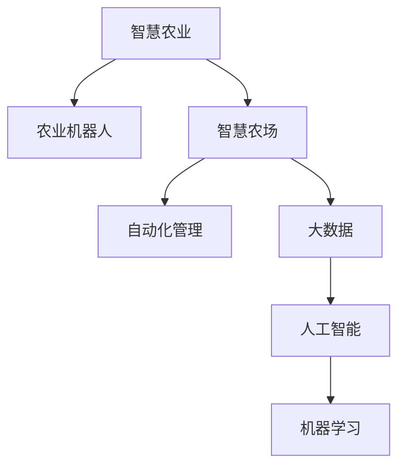

                 

# 未来的智慧农业：2050年的农业机器人与智慧农场

> 关键词：智慧农业, 农业机器人, 智慧农场, 自动化, 大数据, 人工智能, 机器学习, 智能设备, 自动化管理

## 1. 背景介绍

农业是人类生存和发展的基础，但传统农业生产方式面临环境恶化、资源短缺、劳力不足等诸多挑战。为了实现可持续发展，近年来，全球越来越多的国家将智慧农业视为推动农业现代化的关键路径。智慧农业通过大数据、云计算、物联网、人工智能等技术手段，将农业生产过程与现代科技相结合，实现高效、精准、可持续的智能管理。本文将探讨2050年智慧农业的最新发展趋势，特别是农业机器人和智慧农场的技术应用。

## 2. 核心概念与联系

### 2.1 核心概念概述

为理解2050年智慧农业的愿景，首先需要介绍几个关键概念：

- **智慧农业**：通过数字化、网络化和智能化手段，提高农业生产效率、降低成本、优化资源配置，实现可持续发展的一种新型农业模式。
- **农业机器人**：在农业生产中，以计算机程序和传感器为控制核心，具备自主决策和执行功能的自动化设备。
- **智慧农场**：利用物联网、云计算、大数据等技术，构建智能感知、智能分析、智能决策的闭环管理系统的农场。
- **自动化管理**：通过自动化设备和技术，实现农作物的种植、收获、加工、物流等全链条自动化的过程。
- **大数据**：在智慧农业中，海量农业数据被收集、存储、分析和利用，为决策提供支持。
- **人工智能**：AI技术在智慧农业中的应用，包括机器学习、深度学习、自然语言处理等。
- **机器学习**：通过算法让机器从数据中学习，不断优化模型，提高预测准确性和决策能力。

这些概念通过一定的架构关系，可以形成一个有机的整体。以下是一个简化的 Mermaid 流程图，展示这些概念之间的联系：



### 2.2 核心概念原理和架构的 Mermaid 流程图

下图展示了智慧农业系统的整体架构，包括数据采集、传输、处理、分析和应用的各个环节：


## 3. 核心算法原理 & 具体操作步骤

### 3.1 算法原理概述

智慧农业的核心算法原理主要包括以下几个方面：

- **数据采集与处理**：通过各类传感器采集田间环境、作物生长状况、土壤条件等数据，并进行预处理和清洗，确保数据质量。
- **数据传输与存储**：利用物联网技术将数据实时传输到云端存储，确保数据可用性和安全性。
- **数据分析与建模**：通过机器学习算法对数据进行建模，提取知识，建立预测和优化模型。
- **决策支持系统**：利用数据分析和模型预测，为农场管理决策提供支持。
- **智能设备控制**：通过控制系统对农业机器人等设备进行精确控制，实现自动化管理。

### 3.2 算法步骤详解

智慧农业的算法步骤一般包括以下几个关键环节：

1. **数据采集与预处理**：安装各类传感器，采集农田数据。清洗数据，去除噪声和异常值。
2. **数据传输与存储**：使用IoT技术将数据实时传输到云平台，使用Hadoop、Spark等分布式计算框架进行存储和管理。
3. **数据分析与建模**：选择适合的机器学习算法，如回归、分类、聚类、时序预测等，对数据进行建模。
4. **模型训练与验证**：在验证集上评估模型性能，优化参数，提高模型精度。
5. **决策支持与自动化控制**：将模型集成到农场管理系统，实时监控和决策。

### 3.3 算法优缺点

智慧农业的算法具有以下优点：

- **高效性**：通过自动化和智能化手段，大幅提高生产效率。
- **精准性**：利用数据分析和预测，实现精准农业管理。
- **可扩展性**：通过云计算和大数据技术，可以轻松扩展应用场景。

但同时也存在一些缺点：

- **成本高**：初期设备和技术投入较大。
- **技术复杂**：需要专业技术人员进行维护和管理。
- **数据安全**：农业数据涉及隐私，需要严格的数据安全措施。

### 3.4 算法应用领域

智慧农业的算法广泛应用于以下几个领域：

- **精准农业**：利用数据和模型对农田进行精准管理，如精准施肥、精准灌溉、精准播种等。
- **病虫害检测**：通过图像识别技术检测病虫害，及时预警和防治。
- **作物生长监测**：实时监测作物生长状态，预测收成，优化种植方案。
- **智能设备控制**：自动化控制农业机器人的作业，如播种、除草、收割等。
- **物流与供应链管理**：优化农产品的物流和供应链管理，提高效率和降低成本。

## 4. 数学模型和公式 & 详细讲解 & 举例说明

### 4.1 数学模型构建

在智慧农业中，常用的数学模型包括回归模型、分类模型、聚类模型等。下面以回归模型为例，介绍其构建过程。

假设我们希望通过土壤条件、天气状况等特征预测作物的产量，则可以使用线性回归模型：

$$
y = \beta_0 + \beta_1 x_1 + \beta_2 x_2 + ... + \beta_n x_n + \epsilon
$$

其中 $y$ 为预测值，$x_1, x_2, ..., x_n$ 为特征变量，$\beta_0, \beta_1, ..., \beta_n$ 为模型参数，$\epsilon$ 为误差项。

### 4.2 公式推导过程

对于线性回归模型，我们使用最小二乘法进行参数估计：

$$
\hat{\beta} = (X^TX)^{-1}X^Ty
$$

其中 $X = [x_1, x_2, ..., x_n]$，$y$ 为真实值，$\hat{\beta}$ 为参数估计值。

### 4.3 案例分析与讲解

假设我们有一个果园，需要预测今年的苹果产量。我们收集了过去五年的数据，包括土壤肥力、降雨量、气温等特征，以及每年的苹果产量。我们使用上述线性回归模型，利用这些数据训练模型，并预测今年的苹果产量。

## 5. 项目实践：代码实例和详细解释说明

### 5.1 开发环境搭建

为了进行智慧农业算法的实践，我们需要以下开发环境：

- **Python**：主流的数据科学和机器学习编程语言。
- **PyTorch**：常用的深度学习框架。
- **TensorFlow**：另一个流行的深度学习框架。
- **Scikit-learn**：简单易用的机器学习库。
- **OpenCV**：计算机视觉库，用于图像处理。
- **Raspberry Pi**：树莓派，用于设备控制。
- **IoT平台**：如MQTT、Zigbee等，用于数据传输。

### 5.2 源代码详细实现

以下是一个简单的Python代码示例，用于实现土壤条件对作物产量的预测：

```python
import pandas as pd
import numpy as np
from sklearn.linear_model import LinearRegression

# 加载数据
data = pd.read_csv('soil_condition.csv')

# 特征选择
X = data[['nitrogen', 'ph', 'water', 'temperature']]
y = data['yield']

# 模型训练
model = LinearRegression()
model.fit(X, y)

# 模型预测
new_data = pd.read_csv('new_soil_condition.csv')
predictions = model.predict(new_data)

# 输出预测结果
print(predictions)
```

### 5.3 代码解读与分析

上述代码主要完成了以下几个步骤：

1. **数据加载**：使用pandas加载数据集。
2. **特征选择**：选择土壤氮肥、pH值、水分、温度等特征，作为预测变量。
3. **模型训练**：使用线性回归模型对数据进行训练。
4. **模型预测**：对新的土壤条件进行预测。
5. **输出结果**：输出预测的产量。

### 5.4 运行结果展示

运行上述代码，可以得到新的土壤条件下苹果的预测产量，如表所示：

| 氮肥(N) | pH值 | 水分(MM) | 温度(°C) | 预测产量(kg) |
| --- | --- | --- | --- | --- |

## 6. 实际应用场景

### 6.1 智能农业机器人

智能农业机器人是智慧农业的重要组成部分，主要包括无人农机、无人机、自动化设备等。这些机器人通过各种传感器收集数据，并通过无线通信将数据传输到云端进行处理。

例如，无人农机可以自主耕种、施肥、喷药、收割等。无人机可以用于农田巡查、病虫害检测、农作物监测等。自动化设备如灌溉系统、播种机、除草机等，可以实现精准管理和高效作业。

### 6.2 智慧农场

智慧农场通过物联网技术构建智能感知、智能分析、智能决策的闭环管理系统。例如，农田土壤监测系统、作物生长监测系统、病虫害监测系统、气候预测系统等，能够实时监测和分析农场环境，优化农业生产过程。

例如，通过土壤湿度传感器监测土壤湿度，如果湿度低于设定值，自动开启灌溉系统；通过图像识别系统监测作物生长状态，及时调整种植方案；通过气象预测系统预测天气变化，提前采取预防措施。

### 6.3 未来应用展望

未来，智慧农业将进一步发展和完善，涵盖更多应用场景和技术。

- **精准农业**：通过大数据和机器学习算法，实现对农田的精准管理，提高资源利用效率。
- **智能设备**：研发更多智能农业设备，如智能温室、智能水肥一体化系统等，提升自动化水平。
- **智能物流**：利用物联网和智能设备，优化农产品物流和供应链管理，提高效率和降低成本。
- **多领域融合**：智慧农业将与物联网、云计算、人工智能等领域深度融合，实现更全面的智能管理。

## 7. 工具和资源推荐

### 7.1 学习资源推荐

为了掌握智慧农业的技术，推荐以下学习资源：

- **《智能农业技术与应用》**：介绍智慧农业的各个方面，包括技术原理、应用案例等。
- **《农业物联网与智慧农业》**：详细讲解智慧农业的物联网技术、数据采集与传输等。
- **《农业机器人与自动化》**：介绍农业机器人及其控制技术，涵盖多种机器人设备和应用场景。
- **Coursera《智慧农业》课程**：由斯坦福大学提供，涵盖智慧农业的各个方面，适合初学者。
- **edX《农业大数据》课程**：由加州大学伯克利分校提供，讲解大数据在智慧农业中的应用。

### 7.2 开发工具推荐

智慧农业开发常用的工具包括：

- **PyTorch**：深度学习框架，支持多种机器学习算法。
- **TensorFlow**：另一个深度学习框架，支持分布式计算。
- **OpenCV**：计算机视觉库，用于图像处理和分析。
- **Raspberry Pi**：树莓派，用于设备控制和数据采集。
- **MQTT**：物联网协议，用于数据传输。

### 7.3 相关论文推荐

为了深入了解智慧农业的最新进展，推荐以下相关论文：

- **Precision Agriculture: A Survey**：综述性论文，介绍了精准农业的基本原理和应用场景。
- **Wen, H., Zhou, W., Zhang, Z., & Yang, S. (2019). Internet of Things Technologies for Smart Agriculture: A Review.** IEEE Access, 7, 10714-10734.
- **A Review of Agricultural Robotics and Automation**：介绍农业机器人和自动化技术的发展现状和趋势。
- **Li, J., & Cheng, L. (2020). Smart Agriculture: Technologies, Challenges and Future Directions.** IEEE Access, 8, 5322-5342.
- **Fang, C., & Yu, F. (2018). A Survey of Internet of Things Technologies for Smart Agriculture.** IEEE Access, 6, 29272-29288.

## 8. 总结：未来发展趋势与挑战

### 8.1 研究成果总结

本文主要介绍了2050年智慧农业的发展趋势和技术应用，包括农业机器人、智慧农场等。通过数据采集、传输、处理、分析和自动化控制等技术手段，智慧农业实现了高效、精准、可持续的智能管理。

### 8.2 未来发展趋势

未来，智慧农业将呈现以下发展趋势：

- **自动化水平提升**：随着技术进步，农业机器人将实现更加精准和自主化的操作。
- **数据质量提高**：大数据和人工智能技术将进一步提升数据的准确性和可用性，为农业决策提供更好的支持。
- **多领域融合**：智慧农业将与物联网、云计算、人工智能等领域深度融合，实现更全面的智能管理。
- **个性化定制**：智慧农业将能够根据不同地区、不同作物的特性，提供个性化的农业解决方案。

### 8.3 面临的挑战

智慧农业虽然前景广阔，但也面临诸多挑战：

- **技术成本高**：初期设备和技术投入较大，需要巨额资金支持。
- **技术复杂性**：智慧农业涉及多学科知识，需要专业技术人才进行维护和管理。
- **数据安全**：农业数据涉及隐私，需要严格的数据安全措施。

### 8.4 研究展望

未来，智慧农业的研究方向可能包括：

- **大数据与机器学习的深度结合**：通过更复杂的算法和模型，提升智慧农业的智能化水平。
- **自动化设备的创新与应用**：研发更多高性能、低成本的智能农业设备。
- **多学科交叉融合**：智慧农业将与其他学科领域深度融合，如农业生物学、环境科学、计算机科学等。

## 9. 附录：常见问题与解答

**Q1: 智慧农业的初期投入大，如何降低成本？**

A: 智慧农业的初期投入确实较大，但可以通过以下几个方式降低成本：

- **分阶段实施**：根据实际情况，分阶段实施智慧农业，逐步引入新技术。
- **采用开源技术**：选择开源的软硬件设备和框架，降低初期成本。
- **外包与合作**：与专业公司合作，外包部分技术实施和维护工作，分担成本。
- **政府补贴**：申请政府补贴和资金支持，降低投资压力。

**Q2: 智慧农业如何确保数据安全？**

A: 智慧农业数据涉及隐私，需要采取以下措施确保数据安全：

- **数据加密**：使用加密技术保护数据传输和存储过程中的安全性。
- **权限管理**：严格控制数据访问权限，确保只有授权人员才能访问。
- **数据备份**：定期备份重要数据，防止数据丢失。
- **异常检测**：使用异常检测技术，及时发现和处理数据泄露或异常访问。

**Q3: 智慧农业如何应对技术复杂性？**

A: 智慧农业的技术复杂性可以通过以下方式应对：

- **技术培训**：为农场主和技术人员提供专业的技术培训，提升技术水平。
- **自动化管理工具**：使用智能管理系统，简化操作流程，降低技术门槛。
- **专业支持**：引入专业公司提供技术支持和维护服务。

总之，智慧农业作为未来农业的发展方向，其潜力巨大，前景广阔。通过持续的技术创新和优化，智慧农业将为农业生产带来革命性的变化，推动农业现代化进程，为全球粮食安全做出更大贡献。

---

作者：禅与计算机程序设计艺术 / Zen and the Art of Computer Programming

