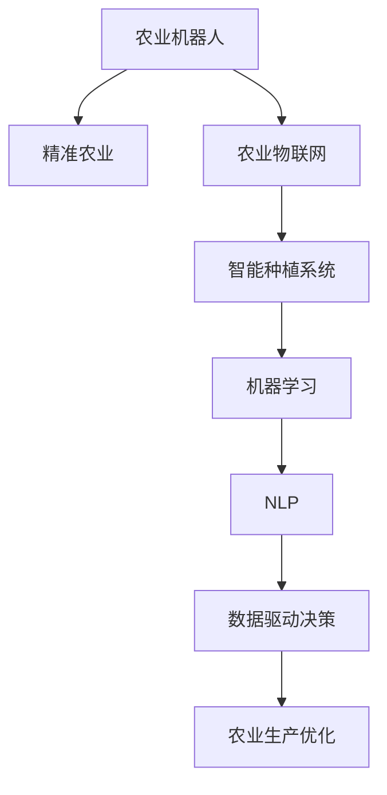

                 

# 未来的智慧农业：2050年的农业机器人与智能种植系统

## 1. 背景介绍

### 1.1 问题由来

随着人口的增长和环境的恶化，传统的农业生产方式已经无法满足未来社会的需求。一方面，全球粮食需求预计将在2050年增长约50%，而水资源短缺、耕地减少等问题对农业生产提出了巨大挑战。另一方面，环境污染和气候变化问题也成为全球共同面临的难题，如何实现农业的可持续发展成为当务之急。

农业机器人与智能种植系统作为新型的农业生产方式，通过集成物联网、人工智能、机器学习等前沿技术，可以实现精准化、智能化、自动化、网络化的农业生产。这些技术的融合，将推动农业生产方式的根本变革，助力实现农业的可持续发展。

### 1.2 问题核心关键点

本文将探讨2050年农业机器人与智能种植系统的核心概念和关键技术，包括：
- 机器人与智能种植系统的工作原理和架构
- 基于AI的精准农业技术
- 数据驱动的农业决策支持系统
- 物联网技术在农业中的应用
- 机器学习在农业机器人系统中的作用
- 未来农业发展的趋势与挑战

通过系统介绍这些关键点，希望能够帮助读者理解智慧农业的未来发展方向，为农业科技的持续创新提供思考和指导。

## 2. 核心概念与联系

### 2.1 核心概念概述

为了更好地理解未来智慧农业的核心概念，本文将介绍几个关键概念及其相互关系：

- **农业机器人**：基于自动化技术、传感器和人工智能，用于执行种植、收割、喷洒等农业任务的各种机器人系统。

- **智能种植系统**：通过物联网、大数据和机器学习技术，实现对农田、作物和环境的全生命周期管理，优化种植决策，提高农业生产效率的系统。

- **精准农业**：利用卫星定位、遥感技术、传感器等手段，对农田进行高精度、细致化的管理，以提高资源利用率和生产效率。

- **农业物联网**：将各种传感器、执行器与互联网连接，实现农业生产过程的实时监控、数据采集和自动化控制。

- **机器学习**：通过学习历史数据和模型，实现对农业生产过程的预测和优化，提供科学决策支持。

- **自然语言处理(NLP)**：使农业机器人能够理解和执行人类自然语言指令，提升人机交互的智能化水平。

这些概念之间的联系可以通过以下Mermaid流程图来展示：



这个流程图展示了农业机器人与智能种植系统之间的逻辑关系：

1. 农业机器人通过精准农业技术，利用农业物联网获取实时数据。
2. 智能种植系统基于机器学习和大数据分析，优化种植决策。
3. 自然语言处理技术使机器人能够理解人类指令，提升人机交互体验。
4. 最终，这些技术通过数据驱动的决策支持系统，实现农业生产的智能化和自动化。

## 3. 核心算法原理 & 具体操作步骤

### 3.1 算法原理概述

未来智慧农业的核心算法原理可以概括为以下三个方面：

1. **传感器数据融合**：通过集成各种传感器，实时采集农田土壤、气候、作物生长状态等数据，融合为一个统一的数据模型。
2. **机器学习与预测建模**：利用历史数据和机器学习算法，预测未来的农业生产状态，优化种植决策。
3. **智能控制系统**：通过自动化执行器，对农田进行精准化管理，实现高效生产。

### 3.2 算法步骤详解

未来智慧农业的算法步骤包括：

1. **数据采集**：部署各种传感器，采集农田的土壤、气候、作物生长状态等数据。
2. **数据融合与预处理**：将采集到的数据进行清洗、过滤、归一化等预处理，构建统一的数据模型。
3. **机器学习建模**：利用历史数据和机器学习算法，构建预测模型，优化种植决策。
4. **智能控制系统**：基于预测模型，生成自动化执行器的控制指令，实现精准农业生产。

### 3.3 算法优缺点

**优点**：
- **自动化水平高**：通过传感器和智能控制系统，实现了农业生产的自动化，减少了人力成本和生产误差。
- **精准度高**：通过数据融合和机器学习算法，实现了对农田、作物和环境的全生命周期管理，提高了资源利用率和生产效率。
- **决策科学**：利用机器学习和大数据分析，提供科学的种植决策支持，提升农业生产的科学性和合理性。

**缺点**：
- **技术复杂度高**：涉及传感器、数据分析、机器学习、智能控制等多个技术领域，技术实现难度大。
- **数据质量要求高**：传感器数据的准确性和完整性直接影响系统的运行效果，数据质量管理难度大。
- **初始投资高**：技术开发和系统部署需要较高的初始投资，对中小规模农场存在一定的经济门槛。

### 3.4 算法应用领域

未来智慧农业的核心算法广泛应用于以下领域：

- **精准农业**：通过对土壤、气候、作物生长状态等数据的实时监控，优化种植决策，提高资源利用率和生产效率。
- **智能种植系统**：实现对农田、作物和环境的全生命周期管理，提供精准的种植建议，提升作物产量和品质。
- **农业机器人**：通过自动化执行器，执行播种、除草、施肥、喷药等任务，实现高效生产。
- **农业物联网**：通过传感器、执行器与互联网的连接，实现农业生产过程的实时监控和自动化控制。

## 4. 数学模型和公式 & 详细讲解 & 举例说明

### 4.1 数学模型构建

未来智慧农业的数学模型主要包括以下几个方面：

- **传感器数据融合模型**：将各种传感器数据进行加权平均，构建统一的数据模型。
- **机器学习预测模型**：利用历史数据和机器学习算法，预测未来的农业生产状态。
- **智能控制系统模型**：基于预测模型，生成自动化执行器的控制指令。

### 4.2 公式推导过程

以机器学习预测模型为例，推导其核心公式：

假设采集到的数据为 $X=\{x_1,x_2,...,x_n\}$，其中 $x_i$ 表示第 $i$ 个时间点的数据，$Y=\{y_1,y_2,...,y_n\}$ 表示对应的农业生产状态。

1. **特征工程**：对 $X$ 进行特征提取和预处理，得到特征向量 $F=\{f_1,f_2,...,f_m\}$。
2. **训练模型**：利用历史数据 $X$ 和 $Y$ 训练机器学习模型 $M$。
3. **预测未来**：将实时采集的数据 $x$ 输入模型 $M$，得到预测结果 $\hat{y}$。

数学上，预测模型的公式为：

$$
\hat{y} = M(F(x))
$$

其中，$F(x)$ 表示特征提取和预处理过程，$M$ 表示训练得到的机器学习模型。

### 4.3 案例分析与讲解

以智能种植系统中的机器学习预测模型为例，分析其实际应用：

假设要预测某一作物的产量，可以采用时间序列分析的方法，利用历史数据进行预测。具体步骤如下：

1. **数据收集**：收集过去若干年的产量数据，包括年份、气温、降雨量、土壤湿度等。
2. **特征工程**：对收集到的数据进行特征提取和预处理，如对气温、降雨量等进行归一化处理。
3. **训练模型**：利用历史数据训练时间序列模型，如ARIMA、LSTM等，得到一个能够预测产量的模型。
4. **预测未来**：将当前数据输入模型，得到未来一年内不同时间点的产量预测值。

## 5. 项目实践：代码实例和详细解释说明

### 5.1 开发环境搭建

在进行智慧农业系统开发前，需要先搭建开发环境。以下是使用Python进行OpenCV开发的环境配置流程：

1. 安装Anaconda：从官网下载并安装Anaconda，用于创建独立的Python环境。

2. 创建并激活虚拟环境：
```bash
conda create -n pycv-env python=3.8 
conda activate pycv-env
```

3. 安装OpenCV：根据操作系统版本，从官网获取对应的安装命令。例如：
```bash
conda install opencv opencv-contrib -c conda-forge
```

4. 安装各类工具包：
```bash
pip install numpy pandas scikit-learn matplotlib tqdm jupyter notebook ipython
```

完成上述步骤后，即可在`pycv-env`环境中开始智慧农业系统的开发。

### 5.2 源代码详细实现

这里我们以智能种植系统的预测模型为例，给出使用Scikit-learn库进行机器学习的PyTorch代码实现。

首先，定义数据预处理函数：

```python
import numpy as np
from sklearn.preprocessing import MinMaxScaler

def preprocess_data(X):
    scaler = MinMaxScaler(feature_range=(0, 1))
    X_scaled = scaler.fit_transform(X)
    return X_scaled
```

然后，定义机器学习模型：

```python
from sklearn.linear_model import LinearRegression
from sklearn.metrics import mean_squared_error

class RegressionModel:
    def __init__(self):
        self.model = LinearRegression()
    
    def train(self, X, y):
        X_train = self.preprocess_data(X)
        y_train = y
        self.model.fit(X_train, y_train)
    
    def predict(self, X):
        X_scaled = self.preprocess_data(X)
        y_pred = self.model.predict(X_scaled)
        return y_pred
    
    def evaluate(self, X_test, y_test):
        X_test_scaled = self.preprocess_data(X_test)
        y_pred = self.predict(X_test_scaled)
        mse = mean_squared_error(y_test, y_pred)
        return mse
```

接着，定义数据加载和模型训练函数：

```python
def load_data(file_path):
    data = np.loadtxt(file_path, delimiter=',')
    X = data[:, :-1]
    y = data[:, -1]
    return X, y
    
def train_model(X_train, y_train, epochs, learning_rate):
    model = RegressionModel()
    for i in range(epochs):
        model.train(X_train, y_train)
        mse = model.evaluate(X_train, y_train)
        print(f"Epoch {i+1}, MSE: {mse:.3f}")
    
    return model
```

最后，启动模型训练流程并评估：

```python
epochs = 100
learning_rate = 0.001

X_train, y_train = load_data('train.csv')
model = train_model(X_train, y_train, epochs, learning_rate)

X_test, y_test = load_data('test.csv')
mse = model.evaluate(X_test, y_test)
print(f"Test MSE: {mse:.3f}")
```

以上就是使用Scikit-learn进行智慧农业系统预测模型训练的完整代码实现。可以看到，通过Scikit-learn的封装，模型训练的代码实现变得简洁高效。

### 5.3 代码解读与分析

让我们再详细解读一下关键代码的实现细节：

**数据预处理函数**：
- `preprocess_data`方法：对数据进行归一化处理，保证模型训练的收敛速度和精度。

**回归模型类**：
- `RegressionModel`类：封装了线性回归模型的训练和预测功能，方便重复使用。
- `train`方法：对数据进行归一化处理后，使用历史数据训练模型。
- `predict`方法：将新数据进行归一化处理后，进行预测并反归一化。
- `evaluate`方法：评估模型的预测误差。

**数据加载函数**：
- `load_data`方法：读取CSV格式的数据文件，并返回数据集的特征和标签。

**模型训练函数**：
- `train_model`方法：定义训练轮数和初始学习率，循环迭代训练模型，并输出每个epoch的误差。
- `train_model`方法调用模型训练函数进行模型训练，并返回训练后的模型。

在实际应用中，还需要考虑数据集划分、模型超参数调优、模型验证等更多细节，但核心的机器学习流程基本与此类似。

## 6. 实际应用场景

### 6.1 智能施肥系统

智能施肥系统是未来智慧农业的重要组成部分，可以通过实时监测土壤养分、作物需求等数据，智能控制施肥量和时机，实现高效施肥。

具体实现上，可以在农田中安装各种传感器，如土壤养分传感器、气象站、温湿度传感器等，采集数据后传输到中央控制系统。中央控制系统利用机器学习模型预测作物的养分需求，生成施肥指令，驱动施肥机械执行施肥任务。智能施肥系统可以大幅减少肥料的浪费，提升肥料利用率，降低生产成本。

### 6.2 智能灌溉系统

智能灌溉系统通过监测土壤湿度、气象数据等，实现对农田的精准灌溉。可以显著减少水资源浪费，提高农田产量。

具体实现上，在农田中安装土壤湿度传感器、气象站等，采集数据后传输到中央控制系统。中央控制系统利用机器学习模型预测土壤湿度和气象条件，生成灌溉指令，驱动灌溉机械执行灌溉任务。智能灌溉系统可以及时满足作物的灌溉需求，避免因干旱或过度灌溉造成的问题，提升农田产量。

### 6.3 智能种植管理系统

智能种植管理系统通过集成多种传感器和执行器，实现对农田全生命周期的管理，包括种植、施肥、灌溉、喷药等任务。

具体实现上，在农田中安装多种传感器和执行器，如土壤湿度传感器、气象站、温湿度传感器、喷药机械等。中央控制系统利用机器学习模型预测各种生产要素的需求，生成相应的控制指令，驱动执行器执行任务。智能种植管理系统可以大幅提高农田管理效率，提升农田产量。

### 6.4 未来应用展望

随着技术的发展，未来智慧农业将呈现以下趋势：

1. **自动化水平提升**：通过更加先进的技术，如无人机、机器人等，实现更高程度的自动化。
2. **智能化水平提升**：利用AI和大数据技术，实现对农业生产的全面智能化管理。
3. **生态友好型农业**：通过智能灌溉、智能施肥等技术，实现对水资源、肥料的精细化管理，降低对环境的影响。
4. **数据驱动决策**：利用大数据和机器学习技术，提供科学的农业生产决策支持，提升生产效率和资源利用率。

## 7. 工具和资源推荐

### 7.1 学习资源推荐

为了帮助开发者系统掌握智慧农业的核心技术，这里推荐一些优质的学习资源：

1. 《智慧农业技术》系列博文：由智慧农业领域专家撰写，深入浅出地介绍了农业机器人、智能种植系统、机器学习等前沿话题。

2. CS221《深度学习》课程：斯坦福大学开设的深度学习课程，涵盖深度学习的基础知识和经典模型，是入门深度学习的重要资料。

3. 《农业物联网》书籍：详细介绍了农业物联网的组成、技术架构、应用案例，是理解农业物联网的基础。

4. Weights & Biases：模型训练的实验跟踪工具，可以记录和可视化模型训练过程中的各项指标，方便对比和调优。

5. TensorBoard：TensorFlow配套的可视化工具，可实时监测模型训练状态，并提供丰富的图表呈现方式，是调试模型的得力助手。

通过对这些资源的学习实践，相信你一定能够快速掌握智慧农业的核心技术，并用于解决实际的农业问题。

### 7.2 开发工具推荐

高效的开发离不开优秀的工具支持。以下是几款用于智慧农业开发常用的工具：

1. Python：基于Python的开源编程语言，易于学习和使用，支持多种第三方库和框架。

2. TensorFlow：由Google主导开发的开源深度学习框架，生产部署方便，适合大规模工程应用。

3. OpenCV：开源计算机视觉库，支持图像处理、视频分析等功能，广泛应用于农业图像识别等领域。

4. PyTorch：基于Python的开源深度学习框架，灵活动态的计算图，适合快速迭代研究。

5. Weights & Biases：模型训练的实验跟踪工具，可以记录和可视化模型训练过程中的各项指标，方便对比和调优。

6. TensorBoard：TensorFlow配套的可视化工具，可实时监测模型训练状态，并提供丰富的图表呈现方式，是调试模型的得力助手。

合理利用这些工具，可以显著提升智慧农业系统的开发效率，加快创新迭代的步伐。

### 7.3 相关论文推荐

智慧农业和机器学习的发展源于学界的持续研究。以下是几篇奠基性的相关论文，推荐阅读：

1. "Precision Agriculture with Deep Learning"：探讨了深度学习在精准农业中的应用，提出了多种基于深度学习的农业管理方法。

2. "IoT-Based Smart Agriculture: A Survey"：总结了物联网技术在智慧农业中的应用现状和发展趋势，提供了丰富的应用案例。

3. "Deep Learning for Crop Health Monitoring"：介绍了深度学习在作物健康监测中的应用，利用图像识别技术进行病虫害检测。

4. "Sustainable Agriculture with Smart Farming Technologies"：探讨了智能农业技术在可持续农业中的应用，提出了多种环境友好型农业解决方案。

5. "AI for Precision Agriculture: A Review"：综述了AI技术在精准农业中的应用，包括机器学习、自然语言处理、计算机视觉等。

这些论文代表了大智慧农业技术的发展脉络。通过学习这些前沿成果，可以帮助研究者把握学科前进方向，激发更多的创新灵感。

## 8. 总结：未来发展趋势与挑战

### 8.1 总结

本文对未来智慧农业的实现方式进行了全面系统的介绍。首先阐述了智慧农业的核心概念和技术原理，明确了未来智慧农业的目标和实现路径。其次，从算法原理到具体实现，详细讲解了智慧农业系统的核心算法和关键步骤，给出了智慧农业系统开发的完整代码实例。同时，本文还探讨了智慧农业在未来农业生产中的应用前景，展示了智慧农业技术的巨大潜力。最后，本文精选了智慧农业相关的学习资源、开发工具和论文推荐，为智慧农业技术的持续创新提供了思考和指导。

通过本文的系统梳理，可以看到，未来智慧农业技术的实现路径和方法已经逐步清晰，将对农业生产方式产生深远影响。未来，伴随技术的不断进步和创新，智慧农业必将在农业生产中发挥越来越重要的作用，推动农业产业的升级和转型。

### 8.2 未来发展趋势

展望未来，智慧农业技术将呈现以下几个发展趋势：

1. **技术集成化**：随着技术的不断融合，智慧农业系统的功能将更加集成化，实现对农业生产过程的全方位管理。
2. **数据驱动决策**：利用大数据和机器学习技术，提供科学的农业生产决策支持，提升生产效率和资源利用率。
3. **自动化水平提升**：通过更加先进的技术，如无人机、机器人等，实现更高程度的自动化。
4. **生态友好型农业**：通过智能灌溉、智能施肥等技术，实现对水资源、肥料的精细化管理，降低对环境的影响。
5. **农业物联网普及**：通过更广泛的应用，实现农业物联网的普及和标准化，提升农业生产的效率和精度。

以上趋势凸显了智慧农业技术的发展方向，未来在技术、经济、环境等各个方面都将发挥重要作用。

### 8.3 面临的挑战

尽管智慧农业技术已经取得了显著成就，但在迈向更加智能化、普适化应用的过程中，仍面临诸多挑战：

1. **技术复杂度高**：智慧农业技术涉及传感器、数据分析、机器学习、智能控制等多个技术领域，技术实现难度大。
2. **数据质量要求高**：传感器数据的准确性和完整性直接影响系统的运行效果，数据质量管理难度大。
3. **初始投资高**：技术开发和系统部署需要较高的初始投资，对中小规模农场存在一定的经济门槛。
4. **设备兼容性问题**：不同设备和系统的兼容性问题，可能导致系统集成难度大。
5. **数据安全和隐私保护**：农业数据涉及大量敏感信息，如何保障数据安全和隐私保护，是一个重要问题。

这些挑战需要研究者、开发者和政策制定者共同努力，才能逐步解决，推动智慧农业技术的普及和应用。

### 8.4 研究展望

未来的研究需要在以下几个方面寻求新的突破：

1. **技术集成化研究**：探索多种技术的集成方法和标准，实现智慧农业系统的模块化和标准化。
2. **数据驱动决策研究**：研究更加高效、准确的数据处理和分析方法，提高农业生产决策的科学性和合理性。
3. **自动化水平提升研究**：开发更加先进、智能的农业机器人系统，提高农业生产的自动化水平。
4. **生态友好型农业研究**：研究更加环保、可持续的农业生产技术，减少对环境的影响。
5. **数据安全和隐私保护研究**：研究智慧农业系统的数据安全和隐私保护方法，保障数据安全和用户隐私。

这些研究方向将为智慧农业技术的持续创新提供指导，推动农业生产方式的根本变革，助力实现农业的可持续发展。

## 9. 附录：常见问题与解答

**Q1：智慧农业技术是否适用于所有类型的农场？**

A: 智慧农业技术适用于各种规模和类型的农场，但需要根据实际情况进行适当的技术适配和调整。对于中小规模农场，可以优先选择集成度较高、成本较低的解决方案，如智能灌溉、智能施肥系统。对于大型农场，可以采用更加复杂和全面的智慧农业系统，如智能种植管理系统。

**Q2：如何提高智慧农业系统的数据质量？**

A: 提高数据质量需要从以下几个方面入手：
1. 选择合适的传感器和设备，确保数据采集的准确性和完整性。
2. 定期对传感器进行校准和维护，避免数据偏差。
3. 使用数据清洗和处理工具，对数据进行去噪、归一化等预处理。
4. 建立数据质量监控机制，实时监测数据质量，及时发现和纠正问题。

**Q3：如何降低智慧农业系统的初始投资成本？**

A: 降低初始投资成本需要从以下几个方面入手：
1. 优先选择开源软件和硬件，如TensorFlow、PyTorch、OpenCV等。
2. 采用模块化设计和分阶段部署，逐步扩展系统的功能和规模。
3. 利用政府补贴和项目支持，降低经济负担。
4. 与专业农业服务公司合作，共享资源和经验。

**Q4：如何保障智慧农业系统的数据安全和隐私保护？**

A: 保障数据安全和隐私保护需要从以下几个方面入手：
1. 采用加密技术，对数据进行加密存储和传输。
2. 建立数据访问权限控制机制，限制数据访问范围。
3. 定期对系统进行安全审计和漏洞扫描，及时发现和修复安全问题。
4. 采用匿名化和数据脱敏技术，保护用户隐私。

这些方法可以有效保障智慧农业系统的数据安全和隐私保护，提升系统的可靠性和可信度。

**Q5：如何提升智慧农业系统的自动化水平？**

A: 提升自动化水平需要从以下几个方面入手：
1. 选择高效、可靠的传感器和执行器，确保系统的高精度和高可靠性。
2. 采用先进的机器学习算法，提高预测和控制模型的准确性。
3. 开发自适应控制算法，根据环境变化自动调整系统参数。
4. 引入智能化决策支持系统，提升系统的人机交互体验。

这些方法可以有效提升智慧农业系统的自动化水平，提高农业生产的效率和精度。

---

作者：禅与计算机程序设计艺术 / Zen and the Art of Computer Programming

