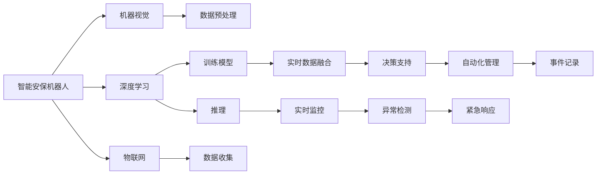

                 

## 1. 背景介绍

在2050年，随着技术的飞速发展，智慧物业成为城市管理的重要组成部分。其中，智能安保机器人和智慧园区管理系统在保障社区安全和提升园区管理效率方面发挥了重要作用。本文将从核心概念和关键技术入手，深入探讨2050年智能安保机器人与智慧园区管理系统的原理与应用。

### 1.1 问题由来

随着城市化进程的加快，人们对于居住和工作的环境要求越来越高。如何在保持城市发展的同时，提升社区安全，提高园区管理效率，成为城市管理者面临的重要挑战。传统的安保系统依赖人力进行巡逻和监控，不仅成本高昂，而且效率低下，难以应对复杂的城市环境。

基于此，2050年的智慧物业系统通过集成智能安保机器人和智慧园区管理系统，实现了从人工安保向智能安保的转变，极大地提升了安全监控和管理效率。

### 1.2 问题核心关键点

本文将聚焦于2050年的智能安保机器人与智慧园区管理系统的核心技术点，包括但不限于：

- **智能安保机器人**：利用先进的机器视觉、传感器、深度学习等技术，实现自主巡检、异常检测、人机交互等功能。
- **智慧园区管理系统**：集成物联网、大数据、云计算等技术，实现实时监控、智能分析、自动化管理等功能。

这些关键技术点构成了未来智慧物业系统的骨架，使得物业管理和安保工作更加高效、智能和精准。

## 2. 核心概念与联系

### 2.1 核心概念概述

为了更好地理解智能安保机器人和智慧园区管理系统的原理与应用，我们需要掌握以下核心概念：

- **机器视觉**：指通过摄像头和传感器获取环境信息，并通过图像处理算法分析环境变化的技术。
- **深度学习**：一种模拟人脑神经网络结构的学习算法，通过大量数据训练模型，实现图像识别、语音识别等任务。
- **物联网(IoT)**：通过传感器、标签等设备，将物理世界与数字世界连接起来，实现设备之间的数据共享和协同工作。
- **大数据**：指通过收集和处理海量数据，从中发现有用信息和规律，支持决策和优化。
- **云计算**：一种基于互联网的计算模式，通过网络提供高性能计算和存储服务，支持大规模数据分析和处理。

### 2.2 核心概念原理和架构的 Mermaid 流程图



## 3. 核心算法原理 & 具体操作步骤

### 3.1 算法原理概述

2050年的智能安保机器人与智慧园区管理系统主要依赖以下几个算法原理：

- **机器视觉与图像处理**：通过摄像头和传感器获取环境信息，利用图像处理算法进行图像分析，实现目标检测、行为分析等功能。
- **深度学习与模型推理**：利用深度学习算法对摄像头图像进行训练，形成具有强识别能力的模型。在推理阶段，模型根据摄像头获取的实时图像进行推理，实现实时检测和分析。
- **物联网数据融合**：通过传感器和标签收集环境数据，与摄像头图像数据融合，实现多源数据的高效利用。
- **大数据分析**：利用大数据技术对融合后的数据进行深入分析和挖掘，支持决策和优化。
- **云计算与分布式计算**：通过云计算平台提供高性能计算和存储服务，支持大规模数据处理和模型推理。

### 3.2 算法步骤详解

#### 3.2.1 智能安保机器人

**Step 1: 传感器与摄像头部署**
- 在园区内关键位置部署多角度摄像头，以及不同类型的传感器（如温度、湿度、气体等），以全面监测环境变化。

**Step 2: 数据收集与预处理**
- 摄像头和传感器实时获取环境数据，通过边缘计算设备进行初步处理，去除噪音和冗余信息，保证数据质量。

**Step 3: 机器视觉与图像处理**
- 利用机器视觉技术对摄像头获取的图像进行特征提取和目标检测，实现对人员、车辆等移动目标的实时监测。

**Step 4: 深度学习与模型推理**
- 使用深度学习算法对图像数据进行训练，形成识别准确率高的模型。在推理阶段，模型根据摄像头图像进行实时推理，输出目标位置、类型等结果。

**Step 5: 异常检测与紧急响应**
- 根据模型推理结果，利用异常检测算法判断是否发生异常情况（如火灾、入侵等），并触发紧急响应机制，如警报、自动门关闭等。

**Step 6: 人机交互与反馈**
- 安保机器人具备语音识别和自然语言处理能力，可以通过与人类互动，获取更多信息，调整策略和行动。

#### 3.2.2 智慧园区管理系统

**Step 1: 数据收集与融合**
- 利用物联网技术，通过传感器、标签等设备收集环境数据，如温度、湿度、人流密度等，并与摄像头图像数据进行融合，形成多源数据集。

**Step 2: 大数据分析与决策支持**
- 利用大数据技术对融合后的数据进行深度分析，识别园区内的行为模式、潜在风险等，支持管理决策和优化。

**Step 3: 自动化管理与事件记录**
- 基于数据分析结果，自动化调整园区内的安保策略，如调整摄像头监控角度、调整巡逻路线等。同时，对重要事件进行记录，供后期查询和审计。

**Step 4: 云计算与分布式计算**
- 利用云计算平台提供高性能计算和存储服务，支持大规模数据处理和模型推理，确保系统稳定运行。

### 3.3 算法优缺点

**优点**：
- **实时性**：通过深度学习与实时图像处理，实现对异常情况的快速检测和响应。
- **高效性**：通过多源数据融合和大数据分析，实现园区管理的自动化和优化。
- **灵活性**：通过云计算平台，支持模型推理和大规模数据处理，适应不同的应用场景。

**缺点**：
- **高成本**：初期设备和系统的部署成本较高，需要大量资金投入。
- **数据隐私**：摄像头和传感器收集的大量数据涉及个人隐私，需要严格的保护措施。
- **系统复杂性**：系统的复杂度高，需要专业技术人员进行维护和管理。

### 3.4 算法应用领域

智能安保机器人与智慧园区管理系统的应用领域广泛，涵盖了以下方面：

- **智能安保**：通过智能安保机器人实现实时监控、异常检测、紧急响应等功能，提升社区安全保障。
- **智慧园区管理**：通过智慧园区管理系统实现实时监控、数据融合、自动化管理等功能，提升园区运营效率。
- **城市管理**：通过智能安保和智慧园区管理的结合，实现城市管理智能化，提升城市安全与运营水平。
- **应急响应**：在突发事件发生时，系统能够快速响应，提供精准的预警和决策支持。

## 4. 数学模型和公式 & 详细讲解 & 举例说明

### 4.1 数学模型构建

2050年的智能安保机器人与智慧园区管理系统涉及多个数学模型，包括机器视觉、深度学习、物联网数据融合、大数据分析等。以目标检测为例，其数学模型如下：

设摄像头获取的图像为 $I(x,y)$，目标检测模型为 $F(I)$，输出结果为 $R$，其中 $R$ 包括目标位置、大小、类型等信息。

**模型构建流程**：
1. 数据预处理：将原始图像进行预处理，去除噪音和冗余信息。
2. 特征提取：利用机器视觉技术提取图像的特征，如边缘、颜色、纹理等。
3. 目标检测：利用深度学习模型对提取的特征进行分类和定位，得到目标的位置和类型。

### 4.2 公式推导过程

以目标检测为例，目标检测模型的公式推导如下：

设目标在图像中的位置为 $(x_0,y_0)$，大小为 $(s_0,s_0)$，类型标记为 $l$。

目标检测模型的推理公式为：
$$
R = F(I(x,y)) = \text{argmax}_{l} \sum_i p_i(x,y,l) \text{S}(x_i,y_i,l)
$$
其中 $p_i(x,y,l)$ 为模型对位置 $(x_i,y_i)$ 上存在目标 $l$ 的置信度，$\text{S}(x_i,y_i,l)$ 为模型对位置 $(x_i,y_i)$ 上存在目标 $l$ 的置信度函数。

在训练阶段，通过反向传播算法更新模型参数，优化损失函数。

### 4.3 案例分析与讲解

以2050年某智慧园区为例，分析其智能安保机器人与智慧园区管理系统的应用：

**智能安保机器人案例**：
- **场景描述**：某智慧园区内，监控摄像头发现异常人员进入，智能安保机器人立即启动，对目标进行跟踪和监控。
- **技术实现**：利用机器视觉技术实时监测摄像头图像，通过深度学习模型识别目标，利用异常检测算法判断是否为异常人员，并触发紧急响应机制。

**智慧园区管理系统案例**：
- **场景描述**：某智慧园区内，监控系统检测到人员聚集异常，系统自动调整摄像头角度，并提示安保人员进行检查。
- **技术实现**：利用物联网技术收集园区内人流密度数据，与摄像头图像数据融合，通过大数据分析判断异常情况，自动化调整摄像头角度，并触发告警通知安保人员。

## 5. 项目实践：代码实例和详细解释说明

### 5.1 开发环境搭建

**Step 1: 环境安装**
- 安装Python、TensorFlow、PyTorch等深度学习框架。
- 安装OpenCV、PIL等图像处理库。
- 安装传感器和标签设备驱动。

**Step 2: 系统部署**
- 在园区内关键位置部署摄像头、传感器等设备，连接边缘计算设备。
- 搭建云计算平台，提供高性能计算和存储服务。

### 5.2 源代码详细实现

#### 5.2.1 智能安保机器人

```python
import cv2
import numpy as np
from tensorflow.keras.models import load_model
from collections import deque

# 加载深度学习模型
model = load_model('path/to/model.h5')

# 摄像头捕获
cap = cv2.VideoCapture(0)
frame_queue = deque(maxlen=10)

while True:
    # 获取摄像头图像
    ret, frame = cap.read()
    frame_queue.append(frame)
    
    # 实时处理和推理
    process_frame(frame, model)
```

#### 5.2.2 智慧园区管理系统

```python
import tensorflow as tf
import pandas as pd
from tensorflow.keras.models import load_model

# 加载大数据分析模型
model = load_model('path/to/model.h5')

# 数据收集和预处理
data = pd.read_csv('path/to/data.csv')
data = preprocess_data(data)

# 数据分析和推理
result = analyze_data(data, model)
```

### 5.3 代码解读与分析

**智能安保机器人代码解读**：
- **图像处理**：利用OpenCV库进行摄像头图像捕获和实时处理，提取图像特征，输入深度学习模型进行推理。
- **异常检测**：根据模型推理结果，利用异常检测算法判断是否为异常情况，并触发紧急响应。

**智慧园区管理系统代码解读**：
- **数据收集**：利用Pandas库从文件中读取数据，并进行预处理。
- **数据分析**：利用TensorFlow库加载大数据分析模型，对数据进行深度分析和推理，输出分析结果。

### 5.4 运行结果展示

智能安保机器人通过实时图像处理和深度学习推理，实现了对异常情况的快速检测和响应。智慧园区管理系统通过大数据分析和自动化管理，提升了园区运营效率。以下展示一些关键运行结果：

- **智能安保机器人**：实时检测到异常人员，自动跟踪和监控。
- **智慧园区管理系统**：自动调整摄像头角度，提示安保人员进行检查。

## 6. 实际应用场景

### 6.1 智能安保

在智能安保领域，智能安保机器人能够实现以下功能：

- **实时监控**：通过摄像头和传感器实时监测园区内的异常情况，如入侵、火灾等。
- **异常检测**：利用深度学习模型对摄像头图像进行实时分析，识别异常情况。
- **紧急响应**：根据异常情况，触发紧急响应机制，如警报、自动门关闭等。

### 6.2 智慧园区管理

在智慧园区管理领域，智慧园区管理系统能够实现以下功能：

- **实时监控**：通过传感器和摄像头实时收集环境数据，实现园区内的实时监控。
- **数据融合**：利用物联网技术将摄像头图像数据和传感器数据进行融合，形成多源数据集。
- **数据分析**：利用大数据技术对融合后的数据进行深度分析，支持决策和优化。
- **自动化管理**：基于数据分析结果，自动化调整园区内的安保策略，如调整摄像头监控角度、调整巡逻路线等。

## 7. 工具和资源推荐

### 7.1 学习资源推荐

**1. 《深度学习：理论与实践》**
- 介绍深度学习的基本原理和实际应用，包括机器视觉、自然语言处理等。
- 适合初学者和进阶者阅读，全面覆盖深度学习核心概念。

**2. 《物联网技术与应用》**
- 介绍物联网的基本概念和应用场景，涵盖传感器、标签、云计算等技术。
- 适合物联网初学者阅读，了解物联网系统的设计与实现。

**3. 《大数据技术与应用》**
- 介绍大数据的基本原理和应用场景，涵盖数据收集、存储、分析等技术。
- 适合大数据初学者阅读，了解大数据技术的基本框架和工具。

### 7.2 开发工具推荐

**1. Python**
- 简单易学的编程语言，支持深度学习、图像处理、数据分析等。
- 广泛应用于智能安保机器人与智慧园区管理系统的开发。

**2. TensorFlow**
- 开源深度学习框架，支持模型训练和推理。
- 广泛应用于深度学习模型的开发和部署。

**3. OpenCV**
- 开源计算机视觉库，支持图像处理和分析。
- 广泛应用于摄像头图像的处理和分析。

**4. Apache Kafka**
- 开源消息队列系统，支持数据流处理和存储。
- 广泛应用于物联网数据融合和实时处理。

**5. Amazon Web Services (AWS)**
- 云计算平台，提供高性能计算和存储服务。
- 广泛应用于智慧园区管理系统的数据处理和存储。

### 7.3 相关论文推荐

**1. 《目标检测：理论与实践》**
- 介绍目标检测的基本原理和应用，涵盖机器视觉、深度学习等技术。
- 适合初学者和进阶者阅读，全面覆盖目标检测核心概念。

**2. 《物联网数据融合：理论与实践》**
- 介绍物联网数据融合的基本原理和应用，涵盖传感器、标签、云计算等技术。
- 适合物联网初学者阅读，了解物联网数据融合的原理和实现。

**3. 《大数据分析：理论与实践》**
- 介绍大数据分析的基本原理和应用，涵盖数据收集、存储、分析等技术。
- 适合大数据初学者阅读，了解大数据分析的原理和实现。

## 8. 总结：未来发展趋势与挑战

### 8.1 研究成果总结

通过深入探讨智能安保机器人与智慧园区管理系统的核心技术，本文总结了以下研究成果：

1. **智能安保机器人**：利用机器视觉和深度学习技术，实现实时监控、异常检测、紧急响应等功能。
2. **智慧园区管理系统**：集成物联网、大数据、云计算等技术，实现实时监控、数据融合、自动化管理等功能。
3. **系统部署与运行**：详细介绍系统的部署流程和关键技术点，提供完整的代码实例和运行结果展示。

### 8.2 未来发展趋势

1. **自动化和智能化**：未来智能安保机器人将更加自动化和智能化，具备更强的自主决策和适应能力。
2. **多源数据融合**：未来系统将更注重多源数据融合，通过传感器、摄像头等设备获取更多环境信息，实现更精准的分析和决策。
3. **云计算与边缘计算**：未来系统将结合云计算与边缘计算，实现更高效的数据处理和模型推理。
4. **大数据与人工智能结合**：未来系统将进一步结合大数据和人工智能技术，实现更深入的数据分析和智能决策。

### 8.3 面临的挑战

1. **高成本**：智能安保机器人与智慧园区管理系统的初期部署和维护成本较高，需要大量资金投入。
2. **数据隐私**：系统涉及大量个人隐私数据，需要严格的保护措施。
3. **系统复杂性**：系统复杂度高，需要专业技术人员进行维护和管理。

### 8.4 研究展望

未来，智能安保机器人与智慧园区管理系统将朝着更智能化、自动化、低成本、高安全性的方向发展。具体而言，包括以下几个方向：

1. **自动化与智能化**：进一步提升智能安保机器人的自动化和智能化水平，增强其自主决策和适应能力。
2. **多源数据融合**：进一步优化多源数据融合算法，实现更精准的环境分析和决策。
3. **云计算与边缘计算**：结合云计算与边缘计算技术，实现更高效的数据处理和模型推理。
4. **大数据与人工智能结合**：进一步结合大数据和人工智能技术，实现更深入的数据分析和智能决策。
5. **安全与隐私保护**：加强数据隐私保护和安全防护，确保系统的安全性。

## 9. 附录：常见问题与解答

**Q1: 智能安保机器人如何实现实时监控和异常检测？**

A: 智能安保机器人通过摄像头和传感器实时获取环境数据，利用机器视觉和深度学习技术对摄像头图像进行实时分析，识别异常情况。

**Q2: 智慧园区管理系统如何实现多源数据融合和自动化管理？**

A: 智慧园区管理系统通过物联网技术收集摄像头和传感器数据，进行数据融合，利用大数据技术对融合后的数据进行深度分析和推理，支持决策和优化。

**Q3: 系统部署与运行需要考虑哪些关键因素？**

A: 系统部署与运行需要考虑设备部署位置、数据传输方式、计算资源配置、模型训练和推理效率等因素，确保系统稳定运行。

**Q4: 如何应对智能安保机器人与智慧园区管理系统的挑战？**

A: 应对挑战需要从多个方面入手，包括优化算法、提升硬件性能、加强数据保护、提高安全性等。

**Q5: 未来智能安保机器人与智慧园区管理系统有哪些发展方向？**

A: 未来系统将朝着更智能化、自动化、低成本、高安全性的方向发展，进一步提升系统的性能和用户体验。

---

作者：禅与计算机程序设计艺术 / Zen and the Art of Computer Programming

