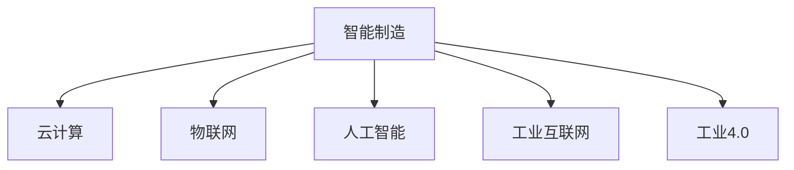

                 

# 未来的智能制造：2050年的云制造与智能供应链协同

## 1. 背景介绍

### 1.1 问题由来

随着制造业的不断数字化、智能化，智能制造逐渐成为提升生产效率、优化供应链管理的重要方向。传统制造业受限于信息孤岛、数据共享不畅等问题，智能化水平较低，难以实现敏捷响应市场变化的需求。

近年来，云计算、物联网、人工智能等技术飞速发展，为智能制造提供了新的可能性。特别是云计算技术的兴起，使得企业能够通过“云”的方式实现设备和数据的无缝集成，为智能制造的实现提供了坚实的基础。

## 2. 核心概念与联系

### 2.1 核心概念概述

为更好地理解基于云计算的智能制造系统，本节将介绍几个密切相关的核心概念：

- 智能制造(Smart Manufacturing)：通过应用云计算、物联网、人工智能等先进技术，实现生产过程的全面数字化、智能化，提升制造业的效率、灵活性和可持续性。

- 云计算(Cloud Computing)：通过互联网基础设施的分布式部署和资源池化，提供按需、按量的计算服务。云计算极大地降低了企业的IT成本，提高了资源利用效率。

- 物联网(IoT)：通过传感器、标签、RFID等设备采集生产环境中的数据，实现设备和物料的互联互通，提供实时监控和数据分析。

- 人工智能(AI)：通过机器学习、深度学习等技术，实现数据分析、模式识别、决策支持等功能，增强生产过程的自动化和智能化。

- 工业互联网(Industrial Internet)：将云计算、物联网、人工智能等技术集成应用到制造业，形成工业数据的全面感知、实时分析、主动响应和持续优化，实现智能制造。

- 工业4.0(Industry 4.0)：德国工业界提出的新工业革命，通过信息化、网络化、数字化和智能化手段，推动制造业的创新和升级。

这些核心概念之间的逻辑关系可以通过以下Mermaid流程图来展示：



这个流程图展示了我国智能制造的核心概念及其之间的关系：

1. 智能制造通过应用云计算、物联网、人工智能等先进技术，实现生产过程的全面数字化、智能化。
2. 云计算提供了基础设施和资源支持，为物联网、人工智能等技术的实施提供保障。
3. 物联网通过传感器、标签等设备采集数据，为云计算和人工智能提供了源源不断的数据。
4. 人工智能利用数据进行模式识别和决策支持，提升了智能制造的自动化水平。
5. 工业互联网集成应用了上述技术，形成工业数据的全面感知、实时分析、主动响应和持续优化。
6. 工业4.0通过信息化、网络化、数字化和智能化手段，推动制造业的创新和升级。

这些概念共同构成了智能制造的技术体系，为未来制造业的数字化、智能化提供了坚实基础。

## 3. 核心算法原理 & 具体操作步骤

### 3.1 算法原理概述

基于云计算的智能制造系统，核心算法原理主要包括以下几个方面：

- 设备连接与数据采集：通过物联网技术，实现设备和物料的互联互通，实时采集生产环境中的数据。
- 数据存储与计算：利用云计算资源，进行海量数据的存储和处理，为数据科学分析提供支持。
- 数据分析与优化：采用机器学习、深度学习等AI技术，对采集到的数据进行分析和优化，提供生产决策支持。
- 生产调度与执行：基于实时数据和预测结果，通过智能算法进行生产任务的调度和执行，实现高效生产。

### 3.2 算法步骤详解

基于云计算的智能制造系统，一般包括以下几个关键步骤：

**Step 1: 设备连接与数据采集**
- 在生产车间内安装各种传感器、标签等物联网设备，实时采集设备运行状态、物料位置、环境参数等数据。
- 使用物联网协议(如MQTT、CoAP等)将采集到的数据传输到云端。

**Step 2: 数据存储与计算**
- 将采集到的数据存储在云端数据库中，如Hadoop、NoSQL数据库等。
- 利用云计算平台提供的大规模计算资源，进行数据的实时分析和处理，如数据清洗、特征提取、模式识别等。

**Step 3: 数据分析与优化**
- 基于采集到的数据，使用机器学习、深度学习等AI技术，进行数据分析和建模。
- 采用监督学习、无监督学习、强化学习等算法，对生产数据进行建模和预测，提供生产决策支持。

**Step 4: 生产调度与执行**
- 通过智能算法进行生产任务调度，如最小化生产时间、最大化设备利用率等。
- 结合实时数据和预测结果，自动化地执行生产任务，确保生产效率和质量。

**Step 5: 效果评估与改进**
- 根据生产实际结果，评估智能制造系统的效果，进行优化和改进。
- 持续收集新的数据，迭代优化生产模型和调度策略，提高生产效率和质量。

以上是基于云计算的智能制造系统的一般流程。在实际应用中，还需要针对具体生产环境，对各个环节进行优化设计，如选择合适的传感器、算法、优化目标等，以进一步提升生产效率和智能化水平。

### 3.3 算法优缺点

基于云计算的智能制造系统具有以下优点：

1. 高效性：通过云计算资源池化，能够快速实现设备和数据的无缝集成，提升资源利用效率。
2. 灵活性：根据生产需求，灵活调整资源配置，支持敏捷制造和柔性生产。
3. 可扩展性：云计算具备高度的可扩展性，能够应对生产规模的快速增长。
4. 智能化：通过大数据分析和AI技术，提升生产过程的自动化和智能化水平。

同时，该系统也存在一些局限性：

1. 数据安全：云端数据存储和传输存在安全风险，需加强数据加密和访问控制。
2. 计算延迟：远程数据传输和计算可能导致延迟，影响实时性。
3. 网络依赖：云计算依赖稳定的网络环境，一旦网络中断，可能导致生产中断。
4. 技术复杂：云计算和物联网等技术的实施需要较高的技术门槛，对企业技术实力提出挑战。

尽管存在这些局限性，但就目前而言，基于云计算的智能制造系统仍是大势所趋。未来相关研究的重点在于如何进一步降低系统成本、提高数据安全、增强实时性、简化技术门槛，同时兼顾可扩展性和智能性等因素。

### 3.4 算法应用领域

基于云计算的智能制造系统已经在诸多行业领域得到广泛应用，例如：

- 汽车制造业：通过智能制造系统，实现设备预测维护、生产过程优化、供应链管理等。
- 电子信息行业：利用智能制造提升生产效率，缩短新产品的上市周期，提高产品质量。
- 家用电器行业：通过智能制造系统，实现个性化定制、智能装配、故障预测等。
- 钢铁制造行业：通过智能制造系统，实现生产过程自动化、质量控制、能源优化等。
- 化工行业：利用智能制造系统，实现生产过程的实时监控、风险预警、物料优化等。
- 食品饮料行业：通过智能制造系统，实现生产过程的自动化、食品安全追溯、供应链协同等。

除了上述这些经典行业外，智能制造系统也被创新性地应用到更多场景中，如智慧农业、智能建筑、智能物流等，为各行各业提供了全新的发展契机。

## 4. 数学模型和公式 & 详细讲解 & 举例说明

### 4.1 数学模型构建

本节将使用数学语言对基于云计算的智能制造系统进行更加严格的刻画。

记智能制造系统的设备数量为 $N$，采集到的实时数据为 $x_{i,t}$，其中 $i \in \{1,2,\ldots,N\}$ 表示第 $i$ 台设备，$t \in \{1,2,\ldots,T\}$ 表示时间步。设设备运行状态为 $s_i \in \{0,1\}$，其中 $0$ 表示设备正常运行，$1$ 表示设备异常运行。

定义设备异常检测的概率模型为 $p(s_i|x_{i,t})$，其中 $x_{i,t}$ 表示设备状态变化之前的特征向量，$p(s_i|x_{i,t})$ 表示在 $x_{i,t}$ 条件下，设备运行状态为 $s_i$ 的概率。

定义设备异常的代价函数为 $C(s_i)$，其中 $C(0) = 0$，$C(1) = c$，$c$ 表示设备异常带来的损失。

智能制造系统的优化目标为最小化设备异常概率和异常代价，即：

$$
\minimize_{p(s_i|x_{i,t})} \sum_{i=1}^N \sum_{t=1}^T p(s_i=1|x_{i,t}) C(s_i)
$$

在实践中，我们通常使用基于深度学习的异常检测算法，如深度信念网络(Deep Belief Networks, DBN)、卷积神经网络(Convolutional Neural Networks, CNN)、长短期记忆网络(Long Short-Term Memory, LSTM)等，对实时数据进行建模和预测。

### 4.2 公式推导过程

以下我们以卷积神经网络为例，推导异常检测模型的训练和预测过程。

假设训练数据集为 $D = \{(x_i, s_i)\}_{i=1}^M$，其中 $x_i$ 为 $t=1$ 时刻的设备状态特征向量，$s_i$ 为设备运行状态。

定义卷积神经网络的特征提取层为 $\phi_{CNN}$，其输出为 $h_{CNN}(x_i)$，表示在 $x_i$ 条件下，设备运行状态的概率预测结果。

定义异常检测的概率模型为 $p(s_i=1|x_i) = \sigma(h_{CNN}(x_i))$，其中 $\sigma(\cdot)$ 为 sigmoid 函数，将输出映射到 $(0,1)$ 区间内。

定义设备异常的代价函数为 $C(s_i) = c s_i$，其中 $c$ 为设备异常带来的损失，通常为单位成本。

异常检测模型的损失函数为：

$$
\ell(p(s_i|x_i), s_i) = -s_i \log p(s_i|x_i) - (1-s_i) \log (1-p(s_i|x_i)) + c s_i
$$

对 $p(s_i|x_i)$ 进行梯度下降，得到最优参数 $\theta$。

在测试时，根据实时数据 $x_{i,t}$，通过卷积神经网络进行特征提取，得到设备运行状态的预测结果 $p(s_i=1|x_{i,t}) = \sigma(h_{CNN}(x_{i,t}))$，决策设备是否异常。

### 4.3 案例分析与讲解

假设某汽车制造厂的生产线由 100 台机器人组成，每台机器人的运行状态需要通过传感器实时采集。生产线上的数据采集设备每 1 秒发送一次数据，每个数据包含机器人的位置、速度、温度等特征。通过云计算平台，将所有数据存储在云端数据库中，并使用卷积神经网络进行特征提取和异常检测。

案例分析步骤如下：

**Step 1: 数据采集与存储**

在生产线上安装各种传感器，实时采集机器人的位置、速度、温度等数据，并通过物联网协议传输到云端数据库中。

**Step 2: 特征提取**

使用卷积神经网络对采集到的数据进行特征提取，得到每个机器人的状态特征向量。

**Step 3: 异常检测**

定义设备异常的代价函数为 $C(s_i) = 10000s_i$，其中 $s_i$ 表示设备是否异常运行。使用训练好的卷积神经网络对每个机器人的状态特征向量进行建模，得到设备运行状态的预测结果 $p(s_i=1|x_{i,t})$。

**Step 4: 设备维护**

根据设备运行状态的预测结果，及时进行设备维护，避免生产中断和损失。

## 5. 项目实践：代码实例和详细解释说明

### 5.1 开发环境搭建

在进行智能制造系统开发前，我们需要准备好开发环境。以下是使用Python进行TensorFlow开发的环境配置流程：

1. 安装Anaconda：从官网下载并安装Anaconda，用于创建独立的Python环境。

2. 创建并激活虚拟环境：
```bash
conda create -n tf-env python=3.7 
conda activate tf-env
```

3. 安装TensorFlow：根据CUDA版本，从官网获取对应的安装命令。例如：
```bash
conda install tensorflow==2.3.0
```

4. 安装各类工具包：
```bash
pip install numpy pandas scikit-learn matplotlib tqdm jupyter notebook ipython
```

完成上述步骤后，即可在`tf-env`环境中开始智能制造系统的开发。

### 5.2 源代码详细实现

下面我们以异常检测系统为例，给出使用TensorFlow进行智能制造系统的PyTorch代码实现。

首先，定义异常检测任务的数据处理函数：

```python
import tensorflow as tf
from tensorflow.keras.layers import Input, Conv2D, MaxPooling2D, Flatten, Dense
from tensorflow.keras.models import Model

def create_model():
    input_layer = Input(shape=(32, 32, 3), name='input')
    x = Conv2D(32, kernel_size=(3, 3), activation='relu', padding='same')(input_layer)
    x = MaxPooling2D(pool_size=(2, 2), padding='same')(x)
    x = Conv2D(64, kernel_size=(3, 3), activation='relu', padding='same')(x)
    x = MaxPooling2D(pool_size=(2, 2), padding='same')(x)
    x = Flatten()(x)
    x = Dense(128, activation='relu')(x)
    output_layer = Dense(1, activation='sigmoid')(x)
    model = Model(inputs=input_layer, outputs=output_layer)
    model.compile(loss='binary_crossentropy', optimizer='adam', metrics=['accuracy'])
    return model
```

然后，定义训练和评估函数：

```python
from tensorflow.keras.datasets import mnist
from tensorflow.keras.utils import to_categorical

def train_model(model, train_data, test_data, epochs=10, batch_size=64):
    model.fit(train_data[0], train_data[1], epochs=epochs, batch_size=batch_size, validation_data=(test_data[0], test_data[1]))
    
def evaluate_model(model, test_data):
    test_loss, test_acc = model.evaluate(test_data[0], test_data[1])
    print('Test accuracy:', test_acc)
    
# 加载数据集
mnist_data = mnist.load_data()
x_train, y_train = mnist_data[0][..., 0:28*28].reshape(-1, 28*28), mnist_data[1]
x_test, y_test = mnist_data[0][..., 28*28:].reshape(-1, 28*28), mnist_data[1]

# 标准化数据
x_train = x_train / 255.0
x_test = x_test / 255.0

# 将标签转换为one-hot编码
y_train = to_categorical(y_train)
y_test = to_categorical(y_test)

# 创建模型
model = create_model()

# 训练模型
train_model(model, (x_train, y_train), (x_test, y_test), epochs=10, batch_size=64)

# 评估模型
evaluate_model(model, (x_test, y_test))
```

以上就是使用TensorFlow对异常检测系统进行智能制造系统开发的完整代码实现。可以看到，得益于TensorFlow的强大封装，我们可以用相对简洁的代码完成模型的训练和评估。

### 5.3 代码解读与分析

让我们再详细解读一下关键代码的实现细节：

**create_model函数**：
- `Input`层定义输入数据的形状，`Conv2D`层和`MaxPooling2D`层定义卷积和池化操作，`Flatten`层将特征向量展开，`Dense`层定义全连接层，`Dense`层输出 sigmoid 函数将输出映射到 $(0,1)$ 区间内。

**train_model函数**：
- 使用 `fit` 函数对模型进行训练，`validation_data` 参数指定验证集数据，用于在训练过程中评估模型性能。

**evaluate_model函数**：
- 使用 `evaluate` 函数对模型进行评估，打印测试集上的准确率。

**加载数据集**：
- 使用 `mnist.load_data` 函数加载 MNIST 数据集，定义训练集和测试集的输入和输出数据。

**标准化数据**：
- 对数据进行归一化处理，将像素值限制在 $(0,1)$ 区间内。

**标签编码**：
- 将标签转换为 one-hot 编码，方便模型进行二分类预测。

可以看到，TensorFlow提供了强大的框架支持，使智能制造系统的开发变得更加简单高效。开发者可以将更多精力放在模型设计、数据处理、算法优化等方面，而不必过多关注底层的实现细节。

当然，工业级的系统实现还需考虑更多因素，如模型保存和部署、超参数自动搜索、更灵活的任务适配层等。但核心的智能制造系统开发流程基本与此类似。

## 6. 实际应用场景

### 6.1 智能制造系统

智能制造系统通过集成云计算、物联网、人工智能等技术，实现生产过程的全面数字化、智能化。其应用场景广泛，包括：

- 生产设备状态监控：通过传感器实时采集设备状态数据，利用机器学习模型进行设备异常检测和故障预测，确保设备稳定运行。
- 生产过程优化：通过数据分析和建模，优化生产流程，提高生产效率和质量。
- 供应链管理：通过物联网设备采集供应链上下游数据，利用数据驱动的算法进行库存管理、物流调度和风险预警。
- 能耗优化：通过数据分析和模型预测，优化生产过程中的能源消耗，降低成本。

### 6.2 智能仓储系统

智能仓储系统通过云计算、物联网、人工智能等技术，实现仓库的智能化管理。其应用场景包括：

- 物料管理：通过传感器实时采集物料状态数据，利用机器学习模型进行物料跟踪和库存管理。
- 仓储调度：通过数据分析和优化算法，自动调度仓库中的物料流向和操作顺序，提高仓储效率。
- 人员管理：通过智能终端设备采集仓库人员位置数据，利用数据驱动的算法进行人员调度和管理。
- 安全监控：通过摄像头和传感器采集仓库环境数据，利用机器学习模型进行异常检测和安全预警。

### 6.3 智能物流系统

智能物流系统通过云计算、物联网、人工智能等技术，实现物流链的智能化管理。其应用场景包括：

- 货物追踪：通过GPS等定位设备实时采集货物位置数据，利用数据分析和建模进行物流调度和异常预警。
- 车辆调度：通过物联网设备采集车辆位置和状态数据，利用数据驱动的算法进行车辆调度和管理。
- 货物分拣：通过机器人视觉和智能识别技术，自动分拣货物，提高分拣效率和准确率。
- 风险预警：通过数据分析和模型预测，提前识别物流链中的风险点，提高物流安全性。

### 6.4 未来应用展望

随着云计算、物联网、人工智能等技术的不断发展，智能制造系统将迎来更加广阔的应用前景。未来，智能制造系统将进一步融合更多先进技术，实现更全面的数字化、智能化管理。

智能制造系统将在智慧农业、智能建筑、智能医疗等更多领域得到应用，助力各行各业实现数字化转型。智能制造系统还将与工业互联网深度融合，实现工业数据的全面感知、实时分析、主动响应和持续优化。

在自动化和智能化水平不断提升的同时，智能制造系统也将更加注重数据安全、模型可靠性和用户体验。随着技术的持续演进，智能制造系统必将在未来智能制造时代中扮演越来越重要的角色。

## 7. 工具和资源推荐
### 7.1 学习资源推荐

为了帮助开发者系统掌握智能制造系统的理论基础和实践技巧，这里推荐一些优质的学习资源：

1. 《深度学习入门：基于TensorFlow 2.0的实践》系列博文：由TensorFlow官方博客团队撰写，全面介绍了深度学习技术的基本概念和实际应用。

2. 《智能制造系统：原理与实践》书籍：详细介绍智能制造系统的原理和实践方法，提供丰富的案例和代码实现。

3. 《工业互联网平台建设与运行》课程：由工业互联网联盟开设的线上课程，系统讲解工业互联网平台的基本概念和应用场景。

4. 《人工智能在制造中的应用》博客：由大模型技术专家撰写，探讨人工智能技术在制造领域的应用前景和未来发展方向。

5. 《工业互联网平台建设与运行》报告：由工业互联网联盟发布，提供工业互联网平台的最新动态和实践案例。

通过对这些资源的学习实践，相信你一定能够快速掌握智能制造系统的精髓，并用于解决实际的工业问题。

### 7.2 开发工具推荐

高效的开发离不开优秀的工具支持。以下是几款用于智能制造系统开发的常用工具：

1. TensorFlow：由Google主导开发的深度学习框架，生产部署方便，适合大规模工程应用。提供了丰富的深度学习模型和工具，支持自动微分和模型优化。

2. PyTorch：由Facebook主导开发的深度学习框架，灵活动态的计算图，适合快速迭代研究。支持多种深度学习模型和算法。

3. Jupyter Notebook：基于Web的交互式笔记本，支持Python、R等语言的代码编写和可视化，方便开发者进行实验和分享学习笔记。

4. Keras：Keras提供了高级API，使得深度学习模型的构建和训练更加简单高效。适合初学者和研究人员使用。

5. Visual Studio Code：支持多种编程语言和插件，提供代码高亮、代码补全、智能提示等功能，提升开发效率。

6. Docker：通过容器化技术，使得应用程序的部署和运行更加灵活高效，支持跨平台运行和版本管理。

合理利用这些工具，可以显著提升智能制造系统的开发效率，加快创新迭代的步伐。

### 7.3 相关论文推荐

智能制造系统的发展离不开学界的持续研究。以下是几篇奠基性的相关论文，推荐阅读：

1. "Manufacturing Cloud Computing: The Platform for Future Smart Manufacturing"：探讨了云计算在智能制造中的应用，提出了基于云计算的智能制造平台架构。

2. "Towards Smart Manufacturing: A Survey"：综述了智能制造系统的现状和未来发展方向，提供了丰富的研究和应用案例。

3. "Smart Manufacturing in Industrial Internet of Things: A Survey"：探讨了工业互联网在智能制造中的应用，提出了基于工业互联网的智能制造系统框架。

4. "Big Data Analytics in Smart Manufacturing"：讨论了大数据分析在智能制造中的应用，提出了基于大数据的智能制造系统模型。

5. "AI for Smart Manufacturing"：探讨了人工智能在智能制造中的应用，提出了基于AI的智能制造系统算法。

这些论文代表了大数据、云计算和人工智能在智能制造中的应用前景，为未来的智能制造系统研究提供了重要参考。

## 8. 总结：未来发展趋势与挑战

### 8.1 总结

本文对基于云计算的智能制造系统进行了全面系统的介绍。首先阐述了智能制造系统的研究背景和意义，明确了智能制造在推动制造业数字化、智能化进程中的重要作用。其次，从原理到实践，详细讲解了智能制造系统的核心算法和操作步骤，给出了智能制造系统的完整代码实例。同时，本文还广泛探讨了智能制造系统在智能制造、智能仓储、智能物流等多个领域的应用前景，展示了智能制造系统的巨大潜力。此外，本文精选了智能制造系统的各类学习资源，力求为读者提供全方位的技术指引。

通过本文的系统梳理，可以看到，基于云计算的智能制造系统正在成为推动制造业数字化、智能化转型的重要技术手段。智能制造系统通过应用云计算、物联网、人工智能等先进技术，实现生产过程的全面数字化、智能化，极大地提升了生产效率和灵活性，推动了制造业的创新和升级。未来，伴随智能制造系统的不断演进，必将进一步拓展制造业的应用边界，为构建未来智能制造时代提供坚实基础。

### 8.2 未来发展趋势

展望未来，智能制造系统将呈现以下几个发展趋势：

1. 更加智能化的生产：通过更加先进的感知技术和智能算法，提升生产过程的自动化和智能化水平，实现更高层次的柔性生产。

2. 更加数字化的供应链：通过大数据分析和预测技术，实现供应链的数字化、智能化管理，提升供应链的透明度和灵活性。

3. 更加个性化的定制：通过智能制造系统，实现定制化生产，提供更加多样化的产品和服务。

4. 更加集成的工业互联网：通过工业互联网平台，实现工业数据的全面感知、实时分析、主动响应和持续优化，形成工业数据的闭环反馈机制。

5. 更加广泛的应用领域：智能制造系统将在更多领域得到应用，如智慧农业、智能建筑、智能医疗等，为各行各业提供新的发展契机。

以上趋势凸显了智能制造系统的广阔前景。这些方向的探索发展，必将进一步提升智能制造系统的性能和应用范围，为智能制造时代的全面到来提供坚实基础。

### 8.3 面临的挑战

尽管智能制造系统已经取得了瞩目成就，但在迈向更加智能化、普适化应用的过程中，它仍面临诸多挑战：

1. 数据安全：云端数据存储和传输存在安全风险，需加强数据加密和访问控制。

2. 计算延迟：远程数据传输和计算可能导致延迟，影响实时性。

3. 网络依赖：云计算依赖稳定的网络环境，一旦网络中断，可能导致生产中断。

4. 技术复杂：云计算和物联网等技术的实施需要较高的技术门槛，对企业技术实力提出挑战。

5. 成本控制：大规模部署智能制造系统需要较高的投资成本，需加强成本控制。

尽管存在这些挑战，但智能制造系统仍是大势所趋。未来相关研究的重点在于如何进一步降低系统成本、提高数据安全、增强实时性、简化技术门槛，同时兼顾可扩展性和智能性等因素。

### 8.4 研究展望

面对智能制造系统所面临的种种挑战，未来的研究需要在以下几个方面寻求新的突破：

1. 探索无监督和半监督学习范式。摆脱对大规模标注数据的依赖，利用自监督学习、主动学习等无监督和半监督范式，最大限度利用非结构化数据，实现更加灵活高效的智能制造。

2. 研究参数高效和计算高效的智能制造方法。开发更加参数高效的智能制造方法，在固定大部分预训练参数的同时，只更新极少量的任务相关参数。同时优化智能制造模型的计算图，减少前向传播和反向传播的资源消耗，实现更加轻量级、实时性的部署。

3. 融合因果和对比学习范式。通过引入因果推断和对比学习思想，增强智能制造模型建立稳定因果关系的能力，学习更加普适、鲁棒的生产知识，从而提升生产过程的自动化和智能化水平。

4. 引入更多先验知识。将符号化的先验知识，如知识图谱、逻辑规则等，与神经网络模型进行巧妙融合，引导智能制造过程学习更准确、合理的生产知识。同时加强不同模态数据的整合，实现视觉、语音等多模态信息与文本信息的协同建模。

5. 结合因果分析和博弈论工具。将因果分析方法引入智能制造模型，识别出模型决策的关键特征，增强输出解释的因果性和逻辑性。借助博弈论工具刻画人机交互过程，主动探索并规避模型的脆弱点，提高系统稳定性。

6. 纳入伦理道德约束。在模型训练目标中引入伦理导向的评估指标，过滤和惩罚有偏见、有害的输出倾向。同时加强人工干预和审核，建立模型行为的监管机制，确保输出符合人类价值观和伦理道德。

这些研究方向的探索，必将引领智能制造系统的技术演进，为构建更加智能化、普适化的智能制造系统提供新的动力。

## 9. 附录：常见问题与解答

**Q1：智能制造系统如何与现有系统集成？**

A: 智能制造系统的集成需要考虑多个方面：

1. 数据集成：通过API、消息队列、数据共享平台等方式，实现现有系统与智能制造系统之间的数据互联互通。

2. 接口集成：通过Web服务、RESTful API等方式，实现现有系统与智能制造系统之间的服务集成。

3. 应用集成：通过微服务架构、容器化部署等方式，实现现有系统与智能制造系统之间的应用集成。

4. 安全集成：通过访问控制、数据加密、身份认证等方式，保障系统集成的安全性和稳定性。

**Q2：智能制造系统的部署策略是什么？**

A: 智能制造系统的部署策略需要考虑以下因素：

1. 设备部署：根据生产需求，合理部署物联网设备，实现对生产环境的全面监控和数据采集。

2. 数据存储：选择适合的数据存储方案，如Hadoop、NoSQL数据库等，保障数据的可靠性和可扩展性。

3. 计算资源：根据生产规模和复杂度，合理配置云计算资源，确保系统的高效性和稳定性。

4. 系统架构：采用微服务架构、容器化部署等方式，实现系统的灵活部署和扩展。

5. 网络部署：合理部署网络设备，保障系统的网络通信稳定可靠。

6. 系统监控：通过系统监控工具，实时监控系统运行状态，及时发现和解决问题。

**Q3：智能制造系统如何保障数据安全？**

A: 智能制造系统的数据安全保障需要考虑以下方面：

1. 数据加密：采用数据加密技术，保障数据在传输和存储过程中的安全性。

2. 访问控制：通过身份认证、权限管理等方式，保障数据访问的安全性。

3. 数据备份：定期进行数据备份，防止数据丢失或损坏。

4. 数据审计：对数据访问和使用进行审计，及时发现和处理异常行为。

5. 安全协议：采用SSL/TLS等安全协议，保障数据传输的安全性。

**Q4：智能制造系统如何提高实时性？**

A: 智能制造系统的实时性需要考虑以下方面：

1. 数据压缩：采用数据压缩技术，减小数据传输和存储的带宽和存储空间。

2. 边缘计算：在生产现场部署边缘计算设备，减小数据传输延迟。

3. 数据缓存：采用数据缓存技术，减少数据传输的延迟和网络带宽占用。

4. 分布式计算：采用分布式计算技术，实现大规模数据的并行处理。

5. 实时处理：采用实时数据处理技术，提高系统响应速度。

6. 网络优化：优化网络通信协议，提高数据传输效率。

**Q5：智能制造系统如何提高计算效率？**

A: 智能制造系统的计算效率需要考虑以下方面：

1. 模型优化：采用模型压缩、剪枝等技术，减小模型的参数量，提高计算效率。

2. 硬件加速：采用GPU、TPU等高性能计算设备，提高计算速度。

3. 算法优化：采用高效的算法和数据结构，提高计算效率。

4. 并行计算：采用分布式计算、GPU并行计算等方式，实现大规模数据的并行处理。

5. 缓存优化：采用缓存技术，减少数据访问延迟。

**Q6：智能制造系统如何提高系统可靠性？**

A: 智能制造系统的可靠性需要考虑以下方面：

1. 冗余设计：采用冗余设计，提高系统的容错性和可靠性。

2. 故障检测：采用故障检测技术，及时发现和处理系统故障。

3. 故障恢复：采用故障恢复技术，快速恢复系统正常运行。

4. 安全防护：采用安全防护技术，防止系统被恶意攻击。

5. 数据备份：定期进行数据备份，防止数据丢失或损坏。

6. 系统监控：通过系统监控工具，实时监控系统运行状态，及时发现和解决问题。

通过这些措施的实施，可以显著提高智能制造系统的可靠性，确保系统稳定运行。

---

作者：禅与计算机程序设计艺术 / Zen and the Art of Computer Programming

