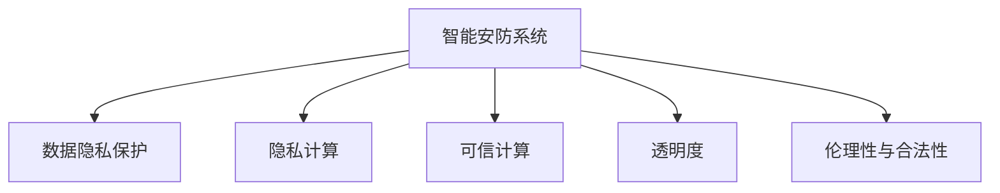

                 

# 未来的智能安防：2050年的公共安全与隐私保护

## 1. 背景介绍

### 1.1 问题由来

在过去的几十年里，全球范围内公共安全与隐私保护的问题逐渐凸显，成为了各个国家和地区政府和社会公众关注的重点。随着科技的进步，尤其是人工智能和大数据技术的发展，智能安防系统已经成为保障公共安全的重要手段。然而，智能安防在提升安全效率的同时，也引发了一系列关于隐私权、数据安全等问题。

智能安防系统包括视频监控、人脸识别、行为分析等多种技术手段，这些技术在提高治安管理、预防犯罪等方面发挥了巨大作用。然而，这些系统通常需要收集和存储大量的个人数据，包括视频、音频、行为特征等。这些数据的敏感性和隐私风险，引发了公众对隐私权保护的广泛关注。

### 1.2 问题核心关键点

未来的智能安防系统需要解决以下几个关键问题：
- 数据隐私保护：如何有效保护个人隐私，防止数据泄露和滥用。
- 安全与效率平衡：如何在保障安全性的同时，提高系统处理效率，减少对资源的消耗。
- 技术透明性：如何使技术工作机制透明化，增强用户对系统的信任。
- 伦理性与合法性：如何确保技术应用的伦理性与合法性，避免歧视性、不公正性。

## 2. 核心概念与联系

### 2.1 核心概念概述

为更好地理解智能安防系统的未来发展，本节将介绍几个关键概念：

- **智能安防系统(Smart Security Systems)**：利用人工智能和大数据分析技术，对公共空间进行监控和管理的系统。常见的智能安防系统包括视频监控、人脸识别、行为分析等技术手段。
- **数据隐私保护(Data Privacy Protection)**：保障个人数据不被非法获取、存储、使用，保护个人隐私的技术和法律制度。
- **隐私计算(Privacy-Preserving Computing)**：在数据处理过程中保护隐私的技术，如差分隐私、联邦学习等。
- **可信计算(Trusted Computing)**：一种保护计算平台的技术，通过硬件和软件的结合，确保系统环境的安全可信。
- **透明度(Transparency)**：系统工作机制的公开性和可理解性，便于用户理解和监督。
- **伦理性与合法性(Ethics and Legality)**：技术应用必须符合道德和法律规范，避免对个体和社会造成伤害。

这些概念之间的逻辑关系可以通过以下Mermaid流程图来展示：



这个流程图展示了几大核心概念及其之间的关系：

1. 智能安防系统通过数据处理保护个人隐私。
2. 隐私计算和可信计算技术保障数据处理过程中的隐私安全。
3. 透明度帮助用户理解和监督系统行为。
4. 伦理性与合法性确保技术应用符合道德和法律规范。

这些概念共同构成了智能安防系统的工作框架，使其能够在公共安全与隐私保护之间取得平衡。

## 3. 核心算法原理 & 具体操作步骤
### 3.1 算法原理概述

未来的智能安防系统，将依赖于先进的人工智能和大数据分析技术，通过实时监控、行为分析等方式，提高公共安全管理水平。系统的核心算法原理包括：

- **数据预处理**：收集和处理原始数据，如视频监控、传感器数据等，为后续分析提供基础。
- **特征提取**：通过算法识别并提取关键特征，如人脸、行为等。
- **模式识别**：利用机器学习算法，识别出潜在的安全事件或异常行为。
- **决策支持**：根据识别结果，输出报警或采取其他措施。

### 3.2 算法步骤详解

未来的智能安防系统通常包括以下几个关键步骤：

**Step 1: 数据收集与预处理**
- 通过各种传感器和监控设备，收集公共空间的视频、音频、行为数据。
- 对原始数据进行去噪、增强、压缩等预处理，确保数据质量。

**Step 2: 特征提取与模式识别**
- 利用深度学习算法，如卷积神经网络(CNN)、循环神经网络(RNN)等，提取关键特征。
- 结合时间序列分析、异常检测等算法，识别出异常行为或潜在威胁。

**Step 3: 决策与报警**
- 根据识别结果，输出报警信息，并通知相关人员或系统执行相应操作。
- 设置不同等级的报警阈值，确保系统的灵活性和准确性。

**Step 4: 反馈与迭代**
- 收集报警后的反馈信息，进一步优化算法和系统。
- 结合专家知识，迭代改进模型和规则。

### 3.3 算法优缺点

智能安防系统具有以下优点：
1. 高效实时：通过人工智能和大数据分析技术，能够快速响应潜在的安全事件。
2. 全面覆盖：通过多传感器和多数据源的整合，实现全域监控和全方位覆盖。
3. 自动化程度高：自动化决策和报警，减少了人工干预的需要。

同时，该系统也存在以下局限性：
1. 数据隐私风险：大量数据收集和存储带来隐私泄露风险。
2. 技术复杂度高：系统部署和维护需要高技术水平。
3. 误报率高：在处理大量数据时，误报率难以完全避免。
4. 依赖网络环境：系统运行需要稳定、高速的网络环境。

## 4. 数学模型和公式 & 详细讲解 & 举例说明

### 4.1 数学模型构建

未来的智能安防系统涉及到多种数学模型，其中常见的包括：

- **深度神经网络(Deep Neural Networks, DNN)**：用于特征提取和模式识别。
- **时间序列分析(Time Series Analysis)**：用于识别行为模式和异常。
- **异常检测(Anomaly Detection)**：用于识别潜在的威胁和异常。

### 4.2 公式推导过程

以深度神经网络为例，其基本模型包括输入层、隐藏层和输出层，结构如下：

$$
\text{Input} \rightarrow \text{Hidden Layer} \rightarrow \text{Output}
$$

其中，输入层接受原始数据，隐藏层通过非线性变换提取特征，输出层输出识别结果。以人脸识别为例，公式推导如下：

$$
\text{Input: } x = \{x_1, x_2, ..., x_n\}
$$
$$
\text{Output: } y = f(x; \theta)
$$

其中，$x$ 表示输入数据，$y$ 表示输出结果，$\theta$ 表示模型参数。假设使用卷积神经网络(CNN)进行特征提取，公式为：

$$
y = g_{CNN}(x; \theta_{CNN})
$$

其中，$g_{CNN}$ 表示CNN模型，$\theta_{CNN}$ 表示CNN模型的参数。

### 4.3 案例分析与讲解

以智能安防系统中的人脸识别为例，进行详细讲解。

假设有一个包含多个人的监控视频序列，通过CNN模型提取人脸特征：

$$
x = \{x_1, x_2, ..., x_n\} \text{ 为 } n \text{ 个人的图像序列}
$$

经过CNN模型提取特征后，得到一个大小为 $(m_1, m_2, ...) \times n$ 的特征矩阵：

$$
X = \{x_i\}_{i=1}^n
$$

其中 $x_i$ 表示第 $i$ 个人的特征向量。

接着，使用分类器对特征矩阵 $X$ 进行分类，判断每个人是否存在异常行为。假设使用softmax分类器，公式为：

$$
\text{Softmax}(X; \theta_{softmax}) = \frac{e^{X \cdot \theta_{softmax}}}{\sum_{i=1}^n e^{X_i \cdot \theta_{softmax}}}
$$

其中 $\theta_{softmax}$ 表示softmax分类器的参数。通过计算softmax函数的输出，得到每个人的异常行为概率，进而进行决策和报警。

## 5. 项目实践：代码实例和详细解释说明
### 5.1 开发环境搭建

在进行智能安防系统开发前，需要准备好开发环境。以下是使用Python进行TensorFlow开发的环境配置流程：

1. 安装Anaconda：从官网下载并安装Anaconda，用于创建独立的Python环境。

2. 创建并激活虚拟环境：
```bash
conda create -n tensorflow-env python=3.7 
conda activate tensorflow-env
```

3. 安装TensorFlow：根据CUDA版本，从官网获取对应的安装命令。例如：
```bash
conda install tensorflow -c pytorch -c conda-forge
```

4. 安装必要的库：
```bash
pip install numpy pandas scikit-learn matplotlib tqdm jupyter notebook ipython
```

完成上述步骤后，即可在`tensorflow-env`环境中开始开发实践。

### 5.2 源代码详细实现

下面我们以人脸识别为例，给出使用TensorFlow进行智能安防系统开发的PyTorch代码实现。

首先，定义数据处理函数：

```python
import tensorflow as tf
import numpy as np
from PIL import Image

def process_image(image_path):
    img = Image.open(image_path)
    img = img.resize((224, 224))
    img = np.array(img)
    img = tf.keras.applications.mobilenet_v2.preprocess_input(img)
    return img
```

然后，定义模型和训练函数：

```python
from tensorflow.keras.applications.mobilenet_v2 import MobileNetV2, preprocess_input
from tensorflow.keras.layers import Dense, Flatten, Input
from tensorflow.keras.models import Model

def create_model(input_shape):
    input_layer = Input(shape=input_shape)
    x = MobileNetV2(input_layer, weights='imagenet', include_top=False)
    x = Flatten()(x)
    x = Dense(1000, activation='softmax')(x)
    return Model(input_layer, x)

model = create_model((224, 224, 3))
model.summary()
```

接着，定义训练和评估函数：

```python
def train_model(model, train_data, validation_data, epochs=10):
    model.compile(optimizer='adam', loss='categorical_crossentropy', metrics=['accuracy'])
    model.fit(train_data, validation_data=validation_data, epochs=epochs)
    return model

def evaluate_model(model, test_data):
    test_loss, test_acc = model.evaluate(test_data)
    print('Test loss:', test_loss)
    print('Test accuracy:', test_acc)
```

最后，启动训练流程并在测试集上评估：

```python
epochs = 10

train_data = [process_image('train/1.jpg'), process_image('train/2.jpg'), ...]
train_labels = [0, 1, ...]

validation_data = [process_image('validation/1.jpg'), process_image('validation/2.jpg'), ...]
validation_labels = [0, 1, ...]

test_data = [process_image('test/1.jpg'), process_image('test/2.jpg'), ...]
test_labels = [0, 1, ...]

model = train_model(model, train_data, validation_data)
evaluate_model(model, test_data)
```

以上就是使用TensorFlow对智能安防系统进行开发的完整代码实现。可以看到，得益于TensorFlow的强大封装，我们可以用相对简洁的代码完成模型训练和评估。

### 5.3 代码解读与分析

让我们再详细解读一下关键代码的实现细节：

**process_image函数**：
- 定义了一个图像处理函数，对输入的图像进行预处理，包括大小调整和归一化，使其符合深度学习模型的输入格式。

**create_model函数**：
- 定义了一个移动网络模型，使用预训练的MobileNetV2模型作为特征提取器，通过全连接层进行分类。
- 模型输出一个softmax概率分布，表示输入图像属于每个类别的概率。

**train_model函数**：
- 定义了一个模型训练函数，使用Adam优化器进行训练，并在验证集上进行评估。
- 训练过程中，使用categorical_crossentropy损失函数和准确率作为评估指标。

**evaluate_model函数**：
- 定义了一个模型评估函数，在测试集上评估模型的准确率。
- 使用evaluate方法计算测试集上的损失和准确率，并输出结果。

**训练流程**：
- 定义了总的训练轮数，调用训练函数进行模型训练。
- 在训练过程中，将训练数据和标签传入模型进行前向传播和后向传播，更新模型参数。
- 每个epoch结束时，在验证集上评估模型性能。
- 所有epoch结束后，在测试集上评估模型性能。

可以看到，TensorFlow配合Keras框架使得模型训练和评估的代码实现变得简洁高效。开发者可以将更多精力放在数据处理、模型改进等高层逻辑上，而不必过多关注底层的实现细节。

当然，工业级的系统实现还需考虑更多因素，如模型的保存和部署、超参数的自动搜索、更灵活的任务适配层等。但核心的模型训练和评估范式基本与此类似。

## 6. 实际应用场景
### 6.1 智慧城市安全管理

未来的智能安防系统将在智慧城市建设中扮演重要角色，提供全方位的安全管理解决方案。智慧城市依托于先进的物联网技术和大数据分析，通过智能安防系统实现全域监控、实时报警和应急响应。

在城市交通管理中，智能安防系统可以通过视频监控、行为分析等方式，实时检测违规行为和潜在的安全隐患，提供准确的交通流量预测和异常事件预警。

在公共安全管理中，智能安防系统可以通过人脸识别、行为分析等方式，识别可疑人员和异常行为，及时向相关部门发出预警，辅助警力快速响应。

在社区安全管理中，智能安防系统可以通过门禁、传感器等方式，实时监控社区内外环境，防止非法入侵和潜在的犯罪行为，提升社区居住的安全性和舒适度。

### 6.2 智能住宅安防

未来的智能安防系统将深度融入智能住宅中，提供全方位的家庭安全保障。智能安防系统可以通过摄像头、传感器、智能锁等多种方式，实时监控家庭环境，防止盗窃、火灾等安全事故。

在入侵检测中，智能安防系统可以通过摄像头和行为分析技术，实时检测潜在入侵行为，及时向住户和物业发出报警，提升家庭安全防护等级。

在火灾预警中，智能安防系统可以通过烟雾探测器、温度传感器等设备，实时检测火灾隐患，提供及时的预警和报警，防止火灾事故的发生和扩大。

在紧急响应中，智能安防系统可以通过智能门锁和门铃对讲系统，实时与物业和消防部门进行通信，及时获取外部援助，保障家庭安全。

### 6.3 企业安全管理

未来的智能安防系统将在企业安全管理中发挥重要作用，提升企业的安全防护和应急响应能力。智能安防系统可以通过摄像头、门禁、考勤系统等多种方式，实现全方位的安全监控和管理。

在访客管理中，智能安防系统可以通过人脸识别和行为分析技术，实时监控访客行为，防止未授权人员进入企业内部，提升企业安全性。

在办公安全中，智能安防系统可以通过摄像头和门禁系统，实时监控办公环境和人员流动，防止内部信息泄露和外部干扰，保障企业正常运营。

在应急响应中，智能安防系统可以通过实时报警和智能调度系统，及时获取事故信息，快速调配资源，确保企业的安全和稳定运行。

### 6.4 未来应用展望

随着智能安防技术的发展，未来的安防系统将具备更高的智能化、自动化水平，为公共安全与隐私保护提供更加全面和高效的解决方案。

在智能安防系统的发展过程中，将涌现出更多前沿技术，如：

- **AI辅助决策**：利用机器学习和深度学习算法，辅助安防人员进行决策和报警，提高系统的智能水平。
- **联邦学习**：通过分布式计算技术，实现多地数据协同训练，提升模型的泛化能力和安全性。
- **差分隐私**：在数据处理过程中引入差分隐私技术，保护个人隐私，防止数据泄露。
- **边缘计算**：通过在边缘设备上进行数据处理，减少数据传输和存储，提高系统的实时性和安全性。

这些前沿技术的融合应用，将使智能安防系统具备更高的智能化、自动化和安全性，为公共安全与隐私保护提供更加全面和高效的解决方案。

## 7. 工具和资源推荐
### 7.1 学习资源推荐

为了帮助开发者系统掌握智能安防系统的理论基础和实践技巧，这里推荐一些优质的学习资源：

1. **《深度学习》课程**：斯坦福大学开设的深度学习课程，涵盖深度学习的基本概念和经典模型。
2. **《TensorFlow实战》书籍**：介绍TensorFlow的使用方法和深度学习模型的实现技巧，适合初学者入门。
3. **《人工智能安全》课程**：Coursera上的人工智能安全课程，涵盖人工智能安全和隐私保护的基础知识。
4. **Kaggle竞赛**：参与Kaggle上的安防数据集竞赛，实践智能安防系统的开发和优化。
5. **GitHub项目**：GitHub上丰富的智能安防系统项目，涵盖多个方面，适合学习参考和复现。

通过对这些资源的学习实践，相信你一定能够快速掌握智能安防系统的精髓，并用于解决实际的安防问题。

### 7.2 开发工具推荐

高效的开发离不开优秀的工具支持。以下是几款用于智能安防系统开发的常用工具：

1. **TensorFlow**：基于Python的开源深度学习框架，灵活动态的计算图，适合快速迭代研究。
2. **Keras**：TensorFlow的高层API，简单易用，适合快速搭建和训练深度学习模型。
3. **OpenCV**：开源计算机视觉库，支持图像处理和视频分析，适合智能安防系统的图像处理需求。
4. **WebRTC**：开源实时通信库，支持音视频传输和点对点通信，适合智能安防系统的实时通讯需求。

合理利用这些工具，可以显著提升智能安防系统的开发效率，加快创新迭代的步伐。

### 7.3 相关论文推荐

智能安防系统的发展源于学界的持续研究。以下是几篇奠基性的相关论文，推荐阅读：

1. **《深度学习与智能监控》**：介绍深度学习在智能监控中的应用，涵盖图像识别、行为分析等技术。
2. **《联邦学习在智能安防中的应用》**：探讨联邦学习技术在智能安防系统中的应用，提升数据安全性和模型泛化能力。
3. **《差分隐私在智能安防中的应用》**：介绍差分隐私技术在数据处理中的作用，保护用户隐私，防止数据泄露。
4. **《边缘计算在智能安防中的应用》**：探讨边缘计算技术在智能安防系统中的作用，提升系统的实时性和安全性。

这些论文代表了大规模智能安防系统的发展脉络。通过学习这些前沿成果，可以帮助研究者把握学科前进方向，激发更多的创新灵感。

## 8. 总结：未来发展趋势与挑战
### 8.1 总结

本文对未来智能安防系统的发展进行了全面系统的介绍。首先阐述了智能安防系统的背景和意义，明确了其在公共安全与隐私保护中的重要性。其次，从原理到实践，详细讲解了智能安防系统的核心算法和具体操作步骤，给出了智能安防系统开发的完整代码实例。同时，本文还广泛探讨了智能安防系统的实际应用场景，展示了其广阔的前景。此外，本文精选了智能安防系统的各类学习资源，力求为读者提供全方位的技术指引。

通过本文的系统梳理，可以看到，未来的智能安防系统将在公共安全与隐私保护中发挥重要作用，其智能化、自动化和安全性将不断提升。智能安防系统的技术发展，必将为公共安全与隐私保护带来革命性变革。

### 8.2 未来发展趋势

展望未来，智能安防系统将呈现以下几个发展趋势：

1. **智能化水平提升**：随着深度学习和大数据技术的发展，智能安防系统的智能化水平将不断提升，实现更精准、更高效的安防管理。
2. **自动化程度增强**：通过AI辅助决策、联邦学习等技术，实现智能安防系统的自动化和智能化，减少人工干预的需要。
3. **隐私保护加强**：引入差分隐私、联邦学习等隐私保护技术，保障数据安全，保护用户隐私。
4. **实时性提升**：通过边缘计算等技术，提升系统的实时性和响应速度，确保及时报警和应急响应。
5. **多模态融合**：结合图像、音频、行为等多种数据源，实现全域监控和全方位覆盖。

这些趋势将推动智能安防系统的全面升级，为公共安全与隐私保护提供更加全面和高效的解决方案。

### 8.3 面临的挑战

尽管智能安防系统已经取得了长足发展，但在迈向更加智能化、普适化应用的过程中，仍面临诸多挑战：

1. **数据隐私风险**：大量数据收集和存储带来隐私泄露风险，如何有效保护个人隐私，防止数据滥用，是重要的研究课题。
2. **技术复杂度高**：智能安防系统涉及多个技术领域的融合，如何整合不同技术，提高系统综合性能，是重要的挑战。
3. **资源消耗大**：大规模数据处理和深度学习模型的运行需要大量计算资源，如何优化系统性能，降低资源消耗，是重要的优化方向。
4. **模型鲁棒性不足**：在面对复杂多变的实际场景时，模型泛化性能往往不足，如何提高模型的鲁棒性，适应不同应用场景，是重要的研究方向。
5. **伦理性与合法性**：技术应用必须符合道德和法律规范，如何确保技术的伦理性与合法性，避免对个体和社会造成伤害，是重要的伦理问题。

这些挑战需要在技术、法律、伦理等多个维度进行深入研究和解决。

### 8.4 研究展望

未来的研究需要在以下几个方面寻求新的突破：

1. **隐私保护技术**：进一步研究差分隐私、联邦学习等隐私保护技术，提升数据处理过程中的隐私保护能力。
2. **计算资源优化**：开发更加高效、低能耗的计算资源，如边缘计算、量子计算等，降低智能安防系统的能耗和成本。
3. **模型鲁棒性提升**：研究模型鲁棒性提升技术，提高智能安防系统在不同环境下的泛化能力。
4. **伦理性与合法性保障**：研究技术应用的伦理性与合法性保障机制，确保技术的公平、公正和透明。
5. **智能化决策系统**：研究AI辅助决策系统，提升智能安防系统的智能化水平，减少人工干预的需要。

这些研究方向将为智能安防系统的未来发展提供新的方向和思路，推动公共安全与隐私保护事业的不断进步。

## 9. 附录：常见问题与解答

**Q1: 智能安防系统是否会侵犯个人隐私？**

A: 智能安防系统在数据收集和处理过程中，需要收集和存储大量个人数据，包括视频、音频、行为等。这些数据的敏感性和隐私风险，引发了公众对隐私权的广泛关注。因此，需要在数据收集和处理过程中，采取严格的数据保护措施，如数据加密、差分隐私等，确保个人隐私的安全。

**Q2: 智能安防系统是否会对公众造成恐慌感？**

A: 智能安防系统的广泛应用，可能会给公众带来一定的恐慌感。因此，需要透明公开系统的运行机制和数据处理方式，增强公众对系统的信任和理解，减少恐慌感。同时，可以通过公众参与和监督，增强系统的透明性和可接受度。

**Q3: 智能安防系统是否会对特定人群产生歧视性？**

A: 智能安防系统在设计和应用过程中，需要考虑公平性和无歧视性。如果系统设计不当，可能会对特定人群产生歧视性。因此，需要在系统设计阶段，引入公平性和无歧视性的评估指标，确保系统的公正性。

**Q4: 智能安防系统是否会对公共安全造成风险？**

A: 智能安防系统在提升公共安全水平的同时，也可能带来一定的风险。例如，误报、漏报等现象，可能会影响系统的准确性和可靠性。因此，需要在系统设计阶段，引入严格的测试和验证机制，确保系统的稳定性和可靠性。

**Q5: 智能安防系统是否会对社会带来负面影响？**

A: 智能安防系统在提升公共安全水平的同时，也可能对社会带来负面影响。例如，过度监控可能会侵犯公民的隐私权，引发社会的不满和抵触。因此，需要在系统设计阶段，引入伦理和法律的约束和监管，确保系统的伦理性与合法性。

这些问题的解答，展示了智能安防系统在公共安全与隐私保护中的潜在风险和挑战。通过不断改进和优化，智能安防系统将在未来发挥更加重要的作用，为公共安全与隐私保护事业做出更大贡献。

---

作者：禅与计算机程序设计艺术 / Zen and the Art of Computer Programming

