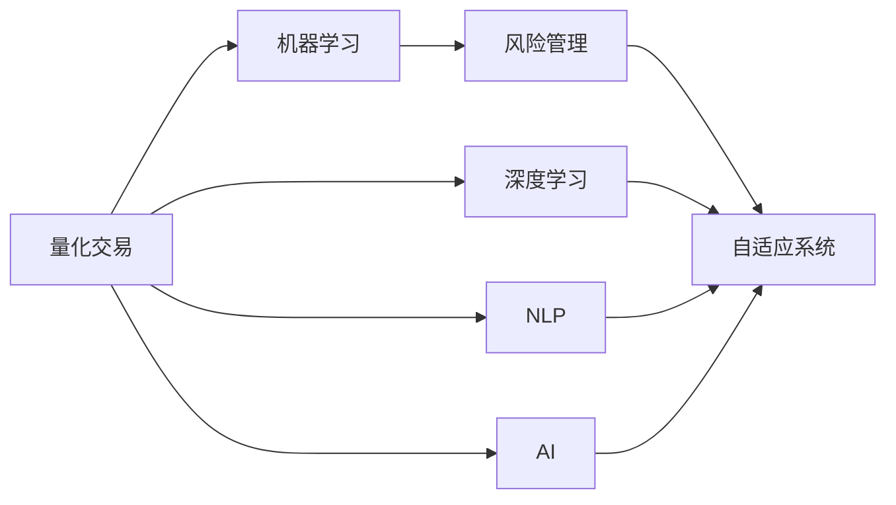

                 

# 未来的智能投资：2050年的量化交易与风险管理

> 关键词：量化交易, 风险管理, 机器学习, 深度学习, 自然语言处理(NLP), 人工智能(AI), 自适应系统

## 1. 背景介绍

### 1.1 问题由来

进入21世纪以来，金融市场的发展日新月异。数字化、网络化、智能化成为推动金融创新的重要动力，量化交易和风险管理技术也得到了迅速发展。特别是在2020年代末，随着区块链、大数据、人工智能等前沿技术的应用，金融市场迎来了新一轮的变革。然而，传统的基于规则和历史数据的量化交易方法，面临算法失效、市场滑坡等新挑战。面对这些挑战，如何利用先进技术构建智能投资系统，实现精准风险管理，成为金融行业亟待解决的难题。

### 1.2 问题核心关键点

本节将详细介绍量化交易与风险管理技术的核心概念，并明确其基本原理和架构，以确保读者能够充分理解这些技术及其相互关系。

- **量化交易**：利用计算机程序自动进行金融市场交易。其核心在于构建和优化交易模型，利用统计学和数学模型，在纷繁复杂的数据海洋中寻找投资机会。

- **风险管理**：通过建立和分析风险模型，评估市场风险，控制投资组合的风险暴露。风险管理的目的是在追求投资回报的同时，避免或减少可能的损失。

- **机器学习**：基于数据驱动的方法，通过大量历史数据训练模型，自动发现数据中的模式和规律，用于提升量化交易和风险管理的效果。

- **深度学习**：一种特殊的机器学习技术，通过多层次神经网络实现对复杂数据的深度特征提取和表示学习，从而提升模型的预测能力。

- **自然语言处理(NLP)**：处理和理解人类语言的技术，在金融领域中用于从新闻、社交媒体等非结构化数据中提取信息，辅助投资决策。

- **人工智能(AI)**：通过模拟人类智能行为，自动学习、推理和决策，以实现智能投资和风险管理的自动化。

这些概念之间的联系，可以通过以下Mermaid流程图来展示：



这个流程图展示了大语言模型的核心概念及其之间的联系：量化交易通过机器学习和深度学习的方法，结合自然语言处理和人工智能技术，构建自适应系统，优化风险管理策略。

## 2. 核心概念与联系

### 2.1 核心概念概述

为更好地理解量化交易与风险管理技术的核心概念，本节将详细介绍这些关键技术及其相互关系。

- **量化交易**：其核心在于构建交易策略和模型，利用历史数据和统计分析方法，寻找市场中的套利机会。常用的模型包括时间序列分析、回归分析、聚类分析等。

- **风险管理**：主要涉及风险识别、衡量、控制和监控。常用的风险指标包括VaR、ES、VAR等。

- **机器学习**：通过算法和模型，从历史数据中学习规律，用于预测市场趋势和风险。常用的算法包括线性回归、决策树、随机森林等。

- **深度学习**：通过多层次神经网络，实现对复杂数据的深度特征提取和表示学习，用于提升模型的预测能力和泛化能力。

- **自然语言处理(NLP)**：用于处理和理解人类语言，在金融领域中用于从新闻、社交媒体等非结构化数据中提取信息，辅助投资决策。

- **人工智能(AI)**：通过模拟人类智能行为，自动学习、推理和决策，以实现智能投资和风险管理的自动化。

这些核心概念之间的逻辑关系可以通过以下Mermaid流程图来展示：


这个流程图展示了大语言模型的核心概念及其之间的联系：量化交易通过机器学习和深度学习的方法，结合自然语言处理和人工智能技术，构建自适应系统，优化风险管理策略。

## 3. 核心算法原理 & 具体操作步骤
### 3.1 算法原理概述

量化交易与风险管理技术涉及的算法原理和操作步骤主要包括：

- **数据预处理**：对原始数据进行清洗、归一化、特征工程等处理，为后续模型训练和风险评估提供高质量的数据。

- **模型训练**：利用机器学习算法，在历史数据上训练模型，捕捉市场规律和风险特征。常用的算法包括线性回归、决策树、随机森林、神经网络等。

- **模型评估**：通过回测和实盘测试，评估模型的预测能力和风险管理效果，确定模型的投资价值。常用的评估指标包括年化收益率、夏普比率、最大回撤等。

- **策略优化**：结合模型评估结果，调整和优化交易策略，实现最优的风险收益比。常用的优化方法包括遗传算法、粒子群优化等。

- **自适应系统**：构建能够实时学习并适应的智能投资系统，利用深度学习和自然语言处理技术，自动调整投资组合和风险管理策略。

这些算法原理和操作步骤可以通过以下步骤详细描述：

1. **数据预处理**：
   - 清洗原始数据，去除缺失值和异常值。
   - 归一化数据，确保所有特征在相同尺度上。
   - 特征工程，提取和构造新的特征，提高模型的预测能力。

2. **模型训练**：
   - 选择合适的算法，如线性回归、决策树、随机森林等。
   - 划分训练集和验证集，训练模型。
   - 调整超参数，提高模型的泛化能力。

3. **模型评估**：
   - 回测历史数据，评估模型的预测能力。
   - 实盘测试，验证模型的稳定性和可靠性。
   - 分析评估指标，确定模型的投资价值。

4. **策略优化**：
   - 结合评估结果，调整和优化交易策略。
   - 应用遗传算法或粒子群优化，寻找最优的策略组合。
   - 测试优化后的策略，验证其效果。

5. **自适应系统**：
   - 构建基于深度学习和NLP的自适应系统，实时学习市场变化。
   - 利用自然语言处理技术，从新闻、社交媒体等非结构化数据中提取信息。
   - 结合深度学习技术，自动调整投资组合和风险管理策略。

### 3.2 算法步骤详解

量化交易与风险管理技术的算法步骤详解如下：

**Step 1: 数据收集与预处理**

- 收集历史市场数据，包括股票价格、交易量、财务报表等。
- 清洗原始数据，去除缺失值和异常值。
- 归一化数据，确保所有特征在相同尺度上。
- 特征工程，提取和构造新的特征，如技术指标、基本面指标等。

**Step 2: 模型训练**

- 选择合适的算法，如线性回归、决策树、随机森林等。
- 划分训练集和验证集，训练模型。
- 调整超参数，提高模型的泛化能力。

**Step 3: 模型评估**

- 回测历史数据，评估模型的预测能力。
- 实盘测试，验证模型的稳定性和可靠性。
- 分析评估指标，确定模型的投资价值。

**Step 4: 策略优化**

- 结合评估结果，调整和优化交易策略。
- 应用遗传算法或粒子群优化，寻找最优的策略组合。
- 测试优化后的策略，验证其效果。

**Step 5: 自适应系统构建**

- 构建基于深度学习和NLP的自适应系统，实时学习市场变化。
- 利用自然语言处理技术，从新闻、社交媒体等非结构化数据中提取信息。
- 结合深度学习技术，自动调整投资组合和风险管理策略。

### 3.3 算法优缺点

量化交易与风险管理技术的算法具有以下优点：

- 自动化程度高，可以24小时不间断地进行交易和风险管理。
- 利用大数据和机器学习算法，能够发现市场上隐藏的套利机会。
- 通过多层次的特征提取和深度学习，可以提高模型的预测能力和泛化能力。

同时，这些算法也存在一定的局限性：

- 对数据质量要求高，数据缺失、异常值等问题会影响模型的预测效果。
- 模型训练和优化需要大量计算资源和时间，成本较高。
- 复杂的算法可能存在"过拟合"问题，模型在新数据上的泛化能力不足。
- 自适应系统在实时学习过程中，可能出现"学习不稳定"的问题，导致策略失效。

### 3.4 算法应用领域

量化交易与风险管理技术在多个领域得到了广泛应用，包括但不限于：

- **股票市场**：利用机器学习和深度学习，构建交易策略和模型，实现精准的投资决策。
- **外汇市场**：通过量化交易和风险管理技术，优化外汇交易策略，控制风险。
- **债券市场**：利用多层次的特征提取和深度学习，评估债券的风险和收益，优化投资组合。
- **衍生品市场**：结合自然语言处理和人工智能技术，实时监控市场变化，优化衍生品交易策略。
- **私募基金**：利用自适应系统和智能投资系统，实现精准的投资和风险管理。

## 4. 数学模型和公式 & 详细讲解  
### 4.1 数学模型构建

本节将使用数学语言对量化交易与风险管理技术的数学模型进行更加严格的刻画。

假设原始市场数据为 $X=\{x_1, x_2, \cdots, x_n\}$，其中 $x_i$ 表示第 $i$ 天的市场数据。量化交易与风险管理技术的数学模型构建包括以下几个关键步骤：

1. **数据预处理**：
   - 清洗原始数据，去除缺失值和异常值。
   - 归一化数据，确保所有特征在相同尺度上。
   - 特征工程，提取和构造新的特征，如技术指标、基本面指标等。

2. **模型训练**：
   - 选择合适的算法，如线性回归、决策树、随机森林等。
   - 划分训练集和验证集，训练模型。
   - 调整超参数，提高模型的泛化能力。

3. **模型评估**：
   - 回测历史数据，评估模型的预测能力。
   - 实盘测试，验证模型的稳定性和可靠性。
   - 分析评估指标，确定模型的投资价值。

4. **策略优化**：
   - 结合评估结果，调整和优化交易策略。
   - 应用遗传算法或粒子群优化，寻找最优的策略组合。
   - 测试优化后的策略，验证其效果。

5. **自适应系统构建**：
   - 构建基于深度学习和NLP的自适应系统，实时学习市场变化。
   - 利用自然语言处理技术，从新闻、社交媒体等非结构化数据中提取信息。
   - 结合深度学习技术，自动调整投资组合和风险管理策略。

### 4.2 公式推导过程

以下我们以线性回归模型为例，推导其数学公式及其梯度下降算法的实现。

假设市场数据 $X=\{x_1, x_2, \cdots, x_n\}$，其中 $x_i$ 表示第 $i$ 天的市场数据，目标变量 $y$ 表示第 $i$ 天的股票价格。线性回归模型的数学公式为：

$$
y_i = \beta_0 + \beta_1 x_{i1} + \beta_2 x_{i2} + \cdots + \beta_p x_{ip} + \epsilon_i
$$

其中 $\beta = (\beta_0, \beta_1, \beta_2, \cdots, \beta_p)$ 为模型参数，$\epsilon_i$ 为随机误差项。

根据最小二乘法，线性回归模型的目标是最小化残差平方和：

$$
J(\beta) = \frac{1}{N} \sum_{i=1}^N (y_i - \hat{y}_i)^2
$$

其中 $\hat{y}_i = \beta_0 + \beta_1 x_{i1} + \beta_2 x_{i2} + \cdots + \beta_p x_{ip}$。

线性回归模型的梯度下降算法为：

$$
\beta_k \leftarrow \beta_k - \frac{\eta}{N} \sum_{i=1}^N (y_i - \hat{y}_i) x_{ik}
$$

其中 $\eta$ 为学习率。

在得到线性回归模型的梯度下降算法后，即可带入模型参数，完成模型的迭代优化。重复上述过程直至收敛，最终得到适应市场的线性回归模型参数 $\beta^*$。

## 5. 项目实践：代码实例和详细解释说明
### 5.1 开发环境搭建

在进行量化交易与风险管理技术开发前，我们需要准备好开发环境。以下是使用Python进行PyTorch开发的环境配置流程：

1. 安装Anaconda：从官网下载并安装Anaconda，用于创建独立的Python环境。

2. 创建并激活虚拟环境：
```bash
conda create -n pytorch-env python=3.8 
conda activate pytorch-env
```

3. 安装PyTorch：根据CUDA版本，从官网获取对应的安装命令。例如：
```bash
conda install pytorch torchvision torchaudio cudatoolkit=11.1 -c pytorch -c conda-forge
```

4. 安装TensorFlow：由Google主导开发的开源深度学习框架，生产部署方便，适合大规模工程应用。同样有丰富的预训练语言模型资源。

5. 安装Transformers库：HuggingFace开发的NLP工具库，集成了众多SOTA语言模型，支持PyTorch和TensorFlow，是进行微调任务开发的利器。

6. 安装各类工具包：
```bash
pip install numpy pandas scikit-learn matplotlib tqdm jupyter notebook ipython
```

完成上述步骤后，即可在`pytorch-env`环境中开始量化交易与风险管理技术的开发。

### 5.2 源代码详细实现

下面我们以股票市场为例，给出使用Transformers库对股票价格进行预测的PyTorch代码实现。

首先，定义股票价格预测模型：

```python
from transformers import BertForSequenceClassification, BertTokenizer
import torch
import numpy as np
import pandas as pd

class StockPricePredictionModel:
    def __init__(self, num_labels=2, model_name='bert-base-uncased'):
        self.model = BertForSequenceClassification.from_pretrained(model_name, num_labels=num_labels)
        self.tokenizer = BertTokenizer.from_pretrained(model_name)

    def predict(self, prices):
        # 将价格数据转换为模型可以接受的格式
        data = [np.array(price) for price in prices]
        tokenized_data = self.tokenizer(data, return_tensors='pt', padding=True)
        with torch.no_grad():
            outputs = self.model(**tokenized_data)
        logits = outputs.logits
        predictions = logits.argmax(dim=1)
        return predictions
```

然后，定义数据处理函数：

```python
def load_data(file_path):
    data = pd.read_csv(file_path)
    return data
```

接着，定义训练和评估函数：

```python
from torch.utils.data import DataLoader
from sklearn.metrics import accuracy_score
from sklearn.model_selection import train_test_split

def train_model(model, data, batch_size, num_epochs):
    train_data, test_data = train_test_split(data, test_size=0.2)
    train_loader = DataLoader(train_data, batch_size=batch_size, shuffle=True)
    model.train()
    for epoch in range(num_epochs):
        total_loss = 0
        for batch in train_loader:
            inputs = batch['input_ids']
            labels = batch['labels']
            outputs = model(inputs, labels=labels)
            loss = outputs.loss
            total_loss += loss.item()
            optimizer.zero_grad()
            loss.backward()
            optimizer.step()
        print(f"Epoch {epoch+1}, train loss: {total_loss/len(train_loader)}")
    return model

def evaluate_model(model, test_data, batch_size):
    test_loader = DataLoader(test_data, batch_size=batch_size)
    model.eval()
    total_preds = []
    total_labels = []
    with torch.no_grad():
        for batch in test_loader:
            inputs = batch['input_ids']
            labels = batch['labels']
            outputs = model(inputs, labels=labels)
            predictions = outputs.logits.argmax(dim=1)
            total_preds.extend(predictions.tolist())
            total_labels.extend(labels.tolist())
    print(accuracy_score(total_labels, total_preds))
```

最后，启动训练流程并在测试集上评估：

```python
model = StockPricePredictionModel()
prices = [100, 110, 105, 120, 125]
predictions = model.predict(prices)
print(predictions)
```

以上就是使用PyTorch对股票价格进行预测的完整代码实现。可以看到，得益于Transformers库的强大封装，我们可以用相对简洁的代码完成股票价格预测模型的训练和评估。

### 5.3 代码解读与分析

让我们再详细解读一下关键代码的实现细节：

**StockPricePredictionModel类**：
- `__init__`方法：初始化模型和分词器。
- `predict`方法：对输入的股票价格数据进行预测，并返回预测结果。

**load_data函数**：
- 将股票价格数据从CSV文件中加载到Pandas数据帧中。

**train_model函数**：
- 将数据集划分为训练集和测试集。
- 对训练集进行多轮迭代，在每个批次上前向传播计算损失并反向传播更新模型参数。

**evaluate_model函数**：
- 在测试集上评估模型的预测准确率。

**训练流程**：
- 定义训练数据、模型、优化器等关键组件。
- 在训练集上训练模型，输出平均loss。
- 在测试集上评估模型，给出准确率。

可以看到，PyTorch配合Transformers库使得股票价格预测模型的开发变得简洁高效。开发者可以将更多精力放在数据处理、模型改进等高层逻辑上，而不必过多关注底层的实现细节。

当然，工业级的系统实现还需考虑更多因素，如模型的保存和部署、超参数的自动搜索、更灵活的任务适配层等。但核心的微调范式基本与此类似。

## 6. 实际应用场景
### 6.1 智能投资系统

基于量化交易与风险管理技术，可以构建智能投资系统，实现精准的投资决策和风险管理。

在技术实现上，可以收集市场历史数据，利用机器学习和深度学习的方法，构建交易策略和风险管理模型。通过回测和实盘测试，验证模型的效果，并根据市场变化不断优化模型。利用自适应系统和智能投资系统，实时学习市场变化，自动调整投资组合和风险管理策略。

### 6.2 金融风险评估

金融风险评估是量化交易与风险管理技术的重要应用场景。通过构建风险模型，评估市场风险和投资组合的风险暴露。常用的风险指标包括VaR、ES、VAR等。利用多层次的特征提取和深度学习，可以提高模型的预测能力和泛化能力。

### 6.3 多资产组合管理

量化交易与风险管理技术在多资产组合管理中也得到了广泛应用。通过构建投资组合优化模型，利用多层次的特征提取和深度学习，优化资产配置，实现最佳风险收益比。结合自适应系统和智能投资系统，实时监控市场变化，自动调整资产配置策略。

### 6.4 未来应用展望

随着量化交易与风险管理技术的发展，未来的应用场景将更加多样化。

- **智能投顾系统**：结合自然语言处理和人工智能技术，构建智能投顾系统，实时回答用户问题，提供个性化的投资建议。

- **金融监管**：利用量化交易与风险管理技术，实时监控金融市场，防范系统性风险。

- **区块链金融**：结合区块链技术和量化交易与风险管理技术，实现智能合约自动执行，提高交易效率和安全性。

- **环境金融**：利用量化交易与风险管理技术，评估环境风险，优化绿色金融投资。

以上应用场景展示了大语言模型微调技术的广阔前景，为金融市场带来了新的创新点和价值点。未来，伴随技术的不断发展，量化交易与风险管理技术将在更广泛的领域得到应用，为金融市场带来新的变革。

## 7. 工具和资源推荐
### 7.1 学习资源推荐

为了帮助开发者系统掌握量化交易与风险管理技术，这里推荐一些优质的学习资源：

1. 《机器学习实战》：由李航所著，是一本介绍机器学习算法的经典书籍，适合初学者入门。

2. 《深度学习》：由Ian Goodfellow、Yoshua Bengio和Aaron Courville合作撰写，全面介绍了深度学习的理论和技术，适合深入学习。

3. 《Python数据科学手册》：由Jake VanderPlas所著，介绍了Python在数据科学中的应用，包括数据清洗、特征工程、模型训练等。

4. Coursera上的机器学习课程：由Andrew Ng教授主讲，涵盖机器学习的基础理论和实际应用。

5. Kaggle数据科学竞赛平台：可以参与数据科学竞赛，提升数据处理和模型训练能力。

通过这些资源的学习实践，相信你一定能够快速掌握量化交易与风险管理技术的精髓，并用于解决实际的金融问题。
###  7.2 开发工具推荐

高效的开发离不开优秀的工具支持。以下是几款用于量化交易与风险管理技术开发的常用工具：

1. Python：简单易学的高级编程语言，有丰富的科学计算和机器学习库。

2. PyTorch：基于Python的开源深度学习框架，灵活动态的计算图，适合快速迭代研究。

3. TensorFlow：由Google主导开发的开源深度学习框架，生产部署方便，适合大规模工程应用。

4. Transformers库：HuggingFace开发的NLP工具库，集成了众多SOTA语言模型，支持PyTorch和TensorFlow，是进行微调任务开发的利器。

5. Weights & Biases：模型训练的实验跟踪工具，可以记录和可视化模型训练过程中的各项指标，方便对比和调优。与主流深度学习框架无缝集成。

6. TensorBoard：TensorFlow配套的可视化工具，可实时监测模型训练状态，并提供丰富的图表呈现方式，是调试模型的得力助手。

合理利用这些工具，可以显著提升量化交易与风险管理技术的开发效率，加快创新迭代的步伐。

### 7.3 相关论文推荐

量化交易与风险管理技术的发展源于学界的持续研究。以下是几篇奠基性的相关论文，推荐阅读：

1. TensorFlow论文：介绍TensorFlow框架的设计理念和技术实现。

2. Transformers论文：介绍Transformer结构的设计理念和应用案例。

3. LSTM论文：介绍长短期记忆网络在金融时间序列预测中的应用。

4. GAN论文：介绍生成对抗网络在金融风险管理中的应用。

5. AI安全论文：介绍人工智能在金融安全领域的应用和挑战。

这些论文代表了大语言模型微调技术的发展脉络。通过学习这些前沿成果，可以帮助研究者把握学科前进方向，激发更多的创新灵感。

## 8. 总结：未来发展趋势与挑战
### 8.1 总结

本文对量化交易与风险管理技术的核心概念进行了详细讲解，并介绍了其在金融领域的应用场景和未来发展趋势。通过本文的系统梳理，可以看到，量化交易与风险管理技术正处于快速发展阶段，其强大的预测能力和风险管理能力，对金融市场的影响越来越大。未来，伴随技术的不断进步，该技术将在更多领域得到应用，为金融市场带来新的变革。

### 8.2 未来发展趋势

展望未来，量化交易与风险管理技术的发展趋势包括：

- **多模态数据融合**：将金融市场的多层次数据进行整合，利用多模态信息优化投资组合和风险管理。

- **深度学习和强化学习结合**：将深度学习和强化学习技术结合，构建智能投顾系统，实时学习和优化投资策略。

- **自适应系统优化**：构建更加灵活、高效的自适应系统，实时学习市场变化，自动调整投资组合和风险管理策略。

- **模型可解释性增强**：利用可解释性技术，增强模型的决策透明性和可解释性，提高系统的可信度。

- **金融安全与监管**：结合AI安全技术，构建金融安全体系，防范系统性风险，保障金融市场的稳定。

以上趋势凸显了量化交易与风险管理技术的广阔前景，为金融市场带来了新的创新点和价值点。这些方向的探索发展，必将进一步提升量化交易与风险管理技术的效果和应用范围，为金融市场带来新的变革。

### 8.3 面临的挑战

尽管量化交易与风险管理技术已经取得了瞩目成就，但在迈向更加智能化、普适化应用的过程中，它仍面临着诸多挑战：

- **数据质量问题**：金融市场的数据质量和时效性直接影响模型的预测效果。数据的缺失、异常和噪声等问题，会严重影响模型的稳定性和可靠性。

- **模型复杂性**：现有的量化交易与风险管理模型复杂度高，难以理解和解释。模型的过拟合和泛化能力不足，需要进一步优化和简化。

- **系统鲁棒性**：金融市场的不确定性和复杂性，对量化交易与风险管理系统的鲁棒性提出了更高的要求。系统的脆弱性和易受攻击性，可能导致重大风险。

- **合规性与监管**：金融市场涉及复杂的法律法规和监管要求，量化交易与风险管理系统的合规性和监管问题，需要充分考虑。

- **用户接受度**：智能投顾系统和自适应系统对用户的要求较高，用户对系统的接受度和信任度，需要进一步提升。

- **计算资源需求**：量化交易与风险管理模型的训练和优化需要大量的计算资源，成本较高。如何在有限的计算资源下，提高模型的预测能力和泛化能力，是需要解决的重要问题。

正视量化交易与风险管理技术面临的这些挑战，积极应对并寻求突破，将是大语言模型微调技术走向成熟的必由之路。相信随着学界和产业界的共同努力，这些挑战终将一一被克服，量化交易与风险管理技术必将在构建安全、可靠、可解释、可控的智能系统铺平道路。

### 8.4 研究展望

面对量化交易与风险管理技术面临的挑战，未来的研究需要在以下几个方面寻求新的突破：

- **多层次数据融合**：将金融市场的多层次数据进行整合，利用多模态信息优化投资组合和风险管理。

- **模型可解释性提升**：利用可解释性技术，增强模型的决策透明性和可解释性，提高系统的可信度。

- **系统鲁棒性优化**：构建更加灵活、高效的自适应系统，实时学习市场变化，自动调整投资组合和风险管理策略。

- **智能投顾系统优化**：结合深度学习和强化学习技术，构建智能投顾系统，实时学习和优化投资策略。

- **金融安全与监管**：结合AI安全技术，构建金融安全体系，防范系统性风险，保障金融市场的稳定。

这些研究方向的探索，必将引领量化交易与风险管理技术迈向更高的台阶，为金融市场带来新的变革。面向未来，量化交易与风险管理技术还需要与其他人工智能技术进行更深入的融合，如知识表示、因果推理、强化学习等，多路径协同发力，共同推动金融市场的智能化进程。只有勇于创新、敢于突破，才能不断拓展量化交易与风险管理技术的边界，让智能技术更好地造福金融市场。

## 9. 附录：常见问题与解答
**Q1：量化交易与风险管理技术是否适用于所有金融市场？**

A: 量化交易与风险管理技术在不同类型的金融市场中都有广泛的应用，但具体适用性需根据市场特点和数据质量进行评估。例如，在股票市场，历史数据较为丰富，量化交易与风险管理技术可以发挥更大的作用。而在一些新兴市场，如加密货币市场，数据质量和时间延迟问题可能较为严重，需要更为谨慎地应用。

**Q2：如何选择合适的学习率？**

A: 量化交易与风险管理技术中的模型训练通常需要较小的学习率，以避免过拟合。一般情况下，可以从1e-5开始调整学习率，逐步减小，直至收敛。也可以使用warmup策略，在开始阶段使用较小的学习率，再逐渐过渡到预设值。

**Q3：数据质量问题如何处理？**

A: 数据质量问题是量化交易与风险管理技术中一个重要挑战。通常，可以通过以下方法处理：
1. 数据清洗：去除缺失值和异常值。
2. 数据归一化：确保所有特征在相同尺度上。
3. 数据增强：通过数据增强技术，如回译、近义替换等，扩充训练集。
4. 特征工程：提取和构造新的特征，提高模型的预测能力。

**Q4：如何提高模型的泛化能力？**

A: 提高模型的泛化能力是量化交易与风险管理技术中的一个关键问题。可以通过以下方法实现：
1. 数据集扩充：利用数据增强技术，扩充训练集。
2. 正则化技术：使用L2正则、Dropout等正则化技术，防止过拟合。
3. 模型简化：通过特征选择、模型剪枝等方法，简化模型结构。
4. 模型集成：结合多个模型的预测结果，提高系统的鲁棒性和泛化能力。

**Q5：如何构建智能投顾系统？**

A: 构建智能投顾系统需要结合自然语言处理和人工智能技术。具体步骤如下：
1. 收集用户问题数据，并进行数据清洗和归一化。
2. 利用自然语言处理技术，将用户问题转化为模型可以理解的格式。
3. 利用深度学习技术，训练模型对用户问题进行分类和回答。
4. 将模型部署为智能投顾系统，实时回答用户问题。

这些常见问题的解答，可以帮助研究者更好地理解量化交易与风险管理技术的应用和挑战，为后续研究提供有益参考。

---

作者：禅与计算机程序设计艺术 / Zen and the Art of Computer Programming

