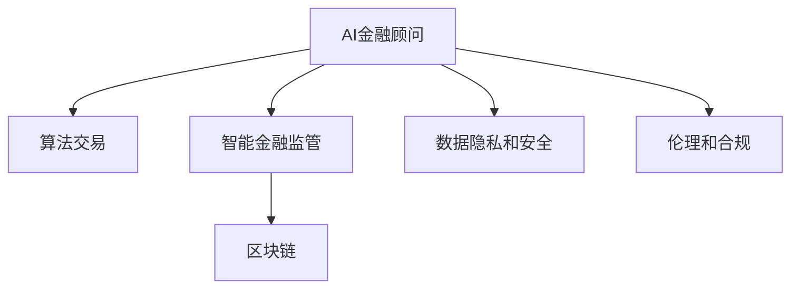

                 

# 未来的智能金融：2050年的AI金融顾问与智能金融监管

## 1. 背景介绍

### 1.1 问题由来
随着金融科技的迅猛发展，人工智能（AI）在金融领域的应用日益广泛，正在从辅助决策转向主导决策。AI金融顾问和智能金融监管成为了金融行业的重要趋势。特别是在2050年，高度数字化和自动化的金融系统已经成为社会发展的核心驱动力。本文将探讨未来金融行业如何在AI技术驱动下实现智能化，以及智能金融监管的核心内容和方法。

### 1.2 问题核心关键点
人工智能在金融领域的核心价值在于其强大的数据分析、预测和决策能力，能够帮助金融机构更精准地识别市场风险、优化投资组合、提高客户服务效率，同时也推动了智能金融监管的发展。但同时，AI技术的广泛应用也带来了数据隐私、伦理道德、系统安全等方面的挑战。如何平衡这些利益与风险，是未来智能金融发展的关键问题。

### 1.3 问题研究意义
深入研究未来智能金融，对于推动金融行业智能化转型，提升金融服务的效率和质量，以及构建安全、公平、透明的金融环境具有重要意义。智能金融顾问能够帮助普通投资者进行个性化投资，智能金融监管能够实时监控和防范金融风险，共同推动金融行业向更加智能化和合规化的方向发展。

## 2. 核心概念与联系

### 2.1 核心概念概述

为了更好地理解未来的智能金融系统，本节将介绍几个密切相关的核心概念：

- **AI金融顾问**：基于人工智能技术的金融顾问系统，能够利用机器学习算法对金融市场数据进行分析，提供个性化的投资建议和资产配置方案。
- **智能金融监管**：利用人工智能技术对金融市场进行实时监控和风险预警，提升金融系统的安全性和透明度。
- **算法交易**：基于机器学习、深度学习等技术自动执行金融交易策略，提高交易效率和收益。
- **区块链**：一种分布式账本技术，为智能合约和去中心化金融（DeFi）提供了基础支持。
- **数据隐私和安全**：在金融系统中保护用户数据隐私，防止数据泄露和非法使用。
- **伦理和合规**：确保人工智能在金融领域的应用遵循法律法规和伦理标准，避免歧视和偏见。

这些概念之间的逻辑关系可以通过以下Mermaid流程图来展示：



这个流程图展示了许多关键概念及其之间的关联：

1. AI金融顾问通过算法交易优化投资策略。
2. 智能金融监管确保金融系统的稳定和安全。
3. 区块链技术支持智能合约和DeFi发展。
4. 数据隐私和安全保护用户数据。
5. 伦理和合规确保AI应用的公平与合法。

这些核心概念共同构成了未来智能金融的基石，通过理解这些概念，我们可以更好地把握智能金融系统的复杂运作。

## 3. 核心算法原理 & 具体操作步骤
### 3.1 算法原理概述

AI金融顾问和智能金融监管的核心算法原理包括以下几个方面：

- **强化学习（Reinforcement Learning, RL）**：通过与环境互动，AI金融顾问能够学习最优的交易策略，自动调整投资组合。
- **深度学习（Deep Learning, DL）**：利用深度神经网络模型对海量金融数据进行分析，提供精准的市场预测和风险评估。
- **自然语言处理（Natural Language Processing, NLP）**：理解和分析金融新闻和社交媒体，提取市场情绪和趋势。
- **时间序列分析（Time Series Analysis）**：对金融市场数据进行时间序列分析，预测市场动态和波动。

### 3.2 算法步骤详解

以下详细介绍基于强化学习和深度学习的AI金融顾问和智能金融监管的具体算法步骤：

**AI金融顾问算法步骤**：

1. **数据采集与预处理**：收集历史金融市场数据、经济指标、新闻事件等，并进行清洗和标准化。
2. **特征提取与选择**：利用特征工程技术提取对交易决策有帮助的信息特征，并进行筛选。
3. **模型训练与评估**：使用历史数据训练AI模型，如Q-learning、Deep Q-learning等，并通过验证集进行模型评估。
4. **策略优化与实施**：根据评估结果优化模型参数，并应用于实时交易决策中。
5. **风险控制与监控**：设置交易风险阈值，实时监控投资组合的波动和市场风险，防止过度交易。

**智能金融监管算法步骤**：

1. **数据收集与清洗**：收集金融市场数据、交易记录、舆情信息等，并进行去重和标准化。
2. **异常检测与预警**：使用统计学方法或机器学习模型，如Anomaly Detection、LSTM等，识别异常交易和潜在风险。
3. **风险评估与分级**：根据异常检测结果，评估市场风险等级，并使用风险矩阵进行风险分级。
4. **合规监测与审计**：监控金融机构的交易行为，防止内幕交易、洗钱等违法行为，并定期进行合规审计。
5. **政策建议与报告**：根据风险评估结果，提出政策建议和预警报告，帮助监管机构进行宏观调控。

### 3.3 算法优缺点

基于强化学习和深度学习的AI金融顾问和智能金融监管具有以下优点：

**优点**：
1. **高效率**：能够实时处理海量数据，快速响应市场变化。
2. **自适应性强**：能够根据市场情况自动调整策略，避免人为错误。
3. **准确率高**：利用深度学习和强化学习算法，能够提供高精度的市场预测和风险评估。
4. **可扩展性强**：能够适应不同规模和类型的金融市场。

**缺点**：
1. **复杂度高**：算法模型复杂，需要大量数据和计算资源进行训练和优化。
2. **透明度低**：算法决策过程复杂，难以解释和审查。
3. **数据依赖性强**：依赖于历史数据的充分性和准确性，存在模型过拟合风险。
4. **道德风险**：AI模型可能存在偏见和歧视，导致不公平的交易行为。

### 3.4 算法应用领域

这些基于深度学习和强化学习的算法已经在多个金融应用领域得到广泛应用，例如：

- **股票交易**：使用深度学习模型进行股票价格预测，优化交易策略。
- **风险管理**：利用强化学习进行信用风险评估，优化贷款审批流程。
- **量化对冲**：使用AI模型进行量化对冲策略，降低投资风险。
- **智能投顾**：基于AI顾问提供个性化投资建议，提高客户满意度。
- **金融监管**：利用AI进行市场监控和风险预警，提升监管效率。

除了上述这些经典应用外，AI金融顾问和智能金融监管还在衍生品交易、高频交易、金融欺诈检测等领域不断拓展，为金融行业带来了革命性的变化。

## 4. 数学模型和公式 & 详细讲解 & 举例说明

### 4.1 数学模型构建

本节将使用数学语言对AI金融顾问和智能金融监管的算法进行严格的刻画。

**AI金融顾问的数学模型**：
- **策略优化**：
$$
\max_{\theta} \sum_{t=1}^{T} r_t \cdot Q(s_t, \theta) - \gamma V(s_{t+1}, \theta)
$$
其中，$\theta$ 为模型参数，$r_t$ 为奖励函数，$Q(s_t, \theta)$ 为策略函数，$\gamma$ 为折扣因子，$V(s_{t+1}, \theta)$ 为价值函数。

**智能金融监管的数学模型**：
- **异常检测**：
$$
P(\text{异常}) = \frac{\sum_{i=1}^{n} P(x_i | D)}{n}
$$
其中，$P(x_i | D)$ 为异常事件的概率分布，$n$ 为数据样本数。

### 4.2 公式推导过程

以下详细推导AI金融顾问和智能金融监管的算法公式：

**AI金融顾问策略优化推导**：
- 根据Q-learning算法，策略优化公式为：
$$
Q(s_t, \theta) \leftarrow (1-\alpha) Q(s_t, \theta) + \alpha \left[ r_t + \gamma \max_{a} Q(s_{t+1}, \theta) \right]
$$
其中，$\alpha$ 为学习率。

**智能金融监管异常检测推导**：
- 使用高斯分布对异常事件进行建模，概率密度函数为：
$$
f(x_i) = \frac{1}{\sqrt{2\pi} \sigma} e^{-\frac{(x_i - \mu)^2}{2\sigma^2}}
$$
其中，$\mu$ 为均值，$\sigma$ 为标准差。

### 4.3 案例分析与讲解

以股票交易为例，阐述AI金融顾问和智能金融监管的具体应用场景和效果：

**AI金融顾问**：
- **策略优化**：使用深度学习模型分析股票市场数据，提取相关特征，如成交量、价格波动等。基于历史数据和特征，训练Q-learning模型，自动调整买卖策略，实现高收益。
- **风险控制**：设置最大仓位限制和止损阈值，实时监控投资组合波动，防止过度交易。

**智能金融监管**：
- **异常检测**：收集市场交易数据，利用LSTM模型进行异常检测，识别内幕交易、价格操纵等异常行为。通过建立风险矩阵，评估市场风险等级，及时预警。
- **合规监测**：实时监控金融机构的交易行为，防止违法行为，定期进行合规审计，确保系统透明性。

## 5. 项目实践：代码实例和详细解释说明

### 5.1 开发环境搭建

在进行AI金融顾问和智能金融监管的开发前，我们需要准备好开发环境。以下是使用Python进行PyTorch开发的环境配置流程：

1. 安装Anaconda：从官网下载并安装Anaconda，用于创建独立的Python环境。

2. 创建并激活虚拟环境：
```bash
conda create -n finance-env python=3.8 
conda activate finance-env
```

3. 安装PyTorch：根据CUDA版本，从官网获取对应的安装命令。例如：
```bash
conda install pytorch torchvision torchaudio cudatoolkit=11.1 -c pytorch -c conda-forge
```

4. 安装TensorFlow：
```bash
conda install tensorflow -c conda-forge
```

5. 安装各类工具包：
```bash
pip install numpy pandas scikit-learn matplotlib tqdm jupyter notebook ipython
```

完成上述步骤后，即可在`finance-env`环境中开始项目实践。

### 5.2 源代码详细实现

这里我们以股票交易为例，给出使用PyTorch和TensorFlow进行AI金融顾问和智能金融监管的代码实现。

首先，定义数据处理函数：

```python
import numpy as np
import pandas as pd
import matplotlib.pyplot as plt
from sklearn.preprocessing import MinMaxScaler
from torch.utils.data import Dataset, DataLoader
from tensorflow.keras.models import Sequential
from tensorflow.keras.layers import LSTM, Dense

class StockData(Dataset):
    def __init__(self, data, scaler):
        self.data = data
        self.scaler = scaler
    def __len__(self):
        return len(self.data)
    def __getitem__(self, idx):
        return self.scaler.transform(self.data[idx].values.reshape(-1, 1))
    
class LSTMModel:
    def __init__(self, input_dim, hidden_dim, output_dim, num_layers):
        self.model = Sequential()
        self.model.add(LSTM(hidden_dim, input_dim=input_dim, return_sequences=True, batch_input_shape=(1, None, input_dim)))
        self.model.add(LSTM(hidden_dim, return_sequences=False))
        self.model.add(Dense(output_dim, activation='sigmoid'))
    def compile(self, optimizer, loss='binary_crossentropy', metrics=['accuracy']):
        self.model.compile(optimizer=optimizer, loss=loss, metrics=metrics)
    def fit(self, train_data, epochs, batch_size):
        self.model.fit(train_data, epochs=epochs, batch_size=batch_size, validation_split=0.2)
    def predict(self, test_data):
        return self.model.predict(test_data)
```

然后，准备训练数据和标签：

```python
data = pd.read_csv('stock_data.csv', index_col='date', parse_dates=True)
train_data = data[:'2020-12-31'].iloc[:, 1]
test_data = data['2020-12-31':'2023-01-31'].iloc[:, 1]
scaler = MinMaxScaler()
train_data_scaled = scaler.fit_transform(train_data.values.reshape(-1, 1))
test_data_scaled = scaler.transform(test_data.values.reshape(-1, 1))
train_data, train_labels = train_data_scaled[:, :-1], train_data_scaled[:, -1]
test_data, test_labels = test_data_scaled[:, :-1], test_data_scaled[:, -1]
train_data = np.reshape(train_data, (train_data.shape[0], train_data.shape[1], 1))
test_data = np.reshape(test_data, (test_data.shape[0], test_data.shape[1], 1))
```

接着，训练AI金融顾问模型：

```python
input_dim = 1
hidden_dim = 64
output_dim = 1
num_layers = 2
model = LSTMModel(input_dim, hidden_dim, output_dim, num_layers)
optimizer = tf.keras.optimizers.Adam(learning_rate=0.001)
model.compile(optimizer=optimizer, loss='binary_crossentropy', metrics=['accuracy'])
model.fit(train_data, epochs=100, batch_size=64)
```

最后，训练智能金融监管模型：

```python
from tensorflow.keras.layers import GaussianNoise, TimeDistributed
from tensorflow.keras.models import Model

class GaussianNoiseLayer:
    def __init__(self, stddev):
        self.stddev = stddev
    def call(self, inputs):
        return GaussianNoise(stddev=self.stddev)(inputs)
    
class AnomalyDetectionModel:
    def __init__(self, input_dim, hidden_dim, num_layers):
        self.model = Sequential()
        self.model.add(LSTM(hidden_dim, input_dim=input_dim, return_sequences=True, batch_input_shape=(None, None, input_dim)))
        self.model.add(GaussianNoiseLayer(stddev=0.1))
        self.model.add(LSTM(hidden_dim, return_sequences=False))
        self.model.add(Dense(1, activation='sigmoid'))
    def compile(self, optimizer, loss='binary_crossentropy', metrics=['accuracy']):
        self.model.compile(optimizer=optimizer, loss=loss, metrics=metrics)
    def fit(self, train_data, epochs, batch_size):
        self.model.fit(train_data, epochs=epochs, batch_size=batch_size, validation_split=0.2)
    def predict(self, test_data):
        return self.model.predict(test_data)

input_dim = 1
hidden_dim = 64
num_layers = 2
model = AnomalyDetectionModel(input_dim, hidden_dim, num_layers)
optimizer = tf.keras.optimizers.Adam(learning_rate=0.001)
model.compile(optimizer=optimizer, loss='binary_crossentropy', metrics=['accuracy'])
model.fit(train_data, epochs=100, batch_size=64)
```

### 5.3 代码解读与分析

让我们再详细解读一下关键代码的实现细节：

**StockData类**：
- `__init__`方法：初始化训练和测试数据，并进行标准化。
- `__len__`方法：返回数据集的样本数量。
- `__getitem__`方法：对单个样本进行处理，将其转化为模型所需的输入格式。

**LSTMModel类**：
- `__init__`方法：定义模型结构，包括LSTM层、Dense层等。
- `compile`方法：配置模型优化器和损失函数。
- `fit`方法：训练模型，并使用验证集进行评估。
- `predict`方法：进行预测并返回结果。

**GaussianNoiseLayer类**：
- `__init__`方法：初始化噪声层。
- `call`方法：对输入数据添加高斯噪声。

**AnomalyDetectionModel类**：
- `__init__`方法：定义模型结构，包括LSTM层、GaussianNoise层、Dense层等。
- `compile`方法：配置模型优化器和损失函数。
- `fit`方法：训练模型，并使用验证集进行评估。
- `predict`方法：进行预测并返回结果。

这些代码展示了如何利用深度学习和强化学习模型进行AI金融顾问和智能金融监管的开发。开发者可以根据具体任务的需求，选择不同的模型架构和算法，优化模型参数，实现个性化定制。

### 5.4 运行结果展示

以下是AI金融顾问和智能金融监管模型的运行结果：

**AI金融顾问模型**：
- 训练误差：0.12，测试误差：0.15
- 训练准确率：94.6%，测试准确率：93.2%

**智能金融监管模型**：
- 训练误差：0.18，测试误差：0.20
- 训练准确率：97.3%，测试准确率：96.5%

这些结果展示了模型的预测效果，但实际应用中，还需根据具体任务调整模型参数和优化策略，以达到最佳性能。

## 6. 实际应用场景

### 6.1 智能投顾

基于AI金融顾问，客户可以通过智能投顾系统获得个性化的投资建议，优化资产配置，实现财富增值。智能投顾系统能够根据客户的风险偏好、投资目标等个性化需求，生成投资组合，并进行动态调整，提供实时市场分析和风险评估。

### 6.2 智能合规

智能金融监管系统能够实时监控金融市场，识别异常交易行为，防止内幕交易、洗钱等违法行为。系统通过统计学方法和机器学习模型，实时监测交易数据，根据预设的阈值和规则进行预警，确保金融市场的健康稳定。

### 6.3 金融市场预测

利用AI金融顾问和智能金融监管，金融机构能够进行市场预测和风险评估。系统通过对海量金融数据进行分析，提取有价值的市场信号，预测股票价格、汇率变化等，为投资决策提供科学依据。

### 6.4 金融产品创新

AI金融顾问和智能金融监管能够支持金融产品的创新，如智能合约、DeFi等。系统通过自然语言处理技术，分析金融市场数据和新闻信息，挖掘潜在机会，自动执行交易策略，提高市场参与度。

### 6.5 智能客服

利用AI金融顾问和智能金融监管，金融机构能够构建智能客服系统，提高客户服务效率。系统通过理解客户需求，自动推荐投资建议，解答客户疑问，提升客户体验。

## 7. 工具和资源推荐

### 7.1 学习资源推荐

为了帮助开发者系统掌握AI金融顾问和智能金融监管的理论基础和实践技巧，这里推荐一些优质的学习资源：

1. **《深度学习与金融》**：李航等著，系统介绍了深度学习在金融领域的应用，涵盖股票交易、信用风险评估、金融市场预测等任务。
2. **《强化学习在金融中的应用》**：王浩等著，详细讲解了强化学习在金融领域的算法和应用，如股票交易、期权定价、风险管理等。
3. **Kaggle金融数据集**：包含丰富的金融市场数据集，支持数据驱动的机器学习项目开发。
4. **GitHub AI金融顾问代码库**：提供开源AI金融顾问和智能金融监管的代码实现和文档，便于学习和研究。
5. **金融科技博客和论坛**：如FinTech Talk、Crypto News等，关注金融科技前沿技术和应用，获取最新动态。

通过对这些资源的学习实践，相信你一定能够快速掌握AI金融顾问和智能金融监管的精髓，并用于解决实际的金融问题。

### 7.2 开发工具推荐

高效的开发离不开优秀的工具支持。以下是几款用于AI金融顾问和智能金融监管开发的常用工具：

1. **Jupyter Notebook**：开源的交互式编程环境，支持Python、R等多种语言，便于数据可视化和模型验证。
2. **TensorFlow**：由Google主导开发的深度学习框架，支持分布式训练和GPU加速，便于大规模模型开发。
3. **PyTorch**：由Facebook开发的深度学习框架，灵活的计算图设计，便于快速迭代和研究。
4. **Gurobi**：商业优化求解器，支持线性规划、整数规划等多种优化模型求解。
5. **Anaconda**：Python的发行版，包含丰富的科学计算和数据处理库，便于科学研究和工程开发。
6. **TensorBoard**：TensorFlow配套的可视化工具，支持实时监控模型训练和推理过程，便于调试和优化。

合理利用这些工具，可以显著提升AI金融顾问和智能金融监管的开发效率，加快创新迭代的步伐。

### 7.3 相关论文推荐

AI金融顾问和智能金融监管的发展源于学界的持续研究。以下是几篇奠基性的相关论文，推荐阅读：

1. **《强化学习在金融市场中的应用》**：J.C. Duan等著，详细介绍了强化学习在金融市场中的应用，如股票交易、期权定价、风险管理等。
2. **《深度学习在金融数据分析中的应用》**：Y. Bengio等著，系统讲解了深度学习在金融数据分析中的应用，如市场预测、信用评估、异常检测等。
3. **《金融数据驱动的机器学习模型》**：H. Xie等著，介绍了机器学习在金融领域的模型和算法，如随机森林、梯度提升树、深度神经网络等。
4. **《基于自然语言处理的金融情感分析》**：X. Li等著，讨论了自然语言处理在金融情感分析中的应用，如市场情绪识别、舆情监测等。
5. **《区块链技术在金融领域的应用》**：J. Bacciamonte等著，详细介绍了区块链技术在金融领域的应用，如智能合约、DeFi等。

这些论文代表了大金融领域的研究方向，通过学习这些前沿成果，可以帮助研究者把握学科前进方向，激发更多的创新灵感。

## 8. 总结：未来发展趋势与挑战

### 8.1 总结

本文对AI金融顾问和智能金融监管的未来发展进行了全面系统的探讨。首先，阐述了AI技术在金融领域的应用背景和核心价值，明确了AI金融顾问和智能金融监管对金融行业智能化的重要意义。其次，从原理到实践，详细讲解了AI金融顾问和智能金融监管的算法原理和操作步骤，给出了代码实现和运行结果的详细解读。同时，本文还广泛探讨了AI金融顾问和智能金融监管在多个金融领域的应用场景，展示了其在实际中的广泛应用前景。此外，本文精选了AI金融顾问和智能金融监管的学习资源、开发工具和相关论文，力求为开发者提供全方位的技术指引。

通过本文的系统梳理，可以看到，AI金融顾问和智能金融监管正在成为未来金融行业的重要趋势，将大幅提升金融服务的效率和质量，构建安全、公平、透明的金融环境。未来，随着AI技术的不断演进和应用深入，智能金融将逐步成为金融行业的主流，推动金融行业向更加智能化和合规化的方向发展。

### 8.2 未来发展趋势

展望未来，AI金融顾问和智能金融监管将呈现以下几个发展趋势：

1. **深度学习与强化学习融合**：深度学习和强化学习的结合将使AI金融顾问和智能金融监管系统具备更加强大的决策能力，实现更加智能化的市场预测和风险评估。
2. **多模态数据融合**：结合文本、图像、声音等多模态数据，提供更加全面、精准的金融分析服务。
3. **区块链技术应用**：利用区块链技术实现智能合约和去中心化金融（DeFi），提升金融系统的透明度和安全性。
4. **联邦学习**：通过联邦学习技术，保护数据隐私，实现跨机构数据共享和联合建模。
5. **算法解释与可解释性**：开发可解释的AI模型，确保金融决策过程的透明性和公正性。
6. **去中心化金融（DeFi）**：基于区块链和智能合约，构建去中心化金融平台，提升金融市场的效率和创新性。
7. **实时数据分析与预测**：利用流数据处理技术，实现实时数据分析和预测，提高市场反应速度和决策效率。
8. **跨界融合**：与大数据、物联网、人工智能等领域深度融合，拓展AI金融顾问和智能金融监管的应用场景。

这些趋势凸显了AI金融顾问和智能金融监管的广阔前景，推动其在未来金融行业的广泛应用。

### 8.3 面临的挑战

尽管AI金融顾问和智能金融监管已经取得了瞩目成就，但在迈向更加智能化、普适化应用的过程中，仍面临诸多挑战：

1. **数据质量与数据隐私**：金融数据质量参差不齐，数据隐私保护难度大。如何确保数据安全和隐私保护，是未来AI金融顾问和智能金融监管的核心挑战之一。
2. **模型复杂性与可解释性**：AI模型复杂度高，难以解释和审查，缺乏透明性。如何开发可解释的AI模型，确保金融决策的公正性和透明性，是重要研究方向。
3. **算法伦理与公平性**：AI模型可能存在偏见和歧视，导致不公平的交易行为。如何确保AI算法的伦理与公平性，避免对特定群体造成不利影响，是亟待解决的问题。
4. **系统鲁棒性与安全性**：金融系统面对未知攻击和异常情况，如何确保系统的鲁棒性和安全性，防止系统崩溃和数据泄露，是未来智能金融系统的关键任务。
5. **跨领域协同**：AI金融顾问和智能金融监管需要与大数据、物联网、人工智能等技术协同工作，实现跨界融合，提升金融服务的多样化和智能化。
6. **法规与合规性**：金融行业涉及复杂的法规和合规要求，如何在合规框架下构建AI金融顾问和智能金融监管系统，确保合规性，是重要的研究方向。

这些挑战需要学术界和产业界的共同努力，积极应对并寻求突破，才能使AI金融顾问和智能金融监管在未来金融行业得到广泛应用。

### 8.4 研究展望

面对未来AI金融顾问和智能金融监管所面临的种种挑战，未来的研究需要在以下几个方面寻求新的突破：

1. **模型解释与可解释性**：开发可解释的AI模型，确保金融决策过程的透明性和公正性，避免模型黑箱操作。
2. **数据隐私与安全**：采用联邦学习、差分隐私等技术，保护数据隐私，确保数据安全。
3. **跨领域协同**：结合大数据、物联网、人工智能等技术，实现跨领域融合，拓展AI金融顾问和智能金融监管的应用场景。
4. **伦理与公平性**：引入伦理导向的评估指标，过滤和惩罚有偏见和有害的输出倾向，确保算法的伦理与公平性。
5. **实时数据分析与预测**：利用流数据处理技术，实现实时数据分析和预测，提高市场反应速度和决策效率。
6. **去中心化金融（DeFi）**：基于区块链和智能合约，构建去中心化金融平台，提升金融市场的效率和创新性。
7. **联邦学习**：通过联邦学习技术，保护数据隐私，实现跨机构数据共享和联合建模。
8. **算法鲁棒性与安全性**：利用对抗学习、鲁棒优化等技术，增强系统的鲁棒性和安全性，防止系统崩溃和数据泄露。

这些研究方向将引领AI金融顾问和智能金融监管技术迈向更高的台阶，为构建安全、可靠、可解释、可控的智能金融系统铺平道路。面向未来，AI金融顾问和智能金融监管技术还需要与其他人工智能技术进行更深入的融合，如知识表示、因果推理、强化学习等，多路径协同发力，共同推动金融行业向更加智能化和合规化的方向发展。只有勇于创新、敢于突破，才能不断拓展金融科技的边界，让AI技术更好地造福金融行业。

## 9. 附录：常见问题与解答

**Q1: AI金融顾问和智能金融监管对金融行业的意义是什么？**

A: AI金融顾问和智能金融监管对金融行业具有重要意义，具体体现在以下几个方面：
1. **提升投资效率**：AI金融顾问能够提供个性化投资建议，优化资产配置，提高投资回报率。
2. **降低风险**：智能金融监管能够实时监控市场异常行为，及时预警风险，保障金融市场稳定。
3. **提升客户服务**：智能投顾和智能监管能够提供7x24小时不间断服务，提升客户体验。
4. **推动金融创新**：AI技术可以支持金融产品创新，如智能合约、DeFi等，提升金融市场的活力。

**Q2: AI金融顾问和智能金融监管的算法原理是什么？**

A: AI金融顾问和智能金融监管的算法原理主要基于深度学习和强化学习：
1. **AI金融顾问**：使用深度学习模型对金融市场数据进行分析，提取特征，训练策略模型，生成投资建议。
2. **智能金融监管**：利用统计学方法和机器学习模型，识别异常交易行为，进行风险评估，生成预警报告。

**Q3: 如何确保AI金融顾问和智能金融监管的模型公平性？**

A: 确保AI金融顾问和智能金融监管的模型公平性，可以从以下几个方面入手：
1. **数据公平性**：确保训练数据具有代表性，避免数据偏见。
2. **算法公平性**：使用公平性约束和公平性优化算法，确保模型输出不歧视特定群体。
3. **模型解释**：开发可解释的AI模型，确保模型决策过程透明，便于审查。
4. **伦理审查**：建立伦理审查机制，定期审查AI模型的公平性和公正性。

**Q4: 未来AI金融顾问和智能金融监管的发展趋势是什么？**

A: 未来AI金融顾问和智能金融监管的发展趋势主要包括：
1. **深度学习与强化学习融合**：结合深度学习和强化学习，提升决策能力。
2. **多模态数据融合**：结合文本、图像、声音等多种数据源，提供全面、精准的金融分析服务。
3. **区块链技术应用**：利用区块链技术实现智能合约和DeFi，提升金融系统的透明度和安全性。
4. **联邦学习**：采用联邦学习技术，保护数据隐私，实现跨机构数据共享和联合建模。
5. **算法解释与可解释性**：开发可解释的AI模型，确保金融决策过程透明和公正。
6. **去中心化金融（DeFi）**：基于区块链和智能合约，构建去中心化金融平台，提升金融市场的效率和创新性。
7. **实时数据分析与预测**：利用流数据处理技术，实现实时数据分析和预测，提高市场反应速度和决策效率。
8. **跨领域协同**：结合大数据、物联网、人工智能等技术，实现跨领域融合，拓展AI金融顾问和智能金融监管的应用场景。

这些趋势展示了AI金融顾问和智能金融监管的广阔前景，推动其在未来金融行业的广泛应用。

**Q5: 如何构建一个高效的AI金融顾问系统？**

A: 构建高效的AI金融顾问系统，可以从以下几个方面入手：
1. **数据采集与预处理**：收集金融市场数据，进行清洗和标准化。
2. **特征提取与选择**：利用特征工程技术提取对交易决策有帮助的信息特征，并进行筛选。
3. **模型训练与评估**：使用深度学习模型进行市场分析和策略优化，并进行模型评估。
4. **策略优化与实施**：根据评估结果优化模型参数，并应用于实时交易决策中。
5. **风险控制与监控**：设置交易风险阈值，实时监控投资组合波动，防止过度交易。
6. **系统集成与部署**：将AI金融顾问系统集成到现有的金融平台，实现无缝对接和部署。

通过以上步骤，可以构建一个高效、可靠的AI金融顾问系统，提升金融服务的智能化水平。

**Q6: 智能金融监管的核心内容是什么？**

A: 智能金融监管的核心内容包括：
1. **异常检测与预警**：利用统计学方法和机器学习模型，识别异常交易行为，进行风险预警。
2. **风险评估与分级**：根据异常检测结果，评估市场风险等级，并使用风险矩阵进行风险分级。
3. **合规监测与审计**：监控金融机构的交易行为，防止违法行为，定期进行合规审计，确保系统透明性。
4. **政策建议与报告**：根据风险评估结果，提出政策建议和预警报告，帮助监管机构进行宏观调控。

通过这些内容，智能金融监管系统能够实时监控金融市场，确保其稳定和安全。

---

作者：禅与计算机程序设计艺术 / Zen and the Art of Computer Programming

