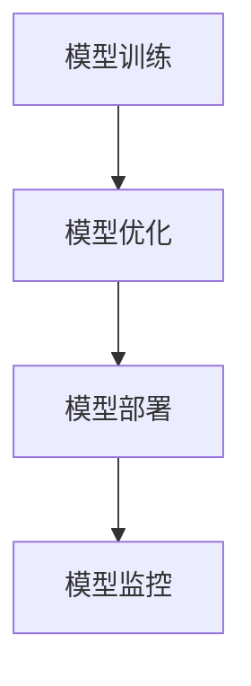

                 

# 机器学习模型部署：从训练到生产

> 关键词：模型部署, 模型训练, 生产环境, 代码管理, 自动机器学习, 持续集成和持续部署(CI/CD)

## 1. 背景介绍

### 1.1 问题由来
在人工智能(AI)和大数据时代，机器学习模型已经广泛应用于各个行业，包括金融、医疗、交通、零售等。然而，将一个经过训练的模型从训练环境部署到生产环境，却是一个复杂且关键的过程。部署环节的质量和效率，直接影响到模型的实际应用效果和业务收益。

### 1.2 问题核心关键点
模型部署的核心关键点包括：
- 模型训练的自动化和可复现性：确保模型训练过程的稳定性和可重复性，避免由于人为疏忽导致模型质量下降。
- 模型服务的性能优化：优化模型的推理速度和资源消耗，确保在生产环境中能够高效运行。
- 模型的可靠性和稳定性：保证模型在生产环境中的准确性和鲁棒性，避免由于环境变化导致模型失效。
- 模型的维护和管理：建立完善的模型监控、更新和废弃机制，确保模型的长期可用性。

这些问题亟需系统的解决方案，而本文将从模型部署的全流程出发，系统介绍机器学习模型的训练和部署方法。

## 2. 核心概念与联系

### 2.1 核心概念概述

为更好地理解模型部署的方法，本节将介绍几个密切相关的核心概念：

- 机器学习模型：通过训练获取的模型，可以用于预测、分类、回归等任务。模型训练的过程一般分为训练集、验证集和测试集，使用交叉验证等技术提高模型泛化能力。

- 模型训练：通过对训练集进行迭代优化，调整模型参数，使得模型能够最好地拟合训练数据。常用的优化算法包括随机梯度下降(SGD)、Adam等。

- 模型部署：将训练好的模型部署到生产环境，使其能够接受输入数据，并输出结果。通常分为模型存储、模型加载、模型推理等步骤。

- 模型优化：在模型训练和部署过程中，优化模型的性能和效率，如超参数调优、模型压缩、模型剪枝等。

- 模型监控：实时监控模型在生产环境中的表现，及时发现并修复模型故障，确保模型稳定运行。

这些核心概念之间的逻辑关系可以通过以下Mermaid流程图来展示：



这个流程图展示了大模型训练、优化、部署和监控的全流程。

## 3. 核心算法原理 & 具体操作步骤
### 3.1 算法原理概述

模型部署的过程大致可以分为以下几步：

- 数据准备：收集、清洗、标注数据，将其分为训练集、验证集和测试集。
- 模型训练：使用训练集训练模型，并通过验证集监控模型性能，调整超参数。
- 模型优化：对模型进行参数剪枝、量化、压缩等优化，提高推理效率。
- 模型部署：将优化后的模型保存到稳定存储，加载并部署到生产环境。
- 模型监控：在生产环境实时监控模型表现，进行异常检测和修复。

这一过程要求高度自动化和规范化，以确保模型质量、性能和可用性。

### 3.2 算法步骤详解

**Step 1: 数据准备**

数据准备是模型部署的第一步，以下是详细的操作步骤：

1. **数据收集与预处理**：
   - 从各种数据源收集数据，如公开数据集、内部数据等。
   - 清洗数据，处理缺失值、异常值等。
   - 数据标注：根据任务需求，对数据进行人工标注，如分类任务需要标签，回归任务需要目标值。

2. **数据划分**：
   - 将数据划分为训练集、验证集和测试集。
   - 通常采用7:2:1的比例划分，即70%为训练集，20%为验证集，10%为测试集。
   - 在划分数据集时，需要保证各集之间的独立性和分布一致性。

**Step 2: 模型训练**

模型训练是将数据转化为模型参数的过程，以下是详细步骤：

1. **选择模型与框架**：
   - 根据任务需求选择合适的模型结构，如线性回归、卷积神经网络(CNN)、循环神经网络(RNN)等。
   - 选择合适的深度学习框架，如TensorFlow、PyTorch等。

2. **编写训练代码**：
   - 定义损失函数、优化器、学习率等超参数。
   - 实现数据迭代器，将数据批处理、数据增强等技术应用到模型训练中。
   - 监控训练进度，记录训练日志。

3. **模型优化**：
   - 使用交叉验证等技术调整超参数，确保模型泛化能力。
   - 使用正则化技术，如L2正则、Dropout等，避免过拟合。
   - 使用数据增强技术，如随机裁剪、旋转等，提高模型鲁棒性。

**Step 3: 模型优化**

模型优化是提高模型性能和效率的关键步骤，以下是详细步骤：

1. **模型压缩**：
   - 使用模型剪枝、量化等技术减少模型参数量，降低内存占用和计算成本。
   - 使用Knowledge Distillation等方法将大型模型参数传递给小型模型。

2. **模型量化**：
   - 将模型参数从浮点数转换为定点数，减少内存占用和计算成本。
   - 使用TensorRT等工具优化模型推理速度。

3. **模型加速**：
   - 使用GPU、TPU等硬件加速，提升模型推理速度。
   - 使用模型并行等技术，将大模型拆分为多个小模型并行计算。

**Step 4: 模型部署**

模型部署是将训练好的模型部署到生产环境的过程，以下是详细步骤：

1. **选择部署平台**：
   - 选择合适的云计算平台，如AWS、阿里云、华为云等。
   - 选择合适的容器技术，如Docker、Kubernetes等。

2. **模型保存与加载**：
   - 使用Pickle、TensorFlow SavedModel、ONNX等格式保存模型。
   - 使用模型服务器或框架加载模型，如TensorFlow Serving、TorchServe等。

3. **模型推理**：
   - 实现模型推理代码，将输入数据转化为模型需要的格式，调用模型推理接口。
   - 处理模型输出，将其转化为业务可用的格式。

**Step 5: 模型监控**

模型监控是确保模型稳定运行的关键步骤，以下是详细步骤：

1. **设置监控指标**：
   - 根据业务需求，设置模型监控指标，如准确率、召回率、延迟时间等。
   - 使用A/B测试等技术，评估模型性能变化。

2. **实时监控与告警**：
   - 使用日志记录、监控工具，实时监控模型表现。
   - 设置异常告警机制，及时发现并修复模型故障。

3. **定期评估与更新**：
   - 定期评估模型性能，根据数据变化和业务需求调整模型参数。
   - 定期备份模型，以应对模型故障和更新。

### 3.3 算法优缺点

模型部署的过程具有以下优点：

1. 自动化：模型训练、优化、部署和监控全流程自动化，减少人为干预和错误。
2. 可复现性：通过版本控制和代码复现，确保模型训练和部署的一致性。
3. 性能优化：通过模型压缩、量化、加速等技术，提高模型推理效率。
4. 稳定性和可靠性：通过实时监控和异常告警，确保模型在生产环境中的稳定性和可靠性。

同时，该过程也存在一定的局限性：

1. 对资源需求高：模型训练和优化过程需要高性能计算资源，成本较高。
2. 模型部署复杂：模型部署过程需要多方面协调，可能涉及多个系统和服务。
3. 监控难度大：模型监控需要实时数据采集和分析，需要较强的技术能力。

尽管存在这些局限性，但整体而言，模型部署的过程对于确保模型质量和业务收益具有重要意义。

### 3.4 算法应用领域

模型部署的方法已经广泛应用于各个行业，包括但不限于：

- 金融领域：用于信用评分、风险评估、欺诈检测等任务。
- 医疗领域：用于疾病诊断、基因预测、医学影像分析等任务。
- 零售领域：用于客户推荐、库存管理、价格优化等任务。
- 交通领域：用于交通预测、车辆调度、导航等任务。
- 智能制造领域：用于设备监控、质量控制、生产优化等任务。

随着AI技术的不断进步，模型部署方法在更多领域得到应用，为各行各业带来了新的变革。

## 4. 数学模型和公式 & 详细讲解  
### 4.1 数学模型构建

本节将使用数学语言对模型部署过程进行更加严格的刻画。

记模型为 $M_{\theta}(x)$，其中 $x$ 为输入数据，$\theta$ 为模型参数。模型的训练目标为最小化损失函数 $\mathcal{L}(\theta)$：

$$
\mathcal{L}(\theta) = \frac{1}{N} \sum_{i=1}^N \ell(M_{\theta}(x_i), y_i)
$$

其中 $y_i$ 为真实标签，$\ell$ 为损失函数，如均方误差、交叉熵等。

训练过程中，通过反向传播算法计算梯度 $\frac{\partial \mathcal{L}(\theta)}{\partial \theta}$，使用优化算法更新参数 $\theta$：

$$
\theta \leftarrow \theta - \eta \frac{\partial \mathcal{L}(\theta)}{\partial \theta}
$$

其中 $\eta$ 为学习率。

### 4.2 公式推导过程

以下我们以二分类任务为例，推导交叉熵损失函数及其梯度的计算公式。

假设模型 $M_{\theta}(x)$ 在输入 $x$ 上的输出为 $\hat{y}=M_{\theta}(x) \in [0,1]$，表示样本属于正类的概率。真实标签 $y \in \{0,1\}$。则二分类交叉熵损失函数定义为：

$$
\ell(M_{\theta}(x),y) = -[y\log \hat{y} + (1-y)\log (1-\hat{y})]
$$

将其代入经验风险公式，得：

$$
\mathcal{L}(\theta) = -\frac{1}{N}\sum_{i=1}^N [y_i\log M_{\theta}(x_i)+(1-y_i)\log(1-M_{\theta}(x_i))]
$$

根据链式法则，损失函数对参数 $\theta_k$ 的梯度为：

$$
\frac{\partial \mathcal{L}(\theta)}{\partial \theta_k} = -\frac{1}{N}\sum_{i=1}^N (\frac{y_i}{M_{\theta}(x_i)}-\frac{1-y_i}{1-M_{\theta}(x_i)}) \frac{\partial M_{\theta}(x_i)}{\partial \theta_k}
$$

其中 $\frac{\partial M_{\theta}(x_i)}{\partial \theta_k}$ 可进一步递归展开，利用自动微分技术完成计算。

## 5. 项目实践：代码实例和详细解释说明
### 5.1 开发环境搭建

在进行模型部署实践前，我们需要准备好开发环境。以下是使用Python进行TensorFlow开发的环境配置流程：

1. 安装Anaconda：从官网下载并安装Anaconda，用于创建独立的Python环境。

2. 创建并激活虚拟环境：
```bash
conda create -n tf-env python=3.8 
conda activate tf-env
```

3. 安装TensorFlow：根据CUDA版本，从官网获取对应的安装命令。例如：
```bash
conda install tensorflow -c tensorflow
```

4. 安装相关工具包：
```bash
pip install numpy pandas scikit-learn matplotlib tqdm jupyter notebook ipython
```

完成上述步骤后，即可在`tf-env`环境中开始模型部署实践。

### 5.2 源代码详细实现

下面我以二分类模型为例，给出使用TensorFlow对模型进行训练、优化和部署的PyTorch代码实现。

首先，定义模型和损失函数：

```python
import tensorflow as tf
from tensorflow.keras import layers, models

class Model(tf.keras.Model):
    def __init__(self):
        super(Model, self).__init__()
        self.dense1 = layers.Dense(64, activation='relu')
        self.dense2 = layers.Dense(1, activation='sigmoid')

    def call(self, inputs):
        x = self.dense1(inputs)
        x = self.dense2(x)
        return x

model = Model()

loss_fn = tf.keras.losses.BinaryCrossentropy()

# 编译模型，设置优化器和评估指标
model.compile(optimizer=tf.keras.optimizers.Adam(), loss=loss_fn, metrics=['accuracy'])
```

然后，定义训练和评估函数：

```python
import numpy as np
import pandas as pd
from sklearn.model_selection import train_test_split

def load_data():
    df = pd.read_csv('data.csv')
    X = df[['feature1', 'feature2', 'feature3']]
    y = df['label']
    return train_test_split(X, y, test_size=0.2, random_state=42)

def train_model(model, train_X, train_y, val_X, val_y, epochs=10, batch_size=32):
    history = model.fit(train_X, train_y, epochs=epochs, batch_size=batch_size, validation_data=(val_X, val_y))
    return history

def evaluate_model(model, test_X, test_y):
    loss, acc = model.evaluate(test_X, test_y)
    return loss, acc
```

接着，启动训练流程并在测试集上评估：

```python
train_X, val_X, train_y, val_y = load_data()
train_model(model, train_X, train_y, val_X, val_y)
test_X, test_y = load_data()
loss, acc = evaluate_model(model, test_X, test_y)
print(f'Test Loss: {loss:.4f}, Test Accuracy: {acc:.4f}')
```

以上就是使用TensorFlow对二分类模型进行训练、优化和部署的完整代码实现。可以看到，TensorFlow提供的高级API使得模型训练和优化变得非常简单。

### 5.3 代码解读与分析

让我们再详细解读一下关键代码的实现细节：

**Model类定义**：
- `__init__`方法：定义模型结构，包括两个全连接层。
- `call`方法：定义模型前向传播过程。

**train_model函数**：
- 使用`fit`方法训练模型，设置训练集、验证集、迭代次数和批次大小。
- 返回训练历史对象，用于监控训练过程。

**evaluate_model函数**：
- 使用`evaluate`方法在测试集上评估模型性能，输出损失和准确率。

**训练流程**：
- 调用`load_data`函数加载数据集，划分训练集和验证集。
- 调用`train_model`函数训练模型，输出训练历史。
- 调用`evaluate_model`函数在测试集上评估模型性能，输出结果。

可以看到，TensorFlow提供的高级API极大地简化了模型训练和优化的过程，使得开发者可以更加专注于模型设计。

当然，工业级的系统实现还需考虑更多因素，如模型的保存和部署、超参数的自动搜索、更灵活的任务适配层等。但核心的模型训练和优化过程基本与此类似。

## 6. 实际应用场景
### 6.1 智能客服系统

基于TensorFlow的模型部署方法，可以广泛应用于智能客服系统的构建。传统客服往往需要配备大量人力，高峰期响应缓慢，且一致性和专业性难以保证。而使用部署好的模型，可以7x24小时不间断服务，快速响应客户咨询，用自然流畅的语言解答各类常见问题。

在技术实现上，可以收集企业内部的历史客服对话记录，将问题和最佳答复构建成监督数据，在此基础上对预训练模型进行微调。微调后的模型能够自动理解用户意图，匹配最合适的答案模板进行回复。对于客户提出的新问题，还可以接入检索系统实时搜索相关内容，动态组织生成回答。如此构建的智能客服系统，能大幅提升客户咨询体验和问题解决效率。

### 6.2 金融舆情监测

金融机构需要实时监测市场舆论动向，以便及时应对负面信息传播，规避金融风险。传统的人工监测方式成本高、效率低，难以应对网络时代海量信息爆发的挑战。基于TensorFlow的模型部署方法，可以为金融舆情监测提供新的解决方案。

具体而言，可以收集金融领域相关的新闻、报道、评论等文本数据，并对其进行主题标注和情感标注。在此基础上对预训练语言模型进行微调，使其能够自动判断文本属于何种主题，情感倾向是正面、中性还是负面。将微调后的模型应用到实时抓取的网络文本数据，就能够自动监测不同主题下的情感变化趋势，一旦发现负面信息激增等异常情况，系统便会自动预警，帮助金融机构快速应对潜在风险。

### 6.3 个性化推荐系统

当前的推荐系统往往只依赖用户的历史行为数据进行物品推荐，无法深入理解用户的真实兴趣偏好。基于TensorFlow的模型部署方法，可以更好地挖掘用户行为背后的语义信息，从而提供更精准、多样的推荐内容。

在实践中，可以收集用户浏览、点击、评论、分享等行为数据，提取和用户交互的物品标题、描述、标签等文本内容。将文本内容作为模型输入，用户的后续行为（如是否点击、购买等）作为监督信号，在此基础上微调预训练语言模型。微调后的模型能够从文本内容中准确把握用户的兴趣点。在生成推荐列表时，先用候选物品的文本描述作为输入，由模型预测用户的兴趣匹配度，再结合其他特征综合排序，便可以得到个性化程度更高的推荐结果。

### 6.4 未来应用展望

随着TensorFlow和其他AI技术的不断发展，模型部署方法将在更多领域得到应用，为传统行业带来变革性影响。

在智慧医疗领域，基于TensorFlow的模型部署方法，可以用于医疗问答、病历分析、药物研发等任务。通过模型优化和实时监控，提升医疗服务的智能化水平，辅助医生诊疗，加速新药开发进程。

在智能教育领域，基于TensorFlow的模型部署方法，可以用于作业批改、学情分析、知识推荐等方面，因材施教，促进教育公平，提高教学质量。

在智慧城市治理中，基于TensorFlow的模型部署方法，可以用于城市事件监测、舆情分析、应急指挥等环节，提高城市管理的自动化和智能化水平，构建更安全、高效的未来城市。

此外，在企业生产、社会治理、文娱传媒等众多领域，基于TensorFlow的模型部署方法也将不断涌现，为NLP技术带来了全新的突破。随着AI技术的日益成熟，模型部署方法还将与其他人工智能技术进行更深入的融合，如知识表示、因果推理、强化学习等，多路径协同发力，共同推动自然语言理解和智能交互系统的进步。

## 7. 工具和资源推荐
### 7.1 学习资源推荐

为了帮助开发者系统掌握TensorFlow和模型部署的理论基础和实践技巧，这里推荐一些优质的学习资源：

1. TensorFlow官方文档：提供了丰富的API参考和示例代码，是学习TensorFlow的必备资料。
2. TensorFlow中文社区：提供中文版的TensorFlow教程和示例，适合国内开发者学习。
3. Deep Learning with TensorFlow 2 and Keras书籍：由TensorFlow开发者撰写，详细介绍了TensorFlow 2和Keras的使用方法。
4. TensorFlow实战项目：包含多个TensorFlow实战项目案例，适合实践学习。
5. Kaggle数据集：提供了大量开源数据集，可以用于模型训练和验证。

通过对这些资源的学习实践，相信你一定能够快速掌握TensorFlow和模型部署的精髓，并用于解决实际的NLP问题。

### 7.2 开发工具推荐

高效的开发离不开优秀的工具支持。以下是几款用于TensorFlow模型部署开发的常用工具：

1. TensorFlow：基于Python的开源深度学习框架，灵活动态的计算图，适合快速迭代研究。
2. TensorFlow Serving：TensorFlow的模型推理服务，可以部署到Kubernetes等容器中，支持高可用性、水平扩展。
3. TensorRT：NVIDIA开发的模型量化工具，将模型转换为定点模型，提升推理速度。
4. ONNX：开放神经网络交换格式，可以将TensorFlow模型导出为ONNX格式，方便在不同平台部署。
5. Flask：轻量级的Web框架，可以用于构建简单的Web服务，方便模型部署和调用。
6. Docker：轻量级的容器技术，可以方便地部署和管理TensorFlow模型。

合理利用这些工具，可以显著提升TensorFlow模型部署的开发效率，加快创新迭代的步伐。

### 7.3 相关论文推荐

TensorFlow和模型部署技术的发展源于学界的持续研究。以下是几篇奠基性的相关论文，推荐阅读：

1. TensorFlow: A System for Large-Scale Machine Learning：提出TensorFlow框架，支持分布式计算和动态计算图。
2. Google's Guide to TensorFlow Serving: Machine Learning Model Server：介绍TensorFlow Serving的部署和管理方法。
3. A Survey on Model Compression: Principles, Techniques, and Trends：综述了模型压缩技术的现状和趋势。
4. TensorFlow Extended: TensorFlow's Transition to Distribution Alike Programming：介绍TensorFlow Extended的分布式训练和管理方法。
5. TensorRT: A High-Performance Deep Neural Network Inference Optimizer and Platform：介绍TensorRT模型量化工具的使用方法。

这些论文代表了大模型部署技术的发展脉络。通过学习这些前沿成果，可以帮助研究者把握学科前进方向，激发更多的创新灵感。

## 8. 总结：未来发展趋势与挑战

### 8.1 总结

本文对基于TensorFlow的机器学习模型部署方法进行了全面系统的介绍。首先阐述了模型部署的全流程，从数据准备、模型训练、优化、部署到监控，系统介绍了每个步骤的关键技术和操作步骤。其次，从理论到实践，详细讲解了模型部署的数学原理和关键步骤，给出了模型部署任务开发的完整代码实例。同时，本文还广泛探讨了模型部署方法在智能客服、金融舆情、个性化推荐等多个行业领域的应用前景，展示了模型部署范式的巨大潜力。此外，本文精选了模型部署技术的各类学习资源，力求为读者提供全方位的技术指引。

通过本文的系统梳理，可以看到，基于TensorFlow的模型部署方法正在成为NLP领域的重要范式，极大地拓展了模型的应用边界，催生了更多的落地场景。受益于TensorFlow的强大工具和丰富的社区支持，模型部署方法在更多领域得到应用，为传统行业带来了新的变革。未来，伴随TensorFlow和其他AI技术的持续演进，模型部署技术还将与其他AI技术进行更深入的融合，共同推动自然语言理解和智能交互系统的进步。

### 8.2 未来发展趋势

展望未来，TensorFlow模型部署技术将呈现以下几个发展趋势：

1. 自动化程度更高：模型的训练、优化、部署和监控全流程自动化，减少人为干预和错误。
2. 模型压缩与量化技术更先进：通过更高效的模型压缩和量化技术，提高模型的推理速度和资源利用率。
3. 更强大的实时监控与告警机制：建立更加实时和精准的模型监控与告警机制，确保模型在生产环境中的稳定性和可靠性。
4. 多模型协同训练与部署：支持多模型协同训练和部署，提高系统的鲁棒性和扩展性。
5. 更灵活的超参数调优方法：开发更灵活和高效的超参数调优方法，优化模型性能和效率。
6. 模型管理与自动化：引入更完善的模型管理与自动化技术，如版本控制、模型仓库、自动回滚等，提高模型管理的便捷性和可控性。

以上趋势凸显了TensorFlow模型部署技术的广阔前景。这些方向的探索发展，必将进一步提升模型训练和部署的效率和效果，为NLP技术在垂直行业的规模化落地提供更多可能性。

### 8.3 面临的挑战

尽管TensorFlow模型部署技术已经取得了显著成果，但在迈向更加智能化、普适化应用的过程中，仍面临诸多挑战：

1. 数据准备和预处理：数据准备和预处理是模型部署的第一步，耗时耗力，容易出现数据质量和分布偏差问题。
2. 超参数调优复杂：超参数调优是模型优化的关键，但超参数选择和调优过程复杂，容易陷入局部最优。
3. 模型推理速度慢：大规模模型的推理速度慢，对资源需求高，容易影响模型部署和服务的响应速度。
4. 模型鲁棒性和泛化能力：模型在生产环境中的鲁棒性和泛化能力需要不断优化，避免过拟合和灾难性遗忘。
5. 模型监控和维护：模型监控和维护需要实时数据采集和分析，需要较强的技术能力，容易引发监控盲点。

尽管存在这些挑战，但整体而言，TensorFlow模型部署方法在确保模型质量和业务收益方面具有重要意义。研究者需要不断探索和改进，以应对这些挑战，提升模型部署的效果。

### 8.4 研究展望

未来，研究者需要在以下几个方面寻求新的突破：

1. 探索更高效的模型训练和优化方法：开发更高效的模型训练和优化算法，如自适应优化算法、分布式训练等，提高模型训练和优化的效率。
2. 引入更先进的模型压缩和量化技术：开发更先进的模型压缩和量化算法，如基于知识蒸馏的压缩方法，提高模型的推理速度和资源利用率。
3. 引入更灵活的模型部署和调度机制：引入更灵活的模型部署和调度机制，如自动扩缩容、负载均衡等，提高系统的可扩展性和可用性。
4. 引入更全面的模型监控和分析工具：引入更全面的模型监控和分析工具，如可视化仪表盘、自动告警系统等，提高模型的监控和管理能力。
5. 引入更高效的超参数调优方法：引入更高效的超参数调优方法，如贝叶斯优化、超参数自动调优算法等，提高超参数调优的效率和效果。
6. 引入更强大的模型解释和分析工具：引入更强大的模型解释和分析工具，如可解释性模型、因果分析等，提高模型的可解释性和透明性。

这些研究方向的探索，必将引领TensorFlow模型部署技术迈向更高的台阶，为构建安全、可靠、可解释、可控的智能系统提供更多可能性。面向未来，TensorFlow模型部署技术还需要与其他人工智能技术进行更深入的融合，如知识表示、因果推理、强化学习等，多路径协同发力，共同推动自然语言理解和智能交互系统的进步。只有勇于创新、敢于突破，才能不断拓展语言模型的边界，让智能技术更好地造福人类社会。

## 9. 附录：常见问题与解答

**Q1：模型部署过程中如何避免数据泄露？**

A: 模型部署过程中，数据泄露是一个重要问题，主要可以通过以下方法避免：
1. 数据去标识化：在数据预处理过程中，对敏感数据进行去标识化处理，如数据匿名化、数据屏蔽等。
2. 加密传输和存储：使用加密算法对数据进行传输和存储，确保数据在传输和存储过程中不被泄露。
3. 模型推理控制：在模型推理过程中，对输入数据进行过滤和限制，确保模型只接受特定格式和范围的数据。
4. 访问控制：建立严格的访问控制机制，确保只有授权人员和系统可以访问敏感数据。
5. 监控和审计：实时监控数据访问和使用情况，记录审计日志，及时发现和修复数据泄露问题。

这些方法可以综合应用，构建多重防线，避免数据泄露风险。

**Q2：模型部署过程中如何进行超参数调优？**

A: 模型部署过程中，超参数调优是优化模型性能的关键步骤，以下是详细步骤：
1. 选择合适的超参数范围：根据任务需求和模型结构，选择合适的超参数范围，如学习率、批次大小、迭代次数等。
2. 使用网格搜索或随机搜索：使用网格搜索或随机搜索等技术，遍历超参数组合，寻找最优超参数组合。
3. 使用贝叶斯优化：使用贝叶斯优化等高级算法，根据训练结果实时调整超参数，提高超参数调优的效率和效果。
4. 使用自动机器学习工具：使用自动机器学习工具，如AutoKeras、MLflow等，自动进行超参数调优。
5. 监控和反馈：实时监控模型性能，根据监控结果反馈调整超参数，确保模型性能和稳定性。

通过以上方法，可以最大化优化模型性能，提升模型部署的效果。

**Q3：模型部署过程中如何进行模型压缩和量化？**

A: 模型压缩和量化是提高模型推理效率的关键步骤，以下是详细步骤：
1. 模型剪枝：删除模型中冗余的参数，减少模型大小和计算量。
2. 模型量化：将模型参数从浮点数转换为定点数，减少内存占用和计算成本。
3. 模型蒸馏：使用知识蒸馏技术，将大型模型压缩为小型模型，提高推理效率。
4. 使用TensorRT等工具：使用TensorRT等工具，对模型进行优化，提高推理速度和资源利用率。
5. 实验和验证：通过实验和验证，评估模型压缩和量化的效果，选择最优方案。

通过以上方法，可以在保证模型性能的前提下，提升模型推理效率，降低资源消耗。

**Q4：模型部署过程中如何进行实时监控和告警？**

A: 模型部署过程中，实时监控和告警是确保模型稳定运行的关键步骤，以下是详细步骤：
1. 设置监控指标：根据任务需求和业务需求，设置模型监控指标，如模型准确率、推理时间、错误率等。
2. 实时采集数据：实时采集模型输入、输出、推理时间等数据，监控模型表现。
3. 异常检测和告警：使用异常检测算法，如统计异常检测、时序异常检测等，检测模型异常情况，及时发出告警。
4. 监控工具和平台：使用监控工具和平台，如Prometheus、Grafana、Alertmanager等，实现实时监控和告警。
5. 日志记录和审计：记录模型推理日志，进行审计和分析，确保模型推理过程透明和可追溯。

通过以上方法，可以实时监控模型表现，及时发现和修复模型问题，确保模型在生产环境中的稳定性和可靠性。

**Q5：模型部署过程中如何进行自动回滚？**

A: 模型部署过程中，自动回滚是确保系统稳定运行的关键步骤，以下是详细步骤：
1. 版本控制：对模型进行版本控制，记录每个版本的参数和超参数。
2. 回滚策略：设置回滚策略，定义回滚条件和回滚方法，如回滚到上一个版本、回滚到特定版本等。
3. 自动回滚机制：实现自动回滚机制，当模型出现问题时，自动回滚到指定版本。
4. 监控和审计：实时监控模型版本和回滚操作，确保回滚过程透明和可追溯。
5. 测试和验证：对回滚后的模型进行测试和验证，确保模型性能和稳定性。

通过以上方法，可以及时回滚模型，确保系统稳定运行，避免由于模型问题导致系统故障。

---

作者：禅与计算机程序设计艺术 / Zen and the Art of Computer Programming

