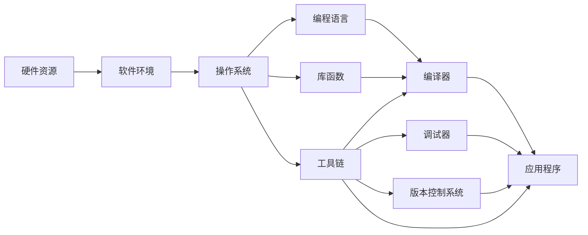

                 

# 树莓派编程：基于 Linux 的单板计算机

## 1. 背景介绍

### 1.1 问题由来
随着物联网和嵌入式系统的发展，越来越多的应用场景需要低成本、功能丰富的嵌入式计算平台。树莓派（Raspberry Pi）作为一款基于 ARM 架构的 Linux 单板计算机，因其低廉的价格、强大的性能和广泛的支持，迅速成为嵌入式开发、教育、物联网等领域的利器。本文将系统介绍树莓派编程的基本概念、核心原理和实践方法，为读者提供全面的技术指引。

### 1.2 问题核心关键点
树莓派编程的核心在于如何高效地利用其硬件资源和软件环境，开发出高效、稳定、可靠的嵌入式应用。本节将从硬件原理、软件环境、编程框架等方面，详细介绍树莓派编程的关键概念和原理。

## 2. 核心概念与联系

### 2.1 核心概念概述

树莓派编程涉及多个核心概念，包括硬件资源、软件环境、操作系统、编程语言、库函数、工具链等。这些概念之间的联系主要体现在：

- **硬件资源**：树莓派配备 ARM 架构的 CPU、内存、存储、网络等硬件资源，是编程的基础。
- **软件环境**：包括 Linux 操作系统、开发工具链、应用程序框架等，提供编程平台和应用支持。
- **操作系统**：基于 Linux 内核，提供进程管理、资源调度、文件系统等功能。
- **编程语言**：包括 C/C++、Python 等主流编程语言，用于编写嵌入式应用程序。
- **库函数**：提供丰富的系统调用和 API，如文件操作、网络通信、图形界面等，方便开发人员高效编写代码。
- **工具链**：包括编译器、调试器、版本控制系统等，支持代码编译、测试、部署等全流程开发。

这些概念共同构成了树莓派编程的基础框架，开发者需要理解它们的内在联系，才能高效地进行开发。

### 2.2 核心概念原理和架构的 Mermaid 流程图



## 3. 核心算法原理 & 具体操作步骤

### 3.1 算法原理概述
树莓派编程的核心算法原理主要涉及嵌入式系统的编程技术和软件开发流程。

- **嵌入式编程技术**：包括系统初始化、中断处理、多任务调度等，需要深入理解硬件时序和操作系统原理。
- **软件开发流程**：包括需求分析、系统设计、编码实现、测试部署等，需要掌握良好的软件开发方法和工具链。

### 3.2 算法步骤详解
树莓派编程的步骤大致可以分为以下几个阶段：

1. **硬件设计与布局**：根据应用需求设计硬件电路，并进行合理的布局和连接。
2. **操作系统安装与配置**：选择适合的操作系统，如 Ubuntu、Debian、Raspbian 等，并进行安装和配置。
3. **编程环境搭建**：安装开发工具链、IDE 集成开发环境、库函数等，搭建编程平台。
4. **应用开发与调试**：编写应用程序代码，并进行测试、调试、部署等。
5. **优化与性能调优**：针对实际应用场景进行优化，提升程序性能和可靠性。

### 3.3 算法优缺点
树莓派编程的优势在于：
- **低成本**：树莓派的硬件价格低廉，适合教育、科研、原型开发等场景。
- **功能丰富**：配备丰富的外围接口，支持摄像头、传感器、音频等。
- **社区支持**：拥有活跃的社区和丰富的开发资源，易于获取帮助和资源。

缺点在于：
- **性能限制**：树莓派的 CPU 性能相对较弱，不适合高负载的实时应用。
- **生态系统不足**：某些应用可能缺乏成熟的库和工具支持。

### 3.4 算法应用领域
树莓派编程广泛应用于以下几个领域：

- **嵌入式开发**：树莓派作为嵌入式平台，广泛用于工业控制、智能家居、物联网等。
- **教育培训**：树莓派因其易用性和低成本，成为计算机科学教育和编程培训的理想平台。
- **科研实验**：树莓派提供了丰富的外围接口和强大的编程环境，适合进行各种科研实验。
- **创客项目**：树莓派支持开源硬件和软件，适合创客社区开展各类创新项目。

## 4. 数学模型和公式 & 详细讲解 & 举例说明

### 4.1 数学模型构建
树莓派编程的数学模型主要涉及嵌入式系统的运行时行为和资源调度。

以树莓派上的中断处理为例，假设 CPU 接收到一个中断请求，其运行时行为可以用以下状态机表示：

1. **中断发生**：当 CPU 收到中断请求时，保存当前状态和上下文信息。
2. **中断处理**：执行中断服务程序，完成特定任务。
3. **恢复上下文**：中断处理完成后，恢复保存的状态和上下文信息。
4. **继续执行**：返回中断前状态，继续执行之前的操作。

### 4.2 公式推导过程
以中断服务程序为例，中断处理的时间可以表示为：

$$
T_{\text{中断}} = T_{\text{中断处理}} + T_{\text{上下文保存}} + T_{\text{上下文恢复}}
$$

其中 $T_{\text{中断处理}}$ 为中断服务程序的执行时间，$T_{\text{上下文保存}}$ 为保存上下文信息的时间，$T_{\text{上下文恢复}}$ 为恢复上下文信息的时间。

### 4.3 案例分析与讲解
以树莓派上的 GPIO 中断为例，分析中断处理的时间开销。假设 GPIO 引脚被设置为输入，当一个外设触发信号时，CPU 进入中断处理流程。中断处理程序需要读取 GPIO 状态、处理数据、修改寄存器等操作，最终恢复上下文，返回中断前状态。

## 5. 项目实践：代码实例和详细解释说明

### 5.1 开发环境搭建
树莓派的开发环境搭建需要以下步骤：

1. 准备树莓派硬件，包括主板、显示器、键盘、鼠标等。
2. 连接树莓派和电脑，通过以太网或 USB 连接。
3. 安装 Ubuntu 操作系统，并进行基本配置。
4. 安装树莓派工具链，包括 GCC、GDB、Make 等。
5. 安装 IDE，如 VS Code、Thonny 等，用于编写和调试代码。

### 5.2 源代码详细实现
以下是一个简单的树莓派 GPIO 中断处理示例代码：

```c
#include <stdio.h>
#include <unistd.h>
#include <fcntl.h>
#include <linux/gpio.h>

#define GPIO_PIN 17  // 树莓派 GPIO 17 引脚

int main() {
    int fd = open("/dev/gpiochip0", O_RDWR);
    ioctl(fd, GPIOSETUP, GPIO_PUD_UP);

    printf("Interrupt enabled.\n");

    int ret = ioctl(fd, GPIOEVENTS, GPIO_PIN);

    while (1) {
        int event;
        ret = read(fd, &event, sizeof(event));
        if (ret < 0) {
            printf("Error reading GPIO event: %s\n", strerror(errno));
            return -1;
        }
        printf("GPIO event: %d\n", event);
    }

    close(fd);
    return 0;
}
```

### 5.3 代码解读与分析
以上代码实现了树莓派 GPIO 17 引脚的中断处理。具体步骤如下：

1. 打开 GPIO 芯片设备文件，进行 GPIO 引脚配置。
2. 设置 GPIO 引脚的上下拉电阻。
3. 使能中断处理，进入无限循环，等待中断事件。
4. 读取中断事件，并输出日志。

### 5.4 运行结果展示
运行上述代码，可以看到树莓派上的 GPIO 引脚被设置为输入，并通过中断处理输出日志。

## 6. 实际应用场景

### 6.1 智能家居
树莓派可以连接各种传感器、执行器，实现智能家居控制。例如，通过红外遥控、网络通信等方式，控制家电、照明、安防等系统。树莓派编程可实现以下功能：

- **语音控制**：通过语音识别模块，识别用户的语音指令，并控制家电系统。
- **环境监测**：通过传感器模块，监测温度、湿度、光照等环境参数，并自动调节。
- **安全监控**：通过摄像头、门磁等设备，实现入侵检测、报警等功能。

### 6.2 物联网
树莓派可以作为物联网节点，实现设备互联和数据采集。例如，通过 Wi-Fi、蓝牙等方式，将树莓派与其他节点连接，构建无线传感器网络。树莓派编程可实现以下功能：

- **数据采集**：通过传感器模块，实时采集环境数据，并上传到云端服务器。
- **设备管理**：通过网络通信，控制设备的开关、亮度、音量等参数。
- **远程控制**：通过移动设备，实现远程控制和监控。

### 6.3 教育培训
树莓派因其低成本和易用性，适合用于计算机科学教育和编程培训。树莓派编程可实现以下功能：

- **编程教学**：通过树莓派提供的丰富的编程接口和示例代码，帮助学生理解和掌握嵌入式编程技术。
- **实验项目**：设计各类实验项目，如机器人控制、游戏开发、数据采集等，提升学生的动手能力和实战经验。
- **项目展示**：利用树莓派的图形界面和网络通信功能，展示学生的编程成果和创新项目。

### 6.4 科研实验
树莓派提供了丰富的外围接口和强大的编程环境，适合进行各种科研实验。树莓派编程可实现以下功能：

- **数据采集**：通过树莓派的 GPIO、SPI、I2C 等接口，实时采集实验数据。
- **数据处理**：利用树莓派的 CPU 和内存资源，对采集的数据进行处理和分析。
- **数据可视化**：通过树莓派的图形界面和网络通信功能，展示实验结果和可视化数据。

## 7. 工具和资源推荐

### 7.1 学习资源推荐
为了帮助开发者掌握树莓派编程，以下是一些优质的学习资源：

1. **官方文档**：树莓派基金会提供的官方文档，详细介绍了树莓派硬件和软件的配置、使用和开发。
2. **Raspberry Pi Wiki**：一个社区维护的 Wiki，提供了丰富的教程、代码示例和问答资源。
3. **《树莓派编程实战》书籍**：介绍了树莓派的硬件原理、软件环境、编程技术和实际应用，是树莓派编程的入门必读书籍。
4. **树莓派编程教程**：提供了丰富的视频教程和实践项目，适合初学者学习。
5. **树莓派编程论坛**：社区成员交流平台，可获取最新的技术资讯和开发资源。

### 7.2 开发工具推荐
以下是几款用于树莓派编程开发的工具：

1. **VS Code**：一款轻量级的 IDE，支持多种编程语言和插件，适合树莓派编程。
2. **Thonny**：一款基于 Python 的 IDE，支持树莓派 Python 编程，提供了可视化编程和调试功能。
3. **GDB**：一款调试工具，支持树莓派 C/C++ 编程，支持远程调试和断点设置。
4. **Make**：一款构建工具，支持树莓派 C/C++ 编程，可实现快速构建和版本控制。
5. **Git**：一款版本控制系统，支持树莓派编程，方便代码管理和团队协作。

### 7.3 相关论文推荐
树莓派编程涉及多个技术领域，以下是几篇经典的研究论文，推荐阅读：

1. **Raspberry Pi Prototype of a Distributed Wireless Sensor Network**：介绍了一个基于树莓派的无线传感器网络原型，讨论了网络设计、数据采集和传输等技术。
2. **Programming Raspberry Pi GPIOs in C**：详细介绍了树莓派 GPIO 编程的 C 语言实现，涵盖 GPIO 配置、中断处理和库函数等技术。
3. **Embedded Linux Programming and Interfacing**：介绍了一本关于嵌入式 Linux 编程的书籍，涵盖了树莓派编程的基本原理和实践方法。
4. **Raspberry Pi for the Raspberry Pi**：介绍了树莓派编程的全面教程，从硬件原理到软件开发，涵盖树莓派编程的各个方面。

## 8. 总结：未来发展趋势与挑战

### 8.1 总结
本文对树莓派编程进行了全面系统的介绍，涵盖了硬件资源、软件环境、编程语言、库函数、工具链等关键概念，并结合实际应用场景，详细讲解了树莓派编程的技术原理和实践方法。通过本文的系统梳理，可以看到，树莓派编程具有广泛的应用前景，可以应用于智能家居、物联网、教育培训、科研实验等多个领域。

### 8.2 未来发展趋势
展望未来，树莓派编程将呈现以下几个发展趋势：

1. **硬件升级**：树莓派硬件性能和功能将持续提升，支持更多的外围接口和更高性能的 CPU。
2. **软件生态**：树莓派编程的生态系统将更加完善，提供更多的开发工具和库函数，支持更多编程语言。
3. **应用场景**：树莓派编程将拓展到更多应用场景，如智能制造、智慧农业、智慧城市等。
4. **教育培训**：树莓派因其低成本和易用性，将继续成为计算机科学教育和编程培训的重要平台。
5. **科研实验**：树莓派提供了丰富的外围接口和强大的编程环境，适合进行更多科研实验和创新项目。

### 8.3 面临的挑战
尽管树莓派编程已经取得了显著进展，但在迈向更广泛应用的过程中，仍面临以下挑战：

1. **性能瓶颈**：树莓派的 CPU 性能相对较弱，不适合高负载的实时应用。
2. **软件生态**：某些应用可能缺乏成熟的库和工具支持。
3. **硬件兼容性**：树莓派硬件多样，需要考虑兼容性问题。
4. **开发复杂性**：树莓派编程涉及多方面的知识，需要具备一定的硬件和软件基础。
5. **社区维护**：树莓派社区更新迭代快，需要不断跟进最新的技术进展。

### 8.4 研究展望
针对这些挑战，未来的研究需要在以下几个方面寻求新的突破：

1. **硬件优化**：优化树莓派硬件设计，提升性能和功耗。
2. **软件优化**：提升树莓派编程的开发效率和软件生态。
3. **应用拓展**：拓展树莓派编程的应用场景，提升其实用性和市场竞争力。
4. **教育培训**：推动树莓派编程在教育培训领域的应用，提升学生的实践能力和技术水平。
5. **社区发展**：加强树莓派社区的建设和维护，吸引更多的开发者和用户参与。

## 9. 附录：常见问题与解答

**Q1: 树莓派编程需要注意哪些问题？**

A: 树莓派编程需要注意以下问题：

1. **硬件兼容性**：不同版本的树莓派硬件可能会有兼容性问题，需要进行测试和调试。
2. **驱动程序安装**：树莓派编程涉及各种外围设备的驱动程序，需要进行正确安装和配置。
3. **文件系统管理**：树莓派编程涉及文件系统的管理和优化，需要进行合理的文件布局和存储。
4. **代码调试**：树莓派编程需要调试工具和调试技巧，需要进行全面的代码测试和调试。
5. **性能优化**：树莓派编程需要优化程序性能，需要进行代码优化和资源调度。

**Q2: 树莓派编程如何提高性能？**

A: 树莓派编程可以采用以下方法提高性能：

1. **硬件升级**：使用更高性能的 CPU、更大的内存和存储。
2. **软件优化**：使用更高效的编程语言和算法，优化代码实现。
3. **并发编程**：使用多线程或多进程技术，提升程序并发能力。
4. **资源管理**：合理分配 CPU、内存、存储等资源，避免资源浪费。
5. **缓存优化**：使用缓存技术，减少数据读写次数，提高程序效率。

**Q3: 树莓派编程有哪些常见的应用场景？**

A: 树莓派编程常见的应用场景包括：

1. **智能家居**：树莓派可以连接各种传感器、执行器，实现智能家居控制。
2. **物联网**：树莓派可以作为物联网节点，实现设备互联和数据采集。
3. **教育培训**：树莓派因其低成本和易用性，适合用于计算机科学教育和编程培训。
4. **科研实验**：树莓派提供了丰富的外围接口和强大的编程环境，适合进行各种科研实验。
5. **创客项目**：树莓派支持开源硬件和软件，适合创客社区开展各类创新项目。

**Q4: 树莓派编程如何入门？**

A: 树莓派编程入门可以参考以下步骤：

1. **硬件准备**：购买树莓派主板、显示器、键盘、鼠标等硬件设备。
2. **系统安装**：安装树莓派操作系统，如 Ubuntu、Debian、Raspbian 等。
3. **工具安装**：安装树莓派工具链、IDE、调试器等开发工具。
4. **示例代码**：参考官方文档和社区资源，学习示例代码和开发实践。
5. **项目实践**：动手实践各类项目，如传感器采集、嵌入式编程、图形界面开发等。

---

作者：禅与计算机程序设计艺术 / Zen and the Art of Computer Programming

