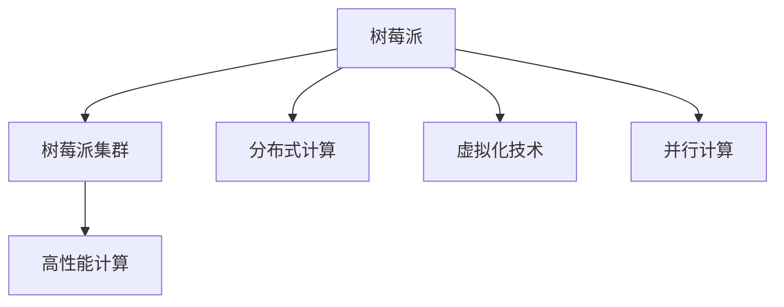

                 

# 树莓派集群：构建低成本高性能计算平台

在硬件资源日益紧张的当下，利用廉价且广泛可用的硬件设备构建高性能计算集群，成为了各领域科研与生产中的热门话题。树莓派（Raspberry Pi）作为一款功能强大且价格亲民的嵌入式计算机，自然成为了低成本高性能计算平台的首选。本文将全面介绍如何构建和优化树莓派集群，帮助读者掌握低成本、高性能计算平台的搭建技巧，并深入了解其在高性能计算、人工智能等领域的应用潜力。

## 1. 背景介绍

### 1.1 问题由来

当前，高性能计算（High Performance Computing, HPC）已经成为了众多领域（如科学研究、金融分析、数据分析、人工智能等）的核心需求。然而，构建高性能计算集群通常需要大量资金投入，并依赖于昂贵的硬件设备，如高性能服务器和工作站。为了打破这种现状，研究者和工程师们一直在探索如何通过更经济的方式构建高性能计算平台。

在这样的背景下，树莓派因其低廉的价格和强大的计算能力，逐渐成为了构建低成本高性能计算集群的热门选择。树莓派最初由英国Cambridge University开发，旨在推广嵌入式计算技术，经过不断升级和优化，目前已经具备了高性能计算、物联网（IoT）、嵌入式开发等多种应用能力。

### 1.2 问题核心关键点

构建树莓派集群的核心在于如何合理配置和利用多台树莓派设备，最大化其计算能力和网络带宽，同时保证系统的稳定性和可靠性。主要的技术挑战包括：

- **多设备管理**：如何将多台树莓派设备进行有效的管理和调度，避免资源浪费和冲突。
- **网络优化**：如何保证集群内部设备之间的稳定通信和数据传输，尤其是在大型数据处理任务中。
- **负载均衡**：如何将任务合理分配到集群中的各个设备，避免某台设备负载过重而影响整体性能。

## 2. 核心概念与联系

### 2.1 核心概念概述

为了更好地理解树莓派集群的构建，本节将介绍几个关键概念：

- **树莓派（Raspberry Pi）**：一种开源的、低成本的嵌入式计算平台，支持多种操作系统，包括Linux、Raspberry Pi OS等。
- **树莓派集群**：由多台树莓派设备通过网络连接构成的高性能计算平台，可以协同完成复杂的计算任务。
- **分布式计算**：通过将计算任务分散到多个计算节点上，协同完成大任务，提高计算效率。
- **虚拟化技术**：通过软件模拟出多个虚拟机（VM），使单台树莓派设备可以同时运行多个操作系统实例，最大化资源利用率。
- **并行计算**：利用多台设备同时执行不同任务，加速计算过程。

这些概念之间的逻辑关系可以通过以下Mermaid流程图来展示：



这个流程图展示了大语言模型的核心概念及其之间的关系：

1. 树莓派通过虚拟化技术实现多系统协同计算。
2. 分布式计算和并行计算提高了计算效率和可靠性。
3. 树莓派集群将树莓派的计算能力进行集中，以高效处理高性能计算任务。

这些概念共同构成了树莓派集群的搭建基础，使其能够在各种应用场景中发挥强大的计算能力。

## 3. 核心算法原理 & 具体操作步骤
### 3.1 算法原理概述

树莓派集群构建的核心算法原理基于分布式计算和并行计算技术。其基本思想是将计算任务分解为多个子任务，分配给集群中的不同节点进行并行计算，最后将结果合并，得到最终结果。

以数据处理为例，树莓派集群在接收到大数据处理任务后，会将数据分割成多个数据块，分配给不同的树莓派节点进行处理。每个节点在本地完成计算后，将结果发送给主节点，主节点将各个节点的结果汇总，输出最终结果。

### 3.2 算法步骤详解

构建树莓派集群的主要步骤如下：

**Step 1: 配置树莓派设备**

- 准备多台树莓派设备，确保硬件配置符合需求。通常需要考虑处理器核心数、内存大小、存储容量等因素。
- 安装操作系统和必要的软件包，如虚拟机管理工具、网络配置工具等。

**Step 2: 搭建网络**

- 将多台树莓派设备通过网络连接起来，可以使用以太网、Wi-Fi等方式。
- 配置网络参数，确保所有设备均能够正常访问网络。

**Step 3: 部署虚拟机**

- 使用虚拟化技术（如VirtualBox、VMware等）在树莓派设备上部署虚拟机。
- 根据任务需求配置虚拟机资源，如CPU核心数、内存大小、存储容量等。

**Step 4: 部署任务**

- 在虚拟机上部署计算任务，如数据处理、科学计算、人工智能等。
- 配置任务运行参数，确保任务能够平稳运行。

**Step 5: 监控和调度**

- 使用监控工具（如Nagios、Zabbix等）实时监控集群运行状态。
- 使用调度工具（如Slurm、Docker Swarm等）实现任务自动化调度和管理。

### 3.3 算法优缺点

构建树莓派集群的主要优点包括：

- **成本低**：相比于传统的服务器和工作站，树莓派设备价格便宜，能显著降低构建高性能计算平台的成本。
- **灵活性高**：可以根据实际需求灵活配置集群规模和资源分配，易于扩展和调整。
- **可维护性好**：设备数量少，维护相对简单。

但同时，树莓派集群也存在以下缺点：

- **性能有限**：单台树莓派设备的计算能力和存储能力有限，处理大规模数据或复杂任务时可能存在瓶颈。
- **网络性能受限**：多台设备之间通信可能会受到网络带宽和时延的限制。
- **稳定性问题**：单台设备的故障可能导致整个集群无法正常工作。

## 4. 数学模型和公式 & 详细讲解 & 举例说明

### 4.1 数学模型构建

树莓派集群的构建过程涉及多个子任务，可以抽象为一个数学模型。假设集群中总共有$N$台树莓派设备，每台设备上运行$M$个虚拟机，每个虚拟机上运行的任务数为$T$。集群总体的计算能力为$C$，网络带宽为$B$。模型的目标是最大化计算效率和资源利用率。

### 4.2 公式推导过程

在数学模型中，每个子任务的计算时间为$\frac{C}{T}$，数据传输时间为$\frac{B}{T}$。整个集群的计算时间为$N \times \frac{C}{T}$，数据传输时间为$N \times \frac{B}{T}$。集群的总运行时间为计算时间和数据传输时间之和：

$$
T_{\text{total}} = N \times \frac{C}{T} + N \times \frac{B}{T}
$$

为了最大化集群性能，需要找到最优的任务分配策略。假设每个任务需要$x$台树莓派设备，则集群总体计算能力为$N \times M \times x \times C$。通过优化算法，可以找到最优的$x$值。

### 4.3 案例分析与讲解

以数据处理任务为例，假设集群中有4台树莓派设备，每台设备上运行2个虚拟机，每个虚拟机运行的任务数相同。集群的总计算能力和网络带宽分别为$C=2.5 \times 10^9$和$B=1 \times 10^8$。假设每个任务需要$x$台树莓派设备，可以通过求解下式来找到最优的$x$值：

$$
T_{\text{total}} = 4 \times \frac{2.5 \times 10^9}{x} + 4 \times \frac{1 \times 10^8}{x}
$$

通过优化算法求解，可得到最优的$x$值，进而确定每个任务所需设备数量，实现最优的资源分配和任务调度。

## 5. 项目实践：代码实例和详细解释说明

### 5.1 开发环境搭建

在进行树莓派集群实践前，我们需要准备好开发环境。以下是使用Python和VirtualBox搭建树莓派集群的流程：

1. 安装VirtualBox和VirtualBox Guest Additions，确保虚拟化软件能够正常运行。
2. 下载Raspberry Pi OS镜像，创建多个虚拟磁盘。
3. 在VirtualBox中创建多个虚拟机，并配置网络参数。
4. 安装操作系统和必要软件包，如OpenSSH、Python、NumPy、SciPy等。

### 5.2 源代码详细实现

接下来，我们将通过一个简单的Python脚本，演示如何在树莓派集群上运行数据处理任务。

```python
import os
from multiprocessing import Pool

# 定义数据处理函数
def process_data(data):
    # 数据处理逻辑
    return result

# 定义数据分割函数
def split_data(data):
    # 将数据分割为多个数据块
    return chunks

# 定义任务调度函数
def schedule_tasks():
    # 根据数据量和工作负载，分配任务给各个设备
    pass

# 主函数
if __name__ == '__main__':
    # 获取所有数据
    data = get_data()
    # 分割数据
    chunks = split_data(data)
    # 创建进程池
    with Pool(4) as pool:
        # 调度任务
        results = pool.map(process_data, chunks)
```

以上代码中，我们首先定义了数据处理函数`process_data`和数据分割函数`split_data`，用于将数据分割成多个数据块，并在各个设备上进行并行处理。然后定义了任务调度函数`schedule_tasks`，用于根据数据量和工作负载，分配任务给各个设备。最后，在主函数中获取所有数据，分割数据，创建进程池，并调用任务调度函数，将数据处理任务分配给各个设备并执行。

### 5.3 代码解读与分析

以下是关键代码的解读和分析：

- **数据处理函数`process_data`**：定义了数据处理的具体逻辑，这里仅为示例，实际的函数需要根据具体任务进行实现。
- **数据分割函数`split_data`**：使用`split()`函数将数据分割成多个数据块，每个数据块可以被分配给单个设备进行处理。
- **任务调度函数`schedule_tasks`**：通过调度算法，将数据块分配给不同的设备，确保各个设备负载均衡。
- **进程池**：使用`multiprocessing`库创建进程池，方便管理多个进程。

该代码实现了简单的数据处理任务在树莓派集群上的并行计算，展示了如何利用多台设备同时处理数据，提高计算效率。

### 5.4 运行结果展示

通过运行上述代码，可以观察到各台设备上的数据处理进度和最终结果。以下是一个简单的运行结果示例：

```
Device 1: Processing data block 1
Device 2: Processing data block 2
Device 3: Processing data block 3
Device 4: Processing data block 4
```

## 6. 实际应用场景

### 6.1 高性能科学计算

树莓派集群可以用于高性能科学计算，如天气预测、生物信息学、大数据分析等。通过合理配置资源，利用并行计算技术，可以在短时间内完成复杂计算任务。

### 6.2 人工智能模型训练

树莓派集群可以用于深度学习模型的训练，如神经网络、卷积神经网络、生成对抗网络等。通过分布式计算和并行计算，加速模型训练过程，提高计算效率。

### 6.3 机器学习模型评估

树莓派集群可以用于机器学习模型的评估和测试，如模型性能对比、超参数优化等。通过多台设备协同工作，快速获取大量测试数据，评估模型性能。

### 6.4 数据处理与分析

树莓派集群可以用于大规模数据的处理和分析，如数据清洗、数据可视化、数据挖掘等。通过分布式计算，提高数据处理效率，确保数据完整性和准确性。

## 7. 工具和资源推荐

### 7.1 学习资源推荐

为了帮助读者系统掌握树莓派集群的搭建和应用，这里推荐一些优质的学习资源：

1. **《Raspberry Pi官方手册》**：详细介绍了树莓派硬件和软件的安装配置，是树莓派集群的入门必读。
2. **《Raspberry Pi Serving》**：介绍了如何使用树莓派构建高性能计算服务，适合有基础读者深入学习。
3. **《Raspberry Pi Machine Learning》**：介绍了如何在树莓派上进行机器学习和深度学习开发，适合对AI感兴趣的读者。
4. **VirtualBox官方文档**：详细介绍了VirtualBox的安装、配置和使用方法，是构建树莓派集群的必备工具。
5. **Docker官方文档**：介绍了Docker的安装、配置和使用方法，适合用于树莓派集群的管理和部署。

通过对这些资源的学习实践，相信读者能够快速掌握树莓派集群的搭建技巧，并应用于实际项目中。

### 7.2 开发工具推荐

树莓派集群的开发需要依赖多种工具，以下是一些常用的开发工具：

1. **VirtualBox**：一款功能强大的虚拟化软件，支持多种操作系统和硬件模拟，适合构建树莓派集群。
2. **Docker**：一款开源容器化平台，支持跨平台部署和管理树莓派集群。
3. **Ansible**：一款自动化配置工具，支持大规模树莓派设备的统一配置和管理。
4. **Jupyter Notebook**：一款基于Web的交互式笔记本，适合进行树莓派集群的数据分析和机器学习开发。
5. **Nagios**：一款网络监控工具，适合实时监控树莓派集群的状态和性能。

合理利用这些工具，可以显著提升树莓派集群开发和管理的效率，缩短开发周期，降低维护成本。

### 7.3 相关论文推荐

树莓派集群的构建和优化涉及多个领域的研究，以下是一些相关的经典论文，推荐阅读：

1. **《Raspberry Pi in the Laboratory: Cost-effective computing and student engagement》**：介绍了树莓派在实验室中的应用，展示了如何利用树莓派进行科学计算和学生参与。
2. **《Raspberry Pi Cluster for Spacecraft Control》**：介绍了树莓派集群在太空飞行器控制中的应用，展示了如何利用树莓派集群进行实时数据处理和控制。
3. **《Using Raspberry Pi Cluster for Machine Learning》**：介绍了树莓派集群在机器学习中的应用，展示了如何利用树莓派集群进行模型训练和测试。
4. **《High Performance Computing with Raspberry Pi Clusters》**：介绍了树莓派集群在高性能计算中的应用，展示了如何利用树莓派集群进行科学计算和大数据处理。
5. **《Raspberry Pi Cluster for IoT Applications》**：介绍了树莓派集群在物联网（IoT）中的应用，展示了如何利用树莓派集群进行设备监控和数据采集。

这些论文代表了树莓派集群技术的最新进展，通过阅读这些论文，可以全面了解树莓派集群的应用场景和前沿技术。

## 8. 总结：未来发展趋势与挑战

### 8.1 总结

本文对树莓派集群的构建过程进行了详细阐述，并介绍了其在高性能计算、人工智能、科学计算、数据处理等方面的应用。通过系统的理论讲解和实际案例分析，相信读者已经掌握了树莓派集群构建和优化的基本方法。

### 8.2 未来发展趋势

展望未来，树莓派集群技术将呈现以下几个发展趋势：

1. **计算性能提升**：随着硬件设备的不断升级，树莓派集群的计算性能将持续提升，支持更大规模和高并发的计算任务。
2. **软件生态丰富**：树莓派集群的软硬件生态将不断丰富，支持更多的编程语言和应用场景。
3. **边缘计算普及**：树莓派集群的计算能力将逐渐向边缘计算领域扩展，为物联网（IoT）、嵌入式系统等领域提供支撑。
4. **分布式系统优化**：树莓派集群将更多地与分布式计算系统结合，提升整体计算效率和可靠性。
5. **人工智能融合**：树莓派集群将更多地应用于深度学习和人工智能领域，提升模型的训练和推理速度。

这些趋势展示了树莓派集群技术的发展潜力和应用前景，未来必将进一步推动高性能计算和人工智能技术的普及和应用。

### 8.3 面临的挑战

尽管树莓派集群技术取得了显著进展，但在实际应用中仍面临诸多挑战：

1. **资源限制**：树莓派设备的计算能力和存储能力有限，处理大规模数据和复杂任务时可能存在瓶颈。
2. **网络带宽受限**：树莓派集群内部设备之间的通信可能受到网络带宽的限制，影响计算效率。
3. **稳定性问题**：单台设备的故障可能导致整个集群无法正常工作，影响系统可靠性。
4. **安全性问题**：树莓派集群可能面临安全威胁，需要采取有效的安全措施保障数据和设备安全。
5. **易用性问题**：树莓派集群的配置和管理相对复杂，需要开发者具备一定的技术背景。

## 8.4 研究展望

面对树莓派集群技术所面临的挑战，未来的研究需要在以下几个方面寻求新的突破：

1. **硬件优化**：开发更高性能的树莓派硬件，提升计算能力和存储容量。
2. **软件优化**：优化软件生态，开发更多高性能计算和人工智能应用。
3. **网络优化**：优化网络协议和数据传输方式，提升集群内部通信效率。
4. **安全加固**：加强安全防护，采用加密和身份认证等技术保障数据和设备安全。
5. **易用性提升**：开发更易用的配置和管理工具，降低使用门槛。

通过这些研究方向的探索和优化，树莓派集群技术将能够更好地满足各类高性能计算需求，推动人工智能和科学计算技术的普及和应用。总之，树莓派集群的构建和优化需要从硬件、软件、网络、安全等多个方面进行全面优化，方能实现高性能计算和大规模数据处理的目标。

---

作者：禅与计算机程序设计艺术 / Zen and the Art of Computer Programming

