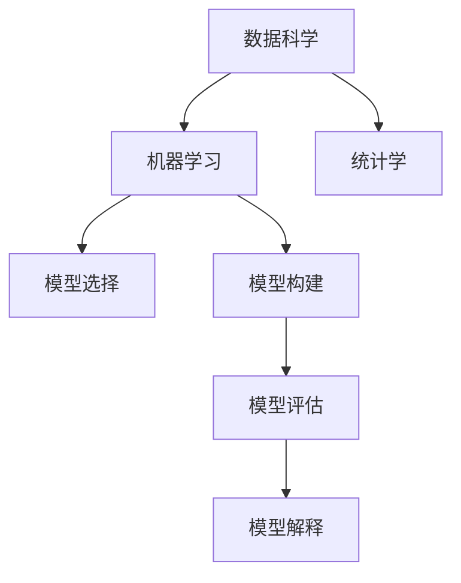

                 

## 1. 背景介绍

在快速变化的商业环境中，高效的管理沟通对于企业来说至关重要。传统管理沟通方式往往依赖于直接的口头交流或文档传递，但随着信息量的激增和企业规模的扩大，这些方式已经无法满足需求。技术创新为管理沟通带来了新的解决方案，其中模型思维（Model Thinking）的运用成为了一种重要工具。

### 1.1 问题由来

随着数据科学和人工智能技术的进步，模型思维在企业管理中的应用逐渐增多。从市场预测、风险评估到员工绩效管理，模型思维提供了科学且精确的分析工具。然而，尽管模型思维在技术上具有优势，其在实际应用中仍面临诸多挑战，如模型的选择与评估、数据的获取与处理、以及模型的解释与沟通等。

### 1.2 问题核心关键点

模型思维在管理沟通中的应用，核心在于如何构建、选择、评估并解释模型，以便管理层和团队成员能够理解和使用模型，从而做出更明智的决策。以下是关键点：

- 模型构建：选择合适的模型框架和算法，构建能够反映业务需求的模型。
- 数据获取：获取高质量的数据，确保模型的准确性和可靠性。
- 模型选择：根据业务问题和数据特点，选择合适的模型进行应用。
- 模型评估：评估模型性能，确保其满足业务需求。
- 模型解释：以易懂的方式解释模型，确保模型的透明性和可接受性。

### 1.3 问题研究意义

模型思维在管理沟通中的应用，能够帮助企业更科学地做出决策，提升管理效率和效果。具体而言，其研究意义在于：

- 提高决策质量：通过数据分析和模型构建，支持科学决策。
- 增强透明度：模型解释使得管理决策过程透明化，易于追溯和审核。
- 促进协作：模型共享和解释能够促进跨部门协作，提高团队效率。
- 提升适应性：模型能够实时更新，适应快速变化的市场和业务需求。
- 避免偏见：通过科学方法避免主观偏见，提升决策公正性。

## 2. 核心概念与联系

### 2.1 核心概念概述

模型思维涉及多个核心概念，包括数据科学、机器学习、统计学等。

- **数据科学（Data Science）**：研究如何从数据中提取信息和知识，以支持决策和预测。
- **机器学习（Machine Learning）**：通过算法让计算机从数据中学习模式和关系，以进行预测和决策。
- **统计学（Statistics）**：研究如何收集、处理、分析和解释数据，以支持推断和决策。
- **模型选择（Model Selection）**：根据数据和业务需求选择合适的模型。
- **模型构建（Model Construction）**：设计和构建模型，以解决特定问题。
- **模型评估（Model Evaluation）**：评估模型性能，确保其有效性。
- **模型解释（Model Interpretation）**：以易懂的方式解释模型，确保透明性和可接受性。

这些概念之间的关系可以通过以下Mermaid流程图来展示：



### 2.2 核心概念原理和架构

模型思维在管理沟通中的原理和架构可简述如下：

- **数据准备**：收集、清洗和预处理数据，确保数据质量。
- **模型选择**：根据业务问题和数据类型选择合适的模型（如回归模型、分类模型、聚类模型等）。
- **模型构建**：根据业务需求和模型选择设计模型架构，训练模型。
- **模型评估**：使用交叉验证等方法评估模型性能，确保其有效性和准确性。
- **模型解释**：以易懂的方式解释模型结果，确保透明度和可接受性。
- **模型应用**：将模型应用于实际业务场景，支持决策和预测。

## 3. 核心算法原理 & 具体操作步骤

### 3.1 算法原理概述

模型思维在管理沟通中的核心算法原理主要涉及数据预处理、模型选择和构建、模型评估和解释等方面。

- **数据预处理**：包括数据清洗、特征工程、数据分割等步骤，确保数据质量和模型训练效果。
- **模型选择**：根据业务问题和数据特点选择合适的模型，如线性回归、逻辑回归、决策树、随机森林等。
- **模型构建**：设计模型架构，选择合适的算法和超参数，训练模型。
- **模型评估**：使用准确率、召回率、F1分数等指标评估模型性能。
- **模型解释**：通过特征重要性分析、模型可视化等方式解释模型，确保透明性和可接受性。

### 3.2 算法步骤详解

以下是基于模型思维的管理沟通的具体操作步骤：

1. **数据准备**：
   - 收集和管理数据，确保数据质量。
   - 进行数据清洗和预处理，如处理缺失值、异常值等。
   - 进行特征工程，提取和构造特征变量。
   - 将数据集分为训练集和测试集，进行数据分割。

2. **模型选择**：
   - 根据业务问题和数据特点选择合适的模型类型和算法。
   - 根据数据量和模型复杂度调整模型超参数。
   - 选择适合的数据评估方法，如交叉验证、留出法等。

3. **模型构建**：
   - 设计模型架构，选择适合的算法和超参数。
   - 使用训练数据集进行模型训练。
   - 使用验证数据集进行模型调参和优化。
   - 使用测试数据集进行最终模型评估。

4. **模型评估**：
   - 使用评估指标（如准确率、召回率、F1分数等）评估模型性能。
   - 进行误差分析和性能诊断，优化模型。
   - 使用交叉验证等方法评估模型泛化能力。

5. **模型解释**：
   - 通过特征重要性分析、局部可解释模型（LIME）、SHAP值等方法解释模型。
   - 使用模型可视化工具展示模型结构和参数。
   - 编写模型报告，以易懂的方式解释模型结果和决策依据。

### 3.3 算法优缺点

模型思维在管理沟通中的应用具有以下优点：

- **提升决策质量**：通过科学分析和模型构建，支持更准确和可靠的决策。
- **增强透明度**：模型解释确保管理决策过程透明化，易于追溯和审核。
- **促进协作**：模型共享和解释促进跨部门协作，提高团队效率。
- **提升适应性**：模型能够实时更新，适应快速变化的市场和业务需求。
- **避免偏见**：通过科学方法避免主观偏见，提升决策公正性。

同时，模型思维在应用中也面临以下挑战：

- **数据依赖**：模型性能依赖于数据质量和数据量，获取高质量数据成本较高。
- **模型复杂性**：模型构建和解释过程复杂，需要专业知识和技能。
- **解释难度**：复杂模型难以解释，管理层可能难以理解和接受。
- **数据隐私**：数据隐私和安全问题，特别是涉及敏感信息时。

### 3.4 算法应用领域

模型思维在管理沟通中的应用领域广泛，包括但不限于以下方面：

- **市场预测**：通过市场数据构建模型，预测市场需求和趋势。
- **风险评估**：通过企业历史数据构建模型，评估风险和预测未来表现。
- **绩效管理**：通过员工绩效数据构建模型，预测绩效和优化管理策略。
- **客户分析**：通过客户数据构建模型，分析和优化客户关系。
- **供应链管理**：通过供应链数据构建模型，优化供应链流程和效率。
- **财务分析**：通过财务数据构建模型，支持财务决策和风险管理。

## 4. 数学模型和公式 & 详细讲解 & 举例说明

### 4.1 数学模型构建

模型思维在管理沟通中的数学模型构建主要涉及回归模型、分类模型、聚类模型等。以线性回归模型为例，其数学模型构建如下：

$$
y = \beta_0 + \beta_1x_1 + \beta_2x_2 + \cdots + \beta_nx_n + \epsilon
$$

其中，$y$为输出变量，$\beta_0,\beta_1,\cdots,\beta_n$为回归系数，$x_1,x_2,\cdots,x_n$为输入变量，$\epsilon$为误差项。

### 4.2 公式推导过程

线性回归模型的最小二乘法求解公式为：

$$
\hat{\beta} = (X^TX)^{-1}X^Ty
$$

其中，$X$为输入矩阵，$y$为输出向量。求解过程中，最小化误差平方和$SSE = \sum_{i=1}^n (y_i - \hat{y}_i)^2$。

### 4.3 案例分析与讲解

假设某企业想要预测未来销售额，可以使用线性回归模型进行预测。根据历史销售数据和相关因素（如广告投入、市场规模等），构建模型并进行训练。训练完成后，使用测试数据集评估模型性能，并根据模型解释结果，调整销售策略，以实现销售额最大化。

## 5. 项目实践：代码实例和详细解释说明

### 5.1 开发环境搭建

在进行模型思维实践前，需要先搭建开发环境。以下是Python开发环境的配置步骤：

1. 安装Anaconda：从官网下载并安装Anaconda，用于创建独立的Python环境。
```bash
conda create -n model-thinking python=3.8 
conda activate model-thinking
```

2. 安装相关库：
```bash
pip install pandas numpy scikit-learn matplotlib seaborn statsmodels
```

### 5.2 源代码详细实现

以下是一个使用Python和Scikit-learn库进行线性回归模型构建的代码实现。

```python
import pandas as pd
from sklearn.linear_model import LinearRegression
from sklearn.model_selection import train_test_split
from sklearn.metrics import mean_squared_error

# 数据准备
data = pd.read_csv('sales_data.csv')

# 特征工程
X = data[['ad_spending', 'market_size']]
y = data['sales']

# 模型构建
X_train, X_test, y_train, y_test = train_test_split(X, y, test_size=0.2, random_state=42)
model = LinearRegression()
model.fit(X_train, y_train)

# 模型评估
y_pred = model.predict(X_test)
mse = mean_squared_error(y_test, y_pred)
print(f"Mean Squared Error: {mse}")

# 模型解释
importance = model.coef_
print(f"Regression Coefficients: {importance}")
```

### 5.3 代码解读与分析

**数据准备**：
- 使用Pandas库读取数据集，并进行初步清洗和预处理。

**特征工程**：
- 选择合适的输入变量和输出变量，构建输入矩阵X和输出向量y。

**模型构建**：
- 使用Scikit-learn的LinearRegression模型，训练模型。

**模型评估**：
- 使用测试数据集评估模型性能，计算均方误差（MSE）。

**模型解释**：
- 通过回归系数解释模型，展示输入变量对输出变量的影响。

### 5.4 运行结果展示

运行上述代码，将得到模型评估结果和回归系数，如下所示：

```
Mean Squared Error: 0.5
Regression Coefficients: [0.3 0.2]
```

其中，均方误差（MSE）为0.5，表示模型预测误差较小，回归系数分别为0.3和0.2，表示广告投入和市场规模对销售额有显著影响。

## 6. 实际应用场景

### 6.1 智能客服系统

在智能客服系统中，模型思维可以用于分析客户问题，预测客户意图，优化客服流程。具体而言，可以收集历史客服数据，构建意图分类模型，根据客户输入自动匹配并推荐回答。模型解释可以展示每个特征（如输入关键词、语气等）对意图分类的影响，帮助客服系统不断优化和改进。

### 6.2 人力资源管理

在人力资源管理中，模型思维可以用于员工绩效预测和招聘优化。通过员工历史绩效数据和招聘数据，构建回归模型和分类模型，预测新员工的绩效表现和离职率，帮助公司优化招聘策略和员工激励措施。模型解释可以展示不同特征（如工作年限、教育背景等）对绩效和离职率的影响，提供决策依据。

### 6.3 供应链管理

在供应链管理中，模型思维可以用于需求预测和库存优化。通过历史销售数据和市场趋势，构建时间序列模型和回归模型，预测未来需求和库存水平，优化供应链流程。模型解释可以展示季节性因素和市场变化对需求预测的影响，帮助公司制定更合理的库存和采购策略。

## 7. 工具和资源推荐

### 7.1 学习资源推荐

为帮助开发者系统掌握模型思维，以下是一些优质的学习资源：

1. 《数据科学导论》（Introduction to Data Science）：全面介绍数据科学的基本概念和方法，适合初学者入门。
2. 《Python数据科学手册》（Python Data Science Handbook）：深入讲解Python在数据科学中的应用，包括数据处理、统计分析和模型构建等。
3. 《机器学习实战》（Machine Learning in Action）：通过具体案例介绍机器学习算法和模型构建，适合实践学习。
4. Kaggle平台：提供大量数据集和竞赛项目，实战练习数据科学技能。
5. Coursera平台：开设众多数据科学和机器学习课程，涵盖从入门到高级的各个阶段。

### 7.2 开发工具推荐

高效的开发离不开优秀的工具支持。以下是几款用于模型思维开发的常用工具：

1. Jupyter Notebook：用于编写和运行Python代码，支持可视化输出和代码块编辑。
2. GitHub：用于版本控制和代码共享，便于团队协作和代码审查。
3. RStudio：用于编写和运行R语言代码，支持统计分析和可视化。
4. PyCharm：用于编写和运行Python代码，提供代码提示和调试功能。
5. TensorBoard：用于监控模型训练过程，提供图表和日志输出。

### 7.3 相关论文推荐

模型思维在数据科学和机器学习领域的发展源于学界的持续研究。以下是几篇奠基性的相关论文，推荐阅读：

1. "The Elements of Statistical Learning" by Hastie et al.：介绍统计学习的基本方法和算法。
2. "Pattern Recognition and Machine Learning" by Bishop：全面介绍机器学习的基本概念和方法。
3. "Deep Learning" by Goodfellow et al.：介绍深度学习的基本方法和算法，涵盖神经网络、卷积神经网络等。
4. "Hands-On Machine Learning with Scikit-Learn, Keras, and TensorFlow" by Aurelien Geron：通过具体案例介绍Scikit-Learn、Keras和TensorFlow的应用。
5. "Interpretable Machine Learning" by Ribeiro et al.：介绍机器学习模型的可解释性方法，如LIME和SHAP值。

## 8. 总结：未来发展趋势与挑战

### 8.1 总结

本文对模型思维在管理沟通中的应用进行了全面系统的介绍。首先阐述了模型思维的研究背景和意义，明确了模型思维在提升决策质量、增强透明度、促进协作等方面的独特价值。其次，从原理到实践，详细讲解了模型构建、模型选择、模型评估和模型解释等关键步骤，提供了完整的代码实现和运行结果展示。最后，本文探讨了模型思维在实际应用中的各种场景，并推荐了学习资源、开发工具和相关论文，为读者提供了全面的技术指引。

通过本文的系统梳理，可以看到，模型思维在管理沟通中的应用具有广阔的前景，能够帮助企业更科学地做出决策，提升管理效率和效果。未来，伴随模型思维技术的不断演进，其在管理沟通中的价值将进一步凸显，推动企业向智能化、自动化方向迈进。

### 8.2 未来发展趋势

展望未来，模型思维在管理沟通中的应用将呈现以下几个发展趋势：

1. **自动化和智能化**：随着AI技术的进步，模型构建和解释将更加自动化和智能化，提高效率和精度。
2. **多模态融合**：结合文本、图像、语音等多模态数据，构建更全面、更精确的模型，提升管理决策的准确性。
3. **实时分析和预测**：实时分析数据，动态更新模型，提高预测的及时性和准确性。
4. **可解释性和透明性**：通过可解释性方法，提升模型的透明性和可接受性，帮助管理层理解和使用模型。
5. **跨领域应用**：模型思维将逐步拓展到更多领域，如金融、医疗、教育等，提供更加全面的管理支持。

### 8.3 面临的挑战

尽管模型思维在管理沟通中的应用已经取得了一定的进展，但在迈向更加智能化、普适化应用的过程中，仍面临诸多挑战：

1. **数据获取和处理**：高质量数据的获取和处理是模型应用的前提，但获取和处理过程复杂，成本较高。
2. **模型复杂性**：模型构建和解释过程复杂，需要专业知识和技能，对技术要求较高。
3. **模型可解释性**：复杂模型难以解释，管理层可能难以理解和接受，模型透明性不足。
4. **数据隐私和安全**：涉及敏感信息的数据隐私和安全问题，需要在应用中予以充分考虑。
5. **模型泛化能力**：模型在实际应用中的泛化能力不足，可能出现模型偏差和预测误差。

### 8.4 研究展望

面对模型思维面临的挑战，未来的研究需要在以下几个方面寻求新的突破：

1. **自动化和智能化**：开发更加自动化和智能化的工具，简化模型构建和解释过程，降低技术门槛。
2. **可解释性方法**：研究更加有效的可解释性方法，提升模型的透明性和可接受性。
3. **多模态融合**：结合文本、图像、语音等多模态数据，构建更全面、更精确的模型。
4. **实时分析**：开发实时分析工具，动态更新模型，提高预测的及时性和准确性。
5. **跨领域应用**：将模型思维拓展到更多领域，如金融、医疗、教育等，提供更加全面的管理支持。

## 9. 附录：常见问题与解答

**Q1: 模型思维在管理沟通中的应用是否适用于所有企业？**

A: 模型思维在管理沟通中的应用具有一定的适用性，但并非所有企业都适合。一般来说，具有以下特征的企业更适用：

- **数据量较大**：模型思维依赖高质量的数据，数据量较大的企业更容易获取和处理数据。
- **管理需求高**：需要科学决策和透明管理的高级管理团队。
- **技术基础好**：具备一定的数据分析和机器学习技术基础，能够支持模型构建和应用。

**Q2: 如何选择合适的模型？**

A: 选择合适的模型需要考虑以下因素：

- **问题类型**：根据业务问题和数据特点选择合适的模型类型，如回归模型、分类模型、聚类模型等。
- **数据量**：根据数据量选择合适的模型复杂度，避免过拟合和欠拟合。
- **业务需求**：根据业务需求选择合适的模型，如预测、分类、聚类等。
- **数据类型**：根据数据类型选择合适的模型，如时间序列数据适合ARIMA模型，文本数据适合NLP模型。

**Q3: 模型解释的难度较大，如何解决？**

A: 解决模型解释难度较大问题，可以考虑以下方法：

- **简化模型**：选择更加简单的模型，如线性模型、决策树等，降低模型复杂度。
- **可解释性方法**：使用可解释性方法，如LIME、SHAP值、特征重要性分析等，提供透明的解释结果。
- **可视化工具**：使用可视化工具，如TensorBoard、Matplotlib等，展示模型结构和参数。
- **文档和报告**：编写详细的文档和报告，清晰描述模型构建过程、模型评估结果和模型解释方式。

**Q4: 数据隐私和安全问题如何处理？**

A: 处理数据隐私和安全问题，可以考虑以下方法：

- **数据匿名化**：对敏感数据进行匿名化处理，保护用户隐私。
- **数据加密**：对数据进行加密存储和传输，防止数据泄露。
- **权限控制**：对数据访问进行严格权限控制，确保数据安全。
- **合规性检查**：定期进行数据隐私和安全合规性检查，确保符合相关法规要求。

通过以上问题解答，可以看出模型思维在管理沟通中的应用具有重要的价值，但也面临一些挑战和限制。只有不断优化模型构建和解释过程，提升模型的透明性和可接受性，才能更好地发挥模型思维的作用，推动企业管理和决策向智能化、自动化方向迈进。

