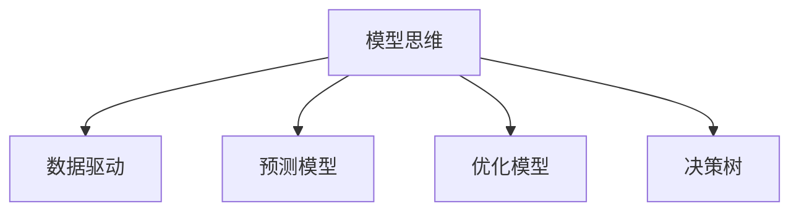

                 

# 模型思维对管理效率的提升

## 1. 背景介绍

### 1.1 问题由来
在信息时代，随着数据量的爆炸式增长，企业面临的数据和决策复杂性也在不断增加。传统基于经验和直觉的管理方式难以满足现代管理的需求，模型思维成为一种高效、科学的管理工具。模型思维通过构建数学模型来描述和分析实际问题，提供决策支持，显著提高了管理的效率和精度。

### 1.2 问题核心关键点
模型思维的核心在于将复杂的管理问题抽象为数学模型，并利用数学工具对其进行求解和分析。常见的管理模型包括线性规划模型、优化模型、预测模型、决策树模型等。模型思维的优点在于能够提供定量化的分析和决策支持，减少主观判断和失误。

## 2. 核心概念与联系

### 2.1 核心概念概述

为更好地理解模型思维在管理中的应用，本节将介绍几个密切相关的核心概念：

- 模型思维(Model Thinking)：利用数学模型描述和分析复杂管理问题，提供决策支持。
- 数据驱动(Data-Driven)：以数据为基础，通过统计分析和机器学习算法，从数据中挖掘出有价值的管理信息。
- 预测模型(Predictive Modeling)：使用历史数据构建模型，对未来事件进行预测，帮助企业提前做出应对。
- 优化模型(Optimization Modeling)：通过数学规划，找到在约束条件下使目标函数最大化的决策方案。
- 决策树(Decision Tree)：使用树形结构表示决策过程，帮助企业快速识别关键决策节点。

这些核心概念之间的逻辑关系可以通过以下Mermaid流程图来展示：



这个流程图展示了这个概念体系的核心思想和关键流程。

## 3. 核心算法原理 & 具体操作步骤
### 3.1 算法原理概述

模型思维的核心是通过数学模型对实际管理问题进行建模和求解。常见的数学模型包括线性规划、整数规划、线性回归、逻辑回归、决策树等。这些模型的求解过程通常包括数据收集、模型构建、参数估计、模型评估和结果解释等步骤。

### 3.2 算法步骤详解

基于模型思维的管理决策过程，一般包括以下几个关键步骤：

**Step 1: 数据收集与预处理**
- 收集相关历史数据，确保数据的质量和完整性。
- 对数据进行清洗、去重、处理缺失值等预处理，以提高模型准确性。

**Step 2: 模型选择与构建**
- 根据管理问题的特点，选择合适的数学模型，如线性回归、逻辑回归、决策树等。
- 在已有模型基础上，根据问题特点进行调整和优化，如增加或调整特征、选择正则化参数等。

**Step 3: 模型训练与评估**
- 使用训练数据对模型进行训练，确定模型参数。
- 使用验证数据对模型进行评估，选择性能最优的模型。
- 调整模型参数，进行交叉验证，确保模型泛化能力。

**Step 4: 模型应用与优化**
- 将模型应用于实际管理问题，提供决策支持。
- 根据模型预测结果，调整决策方案。
- 定期更新模型，适应新的数据和环境变化。

**Step 5: 结果解释与反馈**
- 将模型预测结果进行解释，使管理层能够理解模型的输出。
- 收集模型应用的反馈信息，进一步优化模型。

以上是模型思维在管理中的应用流程。在实际应用中，还需要针对具体问题，对模型构建和训练等环节进行优化设计，如改进训练目标函数、引入更多正则化技术、搜索最优超参数组合等，以进一步提升模型性能。

### 3.3 算法优缺点

基于模型思维的管理决策具有以下优点：
1. 科学定量。模型提供定量化的决策支持，减少了主观判断和误差。
2. 客观中立。模型基于数据，不受管理层主观意愿影响。
3. 可解释性强。模型的构建和求解过程透明，结果易于解释和理解。
4. 灵活可扩展。可根据问题特点灵活选择和构建模型，提升决策灵活性。

但该方法也存在一些局限性：
1. 数据依赖度高。模型的准确性和可靠性高度依赖于数据的质量和量。
2. 模型构建复杂。复杂的数学模型需要专业知识，对非专业管理层可能构成障碍。
3. 结果可能滞后。模型基于历史数据，难以实时响应管理需求。
4. 忽视上下文。模型缺乏对管理情境和上下文的理解，可能输出不符合实际情况的结果。

尽管存在这些局限性，但就目前而言，模型思维已成为现代管理中不可或缺的工具。未来相关研究的重点在于如何进一步降低模型构建和使用的门槛，提高模型的实时性和上下文理解能力。

### 3.4 算法应用领域

模型思维在企业管理中的应用非常广泛，以下是几个典型的应用场景：

- **供应链管理**：通过线性规划等优化模型，优化库存、生产、运输等决策，提高供应链效率。
- **财务分析**：使用回归模型、时间序列模型等，分析财务数据，预测未来收益和风险。
- **人力资源管理**：构建人才需求预测模型，优化招聘、培训、绩效管理等决策。
- **市场营销**：利用预测模型，分析客户行为，优化营销策略，提升销售业绩。
- **运营优化**：使用整数规划等模型，优化生产流程、设备维护、服务调度等运营决策。

除了上述这些经典应用外，模型思维还在更多企业管理领域得到了广泛应用，如研发管理、物流管理、质量管理等，为企业管理带来了新的解决方案。

## 4. 数学模型和公式 & 详细讲解 & 举例说明
### 4.1 数学模型构建

在本节中，我们将介绍几个常用的管理数学模型，并给出其构建方法。

#### 4.1.1 线性规划模型

线性规划模型用于优化资源分配，常见于供应链管理、财务分析等领域。线性规划的目标是最小化或最大化线性目标函数，满足线性约束条件。模型表示为：

$$
\begin{aligned}
\min & \quad c^T x \\
\text{subject to} & \quad Ax = b \\
& \quad x \geq 0
\end{aligned}
$$

其中 $c$ 为向量，$x$ 为变量，$A$ 为系数矩阵，$b$ 为常数向量。

#### 4.1.2 线性回归模型

线性回归模型用于预测连续变量，常用于财务分析、销售预测等场景。线性回归模型假设因变量与自变量之间存在线性关系，模型表示为：

$$
y = \beta_0 + \beta_1 x_1 + \beta_2 x_2 + \cdots + \beta_p x_p + \epsilon
$$

其中 $y$ 为因变量，$x_i$ 为自变量，$\beta_i$ 为回归系数，$\epsilon$ 为误差项。

#### 4.1.3 决策树模型

决策树模型用于分类和回归任务，常用于市场分析、客户细分等场景。决策树通过树形结构表示决策过程，模型表示为：

$$
T(x) = 
\begin{cases}
\text{Root Node}, & \text{if } x \in \text{Root Node} \\
T(x), & \text{if } x \in \text{Child Node}
\end{cases}
$$

其中 $x$ 为输入特征，$\text{Root Node}$ 为根节点，$\text{Child Node}$ 为子节点。

### 4.2 公式推导过程

在本节中，我们将对上述模型的构建和求解过程进行详细推导。

#### 4.2.1 线性规划模型的求解

线性规划模型的一般形式为：

$$
\begin{aligned}
\min & \quad c^T x \\
\text{subject to} & \quad Ax = b \\
& \quad x \geq 0
\end{aligned}
$$

其对偶模型为：

$$
\begin{aligned}
\max & \quad b^T y \\
\text{subject to} & \quad Ay \leq c \\
& \quad y \geq 0
\end{aligned}
$$

通过求解对偶模型，可以找到原始模型的最优解。具体求解方法包括单纯形法、内点法等。

#### 4.2.2 线性回归模型的求解

线性回归模型的最小二乘估计法为：

$$
\hat{\beta} = (X^TX)^{-1}X^Ty
$$

其中 $\hat{\beta}$ 为回归系数，$X$ 为自变量矩阵，$y$ 为目标变量向量。

#### 4.2.3 决策树模型的构建

决策树模型的构建主要分为数据预处理、特征选择、树形构建等步骤。

- 数据预处理：对数据进行清洗、去重、处理缺失值等预处理，确保数据质量。
- 特征选择：选择最相关的特征构建决策树，可以使用信息增益、基尼指数等指标。
- 树形构建：通过递归分割数据集，构建决策树。

### 4.3 案例分析与讲解

下面我们以供应链管理为例，介绍如何应用模型思维进行决策支持。

#### 4.3.1 问题描述
某物流公司负责管理其供应链，包括原材料采购、运输、库存管理等环节。公司希望通过优化供应链，减少成本，提高效率。

#### 4.3.2 数据收集与预处理
收集过去一年的供应链数据，包括原材料采购量、运输成本、库存水平、订单量等。对数据进行清洗、去重、处理缺失值等预处理。

#### 4.3.3 模型选择与构建
根据问题特点，选择合适的模型。选择线性规划模型，构建如下模型：

$$
\begin{aligned}
\min & \quad c^T x \\
\text{subject to} & \quad Ax = b \\
& \quad x \geq 0
\end{aligned}
$$

其中 $c$ 为运输成本和库存成本，$A$ 为约束条件矩阵，$b$ 为目标变量向量。

#### 4.3.4 模型训练与评估
使用训练数据对模型进行训练，确定模型参数。使用验证数据对模型进行评估，选择性能最优的模型。

#### 4.3.5 模型应用与优化
将模型应用于实际供应链管理中，提供决策支持。根据模型预测结果，调整采购、运输、库存等决策方案。

#### 4.3.6 结果解释与反馈
将模型预测结果进行解释，使管理层能够理解模型的输出。收集模型应用的反馈信息，进一步优化模型。

## 5. 项目实践：代码实例和详细解释说明
### 5.1 开发环境搭建

在进行模型思维应用实践前，我们需要准备好开发环境。以下是使用Python进行SciPy开发的环境配置流程：

1. 安装Anaconda：从官网下载并安装Anaconda，用于创建独立的Python环境。

2. 创建并激活虚拟环境：
```bash
conda create -n scipy-env python=3.8 
conda activate scipy-env
```

3. 安装SciPy：根据CUDA版本，从官网获取对应的安装命令。例如：
```bash
conda install scipy scikits-learn pandas matplotlib statsmodels
```

4. 安装各类工具包：
```bash
pip install numpy pandas scikit-learn statsmodels matplotlib tqdm jupyter notebook ipython
```

完成上述步骤后，即可在`scipy-env`环境中开始模型思维应用实践。

### 5.2 源代码详细实现

下面我们以线性规划模型为例，给出使用SciPy进行供应链优化问题的PyTorch代码实现。

首先，定义供应链优化问题的数据：

```python
from scipy.optimize import linprog

# 定义目标函数系数
c = [-1, -2]  # 运输成本和库存成本

# 定义约束条件矩阵
A = [[1, 1], [1, -1]]
b = [10, 20]  # 约束条件的上下限

# 定义变量取值范围
x0_bounds = (0, None)
x1_bounds = (0, None)

# 定义求解方法
method = 'highs'

# 定义优化问题
prob = linprog(c, A_ub=A, b_ub=b, bounds=[x0_bounds, x1_bounds], method=method)

# 求解问题
x = prob.x
y = prob.fun
status = prob.status
message = prob.message

# 输出结果
print("x:", x)
print("y:", y)
print("status:", status)
print("message:", message)
```

接着，定义模型构建和求解函数：

```python
from scipy.optimize import linprog

def build_model(c, A, b, x0_bounds, x1_bounds):
    # 定义目标函数系数
    c = [-1, -2]  # 运输成本和库存成本

    # 定义约束条件矩阵
    A = [[1, 1], [1, -1]]
    b = [10, 20]  # 约束条件的上下限

    # 定义变量取值范围
    x0_bounds = (0, None)
    x1_bounds = (0, None)

    # 定义求解方法
    method = 'highs'

    # 定义优化问题
    prob = linprog(c, A_ub=A, b_ub=b, bounds=[x0_bounds, x1_bounds], method=method)

    # 求解问题
    x = prob.x
    y = prob.fun
    status = prob.status
    message = prob.message

    # 输出结果
    return x, y, status, message

# 调用函数求解模型
c = [-1, -2]  # 运输成本和库存成本
A = [[1, 1], [1, -1]]
b = [10, 20]  # 约束条件的上下限
x0_bounds = (0, None)
x1_bounds = (0, None)

x, y, status, message = build_model(c, A, b, x0_bounds, x1_bounds)

# 输出结果
print("x:", x)
print("y:", y)
print("status:", status)
print("message:", message)
```

最后，解释代码实现细节：

**build_model函数**：
- `c`：目标函数系数。
- `A`：约束条件矩阵。
- `b`：约束条件的上下限。
- `x0_bounds`：变量x0的取值范围。
- `x1_bounds`：变量x1的取值范围。
- `method`：求解方法，如`highs`。
- `linprog`：求解线性规划问题的函数。
- `x`：变量x的取值。
- `y`：目标函数的值。
- `status`：求解状态，如0表示成功。
- `message`：求解消息。

**代码执行过程**：
- 定义目标函数系数、约束条件矩阵、变量取值范围等参数。
- 调用`linprog`函数求解线性规划问题，返回变量取值、目标函数值、求解状态和求解消息。
- 输出变量取值、目标函数值、求解状态和求解消息。

## 6. 实际应用场景
### 6.1 智能客服系统

基于模型思维的智能客服系统，能够通过构建和优化客户行为模型，提供个性化的客服服务。系统通过分析历史客服数据，建立客户行为预测模型，预测客户的服务需求，自动分配客服人员，提升客户满意度。

在技术实现上，可以收集客户的历史行为数据，如浏览记录、聊天记录、服务评价等。使用回归模型或决策树模型，分析客户行为与服务需求的关系。将模型应用于实时客户行为数据，预测客户的服务需求，自动分配客服人员，进行智能客服。

### 6.2 金融舆情监测

金融舆情监测系统通过构建舆情变化预测模型，及时发现并预警市场波动。系统利用历史舆情数据和实时舆情数据，构建舆情变化预测模型，分析舆情变化趋势，及时预警市场波动，帮助金融机构提前应对风险。

具体而言，可以收集金融领域相关的新闻、报道、评论等舆情数据，并对其进行情感分析。利用时间序列模型或回归模型，分析舆情数据与市场波动之间的关系。将模型应用于实时舆情数据，预测市场波动，及时预警风险。

### 6.3 个性化推荐系统

个性化推荐系统通过构建用户行为预测模型，推荐用户感兴趣的物品。系统通过分析用户的历史行为数据，构建用户行为预测模型，分析用户兴趣与物品推荐之间的关系。将模型应用于实时用户行为数据，推荐用户感兴趣的物品，提升用户满意度和平台收益。

具体而言，可以收集用户浏览、点击、评论、分享等行为数据，提取和用户交互的物品标题、描述、标签等文本内容。使用回归模型或决策树模型，分析用户行为与物品推荐之间的关系。将模型应用于实时用户行为数据，推荐用户感兴趣的物品，优化推荐结果。

### 6.4 未来应用展望

随着模型思维的不断发展，基于模型思维的决策支持系统将拓展到更多行业领域，为传统行业带来变革性影响。

在智慧医疗领域，基于模型思维的医疗决策支持系统，能够通过构建和优化患者病情预测模型，提供个性化的治疗方案。系统通过分析历史医疗数据，建立病情预测模型，分析病情与治疗方案之间的关系。将模型应用于实时患者数据，预测病情发展，推荐治疗方案，提升诊疗效果。

在智能教育领域，基于模型思维的教育决策支持系统，能够通过构建和优化学生学习行为预测模型，提供个性化的教育资源。系统通过分析学生的历史学习数据，建立学习行为预测模型，分析学习行为与教育资源之间的关系。将模型应用于实时学生数据，预测学习效果，推荐教育资源，优化教育资源配置。

在智慧城市治理中，基于模型思维的城市管理决策支持系统，能够通过构建和优化城市事件预测模型，提升城市管理效率。系统通过分析历史城市事件数据，建立事件预测模型，分析事件与城市管理之间的关系。将模型应用于实时城市事件数据，预测事件发展，优化城市管理策略，提升城市管理效率。

此外，在企业生产、社会治理、文娱传媒等众多领域，基于模型思维的人工智能应用也将不断涌现，为经济社会发展注入新的动力。相信随着学界和产业界的共同努力，基于模型思维的决策支持系统必将进一步拓展应用领域，为构建智能社会提供更多解决方案。

## 7. 工具和资源推荐
### 7.1 学习资源推荐

为了帮助开发者系统掌握模型思维的理论基础和实践技巧，这里推荐一些优质的学习资源：

1. 《模型思维：用数学模型解决管理问题》系列博文：由模型思维专家撰写，深入浅出地介绍了模型思维的基本概念和应用方法。

2. Coursera《数据驱动的决策制定》课程：由斯坦福大学开设的在线课程，教授如何使用数据和模型进行决策支持，涵盖多种数学模型和实际案例。

3. 《模型思维与数据分析》书籍：全面介绍了模型思维的基本理论和应用方法，适合初学者入门和深入学习。

4. Kaggle竞赛平台：提供大量的实际管理问题，供开发者进行模型构建和实践，验证模型效果。

5. Scikit-learn官方文档：Python数据科学库Scikit-learn的官方文档，提供了丰富的数据科学工具和示例代码，是学习和实践数据科学的重要资源。

通过对这些资源的学习实践，相信你一定能够快速掌握模型思维的精髓，并用于解决实际的决策问题。

### 7.2 开发工具推荐

高效的开发离不开优秀的工具支持。以下是几款用于模型思维应用开发的常用工具：

1. Python：基于Python的开源编程语言，灵活易用，是数据科学和机器学习领域的通用语言。

2. R语言：基于R的开源编程语言，广泛应用于统计分析和数据可视化，是模型思维的另一种主要工具。

3. Matlab：数学软件工具，具有强大的数学计算和可视化功能，适合于复杂模型的求解。

4. Tableau：数据可视化工具，能够将复杂数据直观呈现，辅助决策分析。

5. Jupyter Notebook：交互式编程环境，支持多种编程语言，适合于模型构建和验证。

6. RStudio：R语言的集成开发环境，提供了丰富的工具和扩展，适合于R语言开发。

合理利用这些工具，可以显著提升模型思维应用开发的效率，加快模型构建和验证的速度。

### 7.3 相关论文推荐

模型思维的发展源于学界的持续研究。以下是几篇奠基性的相关论文，推荐阅读：

1. 《线性规划与优化》：介绍了线性规划模型的基本理论和求解方法，是线性规划领域的经典教材。

2. 《机器学习：一种算法框架》：详细介绍了机器学习算法的理论和应用，是机器学习领域的经典教材。

3. 《数据驱动决策：利用数据进行科学决策》：介绍了数据驱动决策的基本原理和应用案例，是数据驱动决策的入门教材。

4. 《决策树：一种分类和回归算法》：介绍了决策树算法的理论基础和应用方法，是决策树领域的经典教材。

5. 《模型驱动的决策支持系统》：介绍了模型驱动决策支持系统的理论和应用，是模型驱动决策支持系统的经典教材。

这些论文代表了大模型思维的发展脉络。通过学习这些前沿成果，可以帮助研究者把握学科前进方向，激发更多的创新灵感。

## 8. 总结：未来发展趋势与挑战

### 8.1 研究成果总结

本文对基于模型思维的管理决策支持系统进行了全面系统的介绍。首先阐述了模型思维的研究背景和意义，明确了模型思维在管理决策支持中的重要价值。其次，从原理到实践，详细讲解了模型思维的数学模型构建和求解过程，给出了模型构建和训练的完整代码实例。同时，本文还广泛探讨了模型思维在智能客服、金融舆情、个性化推荐等多个行业领域的应用前景，展示了模型思维的广泛应用。最后，本文精选了模型思维的学习资源和开发工具，力求为读者提供全方位的技术指引。

通过本文的系统梳理，可以看到，基于模型思维的决策支持系统正在成为管理决策中的重要工具，极大地提升了管理的效率和精度。模型思维的应用不仅局限于金融、物流等传统领域，更拓展到了医疗、教育、城市治理等多个新兴领域，为传统行业带来了新的管理思路和解决方案。

### 8.2 未来发展趋势

展望未来，基于模型思维的管理决策支持系统将呈现以下几个发展趋势：

1. 模型规模持续增大。随着算力成本的下降和数据规模的扩张，模型规模将进一步增大，模型的复杂度和准确度将得到提升。

2. 模型自动化增强。基于自动化机器学习和增强学习技术，模型的构建和优化将更加智能化和自动化，降低人工干预的复杂度。

3. 模型实时化提升。通过流计算和大数据技术，模型的实时求解和更新将变得更加高效，满足即时决策需求。

4. 上下文理解能力增强。通过引入自然语言处理技术和语义分析方法，模型将具备更强的上下文理解能力，提升决策的精确性和适应性。

5. 多模型集成优化。通过融合多种数学模型，建立多模型集成系统，提升决策的稳健性和鲁棒性。

6. 模型解释性提升。通过可解释性机器学习和透明性技术，模型的决策过程将更加透明，提高决策的可解释性和可接受度。

这些趋势凸显了基于模型思维的决策支持系统的广阔前景。这些方向的探索发展，必将进一步提升管理决策的效率和准确性，为管理智能化和自动化带来新的突破。

### 8.3 面临的挑战

尽管基于模型思维的管理决策支持系统已经取得了显著成就，但在迈向更加智能化、自动化应用的过程中，它仍面临诸多挑战：

1. 数据获取和质量瓶颈。高质量数据是模型成功的前提，但数据获取和清洗往往需要大量人力和时间。如何自动化数据处理流程，降低数据获取成本，将是一大挑战。

2. 模型构建复杂度。复杂的模型需要深厚的专业知识和技能，对管理层和技术人员的要求较高。如何降低模型构建的门槛，提升模型的可操作性，将是一个重要方向。

3. 实时性问题。模型计算和求解的复杂度往往较高，难以实时响应决策需求。如何优化模型算法，提高计算效率，实现模型实时求解，将是重要的技术挑战。

4. 上下文理解不足。模型通常缺乏对管理情境和上下文的理解，可能输出不符合实际情况的结果。如何增强模型上下文理解能力，提升决策的适应性和灵活性，将是一个重要研究方向。

5. 模型可解释性不足。复杂的模型通常难以解释其内部工作机制和决策逻辑。如何提升模型的可解释性，提高决策的透明性和可接受度，将是一个重要挑战。

6. 模型鲁棒性问题。模型在面对新的数据和环境时，可能发生退化或失效。如何提高模型的鲁棒性，确保模型的长期稳定性和可靠性，将是一个重要研究方向。

正视模型思维面临的这些挑战，积极应对并寻求突破，将是大规模模型思维走向成熟的必由之路。相信随着学界和产业界的共同努力，这些挑战终将一一被克服，基于模型思维的决策支持系统必将在构建智能社会中扮演越来越重要的角色。

### 8.4 研究展望

面对基于模型思维的决策支持系统所面临的挑战，未来的研究需要在以下几个方面寻求新的突破：

1. 探索自动化和智能化模型构建方法。利用自动化机器学习和增强学习技术，自动构建和优化模型，降低人工干预的复杂度。

2. 引入上下文理解能力。通过引入自然语言处理技术和语义分析方法，增强模型对管理情境和上下文的理解，提升决策的精确性和适应性。

3. 提升模型可解释性。通过可解释性机器学习和透明性技术，提升模型的可解释性和可接受度，提高决策的透明性和可靠性。

4. 优化实时计算和求解方法。通过流计算和大数据技术，优化模型的实时求解和更新，提升模型的实时性。

5. 引入多模型集成方法。通过融合多种数学模型，建立多模型集成系统，提升决策的稳健性和鲁棒性。

6. 研究模型的鲁棒性和泛化能力。通过引入对抗学习和正则化技术，提高模型的鲁棒性和泛化能力，确保模型在面对新的数据和环境时仍然有效。

这些研究方向的探索，必将引领基于模型思维的决策支持系统迈向更高的台阶，为构建智能社会提供更多解决方案。面向未来，基于模型思维的决策支持系统还需要与其他人工智能技术进行更深入的融合，如知识表示、因果推理、强化学习等，多路径协同发力，共同推动决策智能化和自动化进程。只有勇于创新、敢于突破，才能不断拓展模型思维的边界，让决策系统更好地服务于社会和经济发展的需要。

## 9. 附录：常见问题与解答

**Q1：模型思维在管理中的应用与传统直觉方法有何区别？**

A: 模型思维通过数学模型对实际问题进行建模和求解，提供定量化的决策支持。与传统直觉方法相比，模型思维减少了主观判断和误差，提高了决策的科学性和客观性。

**Q2：如何选择合适的数学模型进行决策支持？**

A: 选择合适的数学模型需要考虑管理问题的特点和数据类型。对于线性规划、整数规划等优化问题，选择相应模型即可。对于预测、分类等任务，可以选择回归、决策树等模型。

**Q3：模型思维在应用过程中有哪些常见问题？**

A: 模型思维在应用过程中可能面临数据质量、模型复杂度、实时性、上下文理解等常见问题。需要通过数据清洗、自动化建模、优化算法、上下文理解等方法加以解决。

**Q4：如何评估和管理模型风险？**

A: 评估和管理模型风险需要综合考虑模型的复杂度、数据质量、上下文理解、可解释性等多个因素。通过测试、验证、监控等方法，及时发现和纠正模型问题，确保模型的可靠性和稳健性。

**Q5：模型思维在未来发展中需要关注哪些前沿技术？**

A: 模型思维在未来发展中需要关注自动化机器学习、增强学习、自然语言处理、上下文理解、可解释性机器学习等前沿技术。这些技术将进一步提升模型的智能化和自动化水平，拓展模型的应用领域。

作者：禅与计算机程序设计艺术 / Zen and the Art of Computer Programming

