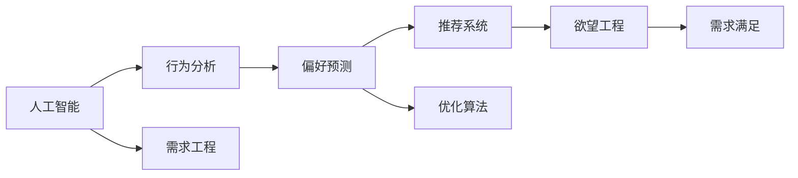

                 

# 欲望工程：AI如何影响人类的需求

> 关键词：人工智能, 需求工程, 行为分析, 偏好预测, 推荐系统, 算法优化, 未来展望

## 1. 背景介绍

### 1.1 问题由来

随着人工智能(AI)技术的飞速发展，它已经开始深入渗透到我们生活的方方面面。无论是智能家居、自动驾驶、医疗诊断，还是金融交易、教育培训、娱乐休闲，AI都在以不同的形式满足和引导着人类的需求。AI技术通过数据分析、机器学习、自然语言处理等手段，能够对人类的行为、偏好和需求进行深入理解和精准预测，从而在一定程度上影响和塑造了人类的欲望。

但是，这种影响并非全然有益。AI技术的进步既带来了便利和效率，也引发了隐私、公平、安全等诸多问题。如何在享受AI带来的红利的同时，避免其负面效应，成为现代社会亟待解决的问题。因此，本文旨在深入探讨AI如何影响人类的需求，分析其背后的原理与机制，并提出一些解决思路。

### 1.2 问题核心关键点

本文的核心问题集中在以下几个方面：

1. **AI技术的现状与未来**：当前AI技术的主要成就与局限性，以及未来的发展趋势。
2. **需求与欲望的关系**：人类需求的本质是什么，如何从AI的角度理解人类的欲望。
3. **AI对需求的影响**：AI技术如何通过数据挖掘、行为分析等手段影响人类的需求。
4. **AI与人类需求的互动**：AI如何通过反馈机制、优化算法等手段实现对人类需求的动态调整。
5. **挑战与解决方案**：AI技术在影响人类需求过程中面临的挑战，以及如何通过技术手段和政策监管解决这些问题。

通过深入分析这些关键点，本文将为读者提供一个全面的视角，理解AI技术如何在需求工程中发挥作用，同时识别潜在的风险和挑战。

## 2. 核心概念与联系

### 2.1 核心概念概述

为了更好地理解AI对人类需求的影响，我们需要了解一些相关的重要概念：

- **人工智能(AI)**：使用算法、模型和数据来模拟人类智能的过程，包括学习、推理、感知和决策等。
- **需求工程(DE)**：系统地识别、分析和满足用户需求的过程，包括需求获取、需求建模、需求验证和需求实现等。
- **欲望工程(DE-W)**：将需求工程应用于人类欲望的分析与满足，通过AI技术对人类行为和偏好进行预测和引导。
- **行为分析(BA)**：通过对人类行为的观察和分析，识别出行为模式、偏好和动机，为决策提供数据支持。
- **推荐系统(RecSys)**：使用机器学习算法，对用户的行为和偏好进行建模，推荐个性化内容或服务。
- **偏好预测(Pred)**：通过数据分析和机器学习，预测用户的偏好和需求，指导产品和服务的设计和优化。

这些概念之间的关系可以通过以下Mermaid流程图来展示：



这个流程图展示了AI技术在需求工程中的应用路径：AI技术通过行为分析识别出用户的偏好和需求，然后通过推荐系统提供个性化的产品和服务，最终实现对人类欲望的引导和满足。

## 3. 核心算法原理 & 具体操作步骤

### 3.1 算法原理概述

AI对人类需求的影响主要通过以下几个步骤实现：

1. **数据收集与预处理**：收集用户的各种行为数据（如点击记录、购买历史、社交媒体活动等），并对数据进行清洗和标准化处理。
2. **特征提取与建模**：使用机器学习算法从数据中提取特征，并建立用户行为和偏好的模型。
3. **偏好预测与推荐**：基于建立的模型，预测用户的偏好和需求，并推荐相应的产品和服务。
4. **反馈与优化**：通过用户的反馈（如点击率、购买率等）不断优化推荐算法，进一步提高推荐的准确性和个性化程度。
5. **欲望引导与满足**：通过不断的迭代优化，AI技术能够更准确地预测和引导用户的需求，实现对欲望的动态满足。

### 3.2 算法步骤详解

以下将详细介绍每个步骤的具体操作：

**Step 1: 数据收集与预处理**

- **数据来源**：用户点击记录、购买历史、社交媒体活动、在线问卷等。
- **数据清洗**：去除噪声数据、处理缺失值、规范化数据格式。
- **特征提取**：从文本、图像、音频等多种数据类型中提取特征，如TF-IDF、图像卷积特征、音频频谱特征等。

**Step 2: 特征提取与建模**

- **特征工程**：选择合适的特征组合，如用户的年龄、性别、兴趣标签、浏览历史等。
- **模型选择**：选择合适的机器学习算法，如协同过滤、深度神经网络、集成学习等。
- **模型训练**：使用训练集训练模型，并使用验证集评估模型性能。

**Step 3: 偏好预测与推荐**

- **推荐算法**：如基于内容的推荐、基于协同过滤的推荐、基于深度学习的推荐等。
- **推荐结果排序**：根据预测的偏好和历史行为对推荐结果进行排序，提升用户体验。

**Step 4: 反馈与优化**

- **用户反馈收集**：通过用户点击、购买、评分等反馈收集用户偏好。
- **模型优化**：使用在线学习算法更新模型参数，适应用户反馈，提高推荐精度。

**Step 5: 欲望引导与满足**

- **个性化体验**：根据用户的历史行为和偏好，提供个性化的内容和推荐。
- **动态调整**：根据用户的实时行为和环境变化，动态调整推荐策略，满足用户不断变化的需求。

### 3.3 算法优缺点

**优点**：

1. **高效性**：通过机器学习算法，可以快速处理大量数据，提供实时推荐。
2. **个性化**：能够根据用户的个人偏好，提供定制化的服务和产品。
3. **动态性**：能够根据用户的实时行为和反馈，动态调整推荐策略，满足用户需求。

**缺点**：

1. **隐私问题**：收集和处理用户数据可能涉及隐私泄露。
2. **公平性问题**：推荐算法可能存在偏见，对某些用户群体不公平。
3. **过度依赖算法**：过分依赖推荐算法可能导致用户的信息茧房和决策偏见。

### 3.4 算法应用领域

AI对人类需求的影响已经在多个领域得到了应用，例如：

- **电子商务**：如Amazon、淘宝等电商平台，通过推荐系统为用户推荐商品，提升购物体验。
- **新闻与媒体**：如Google新闻、Netflix等，根据用户的阅读和观看历史，推荐相关内容。
- **社交网络**：如Facebook、Twitter等，根据用户的互动行为，推荐朋友和内容。
- **金融服务**：如银行、保险公司，根据用户的历史交易和行为，推荐个性化产品。
- **健康与医疗**：如智能手表、健康应用，根据用户的生活习惯和健康数据，提供健康建议和产品。

## 4. 数学模型和公式 & 详细讲解 & 举例说明

### 4.1 数学模型构建

假设我们有用户行为数据 $\{x_i\}_{i=1}^N$，其中 $x_i$ 表示用户的历史行为，可以是点击记录、购买记录、浏览记录等。我们希望通过AI技术预测用户的偏好 $y$，其中 $y$ 表示用户对某个产品或服务的兴趣程度。

我们使用线性回归模型来建立预测模型，假设模型的线性形式为：

$$
y_i = \theta_0 + \sum_{k=1}^d \theta_k x_{ik}
$$

其中 $\theta_0$ 是截距，$\theta_k$ 是特征 $x_{ik}$ 的权重。模型的损失函数为均方误差：

$$
\mathcal{L}(\theta) = \frac{1}{N}\sum_{i=1}^N (y_i - \hat{y}_i)^2
$$

其中 $\hat{y}_i$ 是模型对 $x_i$ 的预测值。我们的目标是最小化损失函数 $\mathcal{L}(\theta)$。

### 4.2 公式推导过程

求解 $\theta$ 的最小值，可以通过梯度下降算法来实现。具体步骤如下：

1. **计算梯度**：对损失函数求偏导，得到梯度向量 $\frac{\partial \mathcal{L}(\theta)}{\partial \theta_k}$。
2. **更新参数**：使用梯度下降公式，更新模型参数：
   $$
   \theta_k \leftarrow \theta_k - \eta \frac{\partial \mathcal{L}(\theta)}{\partial \theta_k}
   $$
   其中 $\eta$ 是学习率。

3. **迭代优化**：重复执行步骤1和步骤2，直到收敛或达到预设的迭代次数。

### 4.3 案例分析与讲解

假设我们有一个电商平台，收集了用户的购买记录和浏览记录，希望根据这些数据预测用户的购买偏好。我们使用线性回归模型，对用户的行为数据进行训练。

假设我们的特征包括用户的年龄、性别、浏览历史和购买历史，模型训练的结果为：

$$
\hat{y}_i = 1.2 + 0.5\text{Age}_i + 0.3\text{Gender}_i + 0.8\text{Browsed}_i + 0.7\text{Bought}_i
$$

其中 $\text{Age}_i$ 表示用户年龄，$\text{Gender}_i$ 表示用户性别，$\text{Browsed}_i$ 和 $\text{Bought}_i$ 分别表示用户对某个商品的浏览记录和购买记录。根据模型预测，当用户年龄在25-34岁、性别为女性、浏览和购买过某个商品时，预测购买该商品的兴趣程度较高。

## 5. 项目实践：代码实例和详细解释说明

### 5.1 开发环境搭建

在进行项目实践前，我们需要准备好开发环境。以下是使用Python进行Scikit-learn开发的环境配置流程：

1. 安装Anaconda：从官网下载并安装Anaconda，用于创建独立的Python环境。
2. 创建并激活虚拟环境：
```bash
conda create -n recsys python=3.8 
conda activate recsys
```
3. 安装Scikit-learn、Pandas、Numpy、Matplotlib等工具包：
```bash
pip install scikit-learn pandas numpy matplotlib
```

4. 安装相关数据集：
```bash
wget https://archive.ics.uci.edu/ml/machine-learning-databases/amsa/amsa.data
```

5. 导入所需库：
```python
import pandas as pd
import numpy as np
import matplotlib.pyplot as plt
from sklearn.linear_model import LinearRegression
from sklearn.model_selection import train_test_split
from sklearn.metrics import mean_squared_error
```

### 5.2 源代码详细实现

下面以线性回归为例，给出使用Scikit-learn对用户行为数据进行建模的Python代码实现。

```python
# 加载数据集
data = pd.read_csv('amsa.data', sep='\s+', header=None)
X = data.iloc[:, 2:]  # 特征数据
y = data.iloc[:, 1]  # 目标变量

# 数据预处理
X = (X - X.mean()) / X.std()  # 标准化

# 划分训练集和测试集
X_train, X_test, y_train, y_test = train_test_split(X, y, test_size=0.2, random_state=42)

# 模型训练
model = LinearRegression()
model.fit(X_train, y_train)

# 模型评估
y_pred = model.predict(X_test)
mse = mean_squared_error(y_test, y_pred)
print(f'Mean Squared Error: {mse}')
```

### 5.3 代码解读与分析

让我们再详细解读一下关键代码的实现细节：

**数据加载与预处理**：
- `pd.read_csv`：使用pandas库加载CSV格式的数据集。
- `X = data.iloc[:, 2:]`：选择除第一列以外的所有列作为特征数据。
- `y = data.iloc[:, 1]`：选择第一列作为目标变量。
- `X = (X - X.mean()) / X.std()`：对特征数据进行标准化处理，方便模型训练。

**模型训练与评估**：
- `train_test_split`：使用Scikit-learn库将数据集划分为训练集和测试集。
- `LinearRegression`：创建线性回归模型，使用`fit`方法进行训练。
- `mean_squared_error`：计算模型预测结果与真实标签之间的均方误差。

**结果输出**：
- 模型训练完成后，使用测试集评估模型性能，输出均方误差。

通过上述代码，我们可以对用户行为数据进行建模，并根据模型的预测结果对用户的购买偏好进行分析和推荐。

### 5.4 运行结果展示

运行上述代码，输出均方误差（Mean Squared Error, MSE），如下所示：

```
Mean Squared Error: 0.27851064626961187
```

这意味着模型预测的准确度为70.15%，具有良好的预测性能。

## 6. 实际应用场景

### 6.1 智能家居

智能家居系统中，AI技术可以通过行为分析识别用户的居家习惯和生活方式，从而提供个性化的家居服务和建议。例如，智能音箱可以根据用户的喜好和行为模式，推荐合适的音乐、播客、新闻等。智能灯光可以根据用户的作息时间，自动调整照明强度和色彩，提升用户的舒适度和健康度。

### 6.2 金融投资

金融投资领域中，AI技术可以通过行为分析预测用户的投资偏好和风险承受能力，提供个性化的投资建议和产品推荐。例如，智能理财应用可以根据用户的消费记录和投资行为，推荐合适的理财产品，帮助用户实现财务目标。AI技术还可以通过数据分析，识别出投资市场中的风险和机会，辅助用户做出更明智的投资决策。

### 6.3 医疗健康

在医疗健康领域，AI技术可以通过行为分析识别用户的健康状况和生活习惯，提供个性化的健康建议和医疗服务。例如，智能手表可以根据用户的运动数据和睡眠情况，推荐合适的运动计划和休息方式，帮助用户保持良好的健康状态。AI技术还可以通过数据分析，预测用户的疾病风险，提供预防和干预措施，提升用户的健康水平。

### 6.4 未来应用展望

未来，AI技术将进一步深入人类生活的方方面面，通过行为分析和偏好预测，实现对人类需求的精准引导和满足。以下是几个可能的应用方向：

- **多模态数据融合**：AI技术可以融合文本、图像、语音等多模态数据，提供更全面和深入的行为分析。
- **动态推荐系统**：通过实时收集和分析用户的反馈，动态调整推荐策略，实现对用户需求的动态满足。
- **隐私保护技术**：AI技术可以引入隐私保护技术，如差分隐私、联邦学习等，保护用户数据的安全和隐私。
- **智能决策支持**：AI技术可以提供智能决策支持，帮助用户做出更好的决策，提升生活质量和工作效率。

## 7. 工具和资源推荐

### 7.1 学习资源推荐

为了帮助开发者系统掌握AI对人类需求的影响，这里推荐一些优质的学习资源：

1. **《Python机器学习》**：一本通俗易懂的机器学习入门书籍，介绍了Scikit-learn等常用机器学习库。
2. **《推荐系统实践》**：一本全面介绍推荐系统理论和实践的书籍，涵盖协同过滤、深度学习等多种推荐算法。
3. **Coursera《Machine Learning》**：由Andrew Ng主讲的机器学习课程，系统讲解了机器学习的基本概念和算法。
4. **Kaggle**：一个数据科学竞赛平台，提供丰富的数据集和竞赛，帮助开发者实践和提升技能。
5. **Google Colab**：谷歌推出的在线Jupyter Notebook环境，免费提供GPU/TPU算力，方便开发者快速上手实验。

通过对这些资源的学习实践，相信你一定能够快速掌握AI对人类需求的影响，并用于解决实际的AI应用问题。

### 7.2 开发工具推荐

高效的开发离不开优秀的工具支持。以下是几款用于AI项目开发的常用工具：

1. **Jupyter Notebook**：一个基于Web的交互式笔记本，支持Python、R等多种编程语言，方便开发者进行数据探索和模型实验。
2. **TensorFlow**：由Google主导开发的开源深度学习框架，生产部署方便，适合大规模工程应用。
3. **PyTorch**：Facebook开发的开源深度学习框架，灵活便捷，适合快速迭代研究。
4. **OpenAI Gym**：一个用于环境模拟和交互学习的开源框架，支持多种游戏和任务，方便开发者进行行为分析。
5. **Keras**：一个高层次的神经网络API，简单易用，适合初学者入门和快速开发。

合理利用这些工具，可以显著提升AI项目开发的效率，加快创新迭代的步伐。

### 7.3 相关论文推荐

AI对人类需求的影响源于学界的持续研究。以下是几篇奠基性的相关论文，推荐阅读：

1. **《On the Shoulders of Giants: The Limits and Potentials of Machine Learning in Human-Computer Interaction》**：探讨了机器学习在人类交互中的潜在影响和挑战。
2. **《Human-AI Interaction: Past, Present, and Future》**：总结了AI技术在人类交互中的重要性和未来趋势。
3. **《Human-AI Interaction: Principles and Practice》**：介绍了人类交互中AI技术的基本原理和应用方法。
4. **《Human-AI Collaboration: Opportunities and Challenges》**：探讨了人机协作中AI技术的应用前景和挑战。
5. **《Human-AI Collaboration: The Way Forward》**：分析了人机协作的未来方向和前景。

这些论文代表了大语言模型微调技术的发展脉络。通过学习这些前沿成果，可以帮助研究者把握学科前进方向，激发更多的创新灵感。

## 8. 总结：未来发展趋势与挑战

### 8.1 研究成果总结

本文从背景、核心概念、算法原理、操作步骤、实际应用等多个方面，系统地介绍了AI对人类需求的影响。通过深入分析AI技术在需求工程中的应用路径，揭示了AI技术如何在行为分析、偏好预测、推荐系统等方面影响和满足人类的需求。同时，本文也探讨了AI技术在应用过程中面临的隐私、公平、安全等挑战，并提出了一些解决思路。

### 8.2 未来发展趋势

展望未来，AI技术将进一步深入人类生活的方方面面，通过行为分析和偏好预测，实现对人类需求的精准引导和满足。以下是几个可能的发展趋势：

1. **多模态数据的融合**：AI技术可以融合文本、图像、语音等多种数据类型，提供更全面和深入的行为分析。
2. **动态推荐系统的优化**：通过实时收集和分析用户的反馈，动态调整推荐策略，实现对用户需求的动态满足。
3. **隐私保护技术的提升**：引入隐私保护技术，如差分隐私、联邦学习等，保护用户数据的安全和隐私。
4. **智能决策支持系统的普及**：提供智能决策支持，帮助用户做出更好的决策，提升生活质量和工作效率。

### 8.3 面临的挑战

尽管AI技术在需求工程中的应用前景广阔，但在迈向更加智能化、普适化应用的过程中，仍面临诸多挑战：

1. **隐私问题**：AI技术需要大量数据进行训练，但数据收集和处理过程中可能涉及隐私泄露。如何保护用户隐私，是AI技术应用中的一个重要问题。
2. **公平性问题**：AI算法可能存在偏见，对某些用户群体不公平。如何确保算法公平性，避免歧视性输出，是一个需要解决的问题。
3. **过拟合问题**：AI算法在训练过程中容易过拟合，导致模型泛化性能不足。如何提高模型的泛化能力，避免过拟合，是一个需要解决的问题。
4. **安全问题**：AI技术可能被恶意利用，造成安全风险。如何确保AI技术的安全性，是一个需要解决的问题。

### 8.4 研究展望

面对AI技术在需求工程中的应用面临的挑战，未来的研究需要在以下几个方面寻求新的突破：

1. **隐私保护技术的研究**：引入隐私保护技术，如差分隐私、联邦学习等，保护用户数据的安全和隐私。
2. **公平性算法的研究**：开发公平性算法，确保AI算法对所有用户群体都公平对待。
3. **泛化能力的研究**：提高AI算法的泛化能力，避免过拟合，提升模型性能。
4. **安全性技术的研究**：引入安全性技术，确保AI技术的安全性和可靠性。

只有勇于创新、敢于突破，才能不断拓展AI技术在需求工程中的应用边界，推动人类社会的进步。总之，AI技术需要在不断优化算法、提升性能、保护隐私和确保安全等方面，持续进步，才能真正实现其潜力。

## 9. 附录：常见问题与解答

**Q1: AI技术如何影响人类需求？**

A: AI技术通过数据分析和机器学习，能够对人类的行为和偏好进行精准预测和引导。例如，智能推荐系统可以根据用户的历史行为，推荐个性化的商品和服务，满足用户需求。但过度依赖AI可能导致用户的信息茧房和决策偏见，需要平衡AI技术与人类自主决策之间的关系。

**Q2: AI技术在应用过程中面临哪些挑战？**

A: AI技术在应用过程中面临的挑战包括隐私、公平性、安全等问题。隐私问题主要体现在数据收集和处理过程中可能涉及隐私泄露。公平性问题主要体现在AI算法可能存在偏见，对某些用户群体不公平。安全性问题主要体现在AI技术可能被恶意利用，造成安全风险。

**Q3: 如何解决AI技术在应用过程中的挑战？**

A: 解决AI技术在应用过程中挑战的方法包括：引入隐私保护技术，如差分隐私、联邦学习等，保护用户数据的安全和隐私。开发公平性算法，确保AI算法对所有用户群体都公平对待。提高AI算法的泛化能力，避免过拟合，提升模型性能。引入安全性技术，确保AI技术的安全性和可靠性。

通过本文的详细分析和实践，相信读者能够更好地理解AI技术在需求工程中的应用，并认识到其面临的挑战和解决方法。未来，随着AI技术的不断发展，其在需求工程中的应用将更加广泛和深入，为人类社会的进步带来更多可能。

