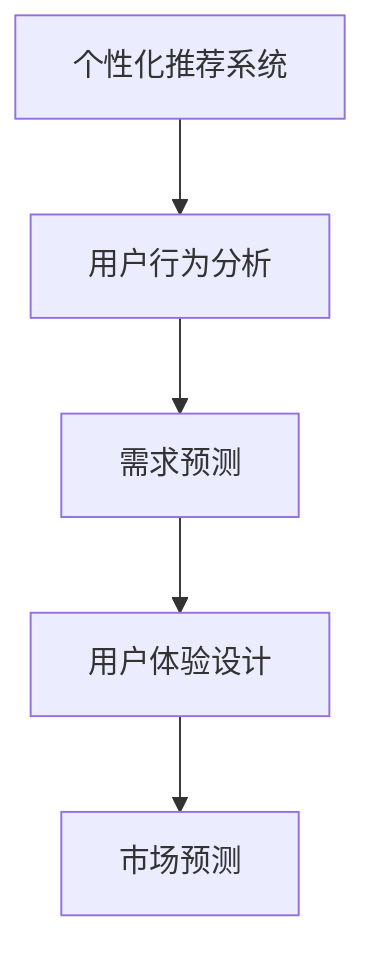

                 

# 欲望的个性化：AI定制的需求满足

> 关键词：人工智能, 个性化推荐, 用户行为分析, 需求预测, 用户体验, 市场预测

## 1. 背景介绍

在数字化时代，用户需求呈现日益个性化、多样化的趋势。一方面，消费者希望产品和服务能够精准反映其个人兴趣和需求；另一方面，企业也渴望通过精准的个性化推荐，提高用户满意度、提升市场竞争力。这一背景下，个性化需求满足成为AI技术应用的全新热词。

### 1.1 问题由来

随着互联网技术的发展和数据的积累，用户行为数据越来越丰富，为个性化推荐提供了可能。然而，单纯基于历史行为数据的推荐算法已难以应对用户不断变化的需求。为了进一步提升个性化推荐效果，需要更深入地理解用户的行为模式、欲望和需求，以及如何将这些理解转化为实际的服务。

### 1.2 问题核心关键点

实现个性化需求满足的核心关键点在于：

1. 数据获取与用户行为理解。如何全面收集和分析用户行为数据，挖掘其背后的需求和欲望。
2. 模型训练与优化。构建什么样的模型，如何训练优化以最大化满足用户需求。
3. 结果评估与反馈。如何评估推荐效果，并根据用户反馈进行持续优化。

### 1.3 问题研究意义

实现个性化需求满足，不仅能显著提升用户体验，还能为企业带来更多商机。具体而言，个性化推荐可以：

1. 提升用户满意度。精准满足用户需求，提高用户黏性和忠诚度。
2. 增加用户转化率。通过个性化推荐，将潜在用户转化为付费用户。
3. 优化产品设计。基于用户反馈，不断改进和优化产品。
4. 增强市场竞争力。利用个性化推荐，准确把握用户需求，形成差异化竞争优势。

## 2. 核心概念与联系

### 2.1 核心概念概述

为更好地理解如何实现个性化需求满足，本节将介绍几个密切相关的核心概念：

- 个性化推荐系统：基于用户历史行为数据，通过机器学习模型预测用户需求，并为其推荐最适合的产品或服务。
- 用户行为分析：分析用户在产品使用中的行为数据，挖掘其行为模式和需求欲望。
- 需求预测：使用历史数据和机器学习算法预测用户未来的需求和欲望。
- 用户体验设计：基于用户需求，设计并优化产品界面和服务流程，提升用户满意度。
- 市场预测：利用用户需求预测结果，结合经济、市场等因素，预测未来市场趋势。

这些核心概念之间的逻辑关系可以通过以下Mermaid流程图来展示：



这个流程图展示了个性化推荐系统的核心概念及其之间的关系：

1. 个性化推荐系统通过分析用户行为，预测用户需求。
2. 需求预测利用机器学习模型，从历史数据中提取用户需求模式。
3. 用户体验设计基于用户需求，优化产品界面和服务流程。
4. 市场预测将用户需求预测结果与市场趋势结合，提供更全面的决策依据。

## 3. 核心算法原理 & 具体操作步骤
### 3.1 算法原理概述

个性化需求满足的核心在于通过机器学习模型预测用户需求，并据此推荐产品或服务。这一过程涉及数据获取与处理、模型训练与优化、结果评估与反馈等多个环节。

1. **数据获取与处理**：从用户使用行为数据中提取特征，包括浏览、购买、评价等。
2. **模型训练与优化**：使用历史数据训练预测模型，使用交叉验证等技术优化模型性能。
3. **结果评估与反馈**：通过A/B测试等方法评估推荐效果，并根据用户反馈调整模型参数。

### 3.2 算法步骤详解

以下是一个典型的个性化需求满足算法步骤：

**Step 1: 数据准备**
- 收集用户行为数据，包括浏览记录、购买记录、评价记录等。
- 预处理数据，去除噪音和异常值，填充缺失值。

**Step 2: 特征工程**
- 设计特征，包括用户行为特征、商品特征、时间特征等。
- 利用特征工程技术，构造和选择特征。

**Step 3: 模型训练**
- 选择适当的算法，如协同过滤、深度学习模型等。
- 使用历史数据训练模型，并通过交叉验证选择最优模型。
- 调整模型参数，优化模型性能。

**Step 4: 需求预测**
- 利用训练好的模型对用户行为进行预测，得到潜在需求。
- 根据预测结果，为用户推荐产品或服务。

**Step 5: 用户体验设计**
- 根据用户反馈，不断优化推荐系统，提升用户体验。
- 设计和优化产品界面，提升用户满意度。

**Step 6: 市场预测**
- 利用用户需求预测结果，结合市场因素，预测未来市场趋势。
- 调整产品策略，提升市场竞争力。

### 3.3 算法优缺点

个性化需求满足算法的优点在于：

1. 提升用户满意度。通过个性化推荐，满足用户多样化需求，提高用户满意度。
2. 增加用户转化率。精准推荐提升用户黏性，转化潜在用户为付费用户。
3. 优化产品设计。基于用户反馈，不断改进产品功能和服务流程。
4. 增强市场竞争力。利用个性化推荐，把握市场趋势，形成差异化竞争优势。

同时，该方法也存在一定的局限性：

1. 数据隐私问题。用户行为数据涉及隐私，需要保护用户隐私。
2. 模型复杂性。复杂的模型可能难以解释，且计算资源消耗较大。
3. 数据稀疏性。用户行为数据可能稀疏，难以覆盖所有用户需求。
4. 算法鲁棒性。用户需求可能存在不确定性，模型鲁棒性有待提高。

尽管存在这些局限性，但个性化需求满足算法仍在不断进步，正逐步成为AI技术应用的核心范式。未来相关研究的重点在于如何降低算法对标注数据的依赖，提升模型的可解释性和鲁棒性，同时兼顾用户隐私保护和数据利用。

### 3.4 算法应用领域

个性化需求满足算法在多个领域得到了广泛应用，例如：

- 电商推荐：基于用户历史行为，推荐商品或服务。
- 内容推荐：为社交媒体用户推荐文章、视频等。
- 金融推荐：为金融用户推荐理财产品、投资策略等。
- 游戏推荐：为游戏用户推荐游戏、游戏内物品等。
- 广告推荐：为广告主推荐用户，提升广告效果。

## 4. 数学模型和公式 & 详细讲解 & 举例说明
### 4.1 数学模型构建

个性化需求满足的数学模型通常基于协同过滤、深度学习等算法构建。以下以协同过滤算法为例，介绍数学模型构建过程。

设用户集合为 $U$，商品集合为 $I$，用户行为矩阵为 $R_{ui} \in \{0,1\}$，表示用户 $u$ 是否购买了商品 $i$。设协同过滤模型的预测因子为 $\hat{R}_{ui}$，模型目标函数为：

$$
\min_{\theta} \sum_{(u,i)\in R}\text{MSE}(R_{ui}, \hat{R}_{ui})
$$

其中 $\text{MSE}$ 为均方误差损失函数，$\theta$ 为模型参数。

### 4.2 公式推导过程

协同过滤模型的推导过程如下：

- 矩阵分解：将用户行为矩阵 $R$ 分解为 $R=\hat{R}P$，其中 $\hat{R}$ 为用户特征矩阵，$P$ 为商品特征矩阵。
- 矩阵乘法：$\hat{R}_{ui} = \hat{R}_u \cdot P_i$，其中 $\hat{R}_u$ 为第 $u$ 个用户的特征向量，$P_i$ 为第 $i$ 个商品的特征向量。
- 求解目标函数：利用梯度下降等方法，求解目标函数的最小值，得到最优参数 $\theta$。

### 4.3 案例分析与讲解

以电商平台推荐系统为例，假设某用户 $u$ 购买了商品 $i$ 和 $j$，未购买商品 $k$ 和 $l$。根据协同过滤模型，用户 $u$ 对商品 $k$ 的预测评分 $\hat{R}_{uk}$ 为：

$$
\hat{R}_{uk} = \hat{R}_u \cdot P_k
$$

其中 $\hat{R}_u$ 为 $u$ 的特征向量，$P_k$ 为 $k$ 的特征向量。假设 $u$ 和 $k$ 之间没有直接行为记录，但用户 $u$ 购买了商品 $j$，且 $j$ 和 $k$ 之间存在一定的相关性。根据协同过滤模型，$k$ 的特征向量 $P_k$ 中包含 $j$ 的特征 $P_{j\to k}$，从而影响 $\hat{R}_{uk}$ 的计算。

## 5. 项目实践：代码实例和详细解释说明
### 5.1 开发环境搭建

在进行个性化需求满足实践前，我们需要准备好开发环境。以下是使用Python进行Scikit-learn开发的环境配置流程：

1. 安装Anaconda：从官网下载并安装Anaconda，用于创建独立的Python环境。

2. 创建并激活虚拟环境：
```bash
conda create -n sklearn-env python=3.8 
conda activate sklearn-env
```

3. 安装Scikit-learn：
```bash
conda install scikit-learn
```

4. 安装各类工具包：
```bash
pip install numpy pandas scikit-learn matplotlib tqdm jupyter notebook ipython
```

完成上述步骤后，即可在`sklearn-env`环境中开始个性化需求满足实践。

### 5.2 源代码详细实现

这里以协同过滤算法为例，给出使用Scikit-learn库进行个性化推荐系统开发的PyTorch代码实现。

首先，定义协同过滤模型：

```python
from sklearn.metrics.pairwise import cosine_similarity
from sklearn.decomposition import TruncatedSVD

class CollaborativeFiltering:
    def __init__(self, n_components=50, alpha=0.01):
        self.n_components = n_components
        self.alpha = alpha
        self.model = None
    
    def fit(self, X):
        self.model = TruncatedSVD(n_components=self.n_components, alpha=self.alpha)
        self.model.fit(X)
    
    def predict(self, X):
        U = self.model.transform(X)
        V = self.model.transform(X.T)
        return U @ V.T
```

然后，定义数据处理函数：

```python
from sklearn.datasets import load_sample_files
from sklearn.feature_extraction.text import TfidfVectorizer

def load_data(path):
    ratings = load_sample_files(path)
    ratings = ratings.toarray()
    vectorizer = TfidfVectorizer()
    X = vectorizer.fit_transform(ratings)
    return X
```

最后，启动协同过滤算法训练和测试：

```python
X = load_data('ratings.txt')
model = CollaborativeFiltering()
model.fit(X)
X_pred = model.predict(X)
```

以上就是使用Scikit-learn进行协同过滤算法个性化推荐系统开发的完整代码实现。可以看到，Scikit-learn库提供了强大的数据处理和模型封装功能，使得个性化需求满足的开发变得更加简单高效。

### 5.3 代码解读与分析

让我们再详细解读一下关键代码的实现细节：

**CollaborativeFiltering类**：
- `__init__`方法：初始化协同过滤模型的参数。
- `fit`方法：使用训练数据集进行模型训练，将用户行为矩阵分解为用户特征矩阵和商品特征矩阵。
- `predict`方法：使用训练好的模型预测新的用户行为矩阵。

**load_data函数**：
- 加载用户行为数据，进行向量化和标准化处理。

**训练和测试流程**：
- 定义训练数据集X，并加载协同过滤模型。
- 在训练数据集上训练模型。
- 在测试数据集上进行预测。

可以看到，Scikit-learn库使得协同过滤算法的实现变得简洁高效。开发者可以将更多精力放在数据处理、模型改进等高层逻辑上，而不必过多关注底层的实现细节。

当然，工业级的系统实现还需考虑更多因素，如模型的保存和部署、超参数的自动搜索、更灵活的任务适配层等。但核心的算法实现基本与此类似。

## 6. 实际应用场景
### 6.1 智能推荐系统

基于协同过滤的个性化推荐系统，可以广泛应用于电商、视频、音乐等多个领域，提升用户购物体验和消费效率。

在电商领域，推荐系统可以根据用户浏览和购买历史，推荐最适合的商品。通过个性化推荐，用户能够更快地找到心仪商品，提升购物满意度。电商平台也可以根据推荐系统的表现，调整商品陈列策略，提高商品销量。

在视频领域，推荐系统可以根据用户观影历史，推荐用户感兴趣的视频内容。通过个性化推荐，视频平台能够提升用户黏性，增加用户停留时间。同时，平台也可以通过推荐系统优化内容分发策略，提高用户满意度。

在音乐领域，推荐系统可以根据用户听歌历史，推荐用户喜欢的音乐。通过个性化推荐，音乐平台能够提升用户黏性，增加用户使用时间。同时，平台也可以通过推荐系统优化音乐推荐策略，提升用户满意度。

### 6.2 个性化广告投放

个性化广告投放是广告主提高广告效果的重要手段。基于协同过滤的个性化推荐系统，可以精准预测用户对广告的兴趣，从而提高广告点击率和转化率。

在广告投放过程中，推荐系统根据用户的历史行为数据，预测用户对不同广告的兴趣程度。广告主可以根据推荐系统的预测结果，选择最有可能被用户点击的广告，优化广告投放策略。

### 6.3 智能客服系统

智能客服系统能够实时响应用户查询，提升客户满意度。基于协同过滤的个性化推荐系统，可以提升智能客服的智能水平。

在客服系统中，推荐系统可以根据用户的历史查询记录，预测用户可能的问题和需求。客服系统可以根据推荐系统的预测结果，提前准备好相关的解决方案，快速响应用户查询。同时，客服系统也可以通过推荐系统优化客户服务策略，提升客户满意度。

### 6.4 未来应用展望

随着协同过滤算法的不断发展，基于协同过滤的个性化需求满足方法将有更广阔的应用前景：

1. 用户行为数据的深入分析。利用用户行为数据，挖掘更深层次的需求欲望，提升推荐精度。
2. 多模态数据的融合。将用户行为数据与其他模态数据（如语音、图像）结合，提升推荐效果。
3. 实时性提升。通过实时计算，提升推荐系统的响应速度，满足用户即时需求。
4. 可解释性和透明度。提高推荐系统的可解释性和透明度，提升用户信任度。
5. 跨领域应用。将个性化推荐系统应用于更多领域，如金融、医疗等，提升用户满意度。

未来，随着协同过滤算法的进一步优化和广泛应用，个性化需求满足技术将进一步提升用户的个性化体验，推动各行业的数字化转型。

## 7. 工具和资源推荐
### 7.1 学习资源推荐

为了帮助开发者系统掌握个性化需求满足的理论基础和实践技巧，这里推荐一些优质的学习资源：

1. 《机器学习》书籍：周志华著，全面介绍了机器学习的基本概念和常用算法，是学习机器学习的必读之作。

2. 《深度学习》书籍：Ian Goodfellow、Yoshua Bengio、Aaron Courville著，深入讲解深度学习理论及应用，是深度学习领域的经典教材。

3. 《Python数据科学手册》书籍：Jake VanderPlas著，详细介绍了Python在数据科学中的应用，是学习Python数据科学的好书。

4. Scikit-learn官方文档：Scikit-learn库的官方文档，提供了丰富的实例和教程，适合新手快速上手。

5. PyTorch官方文档：PyTorch库的官方文档，提供了详细的API文档和教程，适合深入学习深度学习框架。

6. Coursera《Machine Learning》课程：由Andrew Ng讲授的机器学习课程，包含丰富的视频和编程作业，适合系统学习机器学习理论。

通过对这些资源的学习实践，相信你一定能够快速掌握个性化需求满足的精髓，并用于解决实际的个性化需求问题。

### 7.2 开发工具推荐

高效的开发离不开优秀的工具支持。以下是几款用于个性化需求满足开发的常用工具：

1. PyTorch：基于Python的开源深度学习框架，灵活动态的计算图，适合快速迭代研究。大部分推荐算法都有PyTorch版本的实现。

2. TensorFlow：由Google主导开发的开源深度学习框架，生产部署方便，适合大规模工程应用。同样有丰富的推荐算法资源。

3. Scikit-learn：Python数据科学库，包含多种机器学习算法和工具，是实现推荐算法的强大后盾。

4. Weights & Biases：模型训练的实验跟踪工具，可以记录和可视化模型训练过程中的各项指标，方便对比和调优。与主流深度学习框架无缝集成。

5. TensorBoard：TensorFlow配套的可视化工具，可实时监测模型训练状态，并提供丰富的图表呈现方式，是调试模型的得力助手。

6. Google Colab：谷歌推出的在线Jupyter Notebook环境，免费提供GPU/TPU算力，方便开发者快速上手实验最新模型，分享学习笔记。

合理利用这些工具，可以显著提升个性化需求满足任务的开发效率，加快创新迭代的步伐。

### 7.3 相关论文推荐

个性化需求满足算法的研究源于学界的持续研究。以下是几篇奠基性的相关论文，推荐阅读：

1. "Collaborative Filtering for Implicit Feedback Datasets"：由Carlaver和Sarwar提出的协同过滤算法，奠定了协同过滤算法的研究基础。

2. "The BellKor@YouTube Challenge: Improving a Real-World Collaborative Filtering System"：由BellKor等人的论文，介绍了YouTube推荐系统的构建过程，详细阐述了协同过滤算法的应用。

3. "An Analysis of Collaborative Filtering Data Models"：由Herlocker等人的论文，从理论和实验角度分析了协同过滤算法的优缺点，是推荐系统领域的重要文献。

4. "Trustworthy Machine Learning"：由Rendle等人总结的推荐系统理论与实践，涵盖了推荐系统的多种算法和应用，是推荐系统领域的经典著作。

5. "Deep Interest Representation for Click-Through Rate Prediction"：由Sun等人提出的深度推荐算法，展示了深度学习在推荐系统中的应用潜力。

这些论文代表了个性化需求满足算法的发展脉络。通过学习这些前沿成果，可以帮助研究者把握学科前进方向，激发更多的创新灵感。

## 8. 总结：未来发展趋势与挑战
### 8.1 总结

本文对基于协同过滤算法的个性化需求满足方法进行了全面系统的介绍。首先阐述了个性化推荐系统的背景和意义，明确了个性化需求满足在提升用户体验、增加用户转化率等方面的独特价值。其次，从原理到实践，详细讲解了协同过滤算法的数学模型构建、公式推导过程、案例分析与讲解，给出了协同过滤算法开发的完整代码实例。同时，本文还广泛探讨了个性化需求满足在电商推荐、视频推荐、智能客服等多个领域的应用前景，展示了个性化需求满足技术的广阔潜力。此外，本文精选了个性化需求满足技术的各类学习资源，力求为读者提供全方位的技术指引。

通过本文的系统梳理，可以看到，基于协同过滤算法的个性化需求满足方法正在成为推荐系统领域的重要范式，极大地提升了推荐系统的精确度和用户满意度。个性化需求满足技术的发展，不仅改变了用户的购物方式，也重塑了广告主的营销策略，推动了智能客服的智能化进程。未来，伴随协同过滤算法的持续演进，基于协同过滤的个性化需求满足方法必将在更多领域得到应用，为人类生活带来更多的便利和舒适。

### 8.2 未来发展趋势

展望未来，个性化需求满足算法将呈现以下几个发展趋势：

1. 多模态数据的融合。将用户行为数据与其他模态数据（如语音、图像）结合，提升推荐效果。

2. 实时性和可解释性的提升。通过实时计算和可解释性研究，提升推荐系统的响应速度和透明度。

3. 跨领域应用的拓展。将个性化需求满足技术应用于更多领域，如金融、医疗等，提升用户满意度。

4. 用户行为数据的深入分析。利用用户行为数据，挖掘更深层次的需求欲望，提升推荐精度。

5. 跨域推荐。基于用户行为数据，实现不同平台之间的推荐协同。

6. 社交网络数据的引入。将社交网络数据引入推荐系统，提升推荐系统的个性化水平。

以上趋势凸显了个性化需求满足算法的广阔前景。这些方向的探索发展，必将进一步提升推荐系统的性能和应用范围，为人类生活带来更多的便利和舒适。

### 8.3 面临的挑战

尽管个性化需求满足算法已经取得了瞩目成就，但在迈向更加智能化、普适化应用的过程中，它仍面临着诸多挑战：

1. 数据隐私问题。用户行为数据涉及隐私，需要保护用户隐私。

2. 模型复杂性。复杂的模型可能难以解释，且计算资源消耗较大。

3. 数据稀疏性。用户行为数据可能稀疏，难以覆盖所有用户需求。

4. 算法鲁棒性。用户需求可能存在不确定性，模型鲁棒性有待提高。

尽管存在这些局限性，但个性化需求满足算法仍在不断进步，正逐步成为推荐系统应用的核心范式。未来相关研究的重点在于如何降低算法对标注数据的依赖，提升模型的可解释性和鲁棒性，同时兼顾用户隐私保护和数据利用。

### 8.4 研究展望

面对个性化需求满足算法所面临的种种挑战，未来的研究需要在以下几个方面寻求新的突破：

1. 探索无监督和半监督个性化推荐方法。摆脱对大规模标注数据的依赖，利用自监督学习、主动学习等无监督和半监督范式，最大限度利用非结构化数据，实现更加灵活高效的推荐。

2. 研究参数高效和计算高效的推荐范式。开发更加参数高效的推荐方法，在固定大部分预训练参数的情况下，只更新极少量的任务相关参数。同时优化推荐模型的计算图，减少前向传播和反向传播的资源消耗，实现更加轻量级、实时性的部署。

3. 引入更多先验知识。将符号化的先验知识，如知识图谱、逻辑规则等，与神经网络模型进行巧妙融合，引导推荐过程学习更准确、合理的用户需求。同时加强不同模态数据的整合，实现视觉、语音等多模态信息与文本信息的协同建模。

4. 结合因果分析和博弈论工具。将因果分析方法引入推荐模型，识别出模型决策的关键特征，增强输出解释的因果性和逻辑性。借助博弈论工具刻画人机交互过程，主动探索并规避模型的脆弱点，提高系统稳定性。

5. 纳入伦理道德约束。在推荐目标中引入伦理导向的评估指标，过滤和惩罚有害的推荐结果。同时加强人工干预和审核，建立推荐行为的监管机制，确保推荐结果符合用户价值观和伦理道德。

这些研究方向的探索，必将引领个性化需求满足技术迈向更高的台阶，为构建安全、可靠、可解释、可控的智能推荐系统铺平道路。面向未来，个性化需求满足技术还需要与其他人工智能技术进行更深入的融合，如知识表示、因果推理、强化学习等，多路径协同发力，共同推动推荐系统的进步。只有勇于创新、敢于突破，才能不断拓展个性化需求满足的边界，让智能技术更好地造福人类社会。

## 9. 附录：常见问题与解答
----------------------------------------------------------------

**Q1: 协同过滤算法有哪些局限性？**

A: 协同过滤算法的局限性主要包括：

1. 数据稀疏性问题。用户行为数据可能稀疏，难以覆盖所有用户需求。

2. 冷启动问题。新用户或新商品缺乏足够的历史行为数据，难以进行推荐。

3. 模型可解释性差。协同过滤模型难以解释推荐结果，难以提供有说服力的理由。

4. 计算复杂度高。协同过滤算法需要大量计算资源进行矩阵分解和矩阵乘法，效率较低。

尽管存在这些局限性，但协同过滤算法在推荐系统中的应用仍然广泛，通过不断优化算法和引入其他推荐方法，可以缓解其缺点，提升推荐效果。

**Q2: 如何缓解协同过滤算法中的冷启动问题？**

A: 缓解冷启动问题的方法主要包括：

1. 引入用户画像。通过问卷调查、社交网络等方式，收集用户的兴趣和偏好，建立用户画像。

2. 利用协同过滤的变体。如基于内容的协同过滤、混合推荐系统等，引入其他推荐方法，补充协同过滤的不足。

3. 利用新用户的少量行为数据。对于新用户，利用其少量行为数据进行推荐，逐步积累更多数据。

4. 引入专家知识。利用专家知识或领域信息，辅助新用户的推荐。

5. 引入先验模型。利用其他推荐模型或机器学习模型，提供初始推荐，帮助新用户建立行为记录。

以上方法可以结合使用，缓解冷启动问题，提升推荐系统的性能。

**Q3: 推荐系统如何保护用户隐私？**

A: 保护用户隐私的方法主要包括：

1. 匿名化处理。对用户行为数据进行匿名化处理，保护用户身份信息。

2. 数据去标识化。对数据进行去标识化处理，使其无法关联到具体用户。

3. 差分隐私。在数据收集和处理过程中，使用差分隐私技术，保护用户隐私。

4. 用户控制。让用户掌握数据使用的知情权和同意权，保护用户隐私。

5. 安全传输。对用户数据进行加密传输，防止数据泄露。

通过以上方法，可以有效地保护用户隐私，提升推荐系统的可信度和用户满意度。

**Q4: 推荐系统如何提升可解释性？**

A: 提升推荐系统可解释性的方法主要包括：

1. 引入规则型推荐。将符号化的先验知识引入推荐系统，提供推荐理由和解释。

2. 利用可解释的模型。选择可解释性较好的推荐算法，如基于规则的推荐、基于树模型的推荐等。

3. 提供推荐理由。在推荐系统中，提供推荐理由和解释，帮助用户理解推荐结果。

4. 可视化推荐过程。通过可视化技术，展示推荐过程和特征权重，提升推荐系统的透明度。

5. 引入用户反馈。通过用户反馈，不断调整和优化推荐系统，提升推荐效果和可解释性。

通过以上方法，可以提升推荐系统的可解释性，增强用户信任度，提升推荐效果。

**Q5: 推荐系统如何应对动态需求？**

A: 应对动态需求的方法主要包括：

1. 实时学习。利用在线学习技术，实时更新模型参数，适应用户需求变化。

2. 引入时间因素。在推荐模型中引入时间因素，考虑用户的即时需求和历史需求变化。

3. 动态调整策略。根据用户行为数据，动态调整推荐策略，适应用户需求变化。

4. 引入用户反馈。通过用户反馈，不断调整和优化推荐系统，应对用户需求变化。

5. 利用多模态数据。利用多模态数据，全面了解用户需求，提升推荐效果。

通过以上方法，可以应对动态需求，提升推荐系统的实时性和适应性。

---

作者：禅与计算机程序设计艺术 / Zen and the Art of Computer Programming

