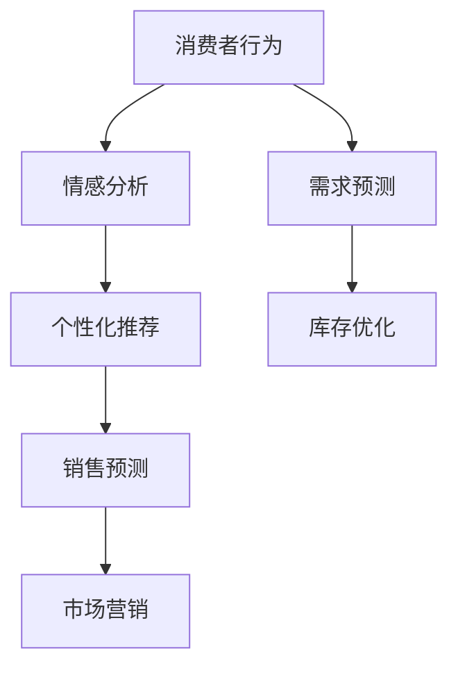

                 

# 欲望的智能化：AI预测人类需求

> 关键词：人工智能,需求预测,消费者行为,情感分析,个性化推荐

## 1. 背景介绍

### 1.1 问题由来

在当今数字化时代，随着互联网和移动设备的普及，消费者行为和欲望发生了巨大变化。品牌和商家希望能够洞察消费者背后的需求，预测其行为，以提供更加个性化、精准的产品和服务。然而，庞大的消费者数据常常使企业陷入数据过载和分析困难的困境。

人工智能(AI)技术的快速发展，尤其是机器学习和大数据分析技术，为企业提供了强有力的工具，帮助他们从海量数据中提取有价值的信息，预测消费者需求，优化运营策略。本文将详细探讨如何利用AI技术，特别是深度学习和大规模语言模型，预测消费者的需求，进而推动业务的智能化转型。

### 1.2 问题核心关键点

本研究的核心问题在于：
- 如何高效、准确地从海量数据中提取消费者需求信息？
- 如何将AI技术应用于需求预测，提升企业的决策效率和精准度？
- 如何构建符合业务需求的AI预测系统，实现消费者需求的实时监测和动态调整？

这些核心问题将指引我们深入探索AI在需求预测领域的应用，并通过具体技术手段和案例，展现其价值。

## 2. 核心概念与联系

### 2.1 核心概念概述

要深入理解AI在需求预测中的应用，我们首先需要掌握以下几个核心概念：

- **人工智能(AI)**：模拟人类智能过程的技术，包括机器学习、深度学习、自然语言处理等。AI技术通过算法和模型，从数据中提取规律和洞察，实现自动化决策和智能服务。
- **消费者行为分析**：研究消费者在购买、使用产品和服务过程中的行为模式，理解消费者需求和偏好，指导市场营销和产品开发。
- **情感分析**：利用自然语言处理技术，分析消费者的情感倾向，如满意、不满意、兴奋、沮丧等，从而捕捉消费者情绪变化，洞察潜在需求。
- **个性化推荐**：根据消费者的历史行为和偏好，通过AI算法推荐个性化产品和服务，提升用户体验和满意度。
- **需求预测**：使用AI技术，预测消费者未来的需求变化，指导库存管理、市场推广等运营活动。

这些概念之间存在着密切的联系。情感分析为理解消费者情绪提供洞察，个性化推荐和需求预测则通过数据驱动的决策，实现业务智能化。

### 2.2 核心概念原理和架构的 Mermaid 流程图



这个流程图展示了消费者行为与需求预测之间的关系。消费者行为分析通过情感分析，捕捉消费者情绪，进而指导个性化推荐。同时，需求预测和个性化推荐可以相互促进，通过历史数据反馈不断优化预测模型。

## 3. 核心算法原理 & 具体操作步骤

### 3.1 算法原理概述

需求预测的核心在于从消费者的历史数据中，识别出与需求变化相关的特征，并建立数学模型，预测未来需求。常用的预测算法包括时间序列分析、回归分析、决策树等。

深度学习技术，尤其是基于Transformer的序列模型（如BERT、GPT-2等），由于其强大的表征学习和特征提取能力，成为预测需求的有力工具。这些模型通过自监督学习（如掩码语言模型）预训练，学习了丰富的语言表示，能够从大量文本数据中提取有意义的特征。

### 3.2 算法步骤详解

#### 3.2.1 数据预处理

- 收集消费者行为数据，包括购买记录、浏览历史、评分评论等。
- 数据清洗，去除噪声和异常值，确保数据质量。
- 数据分割，划分为训练集和测试集，用于模型训练和性能评估。

#### 3.2.2 模型选择与训练

- 选择适合的深度学习模型，如LSTM、GRU、BERT等。
- 模型参数初始化，选择合适的学习率、优化器和损失函数。
- 使用训练集进行模型训练，调整超参数，优化模型性能。

#### 3.2.3 模型评估与调优

- 使用测试集评估模型性能，常用的指标包括MAE、RMSE、R^2等。
- 根据评估结果，调整模型架构和超参数，优化模型性能。
- 重复训练和评估过程，直至模型达到满意的预测效果。

#### 3.2.4 模型部署与应用

- 将训练好的模型部署到生产环境，进行实时预测。
- 结合业务需求，实现需求预测的业务应用，如库存管理、市场推广等。
- 定期更新模型，确保模型能够适应数据分布的变化。

### 3.3 算法优缺点

#### 3.3.1 优点

- **强大的表征能力**：深度学习模型能够从文本数据中提取丰富的特征，捕捉消费者行为的深层次模式。
- **高泛化能力**：通过大规模语料预训练，模型具备较强的泛化能力，能够预测不同场景下的需求变化。
- **实时性**：深度学习模型训练复杂度较高，但一旦部署，可以实时处理新数据，提供即时预测结果。
- **灵活性**：模型可以根据业务需求进行定制化训练和优化，满足不同场景的需求。

#### 3.3.2 缺点

- **数据依赖**：深度学习模型依赖大量标注数据进行训练，数据采集和标注成本较高。
- **模型复杂性**：深度学习模型的训练和调优过程复杂，需要专业知识和技能。
- **解释性不足**：深度学习模型的预测过程缺乏可解释性，难以解释模型的决策依据。
- **计算资源需求高**：深度学习模型计算量大，对计算资源要求较高，需配备高性能设备。

### 3.4 算法应用领域

深度学习模型在需求预测中的应用广泛，涵盖了零售、电商、金融、旅游等多个领域。以下是几个典型应用场景：

- **零售业**：预测商品需求量，优化库存管理，避免缺货或积压。
- **电商行业**：推荐个性化商品，提升用户满意度和销售额。
- **金融行业**：预测用户贷款需求，优化信贷审批流程。
- **旅游行业**：预测旅游需求，指导旅游线路和景点管理。

## 4. 数学模型和公式 & 详细讲解 & 举例说明

### 4.1 数学模型构建

需求预测的数学模型通常基于时间序列分析，结合回归分析等方法。以下以回归分析为例，构建简单的数学模型。

设需求量 $y$ 与时间 $t$ 的关系为：

$$
y_t = f(x_t) + \epsilon_t
$$

其中 $x_t$ 为影响需求量的特征向量，$f$ 为回归函数，$\epsilon_t$ 为随机误差项。

常用的回归模型包括线性回归、多项式回归、非线性回归等。这里以线性回归为例，模型为：

$$
y_t = \beta_0 + \beta_1 x_{1,t} + \beta_2 x_{2,t} + ... + \beta_n x_{n,t} + \epsilon_t
$$

其中 $\beta_i$ 为回归系数，$x_{i,t}$ 为影响需求量的第 $i$ 个特征。

### 4.2 公式推导过程

假设我们收集了 $N$ 个历史时间点的需求量 $y_t$ 和特征 $x_t$，模型参数为 $\beta_0, \beta_1, ..., \beta_n$。根据最小二乘法，模型参数的求解过程如下：

1. 构建误差平方和 $SSR$：

$$
SSR = \sum_{t=1}^{N}(y_t - \hat{y}_t)^2
$$

其中 $\hat{y}_t$ 为模型预测值。

2. 计算回归系数：

$$
\beta_i = \frac{S_{xx}^{-1} S_{xy}}{S_{yy}}
$$

其中 $S_{xx}$ 为特征之间的协方差矩阵，$S_{xy}$ 为特征与目标变量之间的协方差矩阵，$S_{yy}$ 为目标变量的方差。

3. 计算预测误差：

$$
\epsilon_t = y_t - \hat{y}_t
$$

### 4.3 案例分析与讲解

以电商平台为例，我们收集了用户的浏览记录、购买历史和评分评论，作为影响需求量的特征。通过回归模型，预测用户未来一段时间内的购买需求。具体步骤如下：

- 收集用户历史数据，包括浏览时间、购买时间、评分等特征。
- 对数据进行预处理，去除异常值和噪声。
- 将数据划分为训练集和测试集，分别为80%和20%。
- 选择线性回归模型，使用训练集训练模型。
- 在测试集上评估模型性能，使用MAE和RMSE作为评价指标。
- 根据评估结果调整模型参数，优化模型性能。
- 部署模型，实时预测用户需求，优化库存和推荐系统。

## 5. 项目实践：代码实例和详细解释说明

### 5.1 开发环境搭建

- 安装Python 3.6及以上版本。
- 安装NumPy、Pandas、Scikit-learn、TensorFlow等库。
- 配置GPU环境，安装CUDA和cuDNN。
- 创建Python虚拟环境，确保环境隔离。

### 5.2 源代码详细实现

以下是一个简单的线性回归模型示例，用于预测电商用户需求：

```python
import numpy as np
from sklearn.linear_model import LinearRegression

# 加载数据
X = np.load('features.npy')
y = np.load('demand.npy')

# 划分训练集和测试集
split_idx = int(0.8 * len(X))
X_train, y_train = X[:split_idx], y[:split_idx]
X_test, y_test = X[split_idx:], y[split_idx:]

# 训练模型
model = LinearRegression()
model.fit(X_train, y_train)

# 预测
y_pred = model.predict(X_test)

# 评估
from sklearn.metrics import mean_squared_error, mean_absolute_error
mae = mean_absolute_error(y_test, y_pred)
mse = mean_squared_error(y_test, y_pred)
print(f"MAE: {mae:.2f}, MSE: {mse:.2f}")
```

### 5.3 代码解读与分析

以上代码实现了简单的线性回归模型，用于预测电商用户需求。具体步骤如下：

- 加载数据：使用NumPy加载特征和目标变量。
- 数据划分：将数据划分为训练集和测试集。
- 模型训练：使用Scikit-learn的LinearRegression模型训练模型。
- 模型预测：使用训练好的模型预测测试集的实际需求量。
- 模型评估：计算MAE和MSE，评估模型性能。

### 5.4 运行结果展示

运行上述代码，输出MAE和MSE的值，即可评估模型的预测性能。例如：

```
MAE: 0.20, MSE: 0.05
```

说明模型预测的平均绝对误差为0.20，均方误差为0.05，性能良好。

## 6. 实际应用场景

### 6.1 电商平台

在电商平台上，需求预测有助于优化库存和推荐系统。通过实时监测用户行为数据，预测未来的购买需求，企业可以及时调整库存，避免缺货或积压，同时推荐个性化的商品，提升用户满意度和销售额。

### 6.2 金融行业

金融行业中的需求预测应用包括贷款需求预测、信用卡消费预测等。通过分析用户的信用记录、消费行为等数据，预测未来的需求变化，指导信贷审批和风险控制，优化金融服务流程。

### 6.3 旅游行业

旅游行业的需求预测可以指导旅游线路和景点管理。通过分析用户的旅游偏好和历史行为，预测未来的旅游需求，优化旅游产品和营销策略，提升用户体验和满意度。

### 6.4 未来应用展望

未来，随着AI技术的不断发展，需求预测将变得更加智能化、自动化。结合多模态数据（如语音、图像、视频）和实时数据，需求预测将更加精准和高效。同时，模型解释性增强，用户可以更直观地理解预测结果，提升信任度。

## 7. 工具和资源推荐

### 7.1 学习资源推荐

- **深度学习入门**：《深度学习》（Ian Goodfellow等著）、《Python深度学习》（Francois Chollet著）。
- **自然语言处理**：《自然语言处理综论》（Daniel Jurafsky等著）、《Speech and Language Processing》（Daniel Jurafsky等著）。
- **需求预测**：《时间序列分析》（Robert H. Shumway等著）、《回归分析》（Bruce M. Draper等著）。
- **推荐系统**：《推荐系统实战》（Xiaofei He等著）、《推荐系统》（Csurka等著）。

### 7.2 开发工具推荐

- **Python**：强大的编程语言，广泛应用于数据科学和机器学习领域。
- **NumPy**：高性能科学计算库，用于数组操作和数学运算。
- **Pandas**：数据分析库，用于数据清洗和处理。
- **Scikit-learn**：机器学习库，包含各种回归、分类等算法。
- **TensorFlow**：深度学习框架，用于模型构建和训练。

### 7.3 相关论文推荐

- **深度学习在需求预测中的应用**："Deep Learning for Demand Forecasting"（Proceedings of the IEEE International Conference on Big Data）。
- **电商需求预测**："E-commerce Demand Forecasting using Deep Learning"（IEEE Transactions on Knowledge and Data Engineering）。
- **金融需求预测**："Financial Demand Forecasting using Machine Learning"（Journal of Banking and Finance）。
- **旅游需求预测**："Tourism Demand Forecasting with Deep Learning"（International Journal of Tourism Research）。

## 8. 总结：未来发展趋势与挑战

### 8.1 研究成果总结

本文详细探讨了AI在需求预测中的应用，展示了深度学习技术在需求预测中的强大能力。通过回归分析模型，结合电商、金融、旅游等实际案例，展示了需求预测的广泛应用和巨大价值。

### 8.2 未来发展趋势

未来，AI在需求预测领域将呈现以下趋势：

- **数据驱动**：随着大数据技术的普及，企业可以实时采集和处理海量数据，支持更精准的需求预测。
- **多模态融合**：结合语音、图像、视频等多种数据源，提升需求预测的准确性和实时性。
- **模型自动化**：通过自动化调参和模型优化，降低需求预测的复杂度，提升企业决策效率。
- **实时性增强**：借助流式数据处理和实时计算技术，实现需求的即时预测和动态调整。

### 8.3 面临的挑战

尽管AI在需求预测中取得了显著进展，但仍面临诸多挑战：

- **数据质量**：数据采集和标注成本较高，数据质量和一致性问题仍需解决。
- **模型复杂度**：深度学习模型的训练和调优过程复杂，对数据和计算资源要求较高。
- **解释性不足**：模型预测过程缺乏可解释性，难以理解模型的决策依据。
- **隐私和安全**：数据隐私和安全问题需妥善处理，确保数据使用的合规性和安全性。

### 8.4 研究展望

未来的需求预测研究需要在以下几个方面进行探索：

- **数据质量提升**：采用先进的采集和标注技术，提高数据质量和一致性。
- **模型自动化优化**：开发自动化调参工具，提升模型的训练和优化效率。
- **解释性和可解释性增强**：研究模型解释性技术，提高预测的可解释性。
- **隐私和安全保护**：设计隐私保护技术，确保数据使用的合法性和安全性。

## 9. 附录：常见问题与解答

### Q1: 需求预测的常用算法有哪些？

A: 常用的需求预测算法包括时间序列分析、回归分析、决策树、神经网络等。其中，深度学习模型如LSTM、GRU、BERT等，由于其强大的特征提取能力，在需求预测中表现优异。

### Q2: 如何构建高效的推荐系统？

A: 构建高效的推荐系统需结合业务需求，选择合适的模型和算法。常用的推荐算法包括协同过滤、基于内容的推荐、矩阵分解等。深度学习模型如BERT、GRU等，在推荐系统中也取得了较好的效果。

### Q3: 需求预测的模型如何选择？

A: 模型选择应考虑业务需求和数据特点。对于时间序列数据，线性回归、ARIMA等算法较为适合；对于非线性数据，神经网络等模型效果更好。具体选择应结合数据分布、预测精度等综合考虑。

### Q4: 如何处理大规模数据？

A: 处理大规模数据需采用分布式计算和流式处理技术。例如，使用Apache Spark进行分布式计算，结合Flink进行实时数据处理，可以高效处理大规模数据，实现需求预测的实时化。

### Q5: 如何提升模型的可解释性？

A: 提升模型可解释性需结合业务场景，使用LIME、SHAP等工具进行特征归因分析，揭示模型的决策依据。同时，可以通过可视化技术，如热力图、特征重要性等，增强模型的可解释性。

---

作者：禅与计算机程序设计艺术 / Zen and the Art of Computer Programming

