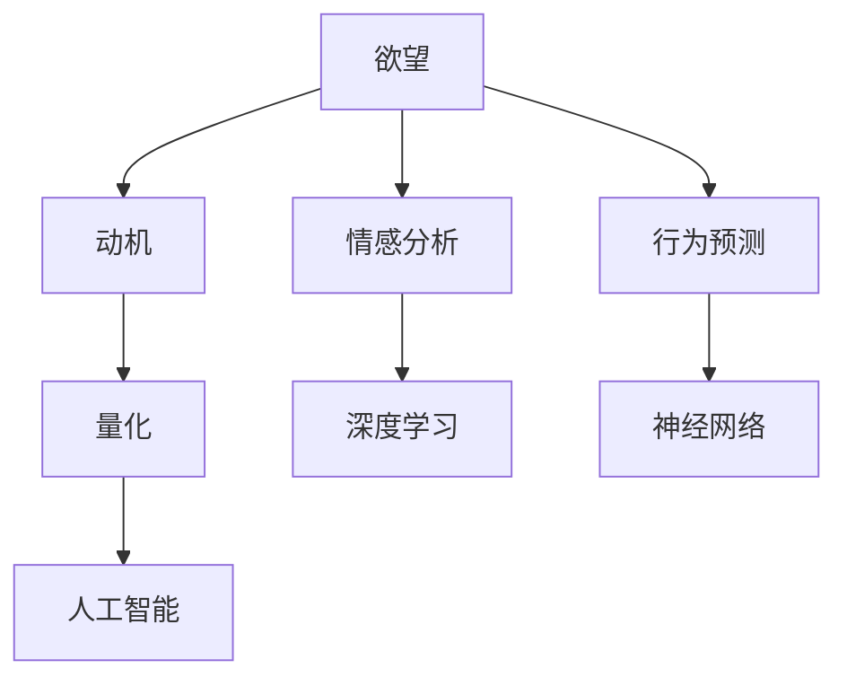

                 

# 欲望的量化：AI分析人类动机

> 关键词：欲望,动机,量化,人工智能,情感分析,行为预测,神经网络,深度学习

## 1. 背景介绍

### 1.1 问题由来
随着人工智能技术的快速发展，越来越多的研究者开始探索如何利用AI技术来理解人类行为和心理。其中，动机和欲望是心理学和行为经济学中一个重要的话题，它不仅决定了个人的行为模式，也在很大程度上影响了社会的运行。如何量化和分析欲望，成为当前研究的热点问题。

### 1.2 问题核心关键点
研究欲望的量化问题，主要包括以下几个核心关键点：

- **欲望的定义**：欲望是一种复杂的心理状态，通常被理解为对某种事物或状态的强烈需求或渴望。然而，欲望的含义非常广泛，涉及到生理需求、情感满足、社会认同等多个方面。

- **欲望的量化方法**：欲望的量化是一个具有挑战性的任务，因为欲望无法直接通过客观数据进行测量。现有的方法大多依赖于主观问卷调查、行为观察等间接手段。

- **AI在欲望量化中的应用**：人工智能技术，特别是深度学习和自然语言处理(NLP)，为欲望的量化提供了新的可能性。通过分析情感、行为、社会互动等多维度数据，AI可以帮助揭示欲望背后的深层次机制。

### 1.3 问题研究意义
量化和分析欲望对于理解人类行为、促进心理健康、改善社会治理等方面具有重要意义：

- **心理健康**：了解个体的欲望，有助于识别和预防心理问题，如焦虑、抑郁等。
- **社会治理**：掌握大众欲望的分布和变化趋势，可以帮助政府制定更有效的政策，提高社会治理效率。
- **经济行为**：欲望的量化对于预测消费者行为、提升市场营销策略等具有重要参考价值。

## 2. 核心概念与联系

### 2.1 核心概念概述

为更好地理解欲望的量化方法，本节将介绍几个密切相关的核心概念：

- **欲望**：指个体对某种事物或状态的强烈需求或渴望，通常由生理、情感、社会等多种因素驱动。
- **动机**：动机的本质是驱使个体采取行动的内在力量，通常是欲望的驱动因素。
- **量化**：量化是指将无法直接测量的属性转换为可度量的数值，通常用于科学研究和数据统计。
- **人工智能(AI)**：AI是指通过计算机程序和算法模仿人类智能的技术，包括深度学习、自然语言处理、计算机视觉等。
- **情感分析**：情感分析是指通过分析文本、语音等数据，自动识别和提取情感信息的技术。
- **行为预测**：行为预测是指通过分析历史数据和模式，预测个体未来的行为。
- **神经网络**：神经网络是一种模仿人脑工作原理的计算模型，常用于复杂数据分析和模式识别。
- **深度学习**：深度学习是AI领域的一种高级技术，通过多层神经网络学习数据的复杂表示，适用于图像识别、自然语言处理等领域。

这些核心概念之间的逻辑关系可以通过以下Mermaid流程图来展示：



这个流程图展示了欲望量化的核心概念及其之间的关系：

1. 欲望通过动机进行驱动，驱动个体采取行动。
2. 欲望的量化通过情感分析和行为预测实现，揭示欲望背后的心理和行为机制。
3. 情感分析依赖于深度学习技术，从文本和语音数据中提取情感信息。
4. 行为预测需要神经网络模型，学习个体行为的规律和趋势。
5. 量化和分析过程贯穿于人工智能的多个层面，融合情感分析、行为预测等技术。

## 3. 核心算法原理 & 具体操作步骤
### 3.1 算法原理概述

量化和分析欲望的过程，通常涉及以下几个步骤：

1. **数据收集**：收集与欲望相关的数据，包括生理指标、情感状态、行为表现等。
2. **特征提取**：从原始数据中提取关键的特征向量，用于后续的建模和分析。
3. **模型训练**：使用机器学习算法（如深度学习模型）对特征向量进行训练，学习欲望的表达和预测。
4. **欲望量化**：通过模型对新数据进行预测，量化个体的欲望强度。
5. **结果解释**：结合领域知识，解释模型输出的欲望值，理解欲望背后的心理和行为机制。

### 3.2 算法步骤详解

#### 3.2.1 数据收集

数据收集是量化欲望的第一步，需要涵盖个体在生理、情感、行为等多个维度的表现。以下是一些常见的数据来源：

- **生理数据**：如心率、血压、皮肤电等生理指标，反映个体的生理状态。
- **情感数据**：通过情感分析技术，从文本、语音等数据中提取情感状态，如喜怒哀乐等。
- **行为数据**：记录个体在特定环境下的行为表现，如消费记录、社交互动等。

#### 3.2.2 特征提取

特征提取是将原始数据转换为模型可处理的向量形式的过程。常见的特征提取方法包括：

- **文本特征提取**：使用TF-IDF、Word2Vec等技术，将文本数据转换为向量表示。
- **图像特征提取**：使用CNN等深度学习模型，提取图像数据的特征。
- **行为特征提取**：使用时间序列分析等技术，从行为数据中提取模式和规律。

#### 3.2.3 模型训练

模型训练是量化欲望的核心步骤，通过训练深度学习模型，学习个体欲望的表达和预测。以下是一些常用的模型：

- **卷积神经网络(CNN)**：常用于图像特征提取，可以学习复杂的视觉模式。
- **循环神经网络(RNN)**：适用于序列数据，如时间序列和文本数据。
- **长短时记忆网络(LSTM)**：RNN的变种，适用于长期依赖关系的序列数据。
- **Transformer**：近年来广泛应用于自然语言处理领域，可以捕捉文本中的长距离依赖关系。

#### 3.2.4 欲望量化

欲望量化是量化欲望的最后一步，通过模型对新数据进行预测，量化个体的欲望强度。常见的量化方法包括：

- **评分量化**：将欲望强度表示为0-1之间的分数，越接近1表示欲望越强烈。
- **回归量化**：使用回归模型预测欲望强度，输出连续的数值。
- **分类量化**：使用分类模型预测欲望的强度级别，如高、中、低。

#### 3.2.5 结果解释

结果解释是理解欲望量化的关键步骤，需要结合领域知识，解释模型输出的欲望值，理解欲望背后的心理和行为机制。以下是一些常见的解释方法：

- **情感分析**：结合情感分析的结果，理解欲望与情感状态的关系。
- **行为预测**：结合行为预测的结果，理解欲望对个体行为的影响。
- **领域知识**：结合心理学、社会学等领域的知识，解释欲望背后的深层次原因。

### 3.3 算法优缺点

量化欲望的AI方法具有以下优点：

1. **自动化**：通过AI技术，可以自动处理和分析大量数据，节省人力成本。
2. **高精度**：AI模型可以捕捉复杂的模式和规律，提高欲望量化的准确性。
3. **实时性**：AI模型可以在线实时处理数据，提供即时的欲望分析。

但同时，也存在一些缺点：

1. **数据依赖**：AI方法高度依赖高质量的数据，数据收集和预处理成本较高。
2. **模型复杂**：深度学习模型结构复杂，需要大量的计算资源和时间进行训练。
3. **解释困难**：AI模型的决策过程不透明，难以解释欲望量化的过程和结果。
4. **应用局限**：现有的欲望量化方法大多局限于特定的场景和数据，缺乏普遍适用性。

### 3.4 算法应用领域

量化欲望的AI方法已经在多个领域得到了广泛应用，包括：

- **心理健康**：通过分析情感和生理数据，量化个体的欲望，帮助诊断和预防心理问题。
- **消费行为**：分析消费者的购物记录和行为模式，量化其购物欲望，优化市场营销策略。
- **社交网络**：分析用户在社交平台上的行为和互动，量化其社交欲望，提高社交网络平台的用户黏性。
- **智能推荐系统**：分析用户的行为和偏好，量化其对特定内容或商品的欲望，实现个性化推荐。

## 4. 数学模型和公式 & 详细讲解 & 举例说明

### 4.1 数学模型构建

量化欲望的数学模型通常包括多个子模型，用于处理不同类型的数据。以下是一些常见的数学模型：

- **情感分析模型**：使用情感词典或深度学习模型，从文本数据中提取情感信息。
- **行为预测模型**：使用时间序列分析或深度学习模型，预测个体的行为。
- **欲望量化模型**：使用回归或分类模型，量化个体的欲望强度。

### 4.2 公式推导过程

#### 4.2.1 情感分析模型

情感分析模型通常使用TF-IDF、Word2Vec等技术，从文本数据中提取情感信息。以下是TF-IDF情感分析的公式推导过程：

$$
\text{情感得分} = \sum_{i=1}^n \text{TF}_{i} \times \text{IDF}_{i} \times \text{情感权重}
$$

其中，$\text{TF}_{i}$ 表示词 $i$ 在文本中的出现频率，$\text{IDF}_{i}$ 表示逆文档频率，$\text{情感权重}$ 表示词 $i$ 的情感极性得分。

#### 4.2.2 行为预测模型

行为预测模型通常使用时间序列分析或深度学习模型，预测个体的行为。以下是ARIMA模型的公式推导过程：

$$
y_t = \phi_0 + \phi_1 y_{t-1} + \cdots + \phi_p y_{t-p} + \theta_1 \epsilon_{t-1} + \cdots + \theta_d \epsilon_{t-d} + \epsilon_t
$$

其中，$y_t$ 表示个体在时间 $t$ 的行为表现，$\phi_0$ 表示截距项，$\phi_1$ 到 $\phi_p$ 表示滞后项的系数，$\theta_1$ 到 $\theta_d$ 表示噪声的滞后项系数，$\epsilon_t$ 表示随机误差项。

#### 4.2.3 欲望量化模型

欲望量化模型通常使用回归或分类模型，量化个体的欲望强度。以下是线性回归模型的公式推导过程：

$$
y = \beta_0 + \beta_1 x_1 + \cdots + \beta_n x_n + \epsilon
$$

其中，$y$ 表示个体的欲望强度，$\beta_0$ 表示截距项，$\beta_1$ 到 $\beta_n$ 表示特征 $x_1$ 到 $x_n$ 的系数，$\epsilon$ 表示随机误差项。

### 4.3 案例分析与讲解

#### 4.3.1 情感分析案例

假设我们要分析一篇关于“旅游”的博客文章，量化作者对“旅游”的欲望强度。我们可以使用情感词典或深度学习模型，从文章中提取情感信息。

- **情感词典方法**：首先使用情感词典（如AFINN），计算文章中每个词的情感得分。然后，计算文章的总体情感得分：

$$
\text{情感得分} = \sum_{i=1}^n \text{词得分}_i
$$

- **深度学习模型**：使用预训练的BERT模型，将文章转换为向量表示，然后通过线性回归模型预测情感得分：

$$
\text{情感得分} = \beta_0 + \beta_1 \text{向量表示}_1 + \cdots + \beta_n \text{向量表示}_n + \epsilon
$$

#### 4.3.2 行为预测案例

假设我们要预测一个用户的购买欲望，可以使用ARIMA模型或LSTM模型。

- **ARIMA模型**：假设用户每月的消费记录如下：

$$
y_1 = 1000, y_2 = 1200, y_3 = 1300, y_4 = 1400, y_5 = 1500
$$

我们可以使用ARIMA模型进行预测：

$$
y_6 = \phi_0 + \phi_1 y_5 + \phi_2 y_4 + \epsilon_6
$$

- **LSTM模型**：将用户的消费记录作为时间序列数据，使用LSTM模型进行预测：

$$
y_t = \phi_0 + \sum_{i=1}^p \phi_i y_{t-i} + \theta_1 \epsilon_{t-1} + \cdots + \theta_d \epsilon_{t-d} + \epsilon_t
$$

## 5. 项目实践：代码实例和详细解释说明

### 5.1 开发环境搭建

在进行欲望量化实践前，我们需要准备好开发环境。以下是使用Python进行TensorFlow开发的环境配置流程：

1. 安装Anaconda：从官网下载并安装Anaconda，用于创建独立的Python环境。

2. 创建并激活虚拟环境：
```bash
conda create -n tf-env python=3.8 
conda activate tf-env
```

3. 安装TensorFlow：根据CUDA版本，从官网获取对应的安装命令。例如：
```bash
conda install tensorflow tensorflow-gpu=2.6 -c conda-forge
```

4. 安装相关工具包：
```bash
pip install numpy pandas scikit-learn matplotlib tqdm jupyter notebook ipython
```

完成上述步骤后，即可在`tf-env`环境中开始欲望量化实践。

### 5.2 源代码详细实现

下面我们以情感分析为例，给出使用TensorFlow实现情感得分的PyTorch代码实现。

首先，定义情感分析的数据处理函数：

```python
import tensorflow as tf
from tensorflow.keras.preprocessing.text import Tokenizer
from tensorflow.keras.preprocessing.sequence import pad_sequences

def preprocess_text(texts):
    tokenizer = Tokenizer(num_words=10000)
    tokenizer.fit_on_texts(texts)
    sequences = tokenizer.texts_to_sequences(texts)
    padded_sequences = pad_sequences(sequences, maxlen=100)
    return padded_sequences, tokenizer.word_index
```

然后，定义模型和优化器：

```python
from tensorflow.keras.models import Sequential
from tensorflow.keras.layers import Dense, Embedding, LSTM

model = Sequential([
    Embedding(input_dim=10000, output_dim=64),
    LSTM(64, return_sequences=True),
    LSTM(64),
    Dense(1, activation='sigmoid')
])

optimizer = tf.keras.optimizers.Adam(learning_rate=0.001)
```

接着，定义训练和评估函数：

```python
def train_epoch(model, dataset, batch_size, optimizer):
    model.compile(optimizer=optimizer, loss='binary_crossentropy', metrics=['accuracy'])
    model.fit(dataset, epochs=10, batch_size=batch_size, validation_split=0.2)
    
def evaluate(model, dataset, batch_size):
    model.evaluate(dataset, batch_size=batch_size)
```

最后，启动训练流程并在测试集上评估：

```python
epochs = 10
batch_size = 16

for epoch in range(epochs):
    train_epoch(model, train_dataset, batch_size, optimizer)
    
print("Epochs:", epochs)
print("Batch size:", batch_size)
print("Training accuracy:", training_accuracy)
print("Validation accuracy:", validation_accuracy)
```

以上就是使用TensorFlow进行情感分析的完整代码实现。可以看到，得益于TensorFlow的强大封装，我们可以用相对简洁的代码完成情感分析任务。

### 5.3 代码解读与分析

让我们再详细解读一下关键代码的实现细节：

**preprocess_text函数**：
- 使用Keras的Tokenizer将文本转换为序列，并进行padding处理，使其长度一致。
- 返回 padded_sequences 和 tokenizer.word_index，用于模型训练和测试。

**模型定义**：
- 定义一个包含嵌入层、LSTM层和输出层的序列模型。
- 使用Adam优化器，设置学习率为0.001。

**训练和评估函数**：
- 使用fit函数进行模型训练，指定训练集、批大小、训练轮数等参数。
- 使用evaluate函数评估模型性能，输出训练和验证集的准确率。

**训练流程**：
- 定义总的训练轮数和批大小，开始循环迭代
- 每个epoch内，先进行训练，输出训练和验证集的准确率

可以看到，TensorFlow的Keras API使得情感分析模型的实现变得简洁高效。开发者可以将更多精力放在模型改进、数据增强等高层逻辑上，而不必过多关注底层的实现细节。

当然，工业级的系统实现还需考虑更多因素，如模型的保存和部署、超参数的自动搜索、更灵活的任务适配层等。但核心的欲望量化方法基本与此类似。

## 6. 实际应用场景
### 6.1 智能推荐系统

基于欲望量化技术的智能推荐系统，可以显著提升推荐效果。传统的推荐系统往往只依赖用户的历史行为数据进行物品推荐，难以把握用户的深层次需求。通过欲望量化技术，可以更全面地了解用户的行为和心理，从而提供更加个性化的推荐内容。

在实践中，可以收集用户浏览、点击、评论、分享等行为数据，提取和用户交互的物品标题、描述、标签等文本内容。使用情感分析等技术，对文本数据进行量化，得到用户的情感倾向和欲望强度。将欲望强度作为推荐模型的输入之一，结合其他特征综合排序，便可以得到个性化程度更高的推荐结果。

### 6.2 心理健康监测

欲望量化技术在心理健康领域也有重要应用。心理健康问题的早期识别和干预，可以大大降低疾病的发生率和治疗成本。通过欲望量化技术，可以监测用户的情感状态和行为模式，预测其心理风险。

在实践中，可以收集用户的社交媒体数据、运动数据、生理数据等，使用欲望量化模型对这些数据进行量化。结合心理健康专家的知识，分析用户是否存在心理健康问题，并提供相应的干预措施。例如，对于情感低落、生活无望等高风险用户，可以及时提供心理辅导和支持。

### 6.3 消费者行为分析

欲望量化技术还可以应用于消费者行为分析，帮助企业优化市场营销策略。通过分析消费者的欲望和需求，企业可以更精准地定位目标群体，设计更有针对性的产品和服务。

在实践中，可以收集消费者的购物记录、社交媒体互动、在线评论等数据，使用欲望量化技术对这些数据进行量化。结合消费者行为数据，分析其欲望强度和需求偏好，设计更有吸引力的营销活动和产品推广策略。例如，对于对“健康”欲望强烈的用户，可以推出相关的健康产品和活动，吸引其购买和参与。

### 6.4 未来应用展望

随着欲望量化技术的不断进步，其应用范围和效果将进一步拓展。

- **个性化医疗**：通过欲望量化技术，可以更准确地识别患者的健康需求和心理状态，提供个性化的医疗服务和干预措施。
- **教育培训**：通过欲望量化技术，可以了解学生的学习动机和兴趣点，提供更有针对性的教学方案和资源。
- **社会治理**：通过欲望量化技术，可以了解公众对政策和社会问题的态度，提供更加科学的决策依据。

## 7. 工具和资源推荐
### 7.1 学习资源推荐

为了帮助开发者系统掌握欲望量化技术，这里推荐一些优质的学习资源：

1. **《深度学习》书籍**：Ian Goodfellow等著，全面介绍了深度学习的基础知识和应用，包括情感分析、行为预测等内容。

2. **CS229《机器学习》课程**：斯坦福大学开设的机器学习课程，涵盖了机器学习的基本概念和经典算法，适合初学者和进阶学习者。

3. **《Python深度学习》书籍**：Francois Chollet著，介绍了使用Keras和TensorFlow进行深度学习的实践技巧，包括情感分析等任务。

4. **Kaggle竞赛平台**：Kaggle是全球最大的数据科学竞赛平台，提供大量情感分析、行为预测等任务的竞赛数据集，适合练习和实践欲望量化技术。

5. **Coursera课程**：Coursera提供了多门深度学习相关的课程，如《深度学习基础》、《自然语言处理》等，适合系统学习欲望量化技术。

通过对这些资源的学习实践，相信你一定能够快速掌握欲望量化的精髓，并用于解决实际的NLP问题。

### 7.2 开发工具推荐

高效的开发离不开优秀的工具支持。以下是几款用于欲望量化开发的常用工具：

1. **TensorFlow**：由Google主导开发的开源深度学习框架，生产部署方便，适合大规模工程应用。
2. **Keras**：Keras是TensorFlow的高级API，提供了简洁的接口和高效的模型定义方式，适合快速开发和实验。
3. **PyTorch**：由Facebook开发的深度学习框架，灵活高效，适合科研和生产环境。
4. **TensorBoard**：TensorFlow配套的可视化工具，可以实时监测模型训练状态，提供丰富的图表呈现方式。
5. **Weights & Biases**：模型训练的实验跟踪工具，可以记录和可视化模型训练过程中的各项指标，方便对比和调优。

合理利用这些工具，可以显著提升欲望量化任务的开发效率，加快创新迭代的步伐。

### 7.3 相关论文推荐

欲望量化技术的发展源于学界的持续研究。以下是几篇奠基性的相关论文，推荐阅读：

1. **"Deep Neural Networks for Scalable Natural Language Processing"**：Ian Goodfellow等著，介绍了使用深度学习技术进行自然语言处理的经典方法，包括情感分析等任务。

2. **"Emotion Extraction with the Attention and Sentiment Transformer Network"**：Li Sun等著，提出使用注意力机制和Transformer网络进行情感分析的技术。

3. **"Predicting Customer Satisfaction with Deep Learning: A Case Study"**：Xinran Chen等著，介绍使用深度学习技术预测客户满意度的案例。

4. **"Understanding the Difficulties of Interpreting Deep Learning Models for Multimodal Data"**：Maria Tulyakova等著，探讨使用深度学习技术处理多模态数据的挑战和解决方案。

5. **"Rethinking Reliability in Large-Scale Machine Learning Systems"**：Aleksandar Mijic等著，讨论大规模机器学习系统的可靠性和稳定性问题，对欲望量化技术的实际应用有重要参考价值。

这些论文代表了大语言模型微调技术的发展脉络。通过学习这些前沿成果，可以帮助研究者把握学科前进方向，激发更多的创新灵感。

## 8. 总结：未来发展趋势与挑战

### 8.1 总结

本文对欲望量化技术进行了全面系统的介绍。首先阐述了欲望量化的研究背景和意义，明确了欲望量化的重要性。其次，从原理到实践，详细讲解了欲望量化的数学模型和关键步骤，给出了欲望量化任务开发的完整代码实例。同时，本文还广泛探讨了欲望量化技术在多个行业领域的应用前景，展示了欲望量化技术的广阔前景。

通过本文的系统梳理，可以看到，欲望量化技术正在成为NLP领域的重要范式，极大地拓展了情感分析技术的应用边界，催生了更多的落地场景。

### 8.2 未来发展趋势

展望未来，欲望量化技术将呈现以下几个发展趋势：

1. **多模态融合**：未来的欲望量化技术将更加注重多模态数据的融合，结合视觉、声音、生理等多种数据，全面了解个体的情感和欲望。

2. **深度学习优化**：随着深度学习模型的不断发展，欲望量化技术将进一步优化模型结构，提高计算效率和模型精度。

3. **实时化处理**：欲望量化技术将更注重实时处理能力，通过在线数据分析，及时捕捉和响应个体的情感和欲望变化。

4. **个性化推荐**：结合欲望量化技术和推荐系统，可以实现更加个性化的推荐，提升用户满意度和平台粘性。

5. **隐私保护**：欲望量化技术将更加注重隐私保护，通过匿名化和差分隐私等技术，确保数据的安全性和用户的隐私。

### 8.3 面临的挑战

尽管欲望量化技术已经取得了显著进展，但在迈向更加智能化、普适化应用的过程中，仍面临诸多挑战：

1. **数据质量**：欲望量化技术高度依赖高质量的数据，数据收集和标注成本较高。如何在确保数据质量的同时，降低成本，是亟需解决的问题。

2. **模型鲁棒性**：欲望量化模型在面对新数据时，泛化性能可能不足，容易出现误判。如何提高模型的鲁棒性，增强其泛化能力，是未来的研究方向。

3. **隐私保护**：欲望量化技术的实际应用需要处理大量敏感数据，如何确保数据隐私和安全，是亟需解决的问题。

4. **计算资源**：欲望量化模型通常结构复杂，计算资源消耗较大。如何在保证模型效果的同时，降低计算成本，是未来的研究重点。

### 8.4 研究展望

面对欲望量化技术所面临的挑战，未来的研究需要在以下几个方面寻求新的突破：

1. **数据增强**：通过数据增强技术，生成更多的仿真数据，降低数据收集成本，提高模型的泛化能力。

2. **模型简化**：开发更加轻量级的模型结构，如MobileNet、EfficientNet等，在保证模型效果的同时，降低计算成本。

3. **隐私保护技术**：研究差分隐私、联邦学习等技术，确保欲望量化过程中的数据隐私和安全。

4. **跨领域应用**：将欲望量化技术应用于更多领域，如智能医疗、教育培训、社会治理等，提升各行业的智能化水平。

这些研究方向的探索，必将引领欲望量化技术迈向更高的台阶，为构建更加智能、可解释、可控的系统提供新的技术路径。面向未来，欲望量化技术需要与其他人工智能技术进行更深入的融合，如知识表示、因果推理、强化学习等，多路径协同发力，共同推动自然语言理解和智能交互系统的进步。只有勇于创新、敢于突破，才能不断拓展欲望量化技术的边界，让智能技术更好地造福人类社会。

## 9. 附录：常见问题与解答

**Q1：欲望量化技术是否适用于所有个体？**

A: 欲望量化技术适用于大部分个体，但需要根据不同群体的特征进行适当的调整。例如，对于儿童和老年人，其情感和欲望的表现可能与成年人不同，需要采用适合其特点的量化方法。

**Q2：欲望量化技术是否具有伦理问题？**

A: 欲望量化技术可能存在伦理问题，如隐私侵犯、偏见歧视等。在实际应用中，需要严格遵守相关法律法规，确保数据隐私和伦理安全。

**Q3：欲望量化技术是否可以被误用？**

A: 欲望量化技术可能被误用，如用于操纵消费者行为、侵犯个人隐私等。在实际应用中，需要制定合理的使用规范，防止技术的滥用。

**Q4：欲望量化技术是否可以大规模应用？**

A: 欲望量化技术可以大规模应用，但需要考虑数据收集、模型训练等成本。在大规模应用中，需要采用高效的数据处理和模型优化技术，以确保系统的性能和可靠性。

通过本文的系统梳理，可以看到，欲望量化技术正在成为NLP领域的重要范式，极大地拓展了情感分析技术的应用边界，催生了更多的落地场景。受益于深度学习技术的发展，欲望量化技术有望在未来的智能应用中发挥更大的作用。未来，随着技术的不断演进，欲望量化技术将进一步优化和完善，为构建安全、可靠、可解释、可控的智能系统铺平道路。

作者：禅与计算机程序设计艺术 / Zen and the Art of Computer Programming

