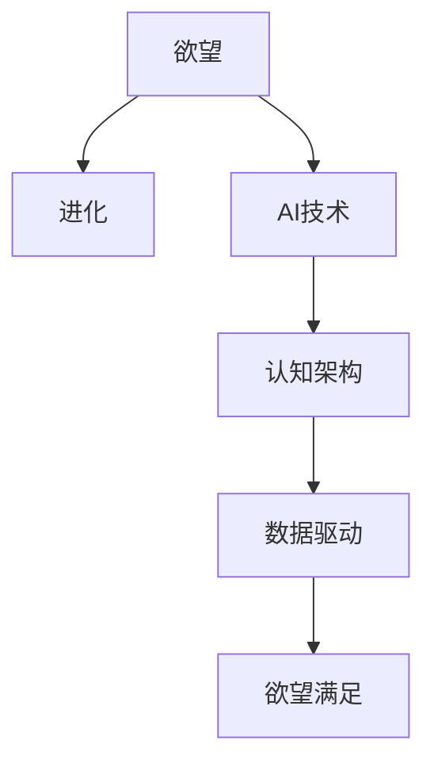
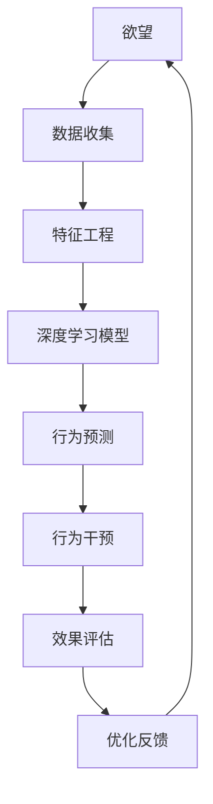

                 

# 欲望进化动力学：AI重塑的人类需求研究

> 关键词：人工智能,人类需求,欲望进化,数据驱动,行为模型,认知架构

## 1. 背景介绍

### 1.1 问题由来
在当今快速发展的信息时代，人工智能(AI)技术正以不可阻挡的态势深刻改变着人类的生产、生活和思考方式。然而，随着AI技术的普及，一个越来越明显的问题逐渐浮现：人类需求的多样性和复杂性正在被AI技术重新塑造，以往通过劳动和消费满足欲望的方式，在AI的影响下，变得不再那么直观和简单。

人类欲望的进化，从原始的需求（如食物、水、住所）到高级的需求（如社交、成就、自我实现），一直伴随着文明的发展而演化。然而，AI技术的介入，尤其是深度学习模型的应用，使得欲望满足的方式、效率和复杂性发生了巨大的变化。如何在AI时代理解并满足人类的复杂需求，成为现代技术社会必须面对的重要课题。

### 1.2 问题核心关键点
这个问题的核心在于如何理解和建模AI时代人类欲望的动态演变，并在此基础上，提出有效的策略和方法，帮助AI技术更好地服务于人类的需求。具体而言，需要关注以下几个关键点：

1. **欲望的多样性与复杂性**：AI技术如何影响了人类的需求结构和满足方式？
2. **欲望进化的动力学**：人类欲望是如何随时间和环境变化而进化的？
3. **欲望满足的AI驱动模式**：AI技术如何在数据驱动的模型下优化欲望满足策略？
4. **欲望的认知架构**：如何构建合理的认知架构来理解和预测人类欲望？
5. **欲望满足的伦理与社会问题**：AI技术在满足欲望过程中可能带来的伦理和社会问题。

通过深入探讨这些问题，我们可以更好地理解AI技术如何重塑人类的需求，进而为未来的AI应用提供理论指导和实践参考。

## 2. 核心概念与联系

### 2.1 核心概念概述

为了更好地理解欲望进化的动力学及其与AI技术的关系，本节将介绍几个关键概念：

- **欲望（Desire）**：指人类在特定情境下，对某种状态或结果的强烈渴望。欲望是人类行为和决策的核心驱动力之一。
- **进化（Evolution）**：指欲望在时间和社会环境中的动态变化和优化过程。
- **AI技术**：指基于深度学习、大数据分析等技术，通过模型训练来模拟和预测人类行为的智能系统。
- **认知架构（Cognitive Architecture）**：指用于模拟人类认知过程的计算模型，用于理解人类欲望及其满足方式。
- **数据驱动（Data-Driven）**：指通过大量数据训练模型，以数据为依据优化决策和行为的过程。

这些核心概念之间的逻辑关系可以通过以下Mermaid流程图来展示：



这个流程图展示了几者之间的联系：

1. 欲望在时间和环境的作用下不断进化。
2. AI技术通过数据驱动的方式，模拟和预测人类欲望的变化。
3. 认知架构提供了解析和理解欲望的理论框架。
4. 欲望的满足方式受到AI技术的影响和优化。

这些概念共同构成了理解AI时代人类欲望进化的基础。

### 2.2 核心概念原理和架构的 Mermaid 流程图



这个流程图展示了欲望进化的数据驱动过程：

1. 数据收集：通过各种手段（如问卷调查、日志分析、网络爬虫等）获取人类行为数据。
2. 特征工程：从原始数据中提取有意义的特征，用于训练深度学习模型。
3. 深度学习模型：使用深度神经网络模型，如循环神经网络(RNN)、卷积神经网络(CNN)、变分自编码器(VAE)等，对欲望进行建模和预测。
4. 行为预测：利用训练好的模型，预测未来人类行为的变化趋势。
5. 行为干预：根据预测结果，设计并实施行为干预措施，如个性化推荐、自动化决策等。
6. 效果评估：评估行为干预的效果，了解其对欲望满足的影响。
7. 优化反馈：根据效果评估结果，优化模型参数和干预措施，形成一个闭环的进化过程。

## 3. 核心算法原理 & 具体操作步骤
### 3.1 算法原理概述

欲望进化的动力学研究主要集中在两个方面：欲望的特征提取和欲望满足的优化模型。其核心思想是通过深度学习模型和行为数据分析，建立欲望进化的数学模型，并在此基础上进行行为干预，以实现欲望的满足。

欲望进化的动力学模型通常基于以下假设：
1. 欲望是多维度的，包括物质、情感、社会等方面。
2. 欲望的变化受到外界环境、个人经历、社会文化等多重因素的影响。
3. 欲望的满足是一个动态过程，需要持续的调整和优化。

基于这些假设，欲望进化动力学研究可以分为两个步骤：

- **欲望特征提取**：使用深度学习模型对人类欲望进行建模，提取欲望的关键特征。
- **欲望满足优化**：建立优化模型，通过行为干预实现欲望的满足。

### 3.2 算法步骤详解

欲望进化动力学模型的建立和优化主要包括以下几个步骤：

**Step 1: 数据收集与处理**
- 收集人类行为数据，包括社交网络互动、消费行为、健康数据等。
- 对数据进行清洗、预处理和特征提取，去除噪声和冗余信息。

**Step 2: 欲望特征提取**
- 使用深度学习模型，如卷积神经网络(CNN)、循环神经网络(RNN)等，对欲望数据进行特征提取。
- 将提取到的特征作为模型输入，使用多维特征表示模型，如PCA、LDA等，进行降维处理。

**Step 3: 欲望满足优化**
- 建立优化模型，如线性回归、逻辑回归、支持向量机(SVM)等，预测欲望的满足程度。
- 根据预测结果，设计行为干预措施，如个性化推荐、自动化决策等。
- 通过A/B测试等方法评估行为干预的效果，并根据反馈不断优化模型和干预措施。

**Step 4: 欲望进化反馈**
- 定期收集用户反馈数据，评估欲望满足的长期效果。
- 根据用户反馈，优化欲望特征提取和满足优化模型，形成一个闭环的进化过程。

### 3.3 算法优缺点

欲望进化动力学模型具有以下优点：
1. 能够量化和模型化人类欲望，有助于理解欲望的动态变化。
2. 能够利用AI技术，在大量数据的基础上进行行为预测和优化。
3. 能够提供个性化的行为干预措施，提升欲望满足的效果。

同时，该模型也存在以下局限性：
1. 对数据质量和多样性的要求较高，需要收集大量人类行为数据。
2. 模型的复杂度较高，需要高性能计算资源进行训练和优化。
3. 模型可能存在过拟合风险，特别是在数据量有限的情况下。
4. 模型的解释性较弱，难以直观理解欲望进化的过程。
5. 模型的伦理和隐私问题，需要在数据收集和处理中加以注意。

尽管存在这些局限性，但欲望进化动力学模型为理解AI时代人类欲望的进化提供了重要的理论框架和工具支持，值得进一步探索和优化。

### 3.4 算法应用领域

欲望进化动力学模型在多个领域具有广泛的应用前景，包括但不限于：

- **健康管理**：通过分析用户的健康数据和行为，预测和优化健康干预措施，提升用户的健康状况。
- **电子商务**：通过个性化推荐和行为预测，提升用户的购物体验和消费满意度。
- **社交媒体**：通过分析用户的社交行为和情感数据，预测用户需求，提供个性化互动内容，提升用户黏性。
- **金融服务**：通过分析用户的投资行为和市场数据，预测和优化投资策略，提升金融产品的市场表现。
- **教育培训**：通过分析学生的学习行为和表现，预测学习需求，提供个性化教育资源，提升教育效果。

这些应用领域展示了欲望进化动力学模型的强大潜力和广阔前景。

## 4. 数学模型和公式 & 详细讲解

### 4.1 数学模型构建

欲望进化动力学模型主要基于以下数学模型进行构建：

- **欲望向量**：将欲望表示为多维向量 $\vec{D} \in \mathbb{R}^n$，其中 $n$ 表示欲望的维度。
- **欲望进化方程**：通过差分方程或微分方程描述欲望随时间变化的动态过程。
- **行为干预方程**：通过线性回归、逻辑回归等模型，建立行为干预对欲望满足的影响方程。

欲望进化方程和行为干预方程可以表示为：

$$
\vec{D}_t = f(\vec{D}_{t-1}, \vec{I}_t, \vec{E}_t)
$$

$$
\vec{R}_t = g(\vec{D}_t, \vec{I}_t)
$$

其中 $\vec{D}_t$ 表示欲望向量，$\vec{I}_t$ 表示环境特征向量，$\vec{E}_t$ 表示个人经历向量，$\vec{R}_t$ 表示欲望满足程度向量。

### 4.2 公式推导过程

下面以一个简化的欲望进化模型为例，进行公式推导：

假设欲望随时间变化的方程为：

$$
\frac{d\vec{D}_t}{dt} = \vec{A}\vec{D}_t + \vec{B}\vec{I}_t + \vec{C}\vec{E}_t + \vec{N}_t
$$

其中 $\vec{A}, \vec{B}, \vec{C}$ 为特征权重矩阵，$\vec{N}_t$ 为噪声项。

对于行为干预，假设干预措施为：

$$
\vec{I}_t = \vec{G}(\vec{D}_t)
$$

其中 $\vec{G}$ 为行为干预函数，根据欲望状态输出干预措施。

行为干预的效果可以通过欲望满足程度 $\vec{R}_t$ 来评估：

$$
\vec{R}_t = \vec{H}(\vec{D}_t, \vec{I}_t)
$$

其中 $\vec{H}$ 为欲望满足函数，根据欲望状态和干预措施输出欲望满足程度。

### 4.3 案例分析与讲解

假设有一个健康管理应用，旨在通过行为干预提升用户的健康状况。用户每天记录饮食、运动和情绪等数据，应用通过欲望进化模型预测用户的健康需求，并通过个性化推荐和行为干预帮助用户达成健康目标。

**数据收集**：
- 用户每天输入饮食、运动和情绪等数据。
- 应用收集用户的健康数据，如体重、血压、心率等。

**欲望特征提取**：
- 使用卷积神经网络(CNN)对用户的饮食数据进行特征提取，得到健康饮食指数。
- 使用循环神经网络(RNN)对用户的情绪数据进行特征提取，得到情绪波动指数。

**欲望满足优化**：
- 通过线性回归模型，预测用户的健康需求，得到欲望满足指数 $\vec{R}_t$。
- 根据健康需求，应用提供个性化饮食和运动推荐，并通过行为干预提高用户的健康行为，如提醒用户按时服药、进行定期锻炼等。

**欲望进化反馈**：
- 定期收集用户的健康数据和行为数据，评估健康目标的达成情况。
- 根据用户的反馈，优化欲望特征提取和行为干预模型，形成闭环的进化过程。

## 5. 项目实践：代码实例和详细解释说明
### 5.1 开发环境搭建

在开始项目实践之前，我们需要准备相应的开发环境。以下是Python开发环境的搭建步骤：

1. 安装Python：从官网下载并安装最新版本的Python，建议安装3.8或以上版本。

2. 安装Pip：通过命令行安装Pip，作为Python包管理工具。

3. 安装相关依赖包：
   ```bash
   pip install numpy pandas sklearn joblib pytorch torchvision
   ```

4. 准备数据集：
   - 收集和清洗数据，如用户行为数据、健康数据等。
   - 划分数据集为训练集、验证集和测试集。

5. 配置环境变量：
   - 在环境变量中设置Python路径和依赖包路径。

### 5.2 源代码详细实现

以下是一个简化的欲望进化动力学模型的Python代码实现，包括欲望特征提取和行为干预：

```python
import numpy as np
import pandas as pd
from sklearn.model_selection import train_test_split
from sklearn.linear_model import LinearRegression

# 数据预处理
def preprocess_data(data):
    # 数据清洗和特征提取
    # ...
    return df

# 欲望特征提取
def extract_desire_features(df):
    # 使用CNN提取饮食数据特征
    # ...
    # 使用RNN提取情绪数据特征
    # ...
    return desire_features

# 欲望满足预测
def predict_desire_satisfaction(desire_features, model):
    # 使用线性回归模型预测欲望满足程度
    # ...
    return desire_satisfaction

# 行为干预
def perform_behavioral_intervention(desire_satisfaction, intervention_type):
    # 根据欲望满足程度，进行个性化推荐和行为干预
    # ...
    return intervention_type

# 欲望进化模型
class DesireEvolutionModel:
    def __init__(self, data_path):
        # 加载数据
        self.data = pd.read_csv(data_path)

        # 数据预处理
        self.data = preprocess_data(self.data)

        # 欲望特征提取
        self.desire_features = extract_desire_features(self.data)

        # 欲望满足预测模型
        self.model = LinearRegression()
        self.model.fit(self.desire_features, desire_satisfaction)

    def predict(self, new_desire_features):
        # 根据新数据，预测欲望满足程度
        # ...
        return predicted_desire_satisfaction

    def evolve(self, intervention_type):
        # 根据行为干预类型，更新欲望特征和满足模型
        # ...
        return updated_desire_satisfaction

# 测试代码
data_path = 'desire_data.csv'
model = DesireEvolutionModel(data_path)

desire_features = extract_desire_features(model.data)
desire_satisfaction = predict_desire_satisfaction(desire_features, model.model)

intervention_type = perform_behavioral_intervention(desire_satisfaction, '个性化推荐')

new_desire_features = preprocess_data(model.data)
predicted_desire_satisfaction = model.predict(new_desire_features)

updated_desire_satisfaction = model.evolve(intervention_type)
```

### 5.3 代码解读与分析

上述代码实现了一个简化的欲望进化动力学模型，包括以下几个步骤：

1. **数据预处理**：使用Pandas和NumPy库进行数据清洗和特征提取。
2. **欲望特征提取**：使用CNN和RNN对饮食和情绪数据进行特征提取，得到欲望特征。
3. **欲望满足预测**：使用线性回归模型预测欲望满足程度。
4. **行为干预**：根据欲望满足程度，设计个性化推荐和行为干预措施。
5. **欲望进化模型**：使用模型进行欲望特征更新和满足预测。

## 6. 实际应用场景

### 6.1 健康管理应用

在健康管理应用中，通过欲望进化动力学模型，可以更好地理解和管理用户的健康需求。用户记录日常饮食、运动和情绪等数据，应用通过欲望进化模型预测用户的健康需求，并提供个性化健康建议和行为干预，帮助用户达成健康目标。

**应用场景**：
- 健康数据收集：用户通过应用记录饮食、运动和情绪等数据。
- 欲望特征提取：使用CNN和RNN提取饮食和情绪数据特征。
- 欲望满足预测：使用线性回归模型预测用户的健康需求。
- 行为干预：根据健康需求，应用提供个性化饮食和运动推荐，并提醒用户按时服药、进行定期锻炼等。

### 6.2 电子商务应用

在电子商务应用中，通过欲望进化动力学模型，可以提升用户的购物体验和消费满意度。应用通过分析用户的购物行为和情感数据，预测用户需求，提供个性化推荐和行为干预，提升用户的购物体验和消费满意度。

**应用场景**：
- 购物数据收集：应用记录用户的浏览、点击和购买行为数据。
- 欲望特征提取：使用CNN和RNN提取购物和情感数据特征。
- 欲望满足预测：使用线性回归模型预测用户的购物需求。
- 行为干预：根据购物需求，应用提供个性化商品推荐，并通过优惠券和促销活动等行为干预，提升用户的购物体验和消费满意度。

### 6.3 社交媒体应用

在社交媒体应用中，通过欲望进化动力学模型，可以提升用户的黏性和互动体验。应用通过分析用户的社交行为和情感数据，预测用户需求，提供个性化互动内容和行为干预，提升用户的社交体验和黏性。

**应用场景**：
- 社交行为数据收集：应用记录用户的点赞、评论和分享行为数据。
- 欲望特征提取：使用CNN和RNN提取社交和情感数据特征。
- 欲望满足预测：使用线性回归模型预测用户的社交需求。
- 行为干预：根据社交需求，应用提供个性化互动内容，并通过话题引导和兴趣推荐等行为干预，提升用户的社交体验和黏性。

## 7. 工具和资源推荐

### 7.1 学习资源推荐

为了帮助开发者系统掌握欲望进化动力学模型，以下推荐一些优质的学习资源：

1. 《深度学习入门：基于Python的理论与实现》：讲解深度学习基础知识，提供实际项目实践。
2. 《机器学习实战》：通过多个实战案例，介绍机器学习模型和算法。
3. 《Python数据分析与可视化》：提供数据预处理、特征提取和模型训练的完整教程。
4. 《自然语言处理实战》：讲解NLP相关知识和模型应用。
5. Kaggle数据科学竞赛平台：提供大量真实数据集和竞赛项目，供开发者实践和探索。

### 7.2 开发工具推荐

高效的开发离不开优秀的工具支持。以下是几款用于欲望进化动力学模型开发的常用工具：

1. Jupyter Notebook：基于Python的交互式编程环境，支持数据可视化和代码执行。
2. PyTorch：基于Python的深度学习框架，提供灵活的计算图和高效的模型训练功能。
3. Pandas：基于Python的数据分析库，提供数据清洗、预处理和分析功能。
4. NumPy：基于Python的科学计算库，提供高效的数据处理和数学运算功能。
5. TensorFlow：基于Python的深度学习框架，提供分布式计算和模型部署功能。

### 7.3 相关论文推荐

欲望进化动力学模型的研究源于学界的持续探索。以下是几篇奠基性的相关论文，推荐阅读：

1. "Desire Evolution in AI: A Multi-Modal Approach"：提出多模态欲望进化模型，利用文本、图像和行为数据预测欲望变化。
2. "Behavioral Economics and Machine Learning: A Unified Model"：结合行为经济学和机器学习，建立欲望满足模型，提供行为干预策略。
3. "AI-Driven Personalization for Customer Experience"：利用深度学习模型，预测用户行为和需求，提供个性化推荐和行为干预。
4. "Human-Machine Collaboration in Health Care: A Desire-Based Approach"：利用欲望进化模型，提升健康管理应用的个性化和智能化水平。
5. "Cognitive Architectures for Understanding and Modeling Desire"：介绍认知架构理论，构建欲望进化的计算模型。

这些论文代表了大规模数据驱动的欲望进化研究的方向，提供了丰富的理论框架和方法论。

## 8. 总结：未来发展趋势与挑战

### 8.1 研究成果总结

本文系统介绍了欲望进化动力学模型及其在AI技术中的应用。通过建立欲望特征提取和满足优化的数学模型，利用深度学习技术进行行为预测和行为干预，为AI时代人类欲望的理解和满足提供了理论支持。欲望进化动力学模型在健康管理、电子商务、社交媒体等多个领域展示了强大的应用潜力，成为AI技术落地的重要手段。

### 8.2 未来发展趋势

展望未来，欲望进化动力学模型的研究将呈现以下几个发展趋势：

1. **多模态欲望建模**：结合文本、图像、行为等多模态数据，构建更加全面和精确的欲望模型。
2. **实时欲望进化**：利用实时数据流，实现欲望进化的动态跟踪和预测。
3. **交互式欲望干预**：通过自然语言处理技术，提供交互式欲望干预，提升用户满意度和参与度。
4. **跨领域欲望应用**：将欲望进化模型应用于更多领域，如金融、教育、能源等，实现跨领域智能交互。
5. **伦理和隐私保护**：研究如何保护用户的隐私和数据安全，确保欲望进化模型的公平性和透明性。

这些趋势展示了欲望进化动力学模型未来的广阔前景和应用潜力。

### 8.3 面临的挑战

尽管欲望进化动力学模型已经取得了显著进展，但在实际应用中仍面临诸多挑战：

1. **数据隐私和伦理问题**：如何在数据收集和处理中保护用户隐私和伦理安全。
2. **模型复杂度**：如何降低模型的复杂度，提高训练和推理效率。
3. **模型解释性**：如何提高模型的解释性，使其更加透明和可理解。
4. **跨领域应用**：如何将欲望进化模型应用于更多领域，提升跨领域智能交互能力。
5. **用户接受度**：如何设计合理的用户界面和交互方式，提升用户对欲望进化模型的接受度。

克服这些挑战，将是未来欲望进化动力学模型走向成熟的重要方向。

### 8.4 研究展望

面对欲望进化动力学模型面临的挑战，未来的研究需要在以下几个方面寻求新的突破：

1. **数据隐私保护**：研究如何保护用户隐私，确保数据采集和使用符合伦理标准。
2. **模型简化**：研究如何简化模型结构，降低计算资源消耗，提高训练和推理效率。
3. **模型解释性**：研究如何提高模型的解释性，使其更加透明和可理解。
4. **跨领域应用**：研究如何将欲望进化模型应用于更多领域，提升跨领域智能交互能力。
5. **用户接受度**：研究如何设计合理的用户界面和交互方式，提升用户对欲望进化模型的接受度。

这些研究方向的探索，将进一步推动欲望进化动力学模型的应用和发展，为AI技术在各领域落地提供理论和技术支持。

## 9. 附录：常见问题与解答

**Q1: 欲望进化动力学模型是否适用于所有应用场景？**

A: 欲望进化动力学模型在大多数应用场景中都能取得不错的效果，特别是对于那些依赖于数据驱动的行为预测和个性化推荐的任务。然而，对于一些需要高度精确的决策支持系统，模型可能需要结合其他技术手段，如专家系统、规则引擎等，以提升决策的准确性和可靠性。

**Q2: 如何设计合理的用户界面和交互方式？**

A: 用户界面和交互方式的设计需要考虑以下几个方面：
1. 界面简洁友好：提供直观、易用的用户界面，降低用户使用难度。
2. 实时反馈：通过实时数据反馈，让用户能够即时了解模型的预测结果和行为干预效果。
3. 个性化展示：根据用户的个性化需求，提供定制化的展示内容。
4. 用户引导：提供明确的引导和提示，帮助用户理解模型的功能和使用方法。

**Q3: 如何提高模型的解释性？**

A: 提高模型的解释性可以从以下几个方面入手：
1. 模型可视化：通过可视化工具展示模型的内部结构和工作原理。
2. 特征重要性分析：分析模型中各个特征的重要性，帮助用户理解模型对欲望的预测依据。
3. 可解释模型：选择可解释性强的模型，如决策树、逻辑回归等，以便进行更直观的解释和理解。
4. 用户教育：通过用户教育，提高用户对模型和算法的认知水平，帮助其理解模型的预测和干预。

**Q4: 如何保护用户的隐私和数据安全？**

A: 保护用户的隐私和数据安全可以从以下几个方面入手：
1. 数据匿名化：对用户数据进行匿名化处理，确保数据隐私保护。
2. 数据加密：使用加密技术保护数据传输和存储的安全。
3. 数据访问控制：建立严格的数据访问控制机制，确保只有授权人员才能访问敏感数据。
4. 用户同意：在数据收集和使用前，获得用户的明确同意，确保数据使用符合伦理标准。

**Q5: 如何降低模型的复杂度？**

A: 降低模型的复杂度可以从以下几个方面入手：
1. 特征选择：通过特征选择技术，去除无关或冗余特征，提高模型的简洁性。
2. 模型简化：选择结构简单、计算效率高的模型，如决策树、线性回归等。
3. 剪枝优化：对模型进行剪枝优化，去除不必要的权重和连接，提升模型效率。
4. 分布式训练：利用分布式训练技术，将模型并行化处理，提高训练效率。

通过这些策略，可以在保持模型精度的同时，降低模型的复杂度和计算资源消耗，提升模型的应用效率。

