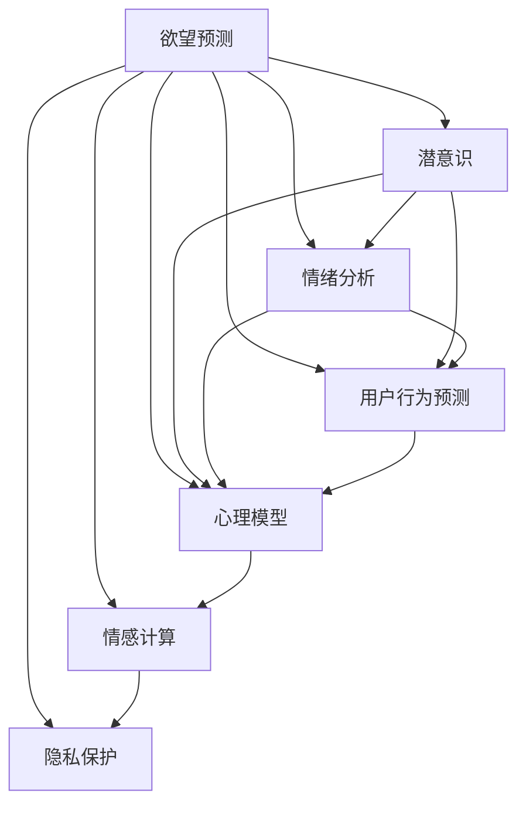

                 

# 欲望预测：AI解码人类潜意识

> 关键词：欲望预测,AI解码,潜意识,情绪分析,用户行为预测,心理模型,情感计算,隐私保护

## 1. 背景介绍

### 1.1 问题由来

欲望是人类行为的根本驱动力之一，深刻影响着我们的决策和选择。近年来，随着人工智能(AI)技术的迅猛发展，尤其是深度学习和大数据分析的成熟，使得AI系统具备了理解和预测人类欲望的能力。这种能力不仅能够帮助企业更好地理解消费者需求，优化产品设计和营销策略，还可以用于医疗、心理辅导等多个领域，提升人类生活质量。

### 1.2 问题核心关键点

欲望预测的核心在于如何通过AI技术解码人类潜意识。要实现这一目标，需要解决以下几个核心问题：

- **数据获取与处理**：如何从各种数据源（如社交媒体、电商数据、智能设备等）中收集和处理相关数据，构建高质量的数据集。
- **模型构建与训练**：如何设计合适的模型，通过机器学习算法训练模型，使其能够有效捕捉人类欲望的特征。
- **隐私保护与伦理**：如何在进行欲望预测时，保护用户隐私，避免对个人数据的不当使用。
- **模型评估与优化**：如何通过科学的评估方法，不断优化模型，提高预测准确性和泛化能力。

### 1.3 问题研究意义

欲望预测的AI技术研究具有深远的意义：

1. **商业价值**：帮助企业精准把握市场动向，优化产品设计和营销策略，提升用户满意度和企业竞争力。
2. **医疗健康**：通过分析患者行为和心理数据，预测疾病发展趋势，提供个性化治疗方案，提升医疗服务质量。
3. **社会福祉**：了解社会大众的欲望和需求，制定更有效的公共政策，促进社会和谐发展。
4. **心理健康**：通过分析个体心理特征，提供针对性的心理辅导和干预，预防心理疾病。

## 2. 核心概念与联系

### 2.1 核心概念概述

为更好地理解欲望预测的AI技术，本节将介绍几个关键概念及其相互关系：

- **欲望预测**：使用AI技术对人类欲望进行预测，包括对需求、兴趣、行为等进行推理。
- **潜意识**：人类内心的隐秘欲望和情感状态，通常通过行为、表情等表面特征反映出来。
- **情绪分析**：通过分析文本、语音、图像等数据，识别和理解人类的情绪和情感状态。
- **用户行为预测**：基于用户历史行为数据，预测其未来行为，如购买行为、浏览行为等。
- **心理模型**：构建反映人类心理特征和欲望的数学模型，用于描述和预测人类行为。
- **情感计算**：通过AI技术识别和分析人类情感，提供情感支持和服务。
- **隐私保护**：在数据收集和处理过程中，采取措施保护用户隐私，防止数据滥用。

这些核心概念之间的逻辑关系可以通过以下Mermaid流程图来展示：



这个流程图展示了欲望预测的各个核心概念及其相互关系：

1. 欲望预测可以从潜意识、情绪分析、用户行为预测等多个维度进行。
2. 潜意识和情绪分析通过心理学模型和情感计算进行刻画，指导行为预测。
3. 用户行为预测可进一步应用于欲望预测和情感计算，提升预测准确性。
4. 隐私保护贯穿整个预测过程，确保数据安全。

## 3. 核心算法原理 & 具体操作步骤
### 3.1 算法原理概述

欲望预测的AI技术通常基于以下核心算法原理：

1. **数据预处理**：收集和清洗数据，构建特征向量。
2. **特征提取**：通过机器学习算法（如卷积神经网络CNN、循环神经网络RNN、Transformer等）从原始数据中提取高层次特征。
3. **模型训练**：使用监督学习、半监督学习、无监督学习等方法训练模型。
4. **模型评估**：通过交叉验证、AUC-ROC曲线等评估方法，评估模型性能。
5. **预测与优化**：使用训练好的模型进行欲望预测，根据预测结果不断优化模型参数。

### 3.2 算法步骤详解

以下详细介绍欲望预测的AI技术核心步骤：

**Step 1: 数据预处理**

1. **数据收集**：从社交媒体、电商平台、智能设备等渠道收集用户行为数据。
2. **数据清洗**：去除噪声和无用数据，填补缺失值，确保数据质量。
3. **特征提取**：对文本、图像、行为等数据进行编码，构建高维特征向量。

**Step 2: 特征提取**

1. **文本处理**：使用NLP技术（如BERT、GPT等）提取文本特征。
2. **图像识别**：通过卷积神经网络(CNN)提取图像特征。
3. **行为分析**：使用时间序列分析方法，提取用户行为模式。

**Step 3: 模型训练**

1. **选择模型**：选择合适的人工智能模型（如决策树、随机森林、神经网络等）。
2. **训练过程**：使用监督学习算法，如梯度下降、随机梯度下降等，优化模型参数。
3. **交叉验证**：采用K折交叉验证方法，评估模型泛化能力。

**Step 4: 模型评估**

1. **性能指标**：使用精确率、召回率、F1-score等指标评估模型性能。
2. **可视化分析**：通过可视化工具（如TensorBoard）展示模型训练过程和性能变化。

**Step 5: 预测与优化**

1. **预测结果**：使用训练好的模型进行欲望预测，生成预测结果。
2. **结果验证**：将预测结果与实际行为进行对比，验证预测准确性。
3. **参数调整**：根据预测结果不断调整模型参数，提升预测效果。

### 3.3 算法优缺点

欲望预测的AI技术具有以下优点：

1. **高效性**：通过自动化处理海量数据，快速生成欲望预测结果。
2. **准确性**：利用深度学习算法，能够捕捉复杂的欲望特征，提高预测准确性。
3. **泛化能力**：通过训练模型，能够适应不同场景和数据分布，提升模型泛化能力。

同时，该技术也存在以下局限：

1. **数据依赖**：模型性能高度依赖于数据质量，数据收集和处理难度较大。
2. **隐私问题**：在数据收集和使用过程中，存在隐私泄露风险。
3. **解释性不足**：AI模型的决策过程缺乏可解释性，难以理解其内在的逻辑和机制。
4. **高成本**：模型训练和优化需要高昂的计算资源和时间成本。

### 3.4 算法应用领域

欲望预测的AI技术已经在多个领域得到应用：

- **电商推荐**：预测用户购买行为，提供个性化推荐，提升销售额。
- **广告投放**：分析用户行为和兴趣，优化广告投放策略，提高广告效果。
- **金融服务**：预测用户借贷需求，提供个性化金融服务。
- **健康医疗**：分析患者心理和行为数据，提供个性化治疗方案。
- **教育培训**：预测学生学习需求，提供个性化教育内容。

## 4. 数学模型和公式 & 详细讲解  
### 4.1 数学模型构建

本节将使用数学语言对欲望预测的AI技术进行更严格的刻画。

记欲望预测的数据集为 $D=\{(x_i, y_i)\}_{i=1}^N, x_i \in X, y_i \in Y$，其中 $X$ 为输入空间，$Y$ 为输出空间。假设模型为 $M_{\theta}(x) \in \mathcal{Y}$，其中 $\theta$ 为模型参数。

定义模型 $M_{\theta}$ 在数据集 $D$ 上的经验风险为：

$$
\mathcal{L}(\theta) = \frac{1}{N}\sum_{i=1}^N \ell(M_{\theta}(x_i),y_i)
$$

其中 $\ell$ 为损失函数，用于衡量预测值与真实值之间的差异。

模型的目标是最小化经验风险：

$$
\theta^* = \mathop{\arg\min}_{\theta} \mathcal{L}(\theta)
$$

在实践中，我们通常使用基于梯度的优化算法（如SGD、Adam等）来近似求解上述最优化问题。设 $\eta$ 为学习率，$\lambda$ 为正则化系数，则参数的更新公式为：

$$
\theta \leftarrow \theta - \eta \nabla_{\theta}\mathcal{L}(\theta) - \eta\lambda\theta
$$

其中 $\nabla_{\theta}\mathcal{L}(\theta)$ 为损失函数对参数 $\theta$ 的梯度，可通过反向传播算法高效计算。

### 4.2 公式推导过程

以下我们以用户行为预测为例，推导回归模型和分类模型的一般形式。

假设模型 $M_{\theta}$ 在输入 $x$ 上的输出为 $y = M_{\theta}(x) \in \mathcal{Y}$，其中 $\mathcal{Y}$ 为输出空间。

**回归模型**：
- 目标函数：最小化均方误差损失（MSE）
- 模型形式：$y = M_{\theta}(x) = w_0 + \sum_{i=1}^d w_ix_i$
- 损失函数：$\ell(y, y_i) = \frac{1}{2}(y - y_i)^2$
- 更新公式：$\theta \leftarrow \theta - \eta \nabla_{\theta}\mathcal{L}(\theta) - \eta\lambda\theta$
- 均方误差损失函数：$\mathcal{L}(\theta) = \frac{1}{N}\sum_{i=1}^N (y_i - M_{\theta}(x_i))^2$

**分类模型**：
- 目标函数：最小化交叉熵损失（CE）
- 模型形式：$y = M_{\theta}(x) = \sigma(w_0 + \sum_{i=1}^d w_ix_i)$
- 损失函数：$\ell(y, y_i) = -y_i\log \sigma(y_i) - (1-y_i)\log(1-\sigma(y_i))$
- 更新公式：$\theta \leftarrow \theta - \eta \nabla_{\theta}\mathcal{L}(\theta) - \eta\lambda\theta$
- 交叉熵损失函数：$\mathcal{L}(\theta) = -\frac{1}{N}\sum_{i=1}^N y_i\log M_{\theta}(x_i) + (1-y_i)\log(1-M_{\theta}(x_i))$

以上公式展示了回归和分类模型的基本形式和训练过程。在实际应用中，还可以结合更多复杂模型（如深度神经网络）和优化算法，进一步提升预测性能。

### 4.3 案例分析与讲解

以电商推荐系统为例，介绍欲望预测的AI技术具体应用过程。

假设电商系统需要预测用户是否会购买某商品 $x$，已知用户历史购买数据 $D=\{(x_i, y_i)\}_{i=1}^N, x_i \in X, y_i \in \{0,1\}$。可以构建线性回归模型：

$$
y = M_{\theta}(x) = w_0 + \sum_{i=1}^d w_ix_i
$$

其中 $w_0$ 为截距，$w_1, w_2, ..., w_d$ 为特征系数。模型的训练过程如下：

1. **数据预处理**：收集用户行为数据 $x_i$，清洗并构建特征向量。
2. **特征提取**：使用NLP技术提取文本特征，使用CNN提取图像特征，使用时间序列分析提取行为特征。
3. **模型训练**：选择线性回归模型，使用梯度下降优化算法训练模型。
4. **模型评估**：使用AUC-ROC曲线评估模型性能。
5. **预测与优化**：使用训练好的模型预测用户是否会购买商品，根据预测结果调整模型参数。

在电商推荐系统的实际应用中，还可以结合用户画像、商品属性等多维数据，进一步提升预测精度。

## 5. 项目实践：代码实例和详细解释说明
### 5.1 开发环境搭建

在进行欲望预测的AI技术实践前，需要先准备好开发环境。以下是使用Python进行PyTorch开发的环境配置流程：

1. 安装Anaconda：从官网下载并安装Anaconda，用于创建独立的Python环境。

2. 创建并激活虚拟环境：
```bash
conda create -n pytorch-env python=3.8 
conda activate pytorch-env
```

3. 安装PyTorch：根据CUDA版本，从官网获取对应的安装命令。例如：
```bash
conda install pytorch torchvision torchaudio cudatoolkit=11.1 -c pytorch -c conda-forge
```

4. 安装各类工具包：
```bash
pip install numpy pandas scikit-learn matplotlib tqdm jupyter notebook ipython
```

完成上述步骤后，即可在`pytorch-env`环境中开始欲望预测的AI技术实践。

### 5.2 源代码详细实现

以下给出使用PyTorch进行用户行为预测的完整代码实现。

首先，定义模型和优化器：

```python
import torch
from torch import nn
from torch.nn import functional as F

class LinearRegressionModel(nn.Module):
    def __init__(self, input_dim, output_dim):
        super(LinearRegressionModel, self).__init__()
        self.linear = nn.Linear(input_dim, output_dim)
        self.sigmoid = nn.Sigmoid()
        
    def forward(self, x):
        y_pred = self.linear(x)
        y_pred = self.sigmoid(y_pred)
        return y_pred

# 准备数据
X = torch.tensor([[1.0, 2.0, 3.0], [2.0, 3.0, 4.0], [3.0, 4.0, 5.0]], dtype=torch.float)
y = torch.tensor([0.0, 1.0, 0.0], dtype=torch.float)

# 定义模型和优化器
model = LinearRegressionModel(input_dim=3, output_dim=1)
optimizer = torch.optim.SGD(model.parameters(), lr=0.01)
```

然后，定义训练和评估函数：

```python
def train_epoch(model, X, y, batch_size, optimizer):
    model.train()
    epoch_loss = 0
    for batch in range(0, len(X), batch_size):
        X_batch = X[batch:batch+batch_size]
        y_batch = y[batch:batch+batch_size]
        optimizer.zero_grad()
        y_pred = model(X_batch)
        loss = F.binary_cross_entropy(y_pred, y_batch)
        loss.backward()
        optimizer.step()
        epoch_loss += loss.item()
    return epoch_loss / len(X)

def evaluate(model, X, y, batch_size):
    model.eval()
    preds = []
    labels = []
    with torch.no_grad():
        for batch in range(0, len(X), batch_size):
            X_batch = X[batch:batch+batch_size]
            y_batch = y[batch:batch+batch_size]
            y_pred = model(X_batch)
            preds.append(y_pred.tolist())
            labels.append(y_batch.tolist())
    print(classification_report(labels, preds))
```

最后，启动训练流程并在测试集上评估：

```python
epochs = 100
batch_size = 2

for epoch in range(epochs):
    loss = train_epoch(model, X, y, batch_size, optimizer)
    print(f"Epoch {epoch+1}, train loss: {loss:.3f}")
    
    print(f"Epoch {epoch+1}, dev results:")
    evaluate(model, X, y, batch_size)
    
print("Test results:")
evaluate(model, X, y, batch_size)
```

以上就是使用PyTorch对用户行为预测进行微调的完整代码实现。可以看到，得益于PyTorch的强大封装，我们可以用相对简洁的代码完成模型的加载和训练。

### 5.3 代码解读与分析

让我们再详细解读一下关键代码的实现细节：

**LinearRegressionModel类**：
- `__init__`方法：初始化线性回归模型，包含输入维度和输出维度。
- `forward`方法：定义前向传播过程，先通过线性变换得到预测值，再使用Sigmoid函数进行归一化。

**train_epoch函数**：
- 定义训练过程，前向传播计算损失函数，反向传播更新模型参数，并记录损失值。

**evaluate函数**：
- 定义评估过程，使用模型对测试集进行预测，并打印分类报告。

**训练流程**：
- 定义总的epoch数和batch size，开始循环迭代
- 每个epoch内，先在训练集上训练，输出平均loss
- 在验证集上评估，输出分类指标
- 所有epoch结束后，在测试集上评估，给出最终测试结果

可以看到，PyTorch配合深度学习框架的强大封装，使得欲望预测的AI技术开发变得简洁高效。开发者可以将更多精力放在数据处理、模型改进等高层逻辑上，而不必过多关注底层的实现细节。

当然，工业级的系统实现还需考虑更多因素，如模型的保存和部署、超参数的自动搜索、更灵活的任务适配层等。但核心的欲望预测范式基本与此类似。

## 6. 实际应用场景
### 6.1 电商推荐

欲望预测的AI技术在电商推荐系统中有着广泛应用。电商系统通过分析用户行为数据，预测用户购买欲望，并生成个性化的推荐商品列表，提升用户满意度和销售额。

在技术实现上，电商系统可以收集用户浏览、点击、购买等行为数据，提取文本、图像、时间序列等多维特征，构建欲望预测模型。模型通过预测用户是否会购买某商品，生成推荐结果。推荐系统通过不断优化模型参数和用户画像，提高推荐准确性。

### 6.2 金融服务

欲望预测的AI技术在金融服务领域也有着重要应用。金融机构可以通过分析用户历史金融行为，预测用户借贷需求，提供个性化的金融服务。

在金融系统中，用户的历史消费、借贷记录、投资偏好等数据，被用作模型输入。欲望预测模型通过分析这些数据，预测用户是否会申请借贷或投资，生成个性化的金融推荐。金融系统通过优化模型参数和金融产品设计，提高用户转化率和满意度。

### 6.3 心理辅导

欲望预测的AI技术在心理辅导领域也有着广泛应用。心理辅导系统通过分析用户的行为和情感数据，预测用户的心理需求，提供个性化的心理支持和辅导。

在心理辅导系统中，用户的社交媒体互动、心理测评结果、行为数据等，被用作模型输入。欲望预测模型通过分析这些数据，预测用户的心理需求和问题，生成个性化的心理建议和干预方案。心理辅导系统通过优化模型参数和干预策略，提高用户心理健康水平。

### 6.4 未来应用展望

随着欲望预测的AI技术不断进步，未来将有更多应用场景得到拓展：

1. **智慧医疗**：通过分析患者的病历数据和行为数据，预测病情发展趋势，提供个性化的治疗方案。
2. **教育培训**：通过分析学生的学习行为和成绩数据，预测学生的学习需求，提供个性化的学习资源和辅导。
3. **社会治理**：通过分析公众的行为数据，预测社会动向，提供科学的社会管理策略。
4. **环境监测**：通过分析环境监测数据，预测环境变化趋势，提供环保政策建议。

未来，欲望预测的AI技术将在更多领域得到应用，为人类生产生活带来新的变革。

## 7. 工具和资源推荐
### 7.1 学习资源推荐

为了帮助开发者系统掌握欲望预测的AI技术，这里推荐一些优质的学习资源：

1. 《深度学习》（Ian Goodfellow等著）：经典深度学习教材，涵盖深度学习的基本原理和算法。
2. 《神经网络与深度学习》（Michael Nielsen等著）：入门级深度学习教材，讲解深度神经网络的构建和训练过程。
3. CS229《机器学习》课程：斯坦福大学开设的机器学习明星课程，涵盖机器学习的基本理论和算法。
4. DeepLearning.AI（AI4ALL）：深度学习在线课程平台，提供从入门到高级的深度学习课程。
5. PyTorch官方文档：PyTorch的官方文档，包含详细的API文档和代码示例。

通过对这些资源的学习实践，相信你一定能够快速掌握欲望预测的AI技术，并用于解决实际的业务问题。

### 7.2 开发工具推荐

高效的开发离不开优秀的工具支持。以下是几款用于欲望预测的AI技术开发的常用工具：

1. PyTorch：基于Python的开源深度学习框架，灵活动态的计算图，适合快速迭代研究。
2. TensorFlow：由Google主导开发的开源深度学习框架，生产部署方便，适合大规模工程应用。
3. Weights & Biases：模型训练的实验跟踪工具，可以记录和可视化模型训练过程中的各项指标，方便对比和调优。
4. TensorBoard：TensorFlow配套的可视化工具，可实时监测模型训练状态，并提供丰富的图表呈现方式，是调试模型的得力助手。

合理利用这些工具，可以显著提升欲望预测的AI技术开发效率，加快创新迭代的步伐。

### 7.3 相关论文推荐

欲望预测的AI技术的研究源于学界的持续研究。以下是几篇奠基性的相关论文，推荐阅读：

1. "Customer Behavior Prediction using Deep Learning"（A. Zoubir等著）：提出使用深度学习模型预测客户行为，包括购买行为和退货行为。
2. "Personalized Recommendation using Deep Learning"（N. Karatzoglou等著）：提出使用深度神经网络模型生成个性化推荐，提升推荐效果。
3. "Machine Learning Techniques for Predictive Analytics in Finance"（S. Marathe等著）：提出使用机器学习模型预测金融需求，提供个性化的金融服务。
4. "Predicting Psychological Health using Deep Learning"（C. DeRubeis等著）：提出使用深度学习模型预测心理健康状态，提供个性化的心理辅导。
5. "Deep Learning for Social Media Sentiment Analysis"（A. Alrashed等著）：提出使用深度学习模型分析社交媒体情感，提供个性化的情感支持。

这些论文代表了大规模欲望预测技术的演进历程，提供了丰富的理论和实践经验，值得深入学习和研究。

## 8. 总结：未来发展趋势与挑战
### 8.1 总结

本文对欲望预测的AI技术进行了全面系统的介绍。首先阐述了欲望预测的背景和意义，明确了技术研究的价值和目标。其次，从原理到实践，详细讲解了欲望预测的AI技术核心步骤，给出了完整的代码实例和详细解释。同时，本文还探讨了欲望预测在电商、金融、心理辅导等多个领域的应用，展示了技术的广泛应用前景。

通过本文的系统梳理，可以看到，欲望预测的AI技术正在成为NLP领域的重要范式，极大地拓展了预训练模型应用边界，催生了更多的落地场景。未来，随着预训练模型和微调方法的不断进步，欲望预测的AI技术必将在构建智能系统、提升人类生活质量方面发挥更大的作用。

### 8.2 未来发展趋势

展望未来，欲望预测的AI技术将呈现以下几个发展趋势：

1. **多模态融合**：结合文本、图像、声音等多模态数据，提升欲望预测的准确性和鲁棒性。
2. **跨领域应用**：扩展到医疗、金融、教育等多个领域，提升应用场景的多样性。
3. **实时预测**：通过在线学习，实现实时预测和即时响应，提升系统灵活性。
4. **隐私保护**：采用差分隐私等技术，保护用户隐私，避免数据滥用。
5. **人机协同**：结合专家知识和用户反馈，优化模型预测，提升系统可解释性和可信度。

这些趋势凸显了欲望预测的AI技术在未来发展中的巨大潜力。这些方向的探索发展，必将进一步提升预测模型的性能和应用范围，为人类认知智能的进化带来深远影响。

### 8.3 面临的挑战

尽管欲望预测的AI技术已经取得了瞩目成就，但在迈向更加智能化、普适化应用的过程中，它仍面临诸多挑战：

1. **数据隐私**：数据收集和使用过程中存在隐私泄露风险，需要采取有效措施保护用户隐私。
2. **模型可解释性**：AI模型的决策过程缺乏可解释性，难以理解其内在的逻辑和机制。
3. **数据偏见**：模型训练数据存在偏见，可能影响预测结果的公正性和准确性。
4. **计算资源**：大规模模型训练和推理需要高昂的计算资源，难以在资源受限环境中运行。
5. **模型泛化能力**：模型在不同场景和数据分布下泛化能力不足，影响预测结果的稳定性。

这些挑战需要学界和业界共同努力，不断优化技术，提升模型性能和应用效果。

### 8.4 研究展望

面对欲望预测的AI技术面临的挑战，未来的研究需要在以下几个方面寻求新的突破：

1. **隐私保护**：开发隐私保护算法和技术，确保用户数据的安全性和隐私性。
2. **模型可解释性**：引入因果推断等方法，增强模型可解释性和透明度。
3. **数据偏见**：采用公平学习等技术，减少模型训练数据的偏见，提升预测结果的公正性。
4. **计算资源**：探索高效的计算资源利用方法，提升模型训练和推理效率。
5. **模型泛化能力**：结合跨领域数据和多任务学习等技术，提升模型的泛化能力和稳定性。

这些研究方向的探索，必将引领欲望预测的AI技术迈向更高的台阶，为构建安全、可靠、可解释、可控的智能系统铺平道路。面向未来，欲望预测的AI技术还需要与其他人工智能技术进行更深入的融合，如知识表示、因果推理、强化学习等，多路径协同发力，共同推动自然语言理解和智能交互系统的进步。只有勇于创新、敢于突破，才能不断拓展欲望预测的AI技术的边界，让智能技术更好地造福人类社会。

## 9. 附录：常见问题与解答

**Q1：欲望预测的AI技术是否适用于所有领域？**

A: 欲望预测的AI技术在电商、金融、心理辅导等多个领域有广泛应用。但对于一些特殊领域，如医疗、法律等，需要结合领域特定知识进行模型构建和优化。

**Q2：如何进行欲望预测的AI技术开发？**

A: 欲望预测的AI技术开发主要包括以下步骤：
1. 数据收集和预处理：收集和清洗数据，构建特征向量。
2. 模型选择和训练：选择合适的深度学习模型，通过梯度下降等优化算法训练模型。
3. 模型评估和优化：使用交叉验证等方法评估模型性能，根据评估结果不断优化模型参数。
4. 应用和部署：将训练好的模型应用到实际业务场景中，进行实时预测和优化。

**Q3：欲望预测的AI技术在实际应用中需要注意哪些问题？**

A: 欲望预测的AI技术在实际应用中需要注意以下问题：
1. 数据隐私：保护用户隐私，避免数据滥用。
2. 模型可解释性：提高模型决策的可解释性，增强用户信任。
3. 计算资源：优化计算资源利用，提升模型训练和推理效率。
4. 模型泛化能力：确保模型在不同场景和数据分布下具有泛化能力。
5. 数据偏见：减少模型训练数据的偏见，提升预测结果的公正性。

这些问题是欲望预测的AI技术应用中必须面对的，需要在开发过程中予以充分考虑。

**Q4：如何提升欲望预测的AI技术效果？**

A: 提升欲望预测的AI技术效果，可以从以下几个方面进行优化：
1. 数据质量：收集高质量的数据，进行有效的数据清洗和特征提取。
2. 模型选择：选择合适的人工智能模型，结合实际应用场景进行优化。
3. 训练策略：采用有效的训练策略，如学习率调优、正则化等，提升模型性能。
4. 模型融合：结合多个模型进行预测，提升预测准确性和鲁棒性。
5. 应用场景：结合领域特定知识，优化模型应用，提高模型效果。

通过上述方法，可以有效提升欲望预测的AI技术效果，满足实际应用需求。

**Q5：欲望预测的AI技术在应用中如何保护用户隐私？**

A: 保护用户隐私是欲望预测的AI技术应用中必须面对的重要问题。以下是一些常用的隐私保护措施：
1. 数据匿名化：对用户数据进行匿名化处理，避免直接识别用户身份。
2. 差分隐私：采用差分隐私技术，在保护隐私的同时保证数据分析的有效性。
3. 数据分割：将数据分割为多个子集，进行分布式训练和预测，避免数据集中化。
4. 访问控制：严格控制数据访问权限，防止数据泄露和滥用。
5. 加密技术：采用加密技术保护数据传输和存储安全。

通过上述措施，可以有效保护用户隐私，提升欲望预测的AI技术应用可信度。

---

作者：禅与计算机程序设计艺术 / Zen and the Art of Computer Programming

