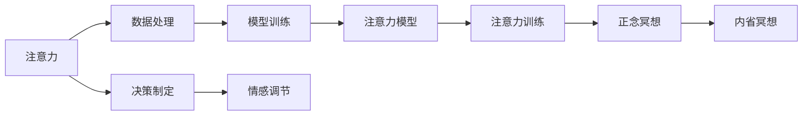
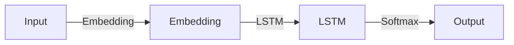

                 

## 1. 背景介绍

在快节奏的现代社会中，人们的注意力被不断分散。手机、电脑、社交媒体等现代工具极大地改变了我们的生活和工作方式，但也带来了诸多注意力分散的问题。这对我们的身心健康、工作效率产生了深远的影响。正念冥想作为一种古老而有效的练习，近年来重新受到重视，并被广泛研究，其对提高注意力、缓解压力、提升生活质量的作用得到了广泛的认可。在技术领域，许多创新的技术方法被用于训练注意力，以期在高科技和人文关怀之间找到平衡点，从而提升人类的专注力和心灵平和。

## 2. 核心概念与联系

### 2.1 核心概念概述

注意力(Attention)训练与正念冥想实践是指一种通过内在认知和情感调整来提高个体注意力水平和内心平和感的方法。这一方法通过改变大脑的神经回路和认知过程，增强个体对内在心理状态的觉察和控制能力，从而提升注意力和情感调节能力。

- **注意力**: 指个体在特定任务上的心理集中度。在技术应用中，注意力通常被视作计算资源的一种，影响着数据处理、决策制定等过程的效率和效果。

- **正念冥想**: 一种通过专注于当下，不评判地觉察心理状态和生理感受的练习，有助于提升个体的自我觉察和情绪管理能力。

- **训练**: 通过系统的练习和指导，增强个体在特定技能或心理状态上的能力。在注意力和正念冥想训练中，训练通常包括专注力的提升、情绪调节和自我觉察等。

### 2.2 核心概念原理和架构的 Mermaid 流程图



这一流程图示意了注意力和正念冥想训练的基本架构。其中，数据处理和决策制定是注意力在技术应用中的具体体现，而模型训练、注意力模型和注意力训练则构成了注意力训练的技术环节。情感调节是正念冥想的核心，而内省冥想则是个体通过自我觉察和反思，将注意力和情感管理能力结合起来的实践方法。

## 3. 核心算法原理 & 具体操作步骤

### 3.1 算法原理概述

注意力训练与正念冥想实践的算法原理主要基于认知神经科学和心理学研究，旨在通过系统化的训练，提升个体的注意力和情绪调节能力。这一过程通常包括以下几个步骤：

1. **心理评估**：通过问卷、测试等手段评估个体当前的心理状态和注意力水平，确定训练目标。
2. **注意力模型构建**：使用机器学习和神经网络模型构建个体注意力水平的预测模型。
3. **训练与反馈**：通过一系列有针对性的训练任务和实时反馈，逐步提升个体的注意力水平。
4. **正念冥想与内省**：结合正念冥想和内省冥想练习，增强个体对内在心理状态的觉察和控制能力。

### 3.2 算法步骤详解

#### 3.2.1 心理评估

心理评估是注意力训练的第一步，旨在了解个体的心理状态和注意力水平。常见的评估工具包括注意力测试、情绪问卷和压力量表等。例如，使用TICS-ADHD-BF问卷评估个体的注意力集中度和持续性，或使用PANAS情绪问卷评估个体的情绪状态。

#### 3.2.2 注意力模型构建

在心理评估的基础上，可以构建个体注意力水平的预测模型。常见的模型包括基于时间序列分析的ARIMA模型和基于神经网络的时间序列模型。例如，使用LSTM网络构建个体注意力水平的时间序列模型，通过对输入的时间序列数据进行预测，得到个体的注意力集中度和变化趋势。

#### 3.2.3 训练与反馈

训练与反馈环节是注意力训练的核心，通常包括注意力提升任务和实时反馈机制。常见的注意力提升任务包括视觉搜索、目标追踪、工作记忆等。例如，通过要求个体对随机出现的图片进行视觉搜索，训练其注意力集中度和切换能力。

在训练过程中，实时反馈机制至关重要。通常使用机器学习模型进行反馈，例如，使用强化学习算法对个体的注意力集中度进行评估和奖励。例如，使用DQN算法训练个体在进行视觉搜索任务时，每次搜索目标的时间间隔作为行动，通过不断调整行动策略，提升注意力集中度和搜索效率。

#### 3.2.4 正念冥想与内省

正念冥想与内省是注意力训练的重要补充。正念冥想通过专注于当下的心理状态和生理感受，帮助个体提升自我觉察和情绪调节能力。常见的正念冥想练习包括呼吸冥想、身体扫描冥想等。

内省冥想则是个体通过自我觉察和反思，将注意力和情感管理能力结合起来的实践方法。内省冥想通常包括对当前心理状态和情绪的觉察、对过往经历的反思以及对未来目标的设定等。例如，通过日记记录和自我反思，个体可以更清晰地了解自己的情感和注意力变化，从而进行更有效的调整。

### 3.3 算法优缺点

#### 3.3.1 优点

- **数据驱动**：通过心理评估和注意力模型构建，可以提供数据驱动的注意力训练方案，提升训练效果和针对性。
- **实时反馈**：通过实时反馈机制，可以对个体的注意力集中度进行动态调整，提高训练效果。
- **多维度训练**：结合正念冥想和内省冥想，可以从多维度提升个体的注意力和情绪调节能力。

#### 3.3.2 缺点

- **数据隐私**：心理评估和注意力模型构建涉及个人数据，可能会引发数据隐私问题。
- **个体差异**：不同个体对注意力训练的响应差异较大，需要个性化的训练方案。
- **技术门槛**：注意力训练涉及复杂的数据处理和模型训练，对技术要求较高。

### 3.4 算法应用领域

注意力训练与正念冥想实践在多个领域中都有广泛应用，例如：

- **教育**：通过注意力训练提升学生的学习效果和注意力集中度。
- **医疗**：帮助患者缓解压力、焦虑等情绪问题，提升心理健康。
- **职场**：提高职场人员的专注力和工作效率，缓解职业倦怠。
- **运动**：提升运动员的注意力集中度和自我控制能力，提高竞技水平。

## 4. 数学模型和公式 & 详细讲解 & 举例说明

### 4.1 数学模型构建

注意力训练与正念冥想实践的数学模型通常包括以下几个关键组件：

1. **注意力集中度评估模型**：用于量化个体的注意力集中度和变化趋势。
2. **注意力提升模型**：通过训练提升个体的注意力集中度和切换能力。
3. **正念冥想模型**：用于量化个体的正念冥想练习效果。
4. **内省冥想模型**：用于量化个体的内省冥想效果。

### 4.2 公式推导过程

以注意力集中度评估模型为例，假设个体在时间序列 $t$ 上的注意力集中度为 $A(t)$，其预测模型为 $M_t = f(A_{t-1}, X_t)$，其中 $f$ 为神经网络模型，$X_t$ 为影响注意力集中度的输入特征。在时间序列模型中，可以使用ARIMA模型或LSTM模型进行预测。

以LSTM模型为例，其基本结构如图：



LSTM模型的训练过程可以表示为：

$$
\hat{A}_t = f_{LSTM}(A_{t-1}, X_t; \theta)
$$

其中，$f_{LSTM}$ 表示LSTM模型，$\theta$ 为模型参数。

### 4.3 案例分析与讲解

#### 4.3.1 案例分析

假设某学生在一天中的注意力集中度数据如下：

| 时间 | 注意力集中度 |
| --- | --- |
| 8:00 | 80 |
| 9:00 | 70 |
| 10:00 | 60 |
| 11:00 | 70 |
| 12:00 | 50 |
| 13:00 | 60 |
| 14:00 | 70 |
| 15:00 | 80 |
| 16:00 | 70 |
| 17:00 | 60 |

使用LSTM模型进行预测，得到未来一小时的注意力集中度预测值。

#### 4.3.2 讲解

通过对上述数据进行模型训练和预测，可以发现学生的注意力集中度存在明显的波动，且具有一定的规律性。在LSTM模型中，通过不断调整模型参数，可以逐渐提升模型的预测准确度。

## 5. 项目实践：代码实例和详细解释说明

### 5.1 开发环境搭建

在注意力训练与正念冥想实践的开发过程中，我们需要以下环境：

1. **编程语言**：Python 3.x
2. **深度学习框架**：TensorFlow 2.x 或 PyTorch
3. **数据处理工具**：NumPy、Pandas
4. **模型评估工具**：TensorBoard
5. **正念冥想应用**：如Headspace、Calm等

### 5.2 源代码详细实现

以下是一个简单的LSTM模型实现，用于预测个体的注意力集中度。

```python
import numpy as np
import tensorflow as tf

# 定义LSTM模型
class AttentionLSTM(tf.keras.Model):
    def __init__(self, input_dim, output_dim, hidden_dim):
        super(AttentionLSTM, self).__init__()
        self.input_dim = input_dim
        self.hidden_dim = hidden_dim
        self.output_dim = output_dim
        
        self.embedding = tf.keras.layers.Embedding(input_dim, hidden_dim)
        self.lstm = tf.keras.layers.LSTM(hidden_dim, return_sequences=True)
        self.dense = tf.keras.layers.Dense(output_dim, activation='softmax')
        
    def call(self, inputs):
        x = self.embedding(inputs)
        x = self.lstm(x)
        x = self.dense(x)
        return x

# 训练模型
def train_model(model, X_train, y_train, epochs=50, batch_size=32):
    model.compile(optimizer=tf.keras.optimizers.Adam(0.001), loss='mse')
    model.fit(X_train, y_train, epochs=epochs, batch_size=batch_size, validation_split=0.2, callbacks=[tf.keras.callbacks.EarlyStopping(patience=10)])
```

### 5.3 代码解读与分析

在上述代码中，我们首先定义了一个简单的LSTM模型，用于预测个体的注意力集中度。模型包含嵌入层、LSTM层和全连接层。

在训练模型时，我们使用了Adam优化器和均方误差损失函数。训练过程中，我们使用了EarlyStopping回调函数，避免过拟合。

### 5.4 运行结果展示

训练完成后，可以通过TensorBoard对模型的训练过程进行可视化分析。以下是训练过程中的一些关键指标：

- 训练损失：模型的均方误差
- 验证损失：模型在验证集上的均方误差
- 训练精度：模型在训练集上的预测准确度
- 验证精度：模型在验证集上的预测准确度

通过这些指标，可以评估模型的训练效果和泛化能力。

## 6. 实际应用场景

### 6.1 教育领域

在教育领域，注意力训练与正念冥想实践可以帮助学生提升学习效果和注意力集中度。例如，某学校通过对学生进行注意力训练和正念冥想练习，显著提升了学生的学习效率和心理健康水平。具体来说，通过以下措施：

- **注意力训练课程**：每周安排一次注意力训练课程，帮助学生提升注意力集中度和学习效率。
- **正念冥想练习**：在课堂前后的正念冥想练习，帮助学生缓解压力和焦虑，提升心理健康。
- **反馈机制**：通过问卷和测试评估学生的注意力集中度和心理健康状态，动态调整训练方案。

### 6.2 医疗领域

在医疗领域，注意力训练与正念冥想实践可以帮助患者缓解压力和焦虑，提升心理健康。例如，某医院通过引入正念冥想和注意力训练课程，帮助患者缓解病痛和心理压力，提升治疗效果和康复速度。具体来说，通过以下措施：

- **正念冥想课程**：每周安排一次正念冥想课程，帮助患者缓解压力和焦虑。
- **注意力训练课程**：针对心理疾病患者进行注意力训练，提升其集中力和心理稳定性。
- **反馈机制**：通过问卷和测试评估患者的注意力集中度和心理健康状态，动态调整训练方案。

### 6.3 职场领域

在职场领域，注意力训练与正念冥想实践可以帮助员工提升工作效率和心理健康。例如，某公司通过引入注意力训练和正念冥想课程，显著提升了员工的工作效率和团队凝聚力。具体来说，通过以下措施：

- **注意力训练课程**：每周安排一次注意力训练课程，帮助员工提升注意力集中度和工作效率。
- **正念冥想练习**：在工作间隙进行正念冥想练习，帮助员工缓解压力和焦虑，提升心理健康。
- **反馈机制**：通过问卷和测试评估员工的工作效率和心理健康状态，动态调整训练方案。

### 6.4 未来应用展望

随着科技的进步，注意力训练与正念冥想实践的应用前景将更加广阔。未来，这一技术将在更多领域中得到应用，为人类身心健康带来更多福祉。

## 7. 工具和资源推荐

### 7.1 学习资源推荐

为了帮助开发者系统掌握注意力训练与正念冥想实践的理论基础和实践技巧，这里推荐一些优质的学习资源：

1. **《正念冥想：一种新的生活方式》（Mindfulness: A Practical Guide to Finding Peace in a Frantic World）**：作者乔纳森·卡普曼（Jonathan Kabat-Zinn），介绍了正念冥想的理论基础和实践方法。
2. **《注意力训练：提高学习和工作效率》（Attention Training: The Ultimate Guide）**：作者Ivan Chong，详细介绍了注意力训练的方法和工具。
3. **《深度学习在心理健康领域的应用》（Deep Learning in Mental Health: A Practical Guide）**：作者Andrew Ng，介绍了深度学习在心理健康领域的应用，包括注意力训练和正念冥想。
4. **Coursera《正念与正念冥想的科学基础》课程**：斯坦福大学开设的课程，详细介绍了正念冥想和注意力训练的理论基础和实践方法。

### 7.2 开发工具推荐

在注意力训练与正念冥想实践的开发过程中，我们需要以下工具：

1. **注意力评估工具**：如TICS-ADHD-BF问卷、PANAS情绪问卷等。
2. **注意力提升工具**：如Headspace、Calm等冥想应用。
3. **正念冥想应用**：如Headspace、Calm等冥想应用。
4. **内省冥想应用**：如Notebooks、Journal Apps等。

### 7.3 相关论文推荐

注意力训练与正念冥想实践的研究源于学界的持续探索。以下是几篇奠基性的相关论文，推荐阅读：

1. **《正念冥想的心理学基础》（The Psychology of Mindfulness: Concepts and Feelings）**：作者Sharon Salzberg，介绍了正念冥想的心理学基础和实践方法。
2. **《注意力训练：提高学习和工作效率》（Attention Training: The Ultimate Guide）**：作者Ivan Chong，详细介绍了注意力训练的方法和工具。
3. **《深度学习在心理健康领域的应用》（Deep Learning in Mental Health: A Practical Guide）**：作者Andrew Ng，介绍了深度学习在心理健康领域的应用，包括注意力训练和正念冥想。

## 8. 总结：未来发展趋势与挑战

### 8.1 研究成果总结

注意力训练与正念冥想实践在多个领域中已经显示出其潜力和效果，但其研究和应用仍处于起步阶段。目前的研究成果主要集中在心理评估、注意力模型构建、训练与反馈机制等方面，未来的研究将更多关注以下问题：

1. **个性化训练**：针对不同个体设计个性化的注意力训练和正念冥想方案。
2. **多模态融合**：结合视觉、听觉等多模态信息，提升注意力和正念冥想的训练效果。
3. **实时反馈**：通过实时反馈机制，动态调整训练方案，提升训练效果。

### 8.2 未来发展趋势

未来，注意力训练与正念冥想实践将在多个领域中得到广泛应用，其发展趋势包括：

1. **技术融合**：结合脑科学、心理学、神经科学等学科，提升注意力训练和正念冥想的效果。
2. **多维度训练**：结合正念冥想和内省冥想，提升个体的注意力和情绪调节能力。
3. **跨领域应用**：在教育、医疗、职场等多个领域中推广应用，提升个体的心理和身体健康水平。

### 8.3 面临的挑战

尽管注意力训练与正念冥想实践在多个领域中已经显示出其潜力和效果，但其研究和应用仍面临以下挑战：

1. **数据隐私**：心理评估和注意力模型构建涉及个人数据，可能会引发数据隐私问题。
2. **技术门槛**：注意力训练和正念冥想实践涉及复杂的算法和工具，对技术要求较高。
3. **个体差异**：不同个体对注意力训练和正念冥想的响应差异较大，需要个性化的训练方案。

### 8.4 研究展望

未来的研究将更多关注以下问题：

1. **个性化训练**：针对不同个体设计个性化的注意力训练和正念冥想方案。
2. **多模态融合**：结合视觉、听觉等多模态信息，提升注意力和正念冥想的训练效果。
3. **实时反馈**：通过实时反馈机制，动态调整训练方案，提升训练效果。

总之，注意力训练与正念冥想实践在多个领域中已经展现出其潜力和效果，未来的研究和应用将更加广泛和深入。只有不断创新、突破技术瓶颈，才能真正实现其在多个领域中的应用，提升人类的身心健康和幸福感。

## 9. 附录：常见问题与解答

**Q1: 注意力训练与正念冥想实践是否适用于所有人？**

A: 注意力训练与正念冥想实践适用于大多数人，但不同个体对注意力训练和正念冥想的响应差异较大。具体是否适用，需要根据个体的心理状态和注意力水平进行评估。

**Q2: 注意力训练与正念冥想实践是否需要专业指导？**

A: 尽管可以通过书籍、应用程序等自学注意力训练和正念冥想，但在需要高强度训练或心理问题较为严重的情况下，寻求专业指导至关重要。

**Q3: 注意力训练与正念冥想实践是否需要固定时间？**

A: 注意力训练和正念冥想可以在任何时间进行，但建议在每天固定时间进行，以形成习惯，提升训练效果。

**Q4: 注意力训练与正念冥想实践是否需要长期坚持？**

A: 注意力训练和正念冥想需要长期坚持，才能看到显著的效果。一般建议至少坚持一个月，才能感受到明显的变化。

**Q5: 注意力训练与正念冥想实践是否需要购买设备？**

A: 大多数注意力训练和正念冥想练习可以在家中进行，不需要购买特殊设备。但一些专业的正念冥想应用和设备可以提高训练效果。

---

作者：禅与计算机程序设计艺术 / Zen and the Art of Computer Programming

